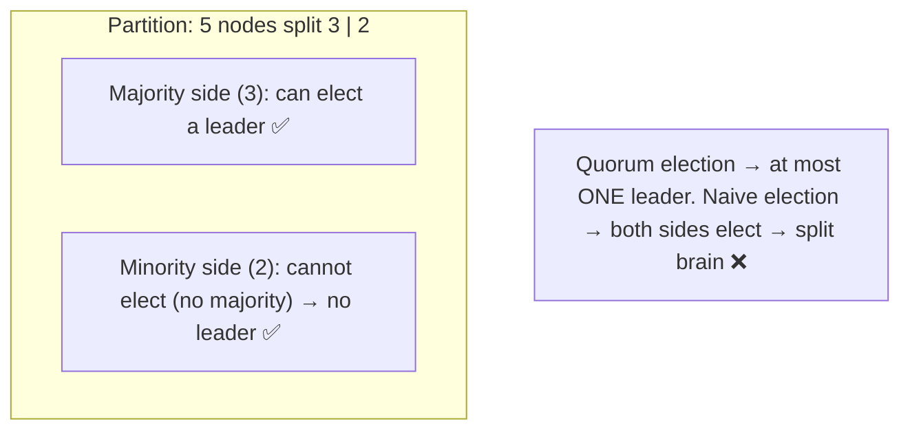
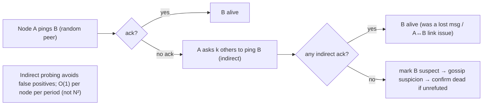

# Lesson 8.3.5 — Leader Election, Failure Detectors, and Membership (Gossip, SWIM)

> Part 8: Distributed Systems Core · Module 8.3: Coordination & Consensus · Difficulty: 🔴
>
> **Prerequisites:** [8.3.1 Consensus], [8.3.3 Raft], [8.3.4 Quorums], [8.1.3 Failure Detection].
> **Unlocks:** [8.3.6 Distributed Locks], [8.3.8 ZooKeeper/etcd], [7.4 Rebalancing], [Part 11 Failover].

---

## 1. Learning Objectives

After this lesson you will be able to:

- Explain **leader election** (agreeing on a single coordinator), why a leader simplifies coordination, and how it's done **safely** (consensus/majority — 8.3.1/8.3.4) vs **unsafely** (naive races → split brain).
- Distinguish **failure detection** (suspecting a node is down — 8.1.3) from **membership** (the agreed set of live nodes), and the **strong-vs-weak / consistent-vs-eventual** membership tradeoff.
- Describe **gossip protocols** (epidemic dissemination) and **SWIM** (scalable failure detection + membership) — how they spread state and detect failures **scalably** without a central coordinator or all-to-all heartbeats.
- Choose between **consensus-based membership** (ZooKeeper/etcd — strongly consistent, smaller scale) and **gossip-based membership** (Cassandra/Serf — eventually consistent, massive scale), and avoid the classic failures (false-positive failovers, partition split-brain).

---

## 2. Motivation — Who's in charge, and who's alive?

Two coordination questions recur constantly: **"who is the leader?"** and **"which nodes are currently alive (the membership)?"** Almost every distributed system needs answers. A **leader** dramatically simplifies coordination — instead of all nodes negotiating symmetrically (dueling proposers — 8.3.2), one node makes decisions and others follow (Raft's strong leader — 8.3.3, the primary in replication — 5.4.2, the coordinator for sharding/rebalancing — 7.4). But electing a leader is itself a consensus problem (8.3.1), and doing it **naively** (whoever notices the old leader is gone grabs the role) produces the disaster we keep meeting: **two leaders** (split brain — 8.1.1), divergent state, corruption. So leader election must be done **safely** (via majority/consensus), and the elected leader must be **fenced** so a deposed-but-not-dead leader can't keep acting (8.3.6).

The membership question is just as fundamental and, at scale, harder. To route requests (7.3), replicate (5.4.2), rebalance (7.4), and elect leaders, nodes must know **who's in the cluster and who's up** — but failure detection is undecidable (8.1.3, slow vs dead), the set changes constantly (nodes join/leave/crash), and at thousands of nodes you **cannot** have everyone heartbeat everyone (N² messages). This is where **gossip protocols** and **SWIM** come in: scalable, decentralized ways to **spread membership/state** and **detect failures** with bounded, low overhead — the backbone of large clusters (Cassandra, Consul, Serf). This lesson covers safe leader election, the failure-detection-vs-membership distinction, and the gossip/SWIM machinery that makes membership work at scale — tying together quorums (8.3.4), failure detection (8.1.3), and consensus (8.3.1).

---

## 3. Theory — From first principles

### 3.1 Leader election — what and why

**Leader election** is the process of the nodes **agreeing on a single node to act as coordinator/leader** `[CS]`. A leader is valuable because it **avoids symmetric coordination**: one node sequences decisions (the next log entry — 8.3.3, the order of operations, who owns what — 7.3), and others follow. This sidesteps dueling-proposer livelock (8.3.2), gives a natural place to **serialize** operations (a single point of order — 8.2.3), and simplifies reasoning. Most strong-consistency systems are **leader-based** (Raft, primary-replica DBs — 5.4.2, Kafka partition leaders — Part 9).

The catch: a leader is a **single point of coordination** (and potential bottleneck/SPOF), and electing one **safely** is essential — a botched election gives **two** leaders (§3.2).

### 3.2 Safe vs unsafe leader election

**Unsafe (naive) election** `[CS]`: "when the leader seems gone, the first node to notice declares itself leader." This fails because of **undecidable failure** (8.1.3) and **partitions** (8.1.1): the old leader might be **slow, not dead** (false positive), or a **partition** might let each side elect its own leader → **two leaders** → split brain → divergent/corrupt state. Naive election is the classic split-brain generator.

**Safe election** `[BP]`: require a **majority (quorum)** to elect a leader (8.3.4) — exactly Raft's mechanism (8.3.3 §3.2). Because **two disjoint majorities can't exist**, **at most one leader** can be elected at a time (Election Safety — 8.3.3 §3.5). During a partition, **only the majority side** can elect a leader; the minority side **cannot** (and must not act as leader) — sacrificing availability on the minority side to preserve safety (FLP/CAP — 8.3.1, Part 10). Safe election = **consensus on who's leader**, which is why systems delegate it to a consensus service (ZooKeeper/etcd — 8.3.8) or build it into their consensus protocol (Raft).

**And fencing (8.3.6):** even with safe election, a deposed-but-alive old leader might still *think* it's leader and keep issuing commands. The new leader/operations must carry a **fencing token** (a monotonically increasing epoch/term — like Raft's term, 8.3.3) so downstream systems **reject** the stale leader's commands. Election + fencing together prevent split-brain damage.

### 3.3 Failure detection vs membership

Two related but distinct concerns `[CS]`:
- **Failure detection (8.1.3):** the local act of **suspecting** a specific node is down (via heartbeats/timeouts/phi-accrual) — inherently a **guess** (slow vs dead undecidable).
- **Membership:** the **agreed-upon set** of nodes currently considered part of the cluster (alive/joined). Membership is built *on top of* failure detection — it's the shared answer to "who's in the cluster right now," used for routing, replication, quorum computation, and leader eligibility.

The key design axis: **how consistent must membership be?**
- **Strong/consistent membership:** all nodes agree on the *exact* membership at all times (via consensus — 8.3.1). Necessary when membership affects **quorum/safety** (e.g., who can vote — a wrong membership view could create two majorities → split brain). Used by ZooKeeper/etcd. **Cost:** consensus overhead → doesn't scale to thousands of nodes; membership changes are coordinated.
- **Weak/eventual membership:** nodes have *approximately* consistent, eventually-converging views (via **gossip**). Tolerates temporary disagreement about who's up. Scales to **thousands** of nodes cheaply. Used by Cassandra/Consul-Serf for the *data-plane* membership. **Cost:** views can briefly diverge — fine for routing/load-spreading, **not** for safety-critical quorum decisions (which need strong membership).
**Rule** `[BP]`: use **strong membership (consensus) for safety-critical roles** (leader eligibility, quorum config) and **gossip-based eventual membership for large-scale routing/dissemination**; many systems use **both** (a small consensus core for config + gossip for the big fleet).

### 3.4 Gossip protocols (epidemic dissemination)

**Gossip** (epidemic protocols) spread information through a cluster the way rumors/diseases spread `[CS]`:
- Periodically (every gossip interval), each node picks a **few random peers** and exchanges state (membership lists, versions, metadata, failure suspicions). Each node merges what it learns (taking the newer version per item — often via version numbers / vector clocks — 8.2.2).
- Information spreads **exponentially** — like an epidemic, a fact known to one node reaches the whole cluster in **O(log N)** rounds — so it's **fast and scalable** without any central coordinator or all-to-all messaging.
- **Properties:** **decentralized** (no SPOF/coordinator), **scalable** (each node talks to only a few peers per round → constant per-node overhead regardless of N), **robust** (tolerates message loss and node failures — redundant paths), **eventually consistent** (views converge over a few rounds, but are temporarily stale/divergent).
- **Uses:** membership dissemination, failure-suspicion spreading, config/metadata propagation, anti-entropy (syncing replicas — Part 10). Cassandra uses gossip for cluster membership and state; Consul/Serf use it (with SWIM) for membership and failure detection.

**Tradeoff:** gossip gives **scalable, robust, eventually-consistent** dissemination — perfect for large-fleet membership/metadata, but **not** for decisions needing immediate agreement (use consensus for those).

### 3.5 SWIM — scalable failure detection + membership

Naive failure detection has each node heartbeat **every** other node → **O(N²)** messages → doesn't scale. **SWIM** (Scalable Weakly-consistent Infection-style Membership) fixes this `[EMERGING]`:
- **Separate failure detection from dissemination.** Detection: each node periodically **pings one random peer**; if no ack, it asks **k other random nodes** to **ping that peer on its behalf** (**indirect probing**) — this avoids false positives from a single lost message or one bad link, and keeps detection **O(1) per node per period** (constant, not N²).
- **Dissemination:** membership updates and failure suspicions **piggyback on the ping/ack messages** (gossip-style infection) rather than a separate flood → very low overhead.
- **Suspicion mechanism:** a node that fails probing is marked **suspect** (not immediately dead) and the suspicion is gossiped; if no one refutes it within a timeout, it's promoted to **dead** (and removed). This **suspicion → confirmation** flow reduces false positives (a slow node can refute) — addressing the slow-vs-dead problem (8.1.3) at the membership layer.
- **Result:** failure detection + membership that scales to **very large clusters** with **constant per-node load**, fast detection, and bounded false positives. Used by Consul/Serf (HashiCorp's memberlist), and influences many systems.

### 3.6 Consensus-based vs gossip-based membership — choosing

`[BP]`
| | Consensus-based (ZK/etcd) | Gossip/SWIM (Cassandra/Serf) |
|---|---|---|
| Consistency | strong (everyone agrees exactly) | eventual (views converge, briefly diverge) |
| Scale | smaller (3–7 core nodes; clients watch) | thousands of nodes |
| Use | safety-critical: leader eligibility, quorum config, locks | data-plane: routing, load-spreading, large-fleet membership |
| Failure detection | timeouts + quorum | SWIM-style probing + suspicion |
| Cost | consensus latency; bounded cluster size | low per-node overhead; temporary staleness |

- **Use consensus membership** when a **wrong/divergent view threatens safety** (could two nodes both think they're leader? could two disjoint quorums form?) — keep this set **small** and strongly consistent.
- **Use gossip/SWIM membership** for **scale** — routing, replica placement, spreading metadata across a huge fleet, where eventual consistency is fine.
- **Hybrid (common)** `[CONV]`: a small **consensus core** (ZooKeeper/etcd) holds the authoritative config/leader, while **gossip** disseminates membership/health across the large data fleet (e.g., Kafka historically used ZooKeeper for controller/metadata while brokers gossiped health; many systems pair the two).

### 3.7 Pitfalls: false positives, partitions, and flapping

`[CS]`
- **False-positive failover:** a **slow** (not dead) leader is wrongly declared down → unnecessary failover; if the old leader is still alive → **two leaders** unless **fenced** (8.3.6). Mitigate with **good failure detection** (phi-accrual, indirect probing — 8.1.3/§3.5), **quorum-gated** election (§3.2), and **fencing tokens** (8.3.6).
- **Partition split-brain:** each partition side elects its own leader if election isn't quorum-based → divergence. Mitigate with **majority quorums** (only one side can win — §3.2, 8.3.4).
- **Flapping:** a node oscillating between suspect/alive (intermittent network) causes **membership churn** → routing instability, rebalance storms (7.4). Mitigate with **suspicion timeouts/hysteresis** (don't react instantly), **indirect probing** (SWIM), and **dampening**.
- **Gossip convergence lag:** during a change, views temporarily disagree → transient mis-routing (acceptable for data-plane, **not** for safety decisions — use consensus there) (§3.3).

---

## 4. Visual Intuition

### Safe (quorum) vs unsafe leader election under partition

### SWIM: direct + indirect probing

---

## 5. Real-World Analogy

Imagine a **large company with many offices** that needs (a) **one person in charge** of a decision and (b) an up-to-date **directory of who's currently at work**.

- **Leader election (safe vs unsafe):** if the manager is unreachable, you **don't** let the first person who notices declare themselves boss — during a phone outage, *every* office might do that, and now you have **five "bosses"** giving conflicting orders (split brain). Instead, becoming boss requires a **majority of offices to vote you in** — so even if the company is split by an outage, **only the side with most offices** can appoint a boss; the smaller side knows it can't and waits. And new orders carry an **"administration number"** (fencing) so if the old boss reappears, everyone ignores their stale orders.
- **Failure detection vs membership:** *failure detection* is one office privately suspecting "I haven't heard from the Tokyo office — are they closed or just busy?" *Membership* is the **shared, agreed directory** of who's open today, built from everyone's observations.
- **Gossip:** nobody calls all 1,000 offices (that's 1,000,000 calls). Instead, each office, each morning, **calls a few random offices** and they swap the latest directory updates ("Tokyo's back; Berlin's down"). Within a few rounds, the news has **spread to everyone** like a rumor — fast, no central operator, survives some dropped calls.
- **SWIM (indirect probing):** before declaring "Tokyo is closed," you don't rely on your *one* failed call — you ask a **few other offices to also try Tokyo**. If *they* reach Tokyo, it was just your bad phone line (false positive avoided). Only if **nobody** can reach Tokyo do you mark it "suspected closed," spread that suspicion, and confirm it if Tokyo doesn't speak up.
- **Strong vs eventual directory:** for **safety-critical** decisions (who's the one boss), you use a **strict, agreed roster** (consensus). For **routing mail** to whoever's open, an **approximately-current directory** (gossip) is good enough and scales to thousands of offices.

---

## 6. Industry Example

- **Raft/ZooKeeper/etcd leader election** `[CONV]`: quorum-based, split-brain-proof leader election as a service or built-in (8.3.3/8.3.8); used for primary election, controller election, lock ownership. *(Representative.)*
- **Cassandra gossip** `[CONV]`: uses a gossip protocol for cluster membership and node state dissemination, and **phi-accrual** failure detection (8.1.3) — scales to large rings (§3.4). *(Representative.)*
- **SWIM in Consul/Serf (memberlist)** `[EMERGING]`: HashiCorp's gossip+SWIM library for scalable membership and failure detection across large fleets (§3.5). *(Representative.)*
- **Kafka controller** `[CONV]`: historically used ZooKeeper for controller (leader) election and broker membership/metadata; newer versions (KRaft) use Raft directly — both quorum-based (§3.6, Part 9). *(Representative.)*
- **Hybrid (consensus core + gossip fleet)** `[CONV]`: a common pattern — small strongly-consistent core for config/leader + gossip for large-fleet health/membership (§3.6). *(Representative.)*

---

## 7. Implementation Details — election & membership in practice

- **Elect leaders via quorum/consensus**, never naively — use Raft (8.3.3) or a consensus service (ZooKeeper/etcd ephemeral nodes + watches — 8.3.8); guarantee at most one leader (§3.2) `[BP]`.
- **Fence the leader** with a monotonic epoch/term so a deposed-but-alive leader's commands are rejected downstream (8.3.6) — election alone doesn't prevent split-brain *damage* (§3.2/3.7).
- **Use strong (consensus) membership for safety-critical roles** (leader eligibility, quorum config) and keep that set small; use **gossip/SWIM for large-fleet membership/health** (§3.3/3.6).
- **Use good failure detection** (indirect probing/SWIM, phi-accrual — 8.1.3/§3.5) and **suspicion + confirmation** to cut false positives; **quorum-gate** drastic actions (failover) (§3.7).
- **Add hysteresis/dampening** to membership changes to avoid **flapping** → routing/rebalance churn (§3.7, 7.4).
- **Distinguish slow vs dead** (8.1.3) — don't evict/failover a merely-slow node (cascades — 7.4) (§3.7).
- **Gossip with versioned state** (version numbers/vector clocks — 8.2.2) so merges take the newest info and converge (§3.4).
- **Place quorum/membership members across failure domains** (AZs) so one failure can't break the majority (8.3.4, Part 13).

---

## 8. Advantages

**Leader-based coordination:** simplifies ordering/decisions (one coordinator); avoids symmetric livelock (§3.1).
**Safe (quorum) election:** at most one leader; split-brain-proof (§3.2, 8.3.4).
**Gossip:** decentralized (no SPOF), scalable (O(1)/node), robust (loss-tolerant), fast (O(log N) spread) (§3.4).
**SWIM:** scalable failure detection + membership at constant per-node cost; low false positives via indirect probing (§3.5).
**Hybrid:** strong consistency where safety needs it + gossip scale where it doesn't (§3.6).

---

## 9. Disadvantages / limitations

- **Leader = bottleneck/SPOF** (mitigated by fast failover / sharding into many groups — 8.3.3, 7.3); a failover has a brief unavailability window.
- **Election needs a majority** → minority side unavailable during partition (§3.2, FLP/CAP).
- **Failure detection is undecidable** → false positives (slow-as-dead) → needless/dangerous failovers without fencing (§3.7, 8.1.3).
- **Gossip is eventually consistent** → temporary view divergence; unsafe for safety-critical decisions (§3.3/3.4).
- **Flapping/churn** from intermittent networks → routing instability/rebalance storms (§3.7, 7.4).
- **Consensus membership doesn't scale** to huge fleets (bounded core size) (§3.3).

---

## 10. When NOT to / limits

- **Don't use naive (non-quorum) leader election** — split-brain generator (§3.2).
- **Don't use gossip/eventual membership for safety-critical decisions** (who can vote, who's the sole leader) — use consensus (§3.3/3.6).
- **Don't use all-to-all heartbeats at scale** (O(N²)) — use SWIM/gossip (§3.5).
- **Don't failover on a single missed heartbeat / mere slowness** — require strong evidence + fencing (§3.7, 8.1.3).
- **Don't run consensus membership across thousands of nodes** — keep the consensus core small; gossip the fleet (§3.3).

---

## 11. Common Mistakes

1. **Naive "first to notice becomes leader"** → two leaders under partition/slow-leader → split brain (§3.2).
2. **Election without fencing** → a returning old leader keeps issuing commands → corruption (§3.2/3.7, 8.3.6).
3. **Using eventual (gossip) membership for quorum/safety decisions** → divergent views → two majorities (§3.3).
4. **All-to-all heartbeats** → O(N²) traffic, doesn't scale (§3.5).
5. **Failover on a slow (not dead) node** → unnecessary failover / two leaders / cascade (§3.7, 7.4).
6. **No hysteresis** → membership flapping → routing churn / rebalance storms (§3.7, 7.4).
7. **Consensus membership at huge scale** → coordination overhead cripples the cluster (§3.3).
8. **Ignoring partition behavior** → undefined who's leader during a split (§3.2/3.7).

---

## 12. Interview Questions

**🟢 Easy**
- Why do many systems elect a leader, and what's the danger of doing it naively?
- What's the difference between failure detection and membership?

**🟡 Medium**
- How does quorum-based election prevent two leaders during a partition? Why is fencing still needed?
- What is a gossip protocol, and why does it scale better than all-to-all heartbeats?

**🔴 Hard**
- Explain SWIM: how do direct + indirect probing and suspicion reduce false positives and keep failure detection O(1) per node?
- Compare consensus-based vs gossip-based membership. Which would you use for leader eligibility vs large-fleet routing, and why?

**⚫ Staff+**
- Design membership + leader election for a 2,000-node system that needs both safe single-leader coordination for a metadata service and scalable health/membership across the fleet. Combine a consensus core (election/config) with gossip/SWIM (fleet membership), handle partitions (no split-brain), false positives (fencing + good detection), and flapping (hysteresis). 
- A slow GC pause on the primary triggered a failover, then the old primary resumed and both accepted writes for 30 seconds, corrupting data. Diagnose each failure (detection, election, fencing) and design the fix (phi-accrual + indirect probing, quorum election, fencing tokens, write rejection of stale epochs) (§3.7, 8.1.3, 8.3.6).

---

## 13. Production Pitfalls

- **Slow-primary false failover → dual leaders:** a GC pause/overload makes a healthy primary look dead; a new one is elected; the old resumes → two leaders accepting writes → corruption (no fencing) (§3.7, 8.3.6).
- **Partition split-brain:** non-quorum election lets both partition sides elect leaders → divergent state on heal (§3.2).
- **Membership flapping storm:** an intermittent link makes a node oscillate suspect/alive → constant routing changes and rebalance churn (7.4) → instability (§3.7).
- **O(N²) heartbeat meltdown:** all-to-all health checks at scale saturate the network (§3.5) — fixed by SWIM/gossip.
- **Stale gossip view mis-routing:** during convergence, some nodes route to a just-departed node → transient errors (acceptable for data-plane, not safety) (§3.3/3.4).
- **Consensus-membership scale wall:** trying to run strongly-consistent membership over thousands of nodes → coordination overhead degrades the whole cluster (§3.3).

---

## 14. Optimization Techniques

- **Quorum/consensus election + fencing tokens** — split-brain-proof leadership (§3.2, 8.3.4/8.3.6) `[BP]`.
- **SWIM (direct+indirect probing, suspicion)** — scalable, low-false-positive failure detection (§3.5).
- **Gossip with versioned state** — O(log N) convergence, O(1)/node, robust dissemination (§3.4).
- **Hybrid: small consensus core + gossip fleet** — strong where needed, scalable where not (§3.6).
- **phi-accrual detection + quorum-gated failover** — accurate-enough, evidence-based drastic actions (8.1.3, §3.7).
- **Hysteresis/dampening on membership** — prevent flapping-induced churn (§3.7, 7.4).
- **Failure-domain-aware placement** of quorum/membership members (8.3.4, Part 13).

---

## 15. Summary

Two recurring coordination needs — **"who's the leader?"** and **"who's alive (membership)?"** — drive this lesson. A **leader** simplifies coordination (one node sequences decisions, others follow — Raft 8.3.3, primary replication 5.4.2), but **electing one naively** ("first to notice the old leader is gone takes over") is a **split-brain generator**: undecidable failure (8.1.3, slow vs dead) and partitions (8.1.1) let multiple nodes/partition-sides each become "leader." **Safe election requires a majority/consensus** (8.3.4) so **at most one leader** can win (only the majority side during a partition), and the leader must carry a **fencing token** (monotonic epoch/term — 8.3.6) so a **deposed-but-alive** old leader's commands are rejected — election + fencing together prevent split-brain *damage*. **Failure detection** (locally *suspecting* a node is down — 8.1.3) is distinct from **membership** (the *agreed set* of live nodes), and the central axis is **how consistent membership must be**: **strong/consensus membership** (everyone agrees exactly — needed for safety-critical roles like leader eligibility and quorum config, but bounded in scale) vs **weak/eventual gossip membership** (approximately-consistent, converging — scales to thousands for routing/dissemination). **Gossip protocols** spread state epidemically — each node exchanges with a few random peers per round, so information reaches everyone in **O(log N)** rounds at **O(1) per-node** cost, decentralized and loss-tolerant (Cassandra, Consul). **SWIM** makes failure detection scalable: **direct + indirect probing** (ask k peers to also ping a suspect → avoid false positives from a lost message/bad link) keeps detection **O(1) per node** (not O(N²)), with a **suspect → confirm-dead** flow (gossiped, refutable) that addresses slow-vs-dead. Choose **consensus membership for safety**, **gossip/SWIM for scale**, often **both** (small consensus core + gossiped fleet). The classic failures to avoid: **false-positive failover** (slow leader declared dead → dual leaders without fencing), **partition split-brain** (non-quorum election), and **flapping** (intermittent networks → membership churn → routing/rebalance storms) — mitigated by quorum election, fencing, good failure detection (phi-accrual/indirect probing), hysteresis, and slow-vs-dead awareness.

---

## 16. Revision Notes (flashcard-ready)

- **Q:** Why elect a leader? **A:** One coordinator sequences decisions; avoids symmetric/dueling coordination.
- **Q:** Why is naive election unsafe? **A:** Undecidable failure + partitions → multiple nodes/sides each become leader → split brain.
- **Q:** Safe election? **A:** Require a majority/consensus → at most one leader; only the majority side wins during a partition.
- **Q:** Why fencing too? **A:** A deposed-but-alive old leader could keep acting; fencing tokens (monotonic epoch) make downstream reject stale leaders.
- **Q:** Failure detection vs membership? **A:** Detection = locally suspect a node down; membership = the agreed set of live nodes.
- **Q:** Strong vs eventual membership? **A:** Consensus (exact, safety-critical, small scale) vs gossip (eventual, routing, huge scale).
- **Q:** Gossip protocol? **A:** Exchange state with a few random peers per round → O(log N) spread, O(1)/node, decentralized, loss-tolerant, eventually consistent.
- **Q:** SWIM? **A:** Scalable membership/failure detection: direct + indirect (k-peer) probing + suspicion → O(1)/node, low false positives.
- **Q:** Why indirect probing? **A:** Avoids false positives from a single lost message / one bad link (slow vs dead).
- **Q:** Hybrid pattern? **A:** Small consensus core (leader/config) + gossip for large-fleet membership/health.
- **Q:** Top pitfalls? **A:** Naive election (split brain), no fencing (dual leaders), gossip for safety decisions, flapping (churn), O(N²) heartbeats.

---

## 17. Further Reading + Knowledge-Graph Links

**Within this platform**
- **Builds on:** [8.3.3 Raft] (quorum election + terms), [8.3.4 Quorums] (majority → one leader), [8.1.3 Failure Detection] (phi-accrual, slow vs dead), [8.3.1 Consensus].
- **Next:** [8.3.6 Distributed Locks & Fencing] (fencing tokens). **Then:** [8.3.8 ZooKeeper/etcd] (election/membership as a service).
- **Enables:** [7.4 Rebalancing] (membership changes, flapping/cascades), [Part 11 Failover], [Part 13 health/membership at scale].

**Foundational texts (synthesized)**
- Das, Gupta & Motivala, *SWIM* (concept, synthesized).
- Demers et al., *Epidemic algorithms / gossip* (concept, synthesized).
- Kleppmann, *Designing Data-Intensive Applications* — leaders, failover, membership (synthesized).
- Cassandra / Consul-Serf documentation — gossip/SWIM in practice (representative).

**Concept tags:** `[CS]` leader election, safe-vs-unsafe, failure detection vs membership, strong vs eventual membership · `[CONV]` quorum election, gossip (Cassandra), hybrid consensus+gossip · `[BP]` quorum election + fencing, strong membership for safety / gossip for scale, indirect probing, hysteresis · `[EMERGING]` SWIM.
