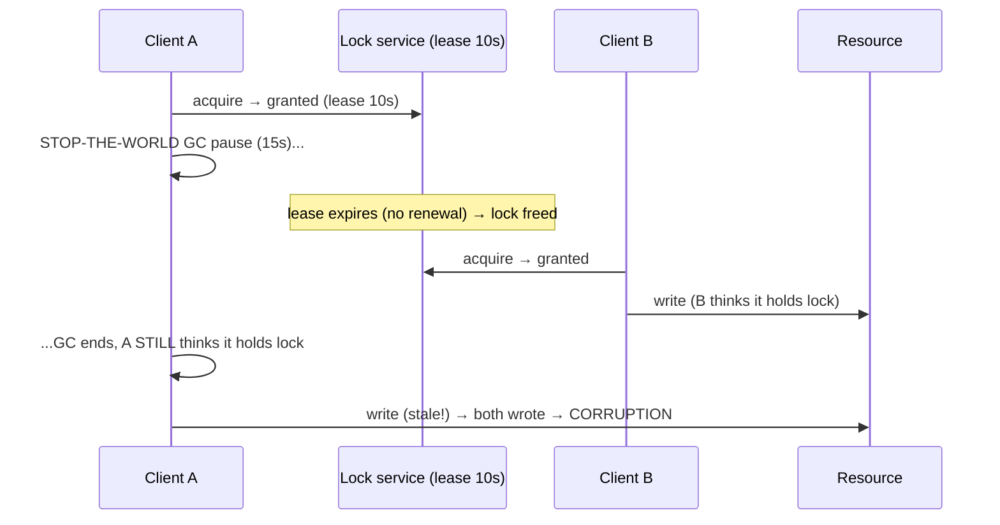
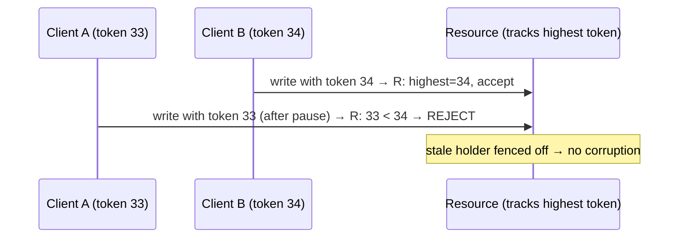

# Lesson 8.3.6 — Distributed Mutual Exclusion, Distributed Locks, and Fencing Tokens

> Part 8: Distributed Systems Core · Module 8.3: Coordination & Consensus · Difficulty: 🔴
>
> **Prerequisites:** [8.1.2 Unreliable Clocks], [8.1.3 Failure Detection], [8.3.4 Quorums], [8.3.5 Leader Election], [6.7 Locks for stampede].
> **Unlocks:** [8.3.8 ZooKeeper/etcd], [Part 11 Idempotency], [Part 12 Coordination].

---

## 1. Learning Objectives

After this lesson you will be able to:

- Explain why **distributed locks are fundamentally harder and more dangerous than local locks** — because of partial failure, undecidable failure (8.1.3), and untrustworthy clocks (8.1.2).
- Describe how distributed locks are built (a **lease** on a consensus/quorum store — ZooKeeper/etcd ephemeral nodes, Redis) and why **leases must expire** (a lock holder can crash while holding the lock).
- Explain the **central correctness problem**: a lock holder can be **paused (GC/slow) past its lease** and resume believing it still holds the lock → **two holders** → corruption — and why **timeouts alone cannot fix this**.
- Apply **fencing tokens** (monotonically increasing numbers checked by the *protected resource*) as the correct solution, and reason about when you even need a distributed lock (and the weaker guarantees of "efficiency" vs "correctness" locks).

---

## 2. Motivation — The lock that isn't

Mutual exclusion — "only one party may do X at a time" — is trivial on one machine (a mutex). In a distributed system it becomes one of the most **dangerous** abstractions, because the comforting guarantee of a local lock (you hold it until you release it) **does not hold** across a network. A node can acquire a distributed lock and then **crash** — so the lock must **time out** (a lease), or it would be held forever by a dead node. But the moment locks **expire on a timeout**, you inherit the full horror of 8.1: the holder might not be *dead* but merely **paused** (a stop-the-world GC, a slow disk, CPU starvation, a network blip) for longer than the lease — and when it **wakes up**, it still believes it holds the lock and proceeds to act on the protected resource. Meanwhile the lock service, having timed out the lease, **granted the lock to someone else**. Now **two clients both believe they hold the lock** and both write to the protected resource → exactly the **split-brain corruption** we keep meeting (8.1.1, 8.3.5).

This is not a rare edge case — a long GC pause is enough, and it has caused real data corruption. The crucial, counterintuitive lesson is that **no choice of timeout fixes this** (it's the undecidability of 8.1.3): too long and a crashed holder blocks everyone; too short and a slow holder gets pre-empted while still acting. The **correct** solution doesn't live in the lock service at all — it's the **fencing token**: a monotonically increasing number handed out with each lock grant, which the **protected resource itself** checks and uses to **reject** writes from a stale (lower-token) holder. This lesson explains how distributed locks are built, why they're treacherous, the fencing-token fix, and the higher-order question — **do you even need a distributed lock?** (often you need idempotency — Part 11 — or a different design instead).

---

## 3. Theory — From first principles

### 3.1 Why distributed mutual exclusion is hard

A **local lock** (mutex/semaphore) works because the OS/runtime has perfect, shared knowledge: the holder is a thread on the same machine; if it dies, the process dies; there's a shared clock and shared memory. A **distributed lock** has none of that `[CS]`:
- The holder is on **another machine**, reachable only by messages (which can be lost/delayed — 8.1.1).
- The holder can **crash** while holding the lock → if locks never expired, the resource would be **locked forever** by a dead node. So distributed locks must be **leases** (time-bounded — §3.2).
- But you **can't tell crashed from slow** (8.1.3), and **clocks are untrustworthy** (8.1.2) — so the lease's expiry is a *guess*, and the holder and the lock service may **disagree about whether the lease is still valid**.
This combination makes distributed locks a **coordination/consensus problem** (who holds the lock = agreement — 8.3.1), and a notoriously error-prone one.

### 3.2 How distributed locks are built (leases on a quorum/consensus store)

The standard construction `[CONV]`:
- A **lock service** backed by **consensus/quorum** (ZooKeeper, etcd, Consul — 8.3.8, or Redis) grants the lock to one client. Using consensus/quorum ensures **at most one holder is granted at a time** even under partition (only the majority side can grant — 8.3.4/8.3.5).
- The grant is a **lease**: valid for a TTL, which the holder must **renew (heartbeat)** to keep. If the holder **stops renewing** (crashed or partitioned), the lease **expires** and the lock is freed for others. This solves the "crashed holder blocks forever" problem.
- **ZooKeeper-style:** the client creates an **ephemeral node**; the lock is held while the session is alive (heartbeated); if the session dies, the ephemeral node disappears → lock released. (Often combined with **sequential** nodes for fair queuing and **watches** to be notified when the lock frees.)
- **etcd-style:** a **lease** object with a TTL, attached to the lock key; keepalives renew it.

This gives **safe granting** (consensus/quorum → one holder) and **liveness** (leases expire so a dead holder doesn't block forever). But it does **not** solve the pause problem (§3.3).

### 3.3 The killer problem — pause past the lease (process pause / GC)

Here is the failure that fencing exists to prevent `[CS]`:

```
1. Client A acquires the lock (lease valid for 10s) and starts writing to the resource.
2. Client A hits a stop-the-world GC pause (or slow disk / CPU starvation) for 15s.
3. The lease (10s) EXPIRES. The lock service, seeing no renewal, frees the lock.
4. Client B acquires the lock and starts writing to the resource.
5. Client A's GC pause ends. A still BELIEVES it holds the lock (it has no idea time passed)
   and resumes its write to the resource.
→ A and B both write → corruption / lost update / split brain.
```

The essence: **the lock service timed out A, but A didn't know.** A's belief ("I hold the lock") and reality ("my lease expired, B holds it now") **diverged** — and **A cannot detect this** (it has no reliable clock — 8.1.2 — and can't distinguish "I paused" from "no time passed"). 

**Why timeouts can't fix it:** make the lease **longer** → a genuinely-crashed holder blocks everyone for that long (bad liveness). Make it **shorter** → even *more* likely a normal pause exceeds it (more frequent corruption). **There is no timeout that's both safe and live** — the same undecidability as 8.1.3/FLP. The lock service alone **cannot** prevent a paused holder from acting, because the action happens at the **resource**, not the lock service.

### 3.4 Fencing tokens — the correct solution

The fix moves the check to the **protected resource** `[CS]`/`[BP]`:
- Each time the lock service grants the lock, it also returns a **fencing token**: a **monotonically increasing number** (e.g., from a counter or the lock's version/epoch). Each new grant gets a **strictly higher** token.
- The client includes its **fencing token** with **every write to the protected resource**.
- The **protected resource (storage/service) remembers the highest token it has seen** and **rejects any write carrying a lower (or equal-old) token.**

Now replay the §3.3 scenario:
```
- A acquired with token 33; B (later) acquired with token 34.
- B writes with token 34 → resource records "highest seen = 34", accepts.
- A wakes from its pause and writes with token 33 → resource sees 33 < 34 → REJECTS A's write.
→ A's stale write is fenced off. No corruption, even though A still thought it held the lock.
```
**Why it works:** the resource doesn't trust the *client's belief* about the lock; it enforces a **monotonic ordering of grants** that the client cannot forge or roll back. A paused holder always carries an **older** token than whoever acquired the lock after it, so its late writes are **always rejected**. **Fencing converts an unsolvable timing problem into a solvable ordering problem** (monotonic tokens — note: this uses **logical** monotonicity, not wall-clock time, so it's immune to clock skew — 8.1.2, akin to a Lamport-style counter — 8.2.1).

**Crucial requirement:** the **protected resource must actually check the token.** Fencing only works if the downstream system participates (rejects stale tokens). Many storage systems support conditional writes / version checks that serve as fencing (e.g., write-if-version, compare-and-set). A lock without resource-side fencing is **unsafe** for correctness.

### 3.5 "Efficiency" locks vs "correctness" locks

A key distinction (Kleppmann) `[BP]`:
- **Efficiency lock:** the lock is an **optimization** — if it occasionally fails (two holders), the result is **wasted work** (e.g., two workers process the same job, or the cache stampede lock — 6.7 — lets two recomputes happen). **No correctness harm.** Here a simple lease lock (even Redis-based) is **fine** — fencing is overkill.
- **Correctness lock:** the lock **guards correctness** — two holders cause **data corruption / lost updates / double-charge**. Here you **must** use **fencing tokens** (and a properly consensus-backed lock); a plain lease lock is **unsafe** (§3.3).
**Always ask: "if two clients held this lock simultaneously, is the result wasted work or corruption?"** If corruption → fencing + consensus-backed lock. If wasted work → a simple lease may suffice. This framing avoids both under-engineering (corruption) and over-engineering (fencing where it's unnecessary).

### 3.6 The Redlock controversy (illustrative caution)

A well-known debate `[OPINION]`/`[EMERGING]`: **Redlock** is an algorithm to build a distributed lock across multiple independent Redis nodes (majority of Redis instances grant it). Kleppmann's critique argues it's **unsafe for correctness** because it relies on **timing assumptions** (bounded clocks/pauses) that distributed systems can't guarantee (8.1.2/8.1.3) — a GC pause or clock jump can still produce two holders, and Redlock provides **no fencing token**. The defense argues it's adequate for **efficiency** locks. The takeaway for you isn't to adjudicate the debate but the **principle**: **a distributed lock without fencing tokens is not safe for correctness, no matter how clever the granting algorithm**, because the granting can never overcome the holder-pause/clock problem at the resource. For correctness, use a **consensus-backed lock + fencing tokens checked by the resource** (or avoid the lock entirely — §3.7).

### 3.7 Do you even need a distributed lock?

The highest-leverage question `[BP]`: distributed locks are dangerous and often a **smell**. Frequently a better design avoids them:
- **Idempotency (Part 11):** if the protected operation is **idempotent** (safe to apply more than once — via idempotency keys/dedup — 8.4.1), you may not need exclusion at all — duplicates are harmless. This is often the *real* fix.
- **Single-writer per partition:** route all operations for a key to **one owner** (a partition leader — 7.3/8.3.5) so there's a natural single writer without a lock (e.g., Kafka partition consumers, sharded actors). 
- **Optimistic concurrency / CAS:** use **compare-and-set / version checks** at the database (5.2.4 OCC) — which is itself a form of fencing — instead of a coarse lock.
- **A real lock only when genuinely needed** — for mutual exclusion over a shared external resource that can't be partitioned/made idempotent — and then **consensus-backed + fenced**.
The mature instinct: **prefer idempotency, single-writer ownership, or optimistic concurrency over a distributed lock**; reach for a distributed lock only when none fit, and then **fence it**.

---

## 4. Visual Intuition

### The pause-past-lease corruption (without fencing)



### Fencing tokens fix it



---

## 5. Real-World Analogy

Imagine a **shared printing press** that only one print shop may operate at a time, coordinated by a **dispatcher** who hands out a **"you're on" badge** valid for 10 minutes (a lease).

- **The crash case:** if a shop holding the badge **burns down** (crashes), the dispatcher can't wait forever — after 10 minutes the badge **expires** and goes to the next shop (lease expiry solves "dead holder blocks forever").
- **The killer case:** Shop A gets the badge and starts a big print run, but then **loses power for 15 minutes** (a pause). The dispatcher, hearing nothing, **expires A's badge** and gives it to **Shop B**, which starts printing. Power returns to A — and A, **with no idea 15 minutes passed**, keeps printing as if it still holds the badge. Now **two shops are printing on the same press** → ruined output (corruption). And no badge-duration fixes this: long badges mean a truly-dead shop blocks everyone; short badges mean any power blip causes a collision.
- **The fencing fix:** the dispatcher stamps each badge with an **ever-increasing number** — A got **#33**, B got **#34**. Crucially, the **press itself** checks the number on every job and **remembers the highest it's seen**. When B prints with **#34**, the press records "34." When A, post-blackout, tries to print with its old **#33** badge, the press sees **33 < 34** and **refuses A's job**. A's stale work is **locked out by the press**, not by the dispatcher's timing. The press trusts the **monotonic number**, not anyone's *belief* about who holds the badge.
- **Efficiency vs correctness:** if the "press" were just *a sign-up sheet for a coffee machine* (two people using it = mild annoyance, not disaster), you wouldn't bother with numbered badges. The numbered-badge rigor is for presses where a collision **ruins the product**.

---

## 6. Industry Example

- **ZooKeeper / etcd locks** `[CONV]`: ephemeral/sequential nodes (ZK) or leases (etcd) backed by consensus give safe granting (one holder) + automatic release on session death (8.3.8); used for leader election (8.3.5) and resource locks. *(Representative.)*
- **Fencing tokens in practice** `[BP]`: ZooKeeper's **zxid** / node version, etcd's lease/revision, or a dedicated counter serve as fencing tokens that the protected resource checks (§3.4). *(Representative.)*
- **The HDFS NameNode fencing example** `[CS]`: HA failover fences the old NameNode (so a paused-then-revived old primary can't corrupt the journal) — a canonical fencing use (§3.4). *(Representative.)*
- **Redlock debate** `[OPINION]`: Kleppmann vs antirez on whether multi-Redis Redlock is safe for correctness — the well-known illustration that **granting cleverness ≠ correctness without fencing** (§3.6). *(Representative.)*
- **Idempotency/single-writer instead of locks** `[BP]`: payment/order systems prefer idempotency keys (8.4.1, Part 11) and per-key single-writer partitions (7.3) over distributed locks (§3.7). *(Representative.)*

---

## 7. Implementation Details — distributed locks done right

- **First ask: do you need a distributed lock at all?** Prefer **idempotency** (8.4.1, Part 11), **single-writer-per-partition** (7.3/8.3.5), or **optimistic concurrency/CAS** (5.2.4) — locks are a smell (§3.7) `[BP]`.
- **If you must lock for correctness**, use a **consensus/quorum-backed lock service** (ZooKeeper/etcd) so granting is safe under partition (only the majority side grants) (§3.2, 8.3.4/8.3.5).
- **Always use leases (TTL + renewal)** so a crashed holder doesn't block forever (§3.2) — but understand leases don't solve the pause problem (§3.3).
- **For correctness locks, REQUIRE fencing tokens** — issue a monotonic token per grant; have the **protected resource check and reject stale (lower) tokens** (conditional writes / CAS / version checks) (§3.4). A correctness lock without resource-side fencing is **unsafe**.
- **Use monotonic counters/epochs, not wall-clock time**, for fencing (clock-skew-immune — 8.1.2/8.2.1).
- **Classify the lock**: efficiency (simple lease OK) vs correctness (consensus + fencing required) — match rigor to consequence (§3.5).
- **Keep critical sections short and idempotent** so even a missed-fence corner case is survivable (Part 11).
- **Don't trust client-side lease validity** — the resource, not the client's belief, is the source of truth (fencing) (§3.3/3.4).

---

## 8. Advantages (of locks done right)

- **Mutual exclusion across machines** — when truly needed, a consensus-backed lock + fencing gives **safe** exclusivity (§3.2/3.4).
- **Automatic release** — leases free the lock if the holder dies (liveness) (§3.2).
- **Split-brain-proof granting** — consensus/quorum ensures one holder even under partition (§3.2, 8.3.4).
- **Fencing guarantees correctness** — stale holders' writes are rejected at the resource regardless of timing/clocks (§3.4).
- **Right-sized rigor** — efficiency vs correctness framing avoids over/under-engineering (§3.5).

---

## 9. Disadvantages / hard realities

- **Leases can't prevent pause-past-lease** by themselves → fencing is mandatory for correctness (§3.3).
- **No safe timeout exists** — too long blocks on crashes, too short collides on pauses (undecidable — 8.1.3) (§3.3).
- **Fencing requires resource cooperation** — the protected store must check tokens; not all do (§3.4).
- **Locks reduce availability/throughput** — serialization; the lock service is a coordination dependency (and SPOF if not HA) (§3.1).
- **Often a design smell** — frequently avoidable via idempotency/single-writer/OCC (§3.7).
- **Clever granting ≠ safety** — Redlock-style cleverness doesn't substitute for fencing (§3.6).

---

## 10. When NOT to use a distributed lock / limits

- **When the operation can be idempotent** — make it idempotent and skip exclusion (often the real fix — §3.7, 8.4.1).
- **When you can route to a single writer per key** (partition leader) — natural exclusion without a lock (§3.7, 7.3).
- **When optimistic concurrency/CAS suffices** — version-checked writes at the DB (5.2.4) are simpler and safer (§3.7).
- **For correctness without fencing** — never; an unfenced correctness lock is unsafe (§3.3/3.4).
- **Across machines using only timing assumptions** (Redlock for correctness) — unsafe (§3.6).
- **For high-throughput hot paths** — a coarse distributed lock serializes and bottlenecks; rethink the design.

---

## 11. Common Mistakes

1. **Lease lock without fencing for correctness** → pause-past-lease → two holders → corruption (§3.3/3.4) — the canonical bug.
2. **Assuming a timeout makes it safe** → no timeout is both safe and live (§3.3).
3. **Trusting the client's belief that it holds the lock** instead of fencing at the resource (§3.3/3.4).
4. **Using wall-clock time for fencing/lease logic** → clock skew breaks it (§3.4, 8.1.2).
5. **Non-consensus lock granting** (single node / racy) → split-brain granting under partition (§3.2).
6. **Using a distributed lock where idempotency/single-writer/OCC would do** → needless danger and bottleneck (§3.7).
7. **Redlock (or similar) for correctness** without fencing → unsafe (§3.6).
8. **Long critical sections** that amplify the window for pause/collision (§7).

---

## 12. Interview Questions

**🟢 Easy**
- Why is a distributed lock harder than a local mutex?
- Why must distributed locks be leases (time-limited)?

**🟡 Medium**
- Walk through how a stop-the-world GC pause can cause two clients to both "hold" a leased lock. Why can't a better timeout fix it?
- What is a fencing token, and how does it prevent the corruption? Why must the *resource* check it?

**🔴 Hard**
- Explain efficiency locks vs correctness locks. For each, what locking rigor is appropriate?
- Why is a distributed lock built only on clever granting (e.g., across multiple Redis nodes) insufficient for correctness without fencing? (Redlock debate.)

**⚫ Staff+**
- Design exclusive access to a shared external resource (e.g., a single-writer file/ledger) for a fleet of workers, where two simultaneous writers would corrupt data. Decide whether to use a lock at all (vs idempotency/single-writer/OCC), and if so, specify the consensus-backed lock + lease + fencing-token mechanism and exactly how the resource enforces it.
- A leased-lock-protected job processor occasionally double-processes and corrupts state after long GC pauses. Diagnose the failure, explain why tuning the lease won't fix it, and design the fix (fencing tokens + resource-side checks, or redesign to idempotent/single-writer) (§3.3/3.4/3.7, 8.1.3).

---

## 13. Production Pitfalls

- **GC-pause double-write corruption:** a leased lock without fencing; a holder pauses past its lease, another acquires, the first resumes and writes → corrupted/lost data (§3.3) — the textbook incident.
- **Clock-skew lease bug:** lease validity judged by wall-clock time on a skewed node → holder acts past true expiry → two holders (§3.4, 8.1.2).
- **Non-HA lock service SPOF:** the lock service isn't replicated/consensus-backed → its failure halts everything, or a partition allows dual granting (§3.2).
- **Resource doesn't check tokens:** fencing tokens are issued but the storage ignores them → fencing provides no protection (§3.4).
- **Lock used where idempotency would do:** a complex, fragile distributed lock guards an operation that could simply be made idempotent → unnecessary outages/bottleneck (§3.7).
- **Redlock-for-correctness:** relying on timing-based multi-node granting for a correctness lock → rare but real dual-holder corruption (§3.6).

---

## 14. Optimization Techniques

> *Mostly "do it safely / avoid it."*

- **Prefer idempotency / single-writer-per-partition / OCC** over distributed locks (§3.7) `[BP]`.
- **Consensus-backed lock + lease + fencing tokens** when a correctness lock is truly needed (§3.2/3.4).
- **Monotonic counter/epoch tokens** (not wall-clock) checked by the resource via conditional writes/CAS (§3.4, 5.2.4).
- **Classify efficiency vs correctness** and right-size rigor (§3.5).
- **Short, idempotent critical sections** to shrink the pause/collision window and survive corner cases (§7, Part 11).
- **HA lock service** (replicated consensus) to avoid SPOF and split-brain granting (§3.2, 8.3.8).

---

## 15. Summary

Distributed mutual exclusion is far more dangerous than a local mutex because the network gives no shared memory/clock and **partial failure** rules: a lock holder can **crash** (so locks must be **leases** that expire, or a dead holder blocks forever) — but the moment locks expire on a **timeout**, you face the undecidability of 8.1.3 (**can't tell crashed from slow**) and the untrustworthiness of clocks (8.1.2). Locks are built as **leases on a consensus/quorum store** (ZooKeeper ephemeral nodes, etcd leases, Redis) so granting is **safe** (only the majority side grants → one holder — 8.3.4/8.3.5) and self-releasing (lease expiry on crash). But this does **not** solve the **killer problem**: a holder can be **paused (stop-the-world GC, slow disk) past its lease**, have the lock granted to someone else, then **wake up still believing it holds the lock** and write to the resource → **two holders → corruption**. **No timeout fixes this** (long → blocks on crashes; short → collides on pauses), because the action happens at the **resource**, not the lock service, and the holder can't detect that it was timed out (no reliable clock). The correct fix is the **fencing token**: each grant returns a **monotonically increasing number**; the client sends it with every write; and **the protected resource tracks the highest token seen and rejects any lower (stale) token** — so a paused holder's late writes are always **fenced off**, converting an unsolvable *timing* problem into a solvable *monotonic-ordering* problem (logical, clock-skew-immune). Fencing **requires the resource to participate** (conditional writes/CAS/version checks). Match rigor to consequence: **efficiency locks** (collision = wasted work, e.g., stampede locks — 6.7) can use a simple lease; **correctness locks** (collision = corruption) **require consensus-backing + fencing** — a clever granting algorithm alone (the **Redlock** debate) is **not** safe for correctness without fencing. Best of all, **often you don't need a distributed lock**: prefer **idempotency** (Part 11), **single-writer-per-partition** (7.3), or **optimistic concurrency/CAS** (5.2.4) — and reach for a fenced, consensus-backed lock only when none of those fit.

---

## 16. Revision Notes (flashcard-ready)

- **Q:** Why are distributed locks hard? **A:** No shared memory/clock; holder can crash (need leases); can't tell crashed from slow; clocks untrustworthy.
- **Q:** Why must distributed locks expire (leases)? **A:** Else a crashed holder blocks the lock forever.
- **Q:** The killer problem? **A:** Holder pauses (GC) past its lease, lock is re-granted, holder wakes still thinking it holds it → two holders → corruption.
- **Q:** Why can't a timeout fix it? **A:** Too long blocks on real crashes; too short collides on normal pauses — undecidable (8.1.3).
- **Q:** Fencing token? **A:** Monotonic number per grant; client sends it on every write; resource rejects lower (stale) tokens.
- **Q:** Why does fencing work? **A:** A paused holder always has an older token than the newer holder → its late writes are rejected at the resource (ordering, not timing).
- **Q:** Key fencing requirement? **A:** The protected resource must check/enforce the token (conditional write/CAS) — and use monotonic counters, not wall-clock time.
- **Q:** Efficiency vs correctness lock? **A:** Efficiency = collision wastes work (simple lease OK); correctness = collision corrupts (need consensus + fencing).
- **Q:** Redlock takeaway? **A:** Clever granting ≠ correctness without fencing; timing assumptions can't be guaranteed.
- **Q:** Better than a distributed lock? **A:** Idempotency, single-writer-per-partition, or optimistic concurrency/CAS — locks are a smell.

---

## 17. Further Reading + Knowledge-Graph Links

**Within this platform**
- **Builds on:** [8.1.2 Unreliable Clocks] (why time-based locks fail), [8.1.3 Failure Detection] (slow vs dead), [8.3.4 Quorums] / [8.3.5 Leader Election] (safe granting/fencing epochs), [6.7 stampede locks] (efficiency locks).
- **Next:** [8.3.7 Byzantine/BFT], [8.3.8 ZooKeeper/etcd] (lock services). 
- **Enables:** [Part 11 Idempotency/Dedup] (often the better alternative), [5.2.4 OCC/CAS] (fencing-like), [7.3 single-writer partitions].

**Foundational texts (synthesized)**
- Kleppmann, *Designing Data-Intensive Applications* — distributed locks, fencing tokens, the GC-pause problem, Redlock critique (synthesized).
- ZooKeeper / etcd documentation — locks, leases, ephemeral nodes (representative).

**Concept tags:** `[CS]` distributed lock hardness, lease expiry, pause-past-lease corruption, fencing tokens (monotonic ordering) · `[CONV]` ZooKeeper/etcd locks, lease+renew · `[BP]` prefer idempotency/single-writer/OCC, consensus-backed + fenced correctness locks, efficiency-vs-correctness framing, monotonic not wall-clock · `[OPINION]` Redlock-without-fencing-is-unsafe.
