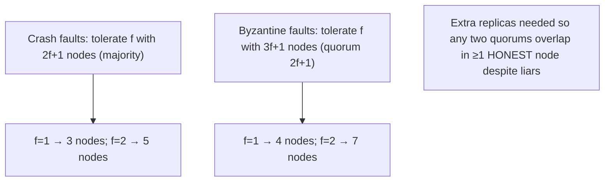

# Lesson 8.3.7 — Byzantine Faults and BFT (Overview)

> Part 8: Distributed Systems Core · Module 8.3: Coordination & Consensus · Difficulty: ⚫
>
> **Prerequisites:** [8.3.1 Consensus & FLP], [8.3.4 Quorums], [8.3.2 Paxos], [15.x Security context].
> **Unlocks:** [Part 18 Blockchain/decentralized case studies], [Part 15 Security], [8.3.8 Coordination services].

---

## 1. Learning Objectives

After this lesson you will be able to:

- Define a **Byzantine fault** (arbitrary/malicious behavior — lying, sending conflicting messages, equivocation) and contrast it with **crash faults** (the model of Paxos/Raft).
- State the **Byzantine fault tolerance bound**: to tolerate `f` Byzantine nodes you need **≥ `3f + 1`** nodes (vs `2f + 1` for crash), and explain *why* the extra replicas are required.
- Describe **PBFT-style** Byzantine consensus at a high level (multiple rounds, larger quorums of honest nodes) and its costs (more messages, more replicas, more latency).
- Decide **when BFT is justified** (untrusted/adversarial participants — blockchains, multi-organization systems) vs when **crash-tolerant consensus suffices** (most internal systems), and how it relates to **blockchain consensus** (PoW/PoS).

---

## 2. Motivation — When nodes don't just fail, they lie

Everything in Module 8.3 so far assumed the gentlest failure model: **crash faults** — a node either works correctly or **stops** (8.3.1). Paxos and Raft are built for this: a crashed node is silent, never *wrong*, and majority quorums (`2f+1`) handle it. But some systems face a harsher reality: nodes that **behave arbitrarily** — they might **lie**, send **different (conflicting) messages to different peers**, **forge** data, **selectively drop** messages, or be **actively malicious** (compromised by an attacker). These are **Byzantine faults** (named after the "Byzantine Generals Problem" — Lamport, Shostak, Pease), and they are **dramatically harder** to tolerate, because you can no longer trust *anything* a node says.

Why does this matter? In a **single trust domain** (your own datacenter, your own services), nodes are presumed honest — they may crash or be slow, but they won't *lie* — so **crash-tolerant consensus (Paxos/Raft) is the right, cheaper choice**, and BFT is unnecessary overkill. But in **adversarial or multi-party settings** — **blockchains** (mutually-distrusting participants, anyone can join), **inter-organization systems** (no single owner), safety-critical systems (aerospace, where hardware can fail arbitrarily), or systems exposed to **compromise** — you **cannot** assume honesty, and you need **Byzantine Fault Tolerance (BFT)**. BFT costs more (more replicas — `3f+1`, more message rounds, more latency), which is exactly why you should use it **only when the threat model demands it**. This lesson explains Byzantine faults, the famous `3f+1` bound and why it's necessary, the shape of BFT protocols (PBFT and the blockchain family), and — most practically — **how to decide whether you actually need BFT** (usually you don't, for internal systems).

---

## 3. Theory — From first principles

### 3.1 Failure models — crash vs Byzantine

`[CS]`
- **Crash (fail-stop):** a node operates correctly until it **halts**; it never produces incorrect output. Silent failures only. (Paxos/Raft model.)
- **Crash-recovery:** crashes and restarts, losing volatile state (handled with durable WAL — 5.3.1).
- **Omission:** drops some messages (network — 8.1.1).
- **Byzantine (arbitrary):** a node can do **anything** — send wrong/inconsistent values, lie about its state, send **different messages to different recipients** (equivocation), collude with other faulty nodes, or stay silent. It models both **malice** (compromised/adversarial nodes) and **arbitrary corruption** (bugs, hardware faults producing garbage).

The jump from crash to Byzantine is enormous: with crash faults, a message you receive is **truthful** (the sender just might be silent); with Byzantine faults, **every message is suspect** — a node might tell you "X" and tell your neighbor "Y." This **equivocation** is the core difficulty.

### 3.2 The Byzantine Generals Problem (intuition)

Lamport's framing `[CS]`: several generals (nodes) must agree on a plan (attack/retreat) by messenger, but some generals (and/or messengers) may be **traitors** who send **conflicting** messages to sow disagreement. The honest generals must still reach a **common decision**. The result: agreement is achievable **only if more than two-thirds of the generals are honest** — i.e., you can tolerate fewer than one-third traitors. This is the origin of the **`3f+1`** bound (§3.3).

### 3.3 The `3f + 1` bound — and why

To tolerate **`f` Byzantine** nodes you need **at least `3f + 1`** total nodes (so fewer than 1/3 can be faulty), and decisions use **quorums of `2f + 1`** `[CS]`. Contrast: crash tolerance needs only **`2f + 1`** (majority). **Why the extra replicas?**
- **You must overlap in *honest* nodes, not just *any* nodes.** A Byzantine quorum of `2f+1` (out of `3f+1`) is needed so that **any two quorums intersect in at least `f+1` nodes** — and since at most `f` are faulty, that intersection contains **at least one honest node** in common. (`2f+1 + 2f+1 - (3f+1) = f+1` overlap; remove up to `f` liars → ≥1 honest.) This guarantees honest nodes carry consistent information between operations despite liars — the Byzantine analog of quorum overlap (8.3.4).
- **You must out-vote the liars *and* the unreachable.** Up to `f` nodes may be Byzantine (lying) *and* you can't wait for all (some honest ones may be slow/partitioned), so you need enough honest, reachable nodes to form agreement even when `f` lie and `f` more are slow — `3f+1` provides the margin.
- **Equivocation defense:** because a Byzantine node sends different messages to different peers, honest nodes must **cross-check** what they heard (exchange messages about messages) to detect inconsistency — which requires the larger population to have an honest majority of any quorum.

So: **crash → `2f+1`; Byzantine → `3f+1`.** Tolerating one Byzantine node needs **4** replicas; two needs **7**.

### 3.4 PBFT — practical Byzantine consensus (shape)

**PBFT (Practical Byzantine Fault Tolerance** — Castro & Liskov, 1999) made BFT efficient enough for real systems `[CS]`/`[EMERGING]`. High-level shape (a leader-based, multi-round protocol over `3f+1` replicas):
- A **primary** (leader) proposes an ordering for a client request; replicas proceed through phases — **pre-prepare** (primary proposes), **prepare** (replicas broadcast agreement; collect `2f+1`), **commit** (replicas broadcast commit; collect `2f+1`) — before executing and replying.
- The **multiple all-to-all rounds** let honest replicas **cross-verify** that they all received the **same** proposal (detecting an equivocating primary), and the **`2f+1` quorums** ensure honest overlap (§3.3).
- The client waits for **`f+1` matching replies** (from different replicas) — since at most `f` are faulty, `f+1` matching replies guarantees at least one honest, so the result is trustworthy.
- **View changes** handle a faulty/slow primary (elect a new one) — analogous to Raft leader change but Byzantine-hardened.
- **Costs:** **O(N²) messages** per consensus (all-to-all in the prepare/commit phases), more replicas (`3f+1`), and higher latency than crash consensus — the price of tolerating liars. (Modern BFT — HotStuff, etc. — reduces message complexity and powers some blockchains.)

### 3.5 Blockchain consensus — Byzantine agreement at internet scale

Blockchains are the highest-profile BFT systems, solving Byzantine agreement among **anonymous, mutually-distrusting, open-membership** participants `[EMERGING]`:
- **Proof of Work (PoW)** (Bitcoin): instead of voting among a known set, nodes **compete to solve a hard puzzle**; the winner proposes the next block. Tampering requires redoing the work for that block **and all after it** faster than the honest majority of compute — so honesty is enforced by making dishonesty **economically/computationally infeasible** ("longest/heaviest chain wins"). Tolerates Byzantine behavior as long as honest nodes control **>50% of hash power** (the "51% attack" threshold). Hugely energy-intensive; **probabilistic** finality.
- **Proof of Stake (PoS)** (Ethereum post-Merge, etc.): voting power proportional to **staked capital**; misbehavior is punished by **slashing** the stake. Far less energy; security tied to the cost of acquiring/risking stake.
- These differ from **classical BFT (PBFT)**: classical BFT assumes a **known, fixed set** of `3f+1` identified replicas (permissioned) and gives **deterministic finality**; blockchain consensus targets **open/permissionless** membership (anyone can join, identities unknown → Sybil-resistance via work/stake) with often **probabilistic** finality. Permissioned blockchains (Hyperledger) use PBFT-style protocols; public ones use PoW/PoS.

### 3.6 When you need BFT — and (usually) when you don't

The practical decision `[BP]`:
- **You DON'T need BFT (use crash-tolerant Paxos/Raft) when:** all nodes are within a **single trust domain** you control (your datacenter/services) — nodes may crash or be slow, but you trust them not to **lie**. **This is the vast majority of internal distributed systems.** BFT's `3f+1` replicas + O(N²) messages + latency would be **expensive overkill** with no benefit.
- **You DO need BFT when:** participants are **mutually distrusting** or **untrusted** — **public blockchains** (anyone can join, incentive to cheat), **multi-organization consortia** (no single owner, parties may be adversarial), **safety-critical systems** where hardware/software can fail arbitrarily (aerospace/avionics), or systems with a serious **node-compromise** threat where a breached node must not corrupt consensus.
- **The honest default:** **assume crash faults and use Raft/Paxos** unless your threat model explicitly includes **malicious or arbitrary** behavior by participants you don't control. Don't pay for BFT to defend against threats you don't have.

### 3.7 BFT vs other security measures

BFT isn't the only (or first) line of defense against malice `[BP]`. For most systems, **authentication, authorization, encryption, and input validation** (Part 15) keep nodes honest/trusted, making crash-tolerant consensus sufficient. BFT is for when you **fundamentally cannot trust** the *participants in consensus itself* — a much stronger and rarer requirement than "secure the system." Think of BFT as **"consensus that survives traitors among the deciders,"** layered *on top of* (not instead of) normal security. In most architectures, you secure the perimeter and trust your own consensus nodes (crash model); BFT is reserved for decentralized/adversarial cores.

---

## 4. Visual Intuition

### Crash vs Byzantine tolerance bounds



### PBFT phases (shape)

```mermaid
sequenceDiagram
    participant Cl as Client
    participant P as Primary
    participant R as Replicas (3f+1)
    Cl->>P: request
    P->>R: pre-prepare (proposed order)
    R->>R: prepare (broadcast, collect 2f+1)
    R->>R: commit (broadcast, collect 2f+1)
    R-->>Cl: reply (client waits for f+1 matching)
    Note over R: cross-checking detects an equivocating primary; view-change replaces a bad primary
```

---

## 5. Real-World Analogy

Recall the **jury** analogy (8.3.1), but now some jurors are **bribed liars** who will tell different jurors different things to wreck the verdict.

- **Crash faults** were like jurors who might **fall asleep** (go silent) — annoying, but an asleep juror never *lies*. A simple majority handles them.
- **Byzantine faults** are jurors who **actively deceive** — telling half the room "the defendant confessed" and the other half "the defendant has an alibi," trying to manufacture disagreement. Now you **can't trust any single juror's word**.
- **Why you need more honest jurors (`3f+1`):** to survive `f` liars, you need the jury large enough that when jurors **compare notes**, the **honest majority** can identify and outvote the contradictions. With fewer than two-thirds honest, the liars can split the honest jurors into two camps that can't tell who's lying. So to tolerate **1** liar you need **4** jurors; to tolerate **2**, you need **7** — and they must **cross-check** each other's claims (the extra PBFT message rounds).
- **When you need this rigor:** if the jury is **all from one trusted firm** (your own datacenter), you don't expect lying — you just handle absences (crash model). You only need the elaborate liar-proof process when the jury includes **strangers with incentives to cheat** (a public, open jury — a blockchain) or **representatives of rival organizations** who might betray each other (a consortium).
- **Blockchain twist:** in a fully open "jury" where **anyone can show up** (and a cheater could pack the room with fake jurors — Sybil attack), you can't just count heads — so you make each "vote" require **expensive work** (PoW) or **staked money at risk** (PoS), so flooding the jury with liars becomes ruinously costly.

---

## 6. Industry Example

- **PBFT (Castro & Liskov)** `[CS]`: the foundational practical BFT protocol; basis for many permissioned-blockchain and BFT systems (§3.4). *(Representative.)*
- **Bitcoin (PoW)** `[EMERGING]`: Byzantine agreement among anonymous, open participants via proof of work + longest-chain rule; secure while honest nodes hold >50% hash power (§3.5). *(Representative.)*
- **Ethereum (PoS)** `[EMERGING]`: stake-weighted Byzantine consensus with slashing for misbehavior — far lower energy than PoW (§3.5). *(Representative.)*
- **Hyperledger Fabric / permissioned chains** `[CONV]`: use PBFT-style/known-set BFT consensus for consortium (multi-org) settings — deterministic finality (§3.5/3.6). *(Representative.)*
- **Internal systems use crash consensus** `[CONV]`: etcd/ZooKeeper/Spanner/Cockroach use **crash-tolerant** Paxos/Raft (not BFT) because nodes are within one trust domain — the default for most engineering (§3.6, 8.3.2/8.3.3/8.3.8). *(Representative.)*
- **Aerospace/avionics BFT** `[CS]`: safety-critical systems use Byzantine-tolerant designs because hardware components can fail arbitrarily (§3.6). *(Representative.)*

---

## 7. Implementation Details — deciding and (rarely) doing BFT

- **Default to crash-tolerant consensus (Raft/Paxos)** for systems within your trust domain — BFT is overkill unless participants can be **malicious/untrusted** (§3.6) `[BP]`.
- **Reach for BFT only when the threat model demands it** — open/permissionless participation, multi-org consortia, compromise-resistant cores, or arbitrary-hardware-fault safety-critical systems (§3.6).
- **If BFT is needed, use `3f+1` replicas** (4 for f=1, 7 for f=2) and a proven protocol (PBFT/HotStuff or a permissioned-blockchain platform) — don't hand-roll Byzantine consensus (even harder than Paxos — 8.3.1 §7) (§3.3/3.4).
- **For open/permissionless settings**, use **PoW or PoS** (or adopt an existing chain/platform) — classical BFT assumes a known, fixed replica set and doesn't handle Sybil/open membership (§3.5).
- **Budget BFT's costs** — more replicas, O(N²) messages, higher latency, (PoW) energy; design for the lower throughput/higher latency vs crash consensus (§3.4).
- **Secure first (Part 15)** — authentication/authorization/encryption usually let you *trust* your consensus nodes (crash model); use BFT for the residual case where consensus participants themselves can't be trusted (§3.7).
- **Wait for `f+1` matching replies** when consuming results from a BFT cluster (so at least one honest reply backs the answer) (§3.4).

---

## 8. Advantages (of BFT, where needed)

- **Tolerates malice/arbitrary faults** — agreement holds even if up to `f` nodes lie, equivocate, or are compromised (§3.1/3.3).
- **Trustless coordination** — enables agreement among **mutually-distrusting** parties (blockchains, consortia) with no central authority (§3.5).
- **Detects equivocation** — cross-checking exposes a lying primary/participant (§3.4).
- **Deterministic finality (classical BFT)** — once committed, irrevocable (vs PoW's probabilistic finality) (§3.5).
- **Safety-critical robustness** — survives arbitrary hardware/software corruption (aerospace) (§3.6).

---

## 9. Disadvantages / costs

- **Expensive** — `3f+1` replicas (vs `2f+1`), **O(N²) messages**, higher latency, lower throughput than crash consensus (§3.4).
- **Overkill for trusted domains** — no benefit when nodes are honest (most internal systems) (§3.6).
- **Scalability limits (classical BFT)** — all-to-all messaging limits the practical number of replicas (mitigated by newer protocols like HotStuff) (§3.4).
- **Open-membership is even harder** — needs Sybil resistance (PoW energy cost / PoS capital) and often only **probabilistic** finality (§3.5).
- **Complex & hard to implement** — Byzantine protocols are subtler than Paxos/Raft; use proven implementations (§7).
- **Doesn't replace security** — BFT is for untrusted *consensus participants*, not a substitute for authn/authz/encryption (§3.7).

---

## 10. When NOT to use BFT / limits

- **Single trust domain** (your own datacenter/services) — use crash-tolerant Raft/Paxos; BFT is wasteful (§3.6) — **the common case**.
- **When security controls suffice** — authn/authz/encryption keep nodes trusted (§3.7).
- **Latency/throughput-sensitive internal workloads** — BFT's overhead is unjustified without a malice threat (§3.4/3.6).
- **Hand-rolling Byzantine consensus** — use proven protocols/platforms (§7).
- **Open/permissionless without Sybil resistance** — classical BFT alone fails; need PoW/PoS (§3.5).

---

## 11. Common Mistakes

1. **Using BFT for internal systems** within one trust domain → huge cost for no benefit (use Raft/Paxos) (§3.6).
2. **Assuming crash-tolerant consensus protects against malicious nodes** → a compromised/lying node can break Paxos/Raft agreement (use BFT if that's the threat) (§3.1/3.6).
3. **Under-provisioning replicas** — using `2f+1` (crash bound) in a Byzantine setting → can't tolerate even one liar (§3.3).
4. **Hand-rolling Byzantine consensus** → subtle, dangerous bugs (§7).
5. **Confusing BFT with security** — thinking BFT replaces authn/authz/encryption (§3.7).
6. **Using classical BFT for open membership** without Sybil resistance → flooded by fake identities (§3.5).
7. **Ignoring BFT's latency/throughput cost** when it *is* needed → under-provisioned, slow system (§3.4).

---

## 12. Interview Questions

**🟢 Easy**
- What is a Byzantine fault, and how does it differ from a crash fault?
- How many nodes do you need to tolerate `f` Byzantine faults, and how does that compare to crash faults?

**🟡 Medium**
- Why does Byzantine tolerance need `3f+1` nodes instead of `2f+1`? (Honest overlap / out-voting liars.)
- When do you need BFT vs crash-tolerant consensus? Give examples of each.

**🔴 Hard**
- Sketch PBFT's phases and explain how cross-checking and `2f+1` quorums defend against an equivocating primary.
- Contrast classical BFT (PBFT) with blockchain consensus (PoW/PoS): membership model, Sybil resistance, finality.

**⚫ Staff+**
- A consortium of competing banks wants a shared ledger where no single bank is trusted to control consensus, but membership is known and permissioned. Recommend a consensus approach (crash vs BFT vs blockchain), justify by the trust model, and analyze the cost (replicas, latency, throughput) vs a trusted single-operator design.
- Explain precisely why crash-tolerant Raft would be unsafe if one of its nodes were compromised by an attacker, and what BFT changes to defend against it. Then argue when this threat justifies BFT's overhead and when perimeter security + crash consensus is the better engineering choice.

---

## 13. Production Pitfalls

- **Compromised node breaks crash consensus:** a Raft/Paxos cluster assumes honesty; a single compromised node that lies/equivocates can violate agreement — a real risk if consensus participants are exposed to attackers (§3.1/3.6) (mitigate with security, or BFT if untrusted).
- **BFT over-engineering:** an internal system adopts BFT "for safety," paying `3f+1` replicas + O(N²) messaging for a threat it doesn't have → wasted cost and worse latency (§3.6).
- **Under-replicated BFT:** deploying only `2f+1` nodes in a Byzantine setting → can't tolerate even one malicious node (§3.3).
- **Sybil attack on open membership:** using a known-set BFT assumption where anyone can join → attacker creates many fake identities and overwhelms honest nodes (needs PoW/PoS) (§3.5).
- **BFT throughput surprise:** the all-to-all messaging limits throughput/scale unexpectedly under load (§3.4).
- **PoW energy/latency cost:** adopting a PoW chain for an internal use case → enormous energy and slow, probabilistic finality vs a permissioned BFT/crash approach (§3.5).

---

## 14. Optimization Techniques

- **Use crash consensus + strong security** for trusted domains — avoid BFT cost entirely (§3.6/3.7) `[BP]`.
- **Modern BFT (HotStuff-style)** to reduce message complexity (toward O(N)) when BFT is needed at larger scale (§3.4).
- **Permissioned BFT (known set, `3f+1`)** for consortia — deterministic finality, no PoW energy (§3.5/3.6).
- **PoS over PoW** for open chains where energy matters (§3.5).
- **`f+1` matching-reply checks** when consuming BFT results (trust the honest majority) (§3.4).
- **Proven implementations/platforms** — never hand-roll Byzantine consensus (§7).
- **Right-size `f`** to the actual threat (how many simultaneous malicious nodes are plausible) to avoid over-replication (§3.3).

---

## 15. Summary

A **Byzantine fault** is **arbitrary or malicious** node behavior — lying, sending **conflicting messages to different peers (equivocation)**, forging data, colluding — in contrast to the **crash faults** (fail-stop, silent, never wrong) that Paxos/Raft assume. The jump is huge: under crash faults a received message is **truthful** (the sender might just be silent); under Byzantine faults **every message is suspect**. From the **Byzantine Generals Problem**, agreement is possible only if **more than two-thirds of nodes are honest**, giving the bound: to tolerate **`f` Byzantine** nodes you need **≥ `3f + 1`** total nodes (quorums of `2f+1`), versus **`2f+1`** for crash faults — so 1 Byzantine fault needs **4** nodes, 2 needs **7**. The extra replicas ensure any two quorums **overlap in at least one *honest* node** (despite up to `f` liars) and that honest, reachable nodes can out-vote liars. **PBFT** made BFT practical via a leader-based, **multi-round** protocol (pre-prepare/prepare/commit) over `3f+1` replicas, where honest nodes **cross-check** to detect an equivocating primary and clients await **`f+1` matching replies** — at the cost of **O(N²) messages**, more replicas, and higher latency. **Blockchains** extend Byzantine agreement to **open, anonymous, mutually-distrusting** participants using **Sybil resistance** — **Proof of Work** (honesty enforced by computational cost; secure while honest nodes hold >50% hash power; probabilistic finality, high energy) or **Proof of Stake** (voting weight by staked capital, misbehavior slashed) — differing from classical BFT's **known, permissioned set** with deterministic finality. The crucial practical judgment: **most internal systems are within a single trust domain and should use cheaper crash-tolerant consensus (Raft/Paxos) plus normal security (authn/authz/encryption — Part 15)** — BFT is **expensive overkill** there. **Reach for BFT only when consensus participants themselves cannot be trusted**: public blockchains, multi-organization consortia, compromise-resistant cores, or safety-critical arbitrary-fault settings. Default to **crash faults**; pay for Byzantine tolerance only when your threat model includes **malice among the deciders**.

---

## 16. Revision Notes (flashcard-ready)

- **Q:** Byzantine fault? **A:** Arbitrary/malicious behavior — lying, equivocation (different messages to different peers), forging, colluding.
- **Q:** Crash vs Byzantine? **A:** Crash = silent, never wrong (Paxos/Raft); Byzantine = every message suspect.
- **Q:** Fault-tolerance bound? **A:** Byzantine: `3f+1` nodes for `f` faults (quorum `2f+1`); crash: only `2f+1`.
- **Q:** Why `3f+1`? **A:** So any two quorums overlap in ≥1 honest node and honest nodes out-vote up to `f` liars.
- **Q:** Replicas for f=1 / f=2 (Byzantine)? **A:** 4 / 7.
- **Q:** PBFT shape? **A:** Leader-based multi-round (pre-prepare/prepare/commit) over 3f+1; cross-check detects equivocation; client awaits f+1 matching replies; O(N²) messages.
- **Q:** Blockchain consensus vs classical BFT? **A:** Open/permissionless + Sybil resistance (PoW/PoS), often probabilistic finality; classical = known set, deterministic finality.
- **Q:** PoW vs PoS? **A:** PoW = honesty via compute cost (>50% honest hash power; energy-heavy); PoS = stake-weighted, misbehavior slashed.
- **Q:** When do you need BFT? **A:** Untrusted/mutually-distrusting participants — blockchains, consortia, compromise-resistant cores, safety-critical arbitrary faults.
- **Q:** When NOT? **A:** Single trust domain (most internal systems) — use crash consensus + security; BFT is overkill.

---

## 17. Further Reading + Knowledge-Graph Links

**Within this platform**
- **Builds on:** [8.3.1 Consensus & FLP] (failure models), [8.3.4 Quorums] (honest overlap → `3f+1`), [8.3.2 Paxos] (the crash-fault baseline).
- **Next:** [8.3.8 Coordination Services] (crash-tolerant in practice). 
- **Enables:** [Part 18 Blockchain/decentralized case studies], [Part 15 Security] (trust models, threat modeling).

**Foundational texts (synthesized)**
- Lamport, Shostak & Pease, "The Byzantine Generals Problem" (concept, synthesized).
- Castro & Liskov, "Practical Byzantine Fault Tolerance (PBFT)" (concept, synthesized).
- Nakamoto, Bitcoin whitepaper (PoW) (concept, synthesized).
- Kleppmann, *Designing Data-Intensive Applications* — Byzantine faults overview (synthesized).

**Concept tags:** `[CS]` Byzantine vs crash faults, Byzantine Generals, `3f+1` bound, honest-overlap quorums · `[CONV]` permissioned BFT for consortia, crash consensus for internal systems · `[BP]` default to crash consensus + security, BFT only for untrusted participants, `3f+1` sizing, proven protocols · `[EMERGING]` PBFT/HotStuff, PoW/PoS blockchain consensus.
