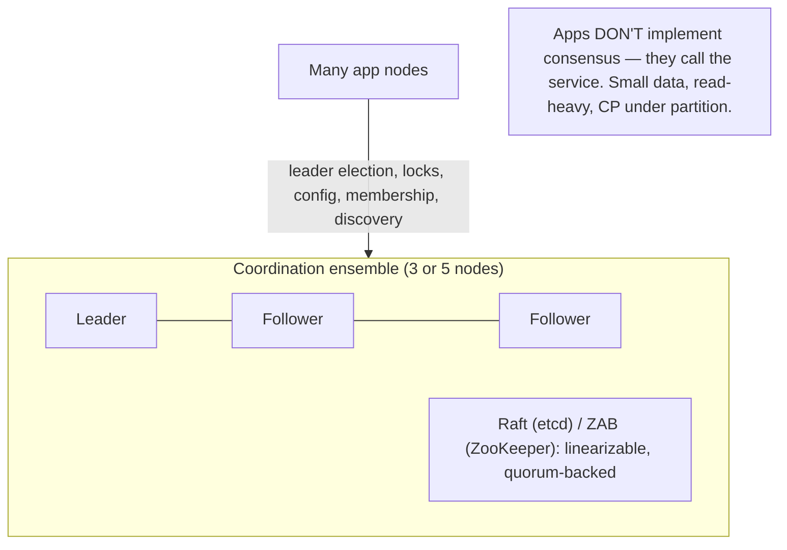
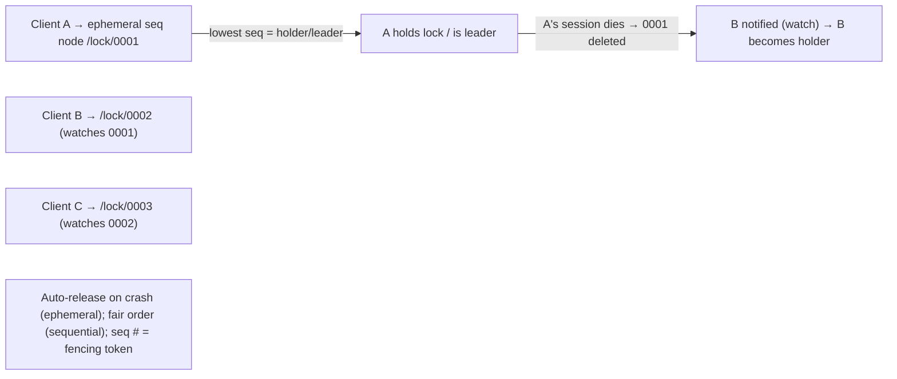

# Lesson 8.3.8 — Coordination Services (ZooKeeper/etcd, Representative)

> Part 8: Distributed Systems Core · Module 8.3: Coordination & Consensus · Difficulty: 🔴
>
> **Prerequisites:** [8.3.1 Consensus], [8.3.3 Raft], [8.3.5 Leader Election/Membership], [8.3.6 Locks/Fencing].
> **Unlocks:** [Part 12 Service Discovery], [Part 13 Kubernetes/etcd], [Part 9 Kafka coordination].

---

## 1. Learning Objectives

After this lesson you will be able to:

- Explain what a **coordination service** is (a small, strongly-consistent, highly-available store that **packages consensus** so applications get leader election, locks, config, membership, and discovery without implementing consensus themselves).
- Describe the **data model and primitives** (ZooKeeper znodes — ephemeral/sequential, watches; etcd keys — leases, watches, MVCC revisions) and how they compose into the coordination recipes (locks, election, membership, config).
- Explain the **operational characteristics**: strongly-consistent (linearizable writes via consensus — Raft/ZAB), highly-available (quorum of 3/5), **CP** under partition (chooses consistency — refuses on minority side), and **not** a general data store (small data, high read:write).
- Apply the **"don't build your own consensus — use a coordination service"** principle, and avoid the common misuses (treating it as a database, chatty/large data, ignoring the CP availability tradeoff).

---

## 2. Motivation — Consensus, packaged and reusable

Module 8.3 has shown that consensus is **the** foundation of coordination (8.3.1) and that implementing it correctly (Paxos/Raft) is **hard and error-prone** (8.3.2/8.3.3). It also showed that an enormous range of needs — **leader election** (8.3.5), **distributed locks + fencing** (8.3.6), **membership** (8.3.5), **configuration**, **service discovery** — all **reduce to consensus**. The obvious engineering move follows: **build consensus once, correctly, as a reusable service, and let every application use it** instead of each team re-implementing (and re-breaking) consensus. That is exactly what a **coordination service** like **ZooKeeper** or **etcd** is: a small, replicated, strongly-consistent key-value store backed by a consensus protocol (ZAB for ZooKeeper, Raft for etcd), exposing simple primitives that compose into all the coordination recipes.

This is one of the most practically important lessons in the module, because in real systems **you will almost never implement consensus yourself — you will use a coordination service.** Kubernetes stores its entire cluster state in **etcd**; Kafka historically used **ZooKeeper** for controller election and metadata; countless systems use them for leader election, locks, config, and discovery. Understanding what these services guarantee (strong consistency, high availability via quorum, **CP** behavior under partition), what primitives they offer (ephemeral nodes, watches, leases, sequential nodes), and — critically — what they are **not** (a general-purpose database; they hold **small** data with **high read:write** ratios) lets you use them correctly and avoid the classic misuses that cause outages. This lesson is the practical capstone of the coordination module: consensus made usable.

---

## 3. Theory — From first principles

### 3.1 What a coordination service is

A **coordination service** is a **small, replicated, strongly-consistent datastore** whose purpose is to provide the **coordination primitives** that distributed systems need `[CS]`:
- It runs an **ensemble** of `2f+1` nodes (typically **3 or 5**) using a **consensus protocol** (ZooKeeper: **ZAB**, an atomic-broadcast protocol; etcd/Consul: **Raft** — 8.3.3) so all writes go through consensus → **linearizable, durable, agreed** state.
- Applications **don't** implement consensus; they **call the service** for leader election, locks, config, membership, discovery — the service's consensus core does the hard part **once, correctly** (8.3.1 §7: don't roll your own).
- It is **not** a general database — it holds **small amounts of critical metadata** (KB-scale values, not blobs) with **read-heavy** access, optimized for **correctness and coordination**, not bulk storage or throughput.

### 3.2 ZooKeeper's model: znodes, ephemeral, sequential, watches

ZooKeeper exposes a **hierarchical namespace** (like a filesystem) of **znodes** (each holds a small data payload) `[CONV]`:
- **Persistent znodes:** exist until explicitly deleted — for config, durable metadata.
- **Ephemeral znodes:** **tied to the client's session** — automatically **deleted when the session ends** (client crashes/disconnects, heartbeats stop). This is the key primitive for **liveness/membership and locks**: "this node exists ⇔ this client is alive."
- **Sequential znodes:** ZooKeeper appends a **monotonically increasing counter** to the name → globally-ordered, unique names. Combined with ephemeral, used for **fair locks/queues and leader election** (lowest sequence number wins).
- **Watches:** a client can set a **one-time watch** on a znode to be **notified** when it changes/is deleted → event-driven coordination without polling (e.g., "notify me when the lock ahead of me is released").

These compose into the **coordination recipes** (§3.4).

### 3.3 etcd's model: keys, leases, watches, revisions

etcd (Raft-backed, the Kubernetes datastore) offers a flatter but similar toolkit `[CONV]`:
- **Key-value store** with **MVCC revisions** — every change bumps a global **revision** number; you can read/watch at a revision (multi-version, like 5.2.4).
- **Leases:** a key can be attached to a **lease (TTL)**; the client must **keepalive** the lease or the key is **auto-deleted** — the etcd analog of ZooKeeper ephemeral nodes (for liveness/locks — 8.3.6).
- **Watches:** stream changes to a key/prefix (event-driven, since a revision).
- **Transactions (compare-and-swap):** atomic if-then-else on key versions → the basis of locks and leader election (CAS = fencing-friendly — 8.3.6).
Same purpose as ZooKeeper, modern API; both **package consensus** identically in spirit.

### 3.4 The coordination recipes (how primitives compose)

These services are valuable because the simple primitives **compose** into all the coordination patterns `[CS]`:
- **Leader election (8.3.5):** candidates create **ephemeral sequential** znodes (or contend for a key via CAS + lease in etcd); the **lowest sequence number** (or the CAS winner) is leader; others **watch** the one ahead of them. If the leader's session dies, its ephemeral node vanishes → the next candidate is notified and becomes leader. **Quorum-backed → at most one leader** (8.3.5 §3.2). The sequence number / etcd revision serves as a **fencing token** (8.3.6).
- **Distributed lock (8.3.6):** acquire = create an ephemeral (sequential) node / CAS a lock key with a lease; the holder is the lowest/the CAS winner; **auto-released** if the holder dies (ephemeral/lease expiry). Use the **sequence/revision as a fencing token** (correctness locks — 8.3.6).
- **Membership/group (8.3.5):** each member creates an **ephemeral** node under a group path; the **set of children = live members**; watching the path gives **join/leave notifications**. (Strong, consistent membership — for the small coordination core.)
- **Configuration management:** store config in znodes/keys; clients **watch** for changes → **dynamic reconfiguration** without restarts (feature flags, cluster config).
- **Service discovery (Part 12):** services register (ephemeral) their address; clients look up / watch the registry → find live instances (Consul/etcd are common discovery backends).
- **Barriers/queues:** sequential nodes + watches implement distributed barriers and queues.

### 3.5 Guarantees and the CP tradeoff

Coordination services are deliberately **strongly consistent** `[CS]`:
- **Linearizable writes** (via consensus) — every write is agreed and ordered; reads can be linearizable (etcd's `serializable` vs `linearizable` read options; ZooKeeper reads are from any replica → can be slightly stale unless you `sync`). 
- **Highly available** within the quorum: tolerates `f` failures with `2f+1` nodes (3 tolerates 1; 5 tolerates 2 — 8.3.4).
- **CP under partition (CAP — Part 10):** during a network partition, the **majority side** keeps serving (consistently); the **minority side refuses writes** (and stale-or-refuses reads) to preserve consistency. So a coordination service **chooses consistency over availability** when partitioned — *correct* for coordination (you'd rather have **no leader** than **two**), but it means the service **can become unavailable** to the minority, and clients must handle that (the consensus stall — 8.3.1 §3.5). This is the right tradeoff *because* its job is correctness-critical coordination.

### 3.6 What they are NOT — and the misuse traps

Coordination services are **not general-purpose datastores** `[BP]`:
- **Small data only** — values are KB-scale metadata, not documents/blobs; total dataset fits in memory across the ensemble. Storing large/bulk data **degrades or breaks** them.
- **Low write throughput** — every write goes through consensus (quorum round-trip) → writes are **expensive**; they're tuned for **read-heavy, write-light** coordination, not high write rates.
- **Not for high-frequency application data** — using ZooKeeper/etcd as a cache or app database is a classic anti-pattern → overload, latency, instability.
- **Watches are not a message queue** — they're lightweight change notifications (often one-time in ZK), not a durable, high-throughput event bus (use Kafka — Part 9).
- **A critical dependency / potential SPOF-of-coordination** — if your whole system depends on the coordination service, its outage (or a partition making it unavailable) can **halt coordination** system-wide; it must be run carefully (odd-sized ensemble across failure domains, monitored) and its CP-unavailability handled gracefully.
**Rule:** use it for **small, critical coordination state**; **never** as a bulk store, cache, or high-throughput queue.

### 3.7 Why "don't build your own" — and where these fit

The overarching lesson `[BP]`: consensus is hard (8.3.1/8.3.2), and these services **encapsulate a correct, battle-tested implementation** plus the **recipes** (locks, election, membership) and **operational tooling**. So the right pattern is almost always: **delegate coordination to ZooKeeper/etcd/Consul** rather than implement consensus or hand-roll locks/election. They form the **small strongly-consistent core** (8.3.5 §3.6) that a larger, more-available system is built around — e.g., Kubernetes' control plane keeps all state in **etcd** (Raft) while the data plane scales independently; Kafka used **ZooKeeper** for the controller/metadata while brokers handle high-throughput data. This is the **hybrid architecture** from 8.3.5: a tiny consensus core for the correctness-critical coordination, with the bulk of the system running on cheaper, more-available mechanisms.

---

## 4. Visual Intuition

### A coordination service packages consensus

### Ephemeral + sequential = leader election / lock

---

## 5. Real-World Analogy

Think of a small, ultra-reliable **front-desk registry** for a large building full of teams.

- **What it is:** a **trusted clipboard at the front desk** (the coordination service) where teams record critical shared facts — "Team Lead today is Alice," "the conference room is in use by Bob," "current config: version 7." The desk has **a few backup clerks** (the ensemble) who keep **identical copies** and agree on every entry (consensus), so the clipboard is **never contradictory** even if a clerk steps out.
- **Ephemeral entries:** some entries are written in **disappearing ink tied to your presence** — if you leave the building (your session ends), your entry **auto-erases**. That's how "who's here" (membership) and "who holds the room" (locks) stay accurate without manual cleanup when someone leaves abruptly.
- **Sequential + watches:** to claim the conference room, you take a **numbered ticket** and the **lowest number** gets it; everyone else **watches the person ahead** and is **tapped on the shoulder** (watch) when the room frees — orderly, no constant pestering of the desk (no polling).
- **CP under partition:** if the building is split by a fire door (partition), only the side with **most clerks** keeps updating the clipboard; the other side **stops writing** rather than risk a second, conflicting clipboard. You'd rather have **no recorded room-holder** than **two teams both told they own the room.**
- **What it's NOT:** the front desk is for **small critical facts**, not for **storing everyone's documents** — if teams dumped all their files there, the clerks would be overwhelmed and the whole building's coordination would grind to a halt. Use the desk for the registry; store your actual work elsewhere.
- **Why use it:** rather than each team inventing its own error-prone way to agree on "who's the lead," everyone **trusts the one well-run front desk** (don't build your own consensus).

---

## 6. Industry Example

- **etcd in Kubernetes** `[CONV]`: the entire cluster state (objects, config, leader leases for controllers) lives in **etcd** (Raft) — the strongly-consistent brain of the K8s control plane (Part 13). *(Representative.)*
- **ZooKeeper for Kafka/Hadoop/HBase** `[CONV]`: Kafka historically used ZooKeeper for controller election and metadata; HBase/Hadoop use it for coordination (Kafka's newer **KRaft** mode replaces ZK with built-in Raft) (Part 9). *(Representative.)*
- **Consul** `[CONV]`: service discovery + KV + locks (Raft core + gossip/SWIM for health — 8.3.5) — coordination + discovery for microservices (Part 12). *(Representative.)*
- **Leader election / locks via ephemeral+sequential / leases** `[CONV]`: the standard recipes (§3.4) used across the industry for primary election, job coordination, and config (8.3.5/8.3.6). *(Representative.)*
- **CP behavior** `[CS]`: these services correctly **refuse on the minority side** during partitions (consistency over availability) — observed as coordination "freezes" until quorum returns (§3.5, Part 10). *(Representative.)*

---

## 7. Implementation Details — using coordination services well

- **Use a coordination service instead of building consensus/locks/election yourself** — ZooKeeper/etcd/Consul encapsulate correct consensus + recipes + tooling (§3.7, 8.3.1 §7) `[BP]`.
- **Run an odd-sized ensemble (3 or 5) across failure domains** (AZs/racks) — 3 tolerates 1 failure, 5 tolerates 2; spread so one AZ loss doesn't break quorum (8.3.4, Part 13).
- **Use ephemeral nodes/leases for liveness** (locks, membership) so resources auto-release on client death; **keepalive/heartbeat** sessions reliably (§3.2/3.3).
- **Use sequence numbers / etcd revisions as fencing tokens** for correctness locks (the resource must check them — 8.3.6) (§3.4).
- **Keep data small and read-heavy** — store **only** critical coordination metadata (KB-scale); **never** bulk/app data, caches, or high-frequency writes (§3.6).
- **Handle CP-unavailability gracefully** — clients must tolerate the service being **unavailable** (minority side / quorum loss) without cascading; design for "coordination temporarily frozen" (§3.5, Part 11).
- **Use watches for change notification**, not as a durable high-throughput queue (use Kafka — Part 9) (§3.6).
- **Monitor the ensemble** (quorum health, leader, latency, watch counts, data size) — it's a critical dependency; its degradation degrades system-wide coordination (§3.6, Part 16).
- **Mind the small-core pattern** — keep the coordination service as a tiny strongly-consistent core; scale the rest on cheaper, more-available mechanisms (§3.7, 8.3.5).

---

## 8. Advantages

- **Correct consensus, reused** — battle-tested implementation; don't roll your own (§3.7).
- **Composable primitives** — ephemeral/sequential/watches/leases/CAS build locks, election, membership, config, discovery (§3.4).
- **Strong consistency + HA** — linearizable, quorum-backed, tolerates `f` failures (§3.5).
- **Auto-cleanup** — ephemeral nodes/leases release resources on client death (no stuck locks) (§3.2/3.3).
- **Event-driven** — watches avoid polling (§3.2/3.3).
- **Ubiquitous & operationally mature** — etcd/ZooKeeper/Consul with tooling, docs, ecosystems (§6).

---

## 9. Disadvantages / limitations

- **CP under partition** — chooses consistency; **unavailable to the minority** / on quorum loss (correct, but a hard dependency that can freeze coordination) (§3.5).
- **Low write throughput** — every write is a consensus round; not for high write rates (§3.6).
- **Small data only** — not a general datastore; misuse degrades/breaks it (§3.6).
- **Critical dependency / coordination SPOF** — system-wide reliance; its outage halts coordination (must be carefully run) (§3.6).
- **Operational care required** — odd ensemble, failure-domain spread, monitoring, version upgrades.
- **Watch/session subtleties** — one-time watches, session expiry, connection-loss handling are easy to get wrong.

---

## 10. When NOT to use / limits

- **As a general database or cache** — small critical metadata only; use a real DB/cache for app data (§3.6).
- **For high-throughput writes or events** — consensus-per-write is too slow; use Kafka/a DB (§3.6, Part 9).
- **For large values/blobs** — use object storage (4.1.3); store a *pointer* in the coordination service if needed.
- **When you can avoid coordination** — prefer idempotency/single-writer/OCC over locks where possible (8.3.6 §3.7); don't add a coordination dependency you don't need.
- **As a message queue** — watches aren't durable high-throughput messaging (§3.6).

---

## 11. Common Mistakes

1. **Using ZooKeeper/etcd as a database/cache** → overload, latency, instability (small-data-only) (§3.6).
2. **High-frequency writes** → consensus-per-write bottleneck; degrades the ensemble (§3.6).
3. **Storing large values/blobs** → memory blowup, slow consensus (§3.6).
4. **Ignoring CP unavailability** → app cascades when the service is unavailable on the minority side / quorum loss (§3.5, Part 11).
5. **Not using ephemeral/lease for liveness** → stuck locks/stale membership when a client dies (§3.2/3.3).
6. **Treating watches as a durable queue** → missed/dropped events; use Kafka (§3.6).
7. **Even-sized or single-failure-domain ensemble** → no extra tolerance / one AZ loss breaks quorum (§7, 8.3.4).
8. **Building your own consensus instead of using one of these** → reinventing (and re-breaking) a solved, hard problem (§3.7).

---

## 12. Interview Questions

**🟢 Easy**
- What is a coordination service, and what problem does it solve?
- Name three things you'd use ZooKeeper/etcd for.

**🟡 Medium**
- How do ephemeral and sequential nodes (or etcd leases + CAS) implement leader election and locks? How is auto-release achieved?
- Why are coordination services CP (not AP)? What happens during a partition?

**🔴 Hard**
- Why must you NOT use a coordination service as a general datastore or high-throughput queue? What breaks?
- Design leader election + a fenced distributed lock using a coordination service's primitives. Where does the fencing token come from? (8.3.6)

**⚫ Staff+**
- Architect coordination for a large system: what small set of state goes in the strongly-consistent coordination service (etcd/ZooKeeper) vs the larger, more-available data plane, and why? Handle ensemble sizing/placement, CP-unavailability, and the coordination-SPOF risk (§3.5/3.6/3.7, 8.3.5).
- Compare implementing your own Raft-based coordination vs adopting etcd/ZooKeeper. Discuss correctness risk, operational maturity, the recipes you'd otherwise re-implement, and when (if ever) building your own is justified.

---

## 13. Production Pitfalls

- **Coordination service overload as a datastore:** teams store app data/large values/high-frequency writes → the ensemble degrades, latency spikes, and **all coordination** (locks, election, config) across the system suffers (§3.6) — a classic cascading outage.
- **Quorum-loss freeze:** losing the majority (2 of 3 nodes, or a partition) makes the service **unavailable**; dependent systems that didn't handle this **stall or cascade** (§3.5, Part 11).
- **Stuck lock from non-ephemeral use:** a lock implemented with persistent (not ephemeral/lease) state isn't released when the holder crashes → deadlock (§3.2/3.3, 8.3.6).
- **Single-AZ ensemble:** all coordination nodes in one AZ → an AZ outage breaks quorum → system-wide coordination loss (§7, Part 13).
- **Watch storm / herd:** thousands of clients watching the same znode all get notified on a change and stampede → overload (a coordination-layer thundering herd — 6.7) (§3.6).
- **Session-expiry surprises:** misunderstanding session/connection-loss semantics → unexpected ephemeral-node deletion (lock loss) or split-brain if not fenced (§3.2, 8.3.6).

---

## 14. Optimization Techniques

- **Use the service for small, critical coordination state only** — keep it fast and stable (§3.6) `[BP]`.
- **Odd ensemble (3/5) across failure domains** — tolerate failures + survive AZ loss (8.3.4, Part 13).
- **Ephemeral/lease + sequential/CAS recipes** for auto-releasing locks/election with fencing tokens (§3.2/3.3/3.4, 8.3.6).
- **Watches over polling** for change-driven coordination (mind watch herds — use hierarchical/targeted watches) (§3.2/3.6).
- **Cache/replicate read-heavy config** at clients (with watch-driven invalidation) to cut read load (§3.1, 6.5).
- **Graceful degradation** for CP-unavailability — clients tolerate "coordination frozen" without cascading (§3.5, Part 11).
- **Confine to the small core** — scale the data plane on cheaper mechanisms; don't route bulk traffic through the coordination service (§3.7, 8.3.5).
- **Monitor ensemble health, latency, data size, watch counts** — it's a critical dependency (§3.6, Part 16).

---

## 15. Summary

A **coordination service** (ZooKeeper, etcd, Consul — *representative*) is a **small, replicated, strongly-consistent datastore that packages consensus** so applications get **leader election, distributed locks, membership, configuration, and service discovery** without implementing consensus themselves — the practical answer to "consensus is hard; build it once, correctly, and reuse it" (8.3.1 §7). It runs an **odd-sized ensemble (3 or 5)** over a consensus protocol (**ZAB** for ZooKeeper, **Raft** for etcd — 8.3.3), giving **linearizable, quorum-backed** state that tolerates `f` failures with `2f+1` nodes. Its primitives **compose** into all the coordination recipes: ZooKeeper's **ephemeral** (auto-deleted when a client's session dies → liveness/locks/membership), **sequential** (monotonic naming → fair ordering + fencing tokens), and **watches** (event-driven change notification), and etcd's **leases** (TTL'd keys), **MVCC revisions**, **watches**, and **CAS transactions** — used to build **leader election** (lowest sequence/CAS winner, others watch, auto-failover on session death), **fenced locks** (8.3.6), **membership** (children of a group path = live members), **config** (watch for dynamic reconfig), and **discovery**. Crucially, coordination services are **CP** (CAP — Part 10): they **choose consistency over availability** under partition — the **majority side serves consistently while the minority refuses**, because for coordination you'd rather have **no leader than two** — so clients must handle the service being **temporarily unavailable** (the consensus stall — 8.3.1). And they are emphatically **not general-purpose datastores**: they hold **small (KB-scale), read-heavy** critical metadata; **misusing them** as a database, cache, high-throughput-write store, blob store, or message queue **overloads and destabilizes** them, often cascading into **system-wide coordination loss** (a critical-dependency SPOF). The right pattern is the **small strongly-consistent core** (8.3.5 §3.6): keep correctness-critical coordination in the service (Kubernetes' etcd, Kafka's ZooKeeper/KRaft) and run the larger, high-throughput data plane on cheaper, more-available mechanisms. **Don't build your own consensus — delegate to a coordination service, use it for small critical state, run an odd ensemble across failure domains, fence your locks, and design for its CP-unavailability.**

---

## 16. Revision Notes (flashcard-ready)

- **Q:** What is a coordination service? **A:** Small, replicated, strongly-consistent store that packages consensus → leader election, locks, membership, config, discovery.
- **Q:** Examples + consensus protocol? **A:** ZooKeeper (ZAB), etcd (Raft), Consul (Raft + gossip).
- **Q:** ZooKeeper primitives? **A:** Znodes; ephemeral (auto-delete on session death), sequential (monotonic naming), watches (change notifications).
- **Q:** etcd primitives? **A:** KV with MVCC revisions, leases (TTL keys), watches, CAS transactions.
- **Q:** How is leader election built? **A:** Ephemeral+sequential (lowest seq wins) / CAS+lease; others watch; auto-failover on session death; quorum → one leader.
- **Q:** Where do fencing tokens come from? **A:** Sequence numbers / etcd revisions — checked by the protected resource (8.3.6).
- **Q:** CP or AP? **A:** CP — under partition, majority serves consistently, minority refuses; prefer no leader over two.
- **Q:** What are they NOT? **A:** Not a general database/cache/queue/blob store; small (KB) read-heavy critical metadata only.
- **Q:** Top misuse? **A:** Using as a datastore / high-frequency writes → overload → system-wide coordination loss.
- **Q:** Ensemble sizing? **A:** Odd (3 or 5) across failure domains; 3 tolerates 1, 5 tolerates 2.
- **Q:** Overarching rule? **A:** Don't build your own consensus — use a coordination service as a small strongly-consistent core.

---

## 17. Further Reading + Knowledge-Graph Links

**Within this platform**
- **Builds on:** [8.3.1 Consensus] (don't roll your own), [8.3.3 Raft] (etcd's protocol), [8.3.5 Leader Election/Membership], [8.3.6 Locks/Fencing], [8.3.4 Quorums].
- **Closes:** Module 8.3. **Next:** [8.4.1 RPC Semantics] (how services call each other). 
- **Enables:** [Part 12 Service Discovery / Microservice coordination], [Part 13 Kubernetes/etcd], [Part 9 Kafka coordination].

**Foundational texts (synthesized)**
- Hunt et al., *ZooKeeper* (concept, synthesized).
- etcd / Consul documentation — Raft-backed coordination, leases, watches (representative).
- Kleppmann, *Designing Data-Intensive Applications* — coordination services, linearizability, membership (synthesized).

**Concept tags:** `[CS]` coordination service = packaged consensus, linearizable quorum store, CP under partition · `[CONV]` ZooKeeper (znodes/ephemeral/sequential/watches), etcd (leases/MVCC/CAS), K8s etcd, Kafka ZK/KRaft · `[BP]` don't build your own consensus, small read-heavy data only, ephemeral+fencing recipes, odd ensemble across AZs, handle CP-unavailability.
