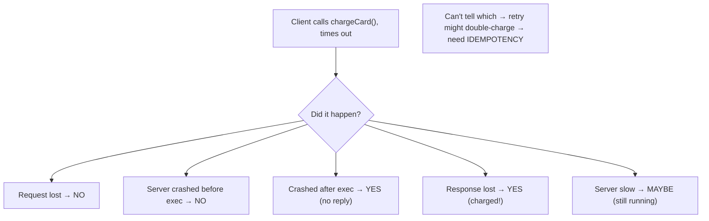

# Lesson 8.4.1 — RPC/RMI Semantics, Failure Modes, and Idempotency

> Part 8: Distributed Systems Core · Module 8.4: Remote Communication · Difficulty: 🔴
>
> **Prerequisites:** [8.1.1 Unreliable Networks], [8.1.3 Timeouts/Retries], [3.2.6 gRPC/REST], [3.1.3 TCP].
> **Unlocks:** [8.4.2 Middleware], [Part 9 Delivery Semantics], [Part 11 Idempotency/Resilience], [Part 12 Microservices].

---

## 1. Learning Objectives

After this lesson you will be able to:

- Explain what **RPC (Remote Procedure Call)** is and the **fundamental leaky abstraction**: a remote call **looks like** a local call but **isn't** — it can be slow, fail partially, and have ambiguous outcomes (the fallacies — 8.1.1).
- Distinguish the **delivery/execution semantics** — **at-most-once**, **at-least-once**, **exactly-once** — and explain why **true exactly-once delivery is impossible** but **exactly-once *effects*** are achievable via **idempotency + deduplication**.
- Reason about RPC **failure modes** (lost request, lost response, server crash before/after executing, timeout) and why a timeout leaves the outcome **ambiguous** (8.1.1) — so retries require **idempotency**.
- Apply **idempotency** (idempotency keys, dedup, natural idempotency) and design safe request/retry patterns for remote calls.

---

## 2. Motivation — The function call that crosses a network

**RPC (Remote Procedure Call)** — and its OO cousin **RMI (Remote Method Invocation)** — is the dominant model for services talking to each other: you call what *looks* like a normal function (`getUser(id)`, `chargeCard(amount)`), and the framework marshals the arguments, sends them over the network, runs the procedure on a remote server, and returns the result. It's a powerful abstraction that makes distributed programming feel familiar — and that's exactly the danger. **A remote call is *not* a local call**, and pretending otherwise is the source of the **Fallacies of Distributed Computing** (8.1.1 §3.6): the call can take **thousands of times longer**, the network can **lose** the request or response, the server can **crash** mid-execution, and — critically — when your call **times out**, you **cannot tell** whether the operation **happened, partially happened, or didn't happen at all** (8.1.1's ambiguity). A local `chargeCard()` either returns or crashes the whole process; a remote `chargeCard()` might have **charged the card** even though you got a timeout.

This ambiguity forces the central question of remote communication: **what happens when you retry?** Because the network loses messages (8.1.1), you *must* retry (8.1.3) — but if the original call actually succeeded (only the *response* was lost), the retry **double-charges**. This is why **delivery semantics** (at-most-once / at-least-once / exactly-once) and **idempotency** are not optional niceties but the core correctness machinery of every distributed system. The punchline — which this lesson builds carefully — is that **"exactly-once delivery" is impossible**, but **"exactly-once *effects*"** is achievable and is what you actually want, via **idempotency + deduplication**. Master this and you can make remote calls *correct* despite the unreliable network; ignore it and you get double charges, duplicate orders, and corrupted state.

---

## 3. Theory — From first principles

### 3.1 RPC and the leaky abstraction

**RPC** makes a call to a remote service **look like a local procedure call** `[CS]`: the client invokes a **stub** (local proxy) that **marshals (serializes)** the arguments, sends them (3.2.6 — gRPC/Thrift/etc.), the server **unmarshals**, executes the real procedure, **marshals** the result, and sends it back; the stub returns it. The goal is **location transparency** — code that calls a remote service like a local object.

But this transparency is a **leaky abstraction** `[CS]` — the differences from a local call are profound and *cannot* be hidden (the fallacies — 8.1.1):
- **Latency:** a local call is ~ns; a remote call is ~µs–ms (or worse) — **orders of magnitude** slower (4.1.1, 1.1.3). Treating remote calls as free leads to chatty, slow designs.
- **Partial failure & ambiguity:** a local call **returns or the process dies**; a remote call can **time out** with the outcome **unknown** (8.1.1 §3.2) — the central problem.
- **Failures the caller never sees locally:** network down, server crashed, marshalling/version mismatch (3.2.6 schema evolution), overload.
- **Serialization cost & type/version issues:** arguments must be serialized and the schema must be compatible across versions (3.2.6/4.3.1).
The mature view: **RPC is convenient, but you must program it knowing it's a network call** — with timeouts, retries, idempotency, and failure handling — not a local function (§3.4–3.6). (Modern RPC frameworks like gRPC make this explicit with deadlines, status codes, and streaming — 3.2.6.)

### 3.2 The RPC failure modes

When you make an RPC and something goes wrong, the possible realities are `[CS]` (the 8.1.1 ambiguity, concretely):
1. **Request lost** — the server never received it. (Operation did **not** happen.)
2. **Server crashed before executing** — received but didn't run. (Did **not** happen.)
3. **Server crashed during/after executing, before replying** — operation **happened** (maybe partially) but you got no confirmation.
4. **Response lost** — operation **happened and succeeded**, but the success reply didn't reach you.
5. **Server slow** — it's still processing; your timeout fired but it may yet succeed (8.1.3).

From the client, **on a timeout, cases 1–5 are indistinguishable** — you **cannot know** whether the operation occurred. This is the crux: **a timed-out RPC has an unknown outcome.** Your handling (retry? fail? check?) must be **safe for all five cases** — which is what idempotency provides (§3.5).

### 3.3 Delivery/execution semantics

How many times might the operation actually **execute**? Three semantics `[CS]`:
- **At-most-once:** the operation executes **zero or one** times — **never twice**, but might **not happen** (if a failure occurs, you don't retry). Achieved by **not retrying**. Safe against duplicates, but you might **lose** the operation (it may never happen). Appropriate when a missed operation is acceptable but a duplicate is harmful *and* you have no dedup.
- **At-least-once:** the operation executes **one or more** times — it **will** happen (you retry until success), but might happen **multiple times** (duplicates from retries on lost responses). Achieved by **retrying until acknowledged**. The **common default** for important operations — but it **requires the operation to tolerate duplicates** (idempotency — §3.5), or you get double-execution.
- **Exactly-once:** the operation's **effect** occurs **once and only once** — the ideal. **Naively impossible** for *delivery* (see §3.4), but achievable as **exactly-once *effects*** via **at-least-once delivery + idempotent processing/dedup** (§3.5).

**The practical pairing** `[BP]`: most systems use **at-least-once delivery** (retry until acked) **+ idempotency/dedup** to achieve **exactly-once effects**. At-most-once is for "fire and forget" where loss is OK. (These same semantics reappear in messaging — Part 9.)

### 3.4 Why true exactly-once *delivery* is impossible

You **cannot guarantee** a message is **delivered and processed exactly once** over an unreliable network `[CS]`. The intuition (a two-generals-style argument):
- The sender can't know if a lost-response means "not processed" (retry needed) or "processed, ack lost" (retry = duplicate) — the §3.2 ambiguity. To be safe against loss it **must** be willing to **retry** (→ possible duplicate). To never duplicate it must **not retry** (→ possible loss). You **can't have both** with delivery alone.
- No finite number of acknowledgments resolves it: every ack can itself be lost, so neither side can ever be *certain* the other knows (the "two generals problem" — agreement over an unreliable channel is impossible with certainty).

So **"exactly-once delivery" is a myth** — anyone claiming it is really providing **at-least-once delivery + deduplication** (= exactly-once *effects*) under the hood. The correct goal is **exactly-once *effects***: the operation may be *delivered/attempted* multiple times, but its **observable effect happens once** because duplicates are **detected and ignored** (§3.5). This reframing — **effects, not delivery** — is one of the most important ideas in distributed systems (and recurs in Part 9/11).

### 3.5 Idempotency — the key to safe retries and exactly-once effects

An operation is **idempotent** if **applying it multiple times has the same effect as applying it once** `[CS]`. Idempotency is what makes **at-least-once delivery safe** → **exactly-once effects**:
- **Naturally idempotent operations:** `set x = 5` (setting again = same), `DELETE /resource/42` (deleting an already-deleted thing = no-op), `PUT` (replace) — HTTP **GET/PUT/DELETE** are defined idempotent; **POST** is **not** (3.2.1). Reads are idempotent. Retrying these is inherently safe.
- **Non-idempotent operations** (the dangerous ones): `balance += 100`, "create a new order," "charge the card" — applying twice **doubles** the effect. Retrying these naively = double charge/order.
- **Making operations idempotent** (the engineering) `[BP]`:
  - **Idempotency keys:** the client attaches a **unique ID** to the request (e.g., a UUID per logical operation). The server **records processed keys** and, on a **duplicate key**, **returns the original result without re-executing**. This converts any operation into an effectively-idempotent one — the standard pattern (used by Stripe, payment APIs, etc.).
  - **Deduplication:** the server tracks recently-seen request IDs and **ignores duplicates** (a dedup window/table).
  - **Natural keys / conditional writes:** use a unique business key (order number) with an upsert / `INSERT ... ON CONFLICT DO NOTHING`, or **compare-and-set / version checks** (5.2.4, fencing — 8.3.6) so a re-applied write is detected.
  - **Make the operation state-based, not delta-based:** prefer `set balance = X` (idempotent) over `add 100` (not) where possible.
- **Result:** with idempotency, the client can **safely retry** any timed-out RPC (§3.2) without fear of double effects → **at-least-once delivery + idempotency = exactly-once effects.**

### 3.6 Designing safe RPC interactions

Putting it together, a correct remote call `[BP]`:
1. **Set a timeout** (monotonic, ideally adaptive + deadline-propagated — 8.1.3/8.1.2).
2. **On timeout/failure, retry** (with **exponential backoff + jitter**, caps/budgets — 8.1.3/6.7) — *because the network loses messages.*
3. **Ensure the operation is idempotent** (idempotency key / natural key / conditional write) so retries don't double-apply (§3.5) — *because the outcome was ambiguous.*
4. **Use a circuit breaker / bulkhead** (Part 11) so a failing dependency doesn't exhaust resources or cause retry storms (8.1.3, 6.7).
5. **Handle the genuinely-unknown outcome** for non-idempotent legacy operations: if you truly can't make it idempotent, you may need to **query the server's state** ("did order X get created?") before retrying, or accept at-most-once (don't retry) — but **idempotency keys are almost always the better answer.**
This is the practical embodiment of 8.1's lessons applied to service-to-service calls — and it's why **idempotency is a foundational requirement of microservices** (Part 12) and messaging (Part 9).

### 3.7 RPC vs messaging, and modern RPC

Brief framing `[CONV]`:
- **RPC is synchronous request/response** — the caller waits for a reply (tight coupling, immediate result, but the caller's latency/availability depends on the callee — Part 12). 
- **Messaging (Part 9)** is asynchronous — fire to a broker, process later (decoupling, buffering, resilience — 7.6). Same delivery semantics (at-least-once + idempotency) apply, but the *interaction style* differs.
- **Modern RPC frameworks** (gRPC — 3.2.6) make the network *explicit*: typed contracts (Protobuf), **deadlines**, **status codes**, streaming, and built-in retry/deadline propagation — embracing (not hiding) the leaky abstraction. This is the right evolution: RPC that **looks like the network it is**, not a fake local call. (Historical RPC/CORBA tried to hide it — a known anti-pattern, 8.4.2.)

---

## 4. Visual Intuition

### The ambiguous timeout



### At-least-once + idempotency = exactly-once effects

```mermaid
flowchart LR
    C["Client: retry with idempotency key K until acked (at-least-once)"] --> S["Server: seen K before?"]
    S -->|no| EXEC["execute once, record K, return result"]
    S -->|yes (duplicate)| DEDUP["skip execution, return original result"]
    EXEC --> EFFECT["effect happens ONCE"]
    DEDUP --> EFFECT
```

---

## 5. Real-World Analogy

Imagine **ordering a pizza by mailing a postcard** (no phone, unreliable mail — the network).

- **RPC's illusion:** filling out the postcard feels as easy as walking to your own kitchen (a local call), but it absolutely **isn't** — the postcard takes time, can get **lost**, and the pizzeria might **burn down** mid-bake (latency, loss, partial failure).
- **The ambiguous timeout:** you mail "send me a pizza," and an hour passes with **no pizza and no reply**. Did the **postcard get lost** (no pizza coming)? Did they **make it but the delivery van crashed** (made, not delivered)? Did they **deliver to the wrong house** (succeeded, you didn't see it)? **You can't tell** — so do you **mail another postcard** (retry)?
- **The double-order danger (no idempotency):** if you re-mail "send me a pizza" and the **first one was actually being made**, you now get — and pay for — **two pizzas** (double charge). That's at-least-once **without** idempotency.
- **Idempotency keys fix it:** instead, you write **"Order #A7"** on every postcard. The pizzeria keeps a list of order numbers it's filled. If a second "#A7" arrives, they see "we already made #A7" and **don't make a second pizza** — they just confirm the existing one. Now you can **safely re-mail #A7 as many times as you want** until you get confirmation, and you'll **never get two pizzas** (at-least-once + dedup = exactly-once *effect*).
- **Why "exactly-once delivery" is a myth:** there's no way to guarantee **exactly one postcard arrives and is acted on** — every confirmation letter could itself get lost, so neither you nor the pizzeria can ever be *100% certain* the other knows. But by **numbering orders and ignoring duplicates**, you get what you actually want: **exactly one pizza**, regardless of how many postcards bounced around.

---

## 6. Industry Example

- **Stripe-style idempotency keys** `[BP]`: payment APIs require an **idempotency key** per request so retrying a charge never double-charges — the canonical exactly-once-effects pattern (§3.5). *(Representative.)*
- **gRPC** `[CONV]`: modern RPC with typed Protobuf contracts, **deadlines**, status codes, streaming, and retry/deadline propagation — RPC that makes the network explicit (3.2.6, §3.7). *(Representative.)*
- **At-least-once + dedup in messaging** `[CONV]`: Kafka/SQS deliver at-least-once; consumers **dedupe by key** for exactly-once effects (Part 9) — same principle as RPC retries (§3.3/3.5). *(Representative.)*
- **"Exactly-once" claims are at-least-once + dedup** `[CS]`: systems advertising exactly-once (e.g., Kafka EOS) implement it as at-least-once delivery + idempotent producers/transactional dedup, not magical single delivery (§3.4, Part 9). *(Representative.)*
- **HTTP method idempotency** `[CONV]`: GET/PUT/DELETE idempotent, POST not (3.2.1) — clients can safely retry idempotent methods, must be careful with POST (§3.5). *(Representative.)*

---

## 7. Implementation Details — safe remote calls

- **Program RPC as a network call** — set **timeouts** (monotonic/adaptive + deadline propagation — 8.1.2/8.1.3), expect latency/loss/partial failure; don't treat it as a local function (§3.1) `[BP]`.
- **Use at-least-once + idempotency for important operations** — retry until acked, and make the operation **idempotent** (idempotency keys / natural keys / conditional writes / CAS) so retries are safe (§3.3/3.5).
- **Add idempotency keys to non-idempotent mutating calls** (charges, order creation): client sends a unique key; server records processed keys and **returns the prior result on duplicates** (§3.5).
- **Prefer state-based over delta-based operations** (`set X` over `add N`) where possible — naturally idempotent (§3.5).
- **Retry with exponential backoff + jitter + caps/budgets** (8.1.3/6.7) and **circuit breakers/bulkheads** (Part 11) to avoid retry storms and resource exhaustion (§3.6).
- **Never claim/expect "exactly-once delivery"** — design for **at-least-once + dedup → exactly-once effects** (§3.4).
- **Use at-most-once (no retry) only for loss-tolerant, fire-and-forget** operations (telemetry, best-effort) (§3.3).
- **Keep calls coarse, not chatty** (latency fallacy) — batch where possible; consider async messaging (Part 9) for decoupling (§3.7, 7.6).
- **Version contracts compatibly** (schema evolution — 4.3.1/3.2.6) so RPC marshalling survives rolling deploys.

---

## 8. Advantages (of RPC done right)

- **Familiar, productive model** — call remote services like functions; clear contracts (gRPC/Protobuf) (§3.1).
- **Synchronous, immediate results** — good for request/response interactions needing an answer now (§3.7).
- **Exactly-once effects achievable** — at-least-once + idempotency gives correct, retry-safe operations (§3.3/3.5).
- **Strong tooling (modern RPC)** — gRPC's deadlines, status codes, streaming, retries make the network explicit and manageable (§3.7, 3.2.6).
- **Composable with resilience** — timeouts, retries, circuit breakers, bulkheads make remote calls robust (§3.6, Part 11).

---

## 9. Disadvantages / hard realities

- **Leaky abstraction** — hiding the network behind a "function call" invites latency/failure bugs (the fallacies) (§3.1).
- **Ambiguous outcomes** — a timed-out call has unknown effect; you can't tell happened-vs-not (§3.2).
- **Exactly-once delivery impossible** — must settle for at-least-once + dedup (§3.4).
- **Retries require idempotency** — otherwise double-execution (charges/orders) (§3.5).
- **Synchronous coupling** — caller's latency/availability depends on the callee (mitigate with async messaging — Part 9, §3.7).
- **Chatty designs** — treating remote calls as cheap → N+1 remote calls, slow systems (§3.1, latency fallacy).

---

## 10. When NOT to / limits

- **Don't retry non-idempotent operations** without idempotency keys/dedup → double effects (§3.5).
- **Don't claim/rely on "exactly-once delivery"** — it's impossible; use exactly-once effects (§3.4).
- **Don't use synchronous RPC for everything** — for decoupling, buffering, spikes, prefer async messaging (Part 9, 7.6, §3.7).
- **Don't make chatty fine-grained remote calls** — batch/coarsen (latency fallacy) (§3.1).
- **Don't hide the network** (old CORBA-style transparent RPC) — make failures/latency explicit (§3.7, 8.4.2).
- **At-most-once only for loss-tolerant** operations — not for charges/orders (§3.3).

---

## 11. Common Mistakes

1. **Treating RPC as a local call** — no timeout, assuming success, ignoring latency/failure (the fallacies) (§3.1).
2. **Retrying without idempotency** — double charges/orders from lost-response retries (§3.5) — the classic, costly bug.
3. **Believing in exactly-once delivery** — building on a myth instead of at-least-once + dedup (§3.4).
4. **Delta-based mutations** (`add N`) that aren't idempotent, then retrying them (§3.5).
5. **No timeout / unbounded wait** — a hung dependency exhausts resources (8.1.3, §3.6).
6. **Synchronized retries / no backoff** — retry storms (8.1.3/6.7, §3.6).
7. **Chatty remote calls** — N+1 remote round-trips tank latency (§3.1).
8. **Treating a timed-out call as definitely-failed** — it may have succeeded (response lost) → acting on "failure" causes inconsistency (§3.2).

---

## 12. Interview Questions

**🟢 Easy**
- What is RPC, and why is it a "leaky abstraction"?
- What does it mean for an operation to be idempotent? Give an idempotent and a non-idempotent example.

**🟡 Medium**
- List the RPC failure modes. Why is a timed-out call's outcome ambiguous?
- Compare at-most-once, at-least-once, and exactly-once. Which is the common default and what does it require?

**🔴 Hard**
- Why is "exactly-once delivery" impossible, and how do systems achieve exactly-once *effects*? (At-least-once + idempotency/dedup.)
- Design idempotency for a "charge the customer" RPC so retries never double-charge. (Idempotency keys, server-side dedup, returning the original result.)

**⚫ Staff+**
- Design safe service-to-service communication for an order/payment flow over an unreliable network: timeouts, retries (backoff/jitter/budgets), idempotency keys, circuit breakers, and how you handle the ambiguous-timeout case for a non-idempotent legacy endpoint. Justify each against the failure modes.
- A payments outage double-charged customers after a network blip triggered retries. Diagnose the root cause (at-least-once retries without idempotency), and design the fix (idempotency keys + dedup → exactly-once effects), plus how you'd reconcile the already-double-charged records.

---

## 13. Production Pitfalls

- **Double-charge / duplicate-order:** a lost *response* triggers a retry of a non-idempotent operation → the customer is charged twice / two orders created (§3.2/3.5) — the signature distributed-systems bug.
- **"Exactly-once" misbelief:** a team builds assuming the framework guarantees single delivery; under failure, duplicates appear and corrupt state (§3.4).
- **Resource exhaustion from no timeout:** an RPC to a hung dependency holds threads/connections until the pool is exhausted → caller falls over (8.1.3, §3.6).
- **Retry storm:** a blip triggers synchronized retries that overwhelm the recovering service → metastable outage (8.1.3/6.7, §3.6).
- **Acting on a false "failure":** treating a timed-out-but-actually-succeeded call as failed → e.g., re-creating an order that exists, or telling the user it failed when it didn't (§3.2).
- **Chatty RPC latency:** an endpoint makes N remote calls in a loop (N+1) → multiplied network latency → slow responses (§3.1, latency fallacy).

---

## 14. Optimization Techniques

> *Correctness + efficiency for remote calls.*

- **Idempotency keys + server-side dedup** → exactly-once effects, retry-safe (§3.5) `[BP]`.
- **At-least-once + idempotency** as the default for important operations (§3.3).
- **State-based (idempotent) operations** over delta-based where possible (§3.5).
- **Timeouts (monotonic/adaptive) + deadline propagation** (8.1.2/8.1.3) to bound blast radius (§3.6).
- **Backoff + jitter + retry budgets + circuit breakers + bulkheads** to prevent storms/exhaustion (8.1.3/6.7, Part 11).
- **Batch/coarsen calls** (avoid chatty N+1) and consider **async messaging** for decoupling/buffering (§3.1/3.7, Part 9, 7.6).
- **Modern RPC (gRPC)** for explicit deadlines/status/streaming and compatible **schema evolution** (3.2.6/4.3.1).

---

## 15. Summary

**RPC (Remote Procedure Call)** makes a remote service call **look like a local function** (a stub marshals arguments, sends them, the server executes and replies) — but it's a **leaky abstraction**: unlike a local call, it's **orders of magnitude slower**, can be **lost**, can **partially fail**, and — on a **timeout** — leaves the outcome **ambiguous**. The **failure modes** (request lost, server crashed before/after executing, response lost, server slow) are **indistinguishable from the client's view**: a timed-out call's effect is **unknown** (8.1.1). Because the network loses messages, you **must retry** (8.1.3) — but if the original actually succeeded (response lost), a naive retry **double-executes** (double charge/order). This drives the **delivery/execution semantics**: **at-most-once** (zero-or-one — don't retry; may lose the operation), **at-least-once** (one-or-more — retry until acked; may duplicate — the common default), and **exactly-once** (the ideal). Crucially, **true exactly-once *delivery* is impossible** (a two-generals argument: every ack can be lost, so no certainty is reachable; safety against loss requires retries → possible duplicates) — what's achievable and what you actually want is **exactly-once *effects***: deliver at-least-once but make the **effect happen once** via **idempotency + deduplication**. An **idempotent** operation has the same effect applied once or many times — naturally so for reads/`set`/`PUT`/`DELETE` (3.2.1), but **not** for `add`/`charge`/`create`; you **engineer** idempotency with **idempotency keys** (unique per logical op; server records processed keys and returns the prior result on duplicates — the Stripe pattern), **dedup windows**, **natural keys / conditional writes (upsert/CAS)**, and preferring **state-based over delta-based** operations. With idempotency, you can **safely retry** any ambiguous timed-out call → **at-least-once + idempotency = exactly-once effects.** A correct remote call therefore combines **timeouts (monotonic/adaptive + deadline propagation), backoff/jitter/capped retries, idempotency, and circuit breakers/bulkheads** (8.1.2/8.1.3/6.7/Part 11). Modern RPC (gRPC — 3.2.6) makes the network **explicit** (deadlines, status codes, contracts) rather than hiding it (the old CORBA anti-pattern — 8.4.2), and async **messaging** (Part 9) is the alternative when you want decoupling over synchronous request/response. Idempotency and exactly-once *effects* are foundational to microservices (Part 12) and messaging (Part 9).

---

## 16. Revision Notes (flashcard-ready)

- **Q:** What is RPC and why "leaky"? **A:** Remote call made to look local; but it's slow, can fail partially, and times out with ambiguous outcome — can't hide the network.
- **Q:** RPC failure modes? **A:** Request lost, server crashed before exec, crashed after exec, response lost, server slow — indistinguishable on timeout.
- **Q:** Why is a timed-out call ambiguous? **A:** You can't tell if the operation happened, partially happened, or didn't (8.1.1).
- **Q:** Three delivery semantics? **A:** At-most-once (0/1, may lose), at-least-once (1+, may duplicate — common default), exactly-once (ideal).
- **Q:** Why is exactly-once delivery impossible? **A:** Safety vs loss requires retries (→duplicates); every ack can be lost → no certainty (two-generals).
- **Q:** What's achievable instead? **A:** Exactly-once *effects* = at-least-once delivery + idempotency/dedup.
- **Q:** Idempotent operation? **A:** Same effect applied once or many times (reads, set, PUT, DELETE); NOT add/charge/create.
- **Q:** How to make ops idempotent? **A:** Idempotency keys (record + return prior result on dup), dedup, natural keys/upsert/CAS, state-based not delta-based.
- **Q:** Safe RPC recipe? **A:** Timeout + backoff/jitter/capped retry + idempotency + circuit breaker/bulkhead.
- **Q:** Modern RPC vs old? **A:** gRPC makes the network explicit (deadlines/status/contracts); old CORBA tried to hide it (anti-pattern).

---

## 17. Further Reading + Knowledge-Graph Links

**Within this platform**
- **Builds on:** [8.1.1 Unreliable Networks] (ambiguity), [8.1.3 Timeouts/Retries] (why retry + how), [3.2.6 gRPC/REST] (the RPC mechanism), [3.2.1 HTTP method idempotency].
- **Next:** [8.4.2 Middleware] (the broader communication infrastructure). 
- **Enables:** [Part 9 Delivery Semantics / exactly-once] (same ideas in messaging), [Part 11 Idempotency/Resilience], [Part 12 Microservices communication].

**Foundational texts (synthesized)**
- Birrell & Nelson, "Implementing Remote Procedure Calls" (concept, synthesized).
- Waldo et al., "A Note on Distributed Computing" — RPC leaky abstraction (concept, synthesized).
- Kleppmann, *Designing Data-Intensive Applications* — RPC, delivery semantics, idempotency, exactly-once (synthesized).

**Concept tags:** `[CS]` RPC leaky abstraction, failure modes, ambiguous timeout, at-most/at-least/exactly-once, exactly-once-delivery impossible, idempotency · `[CONV]` gRPC explicit network, HTTP method idempotency, at-least-once+dedup messaging · `[BP]` idempotency keys, at-least-once+idempotency=exactly-once effects, state-based ops, timeouts+backoff+breakers.
