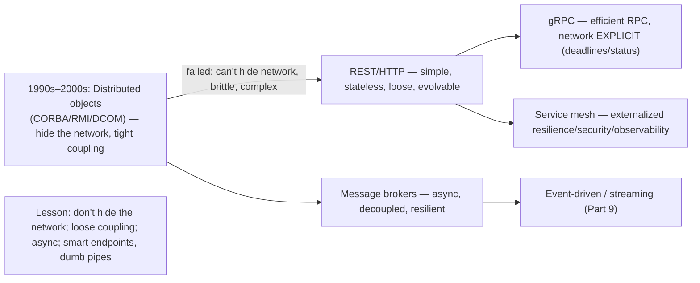
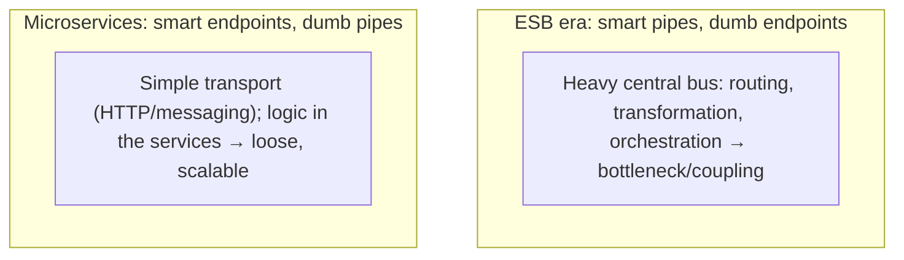

# Lesson 8.4.2 — Middleware and Distributed Objects (Historical → Modern)

> Part 8: Distributed Systems Core · Module 8.4: Remote Communication · Difficulty: 🟡🔴
>
> **Prerequisites:** [8.4.1 RPC Semantics], [8.1.1 Fallacies], [3.2.6 API Styles], [2.2.4 Event-Driven].
> **Unlocks:** [Part 9 Messaging], [Part 12 Microservices/Service Mesh], [Part 13 Cloud Native].

---

## 1. Learning Objectives

After this lesson you will be able to:

- Define **middleware** (software "in the middle" that connects distributed components, abstracting communication, naming, and integration) and the categories (RPC/object, message-oriented, transaction, integration).
- Trace the **historical arc** — distributed objects (CORBA, Java RMI, DCOM) → their decline → modern approaches (REST/gRPC, message brokers, service mesh, cloud-native) — and the **lessons learned** (don't hide the network; favor loose coupling and async).
- Explain why **distributed-object middleware failed at its central promise** (location transparency over a network is a leaky abstraction — 8.1.1/8.4.1) and what replaced it and why.
- Identify modern middleware (**message brokers**, **API gateways**, **service mesh**, **ESB→microservices**) and place each in the loose-coupling / async / explicit-network design philosophy.

---

## 2. Motivation — The infrastructure between your services, and the lessons of its history

Distributed systems are made of components that must **find each other, communicate, and integrate** despite the unreliable network (8.1.1) — and the software that provides this "glue" is called **middleware**. Every distributed system uses middleware of some kind: an RPC framework (8.4.1), a message broker (Part 9), an API gateway (3.3.2), a service mesh (Part 12), a service-discovery system (8.3.8). Understanding middleware as a category — and especially the **history of how it evolved** — is valuable because the field **learned hard lessons** that shape every modern design choice, and those lessons recur in microservices (Part 12), cloud-native (Part 13), and messaging (Part 9).

The central historical lesson is a cautionary tale. In the 1990s–2000s, the dominant vision was **distributed objects** — middleware like **CORBA**, **Java RMI**, and **DCOM** that let you call methods on remote objects **as if they were local** (the location-transparency dream — 8.4.1). It was elegant in theory and **largely failed in practice**, for reasons that are now textbook: **you cannot hide the network** (the fallacies — 8.1.1), tight coupling and complex binary protocols made systems brittle and hard to evolve, and cross-vendor interoperability was painful. The industry **moved away** — toward **simpler, looser, more explicit** approaches: **REST** (simple, web-native, evolvable — 3.2.6), **message brokers** (asynchronous, decoupled — Part 9), and eventually **service mesh** (Part 12) and cloud-native patterns (Part 13). The throughline of that evolution — **don't hide the network; prefer loose coupling and asynchrony; make failure and latency explicit** — is one of the most important design principles in distributed systems. This lesson surveys middleware as a category, tells the distributed-objects cautionary tale, and connects the lessons to the modern stack you'll actually build on.

---

## 3. Theory — From first principles

### 3.1 What middleware is

**Middleware** is software that sits **between** distributed application components (and between applications and the OS/network), providing **common services** that make building distributed systems easier `[CS]`:
- **Communication abstraction** — hiding the raw network/sockets behind higher-level calls (RPC, messaging).
- **Naming/location/discovery** — finding components without hardcoded addresses (8.3.8, Part 12).
- **Integration** — connecting heterogeneous systems (different languages, platforms, data formats — 3.2.6/4.3.1).
- **Cross-cutting services** — transactions, security, marshalling, routing, load balancing.
It's the **plumbing** between the "ends" (the application logic). Categories: **RPC/object middleware** (call remote procedures/objects), **message-oriented middleware (MOM)** (queues/brokers — Part 9), **transaction middleware** (distributed transactions — Part 11), and **integration middleware** (ESB, connectors).

### 3.2 The distributed-objects era (CORBA, RMI, DCOM)

In the 1990s–2000s, the leading paradigm was **distributed objects** — extend OOP across the network so a remote object's methods are called like a local object's `[CS]`:
- **CORBA** (Common Object Request Broker Architecture) — a language- and vendor-neutral standard; an **ORB (Object Request Broker)** brokered calls between objects; **IDL** (Interface Definition Language) defined interfaces; supported many languages.
- **Java RMI** (Remote Method Invocation) — Java-to-Java remote objects.
- **DCOM** (Microsoft) — distributed COM objects on Windows.
The promise: **location transparency** — write distributed code as if everything were local, and the middleware handles the network (8.4.1's dream taken to the extreme — remote *objects*, not just procedures).

### 3.3 Why distributed objects (mostly) failed

The distributed-object vision **didn't deliver** at scale, for reasons now considered foundational lessons `[CS]`/`[OPINION]`:
- **You can't hide the network (the core mistake).** Making remote calls look exactly like local calls **hides** the very things you must handle — **latency** (1000× slower), **partial failure**, and **ambiguous outcomes** (8.4.1, the fallacies — 8.1.1). Developers wrote chatty, fine-grained remote calls (treating them as free) → terrible performance; and code that ignored remote failures → fragility. The **leaky abstraction leaked**, badly (Waldo et al.'s "A Note on Distributed Computing" argued local and remote are fundamentally different and shouldn't be unified).
- **Tight coupling.** Distributed objects coupled client and server tightly (shared interfaces, stateful objects, binary protocols) → hard to **evolve** independently (a change rippled across systems), hard to version (a recurring theme — 3.2.6/4.3.1).
- **Complexity & interoperability pain.** CORBA especially was **complex** (heavyweight ORBs, intricate specs, vendor incompatibilities despite the "standard"); cross-vendor interop was notoriously painful.
- **Not web/firewall-friendly.** Binary ORB protocols didn't play well with the web, firewalls, and the internet's HTTP-centric reality.
- **Stateful remote objects** scaled poorly (vs stateless services — 7.2) and complicated failure handling.
The result: the industry **abandoned** transparent distributed objects in favor of simpler, explicit, loosely-coupled, often-asynchronous approaches (§3.4).

### 3.4 What replaced it — and why

The modern stack embodies the **opposite** philosophy `[CONV]`:
- **REST over HTTP (3.2.6):** simple, **stateless** (7.2), web-/firewall-native, **loosely coupled** (resources + standard verbs, not shared object interfaces), easy to evolve and consume. It won by being **simple and explicit** rather than transparent. **gRPC** (3.2.6) brought back efficient typed RPC but **makes the network explicit** (deadlines, status codes, streaming — 8.4.1) — RPC that *embraces* being remote, the opposite of CORBA's hiding.
- **Message-oriented middleware / brokers (Part 9):** **asynchronous, decoupled** communication (publish to a broker; consume later). Decoupling in **time** (buffering/spikes — 7.6), **space** (don't need each other's address), and **failure** (broker holds messages if a consumer is down — Part 11). This is the dominant integration style for resilient, scalable systems (event-driven — 2.2.4).
- **ESB → microservices (Part 12):** the **Enterprise Service Bus** was 2000s integration middleware — a central bus routing/transforming/orchestrating between services. It often became a **heavyweight, centralized bottleneck** ("smart pipes, dumb endpoints"). Microservices reacted with **"smart endpoints, dumb pipes"** — keep the network/transport simple (HTTP/messaging) and put logic in the services — a direct lesson from ESB's problems.
- **Service mesh (Part 12):** modern middleware as a **sidecar** (e.g., Envoy/Istio/Linkerd) handling cross-cutting communication concerns (mTLS, retries, timeouts, load balancing, observability — 8.1.3/Part 11/16) **transparently to the app** — but notably it handles the *operational* concerns, not pretending the network is local. It's middleware done right: explicit network behavior, externalized resilience.
- **Cloud-native infrastructure (Part 13):** orchestration (Kubernetes), service discovery (8.3.8), API gateways (3.3.2) — middleware delivered as platform.

### 3.5 The enduring lessons

The history distills into principles that govern modern distributed design `[BP]`:
1. **Don't hide the network.** Make latency, failure, and ambiguity **explicit** (timeouts, retries, idempotency — 8.4.1; gRPC deadlines/status). Transparency that hides these is a trap (§3.3).
2. **Favor loose coupling.** Avoid shared object interfaces/tight binary contracts; use **resources/messages/events** and **independently-evolvable** contracts (schema evolution — 4.3.1, versioning — 3.2.6). Loose coupling enables independent evolution and deployment (the microservices premise — Part 12).
3. **Prefer asynchrony where you can.** Async messaging decouples in time/space/failure → resilience, scalability, spike absorption (Part 9, 7.6) — vs synchronous RPC's tight temporal coupling (8.4.1 §3.7).
4. **Keep the "pipes" simple, put logic in endpoints** ("smart endpoints, dumb pipes") — avoid heavyweight centralized middleware (ESB) bottlenecks (§3.4).
5. **Statelessness** (7.2) over stateful remote objects — for scale and simpler failure handling.
6. **Externalize cross-cutting concerns** (resilience, security, observability) into the platform/mesh rather than re-implementing per service (service mesh — Part 12).
These are *why* modern systems look the way they do — and they all trace back to the failures of transparent distributed-object middleware.

### 3.6 Where middleware fits today

A modern system's middleware stack `[CONV]`:
- **Synchronous request/response:** REST/gRPC (3.2.6) through an **API gateway** (3.3.2) and increasingly a **service mesh** (Part 12) for resilience/security/observability.
- **Asynchronous/event-driven:** **message brokers / streaming** (Kafka/RabbitMQ — Part 9) for decoupled, resilient, high-throughput communication and integration.
- **Coordination/discovery:** coordination services (etcd/ZooKeeper/Consul — 8.3.8) for service discovery, config, leader election.
- **Orchestration/platform:** Kubernetes and cloud services (Part 13) as the substrate.
Middleware never went away — it **evolved** from "hide the network behind remote objects" to "**provide explicit, loosely-coupled, often-asynchronous communication and externalized cross-cutting services**." Knowing the category and its history helps you choose the right glue (sync vs async, gateway vs mesh, broker vs RPC) for each interaction.

---

## 4. Visual Intuition

### The evolution

### Smart pipes vs smart endpoints

---

## 5. Real-World Analogy

Think of how a large company connects its **departments**.

- **Distributed objects (CORBA/RMI):** imagine installing a system of **pneumatic tubes** that let any employee "reach into" another department and **operate their equipment directly, as if it were on their own desk** (location transparency). It sounds magical — until you realize the other department is **across town** (latency), the tube sometimes **jams** (failure you can't see), and because everyone's equipment is **wired tightly together**, you **can't upgrade one department's machines** without breaking everyone reaching into them (tight coupling). The grand unified tube system becomes **brittle, slow, and impossibly complex** — and the company rips it out.
- **What replaced it:** departments switch to **standardized request forms** (REST) — simple, everyone understands them, and a department can **change its internal process** as long as it still accepts the standard form (loose coupling, independent evolution). For things that don't need an immediate answer, they use an **internal mail/inbox system** (message brokers) — drop a request in the inbox and move on; the other department processes it when ready, and if they're out today, the mail **waits** (async, decoupled, resilient).
- **ESB vs microservices:** the company tried a **giant central mailroom that opened, re-routed, translated, and re-packaged every interdepartmental message** (ESB) — which became an overloaded bottleneck that everyone depended on. They replaced it with **simple direct mail + smart departments** ("smart endpoints, dumb pipes") — keep the postal system dumb and fast, put the intelligence in the departments.
- **Service mesh:** finally, they give every department a **dedicated assistant (sidecar)** who handles the cross-cutting chores of *every* message — verifying identity (mTLS), retrying lost mail, timing out, logging — so the department staff focus on their actual work while communication concerns are handled uniformly and **explicitly** (not pretending the network is instant and reliable).
- **The lesson:** the dream of "reach across town as if it's local" failed; what works is **simple, explicit, loosely-coupled, often-asynchronous** communication — exactly the modern stack.

---

## 6. Industry Example

- **CORBA/RMI/DCOM decline** `[CS]`: the canonical cautionary tale — transparent distributed objects largely abandoned for REST/messaging due to the can't-hide-the-network/coupling/complexity problems (§3.3). *(Representative.)*
- **REST's dominance** `[CONV]`: simple, web-native, loosely-coupled REST APIs became the default integration style — winning on simplicity/evolvability over CORBA's complexity (3.2.6, §3.4). *(Representative.)*
- **gRPC** `[CONV]`: efficient typed RPC that **embraces** the network (deadlines, status codes, streaming) — RPC done with the lessons learned (3.2.6/8.4.1, §3.4). *(Representative.)*
- **Message brokers (Kafka/RabbitMQ)** `[CONV]`: async, decoupled middleware for resilient/scalable integration and event-driven systems (Part 9, 2.2.4, §3.4). *(Representative.)*
- **ESB → microservices ("smart endpoints, dumb pipes")** `[CONV]`: the reaction against heavyweight centralized integration middleware (§3.4, Part 12). *(Representative.)*
- **Service mesh (Istio/Linkerd/Envoy)** `[EMERGING]`: sidecar middleware externalizing resilience/security/observability — modern middleware done right (Part 12, §3.4). *(Representative.)*

---

## 7. Implementation Details — choosing middleware today

- **Don't hide the network** — whatever middleware you use, handle **timeouts, retries, idempotency, partial failure** explicitly (8.4.1); avoid frameworks that pretend remote = local (§3.5) `[BP]`.
- **Choose sync vs async per interaction** (§3.6): **REST/gRPC** when you need an immediate response (request/response); **message brokers** (Part 9) when you want **decoupling, buffering, spike absorption, resilience** (7.6) — often a mix.
- **Favor loose coupling** — resources/messages/events with **independently-evolvable, versioned contracts** (schema evolution — 4.3.1, 3.2.6); avoid shared object interfaces/tight binary coupling (§3.5).
- **Keep pipes simple, logic in endpoints** ("smart endpoints, dumb pipes") — avoid recreating a heavyweight ESB bottleneck (§3.4).
- **Externalize cross-cutting concerns** (mTLS, retries, timeouts, LB, observability) via a **service mesh** (Part 12) rather than re-implementing per service (§3.4).
- **Prefer stateless services** (7.2) over stateful remote objects (§3.5).
- **Use coordination/discovery services** (etcd/Consul — 8.3.8) for naming/discovery instead of hardcoded addresses (topology fallacy — 8.1.1).
- **Learn from history** — when a "transparent distributed" abstraction promises the network is invisible, be skeptical (§3.3).

---

## 8. Advantages (of modern middleware approaches)

- **Loose coupling & independent evolution** — REST/messaging let services change/deploy independently (§3.4/3.5).
- **Explicit network handling** — gRPC/mesh make latency/failure visible and manageable (§3.4/3.5).
- **Resilience & decoupling (async)** — brokers buffer spikes, tolerate consumer downtime, decouple in time/space/failure (Part 9, §3.4).
- **Externalized cross-cutting concerns** — service mesh handles resilience/security/observability uniformly (Part 12).
- **Web/firewall-native & interoperable** — HTTP-based middleware works across platforms/languages (§3.4).
- **Statelessness & scale** — modern middleware favors stateless, horizontally-scalable services (7.2).

---

## 9. Disadvantages / hard realities

- **No abstraction removes distributed difficulty** — middleware helps, but you still face partial failure, latency, consistency (8.1/Part 10).
- **Transparent-object middleware was a trap** — hiding the network caused brittle, slow systems (the historical lesson) (§3.3).
- **Centralized middleware (ESB) bottlenecks** — heavyweight integration buses became coupling/scaling chokepoints (§3.4).
- **Async adds complexity** — messaging brings delivery semantics, ordering, idempotency, eventual consistency (Part 9, 8.4.1).
- **Service mesh adds operational weight** — sidecars/control planes are powerful but complex (Part 12).
- **Choice overload** — many middleware options; mismatches (sync where async fits, ESB-style centralization) cause problems.

---

## 10. When NOT to / limits

- **Don't use transparent distributed-object middleware** (CORBA-style) for new systems — the network can't be hidden (§3.3).
- **Don't build a heavyweight central ESB** — prefer smart endpoints + dumb pipes (§3.4).
- **Don't use synchronous RPC where async fits** — for decoupling/buffering/resilience, use messaging (Part 9, §3.4).
- **Don't over-adopt a service mesh** for a tiny system — its operational complexity may exceed the benefit (Part 12).
- **Don't rely on middleware to "solve" distributed systems** — it provides plumbing, not magic; you still handle failure/consistency (§9).
- **Don't hardcode addresses** — use discovery (topology changes — 8.1.1).

---

## 11. Common Mistakes

1. **Pretending remote = local** (any transparent-RPC/object framework) → chatty, fragile, slow systems (§3.3, the historical mistake).
2. **Tight coupling via shared interfaces/binary protocols** → can't evolve services independently (§3.3/3.5).
3. **Recreating a heavyweight ESB** → central bottleneck/coupling (§3.4).
4. **Sync RPC everywhere** when async messaging would decouple and add resilience (§3.4, Part 9).
5. **Ignoring delivery semantics/idempotency** in messaging middleware → duplicates/loss (8.4.1, Part 9).
6. **Hardcoding service locations** → breaks on topology change/scaling (8.1.1, use discovery — 8.3.8).
7. **Over-engineering with a service mesh** for a trivial system (Part 12).
8. **Expecting middleware to hide distributed difficulty** → surprised by partial failure/consistency issues (§9).

---

## 12. Interview Questions

**🟢 Easy**
- What is middleware, and what does it provide?
- What were distributed objects (CORBA/RMI), and what was their core promise?

**🟡 Medium**
- Why did distributed-object middleware largely fail? What replaced it and why?
- Contrast "smart pipes, dumb endpoints" (ESB) with "smart endpoints, dumb pipes" (microservices).

**🔴 Hard**
- What are the enduring lessons from the distributed-objects era, and how do they shape modern choices (REST/gRPC/messaging/mesh)?
- When would you use synchronous RPC vs asynchronous messaging middleware, and what does each cost?

**⚫ Staff+**
- Design the communication/middleware architecture for a microservices system: where sync (REST/gRPC + gateway + mesh) vs async (broker/streaming), how you keep services loosely coupled and independently evolvable, and how you externalize cross-cutting concerns — explicitly applying the lessons from the distributed-objects/ESB history.
- A legacy system uses transparent distributed objects (or a heavyweight ESB) and is brittle and slow. Diagnose the architectural anti-patterns (hidden network, tight coupling, central bottleneck) and lay out a migration toward loose coupling, explicit network handling, and appropriate async messaging.

---

## 13. Production Pitfalls

- **Chatty transparent-RPC performance collapse:** code that treats remote object/method calls as free makes N+1 fine-grained network calls → severe latency (the CORBA-era failure) (§3.3, 8.4.1).
- **Brittle tight coupling:** services sharing tight binary interfaces can't be upgraded independently; one change breaks many → deployment gridlock (§3.3/3.5).
- **ESB bottleneck/outage:** a central integration bus becomes overloaded and a single point of failure; its issues affect all integrations (§3.4).
- **Sync-coupling cascade:** synchronous RPC chains mean one slow/down service stalls all callers (no async decoupling) → cascading failure (8.4.1, Part 11) — async messaging would have isolated it.
- **Missing idempotency in messaging:** at-least-once broker delivery + non-idempotent consumers → duplicate effects (8.4.1, Part 9).
- **Hardcoded endpoints break on scaling:** addresses baked in → failures when instances move/scale (topology fallacy — 8.1.1).

---

## 14. Optimization Techniques

> *Mostly architectural/choosing-well.*

- **Explicit-network middleware** (gRPC deadlines/status, mesh-managed retries/timeouts) over transparency (§3.4/3.5) `[BP]`.
- **Async messaging for decoupling/resilience/spikes**; sync RPC for immediate request/response (§3.4/3.6, Part 9, 7.6).
- **Loose, versioned, independently-evolvable contracts** (REST/Protobuf + schema evolution — 4.3.1) (§3.5).
- **Smart endpoints, dumb pipes** — keep transport simple, logic in services (§3.4).
- **Service mesh** to externalize resilience/security/observability uniformly (Part 12).
- **Discovery via coordination services** (etcd/Consul) — no hardcoded addresses (8.3.8).
- **Statelessness** for scale/failure-handling (7.2).

---

## 15. Summary

**Middleware** is the software "in the middle" that connects distributed components — providing **communication abstraction, naming/discovery, integration, and cross-cutting services** (the plumbing between application logic), in categories like **RPC/object**, **message-oriented (MOM)**, **transaction**, and **integration** middleware. Its **history carries the field's most important cautionary lesson**: the 1990s–2000s **distributed-object** paradigm (**CORBA, Java RMI, DCOM**) promised **location transparency** — call remote objects exactly like local ones — and **largely failed**, because **you cannot hide the network** (latency is 1000×, partial failure is real, outcomes are ambiguous — the fallacies/8.4.1), and because it imposed **tight coupling** (shared interfaces, binary protocols → can't evolve independently), **complexity**, and **poor web/firewall interoperability**. The industry **moved to the opposite philosophy**: **REST** (simple, stateless, loosely-coupled, web-native, evolvable), **gRPC** (efficient RPC that **makes the network explicit** — deadlines, status codes — rather than hiding it), **message brokers** (asynchronous, decoupled in time/space/failure → resilient/scalable — Part 9), and away from heavyweight centralized **ESBs** toward **"smart endpoints, dumb pipes"** (microservices — Part 12), with **service mesh** (sidecars) **externalizing** cross-cutting resilience/security/observability. The **enduring lessons** — **(1) don't hide the network** (make latency/failure explicit), **(2) favor loose coupling** (independently-evolvable contracts, schema evolution), **(3) prefer asynchrony** where you can (decouple, buffer, resist failure), **(4) smart endpoints, dumb pipes** (avoid central-middleware bottlenecks), **(5) statelessness over stateful remote objects** (7.2), and **(6) externalize cross-cutting concerns** (mesh) — directly shape modern microservices (Part 12), cloud-native (Part 13), and event-driven (Part 9) design. Middleware didn't disappear; it **evolved** from "hide the network behind remote objects" to "**provide explicit, loosely-coupled, often-asynchronous communication and platform services**." When any abstraction promises the network is invisible, remember CORBA — and stay skeptical.

---

## 16. Revision Notes (flashcard-ready)

- **Q:** What is middleware? **A:** Software "in the middle" connecting distributed components — communication, naming/discovery, integration, cross-cutting services.
- **Q:** Distributed objects (CORBA/RMI/DCOM) promise? **A:** Location transparency — call remote objects like local ones.
- **Q:** Why did they fail? **A:** Can't hide the network (latency/partial failure/ambiguity), tight coupling, complexity, poor web/interop.
- **Q:** What replaced them? **A:** REST (simple/loose/evolvable), gRPC (explicit-network RPC), message brokers (async/decoupled), service mesh.
- **Q:** ESB vs microservices? **A:** Smart pipes/dumb endpoints (central bus → bottleneck) vs smart endpoints/dumb pipes (simple transport, logic in services).
- **Q:** Enduring lessons? **A:** Don't hide the network; loose coupling; prefer async; smart endpoints/dumb pipes; statelessness; externalize cross-cutting concerns.
- **Q:** Sync vs async middleware? **A:** REST/gRPC for immediate request/response; brokers for decoupling/buffering/resilience.
- **Q:** Service mesh role? **A:** Sidecar middleware externalizing mTLS/retries/timeouts/LB/observability — explicit, not transparency.
- **Q:** Why is gRPC "RPC done right"? **A:** Efficient typed RPC that makes the network explicit (deadlines/status), unlike CORBA's hiding.
- **Q:** Key takeaway? **A:** When an abstraction claims the network is invisible, be skeptical — it's a leaky abstraction (CORBA's lesson).

---

## 17. Further Reading + Knowledge-Graph Links

**Within this platform**
- **Previous:** [8.4.1 RPC Semantics] (why hiding the network fails). **Builds on:** [8.1.1 Fallacies], [3.2.6 API Styles] (REST/gRPC), [2.2.4 Event-Driven].
- **Closes:** Module 8.4 and Part 8. **Next:** Part 8 README, then **[Part 9 Messaging & Streaming]** (async middleware in depth).
- **Enables:** [Part 9 Messaging], [Part 12 Microservices / Service Mesh / smart-endpoints-dumb-pipes], [Part 13 Cloud Native], [8.3.8 Discovery].

**Foundational texts (synthesized)**
- Waldo et al., "A Note on Distributed Computing" — local ≠ remote (concept, synthesized).
- Tanenbaum & van Steen, *Distributed Systems* — middleware, distributed objects (synthesized).
- Newman, *Building Microservices* — smart endpoints/dumb pipes, ESB critique (synthesized).
- Kleppmann, *Designing Data-Intensive Applications* — RPC/middleware evolution (synthesized).

**Concept tags:** `[CS]` middleware categories, distributed objects, can't-hide-the-network · `[CONV]` CORBA/RMI decline, REST/gRPC, brokers, ESB→microservices, service mesh · `[BP]` don't hide the network, loose coupling, prefer async, smart endpoints/dumb pipes, externalize cross-cutting concerns · `[OPINION]` transparent-distributed-objects-as-anti-pattern · `[EMERGING]` service mesh.
