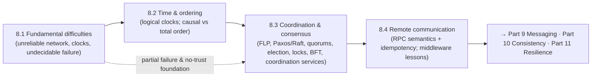

# Part 8 — Distributed Systems Core ✅ COMPLETE

The theory that makes everything else correct — unified by one idea: **in a distributed system you cannot trust the network, the clock, or your knowledge of other nodes' state, so correctness comes from explicitly handling partial failure (idempotency, timeouts, fencing), reasoning about order without physical time (logical clocks), and agreeing despite failures (consensus via quorums) — while paying for coordination only where you truly need it.**

---

## Lessons

### Module 8.1 — Fundamental Difficulties
| # | Lesson | Core idea |
|---|--------|-----------|
| 8.1.1 | [Unreliable Networks, Partitions, Partial Failure](8.1.1-unreliable-networks-partitions-partial-failure.md) | Partial failure is undecidable (can't tell crashed/slow/lost/partitioned); partitions → split brain → CAP; the fallacies |
| 8.1.2 | [Unreliable Clocks](8.1.2-unreliable-clocks.md) | Drift/skew; NTP only approximate (can step); **monotonic for durations, wall-clock for timestamps**; wall-clock LWW silently loses data |
| 8.1.3 | [Timeouts, Retries & Failure Detection](8.1.3-timeouts-retries-failure-detection.md) | Timeout = a guess (undecidable); too short/long both bad; retries need idempotency + backoff/jitter/budgets; phi-accrual; slow vs dead |

### Module 8.2 — Time & Ordering
| # | Lesson | Core idea |
|---|--------|-----------|
| 8.2.1 | [Lamport Timestamps](8.2.1-lamport-timestamps.md) | Happens-before; clock condition (A→B ⇒ LT(A)<LT(B)); can't detect concurrency; total order via node-id tie-break |
| 8.2.2 | [Vector Clocks & Causal Ordering](8.2.2-vector-clocks-causal-ordering.md) | Per-node counters detect causal vs **concurrent**; version vectors → siblings → merge (no silent LWW loss); O(N) cost |
| 8.2.3 | [Happens-Before; Total vs Partial Order](8.2.3-happens-before-total-vs-partial-order.md) | Causality is partial (concurrency); total order needs coordination; ordering ↔ consistency; total-order broadcast = consensus |
| 8.2.4 | [Hybrid Logical Clocks & TrueTime](8.2.4-hybrid-logical-clocks-truetime.md) | HLC = physical + logical (causal + near-real-time, no hardware); TrueTime = bounded uncertainty + commit-wait → external consistency |

### Module 8.3 — Coordination & Consensus
| # | Lesson | Core idea |
|---|--------|-----------|
| 8.3.1 | [Consensus Problem & FLP](8.3.1-consensus-problem-flp.md) | Agreement/validity/integrity/termination; FLP: can't guarantee termination under async; safe always, live when network behaves |
| 8.3.2 | [Paxos](8.3.2-paxos.md) | Proposal numbers + majority quorums; adopt-highest-prior-value → once chosen always chosen; Multi-Paxos leader; hard to implement |
| 8.3.3 | [Raft](8.3.3-raft.md) | Understandable consensus: leader election (terms + randomized timeouts), log replication, up-to-date voting → Leader Completeness |
| 8.3.4 | [Quorums (R + W > N)](8.3.4-quorums.md) | Intersection property; majority → no split-brain; 2f+1 for f failures; tunable R/W consistency; quorum ≠ linearizability |
| 8.3.5 | [Leader Election, Failure Detectors, Membership](8.3.5-leader-election-failure-detectors-membership.md) | Quorum election + fencing (no split brain); failure detection vs membership; gossip (O(log N)) & SWIM; strong vs eventual membership |
| 8.3.6 | [Distributed Locks & Fencing](8.3.6-distributed-locks-fencing.md) | Leases (crash) + pause-past-lease problem (no timeout fixes it); **fencing tokens**; efficiency vs correctness locks; prefer idempotency |
| 8.3.7 | [Byzantine Faults & BFT](8.3.7-byzantine-faults-bft.md) | Arbitrary/malicious nodes; **3f+1** for f Byzantine; PBFT; blockchain PoW/PoS; use crash consensus unless untrusted participants |
| 8.3.8 | [Coordination Services (ZooKeeper/etcd)](8.3.8-coordination-services-zookeeper-etcd.md) | Packaged consensus; ephemeral/sequential/watches/leases → election/locks/membership/config; CP under partition; not a datastore |

### Module 8.4 — Remote Communication
| # | Lesson | Core idea |
|---|--------|-----------|
| 8.4.1 | [RPC Semantics, Failure Modes, Idempotency](8.4.1-rpc-semantics-failure-modes-idempotency.md) | Leaky abstraction; ambiguous timeout; at-most/at-least/exactly-once; exactly-once *delivery* impossible → **exactly-once effects** via idempotency |
| 8.4.2 | [Middleware & Distributed Objects](8.4.2-middleware-distributed-objects.md) | CORBA/RMI failed (can't hide network); → REST/gRPC/brokers/mesh; don't hide network, loose coupling, async, smart endpoints/dumb pipes |

---

## The through-line of Part 8

**One sentence:** Because the network is unreliable, clocks untrustworthy, and failure undecidable (8.1), you order events by **causality** not physical time (8.2), reach **agreement despite failures** via **consensus and quorums** — accepting FLP's "safe always, live when the network behaves," using leader election + fencing, and packaging it in coordination services — while reserving Byzantine tolerance for untrusted participants (8.3); and you communicate over this hostile substrate with **idempotent, retry-safe RPC** and **loosely-coupled, network-explicit middleware** (8.4).

---

## The key decisions Part 8 equips you to make

- **How to handle a non-response?** Timeout (a guess) + idempotent + backoff/jitter retries; distinguish slow vs dead; never assume dead = safe to fail over without fencing. (8.1.1/8.1.3)
- **Which clock / how to order?** Monotonic for durations, wall-clock for timestamps; logical clocks for causal order; vector clocks to detect concurrency; HLC/TrueTime for real-time + correctness. (8.1.2/8.2.x)
- **How much ordering?** Weakest correct order — causal (cheap, available) vs total (needs consensus); confine total order to a small core. (8.2.3)
- **How to agree despite failures?** Consensus (Raft, usually via etcd/ZooKeeper) with majority quorums; expect stalls (FLP/CAP) over divergence. (8.3.1–8.3.4/8.3.8)
- **Leader/membership safely?** Quorum election + fencing tokens; gossip/SWIM for scale; strong membership for safety-critical roles. (8.3.5)
- **Exclusive access?** Prefer idempotency/single-writer/OCC; if you must lock, consensus-backed + fencing tokens. (8.3.6)
- **Crash or Byzantine fault model?** Crash (2f+1, Paxos/Raft) for trusted domains; BFT (3f+1) only for untrusted/adversarial participants. (8.3.7)
- **How do services talk?** Idempotent RPC (exactly-once effects) + loosely-coupled, network-explicit middleware; async messaging for decoupling. (8.4.x)

---

## Self-check before Part 9

Without notes, can you:
1. Explain partial failure and why a non-response is undecidable; what a partition/split-brain is and why it forces the CAP choice?
2. Distinguish wall-clock vs monotonic time and explain why wall-clock LWW silently loses data?
3. Explain why a timeout is a guess, and design safe retries (idempotency + backoff/jitter/budgets + circuit breaker), distinguishing slow vs dead?
4. Define happens-before; explain what Lamport guarantees and can't do, and how vector clocks detect concurrency?
5. Explain why total order needs coordination (and = consensus) while causal order doesn't — and map ordering to consistency models?
6. Describe HLC and TrueTime/commit-wait and when each is used?
7. State the consensus properties and FLP, and explain "safe always, live when the network behaves"?
8. Walk through Paxos's safety (quorum overlap + adopt-highest-prior-value) and Raft (terms, randomized election, up-to-date voting → Leader Completeness)?
9. Explain quorum intersection, majority (2f+1) and R+W>N, and why quorum ≠ linearizability?
10. Design safe leader election (quorum + fencing) and explain gossip/SWIM membership?
11. Explain the pause-past-lease lock problem and why fencing tokens (not timeouts) fix it; and prefer idempotency/single-writer over locks?
12. State the 3f+1 Byzantine bound and decide when BFT is justified vs crash consensus?
13. Explain why coordination services package consensus (and why they're not datastores, and are CP)?
14. Explain RPC's ambiguous timeout, why exactly-once delivery is impossible, and how idempotency gives exactly-once effects?
15. Explain why distributed-object middleware failed and the lessons (don't hide the network, loose coupling, async, smart endpoints/dumb pipes)?

If any are shaky, revisit that lesson's Revision Notes. Part 9 (Messaging & Streaming) builds directly on delivery semantics + idempotency (8.4.1), ordering (8.2), and the async-middleware lessons (8.4.2); Part 10 (Consistency & Replication) builds on partitions/CAP (8.1.1), clocks/LWW (8.1.2), causal vs total order (8.2.3), quorums (8.3.4), and consensus (8.3); Part 11 (Resilience) builds on timeouts/retries/idempotency/fencing (8.1.3/8.4.1/8.3.6).

---

*Reference assets for this part: `../../reference/consensus-and-quorums-cheatsheet.md`, `../../reference/time-and-ordering-cheatsheet.md`.*
