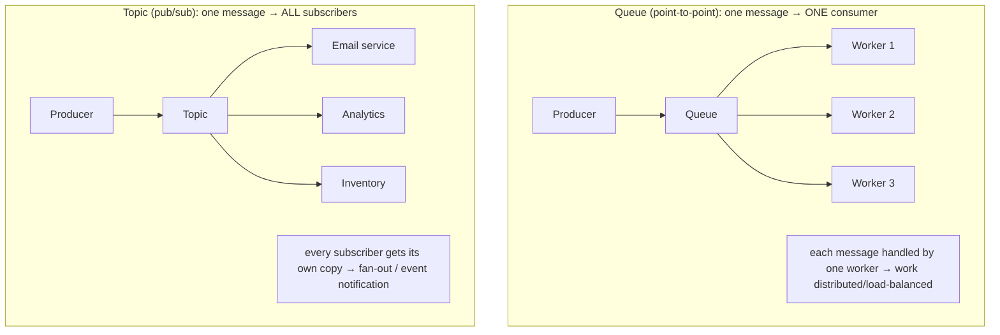
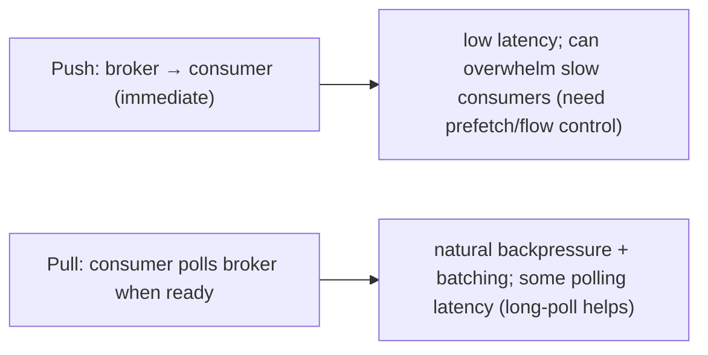

# Lesson 9.1 — Messaging Fundamentals: Queues vs Topics, Push vs Pull, Delivery Semantics

> Part 9: Messaging & Streaming · Difficulty: 🟡
>
> **Prerequisites:** [8.4.1 RPC/Delivery Semantics], [8.4.2 Async Middleware], [7.6 Async Queue Tier], [2.2.4 Event-Driven].
> **Unlocks:** [9.2 Brokers vs Logs], [9.3 Distributed Log], [9.4 Delivery Guarantees], [Part 12 Microservices].

---

## 1. Learning Objectives

After this lesson you will be able to:

- Explain **why asynchronous messaging exists** — decoupling producers from consumers in **time, space, and failure** — and how it differs from synchronous RPC (8.4.1).
- Distinguish the two core messaging models: **queues (point-to-point, work distribution)** vs **topics (publish-subscribe, fan-out)**, and when each fits.
- Distinguish **push vs pull** delivery and reason about their backpressure/flow-control implications (3.3.4, 9.9).
- Define the **delivery semantics** (at-most-once, at-least-once, exactly-once) at the messaging level and the core building blocks (acknowledgments, redelivery, idempotency — 8.4.1) that the rest of Part 9 develops.

---

## 2. Motivation — Decoupling with a buffer in the middle

Synchronous RPC (8.4.1) couples a caller to a callee **right now**: the caller waits, and its latency and availability depend on the callee being up and fast. That's fine for "I need an answer to continue," but it's the wrong tool for a huge class of work: sending a notification, processing an uploaded video, updating a search index, settling a payment, ingesting analytics events. For these you don't want the user's request to **block** on slow or failure-prone downstream work, you don't want a traffic spike to **overwhelm** the database (7.6), and you don't want the whole flow to **fail** because one downstream service is momentarily down. **Asynchronous messaging** solves all three by putting a **durable buffer (a broker)** between producers and consumers: the producer **hands off** a message and moves on; consumers process it **later, at their own pace**.

This single architectural move — **decouple via a message in the middle** — is the foundation of event-driven architecture (2.2.4), the async tier that protects the database (7.6), and the integration backbone of microservices (Part 12). It decouples in **time** (producer and consumer needn't be active simultaneously — the broker holds the message), **space** (they don't need each other's address — they share the broker), and **failure** (if the consumer is down, messages wait; the producer is unaffected). But messaging also introduces its own concepts and tradeoffs that this whole part unpacks: **queue vs topic** semantics (one consumer or many?), **push vs pull** delivery (who controls flow?), **delivery guarantees** (could a message be lost? duplicated? — exactly the at-least-once/idempotency story from 8.4.1, now at the messaging layer), **ordering** (9.5), and **failure handling** (dead-letter queues, poison messages — 9.9). This lesson establishes the fundamentals; 9.2 then draws the crucial distinction between **brokers** and **logs** that shapes everything else.

---

## 3. Theory — From first principles

### 3.1 What messaging is and what it decouples

**Asynchronous messaging** is communication where a **producer** sends a **message** to an intermediary (**message broker / message queue**), and a **consumer** receives and processes it **later**, without the producer waiting for the result `[CS]`. The broker is a **durable buffer** in the middle. This decouples the two parties along three axes `[CS]`:
- **Time (temporal decoupling):** producer and consumer don't have to be running at the same instant — the broker **stores** the message until a consumer is ready. (Producer can outpace consumers temporarily; the queue absorbs the burst — **load leveling**, 7.6.)
- **Space (location decoupling):** they don't need to know each other's address/identity — they only know the broker (and a queue/topic name). New consumers can be added without touching producers.
- **Failure (failure decoupling):** if a consumer is **down**, messages **accumulate** in the broker and are processed when it recovers — the producer is unaffected (resilience, Part 11). A slow/failed consumer doesn't fail the producer.

Contrast with **synchronous RPC** (8.4.1): tightly coupled in all three — both must be up, the caller knows the callee, and the caller's fate is tied to the callee's. **Messaging trades immediacy for decoupling, buffering, and resilience** — at the cost of **eventual/async semantics** (the work happens *later*; the producer gets no immediate result).

### 3.2 Messages, producers, consumers, and acknowledgments

The vocabulary `[CS]`:
- **Message:** a self-contained unit of data (an event or command) — headers/metadata + payload (serialized — 3.2.6/4.3.1).
- **Producer (publisher/sender):** creates and sends messages to the broker.
- **Consumer (subscriber/receiver):** receives and processes messages.
- **Broker:** the intermediary that **stores and routes** messages (the buffer).
- **Acknowledgment (ack):** after a consumer **successfully processes** a message, it **acks** the broker, which can then consider the message **done** (and, in a queue, remove it). If the consumer fails/crashes **before acking**, the broker **redelivers** (to another consumer or later) → this is the basis of **at-least-once** delivery (and the source of duplicates — §3.5, 8.4.1). Acks are the heart of reliable messaging.

### 3.3 Queues (point-to-point) vs Topics (publish-subscribe)

The two fundamental delivery models `[CS]`:

**Queue (point-to-point):** a message goes to **exactly one** consumer among possibly many competing consumers. Used for **work distribution / task processing**: N worker instances pull from the same queue, and each message is handled by **one** worker → the work is **load-balanced** across workers (add workers to scale throughput — the "competing consumers" pattern). Example: a queue of "resize this image" jobs processed by a pool of workers.
- **One message → one consumer** (of the group). Scaling = more workers sharing the queue.

**Topic (publish-subscribe):** a message is **broadcast** to **all** interested subscribers — each subscriber gets its **own copy**. Used for **fan-out / event notification**: one "OrderPlaced" event is delivered to the email service, the analytics service, the inventory service — each independently. Example: an event that multiple downstream systems must each react to.
- **One message → many consumers** (all subscribers). Adding a subscriber doesn't take messages from others; everyone gets every message.

**The distinction in one line:** **queue = "give this work to *one* of you" (distribute); topic = "tell *all* of you" (broadcast).** Many systems support both, and the **log model** (Kafka — 9.2/9.3) blends them via **consumer groups** (multiple groups each get all messages = pub/sub across groups; consumers *within* a group split the work = queue within a group). 9.2/9.3 develop this.

### 3.4 Push vs Pull delivery

How does a message get from broker to consumer? Two models `[CS]`:
- **Push:** the broker **pushes** messages to consumers as they arrive (the broker drives). **Low latency** (delivered immediately), but the broker must **track consumer state** and can **overwhelm a slow consumer** (no natural backpressure unless flow-controlled — 3.3.4/9.9). Brokers like RabbitMQ push (with a **prefetch limit** to cap in-flight messages per consumer — a flow-control knob).
- **Pull:** the consumer **requests (polls)** messages when ready (the consumer drives). **Natural backpressure** — a consumer only pulls what it can handle, so it can't be overwhelmed; and it enables **batching** (pull many at once). Slightly higher latency (poll interval) and can waste calls when idle (mitigated by **long polling** — 3.2.5). Logs like Kafka use **pull** (consumers fetch from their offset — 9.3).
- **Tradeoff:** push = low latency but risks overwhelming consumers; pull = backpressure-friendly and batch-friendly but adds polling latency. **Pull is favored for high-throughput, backpressure-sensitive systems** (Kafka); push (with prefetch/flow control) for low-latency task delivery (RabbitMQ). (Long polling — 3.2.5 — is the common compromise: pull semantics, near-push latency.)

### 3.5 Delivery semantics (the at-least-once reality)

How many times might a consumer process a message? Same three semantics as RPC (8.4.1), now for messaging `[CS]`:
- **At-most-once:** delivered **zero or one** time — never duplicated, but may be **lost** (e.g., consumer crashes after receiving but before processing, with no redelivery). Achieved by acking *before* processing or not redelivering. Acceptable for loss-tolerant data (some metrics).
- **At-least-once:** delivered **one or more** times — never lost (redelivered until acked), but may be **duplicated** (a consumer processes, crashes before acking → redelivery → reprocessing). Achieved by **ack-after-processing + redelivery**. **The common default** — but it **requires idempotent consumers** (8.4.1, 9.5) or you get duplicate effects.
- **Exactly-once:** processed **once and only once** — the ideal, and (as 8.4.1 established) **exactly-once *delivery* is impossible**; what's achievable is **exactly-once *effects*** via **at-least-once delivery + idempotency/dedup** (or transactional mechanisms — 9.4). 

**The practical default** `[BP]`: **at-least-once delivery + idempotent consumers** → exactly-once effects. This is *the* central correctness pattern of messaging, developed fully in 9.4/9.5. The key building block is the **ack**: process, *then* ack; if you crash before acking, you'll reprocess (so make processing idempotent).

### 3.6 When to use messaging (and when not)

Messaging fits when `[BP]`:
- The work is **asynchronous-tolerable** — the user/producer doesn't need the result immediately (notifications, indexing, video processing, settlement).
- You need **decoupling** — many independent consumers (fan-out), independent scaling/deployment (Part 12).
- You need **load leveling / spike absorption** — buffer bursts the downstream (DB) can't take synchronously (7.6).
- You need **resilience** — survive consumer downtime without failing producers (Part 11).

It's the **wrong** tool when:
- You need an **immediate response** to continue (use RPC — 8.4.1).
- The added **complexity and eventual-consistency** (delivery semantics, ordering, idempotency, monitoring, DLQs — 9.9) isn't justified by the decoupling benefit (1.1.5) — don't add a broker for a simple synchronous call.
- **Strict, immediate consistency** is required on the request path (messaging is inherently async/eventual).

### 3.7 The costs messaging introduces

Messaging isn't free — it brings new concerns the rest of Part 9 addresses `[CS]`:
- **Eventual/async semantics** — work happens later; the producer gets no immediate result; the system is eventually consistent (Part 10).
- **Delivery guarantees & duplicates** — at-least-once means **idempotency is mandatory** (8.4.1, 9.4/9.5).
- **Ordering** — messages may arrive out of order (especially across partitions/consumers — 9.5).
- **Operational complexity** — a broker to run, scale, and make HA (a new critical dependency); monitoring queue depth/lag (9.9, Part 16).
- **Failure handling** — poison messages, retries, **dead-letter queues** (9.9).
- **Backpressure** — producers can outpace consumers; the queue grows unbounded without flow control (3.3.4, 9.9).
You trade synchronous simplicity for decoupling/resilience/scale — a good trade for the right workloads, but a real cost.

---

## 4. Visual Intuition

### Queue vs Topic

### Push vs Pull

---

## 5. Real-World Analogy

Think of how work and news flow through a **busy office**.

- **Synchronous RPC** is like **standing at a colleague's desk waiting** for them to finish a task before you can do anything else — if they're busy or out, you're stuck.
- **A message queue** is the **shared task inbox** for a team of assistants: you drop a task in the inbox and walk away (hand off, don't wait); **whichever assistant is free** picks it up and does it. One task → one assistant. If all assistants are swamped, tasks **pile up in the inbox** (the buffer absorbs the surge) rather than blocking you, and you hire **more assistants** to drain the inbox faster (scale workers). If an assistant drops a task mid-way (crashes before "done"), it goes **back in the inbox** for someone else (redelivery → at-least-once → so the task should be safe to redo — idempotency).
- **A topic (pub/sub)** is the **company-wide announcement board**: you post "New product launched!" once, and **every** interested department — marketing, support, legal — gets **their own copy** and reacts independently. Adding a new department to the mailing list doesn't take the announcement away from anyone else.
- **Push vs pull:** *push* is a courier who **runs over and hands you each task the instant it arrives** (fast, but if they bury you faster than you work, you drown). *Pull* is **you walking to the inbox and grabbing the next task only when you've finished the current one** (you never get more than you can handle — natural backpressure — and you can grab a stack at once — batching).
- **The acknowledgment:** a task isn't removed from the inbox until you mark it **"done."** If you collapse before marking it done, it's still there for the next person — nothing is lost, but it might get **done twice** (hence: make it safe to do twice).

---

## 6. Industry Example

- **Task queues for background work** `[CONV]`: image/video processing, email/notification sending, and report generation are classically offloaded to a **queue + worker pool** (competing consumers) so the request path stays fast (7.6, §3.3). *(Representative.)*
- **Pub/sub for event fan-out** `[CONV]`: an "OrderPlaced" event published to a topic and consumed independently by inventory, billing, analytics, and notification services (event-driven — 2.2.4, §3.3). *(Representative.)*
- **RabbitMQ (push + prefetch)** vs **Kafka (pull + offsets)** `[CONV]`: the canonical push-broker vs pull-log contrast (§3.4, developed in 9.2/9.3). *(Representative.)*
- **At-least-once + idempotent consumers** `[BP]`: the standard reliable-messaging pattern (process then ack; dedupe by key) — exactly-once effects (§3.5, 8.4.1, 9.4/9.5). *(Representative.)*
- **Cloud queues/topics** `[CONV]`: SQS (queue), SNS (pub/sub), Google Pub/Sub, Azure Service Bus implement these models as managed services (§3.3). *(Representative.)*

---

## 7. Implementation Details — using messaging well

- **Use messaging for async-tolerable, decoupling-worthy work** (notifications, processing, indexing, integration, spike absorption); use **RPC** when you need an immediate answer (§3.6, 8.4.1) `[BP]`.
- **Choose queue vs topic by intent:** **queue** for distributing work across competing workers (one consumer per message); **topic** for broadcasting events to multiple independent subscribers (§3.3).
- **Make consumers idempotent** (idempotency keys / dedup / natural keys — 8.4.1, 9.5) — at-least-once delivery **will** redeliver; duplicates must be harmless (§3.5).
- **Ack after successful processing** (not before) for at-least-once; understand acking-before-processing risks loss (at-most-once) (§3.2/3.5).
- **Prefer pull (or long-poll) for high-throughput/backpressure-sensitive** consumers; if push, set a **prefetch/in-flight limit** to avoid overwhelming consumers (§3.4, 3.3.4).
- **Plan for the new costs** (§3.7): monitor **queue depth / consumer lag** (9.9, Part 16), handle **poison messages / DLQs** (9.9), apply **backpressure** (3.3.4), and make the broker **HA** (it's a critical dependency).
- **Keep messages self-contained and versioned** (schema evolution — 4.3.1) so producers/consumers can evolve independently (Part 12).
- **Don't over-adopt** — a broker adds operational weight and eventual consistency; don't insert one where a simple synchronous call suffices (1.1.5, §3.6).

---

## 8. Advantages

- **Decoupling (time/space/failure)** — producers and consumers evolve, scale, and fail independently (§3.1).
- **Load leveling / spike absorption** — the buffer smooths bursts the downstream can't take synchronously (7.6).
- **Resilience** — consumer downtime doesn't fail producers; messages wait (Part 11).
- **Independent scaling** — add workers (queue) or subscribers (topic) without touching producers (§3.3).
- **Better tail latency on the request path** — heavy work moved off-line (7.6, Part 17).
- **Fan-out** — one event drives many independent reactions (event-driven — 2.2.4).

---

## 9. Disadvantages / costs

- **Eventual/async semantics** — no immediate result; eventually consistent (§3.7, Part 10).
- **Duplicates (at-least-once)** — idempotency mandatory (§3.5, 8.4.1).
- **Ordering challenges** — out-of-order delivery without care (9.5).
- **Operational complexity** — a broker to run/scale/HA; monitoring lag; DLQs (§3.7, 9.9).
- **Backpressure risk** — unbounded queue growth if producers outpace consumers (9.9, 3.3.4).
- **Debuggability** — async flows are harder to trace (Part 16 distributed tracing).

---

## 10. When NOT to use messaging / limits

- **Immediate response needed** — use synchronous RPC (8.4.1), not a queue (§3.6).
- **Strict immediate consistency on the request path** — messaging is async/eventual (§3.6, Part 10).
- **Trivial coupling** — don't add a broker (and its ops/eventual-consistency cost) where a direct call suffices (1.1.5, §3.6).
- **Non-idempotent consumers with at-least-once** — fix idempotency first, or you'll get duplicate effects (§3.5).
- **Ordering-critical work spread across many consumers** without partitioning by key — ordering breaks (9.5).

---

## 11. Common Mistakes

1. **Non-idempotent consumers with at-least-once delivery** → duplicate effects (double email/charge) (§3.5, 8.4.1).
2. **Acking before processing** → message lost if the consumer crashes mid-processing (at-most-once when you wanted at-least-once) (§3.2).
3. **Using a topic where you wanted a queue (or vice versa)** → every subscriber does the work N times, or only one of N services reacts (§3.3).
4. **Push without flow control/prefetch** → a slow consumer is overwhelmed (§3.4, 9.9).
5. **No backpressure / unbounded queue** → the queue grows until memory/disk fills (9.9, 3.3.4).
6. **Using messaging where RPC fits** (needing an immediate answer) → awkward async hacks (§3.6).
7. **Ignoring poison messages / no DLQ** → a bad message blocks the queue forever (retried endlessly) (9.9).
8. **Treating the broker as non-critical** → its outage halts async flows; not made HA (§3.7).

---

## 12. Interview Questions

**🟢 Easy**
- What does asynchronous messaging decouple, and how does it differ from synchronous RPC?
- What's the difference between a queue and a topic?

**🟡 Medium**
- Compare push vs pull delivery. Which gives natural backpressure, and which gives lower latency?
- Explain at-most-once vs at-least-once delivery and the role of acknowledgments. Why is at-least-once the common default?

**🔴 Hard**
- Why is "exactly-once delivery" impossible, and how do you achieve exactly-once effects in a messaging system? (At-least-once + idempotency — 8.4.1/9.4.)
- Design the messaging for an "order placed" flow that must (a) charge once, (b) email the customer, (c) update analytics, (d) reserve inventory. Which use queues vs topics, and how do you ensure correctness under redelivery?

**⚫ Staff+**
- When would you choose asynchronous messaging over synchronous RPC for inter-service communication, and what new failure modes and costs does it introduce (delivery semantics, ordering, backpressure, DLQs, broker HA, eventual consistency)? Give the decision criteria.
- A request-path operation does several slow downstream steps synchronously and falls over under spikes. Redesign it with messaging (queue/topic choice, idempotent consumers, ack strategy, backpressure, DLQ), and explain the consistency/latency tradeoffs the users will now see.

---

## 13. Production Pitfalls

- **Duplicate-effect bug:** at-least-once redelivery + non-idempotent consumer → customers double-charged / double-emailed (§3.5, 8.4.1) — the signature messaging bug.
- **Lost messages from early ack:** consumer acks on receipt then crashes before processing → message gone (at-most-once when at-least-once was intended) (§3.2).
- **Wrong model:** using a queue (one consumer) where fan-out (topic) was needed → only one of several services reacts to an event (§3.3).
- **Slow-consumer overwhelm (push):** push without prefetch floods a slow consumer → crashes/OOM (§3.4, 9.9).
- **Unbounded queue growth:** producers outpace consumers with no backpressure → broker disk fills, latency explodes (9.9, 3.3.4).
- **Poison-message blockage:** a malformed message fails processing forever, blocking the queue (no DLQ) (9.9).
- **Broker outage halts flows:** a non-HA broker fails → all async processing stops (a critical-dependency SPOF) (§3.7).

---

## 14. Optimization Techniques

- **At-least-once + idempotent consumers** → exactly-once effects (the default correctness pattern) (§3.5, 8.4.1, 9.4/9.5) `[BP]`.
- **Right model:** queue for work distribution (scale workers), topic for event fan-out (§3.3).
- **Pull / long-poll + batching** for high-throughput, backpressure-safe consumption; **prefetch limits** for push (§3.4, 3.3.4).
- **Backpressure + bounded queues + DLQs** to handle overload and poison messages gracefully (9.9, 3.3.4).
- **Move heavy/slow work off the request path** to protect latency and the DB (7.6, Part 17).
- **HA broker + monitoring (queue depth, consumer lag)** — treat it as critical infrastructure (§3.7, Part 16).
- **Self-contained, versioned messages** for independent producer/consumer evolution (4.3.1, Part 12).

---

## 15. Summary

**Asynchronous messaging** puts a **durable buffer (a broker)** between producers and consumers so a producer **hands off a message and moves on** while consumers process it **later** — decoupling them in **time** (broker stores until a consumer is ready → load leveling, 7.6), **space** (they share only the broker, not addresses), and **failure** (consumer downtime accumulates messages instead of failing producers → resilience). This contrasts with synchronous **RPC** (8.4.1), which couples caller and callee immediately; messaging **trades immediacy for decoupling, buffering, and resilience**, accepting **eventual/async semantics**. The two core models are **queues (point-to-point)** — a message goes to **exactly one** of competing consumers, for **work distribution** (scale by adding workers) — and **topics (publish-subscribe)** — a message is **broadcast** so **every** subscriber gets a copy, for **event fan-out** (the log model blends these via consumer groups — 9.2/9.3). Delivery is **push** (broker drives → low latency but can overwhelm slow consumers; needs prefetch/flow control) or **pull** (consumer polls → natural **backpressure** + batching, slight latency; long-poll is the compromise) — pull suits high-throughput/backpressure-sensitive systems (Kafka), push suits low-latency task delivery (RabbitMQ). **Acknowledgments** are central: process-then-ack with **redelivery** on failure gives **at-least-once** delivery (never lost, may **duplicate**) — the common default — versus **at-most-once** (ack-early; may lose) and **exactly-once** (impossible as *delivery*; achievable as **exactly-once *effects*** via **at-least-once + idempotent consumers** — 8.4.1, 9.4/9.5). Use messaging for **async-tolerable, decoupling-worthy** work (notifications, processing, indexing, integration, spike absorption) and **RPC** when you need an immediate answer; don't add a broker where a synchronous call suffices. The costs to manage (the rest of Part 9): eventual consistency, **duplicates → mandatory idempotency**, **ordering** (9.5), **backpressure/DLQs/poison messages** (9.9), and a **broker as critical HA infrastructure**. The defining correctness pattern to carry forward: **at-least-once delivery + idempotent consumers = exactly-once effects.**

---

## 16. Revision Notes (flashcard-ready)

- **Q:** What does messaging decouple? **A:** Time (broker buffers), space (share broker not addresses), failure (consumer down ≠ producer fails).
- **Q:** Messaging vs RPC? **A:** RPC = synchronous, immediate, tightly coupled; messaging = async, buffered, decoupled, eventual.
- **Q:** Queue vs topic? **A:** Queue = one message to ONE of competing consumers (work distribution); topic = broadcast to ALL subscribers (fan-out).
- **Q:** Push vs pull? **A:** Push = broker drives (low latency, can overwhelm); pull = consumer polls (backpressure + batching, some latency).
- **Q:** Role of acknowledgments? **A:** Process then ack; crash before ack → redelivery → at-least-once (and duplicates).
- **Q:** Delivery semantics? **A:** At-most-once (may lose), at-least-once (may duplicate — default), exactly-once (effects only).
- **Q:** Default correctness pattern? **A:** At-least-once delivery + idempotent consumers = exactly-once effects.
- **Q:** When to use messaging? **A:** Async-tolerable work, decoupling/fan-out, load leveling/spike absorption, resilience.
- **Q:** When NOT? **A:** Need immediate response (use RPC), strict immediate consistency, or trivial coupling (don't add a broker).
- **Q:** New costs? **A:** Eventual consistency, duplicates (idempotency), ordering, backpressure/DLQs, broker HA, harder tracing.

---

## 17. Further Reading + Knowledge-Graph Links

**Within this platform**
- **Builds on:** [8.4.1 RPC/Delivery Semantics] (at-least-once/idempotency/exactly-once effects), [8.4.2 Async Middleware] (brokers), [7.6 Async Queue Tier] (load leveling), [2.2.4 Event-Driven], [3.3.4 Backpressure], [3.2.5 Long Polling].
- **Next:** [9.2 Brokers vs Logs] (the key distinction). **Then:** [9.3 Distributed Log], [9.4 Delivery Guarantees], [9.5 Ordering/Idempotent Consumers], [9.9 Backpressure/DLQ].
- **Enables:** [Part 12 Microservices] (async integration), [Part 10 Consistency] (eventual), [Part 11 Resilience].

**Foundational texts (synthesized)**
- Hohpe & Woolf, *Enterprise Integration Patterns* — queues, topics, channels, competing consumers (synthesized).
- Kleppmann, *Designing Data-Intensive Applications* — messaging systems, delivery semantics (synthesized).
- Broker/cloud documentation (RabbitMQ, Kafka, SQS/SNS, Pub/Sub) — representative.

**Concept tags:** `[CS]` async messaging, time/space/failure decoupling, queue vs topic, push vs pull, ack/redelivery, delivery semantics · `[CONV]` task queues, pub/sub fan-out, RabbitMQ push / Kafka pull, cloud queues/topics · `[BP]` at-least-once + idempotent consumers, ack-after-process, pull/long-poll + backpressure, queue vs topic by intent, don't over-adopt.
