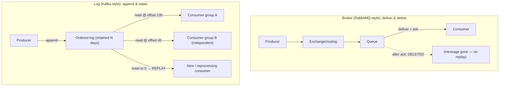
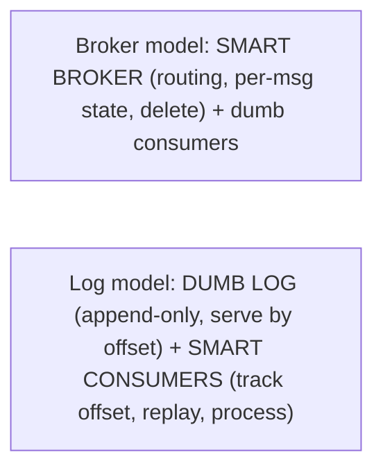

# Lesson 9.2 — Message Brokers (RabbitMQ-style) vs Logs (Kafka-style): The Key Distinction

> Part 9: Messaging & Streaming · Difficulty: 🟡🔴
>
> **Prerequisites:** [9.1 Messaging Fundamentals], [8.4.1 Delivery Semantics], [4.2.1 Log-Structured Storage], [5.3.1 WAL].
> **Unlocks:** [9.3 The Distributed Log], [9.4 Delivery Guarantees], [9.6 Stream Processing], [9.8 CDC/Outbox].

---

## 1. Learning Objectives

After this lesson you will be able to:

- Explain the **fundamental architectural distinction** between a **traditional message broker** (queue-centric, delete-on-consume, broker tracks per-message state) and a **distributed log** (append-only, retained, consumer tracks position/offset).
- Reason about the consequences: **replayability**, **multiple independent consumers**, **ordering**, **throughput**, and **message lifetime** — and why logs enable stream processing and event sourcing while brokers excel at flexible task routing.
- Map the two families to representative systems (**RabbitMQ/ActiveMQ/SQS** = brokers; **Kafka/Pulsar/Kinesis** = logs) and their tradeoffs (routing flexibility vs throughput/replay).
- Choose the right model for a use case (work queues & complex routing → broker; event streaming, replay, multiple consumers, high throughput → log).

---

## 2. Motivation — Two very different things both called "messaging"

"Messaging" hides two architecturally **distinct** systems that behave so differently that conflating them leads to wrong designs. The first is the **traditional message broker** (RabbitMQ, ActiveMQ, classic JMS, SQS) — a smart router that holds messages in **queues**, **delivers each to a consumer**, and — crucially — **deletes the message once it's acknowledged**. The message is a transient unit of work that exists until consumed. The second is the **distributed log** (Kafka, Pulsar, Kinesis) — fundamentally an **append-only, ordered, durable log** (think a WAL — 5.3.1 — exposed as a messaging system) where messages are **appended and retained** (for days/weeks, regardless of consumption), and **consumers track their own position (offset)** into the log rather than the broker tracking per-message delivery.

This distinction — **delete-on-consume queue vs retained append-only log** — is the single most important concept in modern messaging, because it determines what you can do. With a broker, once a message is consumed it's **gone** — you can't replay it, and a second consumer that wanted it never gets it. With a log, the message **stays**, so you can **replay** history (reprocess from any offset — invaluable for bug fixes, new consumers, reprocessing), have **many independent consumers** each reading the same data at their own pace (the basis of fan-out, stream processing, and event sourcing), and achieve **very high throughput** via sequential append + sequential read (4.2.1). The flip side: brokers offer **rich, flexible routing** (exchanges, topic patterns, per-message TTL/priority/dead-lettering) and are great at **complex work distribution**, while logs are comparatively simple routers but unbeatable for **streaming, replay, and scale**. Understanding which is which — and matching it to the problem — is what this lesson delivers, setting up the deep dive on the log model in 9.3.

---

## 3. Theory — From first principles

### 3.1 The two architectures

**Traditional message broker (queue-based)** `[CS]`:
- Messages live in **queues**; the broker **routes** each message to a consumer and **tracks per-message delivery state** (delivered? acked?).
- **Delete-on-consume:** once a consumer **acks**, the message is **removed** from the queue. Messages are **transient units of work**.
- The **broker is "smart"** — it does routing (exchanges/bindings), filtering, priorities, per-message TTL, retries, dead-lettering (9.9). Consumers are relatively "dumb."
- Examples: **RabbitMQ, ActiveMQ, classic JMS, AWS SQS** (*representative*).

**Distributed log (log-based)** `[CS]`:
- Messages are **appended to an ordered, immutable, durable log** (partitioned — 9.3), like a WAL (5.3.1) / log-structured store (4.2.1).
- **Retained, not deleted on consume:** messages stay for a configured **retention** (time or size), **independent of consumption**. Consuming does **not** remove a message.
- **Consumers track their own position (offset)** into the log; the **broker is "dumb"** (just an append-only log + serve reads by offset), the **consumers are "smart"** (track offsets, decide what to read/replay).
- Examples: **Apache Kafka, Apache Pulsar, AWS Kinesis** (*representative*).

The crux: **broker = "deliver and delete" (queue of work); log = "append and retain" (durable, replayable record).**

### 3.2 Replayability — the headline difference

`[CS]`
- **Broker:** once consumed/acked, a message is **gone** — **no replay**. If you need to reprocess (a bug in the consumer, a new requirement), the data is no longer there. You'd have to re-produce it.
- **Log:** messages are **retained**, so a consumer can **reset its offset** and **replay** from any point in the retained history. This is enormously powerful:
  - **Bug recovery:** fix a consumer bug and **reprocess** the affected messages.
  - **New consumers:** a brand-new consumer can read **all history** (within retention) from offset 0 — e.g., bootstrap a new service/analytics from the full event stream.
  - **Reprocessing/backfill:** rebuild a derived view (search index, materialized view — 5.1.2, 6.5) by replaying.
  - **Event sourcing (9.7/Part 20):** the log **is** the source of truth (the sequence of events), and state is a replayable function of it.
**Replay is why logs underpin stream processing, event sourcing, and CDC** (9.6/9.7/9.8) — and it's exactly what brokers can't do.

### 3.3 Multiple independent consumers

`[CS]`
- **Broker:** a message in a queue is consumed by **one** consumer and then deleted. To fan out to multiple independent consumers you use **separate queues** (e.g., a topic exchange copying to per-consumer queues), and each copy is still **delete-on-consume** per queue. The broker manages this routing.
- **Log:** **many independent consumers (consumer groups — 9.3) read the same log concurrently**, each at its **own offset**, without affecting each other or the data. Adding a 5th consumer doesn't change anything for the other 4 — the log is just read again from wherever the new consumer starts. This makes **fan-out to many independent systems natural and cheap**, and is why a single log can feed analytics, search indexing, notifications, and more, each progressing independently.

### 3.4 Ordering

`[CS]`
- **Log:** messages within a **partition** are **strictly ordered** (append order = read order) and consumers read in that order (9.3/9.5). This **total-order-within-a-partition** (8.2.3) is a core guarantee streaming relies on. Ordering across partitions is **not** guaranteed (you order by partitioning key — 9.5).
- **Broker:** ordering is **weaker/harder** — with multiple competing consumers on a queue, messages can be processed **out of order** (consumer A is slow on msg 1 while consumer B finishes msg 2); redelivery further scrambles order. Brokers offer ordering only with restrictions (single consumer, or "consistent hashing"/ordered-group features). **If strict ordering matters, the log model (partition-ordered) is usually the better fit** (9.5).

### 3.5 Throughput and storage

`[CS]`
- **Log:** built for **very high throughput** — **sequential appends** (writes) and **sequential reads** (4.2.1: sequential I/O is far faster than random — 4.1.1), batching, zero-copy, and **horizontal scaling via partitions** (9.3). Logs routinely handle millions of messages/sec. Storage is **append-only retained** data (cheap, sequential), pruned by retention.
- **Broker:** generally **lower throughput** — per-message tracking, random-access queue management, and routing logic cost more per message; designed for **flexible delivery** rather than raw firehose throughput. Storage is the **outstanding (un-acked) messages** — a healthy broker queue is near-empty (messages flow through), whereas a log **deliberately retains** data.
- **Implication:** for **high-volume event streams** (clickstreams, metrics, logs, IoT, CDC), the **log model dominates**; for **moderate-volume task processing with complex routing**, a broker is comfortable.

### 3.6 Routing flexibility (where brokers shine)

`[CS]`
- **Broker:** **rich routing** is a core strength — **exchanges and bindings** (RabbitMQ: direct, topic, fanout, headers exchanges) route messages by key/pattern/headers; **per-message TTL, priorities, dead-letter exchanges** (9.9), **delayed delivery**, selective consumption. Brokers are excellent when you need **sophisticated, per-message routing and work-distribution logic** ("send high-priority orders to this queue, route by region, retry with backoff, dead-letter after 3 failures").
- **Log:** **simpler routing** — you choose a **topic** and a **partition** (by key — 9.3/9.5); that's largely it. The "smarts" live in **consumers** (which read/filter/process), not the log. Logs trade routing richness for throughput, retention, and replay.
**So:** **broker = smart routing, transient work; log = simple routing, retained replayable stream.**

### 3.7 Choosing — broker vs log

`[BP]`
| Need | Choose |
|---|---|
| Work/task queues, competing consumers | either (broker classic; log via consumer groups) |
| Complex routing (priorities, patterns, per-message TTL, delayed) | **Broker** |
| Replay / reprocessing / new consumers read history | **Log** |
| Many independent consumers of the same data (fan-out) | **Log** (natural) |
| Strict ordering (within a key) | **Log** (partition order) |
| Very high throughput (event streams: clicks, metrics, IoT, CDC) | **Log** |
| Stream processing / event sourcing | **Log** |
| Moderate volume, RPC-like async tasks, request/reply | **Broker** |
| Event backbone for the whole system | **Log** (often) |

**Rule of thumb:** **task processing with flexible routing → broker; event streaming, replay, many consumers, high throughput → log.** Many organizations run **both**: a log (Kafka) as the **event backbone / source of truth** and brokers for specific task-queue/routing needs. They're complementary, not strictly either/or.

### 3.8 Why the log model became dominant for "data in motion"

`[OPINION]`/`[CS]` The log model (popularized by Kafka, building on the database WAL idea — 5.3.1, and the "log as the unifying abstraction" insight) became the backbone of modern data architectures because it unifies several needs in one durable, ordered, replayable, high-throughput primitive:
- **Messaging** (decoupled pub/sub — 9.1) **+** **storage** (retained history) **+** **stream processing** (9.6) **+** **integration/CDC** (9.8) **+** **event sourcing** (9.7) — all on the same log.
- It treats **"data in motion" as a first-class, durable, replayable stream**, decoupling all producers from all consumers through one append-only record — the central nervous system of event-driven systems (2.2.4, Part 18). 9.3 dissects the log's internals (partitions/offsets/consumer groups/retention) that make this work.

---

## 4. Visual Intuition

### Broker (delete-on-consume) vs Log (append-and-retain)

### Who's smart — broker vs consumer

---

## 5. Real-World Analogy

Think of two ways an office handles incoming work and information.

- **The traditional broker is a smart mailroom with task baskets.** Mail arrives, a clerk **sorts it by sophisticated rules** (priority, department, "if urgent, this basket; retry the courier 3 times; if undeliverable, dead-letter bin") and drops each item in the right **basket**. A worker takes an item, does it, and the item is **thrown away** (delete-on-consume). It's brilliant at **routing and distributing tasks** — but once a memo is handled and binned, it's **gone**; you can't re-read last week's mail, and a second department that *also* wanted that memo never sees it (you'd have had to copy it into their basket up front).
- **The log is a continuously-written company journal/ledger.** Every event is **appended in order** and **kept on the shelf for, say, 30 days** (retention), whether or not anyone has read it. Each reader keeps a **bookmark (offset)** of how far they've read. The magic: **anyone can read the whole journal at their own pace** — analytics reads from page 1, the search-indexer from page 800, a brand-new team can start at page 1 and catch up on **all history**, and if someone processed pages wrong, they just **move their bookmark back and re-read** (replay). Many readers, same journal, independent bookmarks, full replayable history — and because it's just **appending to and reading a journal sequentially**, it's extremely fast (handles a firehose). The journal doesn't do fancy routing — it just records everything in order and lets the **readers** be smart about what they do with it.
- **The trade:** the smart mailroom (broker) is unbeatable for **complex task routing**; the journal (log) is unbeatable for **keeping a replayable record that many readers consume independently at high volume** — which is why big "data in motion" systems are built around the journal.

---

## 6. Industry Example

- **RabbitMQ / ActiveMQ / SQS (brokers)** `[CONV]`: queue-based, delete-on-consume, rich routing (RabbitMQ exchanges/bindings, per-message TTL, priorities, DLX) — excellent for task queues and complex work distribution (§3.1/3.6). *(Representative.)*
- **Apache Kafka / Pulsar / Kinesis (logs)** `[CONV]`: append-only partitioned logs, retained data, offset-based consumers, very high throughput, replay — the backbone for event streaming, stream processing, and CDC (§3.1–3.5, 9.3/9.6/9.8). *(Representative.)*
- **Kafka as the event backbone** `[CONV]`: organizations use a Kafka log as the central, replayable source of events feeding analytics, search indexing, ML, notifications — each an independent consumer group (§3.3/3.8, Part 18 LinkedIn/Kafka lineage). *(Representative.)*
- **Replay for backfills/bug recovery** `[BP]`: resetting consumer offsets to reprocess after fixing a bug or to rebuild a derived view — impossible with a delete-on-consume broker (§3.2). *(Representative.)*
- **Running both** `[CONV]`: a log (Kafka) for streaming + a broker (RabbitMQ/SQS) for specific routed task queues — complementary roles (§3.7). *(Representative.)*

---

## 7. Implementation Details — choosing and using

- **Choose by the headline needs** (§3.7): **broker** for flexible routing + transient task work; **log** for replay, many independent consumers, strict (per-key) ordering, high throughput, stream processing, event sourcing/CDC `[BP]`.
- **Use a log as the event backbone** when many systems need the same events and you want replay/reprocessing and the ability to add consumers later (§3.3/3.8).
- **Use a broker** when you need **per-message routing/priorities/TTL/delayed delivery** and sophisticated work distribution, and you **don't** need replay (§3.6).
- **Set log retention** to your replay/recovery needs (and storage budget) — long enough to bootstrap new consumers and recover from bugs (§3.2, 9.3).
- **Remember consume ≠ delete in a log** — capacity is governed by **retention**, not consumption; size storage accordingly (§3.5).
- **For ordering**, prefer the log's **partition ordering** (key-based — 9.5) over fighting a broker's weak ordering with multiple consumers (§3.4).
- **You can run both** — don't force one tool to do the other's job (event backbone = log; specialized routed task queues = broker) (§3.7).
- **Apply at-least-once + idempotency regardless** — both families deliver at-least-once in practice; consumers must be idempotent (9.1/8.4.1/9.4).

---

## 8. Advantages

**Broker:** rich/flexible routing (exchanges, patterns, priorities, TTL, delayed, DLX); good for complex work distribution; near-empty steady state (messages flow through); mature, simple mental model for task queues.

**Log:** **replay** (reprocess, new consumers read history, event sourcing); **many independent consumers** (cheap fan-out via offsets); **strict per-partition ordering**; **very high throughput** (sequential I/O, batching, partition scaling); **unifies messaging + storage + streaming + integration** (the event backbone — §3.8).

---

## 9. Disadvantages / limitations

**Broker:** **no replay** (delete-on-consume); fan-out needs copies/multiple queues; **weaker ordering** with competing consumers; generally **lower throughput**; per-message state tracking is heavier.

**Log:** **simpler routing** (smarts pushed to consumers); **retention storage cost** (you keep data deliberately); ordering only **within a partition** (cross-partition ordering needs key design — 9.5); consumers must **manage offsets**; operationally heavier to run at scale (partitions, replication — 9.3).

---

## 10. When NOT to use each

- **Don't use a delete-on-consume broker** when you need **replay, reprocessing, new consumers reading history, or event sourcing** — use a log (§3.2).
- **Don't use a broker for fan-out to many independent high-volume consumers** — copying per queue is awkward/expensive; logs do this naturally (§3.3).
- **Don't use a log when you need rich per-message routing/priorities/TTL/delayed delivery** as the core requirement — a broker is built for that (§3.6).
- **Don't pick a broker for a firehose** (clicks/metrics/IoT/CDC) — throughput/retention favor a log (§3.5).
- **Don't run a log if you'll never replay and only need simple routed task queues** — a broker may be simpler/cheaper operationally (§3.7).

---

## 11. Common Mistakes

1. **Assuming a broker can replay** — building a recovery/backfill plan around re-reading consumed messages that were deleted (§3.2).
2. **Treating a log like a queue (consume = delete)** — being surprised data persists (it's retention-bound), or not setting retention for replay needs (§3.5).
3. **Expecting strict ordering from a broker with competing consumers** — out-of-order processing (§3.4).
4. **Using a broker for a high-volume event stream** — throughput/cost problems; should be a log (§3.5).
5. **Using a log when you really needed rich routing** (priorities/TTL/patterns) — reimplementing broker features in consumers (§3.6).
6. **Forgetting idempotency** — both are at-least-once in practice; non-idempotent consumers → duplicates (§7, 8.4.1).
7. **Forcing one tool for everything** — not recognizing brokers and logs are complementary (§3.7).

---

## 12. Interview Questions

**🟢 Easy**
- What's the fundamental difference between a message broker (RabbitMQ) and a log (Kafka)?
- Why can a log replay messages but a traditional broker can't?

**🟡 Medium**
- How do multiple independent consumers work in a log vs a broker? Why is fan-out natural for logs?
- Why do logs achieve higher throughput, and how is ordering handled in each model?

**🔴 Hard**
- When would you choose a broker over a log, and vice versa? Give concrete use cases and justify by replay, routing, ordering, and throughput.
- Explain why the log model unifies messaging, storage, stream processing, and integration — and what role retention plays.

**⚫ Staff+**
- Design the messaging/streaming backbone for a system that needs: a high-volume clickstream feeding analytics + ML + a search index (each independent, replayable), and a separate order-fulfillment task flow with priorities and per-message retries/dead-lettering. Decide where to use a log vs a broker (or both) and justify each choice against replay, routing, ordering, throughput, and operational cost.
- You must add a brand-new consumer that needs to process the last 30 days of events, and separately recover from a consumer bug that mis-processed yesterday's data. Explain why a log makes both trivial and a broker makes both (nearly) impossible — and how retention, offsets, and consumer groups enable it (9.3).

---

## 13. Production Pitfalls

- **No-replay recovery dead-end:** a consumer bug corrupted derived data, but the broker already deleted the source messages → no way to reprocess (should have been a log) (§3.2).
- **Surprise log storage growth:** treating a log like a queue, not realizing it **retains** data per retention policy → disk fills / unexpected cost (§3.5).
- **Out-of-order processing on a broker:** competing consumers process messages out of order, violating an ordering assumption (should have used partition-ordered log) (§3.4, 9.5).
- **Broker throughput wall:** a high-volume event stream overwhelms a broker designed for moderate routed task volume → backpressure/latency (§3.5).
- **Reinventing routing in log consumers:** needing priorities/TTL/patterns and building brittle logic in consumers instead of using a broker (§3.6).
- **Duplicate effects:** non-idempotent consumers under at-least-once delivery in either system (§7, 8.4.1, 9.4).

---

## 14. Optimization Techniques

- **Match model to need** (§3.7): broker for routing/transient tasks; log for replay/fan-out/ordering/throughput/streaming `[BP]`.
- **Log as event backbone** — one durable, replayable stream feeding many independent consumer groups (§3.3/3.8).
- **Tune retention** to replay/recovery needs vs storage cost (§3.2/3.5, 9.3).
- **Partition for throughput + per-key ordering** in logs (9.3/9.5).
- **Use broker routing features** (exchanges, priorities, TTL, DLX) instead of reimplementing them (§3.6, 9.9).
- **Run both where appropriate** — complementary roles (§3.7).
- **Idempotent consumers everywhere** — at-least-once is the practical reality in both (§7, 8.4.1, 9.4).

---

## 15. Summary

"Messaging" spans two architecturally **distinct** systems. A **traditional message broker** (RabbitMQ, ActiveMQ, SQS) is a **smart router** that holds messages in **queues**, **delivers each to a consumer**, and **deletes it on acknowledgment** — messages are **transient units of work**, the **broker tracks per-message state**, and it offers **rich routing** (exchanges/bindings, priorities, per-message TTL, delayed delivery, dead-lettering). A **distributed log** (Kafka, Pulsar, Kinesis) is an **append-only, ordered, durable log** (a WAL — 5.3.1 — exposed as messaging) where messages are **appended and *retained*** (for a configured retention, **independent of consumption**), **consumers track their own offset**, and the **log is "dumb"** while **consumers are "smart."** This **delete-on-consume queue vs append-and-retain log** distinction drives everything: the log enables **replay** (reset offset to reprocess after a bug, bootstrap new consumers from full history, backfill derived views, event sourcing) — which a broker fundamentally **cannot** do (consumed = gone); the log supports **many independent consumers** reading the same data at their own offsets (natural, cheap fan-out) vs the broker's per-queue copies; the log gives **strict per-partition ordering** (8.2.3) vs the broker's weaker ordering under competing consumers; and the log delivers **very high throughput** (sequential append + sequential read — 4.1.1/4.2.1, partition scaling) vs the broker's heavier per-message tracking. Conversely, **brokers excel at flexible, per-message routing and complex work distribution**, where logs are deliberately simple. **Choose by need:** **broker for task queues + sophisticated routing (no replay needed); log for replay, multi-consumer fan-out, per-key ordering, high-throughput event streams, stream processing, and event sourcing/CDC** — and many systems run **both** (a Kafka log as the replayable **event backbone** plus brokers for specialized routed task queues). The log model became dominant for "data in motion" because it **unifies messaging + storage + stream processing + integration** in one durable, ordered, replayable primitive — the foundation that 9.3 dissects (partitions, offsets, consumer groups, retention). Regardless of model, delivery is **at-least-once** in practice, so **consumers must be idempotent** (8.4.1/9.4).

---

## 16. Revision Notes (flashcard-ready)

- **Q:** Broker vs log in one line? **A:** Broker = deliver-and-delete queue (transient work); log = append-and-retain ordered record (replayable).
- **Q:** Who tracks state? **A:** Broker tracks per-message delivery (smart broker); log consumers track their own offset (smart consumers, dumb log).
- **Q:** Headline difference? **A:** Replay — logs retain data so you can reprocess/bootstrap/replay; brokers delete on consume (no replay).
- **Q:** Multiple consumers? **A:** Log = many independent consumers at their own offsets (natural fan-out); broker = per-queue copies (one consumer deletes it).
- **Q:** Ordering? **A:** Log = strict order within a partition; broker = weak ordering with competing consumers.
- **Q:** Throughput? **A:** Log = very high (sequential append/read, partitions); broker = lower (per-message tracking, routing).
- **Q:** Where do brokers shine? **A:** Rich routing — exchanges/patterns, priorities, per-message TTL, delayed delivery, dead-lettering.
- **Q:** What governs log capacity? **A:** Retention (time/size), NOT consumption — data stays after being read.
- **Q:** Choose a log when? **A:** Replay, many independent consumers, per-key ordering, high throughput, stream processing, event sourcing/CDC.
- **Q:** Choose a broker when? **A:** Complex per-message routing/priorities/TTL/delayed delivery; transient task work; no replay needed.
- **Q:** Examples? **A:** Brokers: RabbitMQ/ActiveMQ/SQS. Logs: Kafka/Pulsar/Kinesis.

---

## 17. Further Reading + Knowledge-Graph Links

**Within this platform**
- **Previous:** [9.1 Messaging Fundamentals] (queues/topics, push/pull, delivery semantics). **Builds on:** [4.2.1 Log-Structured Storage], [5.3.1 WAL] (the log idea), [8.4.1 Delivery Semantics].
- **Next:** [9.3 The Distributed Log] (partitions/offsets/consumer groups/retention — the log internals). **Then:** [9.4 Delivery Guarantees], [9.6 Stream Processing], [9.7 Event Sourcing], [9.8 CDC/Outbox].
- **Enables:** [Part 12 Microservices] (event backbone), [Part 18 Kafka/LinkedIn lineage].

**Foundational texts (synthesized)**
- Kreps, "The Log: What every software engineer should know about real-time data's unifying abstraction" (concept, synthesized).
- Kleppmann, *Designing Data-Intensive Applications* — message brokers vs logs, replay, partitioned logs (synthesized).
- RabbitMQ / Kafka / Pulsar documentation (representative).

**Concept tags:** `[CS]` broker (delete-on-consume) vs log (append-and-retain), replay, offsets, smart-broker vs smart-consumer, per-partition ordering · `[CONV]` RabbitMQ/SQS vs Kafka/Pulsar/Kinesis, log as event backbone · `[BP]` choose by replay/routing/ordering/throughput, run both, tune retention, idempotent consumers · `[OPINION]` log-as-unifying-abstraction.
