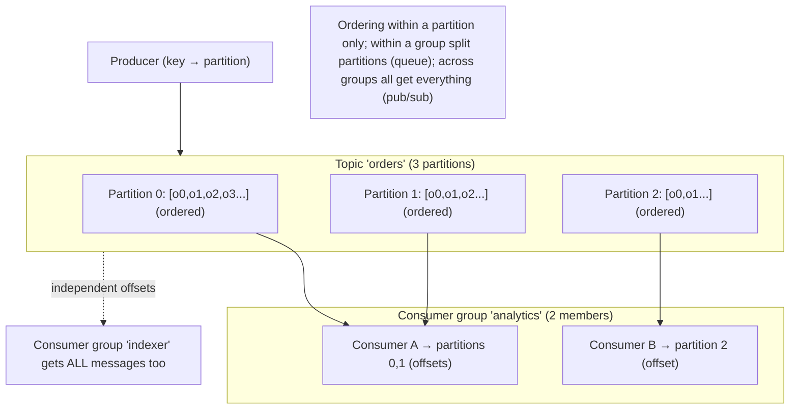
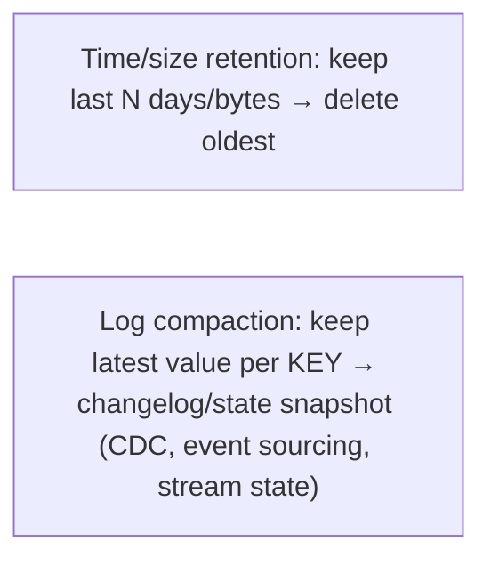

# Lesson 9.3 — The Distributed Log: Partitions, Offsets, Consumer Groups, Retention

> Part 9: Messaging & Streaming · Difficulty: 🔴
>
> **Prerequisites:** [9.2 Brokers vs Logs], [7.3 Partitioning], [8.3.4 Quorums/Replication], [4.2.1 Log-Structured].
> **Unlocks:** [9.4 Delivery Guarantees], [9.5 Ordering/Partition Keys], [9.6 Stream Processing], [9.8 CDC].

---

## 1. Learning Objectives

After this lesson you will be able to:

- Explain the **anatomy of a distributed log** (Kafka-style): **topics → partitions → ordered offsets**, and why partitioning is what gives the log **horizontal scalability** (7.3) while preserving **per-partition ordering** (8.2.3).
- Describe **offsets** (a consumer's durable position) and how consumer-managed offsets enable **replay, independent consumers, and at-least-once/at-most-once** (9.2/9.4).
- Explain **consumer groups** — how they combine **queue semantics** (members of a group split partitions) and **pub/sub** (different groups each get all messages) — and **partition assignment / rebalancing**.
- Reason about **retention** (time/size-based, and **log compaction**), **replication** of partitions (leader/followers, ISR — 8.3.4/5.4.2) for durability/HA, and the throughput/ordering/consumer-count tradeoffs of partition count.

---

## 2. Motivation — How one append-only log scales to millions of messages per second

9.2 established the log model's power — retention, replay, many independent consumers, ordering, throughput. This lesson opens the hood on **how a distributed log actually achieves all that**, using the Kafka-style architecture as the representative model. A single append-only file on one machine is ordered and fast, but it can't scale (one disk, one machine's throughput) and isn't durable against node loss. The distributed log solves both with a handful of beautifully-composed concepts: a **topic** is split into **partitions** (each an independent ordered log), partitions are **distributed across nodes** (horizontal scale — 7.3) and **replicated** (durability/HA — 5.4.2), each message has a monotonic **offset** within its partition (position + ordering), **consumers track their own offsets** (replay + independence — 9.2), and **consumer groups** assign partitions to members (combining work-distribution and fan-out).

Understanding these mechanics is essential because they determine the log's guarantees and limits: **ordering is per-partition, not global** (so your **partition key** choice — 9.5 — decides what's ordered together), **parallelism is bounded by partition count** (a partition is consumed by at most one member of a group), **a partition rebalance** can pause consumption and re-shuffle work (echoing 7.4), and **retention** governs how far back you can replay (9.2). These aren't abstract — they're the exact knobs and constraints you tune in production, and the source of the most common streaming bugs (lost ordering from too many partitions, stuck consumers, offset-commit duplicates/loss). This lesson gives you the precise model so 9.4 (delivery guarantees) and 9.5 (ordering) make sense — and so you can reason about throughput, ordering, and replay as deliberate design choices.

---

## 3. Theory — From first principles

### 3.1 Topic → partitions → offsets (the anatomy)

`[CS]`
- A **topic** is a named stream of messages (a logical category, e.g., `orders`, `clicks`).
- A topic is divided into **partitions** — each partition is an **independent, ordered, append-only log**. Messages are appended to the end of a partition.
- Within a partition, each message gets a **monotonically increasing offset** (0, 1, 2, …) — its **position** in that partition. Offsets are **per-partition** (partition 0's offset 5 is unrelated to partition 1's offset 5).
- **Ordering is guaranteed *within* a partition** (append order = offset order = read order), but **NOT across partitions** (no global order — this is the central constraint, §3.5/9.5).
So a topic is really **N parallel ordered logs**. The partition is the unit of **ordering, parallelism, and distribution**.

### 3.2 Partitioning = scalability + ordering tradeoff

`[CS]` Partitioning (7.3) is what makes the log scale and is the source of its key tradeoff:
- **Horizontal scale:** partitions are spread across **broker nodes**, so write and read throughput scale with the number of partitions/nodes (more partitions = more parallel append/read — 4.2.1, 7.3). A high-volume topic just adds partitions.
- **Parallelism for consumers:** within a consumer group, **each partition is consumed by at most one member** → max consumer parallelism = **number of partitions** (more partitions = more consumers can work in parallel).
- **The ordering tradeoff:** ordering holds only **within** a partition. To keep related messages ordered, you send them to the **same partition** via a **partition key** (e.g., all events for `user_id=42` → same partition → ordered for that user — 9.5). Messages with different keys go to different partitions and have **no mutual ordering**.
- **The tension:** **more partitions = more throughput/parallelism but less "ordered together"** (fewer messages share a partition), and more overhead (more leaders/replicas/files, longer rebalances). **Fewer partitions = more ordering but less parallelism.** Choosing partition count and key is a core design decision (§3.7, 9.5).

### 3.3 Offsets — the consumer's durable position

`[CS]`
- An **offset** is a consumer's **position** in a partition — "I have processed up to offset 105." The **consumer (group) owns and commits** its offsets (stored durably — in Kafka, in an internal `__consumer_offsets` topic).
- **Consumer-managed offsets** are what give the log its superpowers (9.2): a consumer can **commit** its progress, **resume** from there after a restart, **reset backward** to **replay**, or **skip forward**. Multiple consumers each have **independent** offsets → independent progress (§3.4).
- **Offset commit timing drives delivery semantics** (9.4): **commit *after* processing** → at-least-once (crash before commit → reprocess → duplicates); **commit *before* processing** → at-most-once (crash after commit → message skipped → loss). This is the at-least-once/at-most-once choice (8.4.1/9.1) realized as *when you commit the offset*.

### 3.4 Consumer groups — queue + pub/sub combined

`[CS]` A **consumer group** is a set of consumer instances that **cooperatively consume a topic**, and it elegantly unifies the two messaging models (9.1):
- **Within a group:** the topic's **partitions are divided among the group's members** — each partition assigned to **exactly one** member. So the group's members **split the work** (each message processed by one member) → **queue semantics / work distribution** (scale a group by adding members, up to the partition count). 
- **Across groups:** **each consumer group independently consumes the whole topic** with its **own offsets** → **pub/sub semantics / fan-out** (the analytics group, the indexer group, the notifier group each get *all* messages, independently).
**So one log gives you both:** "split the work among a group" (queue) **and** "every group gets everything" (topic) — the blend 9.1/9.2 promised. A group with one member reads all partitions; a group with `P` members (P = partitions) gives max parallelism; extra members beyond `P` sit **idle** (no partition to own).

### 3.5 Partition assignment and rebalancing

`[CS]` Partitions must be assigned to group members, and reassigned when membership changes:
- **Assignment:** a group coordinator assigns partitions to members (range/round-robin/sticky strategies). Each partition → one member.
- **Rebalancing:** when a member **joins, leaves, or fails** (or partitions change), the group **rebalances** — partitions are **reassigned** among the current members. During a (classic, "stop-the-world") rebalance, **consumption pauses** while reassignment happens — a brief unavailability (echoing 7.4's rebalancing). Frequent rebalances (flapping consumers, long processing pauses exceeding the poll/heartbeat timeout) cause **churn** and **lag** (a common production problem — like 7.4 flapping). **Sticky/incremental cooperative rebalancing** reduces the disruption (only moves what's needed).
- **Implication:** consumers must **heartbeat** and **poll within the timeout** (or be considered dead → rebalance — 8.1.3 slow vs dead), and **handle reassignment** (commit offsets before losing a partition; be idempotent since a reassigned partition may reprocess uncommitted messages) (§3.3, 9.4).

### 3.6 Retention and log compaction

`[CS]` The log **retains** messages (9.2); how long is governed by **retention**:
- **Time-based retention:** keep messages for N hours/days (e.g., 7 days), then delete the oldest segments. Bounds storage and replay window.
- **Size-based retention:** keep up to N bytes per partition, delete oldest beyond that.
- **Log compaction (a different mode):** instead of deleting by age, **retain the latest value per key** (compact away superseded older values). This turns the log into a **changelog / snapshot of latest state per key** — perfect for **CDC** (9.8), **event sourcing** state rebuild (9.7), and **stateful stream-processing** state stores (9.6). A compacted topic keeps "the current value of each key" forever (plus recent history), so a new consumer can rebuild full state by replaying it.
- **Tradeoff:** longer retention = more replay/recovery ability + more storage cost (§3.2, 9.2). Set retention to your replay/recovery needs.

### 3.7 Replication, leaders, and ISR (durability/HA)

`[CS]` Each partition is **replicated** across brokers for durability and availability (5.4.2, 8.3.4):
- A partition has a **leader** replica (handles all reads/writes for that partition) and **follower** replicas that copy the leader's log. (Leader election via the cluster's consensus/controller — 8.3.5; Kafka historically via ZooKeeper, now KRaft/Raft — 8.3.8.)
- **In-Sync Replicas (ISR):** the set of replicas **caught up** with the leader. A write is considered **committed** when replicated to the required number of ISR (configurable via **acks**: `acks=all` waits for all ISR → strong durability; `acks=1` waits for leader only → faster but can lose data on leader failure; `acks=0` fire-and-forget → may lose). This is the **quorum/replication durability knob** (8.3.4/5.4.2) for the log.
- **Failover:** if a leader fails, a follower (from the ISR) is **promoted** → the partition stays available (with possible small data loss if not `acks=all`, like async replication — 5.4.2). **Min-ISR** settings prevent committing when too few replicas are in sync (favoring consistency over availability — Part 10).
- **Result:** the log is **durable** (replicated) and **highly available** (failover per partition) — combining the log abstraction with the replication/quorum machinery of Part 8/Part 10.

### 3.8 Putting it together — the design knobs

`[BP]` The distributed log's behavior is set by a few choices:
- **Partition count:** more = higher throughput + more consumer parallelism, but less "ordered together," more overhead, longer rebalances. Hard to *reduce* later (often you can only increase). Choose for target throughput + ordering needs (§3.2, 9.5).
- **Partition key:** determines what's **ordered together** and **co-located** — pick so related events share a partition (per-user/per-entity ordering) without creating **hot partitions** (7.4 — a celebrity key overloads one partition!) (§3.2, 9.5).
- **Consumer-group sizing:** ≤ partition count for full utilization (extra members idle).
- **Retention / compaction:** replay window vs storage; compaction for changelog/state (§3.6).
- **Replication factor + acks + min-ISR:** durability/availability vs latency (§3.7, Part 10).
- **Offset-commit strategy:** when to commit → delivery semantics (§3.3, 9.4).
These knobs are the practical surface of everything in 9.4 (guarantees), 9.5 (ordering), 9.6 (stream processing), and 9.9 (lag/backpressure).

---

## 4. Visual Intuition

### Topic → partitions → offsets → consumer group

### Retention vs compaction

---

## 5. Real-World Analogy

Imagine a **chain of numbered ledgers** recording a company's activity.

- **Topic → partitions:** "Sales activity" is too much for one ledger book, so you keep **several ledger books** (partitions) and split entries among them. **Each book is strictly in order** (page 1, 2, 3…), but there's **no single timeline across books** — book 1's page 5 and book 2's page 5 aren't comparable in time (per-partition, not global, ordering).
- **Partition key:** you decide **which book an entry goes in by a rule** — e.g., "all entries for customer #42 always go in book 2" — so **everything about customer #42 stays in order in one book** (per-key ordering), even though different customers land in different books.
- **Offset = a bookmark:** each **reader keeps their own bookmark** ("I've read book 2 up to page 105"). They can **resume** from their bookmark, **flip back to replay**, or skip ahead — and different readers have **independent bookmarks** (your reading doesn't move mine).
- **Consumer group:** the **analytics team** splits the books among its members — Alice reads books 0 and 1, Bob reads book 2 — so **together they cover everything once** (work split = queue). Meanwhile the **audit team** is a *separate* team reading **all the same books** with **their own bookmarks** (every team gets everything = pub/sub). If Alice leaves, the team **reassigns** her books to others (rebalance — a brief pause to re-divide).
- **Retention:** the ledgers are kept on the shelf for **30 days**, then the oldest pages are recycled (time retention) — that's how far back anyone can replay. Or, **compaction**: instead of by age, you keep only the **latest entry per customer** (a running "current balance" book) so a new reader can reconstruct everyone's current state without reading every historical entry.
- **Replication:** each ledger book is **photocopied to backup shelves** (followers) kept in sync; if the main shelf burns, a backup becomes primary (failover) — and you can require "wait until the backups have the entry" (`acks=all`) before calling it official (durability).

---

## 6. Industry Example

- **Kafka topics/partitions/offsets/consumer groups** `[CONV]`: the canonical distributed log — exactly this anatomy; partitions for scale + per-partition ordering, consumer groups for queue+pub/sub, offsets for replay (§3.1–3.5, Part 18 LinkedIn/Kafka lineage). *(Representative.)*
- **Log compaction for changelogs** `[CONV]`: Kafka compacted topics back Kafka Streams/ksqlDB **state stores**, CDC topics (Debezium — 9.8), and event-sourced state (9.7) — keep latest-per-key (§3.6). *(Representative.)*
- **ISR / acks durability** `[CONV]`: `acks=all` + min-ISR for strong durability (no data loss on single failure) vs `acks=1`/`acks=0` for lower latency with loss risk — the replication knob (§3.7, 5.4.2, Part 10). *(Representative.)*
- **Rebalance churn** `[CONV]`: a classic Kafka ops problem — slow consumers exceeding `max.poll.interval` get kicked → rebalance → lag; fixed by tuning/cooperative rebalancing (§3.5, 8.1.3). *(Representative.)*
- **Partition count for throughput** `[BP]`: scaling a topic's throughput/parallelism by increasing partitions, balanced against ordering and overhead (§3.2/3.8, 9.5). *(Representative.)*

---

## 7. Implementation Details — designing with a distributed log

- **Choose partition count for target throughput + consumer parallelism**, knowing it caps group parallelism and is hard to reduce later; don't over-partition (overhead, longer rebalances, less ordered-together) (§3.2/3.8, 9.5) `[BP]`.
- **Choose the partition key for per-entity ordering + even spread** — co-locate related events (per-user/per-key order) while **avoiding hot partitions** (a dominant key overloads one partition — 7.4) (§3.2, 9.5).
- **Decide offset-commit strategy = delivery semantics** (§3.3, 9.4): commit-after-process (at-least-once → idempotent consumers) vs commit-before (at-most-once). Default at-least-once + idempotency (8.4.1/9.4).
- **Set retention to replay/recovery needs** (time/size); use **compaction** for changelog/state topics (CDC, event sourcing, stream state) (§3.6, 9.7/9.8).
- **Configure replication + acks + min-ISR** for your durability/availability target — `acks=all` + min-ISR for no-loss (favor consistency); lower for latency (§3.7, Part 10).
- **Make consumers heartbeat/poll within timeouts** and handle **rebalances** (commit before losing partitions; be idempotent on reassignment) to avoid churn and duplicates (§3.5, 8.1.3).
- **Size consumer groups ≤ partition count** (extra members idle); scale by adding partitions + members together (§3.4).
- **Monitor consumer lag** (offset behind log end) per partition — the key health metric (9.9, Part 16).

---

## 8. Advantages

- **Horizontal scalability** — partitions distribute load across nodes; throughput scales with partitions (7.3, §3.2).
- **Per-partition ordering** — strict order within a partition (8.2.3), keyed by partition key (§3.1/3.5/9.5).
- **Replay + independent consumers** — consumer-managed offsets enable reprocessing and many independent consumer groups (§3.3/3.4, 9.2).
- **Queue + pub/sub in one** — consumer groups give work distribution *and* fan-out (§3.4).
- **Durability + HA** — partition replication (ISR/acks) survives node loss with failover (§3.7, 5.4.2).
- **Compaction for state** — changelog topics rebuild latest-per-key state (CDC, event sourcing, stream state) (§3.6).

---

## 9. Disadvantages / limitations

- **No global ordering** — only per-partition; cross-partition order requires key design and is otherwise unordered (§3.1/3.5, 9.5).
- **Parallelism capped by partition count** — can't exceed partitions per group; partition count is hard to reduce (§3.2/3.4).
- **Hot partitions** — a skewed key overloads one partition regardless of total partitions (7.4) (§3.2/3.8).
- **Rebalance disruption** — membership changes pause/reshuffle consumption; flapping → churn/lag (§3.5).
- **Operational complexity** — partitions, replication, ISR, offsets, consumer-group coordination to run/tune (Part 14).
- **Retention storage cost** — retained data costs storage; replay window vs cost tradeoff (§3.6, 9.2).

---

## 10. When NOT to / limits

- **When global total ordering across all messages is required** — a single partition (no parallelism) is the only way; usually rethink the requirement (per-key ordering is almost always enough — 9.5).
- **When you need rich per-message routing/priorities** — a broker fits better than a log (9.2).
- **When data volume is tiny and replay/fan-out aren't needed** — a simpler queue/broker may suffice (9.2).
- **Over-partitioning** — don't add partitions beyond throughput needs (overhead, rebalance time, less ordering) (§3.2/3.8).
- **Under-replication for critical data** — don't run replication factor 1 / `acks=1` for data you can't lose (§3.7).

---

## 11. Common Mistakes

1. **Expecting global ordering** — assuming a topic is totally ordered when it's only per-partition → out-of-order bugs (§3.1/3.5, 9.5).
2. **Bad partition key → hot partition** — a dominant key (celebrity/whale) overloads one partition while others idle (7.4) (§3.2).
3. **Over- or under-partitioning** — too many (overhead, rebalance churn, less ordered-together) or too few (parallelism ceiling) (§3.2/3.8).
4. **Wrong offset-commit timing** — commit-before-process loses messages; commit-after without idempotency duplicates (§3.3, 9.4).
5. **Slow processing exceeding poll/heartbeat timeout** → consumer kicked → rebalance churn + lag (§3.5, 8.1.3).
6. **Not handling rebalances** — duplicate processing of reassigned uncommitted messages; not committing before losing a partition (§3.5).
7. **More group members than partitions** → idle consumers (no partition to own) (§3.4).
8. **Replication factor 1 / acks=1 for critical data** → data loss on node/leader failure (§3.7).

---

## 12. Interview Questions

**🟢 Easy**
- What are topics, partitions, and offsets in a distributed log?
- What ordering guarantee does a log provide, and at what granularity?

**🟡 Medium**
- How do consumer groups provide both queue (work distribution) and pub/sub (fan-out) semantics?
- What is offset commit, and how does its timing determine at-least-once vs at-most-once delivery?

**🔴 Hard**
- Explain the partition-count tradeoff (throughput/parallelism vs ordering/overhead) and how partition-key choice affects ordering and hot partitions.
- How does partition replication (leader/followers/ISR/acks) provide durability and HA, and what's the consistency/latency tradeoff of `acks=all` vs `acks=1`?

**⚫ Staff+**
- Design the topic/partition layout for a high-volume per-user event stream that must preserve per-user ordering, scale to millions of msg/sec, feed several independent consumer groups (analytics, indexing, notifications), support replay, and avoid hot partitions. Specify partition count, key, retention/compaction, replication/acks, and consumer-group sizing — justifying each.
- A streaming pipeline suffers constant consumer-group rebalances and growing lag. Diagnose the likely causes (slow processing exceeding poll interval, flapping members, too few partitions, hot partition) and design the fixes (cooperative rebalancing, tuning, partitioning/key changes, scaling) (§3.5, 7.4, 8.1.3, 9.9).

---

## 13. Production Pitfalls

- **Out-of-order processing from cross-partition assumption:** code assumes global order but events for one entity were spread across partitions → mis-ordered processing (§3.1/3.5, 9.5).
- **Hot partition overload:** a celebrity/whale partition key sends most traffic to one partition → that partition's consumer lags while others idle (7.4) (§3.2).
- **Rebalance storm:** slow consumers exceed `max.poll.interval` → kicked → rebalance → more lag → more timeouts (a churn loop, kin to 7.4/8.1.3) (§3.5).
- **Duplicate/lost on offset commit:** commit-before-process loses messages on crash; commit-after without idempotency reprocesses → duplicates (§3.3, 9.4).
- **Data loss on failover:** `acks=1`/RF=1 → a leader failure loses un-replicated messages (§3.7).
- **Idle consumers:** more group members than partitions → extra members do nothing (under-utilized scaling) (§3.4).
- **Replay impossible / storage blowup:** retention too short to replay/recover, or too long → storage cost surprise (§3.6, 9.2).

---

## 14. Optimization Techniques

- **Partition for throughput + per-key ordering** — enough partitions for parallelism, key chosen for per-entity order + even spread (avoid hot partitions) (§3.2/3.8, 9.5) `[BP]`.
- **Compacted topics** for changelog/state (CDC, event sourcing, stream-processing state stores) (§3.6, 9.7/9.8).
- **`acks=all` + min-ISR** for no-loss durability (favor consistency); tune down for latency where loss is acceptable (§3.7, Part 10).
- **Cooperative/incremental rebalancing + tuned timeouts** to minimize rebalance disruption; keep processing under the poll interval (§3.5, 8.1.3).
- **Batching + sequential I/O** (inherent to the log) for high throughput (4.1.1/4.2.1).
- **Idempotent consumers + chosen offset-commit strategy** → exactly-once effects (§3.3, 9.4, 8.4.1).
- **Monitor per-partition consumer lag** as the primary health signal (9.9, Part 16).

---

## 15. Summary

A **distributed log** (Kafka-style) scales the simple append-only log into a partitioned, replicated, replayable backbone. A **topic** is split into **partitions**, each an **independent ordered append-only log**; every message has a **monotonic offset** (position) within its partition. **Ordering is guaranteed within a partition but NOT across partitions** — the central constraint — so a **partition key** decides which related messages stay ordered together (per-user/per-entity order) (§3.1/3.5, 9.5). **Partitioning gives horizontal scale** (partitions spread across nodes; throughput grows with partitions — 7.3) and **consumer parallelism** (each partition consumed by at most one group member → max parallelism = partition count), with the **tradeoff** that more partitions = more throughput/parallelism but **less "ordered together,"** more overhead, and longer rebalances. **Offsets** are the **consumer's durable position**, owned and committed by the consumer — enabling **replay** (reset backward), **resume** (after restart), and **independent progress** across consumers; and the **timing of the offset commit** determines delivery semantics (commit-after-process → at-least-once + need idempotency; commit-before → at-most-once → loss) (§3.3, 9.4). **Consumer groups** unify the two messaging models: **within a group**, partitions are split among members (each message to one member → **queue/work distribution**); **across groups**, each group independently consumes the whole topic with its own offsets (→ **pub/sub fan-out**). Membership changes trigger **rebalancing** (partitions reassigned; classic rebalances pause consumption — flapping consumers cause churn/lag, echoing 7.4/8.1.3). **Retention** governs the replay window — **time/size-based** deletion, or **log compaction** (keep latest value per key → a changelog/state snapshot powering CDC, event sourcing, and stream-processing state). Each partition is **replicated** (leader + followers, **ISR**) for durability/HA, with the **acks/min-ISR** knob trading durability vs latency (acks=all = no-loss/consistency; acks=1/0 = faster/lossy — 5.4.2, Part 10) and **failover** promoting a follower. The design knobs — **partition count, partition key, consumer-group size, retention/compaction, replication/acks, offset-commit strategy** — are the practical surface of the guarantees explored in 9.4 (delivery), 9.5 (ordering), 9.6 (streaming), and 9.9 (lag/backpressure).

---

## 16. Revision Notes (flashcard-ready)

- **Q:** Topic/partition/offset? **A:** Topic = stream; partition = independent ordered append-only log; offset = monotonic position within a partition.
- **Q:** Ordering guarantee? **A:** Within a partition only — NOT across partitions; partition key decides what's ordered together.
- **Q:** What does partitioning give (and cost)? **A:** Horizontal scale + consumer parallelism (=#partitions); cost = less ordered-together, overhead, longer rebalances; hot-partition risk.
- **Q:** Offset? **A:** Consumer's durable position (consumer-owned) → replay, resume, independent progress.
- **Q:** Offset-commit timing → semantics? **A:** Commit after process = at-least-once (need idempotency); commit before = at-most-once (loss).
- **Q:** Consumer group within vs across? **A:** Within: split partitions (queue/work distribution); across groups: each gets all messages (pub/sub fan-out).
- **Q:** Max consumers per group? **A:** = partition count (extras idle).
- **Q:** Rebalancing? **A:** Reassign partitions on membership change; classic = pause consumption; flapping → churn/lag (use cooperative rebalancing).
- **Q:** Retention vs compaction? **A:** Retention = delete by time/size (replay window); compaction = keep latest value per key (changelog/state).
- **Q:** Replication knobs? **A:** Leader/followers + ISR; acks=all+min-ISR = no-loss (consistency); acks=1/0 = faster, lossy.
- **Q:** Key health metric? **A:** Consumer lag (offset behind the log end) per partition.

---

## 17. Further Reading + Knowledge-Graph Links

**Within this platform**
- **Previous:** [9.2 Brokers vs Logs] (the log model). **Builds on:** [7.3 Partitioning] (partitions = sharding), [8.3.4 Quorums]/[5.4.2 Replication] (ISR/acks), [4.2.1 Log-Structured]/[5.3.1 WAL] (the log), [8.2.3 per-partition total order].
- **Next:** [9.4 Delivery Guarantees] (offset-commit + idempotency), [9.5 Ordering/Partition Keys] (the key choice). **Then:** [9.6 Stream Processing], [9.7 Event Sourcing], [9.8 CDC], [9.9 Lag/Backpressure].
- **Enables:** [Part 18 Kafka case study], [7.4 Hot partitions], [Part 12 event backbone].

**Foundational texts (synthesized)**
- Kreps et al., Kafka papers / "The Log" (concept, synthesized).
- Kleppmann, *Designing Data-Intensive Applications* — partitioned logs, offsets, consumer groups, compaction (synthesized).
- Kafka documentation — partitions, offsets, consumer groups, ISR, retention, compaction (representative).

**Concept tags:** `[CS]` topic/partition/offset, per-partition ordering, consumer groups (queue+pub/sub), offset commit → delivery semantics, ISR/acks replication, retention/compaction · `[CONV]` Kafka anatomy, compacted changelogs, rebalance churn · `[BP]` partition count for throughput+ordering, key for per-entity order + even spread, acks=all for no-loss, monitor lag.
