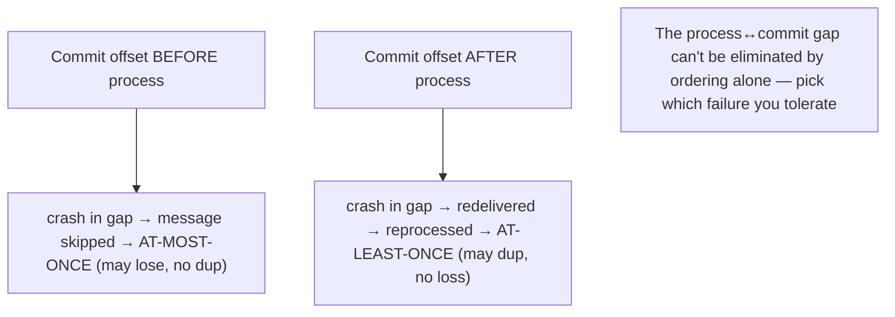
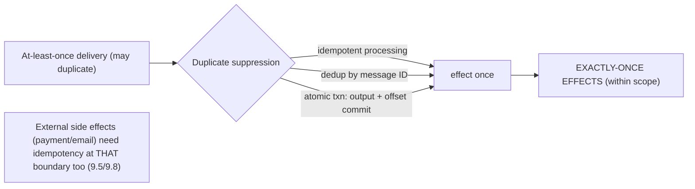

# Lesson 9.4 — Delivery Guarantees: At-Most-Once, At-Least-Once, Exactly-Once (and What "Exactly-Once" Really Means)

> Part 9: Messaging & Streaming · Difficulty: 🔴
>
> **Prerequisites:** [9.1 Messaging Fundamentals], [9.3 Distributed Log/Offsets], [8.4.1 RPC/Exactly-Once Effects], [8.4.2].
> **Unlocks:** [9.5 Idempotent Consumers], [9.8 Outbox/CDC], [Part 11 Idempotency], [Part 20 Capstone Ledger].

---

## 1. Learning Objectives

After this lesson you will be able to:

- Precisely define the three delivery guarantees — **at-most-once**, **at-least-once**, **exactly-once** — in the messaging context, and map them to concrete mechanisms (ack/offset-commit timing — 9.3).
- Explain rigorously why **exactly-once *delivery* is impossible** (the two-generals/8.4.1 argument) and what **"exactly-once" products actually provide**: **exactly-once *processing/effects*** via at-least-once + idempotency/dedup or transactions.
- Describe how real **exactly-once-semantics (EOS)** systems work (idempotent producers, transactional writes binding "process + produce + commit offset" atomically, deduplication) and their **scope and limits** (within the system vs end-to-end through external side effects).
- Choose the right guarantee per use case and design **idempotent consumers** + the **read-process-write** pattern so duplicates/loss don't corrupt state.

---

## 2. Motivation — The most misunderstood promise in distributed systems

No phrase in distributed systems causes more confusion than **"exactly-once."** Vendors advertise it, engineers assume it means "the message is delivered and processed precisely one time, guaranteed, no matter what," and then are surprised by duplicates in production. This lesson dispels the confusion definitively, building on the RPC version (8.4.1) and the log mechanics (9.3). The truth, stated up front: **exactly-once *delivery* over an unreliable network is impossible** (8.4.1 §3.4 — the two-generals argument: a lost acknowledgment forces a choice between possibly-losing and possibly-duplicating, with no way to be certain). What is achievable — and what every credible "exactly-once" system actually provides — is **exactly-once *effects* (a.k.a. exactly-once processing)**: a message may be **delivered/attempted multiple times**, but its **observable effect on state happens exactly once**, because duplicates are **detected and neutralized** via **idempotency, deduplication, or transactions**.

Getting this right is not pedantry — it's the difference between a correct payment system and one that double-charges. The default reality of messaging is **at-least-once** (9.1/9.3: process then commit offset → a crash before committing causes redelivery → reprocessing), so **every consumer must assume it will see duplicates** and be built to make them harmless. Meanwhile, the modern **exactly-once-semantics (EOS)** features (e.g., Kafka transactions) provide real, valuable guarantees — but only **within a well-defined scope** (read-process-write within the streaming system), **not** magically across arbitrary external side effects (a third-party API call, an email). Knowing precisely **what each guarantee means, how it's achieved, and where it stops** lets you design correct pipelines and avoid both the duplicate-bug trap and the false-confidence trap. This lesson is the rigorous, practical treatment of the guarantee that everything in messaging (and much of Part 11) depends on.

---

## 3. Theory — From first principles

### 3.1 The three guarantees, precisely

For a message/operation, "how many times does its effect occur?" `[CS]`:
- **At-most-once:** the effect occurs **0 or 1 times** — **never duplicated**, but **may be lost** (if a failure happens at the wrong moment, the message is never processed). 
- **At-least-once:** the effect occurs **1 or more times** — **never lost** (retried/redelivered until success), but **may be duplicated**. 
- **Exactly-once:** the effect occurs **exactly 1 time** — the ideal. As *delivery*, **impossible**; as *effects/processing*, **achievable** (§3.4–3.6).

The choice is fundamentally about **which failure you tolerate**: at-most-once tolerates **loss** (no dup), at-least-once tolerates **duplicates** (no loss). You can't naively have neither over an unreliable network — but you *can* get exactly-once **effects** by combining at-least-once delivery with **duplicate suppression** (§3.4).

### 3.2 How the guarantees are realized (ack/offset timing)

The guarantee is determined by **when you acknowledge / commit the offset** relative to **processing** (9.1/9.3) `[CS]`:
- **At-most-once:** **ack/commit-offset BEFORE processing.** If the consumer crashes after committing but before (or during) processing, the message is **considered done** and **never reprocessed** → **possible loss**, never duplicate.
- **At-least-once:** **ack/commit-offset AFTER successful processing.** If the consumer crashes after processing but before committing, the message is **redelivered** → **reprocessed** → **possible duplicate**, never lost. **The common default.**
- The window between "process" and "commit" is where duplicates (at-least-once) or loss (at-most-once) live — and it **cannot be eliminated** by reordering alone (whichever you do first, a crash in the gap causes the other failure). This is the mechanical root of §3.1's "pick your poison."

### 3.3 Why exactly-once *delivery* is impossible (restated)

From 8.4.1 §3.4 (the two-generals problem), applied to messaging `[CS]`:
- A producer sends a message; the broker may receive it but its **ack to the producer is lost**. The producer can't tell "broker didn't get it" from "broker got it, ack lost." To **avoid loss** it must be willing to **resend** (→ possible duplicate); to **avoid duplicates** it must **not resend** (→ possible loss). 
- The same applies between broker and consumer (process-then-ack: ack can be lost → redelivery → duplicate).
- **No finite protocol resolves this with certainty** — every ack can itself be lost. Therefore **guaranteed exactly-once *delivery* is impossible.** Any system claiming "exactly-once" is providing **at-least-once delivery + deduplication/idempotency** (= exactly-once *effects*) under the hood — which is the **correct and useful** thing (§3.4).

### 3.4 Exactly-once *effects* — the achievable goal

**Exactly-once effects (a.k.a. exactly-once processing)**: the message may be **delivered multiple times**, but its **effect on state occurs once** `[CS]`. Three mechanisms (often combined):
1. **Idempotency:** make processing **naturally safe to repeat** — applying the operation twice = applying it once (8.4.1). E.g., `set status = SHIPPED` (idempotent) vs `increment count` (not). Reprocessing a duplicate is a no-op. (Detailed in 9.5.)
2. **Deduplication:** the consumer **tracks processed message IDs** (an idempotency/dedup key — 8.4.1) and **skips** any it has already handled (a dedup store with a window). The producer attaches a unique key; the consumer records "done" keys.
3. **Transactional / atomic commit:** bind the **side effect + the offset commit** into **one atomic transaction**, so either both happen or neither — eliminating the §3.2 gap **within a transactional boundary** (§3.5).

With any of these, **at-least-once delivery + duplicate suppression = exactly-once effects.** This is the **default correct pattern** (9.1) and the substance behind every "exactly-once" feature.

### 3.5 Transactional exactly-once-semantics (EOS) — how Kafka-style systems do it

Modern streaming systems provide **EOS within their boundary** via two pieces `[EMERGING]`/`[CONV]`:
- **Idempotent producer:** the producer attaches a **sequence number + producer ID** so the broker **deduplicates retried produces** — a producer retry (from a lost ack — §3.3) doesn't append the message twice. This gives **exactly-once *append*** to the log despite producer retries.
- **Transactions (atomic read-process-write):** in a stream-processing pipeline (consume from topic A → process → produce to topic B → commit input offset), the system can wrap **"produce outputs + commit input offsets"** in a **single atomic transaction**. Either the outputs are published **and** the input offset advances, or **neither** — so on failure the work is retried from the same offset with no partial/duplicate output (consumers of topic B read only **committed** messages via "read-committed" isolation). This makes **read-process-write exactly-once** *within the streaming system*.
- **The key insight:** EOS works because the **offset (input position), the output, and the dedup state all live in the same transactional system** (the log), so they can be committed atomically — closing the §3.2 gap. It's **at-least-once + transactional dedup**, packaged as "exactly-once."

### 3.6 The scope and limits of "exactly-once" (the crucial caveat)

EOS is **bounded**, and misunderstanding its scope is the source of real bugs `[BP]`:
- **It holds *within* the transactional system** (e.g., Kafka topic→process→Kafka topic, with offsets). The atomicity covers **outputs and offsets in the same system**.
- **It does NOT automatically extend to external side effects** that aren't part of the transaction: calling a **third-party payment API**, **sending an email**, **writing to an external database** that isn't in the transaction. If your processing **charges a card via an external API** and then the transaction retries, the **external charge already happened** — EOS doesn't undo it. For these, you **still need idempotency/dedup at the external boundary** (idempotency keys on the payment API — 8.4.1) or **transactional integration** (the **outbox pattern** — 9.8 — to make the external write part of a local transaction + reliable publish).
- **End-to-end exactly-once requires every hop to be idempotent/transactional** — the guarantee is only as strong as the weakest non-idempotent side effect. **There is no global "exactly-once" for arbitrary external actions.**
**So:** EOS is real and valuable for **stream-to-stream** processing, but for **external effects** you must design **idempotency at each boundary** (9.5, 9.8). Treating EOS as end-to-end magic causes the double-charge bug it appears to prevent.

### 3.7 Choosing a guarantee

`[BP]`
| Use case | Guarantee |
|---|---|
| Loss-tolerant telemetry/metrics (some drops OK) | **At-most-once** (simplest, fastest) |
| Most important work (orders, notifications, indexing) | **At-least-once + idempotent consumers** → exactly-once effects (the default) |
| Stream-to-stream processing within the log | **EOS transactions** (read-process-write atomic) |
| External side effects (payments, emails, external DB) | **At-least-once + idempotency keys at the external boundary** (and/or outbox — 9.8) |
| Money / ledgers | **Idempotency everywhere + exactly-once effects**, never naive at-most-once or unguarded at-least-once (Part 20) |

**Default:** **at-least-once + idempotency** (exactly-once effects). Use **at-most-once** only when loss is acceptable; use **EOS transactions** for stream-to-stream; and for **external effects always add idempotency at the boundary** regardless of in-system EOS (§3.6).

### 3.8 The read-process-write pattern and idempotent design

The canonical reliable-consumer pattern `[BP]`:
- **Read** a message (from the log/queue).
- **Process** it (the business logic + side effects).
- **Write** the result and **commit the offset** — ideally **atomically** (transactional EOS within the system) or with **idempotency** so a redelivery after a crash-before-commit is harmless.
- For **external side effects**, use an **idempotency key** so the external system dedupes (8.4.1), or use the **outbox pattern** (9.8) to make "update local DB + emit event" atomic and reliable (avoiding the dual-write problem).
The discipline: **assume at-least-once → assume duplicates → make every effect idempotent (in-system via transactions/dedup; external via idempotency keys/outbox).** Done right, the visible behavior is **exactly-once effects** even though delivery is at-least-once.

---

## 4. Visual Intuition

### Ack/offset timing → guarantee

### Exactly-once effects = at-least-once + dedup/idempotency/txn

---

## 5. Real-World Analogy

Recall the **pizza-by-postcard** analogy (8.4.1), now extended to a kitchen pipeline.

- **At-most-once:** you mail **one** postcard and **never re-mail**. If it's lost, **no pizza** — but you'll never get two. Fine if a missed pizza is no big deal (loss-tolerant).
- **At-least-once:** you **keep re-mailing until you get a confirmation.** You'll **definitely** get a pizza — but if confirmations get lost, you might get **several** (duplicates). The kitchen *will* sometimes make the same order twice.
- **Why "exactly-once delivery" is impossible:** there's no way to guarantee **exactly one postcard is received and acted on** — every confirmation can itself be lost, so neither side is ever *certain* (two-generals). You must choose: risk losing it or risk duplicating it.
- **Exactly-once *effects* (the achievable goal):** the kitchen writes each order's **number (#A7)** on a board and **refuses to cook #A7 twice.** Now you can re-mail #A7 all day (at-least-once) and still get **exactly one pizza** (dedup → exactly-once effect).
- **EOS transactions (in-system):** imagine the kitchen's *internal* steps — "take order off the queue, cook it, mark the queue position done" — are wrapped so they **all commit together or not at all.** If the cook collapses mid-way, nothing is half-done; the order is retried cleanly from the queue with no duplicate internal record. **But** — and this is the crucial caveat — if cooking involved **calling an outside supplier to charge for premium cheese** (an external side effect), that charge **already went through** before the collapse; the kitchen's neat internal transaction **can't un-charge the supplier.** So for the *external* charge, you **also** need the supplier to honor "#A7 — already charged, don't charge again" (idempotency at the external boundary). The internal "exactly-once" is real, but it **stops at the kitchen door** — beyond it, you need idempotency at every external step.

---

## 6. Industry Example

- **Kafka EOS (idempotent producer + transactions)** `[EMERGING]`: idempotent producers dedupe retried appends; transactions make read-process-write (consume→produce→commit-offset) atomic with read-committed consumers — exactly-once **within Kafka** (§3.5). *(Representative.)*
- **Stripe-style idempotency keys** `[BP]`: external payment APIs require an idempotency key so an at-least-once retry never double-charges — exactly-once effects at the **external boundary** (§3.4/3.6, 8.4.1). *(Representative.)*
- **Consumer dedup tables** `[CONV]`: consumers record processed message IDs (with a window/TTL) to skip duplicates — the dedup mechanism (§3.4). *(Representative.)*
- **Outbox pattern for external writes** `[BP]`: to avoid the dual-write problem (DB write + event publish not atomic), write the event to an outbox table in the same DB transaction, then publish via CDC — making external integration reliably exactly-once-effect (9.8, §3.6). *(Representative.)*
- **"Exactly-once" misunderstanding incidents** `[OPINION]`: teams assuming framework EOS covers external side effects → double charges/emails when retries hit non-idempotent external calls (§3.6). *(Representative.)*

---

## 7. Implementation Details — getting guarantees right

- **Default to at-least-once + idempotent consumers** → exactly-once effects; reserve at-most-once for loss-tolerant data (§3.7) `[BP]`.
- **Set ack/offset-commit timing deliberately** — commit **after** processing for at-least-once (the usual choice), and make processing idempotent so redelivery is harmless (§3.2).
- **Make every effect idempotent or dedup'd** (9.5): idempotency keys, dedup store (with TTL/window), natural keys / conditional writes / upserts, state-based (not delta-based) operations (§3.4, 8.4.1).
- **Use EOS transactions for stream-to-stream** (read-process-write within the log) when you need clean exactly-once internal processing (§3.5).
- **Never assume in-system EOS covers external side effects** — add **idempotency keys at every external boundary** (payments, emails, external DBs) and/or use the **outbox pattern** for atomic DB-write-plus-event (§3.6, 9.8).
- **Use the read-process-write pattern** and commit input offset atomically with outputs where possible (§3.8).
- **For money/ledgers**, design idempotency end-to-end; never rely on naive at-most-once or unguarded at-least-once (§3.7, Part 20).
- **Monitor for duplicates/loss** (dedup hit rates, gaps) and test failure injection (crash between process and commit) to verify your guarantee actually holds (Part 14).

---

## 8. Advantages (per guarantee)

- **At-most-once:** simplest, fastest, no dedup needed — fine for loss-tolerant data.
- **At-least-once:** no loss; the robust default for important work; simple (process then ack).
- **Exactly-once effects (at-least-once + idempotency/dedup/txn):** correctness (no loss, no duplicate effect) — the practical ideal.
- **EOS transactions:** clean exactly-once read-process-write **within** the streaming system, no consumer-side dedup needed for in-system outputs.
- **Idempotency at boundaries:** makes the whole pipeline retry-safe and correct end-to-end.

---

## 9. Disadvantages / costs

- **At-most-once:** **data loss** — unacceptable for important operations.
- **At-least-once:** **duplicates** → idempotency mandatory; without it, double effects (the classic bug).
- **Exactly-once delivery:** **impossible** — don't design for it (§3.3).
- **EOS transactions:** **performance/complexity overhead** (transactional coordination, read-committed latency); **bounded scope** (doesn't cover external effects — §3.6).
- **Idempotency/dedup:** state to maintain (dedup store, keys), TTL/window management, complexity at every boundary.
- **End-to-end exactly-once:** requires **every hop** idempotent/transactional — easy to miss one (§3.6).

---

## 10. When NOT to / limits

- **Don't design for exactly-once delivery** — it's impossible; design exactly-once effects (§3.3).
- **Don't use at-most-once for important/financial operations** — loss is unacceptable (§3.7).
- **Don't rely on in-system EOS for external side effects** — add idempotency at the external boundary / outbox (§3.6) — the #1 EOS misuse.
- **Don't use at-least-once without idempotent consumers** — guaranteed duplicate effects (§3.2/3.4).
- **Don't pay EOS-transaction overhead** where simple idempotency suffices, or where loss is acceptable (at-most-once) (§3.5/3.7).

---

## 11. Common Mistakes

1. **Believing "exactly-once delivery" exists / is end-to-end** → duplicates on external effects (§3.3/3.6) — the headline mistake.
2. **At-least-once without idempotency** → double charges/orders/emails (§3.2/3.4, 8.4.1).
3. **Assuming framework EOS covers a third-party API/email/external DB** → double external effects on retry (§3.6).
4. **Committing offset before processing** unintentionally → silent message loss (§3.2).
5. **Delta-based effects** (`+= amount`) reprocessed under at-least-once → wrong totals (use idempotent/state-based) (§3.4, 8.4.1).
6. **Dedup store without TTL/window** → unbounded growth; or **too-short window** → missed duplicates (§3.4).
7. **At-most-once for important data** → silent loss (§3.7).
8. **Not testing the crash-between-process-and-commit case** → the guarantee is assumed, not verified (§7).

---

## 12. Interview Questions

**🟢 Easy**
- Define at-most-once, at-least-once, and exactly-once.
- How does offset/ack commit timing determine at-most-once vs at-least-once?

**🟡 Medium**
- Why is exactly-once *delivery* impossible, and what does "exactly-once" actually mean in practice?
- How do you turn at-least-once delivery into exactly-once effects? (Idempotency, dedup, transactions.)

**🔴 Hard**
- Explain how Kafka EOS (idempotent producer + transactions) achieves exactly-once read-process-write, and precisely where that guarantee stops (external side effects).
- Design a consumer that processes payments from a queue with no double-charges, given at-least-once delivery and an external payment API. (Idempotency keys + dedup + read-process-write/outbox.)

**⚫ Staff+**
- A pipeline consumes orders, charges a card via an external API, writes to a DB, and emits an event. Design end-to-end exactly-once *effects*: where in-system EOS helps, where it doesn't, and how idempotency keys + the outbox pattern (9.8) close the external gaps. Analyze what happens on a crash at each step.
- Your team enabled "exactly-once" in the streaming framework but customers are still being double-charged on retries. Diagnose why (EOS scope stops at external side effects), and design the fix (idempotency at the payment boundary, outbox for the DB-write+event), plus how you'd reconcile existing duplicates.

---

## 13. Production Pitfalls

- **Double-charge despite "exactly-once":** framework EOS covers in-system topics but the **external payment API** isn't transactional; a retry re-charges (§3.6) — the canonical EOS misunderstanding.
- **Duplicate effects from at-least-once + non-idempotent consumer:** redelivery after crash-before-commit reprocesses → double email/order/increment (§3.2/3.4).
- **Silent loss from early commit:** offset committed before processing; a crash skips the message → missing data, no error (§3.2).
- **Wrong totals from delta reprocessing:** `balance += x` reprocessed → inflated balance (use idempotent/state-based) (§3.4).
- **Dedup store blowup or misses:** no TTL → unbounded; too-short window → duplicates slip through after the window (§3.4).
- **EOS performance surprise:** transactional read-process-write adds latency/coordination overhead under high throughput (§3.5).
- **Unverified guarantee:** the "exactly-once" claim never tested against crash-in-the-gap → fails in real incidents (§7).

---

## 14. Optimization Techniques

- **At-least-once + idempotency** as the default correctness pattern → exactly-once effects (§3.4/3.7) `[BP]`.
- **Idempotency keys + dedup store (with TTL/window)** at consumers and **external boundaries** (8.4.1, §3.4/3.6).
- **EOS transactions** for stream-to-stream read-process-write where clean in-system exactly-once is worth the overhead (§3.5).
- **Outbox pattern** to make "DB write + event emit" atomic and reliable for external integration (9.8, §3.6).
- **State-based (idempotent) operations** over delta-based (§3.4).
- **At-most-once** only for loss-tolerant, high-volume telemetry to save overhead (§3.7).
- **Failure-injection testing** (crash between process and commit) to verify the guarantee holds (§7, Part 14).

---

## 15. Summary

Delivery guarantees describe **how many times a message's effect occurs**: **at-most-once** (0 or 1 — may **lose**, never duplicate), **at-least-once** (1+ — never lose, may **duplicate**), and **exactly-once** (exactly 1 — the ideal). Mechanically, the guarantee is set by **when you acknowledge / commit the offset** relative to processing (9.3): **commit-before-process → at-most-once** (crash in the gap loses the message), **commit-after-process → at-least-once** (crash in the gap redelivers → duplicate) — and the process↔commit **gap can't be eliminated by ordering alone**, so you must choose which failure to tolerate. **Exactly-once *delivery* is impossible** over an unreliable network (the two-generals argument — 8.4.1: every ack can be lost, forcing a choice between possibly-losing and possibly-duplicating). What **is** achievable — and what every credible "exactly-once" system actually provides — is **exactly-once *effects* (processing)**: deliver **at-least-once** but ensure the **effect on state happens once** via **idempotency** (safe to repeat), **deduplication** (track + skip seen message IDs), or **atomic transactions** (commit side effect + offset together). Modern **EOS** (Kafka-style) combines an **idempotent producer** (dedupes retried appends → exactly-once *append*) with **transactions** that make **read-process-write** (consume→produce→commit-offset) atomic, with read-committed consumers — giving real exactly-once **within the streaming system** because the offset, output, and dedup state share one transactional boundary. **But its scope stops at the system boundary:** it does **not** cover **external side effects** (third-party payment APIs, emails, external DBs) — for those you **still need idempotency keys at each external boundary** or the **outbox pattern** (9.8), and **end-to-end exactly-once requires every hop to be idempotent/transactional** (the guarantee is only as strong as the weakest unguarded external effect — the #1 source of "exactly-once" double-charge bugs). **Default to at-least-once + idempotent consumers** (exactly-once effects), use **at-most-once** only for loss-tolerant data, use **EOS transactions** for stream-to-stream, and **always add idempotency at external boundaries** via the **read-process-write** discipline. The mantra: **assume at-least-once → assume duplicates → make every effect idempotent**, and the visible behavior becomes exactly-once.

---

## 16. Revision Notes (flashcard-ready)

- **Q:** Three guarantees? **A:** At-most-once (may lose, no dup), at-least-once (no loss, may dup — default), exactly-once (ideal).
- **Q:** What sets the guarantee mechanically? **A:** Offset/ack commit timing — before process = at-most-once; after process = at-least-once.
- **Q:** Why is exactly-once delivery impossible? **A:** Two-generals — lost acks force choosing possibly-lose vs possibly-duplicate; no certainty.
- **Q:** What's achievable? **A:** Exactly-once *effects* = at-least-once delivery + idempotency/dedup/transactions.
- **Q:** Three duplicate-suppression mechanisms? **A:** Idempotent processing, dedup by message ID, atomic transaction (effect + offset commit).
- **Q:** How does Kafka EOS work? **A:** Idempotent producer (dedupe retried appends) + transactions (atomic read-process-write, read-committed) — exactly-once *within Kafka*.
- **Q:** EOS's crucial limit? **A:** Stops at the system boundary — does NOT cover external side effects (payments/emails/external DB); add idempotency there.
- **Q:** End-to-end exactly-once requires? **A:** Every hop idempotent/transactional — only as strong as the weakest unguarded external effect.
- **Q:** Default choice? **A:** At-least-once + idempotent consumers (exactly-once effects).
- **Q:** Read-process-write pattern? **A:** Read, process, write+commit-offset atomically (or with idempotency); external effects via idempotency keys/outbox.

---

## 17. Further Reading + Knowledge-Graph Links

**Within this platform**
- **Builds on:** [8.4.1 RPC/Exactly-Once Effects] (the impossibility + idempotency), [9.1 Delivery Semantics], [9.3 Offsets/commit timing].
- **Next:** [9.5 Ordering & Idempotent Consumers] (how to make consumers idempotent). **Then:** [9.8 CDC/Outbox] (atomic external integration).
- **Enables:** [Part 11 Idempotency/Exactly-Once Effects], [Part 20 Capstone ledger] (financial correctness), [Part 12 Microservices].

**Foundational texts (synthesized)**
- Kleppmann, *Designing Data-Intensive Applications* — delivery semantics, exactly-once, idempotence, transactions (synthesized).
- Kafka EOS documentation/design (idempotent producer, transactions) (representative).
- Two-generals problem (concept, synthesized).

**Concept tags:** `[CS]` at-most/at-least/exactly-once, commit-timing → guarantee, exactly-once delivery impossible, exactly-once effects · `[CONV]` ack/offset timing, dedup stores, idempotency keys · `[BP]` at-least-once + idempotency default, idempotency at external boundaries, read-process-write, outbox · `[EMERGING]` Kafka EOS (idempotent producer + transactions) · `[OPINION]` EOS-scope misunderstanding.
