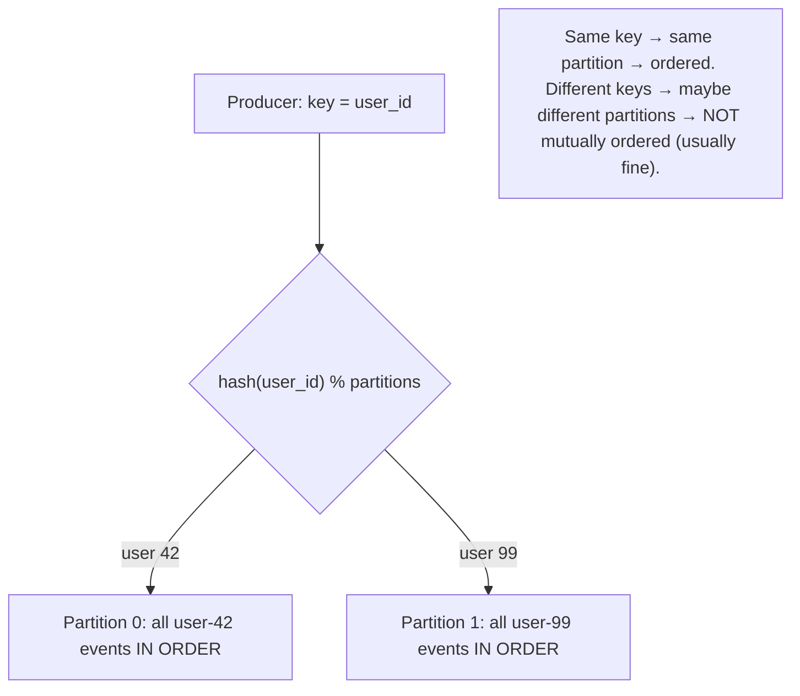

# Lesson 9.5 — Ordering, Partitioning Keys, and Idempotent Consumers

> Part 9: Messaging & Streaming · Difficulty: 🔴
>
> **Prerequisites:** [9.3 Distributed Log/Partitions], [9.4 Delivery Guarantees], [8.2.3 Ordering], [8.4.1 Idempotency], [7.4 Hotspots].
> **Unlocks:** [9.6 Stream Processing], [9.8 CDC/Outbox], [Part 11 Idempotency], [Part 20 Capstone].

---

## 1. Learning Objectives

After this lesson you will be able to:

- Explain why **ordering in messaging is per-partition, not global** (9.3/8.2.3), and use the **partition key** to control **what is ordered together** (per-entity ordering).
- Choose a **partitioning key** that gives the **right ordering scope + even distribution**, avoiding **hot partitions** (7.4) and the ordering-vs-parallelism tension (9.3).
- Design **idempotent consumers** (the mandatory companion to at-least-once — 9.4/8.4.1) so duplicates and retries don't corrupt state — via idempotency keys, dedup, natural keys/upserts, and state-based operations.
- Reason about **ordering + idempotency together** under redelivery/rebalancing (9.3), and handle out-of-order edge cases (e.g., a duplicate/older event arriving after a newer one).

---

## 2. Motivation — "In order" and "exactly-once effect" are both your job

Two consumer-side concerns decide whether a streaming pipeline is **correct**: **ordering** (does the consumer see events in the right sequence?) and **idempotency** (do duplicates corrupt state?). Both are subtle because the log (9.3) only gives you **per-partition ordering** and **at-least-once delivery** (9.4) — the rest is your design. If you process a user's events out of order (e.g., apply "account closed" before "deposit"), or you process a duplicate "withdraw $100" twice, you get **wrong, hard-to-debug state**. These are not rare: out-of-order arises naturally when related events land in **different partitions** or are processed by **different consumers**; duplicates arise from **at-least-once redelivery** (crash before offset commit) and **rebalances** (9.3) — both guaranteed to happen in production.

The two tools that fix them are tightly linked. **Partition-key choice** is how you get ordering: all events that must be ordered relative to each other (e.g., everything for one `account_id`) must go to the **same partition**, where the log guarantees order (9.3) — but that same key choice must also **spread load evenly** (avoid hot partitions — 7.4) and balance the **ordering-vs-parallelism** tension (more partitions = more parallel but less ordered-together). **Idempotent consumers** are how you survive duplicates: since delivery is at-least-once (9.4), every consumer must make reprocessing a message **harmless** (idempotency keys, dedup, upserts, state-based ops — 8.4.1) to achieve **exactly-once effects**. This lesson develops both, and crucially how they **work together** (ordering within a partition + idempotency for redelivery) — the core correctness discipline of stream consumers that 9.6 (stream processing) and 9.8 (CDC) build on.

---

## 3. Theory — From first principles

### 3.1 Ordering is per-partition, not global (recap + consequence)

`[CS]` From 9.3/8.2.3: a distributed log guarantees ordering **within a partition** (append order = offset order = consume order) but **not across partitions** (no global order). Consequences:
- Messages in **different partitions** have **no ordering guarantee** relative to each other — they may be produced, stored, and consumed in any interleaving.
- A single consumer reading one partition sees that partition **in order**; a consumer group reading multiple partitions sees **each partition in order but no cross-partition order**.
- **Therefore: to order a set of related events, they must be in the same partition.** Ordering scope = partition scope, and **the partition key decides the scope.**

### 3.2 Partition key = ordering scope

`[CS]` Producers choose a **partition key** per message; the system maps `key → partition` (usually `hash(key) mod #partitions`, or consistent hashing — 9.3/7.3). All messages with the **same key** go to the **same partition** → are **ordered relative to each other**.
- **Choose the key = the entity whose events must be ordered.** Examples:
  - Order events per **user** → key = `user_id` → all of a user's events ordered (but different users unordered — usually fine).
  - Order events per **account/order/device** → key = that entity's ID.
  - Order all updates to a specific **database row** (CDC — 9.8) → key = primary key → that row's changes apply in order.
- **No key (round-robin):** messages spread across partitions → **maximum parallelism, no ordering** — fine for independent events (e.g., independent clicks where order doesn't matter).
**The principle:** **partition by the entity that defines your ordering requirement.** "Order per X" → "key by X."

### 3.3 The ordering ↔ parallelism ↔ hotspot tradeoffs

`[CS]` Partition-key choice balances three forces (9.3/7.4):
- **Ordering scope:** coarser key (fewer distinct values) → more events share a partition → more ordered together, but...
- **Parallelism:** ...fewer partitions effectively used → less consumer parallelism (parallelism is bounded by partitions, and by how keys spread). Finer key (many values) → more spread → more parallelism but less "ordered together."
- **Hot partitions (7.4):** a **skewed key** (a celebrity user, a whale account, a single hot device) sends a disproportionate share to **one partition** → that partition's consumer **lags** while others idle — a **hotspot** that more partitions can't fix (the same key still maps to one partition). Mitigations are exactly 7.4/6.7: **sub-key/salt** the hot key (at the cost of losing strict ordering for it — a real tradeoff), cache/aggregate, or isolate.
**The art:** pick a key that (a) keeps the **right things ordered**, (b) **spreads evenly** (high cardinality, no dominant value), and (c) gives **enough parallelism**. Often the entity ID (user/account/order) is the sweet spot; watch for skew.

### 3.4 Global ordering — usually the wrong requirement

`[CS]` "I need all messages in strict global order" is a common but usually-mistaken requirement:
- The **only** way to get total global ordering in a log is a **single partition** → **no parallelism** → a throughput ceiling (one consumer). For high volume this is a non-starter.
- Almost always, you actually need **per-entity ordering** (per user/account/order), which **per-partition ordering with the right key gives you** at full parallelism. Independent entities genuinely **don't need** mutual ordering (8.2.3: causality is partial — concurrent events are unordered, *correctly*).
- If you truly need a single global total order (rare — a global ledger sequence), that's a **consensus/total-order-broadcast** problem (8.2.3/8.3) with its coordination cost — confine it to a tiny core and question whether you really need it.
**Rule** `[BP]`: **prefer per-entity ordering (partition key) over global ordering**; reserve global total order for the rare cases that genuinely require it (and pay the cost knowingly).

### 3.5 Idempotent consumers — the mandatory companion to at-least-once

`[CS]` Delivery is **at-least-once** (9.4): duplicates **will** occur (crash before offset commit → redelivery; rebalance → reprocess uncommitted — 9.3). So **every consumer must make reprocessing harmless** → **idempotent consumer** → **exactly-once effects** (9.4/8.4.1). Techniques (same as 8.4.1, applied to consumers):
- **Dedup by message/event ID:** the producer attaches a **unique ID** (or use the message's `(partition, offset)` or a business key); the consumer **records processed IDs** (a dedup store with a TTL/window) and **skips** ones it's already handled.
- **Idempotency key + conditional write:** write with a unique key using **upsert / `INSERT ... ON CONFLICT DO NOTHING`** so a duplicate is a no-op; or **compare-and-set / version checks** (5.2.4) so a stale/duplicate update is rejected.
- **Natural idempotency:** prefer **state-based** operations (`set status = SHIPPED`, `set balance = X`) over **delta-based** (`+= amount`, `increment`) — re-applying a state-set is harmless, re-applying a delta is not (8.4.1).
- **Track last-processed offset/version per key:** for ordered per-key streams, store the **last applied version/offset** per entity and **ignore** any event ≤ it (also handles out-of-order/duplicate older events — §3.6).
**Without idempotency, at-least-once = duplicate effects** (double charge/order/increment) — the signature bug (9.4).

### 3.6 Ordering + idempotency together (and out-of-order edge cases)

`[CS]` The two combine to handle redelivery and out-of-order arrivals:
- **Within a partition (ordered):** events for one key arrive in order, but a **redelivery** (at-least-once) can re-present an **already-processed** event → idempotency (dedup / last-applied-version) skips it. So **per-partition ordering + idempotency = each event applied once, in order.**
- **Out-of-order across partitions:** if related events were (mistakenly) split across partitions, they can arrive out of order → fix by **keying correctly** (§3.2) so they share a partition. If you genuinely receive out-of-order events (e.g., from different sources), use **version/sequence numbers** (or timestamps — beware skew, 8.1.2; prefer logical versions — 8.2.1) and **apply only if newer** (a **last-writer-by-version-wins** that ignores older/duplicate events) — idempotent *and* order-tolerant.
- **The robust consumer pattern** `[BP]`: store a **per-entity last-applied version/offset**; for each incoming event, **apply only if its version > last-applied**, then advance — this simultaneously **dedupes** (skip ≤ last-applied) and **handles out-of-order** (skip stale) — a single mechanism for both correctness concerns. (This is how many CDC consumers and materialized-view builders work — 9.8/5.1.2.)

### 3.7 Rebalancing, offset commits, and ordering safety

`[CS]` Operational realities that interact with ordering/idempotency (9.3):
- **Rebalances** (a consumer joins/leaves/fails) reassign partitions; uncommitted messages on a reassigned partition are **reprocessed** by the new owner → duplicates → **idempotency required** (9.3/9.4).
- **Commit offsets carefully** — commit **after** processing (at-least-once); **before** losing a partition in a rebalance, commit what's done (or accept reprocessing). Out-of-order **offset commits** (committing a later offset before an earlier message is durably processed) can cause **loss** — be careful with async/batch commits.
- **One partition → one consumer (per group)** preserves order **per partition**; don't try to parallelize *within* a partition (that breaks order) — parallelize by **adding partitions** (9.3) instead.
- **Maintain per-key ordering through processing** — if your consumer hands work to a thread pool, you can reorder; to preserve per-key order, **process a key's events sequentially** (e.g., partition work by key within the consumer, or process the partition single-threaded).

### 3.8 Putting it together — correct stream consumption

`[BP]` The correctness recipe for stream consumers:
1. **Key by the entity that defines your ordering need** (§3.2) — gets per-entity ordering; ensure **even spread** (avoid hot partitions — §3.3, 7.4).
2. **Assume at-least-once → make the consumer idempotent** (§3.5) — dedup/upsert/state-based/last-applied-version.
3. **Use a per-entity last-applied version/offset** to dedupe **and** tolerate out-of-order in one mechanism (§3.6).
4. **Preserve per-key order through processing** (don't reorder within a partition; parallelize by partition not within) (§3.7).
5. **Commit offsets after processing**, handle rebalances (commit/idempotency) (§3.7, 9.3/9.4).
Result: **events applied once, in the right per-entity order, surviving duplicates, rebalances, and out-of-order arrivals** — exactly-once effects with correct ordering, the foundation for stream processing (9.6) and CDC (9.8).

---

## 4. Visual Intuition

### Partition key = ordering scope



### Idempotent + order-tolerant consumer (last-applied version)

```mermaid
flowchart LR
    E["incoming event (entity=42, version=7)"] --> CHK{"version > last-applied[42]?"}
    CHK -->|yes (e.g., last was 6)| APPLY["apply, set last-applied[42]=7"]
    CHK -->|no (duplicate ≤6 or stale older)| SKIP["skip (already applied / out-of-order older)"]
    note["One mechanism dedupes (≤ last) AND handles out-of-order (stale older) → exactly-once effect, correct order"]
```

---

## 5. Real-World Analogy

Imagine processing a **customer's bank instructions** that arrive as slips of paper.

- **Per-partition ordering = one in-tray per customer.** If you put **all of customer #42's slips in #42's own in-tray**, you process them **in the order they were filed** — so "deposit $100" is applied before "withdraw $80," and the balance is right. If you instead scattered #42's slips across **several clerks' in-trays** (different partitions), one clerk might process "withdraw" before another processes the earlier "deposit" → **wrong order → overdraft error**. So you **route by customer** (partition key = customer) to keep each customer's instructions ordered.
- **Hot partition = one overloaded clerk.** If one **whale customer** files thousands of slips, their single in-tray overflows while other clerks idle (hotspot) — you might have to **split that customer's slips across helpers**, accepting that you lose strict ordering for them (the salting tradeoff).
- **Idempotency = a "done" stamp and a slip number.** Slips sometimes get **photocopied and re-delivered** (at-least-once redelivery). So each slip has a **number**, and you keep a **log of the highest slip number you've applied for each customer.** When a slip arrives, you check: "is this number **higher** than the last I applied for #42?" If yes, apply it and update the log; if it's a **duplicate** (same or lower number) or a **stale older** slip that arrived late, you **ignore it.** This one check both **prevents double-processing** (duplicates) and **prevents applying an out-of-order older slip** — so every instruction is applied **exactly once, in order**, no matter how many copies bounce around.
- **The combination:** route by customer (ordering) + the slip-number/done-log (idempotency + out-of-order tolerance) = the bank books are always correct, even with redeliveries and a busy mailroom.

---

## 6. Industry Example

- **Partition by entity ID for per-entity ordering** `[CONV]`: keying Kafka messages by `user_id`/`order_id`/`account_id` so each entity's events are ordered while the topic scales across partitions (§3.2, 9.3). *(Representative.)*
- **CDC keyed by primary key** `[CONV]`: change events keyed by the row's PK so a row's changes apply in order to downstream consumers/materialized views (9.8, §3.2/3.6). *(Representative.)*
- **Idempotent consumers via dedup/upsert** `[BP]`: consumers dedupe by event ID or use upsert/conditional writes so at-least-once redelivery doesn't double-apply (§3.5, 9.4, 8.4.1). *(Representative.)*
- **Last-applied-version pattern** `[BP]`: materialized-view/projection builders track a per-key version/offset and apply only newer events — dedup + out-of-order tolerance in one (§3.6, 5.1.2). *(Representative.)*
- **Hot-key/partition salting** `[CONV]`: splitting a dominant key across sub-partitions to avoid a hot partition, trading strict ordering for throughput (§3.3, 7.4, 6.7). *(Representative.)*

---

## 7. Implementation Details — ordering + idempotency in practice

- **Partition by the entity that defines your ordering requirement** (`user_id`/`account_id`/PK) → per-entity ordering at full parallelism; **no key** (round-robin) for independent unordered events (§3.2) `[BP]`.
- **Ensure the key spreads evenly** — high cardinality, no dominant value; watch for **hot partitions** (celebrity/whale) and mitigate (salt/sub-key, accepting the ordering tradeoff; cache/aggregate) (§3.3, 7.4).
- **Don't reach for global ordering** — prefer per-entity; only use a single partition / consensus for genuinely global total order (rare, costly) (§3.4, 8.2.3).
- **Make every consumer idempotent** (at-least-once is guaranteed): dedup by ID, upsert/conditional write, **state-based not delta-based** operations, or **per-key last-applied version** (§3.5, 9.4, 8.4.1).
- **Use the per-entity last-applied version/offset** to dedupe **and** tolerate out-of-order in one mechanism (§3.6) — robust for CDC/projections (9.8).
- **Preserve per-key order through processing** — process a partition's (or a key's) events sequentially; parallelize by **adding partitions**, not by threading within a partition (§3.7).
- **Commit offsets after processing**, handle rebalance reprocessing with idempotency, avoid out-of-order commits that cause loss (§3.7, 9.3/9.4).
- **Prefer logical versions over wall-clock timestamps** for "is this newer?" (clock skew — 8.1.2/8.2.1) (§3.6).

---

## 8. Advantages

- **Correct per-entity ordering at scale** — partition key gives ordering where it matters without sacrificing parallelism (§3.2/3.4, 9.3).
- **Exactly-once effects under at-least-once** — idempotent consumers neutralize duplicates (§3.5, 9.4).
- **Out-of-order tolerance** — last-applied-version handles late/duplicate/stale events (§3.6).
- **Even load** — good key choice avoids hot partitions (§3.3, 7.4).
- **One mechanism for two problems** — per-key version handles dedup + ordering together (§3.6).

---

## 9. Disadvantages / limitations

- **No global ordering (without a single partition)** — only per-partition; cross-entity order isn't guaranteed (§3.1/3.4).
- **Ordering ↔ parallelism ↔ hotspot tension** — key choice trades these off; a skewed key creates hot partitions (§3.3, 7.4).
- **Idempotency requires state** — dedup stores / version tracking (TTL/window management, storage) (§3.5).
- **Per-key sequential processing limits intra-partition parallelism** — to preserve order you can't freely parallelize within a partition (§3.7).
- **Out-of-order across sources is hard** — needs versioning and careful conflict handling (§3.6).
- **Salting a hot key sacrifices its strict ordering** — a real tradeoff (§3.3).

---

## 10. When NOT to / limits

- **Don't pursue global ordering** unless genuinely required — it kills parallelism; per-entity ordering almost always suffices (§3.4).
- **Don't partition by a skewed/low-cardinality key** — hot partitions; choose high-cardinality + even (§3.3, 7.4).
- **Don't run at-least-once without idempotent consumers** — guaranteed duplicate effects (§3.5, 9.4).
- **Don't parallelize within a partition** if order matters — it breaks ordering (parallelize by partitions) (§3.7).
- **Don't use wall-clock timestamps for "newer?"** ordering decisions — skew; use logical versions (§3.6, 8.1.2).
- **Don't over-key** (too fine) if it leaves too few events ordered together when you need entity ordering — match key to the ordering requirement (§3.2/3.3).

---

## 11. Common Mistakes

1. **Spreading related events across partitions** (wrong/no key) → out-of-order processing (e.g., withdraw before deposit) (§3.2).
2. **Assuming global ordering** from a multi-partition topic → ordering bugs (§3.1/3.4, 9.3).
3. **Hot partition from a skewed key** → one consumer lags, others idle (§3.3, 7.4).
4. **Non-idempotent consumers under at-least-once** → duplicate effects (double charge/increment) (§3.5, 9.4).
5. **Delta-based operations** reprocessed → wrong totals (use state-based / idempotent) (§3.5, 8.4.1).
6. **Threading within a partition** for speed → reordered processing, broken per-key order (§3.7).
7. **Out-of-order older event overwrites newer state** (no version check) → stale data wins (§3.6).
8. **Wall-clock "last-write-wins"** for ordering → skew picks wrong winner (§3.6, 8.1.2).

---

## 12. Interview Questions

**🟢 Easy**
- What ordering does a log guarantee, and how do you control what's ordered together?
- Why must stream consumers be idempotent?

**🟡 Medium**
- How do you choose a partition key, and what tradeoffs (ordering, parallelism, hotspots) does it involve?
- Give three ways to make a consumer idempotent, and explain state-based vs delta-based operations.

**🔴 Hard**
- Design a consumer that processes per-account transactions in order with no double-application, given at-least-once delivery and possible rebalances. (Partition by account + last-applied-version/dedup.)
- A hot partition (one whale account) lags while others idle, but that account's events must stay ordered. How do you resolve the ordering-vs-hotspot conflict? (Salting tradeoff, etc.)

**⚫ Staff+**
- Design ordering + idempotency for a CDC pipeline that streams a database's row changes to a search index and a cache, where changes must apply per-row in order, duplicates/rebalances occur, and some events may arrive out of order. Specify keying, the per-key version mechanism, and how the consumer stays correct end-to-end (9.8).
- Your streaming consumer parallelizes processing with a thread pool for speed and now occasionally applies events out of order, corrupting per-entity state. Diagnose and redesign to preserve per-key ordering while still scaling (partitioning, per-key sequential processing, more partitions) (§3.7, 9.3).

---

## 13. Production Pitfalls

- **Out-of-order corruption:** related events split across partitions (wrong key) → applied out of order → wrong balances/state (§3.2) — a classic.
- **Hot-partition lag:** a whale/celebrity key floods one partition → that partition's consumer falls behind while the rest idle (§3.3, 7.4).
- **Duplicate effects:** non-idempotent consumer + at-least-once redelivery/rebalance → double charge/order/increment (§3.5, 9.4).
- **Delta reprocessing:** `balance += x` reprocessed on redelivery → inflated balance (use state-based/idempotent) (§3.5).
- **Intra-partition threading reorder:** consumer thread pool reorders a partition's events → broken per-key order (§3.7).
- **Stale-event overwrite:** an out-of-order older event (or duplicate) overwrites newer state without a version check (§3.6).
- **Global-ordering throughput ceiling:** forcing a single partition for global order → can't scale consumption (§3.4).

---

## 14. Optimization Techniques

- **Key by the ordering entity + ensure even spread** — per-entity order at parallelism; avoid hot partitions (§3.2/3.3, 7.4) `[BP]`.
- **Per-key last-applied version/offset** — dedupe + out-of-order tolerance in one (§3.6).
- **State-based idempotent operations + upserts/conditional writes** — safe reprocessing (§3.5, 8.4.1, 5.2.4).
- **Parallelize by partitions, process per-key sequentially** — scale without breaking order (§3.7, 9.3).
- **Salt/sub-key hot keys** (accepting the ordering tradeoff) or **cache/aggregate** to relieve hot partitions (§3.3, 7.4, 6.7).
- **Logical versions over timestamps** for "newer?" decisions (§3.6, 8.1.2/8.2.1).
- **Prefer per-entity over global ordering**; confine any true global order to a tiny consensus core (§3.4, 8.2.3/8.3).

---

## 15. Summary

Two consumer-side concerns determine streaming correctness: **ordering** and **idempotency**, and both are the consumer's job because the log only gives **per-partition ordering** (9.3/8.2.3) and **at-least-once delivery** (9.4). **Ordering is per-partition, not global**, so to order a set of related events you must put them in the **same partition** — controlled by the **partition key**: **key by the entity that defines your ordering requirement** (`user_id`/`account_id`/PK) → that entity's events are ordered, while independent entities go to other partitions and are (correctly) unordered. The key choice balances three forces — **ordering scope** (coarser key = more ordered together), **parallelism** (bounded by partitions/spread), and **hot partitions** (a skewed key — celebrity/whale — overloads one partition, unfixable by adding partitions; mitigate via salting/sub-keying at the cost of strict ordering, or cache/aggregate — 7.4/6.7). **Global total ordering is usually the wrong requirement** — it needs a single partition (no parallelism) or consensus (8.3); **prefer per-entity ordering**, which per-partition ordering with the right key provides at full scale. The mandatory companion is the **idempotent consumer**: since at-least-once delivery **will** redeliver (crash before offset commit, rebalance reprocessing — 9.3), every consumer must make reprocessing **harmless** → **exactly-once effects** — via **dedup by event ID**, **upsert/conditional write/CAS**, **state-based (not delta-based) operations**, or a **per-entity last-applied version/offset**. The last is especially powerful: **apply an event only if its version > the per-key last-applied**, which **simultaneously dedupes** (skip ≤ last) **and tolerates out-of-order** (skip stale older events) — one mechanism for both correctness concerns (the standard pattern for CDC consumers and materialized-view builders — 9.8/5.1.2; use **logical versions**, not skew-prone wall-clock timestamps — 8.1.2). Operationally, **preserve per-key order through processing** (don't thread within a partition — parallelize by adding partitions), **commit offsets after processing**, and **handle rebalance reprocessing with idempotency**. The recipe: **key by the ordering entity (spread evenly) + idempotent consumer (last-applied version) + per-key sequential processing + commit-after-process** → events applied **once, in correct per-entity order**, surviving duplicates, rebalances, and out-of-order arrivals — the foundation for stream processing (9.6) and CDC (9.8).

---

## 16. Revision Notes (flashcard-ready)

- **Q:** What ordering does a log guarantee? **A:** Per-partition only — not global; same key → same partition → ordered.
- **Q:** How to order related events? **A:** Key by the entity that defines the ordering need (user/account/PK) → they share a partition.
- **Q:** Three forces in key choice? **A:** Ordering scope, parallelism, hot partitions (skewed key → hotspot).
- **Q:** Hot partition fix (preserving need)? **A:** Salt/sub-key (lose strict ordering for that key), cache/aggregate, isolate (7.4/6.7).
- **Q:** Global ordering — when? **A:** Rarely; needs single partition (no parallelism) or consensus. Prefer per-entity ordering.
- **Q:** Why must consumers be idempotent? **A:** At-least-once delivery → duplicates (crash-before-commit, rebalance reprocessing) → need exactly-once effects.
- **Q:** Idempotency techniques? **A:** Dedup by ID, upsert/conditional write/CAS, state-based (not delta) ops, per-key last-applied version.
- **Q:** Last-applied-version pattern? **A:** Apply only if version > per-key last-applied → dedupes AND tolerates out-of-order in one mechanism.
- **Q:** Use timestamps or logical versions for "newer?" **A:** Logical versions (wall-clock has skew — 8.1.2).
- **Q:** Preserve per-key order in processing? **A:** Process a partition/key sequentially; parallelize by adding partitions, not threads within a partition.

---

## 17. Further Reading + Knowledge-Graph Links

**Within this platform**
- **Builds on:** [9.3 Distributed Log/Partitions] (per-partition ordering, keys, rebalancing), [9.4 Delivery Guarantees] (at-least-once → idempotency), [8.2.3 Ordering], [8.4.1 Idempotency], [7.4 Hotspots], [8.1.2 Clocks] (versions vs timestamps).
- **Next:** [9.6 Stream Processing] (stateful operators rely on keyed ordering + idempotency). **Then:** [9.8 CDC/Outbox] (keyed-by-PK ordered change streams).
- **Enables:** [Part 11 Idempotency], [Part 20 Capstone ledger], [5.1.2 materialized views/projections].

**Foundational texts (synthesized)**
- Kleppmann, *Designing Data-Intensive Applications* — partitioned ordering, idempotence, exactly-once processing (synthesized).
- Kafka documentation — keys, partitions, ordering, consumer semantics (representative).

**Concept tags:** `[CS]` per-partition ordering, partition key = ordering scope, ordering/parallelism/hotspot tradeoff, idempotent consumers, last-applied-version · `[CONV]` key by entity ID, CDC keyed by PK, hot-key salting · `[BP]` per-entity over global ordering, idempotency mandatory, state-based ops, per-key sequential processing, logical versions over timestamps.
