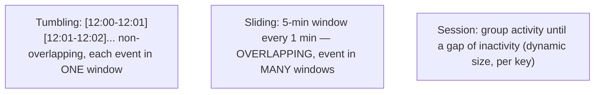
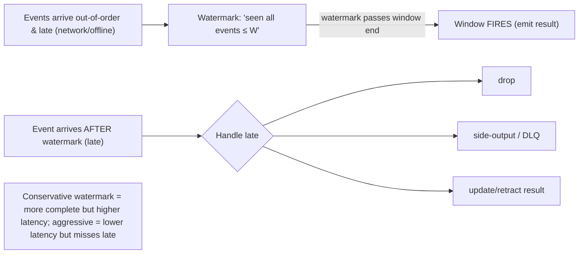

# Lesson 9.6 — Stream Processing: Windowing, Watermarks, Stateful Operators

> Part 9: Messaging & Streaming · Difficulty: 🔴
>
> **Prerequisites:** [9.3 Distributed Log], [9.5 Ordering/Keys/Idempotency], [9.4 Delivery Guarantees], [8.1.2 Clocks].
> **Unlocks:** [9.7 Batch/Stream Unification], [9.8 CDC], [Part 16 Metrics], [Part 18 Streaming Case Studies].

---

## 1. Learning Objectives

After this lesson you will be able to:

- Define **stream processing** (continuous computation over unbounded data) and contrast it with request/response and batch (9.7).
- Distinguish **stateless** vs **stateful** operators and explain how streaming systems manage **local state** (keyed state, state stores, checkpointing) for fault tolerance and exactly-once (9.4).
- Explain **windowing** (tumbling, sliding, session) — turning an unbounded stream into bounded chunks for aggregation — and the critical distinction between **event time** and **processing time**.
- Explain **watermarks** — how a system reasons about completeness/late data in event-time processing — and the **completeness vs latency** tradeoff (and how late data is handled).

---

## 2. Motivation — Computing continuously over data that never ends

Request/response (RPC) computes on demand; batch jobs compute over a **finite, bounded** dataset (yesterday's logs). **Stream processing** computes **continuously over an unbounded, never-ending stream** of events as they arrive — powering real-time analytics, monitoring/alerting, fraud detection, recommendations, ETL, and materialized views (5.1.2). Built on the distributed log (9.3) — the durable, ordered, replayable source of events — stream processing is how you turn "data in motion" into **continuously-updated results** instead of waiting for a nightly batch.

The challenge is that **unbounded data breaks the assumptions of batch computation.** You can't "count all the events" — there's no end. So you carve the stream into **windows** (chunks by time or count) to compute bounded aggregations ("clicks per minute"). But the moment you process by time, you collide with two of distributed systems' hardest realities: **events arrive out of order and late** (network delays, partitions, mobile devices offline — 8.1.1), and **clocks are untrustworthy** (8.1.2). This forces the pivotal distinction between **event time** (when the event actually happened) and **processing time** (when your system saw it), and the mechanism — **watermarks** — that lets a system decide "I've probably seen all events up to time T, so I can emit this window's result" while trading **completeness against latency**. Add **stateful operators** (running counts, joins, aggregations that remember the past) — which need **local state** that must survive failures (checkpointing) and integrate with exactly-once (9.4) — and you have the core of stream processing. This lesson develops windowing, event-vs-processing time, watermarks, and stateful operators; 9.7 then unifies batch and stream.

---

## 3. Theory — From first principles

### 3.1 What stream processing is

**Stream processing** is **continuous computation over an unbounded stream of events** `[CS]`: a processing job (a topology of **operators**) consumes events from a stream (the log — 9.3), transforms/aggregates/joins them, and emits results **continuously** (to another stream, a database, a dashboard). Unlike batch (finite input, run-to-completion — 9.7), a stream job **runs forever**, processing each event as it arrives (or in micro-batches).
- **Operators:** the building blocks — `map`, `filter`, `flatMap` (stateless), and `aggregate`, `join`, `window`, `count` (stateful — §3.2).
- **Examples:** count events per minute, detect 5 failed logins in 10s (fraud), maintain a real-time leaderboard, join a click stream with a user-profile stream, build a materialized view (5.1.2).
- **Built on the log** (9.3): the durable, ordered, replayable stream is the input; replay (9.2) enables reprocessing and recovery.

### 3.2 Stateless vs stateful operators (and managing state)

`[CS]`
- **Stateless operators** (`map`, `filter`): each event processed **independently** — no memory of past events. Trivially parallel and fault-tolerant (just reprocess).
- **Stateful operators** (`count`, `sum`, `window aggregate`, `join`, deduplication): the result **depends on past events** → the operator maintains **state** (a running count, a window's accumulating data, a join buffer). State is **keyed** (per `user_id`, per partition — 9.5): each key has its own state, processed by the operator instance owning that key's partition.
- **Managing state:** stateful operators keep **local state** (in-memory + a **local state store**, often backed by a **compacted changelog topic** — 9.3 — for durability). This is the **legitimately stateful** system from 7.2: state is **partitioned by key** (each operator instance owns a key range), **checkpointed** for recovery, and **sticky-by-key** (the same key always goes to the same instance — via the partition key, 9.5).
- **Fault tolerance via checkpointing:** the system periodically **checkpoints** operator state (and input offsets) durably; on failure, it **restores** state from the last checkpoint and **replays** the input from the corresponding offset (9.2/9.3) → resumes correctly. Combined with transactional output (9.4 EOS), this gives **exactly-once stateful processing** *within the system* — the state, offsets, and outputs commit together. (External side effects still need idempotency — 9.4 §3.6.)

### 3.3 Windowing — making the unbounded bounded

`[CS]` You can't aggregate an infinite stream all at once, so you compute over **windows** — bounded slices of the stream:
- **Tumbling windows:** fixed-size, **non-overlapping**, contiguous (e.g., every 1-minute bucket: 12:00–12:01, 12:01–12:02). Each event in exactly one window. Use for periodic aggregates ("requests per minute").
- **Sliding (hopping) windows:** fixed-size but **overlapping**, advancing by a smaller step (e.g., a 5-minute window every 1 minute). Each event in multiple windows. Use for smoothed/rolling metrics ("avg over the last 5 min, updated each minute").
- **Session windows:** **dynamic**, defined by **activity + a gap of inactivity** (e.g., group a user's events until they're idle for 30 min → one "session"). Window size varies per key. Use for user sessions, activity bursts.
- **Count/global windows:** by number of events, or a single unbounded window with custom triggers.
Windowing turns "compute over everything" into "compute over this bounded chunk, then emit" — the fundamental move that makes stream aggregation possible.

### 3.4 Event time vs processing time — the central distinction

`[CS]` When you window "by time," **which time?**
- **Event time:** when the event **actually happened** (a timestamp **in the event**, set at the source — e.g., when the user clicked). What you usually **want** (results reflect reality regardless of processing delays).
- **Processing time:** when your **system processed** the event (the wall clock at the operator). Simple and low-latency, but **wrong** if events are delayed/out-of-order (a click from 12:00:59 processed at 12:01:30 lands in the wrong minute → wrong "clicks per minute").
- **The problem:** events arrive **out of order and late** (network delays, partitions, offline mobile devices that sync hours later — 8.1.1), and clocks are untrustworthy (8.1.2). With **processing-time** windows, a delayed event is **mis-bucketed**; with **event-time** windows, it's bucketed **correctly** — but now the system faces a hard question: **"have I seen all the events for the 12:00–12:01 window yet, or are more still coming late?"** You can't wait forever (the window must eventually emit), but emitting too early misses late events. **Watermarks** answer this (§3.5).
**Rule** `[BP]`: use **event time** for correctness (results reflect when things happened); accept the complexity of late data + watermarks. Use processing time only when approximate/low-latency and you don't care about late events.

### 3.5 Watermarks — reasoning about completeness and late data

`[CS]` A **watermark** is the system's estimate of **"event-time progress"** — a marker asserting **"I believe I have seen all events with event-time ≤ W"** (so windows ending at/before W can be considered complete and emitted). Watermarks let an event-time system decide **when a window is "done"**:
- The system advances the watermark based on observed event times (often "max event time seen − an allowed lateness bound"). When the watermark passes a window's end, the window **fires** (emits its result).
- **The completeness vs latency tradeoff:** a **conservative** watermark (wait longer, larger lateness allowance) captures **more late events** (more **complete/correct** results) but **delays** emitting (higher **latency**); an **aggressive** watermark emits **sooner** (low latency) but may **miss late events** (less complete). You tune this per use case (real-time dashboard tolerates some incompleteness for low latency; billing wants completeness).
- **Late data (after the watermark):** events arriving **after** their window has fired are **"late."** Strategies: **drop** them (simplest, lossy), **side-output**/dead-letter them for separate handling, or **update the result** (re-emit the window with a correction — requires downstream that can handle updates/retractions). 
- **Allowed lateness:** systems often keep a window's state for a grace period **after** the watermark to still incorporate slightly-late events (then finalize). 
Watermarks are the heart of correct, bounded-latency **event-time** stream processing — the principled answer to "out-of-order, late, unbounded data with bad clocks."

### 3.6 Joins and time in streaming

`[CS]` **Stream joins** combine two streams (or a stream and a table) — and time makes them subtle:
- **Stream-stream joins** are **windowed** — you can't join an unbounded stream to another unbounded stream (infinite state); you join events **within a time window** (e.g., "match a click to an impression within 10 minutes"). State for the window is buffered and expired.
- **Stream-table joins** (a.k.a. enrichment): join a stream against a **changing table/state** (e.g., enrich click events with the latest user profile) — the table is often a **compacted changelog** (9.3) materialized as keyed state (§3.2).
- Joins are **stateful** (buffer one side to match the other) → checkpointed, keyed, windowed to bound state.

### 3.7 Delivery semantics + state (exactly-once stateful processing)

`[CS]` Tying to 9.4: stateful streaming wants **exactly-once effects** despite at-least-once delivery and failures. Achieved by **atomically committing**: **input offsets + operator state + outputs** together (transactional EOS — 9.4 §3.5), so a failure-and-recovery replays from the checkpoint with no double-counting and no loss **within the system**. This is why stateful operators integrate **checkpointing + transactional output + offset commits** — the same exactly-once-effects pattern (9.4), now covering **state**. (External sinks/side effects still need idempotency — 9.4 §3.6.) Without this, a crash mid-window double-counts or loses aggregates.

### 3.8 Architecture and scaling

`[BP]` Stream processors (Flink, Kafka Streams, Spark Structured Streaming — *representative*) run as **distributed, parallel topologies**:
- Parallelism follows **partitions** (9.3) — each operator instance processes a subset of partitions/keys; **keyed state is partitioned** accordingly (state co-located with the keys it owns — 9.5).
- **Scaling** = more parallelism (more partitions/instances), with **state redistribution** on rescale (like rebalancing — 9.3/7.4) — a heavier operation for stateful jobs (state must move).
- **Backpressure** (9.9, 3.3.4): if a downstream operator is slow, the system propagates backpressure upstream (slows the source) to avoid unbounded buffering.
- **Two execution models:** **true streaming** (process each event as it arrives — lowest latency, e.g., Flink) vs **micro-batching** (process small batches every few seconds — higher throughput, slightly higher latency, e.g., Spark Structured Streaming). A latency/throughput tradeoff.

---

## 4. Visual Intuition

### Window types

### Event time, watermarks, late data

---

## 5. Real-World Analogy

Imagine running a **live tally of votes coming in by mail** during an election night — votes never stop arriving (unbounded stream).

- **Windowing:** you can't "count all votes" (more keep coming), so you tally **per hour** (tumbling window: 8–9pm, 9–10pm) — bounded chunks you can announce.
- **Event time vs processing time:** each ballot has the **time it was cast** (event time) and the **time it reached your desk** (processing time). A ballot **cast at 8:55** might **arrive at 9:30** (mail delay). If you bucket by **arrival** (processing time), you'd wrongly count it in the 9–10pm tally; if you bucket by **when it was cast** (event time), it correctly belongs to 8–9pm — but now you have a problem: **at 9:00, can you announce the 8–9pm total, or are late-arriving 8–9pm ballots still in transit?**
- **Watermark:** you make a judgment call — "based on how mail usually flows, by 9:15 I've **probably received essentially all** ballots cast before 9:00" — that's your **watermark**. When it passes, you **announce the 8–9pm result.** Wait **longer** (conservative) → more late ballots counted (**more complete**) but you announce **later**; announce **sooner** (aggressive) → **faster** but you might miss stragglers.
- **Late data:** a ballot cast at 8:55 that arrives at 10pm (after you announced) is **late** — you either **ignore it** (drop), **set it aside for a recount pile** (side-output), or **issue a correction** to the 8–9pm total (update/retract).
- **Stateful operator + checkpointing:** your **running tally** is *state* — if you faint (crash) mid-count, you don't want to recount from zero or double-count, so you **periodically write down the tally and which ballots you've counted** (checkpoint + offsets) so a helper can **resume exactly where you left off** (exactly-once stateful processing).

---

## 6. Industry Example

- **Flink / Kafka Streams / Spark Structured Streaming** `[CONV]`: the leading stream processors — event-time windowing, watermarks, keyed state, checkpointing, exactly-once (Flink/true-streaming vs Spark/micro-batch) (§3.8). *(Representative.)*
- **Event-time + watermarks (Google Dataflow model)** `[EMERGING]`: the Dataflow/Beam model formalized event time, windowing, watermarks, and triggers — hugely influential (§3.4/3.5). *(Representative.)*
- **Real-time analytics/monitoring** `[CONV]`: windowed aggregations for metrics (requests/min, p99 — Part 16), fraud detection (N events in a window), leaderboards — stateful windowed operators (§3.3). *(Representative.)*
- **Stream-table enrichment via compacted changelog** `[CONV]`: joining an event stream with a materialized table from a compacted topic (CDC — 9.8) to enrich events (§3.6, 9.3). *(Representative.)*
- **Exactly-once stateful processing** `[EMERGING]`: Flink/Kafka-Streams checkpoint state + offsets + transactional output atomically for exactly-once *within the system* (§3.7, 9.4). *(Representative.)*

---

## 7. Implementation Details — building stream jobs

- **Use event time + watermarks for correctness**; tune the watermark/allowed-lateness for your **completeness vs latency** budget; decide a **late-data policy** (drop / side-output / update) (§3.4/3.5) `[BP]`.
- **Choose the right window** — tumbling (periodic aggregates), sliding (rolling/smoothed), session (activity-based) — by the question you're answering (§3.3).
- **Key state correctly** (by the entity — 9.5) so keyed state is partitioned and co-located; ensure even spread (avoid hot keys/partitions — 7.4) (§3.2/3.8).
- **Checkpoint state + offsets** for fault tolerance; use **transactional EOS** (state + offsets + outputs atomic) for exactly-once *within the system*; add **idempotency** at external sinks (§3.2/3.7, 9.4).
- **Bound stateful joins with windows** (don't join unbounded↔unbounded); use **stream-table joins** for enrichment against a compacted changelog (§3.6, 9.3).
- **Plan for backpressure and rescaling** — propagate backpressure to the source (9.9/3.3.4); know that **stateful rescale moves state** (heavier than stateless — §3.8, 9.3/7.4).
- **Pick the execution model** — true streaming (low latency) vs micro-batch (high throughput) — per latency/throughput needs (§3.8).
- **Make outputs idempotent/upsert** for downstream sinks (materialized views) so reprocessing/replay is safe (9.5, 5.1.2).

---

## 8. Advantages

- **Real-time results** — continuous, low-latency computation vs waiting for nightly batch (§3.1, 9.7).
- **Event-time correctness** — windowing + watermarks produce correct results despite out-of-order/late data (§3.4/3.5).
- **Stateful aggregation/joins** — running counts, sessions, enrichment, materialized views (§3.2/3.6, 5.1.2).
- **Fault-tolerant + exactly-once (in-system)** — checkpointing + transactional EOS (§3.7, 9.4).
- **Scalable** — parallelism via partitions/keyed state (§3.8, 9.3).
- **Replayable** — built on the log; reprocess by replaying (9.2/9.3).

---

## 9. Disadvantages / limitations

- **Complexity** — event time, watermarks, late data, state management, checkpointing are genuinely hard (§3.4–3.7).
- **Completeness vs latency tradeoff** — watermarks force this choice; late data is never fully solvable (§3.5).
- **Stateful operations are heavy** — state storage, checkpointing, and especially **rescaling** (state movement) (§3.2/3.8).
- **Clock/ordering pitfalls** — event-time depends on source timestamps (skew — 8.1.2); ordering is per-partition (9.5).
- **Exactly-once is bounded** — in-system only; external sinks need idempotency (§3.7, 9.4).
- **Operational weight** — distributed processors to run, tune, monitor (backpressure, lag, checkpoint health — Part 14/16).

---

## 10. When NOT to / limits

- **Batch suffices** — if results are needed periodically over bounded data (nightly reports), batch is simpler (9.7).
- **Request/response fits** — if you need an answer to a specific query on demand, not continuous computation, use a DB/RPC (§3.1).
- **Processing time is fine** — if approximate, low-latency results without late-data correctness are acceptable, skip event-time/watermark complexity (§3.4).
- **Tiny/low-value streams** — the operational complexity of a stream processor may not be justified (1.1.5).
- **Don't join unbounded↔unbounded without windows** — infinite state (§3.6).

---

## 11. Common Mistakes

1. **Using processing time when you need event-time correctness** → late/out-of-order events mis-bucketed → wrong aggregates (§3.4).
2. **Watermark too aggressive** → late events dropped, results incomplete; **too conservative** → high latency (§3.5).
3. **No late-data policy** → late events silently dropped (or crash) (§3.5).
4. **Unbounded stateful joins / unbounded state** → memory blowup (window/bound state) (§3.6).
5. **No checkpointing / wrong offset-state coupling** → double-count or loss on failure (§3.2/3.7).
6. **Hot keys in keyed state** → one operator instance overloaded (§3.2/3.8, 7.4).
7. **Assuming exactly-once covers external sinks** → duplicate external effects (§3.7, 9.4).
8. **Ignoring backpressure** → unbounded buffering / OOM when downstream is slow (§3.8, 9.9).

---

## 12. Interview Questions

**🟢 Easy**
- What is stream processing, and how does it differ from batch?
- What is windowing, and name three window types.

**🟡 Medium**
- Explain event time vs processing time. Why does event time matter, and what problem does it create?
- What is a watermark, and what tradeoff does it embody?

**🔴 Hard**
- How do stateful operators manage state and stay fault-tolerant (keyed state, checkpointing)? How does that integrate with exactly-once?
- Design a windowed aggregation (e.g., requests/minute) over an out-of-order, late-arriving event stream. Specify window type, event time, watermark, and late-data handling.

**⚫ Staff+**
- Design a real-time fraud-detection pipeline (e.g., "5+ failed logins per account in 60s"): event-time windowing, watermarks, keyed state, exactly-once, hot-key handling, and how late/out-of-order events affect correctness. Discuss the completeness-vs-latency tradeoff for alerting.
- Compare true-streaming (Flink) vs micro-batch (Spark Structured Streaming) for a stateful, exactly-once, event-time pipeline. Discuss latency/throughput, state/checkpointing, watermarks, and rescaling — and when you'd choose each.

---

## 13. Production Pitfalls

- **Wrong-bucket aggregates:** processing-time windows mis-bucket delayed events → "requests per minute" is wrong during spikes/delays (§3.4).
- **Dropped late data:** aggressive watermark / no late-data policy silently discards late events → undercounts (§3.5).
- **Latency from over-conservative watermark:** results emitted too late for real-time needs (§3.5).
- **State/checkpoint failure → double-count or loss:** offsets and state not committed atomically → on recovery, aggregates wrong (§3.2/3.7).
- **Hot-key operator overload:** a skewed key (whale/celebrity) overloads one stateful instance while others idle (§3.2/3.8, 7.4).
- **Unbounded state OOM:** an unwindowed stateful join or unbounded session state grows until the job crashes (§3.6).
- **Backpressure ignored → OOM/lag:** slow sink, no backpressure → unbounded buffering or runaway consumer lag (§3.8, 9.9).
- **Duplicate external effects:** "exactly-once" job writes to an external system non-idempotently on replay (§3.7, 9.4).

---

## 14. Optimization Techniques

- **Event time + tuned watermark + late-data policy** for correct, bounded-latency results (§3.4/3.5) `[BP]`.
- **Right window type** for the question (tumbling/sliding/session) (§3.3).
- **Keyed state partitioned + checkpointed**, even key spread (avoid hot keys) (§3.2/3.8, 7.4).
- **Transactional EOS (state+offsets+outputs)** for in-system exactly-once; **idempotent/upsert sinks** for external (§3.7, 9.4/9.5).
- **Windowed/bounded joins** + stream-table enrichment via compacted changelog (§3.6, 9.3).
- **Backpressure to the source + monitor lag/checkpoint health** (§3.8, 9.9, 3.3.4, Part 16).
- **Choose true-streaming vs micro-batch** by latency/throughput needs (§3.8).
- **Idempotent, replayable outputs** so reprocessing (bug fixes, backfills via replay — 9.2) is safe (9.5, 5.1.2).

---

## 15. Summary

**Stream processing** is **continuous computation over an unbounded stream** of events (built on the distributed log — 9.3), powering real-time analytics, monitoring, fraud detection, enrichment, and materialized views — versus batch's finite, run-to-completion model (9.7). **Operators** are **stateless** (`map`/`filter` — each event independent) or **stateful** (`count`/`aggregate`/`join`/`window` — depend on past events), and stateful operators keep **keyed local state** (partitioned by key — 9.5, co-located, sticky-by-key — the legitimately-stateful pattern of 7.2) made fault-tolerant by **checkpointing** state + input offsets and, with **transactional output** (9.4 EOS), achieving **exactly-once stateful processing *within the system*** (external sinks still need idempotency — 9.4/9.5). Because you can't aggregate infinity, you use **windows** — **tumbling** (fixed non-overlapping), **sliding** (fixed overlapping), **session** (activity + inactivity gap) — to compute bounded results. Windowing by time forces the pivotal **event time** (when the event happened — a source timestamp; what you usually want for correctness) vs **processing time** (when the system saw it — simple but wrong for delayed events) distinction, colliding with distributed reality: events arrive **out of order and late** (8.1.1) and clocks are untrustworthy (8.1.2). **Watermarks** resolve this — a watermark asserts "**I've seen all events with event-time ≤ W**," letting a window **fire** when the watermark passes its end, and embodying the **completeness vs latency tradeoff** (conservative = more complete, higher latency; aggressive = lower latency, more missed late events). **Late data** (arriving after the watermark) is **dropped**, **side-output**, or used to **update/retract** results (with allowed-lateness grace). **Joins** are **windowed/bounded** (stream-stream) or **enrichment against a changing table** (stream-table via compacted changelog — 9.3). Systems scale via **partition-aligned parallelism + keyed state** (with heavier **stateful rescaling** — state movement, 9.3/7.4) and use **backpressure** (9.9/3.3.4) to avoid unbounded buffering, in either **true-streaming** (low latency, Flink) or **micro-batch** (high throughput, Spark) models. The discipline: **event time for correctness, watermarks for completeness-vs-latency, keyed checkpointed state for fault-tolerant exactly-once, bounded windows for state, idempotent/upsert outputs for safe replay** — turning the replayable log into continuously-correct real-time results.

---

## 16. Revision Notes (flashcard-ready)

- **Q:** Stream processing vs batch? **A:** Continuous computation over unbounded data (runs forever) vs run-to-completion over finite data.
- **Q:** Stateless vs stateful operators? **A:** Stateless (map/filter, independent) vs stateful (count/aggregate/join/window, depend on past → keyed local state).
- **Q:** How is stateful processing fault-tolerant? **A:** Checkpoint keyed state + input offsets; restore + replay on failure; transactional EOS for exactly-once in-system.
- **Q:** Window types? **A:** Tumbling (fixed non-overlapping), sliding (fixed overlapping), session (activity + inactivity gap).
- **Q:** Event time vs processing time? **A:** When it happened (source timestamp; correct) vs when system processed it (simple but mis-buckets late/out-of-order).
- **Q:** Watermark? **A:** Marker asserting "seen all events ≤ W" → fire windows ≤ W; embodies completeness vs latency tradeoff.
- **Q:** Watermark tradeoff? **A:** Conservative = more complete, higher latency; aggressive = lower latency, misses late events.
- **Q:** Late data handling? **A:** Drop, side-output/DLQ, or update/retract result (with allowed-lateness grace).
- **Q:** Stream joins? **A:** Windowed (stream-stream, bounded state) or stream-table enrichment (against compacted changelog).
- **Q:** Exactly-once stateful — scope? **A:** In-system (state+offsets+outputs atomic); external sinks still need idempotency.
- **Q:** True-streaming vs micro-batch? **A:** Flink (per-event, low latency) vs Spark (small batches, high throughput).

---

## 17. Further Reading + Knowledge-Graph Links

**Within this platform**
- **Builds on:** [9.3 Distributed Log] (source, partitions, compacted state), [9.5 Ordering/Keys/Idempotency] (keyed state, exactly-once effects), [9.4 Delivery Guarantees] (EOS), [8.1.2 Clocks] (event vs processing time).
- **Next:** [9.7 Batch/Stream Unification] (Lambda/Kappa). **Then:** [9.8 CDC] (change streams as input), [Part 16 Metrics] (windowed aggregation), [Part 18 Streaming case studies].
- **Enables:** [5.1.2 Materialized Views], [Part 20 Capstone] (market-data streaming).

**Foundational texts (synthesized)**
- Akidau et al., "The Dataflow Model" / *Streaming Systems* — event time, windowing, watermarks, triggers (concept, synthesized).
- Kleppmann, *Designing Data-Intensive Applications* — stream processing, windows, state, exactly-once (synthesized).
- Flink / Kafka Streams / Spark Structured Streaming documentation (representative).

**Concept tags:** `[CS]` stream processing, stateless/stateful operators, keyed state + checkpointing, windowing, event vs processing time, watermarks · `[CONV]` Flink/Kafka Streams/Spark, tumbling/sliding/session windows, stream-table joins · `[BP]` event time + tuned watermark + late-data policy, keyed checkpointed state, transactional EOS + idempotent sinks, bounded joins, backpressure · `[EMERGING]` Dataflow model, exactly-once stateful processing.
