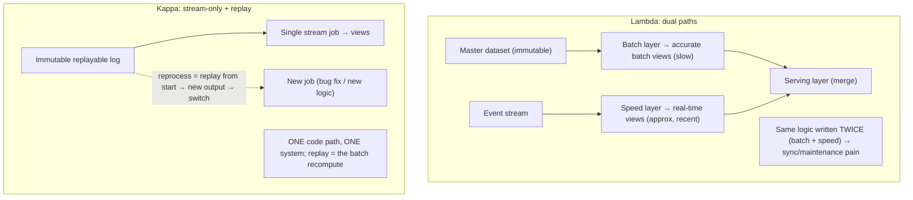
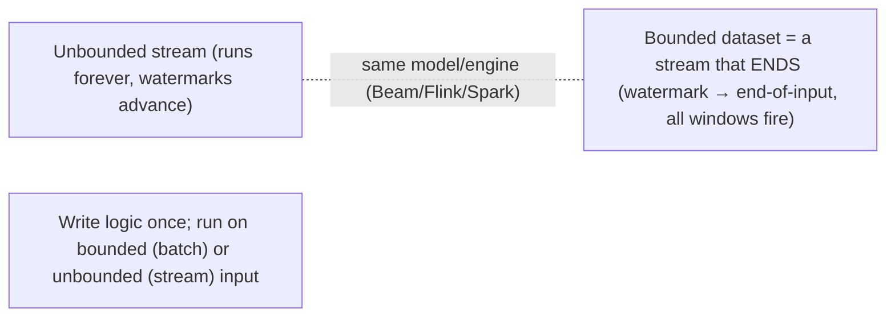

# Lesson 9.7 — Batch Processing and the Batch/Stream Unification (Lambda/Kappa)

> Part 9: Messaging & Streaming · Difficulty: 🔴
>
> **Prerequisites:** [9.6 Stream Processing], [9.2 Brokers vs Logs], [9.3 Distributed Log], [4.3.x Encoding], [5.1.2 Derived Data].
> **Unlocks:** [9.8 CDC], [Part 16 Analytics], [Part 18 Case Studies], [Part 20 Capstone].

---

## 1. Learning Objectives

After this lesson you will be able to:

- Define **batch processing** (compute over a bounded dataset, run-to-completion) and contrast it with **stream processing** (9.6) on latency, completeness, reprocessing, and use cases.
- Explain **MapReduce-style** batch (and its lineage to Spark) and why batch is simpler, exact, and reprocessable but high-latency.
- Describe the **Lambda architecture** (parallel batch "accuracy" layer + speed "low-latency" layer, merged at query time) and its problems (dual code paths, complexity).
- Describe the **Kappa architecture** (stream-only, reprocess by replaying the log) and the broader **batch/stream unification** (batch as a bounded special case of streaming), and choose appropriately.

---

## 2. Motivation — Two ways to process data, and the quest to unify them

Historically there were two distinct worlds for large-scale data processing. **Batch processing** runs a job over a **finite, bounded** dataset (yesterday's logs, the full user table) **to completion** and produces a result — the world of MapReduce, Hadoop, Spark, data warehouses, nightly ETL. It's **simple, exact, and easily reprocessed** (just re-run over the same input), but **high-latency** (results are hours/a day old). **Stream processing** (9.6) computes **continuously over unbounded data** as it arrives — **low-latency** (seconds), but **harder** (windows, watermarks, late data, state). For years, organizations ran **both**: batch for accurate historical analytics, streaming for real-time views — leading to the painful question of **how to combine them** without maintaining two completely separate systems and two copies of the same business logic.

The architectural answers — **Lambda** and **Kappa** — and the deeper insight of **batch/stream unification** are this lesson's subject, and they matter because they shape how modern data platforms are built (Part 18, Part 20). **Lambda** runs batch and stream **in parallel** (a slow-but-accurate "batch layer" and a fast-but-approximate "speed layer"), merging results at query time — robust but cursed with **dual code paths** (the same logic implemented twice, in two systems, kept in sync). **Kappa** rejects the duality: since the **log is replayable** (9.2/9.3), treat **everything as a stream**, and "reprocess" by **replaying the log** through a new stream job — **one code path, one system**. Underlying both is the unifying realization (Dataflow/9.6) that **batch is just streaming over a bounded input** — the same windowing/event-time model handles both. Understanding batch's strengths, Lambda's tradeoffs, and Kappa's elegance lets you design data architectures that are accurate, timely, and maintainable. This lesson develops batch, Lambda, Kappa, and the unification.

---

## 3. Theory — From first principles

### 3.1 Batch processing — bounded, run-to-completion

`[CS]` **Batch processing** computes over a **finite, bounded dataset** and **runs to completion**, producing an output, then stops:
- Input is **known and complete** (yesterday's logs, a snapshot of a table) → no "late data" problem (the input doesn't change during the run) → **simpler and exact**.
- Classic model: **MapReduce** — **map** (transform each record in parallel across many machines) → **shuffle** (group by key) → **reduce** (aggregate per key) — over a distributed filesystem (HDFS/object storage — 4.1.3). Massively parallel, fault-tolerant (re-run failed tasks). **Spark** generalized this (in-memory DAGs of transformations, far faster than disk-based MapReduce).
- **Strengths:** **simple** (bounded input, no watermarks/late data), **exact/complete** (sees all input), **easily reprocessed** (re-run over the same input — deterministic), high **throughput** (optimized for bulk).
- **Weakness:** **high latency** — results reflect data **up to the last batch run** (hours/a day old); not real-time.
- **Uses:** large-scale analytics, ETL/data warehousing (OLAP — 5.4.1), ML training, reports, periodic recomputation of derived data (5.1.2).

### 3.2 Batch vs stream — the comparison

`[CS]`
| | Batch | Stream (9.6) |
|---|---|---|
| Input | bounded, finite, complete | unbounded, continuous |
| Execution | run-to-completion, stops | runs forever |
| Latency | high (hours/day) | low (seconds) |
| Completeness | exact (all input) | watermark-bounded (late data) |
| Complexity | simpler (no late data) | harder (windows, watermarks, state) |
| Reprocessing | re-run over same input | replay the log (9.2/9.3) |
| Use cases | analytics/ETL/ML/reports | real-time analytics/monitoring/alerts |

Both produce **derived data** (5.1.2) from source data — they differ in **when and over what** they compute. The unification insight (§3.6): **these aren't fundamentally different — batch is streaming over a bounded input.**

### 3.3 The dual-system problem

`[CS]` Running batch **and** stream historically meant **two separate systems with two implementations of the same logic**:
- The **batch system** (Spark/Hadoop) computes accurate results over the full history (e.g., total revenue per region, correct but a day old).
- The **stream system** (Flink/Kafka Streams — 9.6) computes the same metric in real time (approximate, low-latency).
- **The problem:** the **same business logic is written twice** (batch code + stream code), in **two frameworks**, and must be **kept in sync** — a maintenance nightmare (divergent results from divergent code, double the bugs, double the work). This is the core pain that Lambda manages (poorly) and Kappa eliminates.

### 3.4 Lambda architecture

`[CONV]` **Lambda** addresses real-time-plus-accurate by running **both layers in parallel** and merging:
- **Batch layer:** periodically recomputes accurate "**batch views**" over the **full master dataset** (immutable, append-only history) — high-latency but **exact** and **reprocessable** (re-run to fix bugs).
- **Speed (streaming) layer:** computes **real-time views** over **recent data only** (since the last batch run) — low-latency but **approximate** (and discarded once batch catches up).
- **Serving layer:** at query time, **merges** the batch view (accurate history) with the speed view (recent real-time) → an answer that's both **complete** and **up-to-date**.
- **Strengths:** robust (batch layer is the source of truth and self-correcting via recomputation), combines accuracy + low latency.
- **Problems** `[OPINION]`: the **dual code-path** problem (§3.3) in full force — logic implemented **twice** (batch + speed), kept in sync; **operational complexity** (two systems + a serving merge); **debugging across both**. Lambda was influential but its dual-path cost drove the search for something simpler — Kappa (§3.5).

### 3.5 Kappa architecture

`[EMERGING]` **Kappa** eliminates the duality: **everything is a stream; there is no separate batch layer.**
- Keep an **immutable, replayable log** of all events (9.2/9.3) with **long retention** (or a compacted/archived full history).
- A **single stream-processing job** (9.6) computes the views in real time — **one code path, one system**.
- **"Reprocessing" = replay:** to fix a bug or change the logic, **spin up a new instance of the stream job, replay the log from the beginning** (9.2 replay), compute the corrected view into a **new output**, then **switch** consumers to it. No separate batch system — the **replay of the stream *is* the batch recompute.**
- **Strengths:** **one code path** (no dual-logic sync), **one system** to operate, simpler. Made practical by the log's **replayability** (the whole reason logs beat delete-on-consume brokers — 9.2).
- **Requirements/limits:** needs **sufficient retention** (or archived history) to replay from far enough back (storage cost — 9.2/9.3); reprocessing a huge history through a stream job can be slower/costlier than an optimized bulk batch job for some workloads; and it leans on **idempotent/replayable outputs** (9.5). For many use cases, Kappa's simplicity wins; for some heavy historical/ML batch workloads, dedicated batch is still better (§3.7).

### 3.6 Batch/stream unification (the deeper insight)

`[CS]`/`[EMERGING]` The conceptual resolution (the Dataflow/Beam model — 9.6): **batch is a special case of streaming over a bounded input.**
- A **bounded** dataset is just an **unbounded stream that ends** — the same **event-time + windowing + watermark** model (9.6) handles both: for batch, the watermark simply advances to "end of input" and all windows fire.
- So a **single programming model and engine** can express **both** batch and streaming, choosing execution mode by input boundedness. **Apache Beam** (the unified model), **Flink** (runs both batch and streaming on one engine), and **Spark** (batch + Structured Streaming with shared APIs) embody this — **write the logic once, run it on bounded (batch) or unbounded (stream) data.** This is the principled end of the dual-system problem: not "run two systems" (Lambda) or even "force everything through streaming" (Kappa as originally framed), but **one model where batch and stream are the same computation over different input boundedness.**

### 3.7 Choosing — batch, Lambda, Kappa, or unified

`[BP]`
- **Pure batch:** when you only need **periodic, accurate results over bounded data** (nightly reports, ML training, OLAP/warehouse — 5.4.1) and don't need real-time. Simplest; still widely correct.
- **Pure streaming (9.6):** when you need **real-time** results and can tolerate watermark-bounded completeness; with **replay** (Kappa-style), it also handles reprocessing.
- **Kappa (stream-only + replay):** when you want **real-time + reprocessing with one code path/system** — the modern default for many event-driven platforms (leans on a replayable log — 9.2/9.3).
- **Lambda:** when you need **both real-time and exact historical accuracy** and have a reason the streaming/Kappa path can't fully deliver accuracy — accept the dual-path cost. Increasingly **avoided** in favor of unified engines.
- **Unified model (Beam/Flink/Spark):** **write once, run batch or stream** — the best of both where the tooling fits; reduces the dual-path problem to one codebase with two execution modes.
**Trend** `[OPINION]`: toward **Kappa / unified** (one code path) and away from **Lambda** (dual paths), enabled by replayable logs and unified engines — though **dedicated batch** remains right for heavy historical/ML/OLAP work.

### 3.8 Immutability and reprocessing as the unifying principle

`[CS]` The deep enabler across all of this is **immutable, append-only data + reprocessing**:
- An **immutable log/master dataset** (events never mutated, only appended — 9.2/9.3) means you can **always recompute** derived views from the source (5.1.2) — fix a bug, change the logic, add a new view — by **reprocessing** (batch re-run or stream replay). 
- This makes **derived data disposable and rebuildable** (a view is "just a function of the log"), which is the foundation of **event sourcing** (the log of events is the source of truth; state is a replayable projection — Part 20), CDC-fed materialized views (9.8/5.1.2), and Kappa.
- **Reprocessing** (re-run/replay) is the unifying operation: batch and stream both **derive views from immutable input**, and both can **rebuild** by reprocessing. This is why the log-centric, immutable-event view of data (9.2) is so powerful — it turns "accurate historical recompute" and "real-time view" into **the same recompute over the same immutable input**, just bounded vs unbounded.

---

## 4. Visual Intuition

### Lambda vs Kappa

### Batch = bounded streaming

---

## 5. Real-World Analogy

Imagine producing both a **definitive annual report** and a **live dashboard** for a business.

- **Batch** is the **annual (or nightly) report**: you wait until you have **all** the data for the period, then crunch it **completely and accurately** in one big run, and publish. It's **exact** and you can always **re-run it** if you find a mistake — but it's **out of date** the moment it's published (it only reflects up to the cutoff).
- **Stream** is the **live dashboard**: it updates **continuously as data arrives** (real-time), but it has to **guess when a time-bucket is "done"** (watermarks) and may **miss late-arriving data** — fast but approximate.
- **Lambda** is **running two completely separate teams**: one team produces the accurate annual report (batch layer), another runs the live dashboard (speed layer), and at the end you **stitch them together** ("use the report for everything up to last night, and the live dashboard for today"). It works, but you're **maintaining the same calculations twice, in two teams, with two sets of spreadsheets** that must agree — endless reconciliation pain.
- **Kappa** is keeping a **complete, permanent journal of every transaction** (the replayable log) and running **one team** that updates the live view. When you discover the calculation was wrong, you don't spin up a separate batch team — you just **hand the same team the journal from page one and have them re-derive everything** into a fresh view, then switch over (replay = recompute). **One team, one method, one source of truth.**
- **The unification:** you realize the "annual report" is just "the live dashboard's calculation run over a **finite slice that has ended**" — the same method, just told "the data stops here." So you keep **one calculation method** and point it at either the **ongoing stream** or a **bounded historical chunk** — no need for two teams at all (Beam/Flink/Spark unified).
- **The enabler:** because the **journal is immutable and complete** (you never erase entries, only append), you can **always recompute any view from it** — which is what makes "fix it by replaying" and "report = bounded replay" both possible.

---

## 6. Industry Example

- **MapReduce/Hadoop → Spark** `[CONV]`: the batch lineage — MapReduce (map/shuffle/reduce over HDFS) generalized by Spark (in-memory DAGs) for analytics/ETL/ML (§3.1). *(Representative.)*
- **Lambda architecture** `[CONV]`: popularized (Nathan Marz) for combining accurate batch + real-time speed layers with a serving merge — influential but dual-path heavy (§3.4). *(Representative.)*
- **Kappa architecture** `[EMERGING]`: proposed (Jay Kreps) as stream-only + replay, leveraging Kafka's replayable log to drop the batch layer — one code path (§3.5, 9.2). *(Representative.)*
- **Unified engines (Beam/Flink/Spark)** `[EMERGING]`: Apache Beam's unified model, Flink's batch-on-streaming, Spark's batch + Structured Streaming — write once, run batch or stream (§3.6). *(Representative.)*
- **Immutable log + reprocessing / event sourcing** `[CONV]`: rebuilding derived views/state by replaying an immutable event log (CDC-fed views — 9.8, event sourcing — Part 20) (§3.8, 5.1.2). *(Representative.)*

---

## 7. Implementation Details — choosing and building

- **Use pure batch** for periodic, accurate, bounded-data work (nightly analytics, ETL/warehouse — 5.4.1, ML training, reports) — simplest and exact (§3.1/3.7) `[BP]`.
- **Use streaming (9.6)** for real-time results; pair with **replay** (Kappa-style) for reprocessing — leaning on a **replayable log with sufficient retention** (9.2/9.3).
- **Prefer Kappa / unified over Lambda** to avoid the **dual code-path** maintenance trap (§3.3/3.4); only accept Lambda's dual paths if streaming truly can't deliver the needed accuracy (§3.7).
- **Adopt a unified engine/model (Beam/Flink/Spark)** to **write logic once** and run on bounded (batch) or unbounded (stream) input (§3.6).
- **Keep source data immutable + append-only** so any derived view can be **reprocessed/rebuilt** (bug fixes, new views) — the enabler of replay/Kappa/event sourcing (§3.8, 5.1.2).
- **Ensure idempotent/replayable outputs** (upserts, versioned writes — 9.5) so reprocessing/replay produces correct results without duplication (§3.5/3.8).
- **Size retention for your reprocessing window** (how far back you might need to replay) vs storage cost; archive older history (e.g., to object storage) if needed (§3.5, 9.3/4.1.3).
- **Keep dedicated batch for heavy historical/ML/OLAP** where a bulk-optimized engine beats replaying through a stream job (§3.5/3.7).

---

## 8. Advantages (per approach)

- **Batch:** simple, exact/complete, easily reprocessed, high throughput; mature tooling (§3.1).
- **Stream:** low latency, continuous, replayable (§3.1, 9.6).
- **Lambda:** combines real-time + exact accuracy; robust self-correcting batch layer (§3.4).
- **Kappa:** **one code path, one system**, simpler ops; reprocess via replay (§3.5).
- **Unified (Beam/Flink/Spark):** write logic once, run batch or stream; eliminates dual-path at the code level (§3.6).
- **Immutability + reprocessing:** derived views are rebuildable/disposable → resilient, evolvable, supports event sourcing (§3.8, 5.1.2).

---

## 9. Disadvantages / limitations

- **Batch:** high latency (not real-time) (§3.1).
- **Stream:** complexity (watermarks, late data, state — 9.6); watermark-bounded completeness.
- **Lambda:** **dual code paths** (same logic twice), two systems, sync/maintenance/debugging pain (§3.3/3.4).
- **Kappa:** needs sufficient **retention/archive** (storage cost); reprocessing huge history via streaming can be slower/costlier than bulk batch; relies on idempotent/replayable outputs (§3.5).
- **Unified engines:** maturity/feature gaps vary by engine; not every workload fits one engine well (§3.6).
- **Reprocessing cost:** replaying/recomputing large histories is expensive (compute + time) (§3.8).

---

## 10. When NOT to / limits

- **Don't use streaming** when periodic batch over bounded data suffices — batch is simpler and exact (§3.1/3.7).
- **Don't adopt Lambda's dual paths** if a Kappa/unified single path meets your accuracy needs — avoid the maintenance trap (§3.4/3.7).
- **Don't force everything through streaming** (naive Kappa) for heavy historical/ML/OLAP batch — dedicated batch may be far more efficient (§3.5/3.7).
- **Don't rely on replay** without sufficient retention/archived history or idempotent outputs (§3.5/3.8).
- **Don't mutate source data** if you want reprocessing/rebuild capability — keep it immutable/append-only (§3.8).

---

## 11. Common Mistakes

1. **Lambda dual-path drift:** batch and speed implementations diverge → inconsistent results, double bugs (§3.3/3.4).
2. **Forcing streaming where batch fits** → unneeded watermark/late-data complexity for a nightly report (§3.1/3.7).
3. **Naive Kappa for heavy historical batch** → slow/costly reprocessing vs an optimized batch engine (§3.5/3.7).
4. **Insufficient retention for replay** → can't reprocess far enough back (Kappa breaks) (§3.5, 9.3).
5. **Non-idempotent/non-replayable outputs** → reprocessing duplicates/corrupts results (§3.5/3.8, 9.5).
6. **Mutating source data** → can't rebuild derived views (loses reprocessing) (§3.8).
7. **Treating batch and stream as fundamentally different** → maintaining two stacks when a unified engine would do (§3.6).
8. **No archive strategy** → retention storage cost balloons or replay window too short (§3.5, 4.1.3).

---

## 12. Interview Questions

**🟢 Easy**
- What's the difference between batch and stream processing?
- What is the dual-code-path problem, and which architecture suffers from it?

**🟡 Medium**
- Explain Lambda architecture (batch + speed + serving) and its main drawback.
- Explain Kappa architecture. How does replay replace the batch layer, and what does it require?

**🔴 Hard**
- In what sense is batch a special case of streaming, and how do unified engines (Beam/Flink/Spark) exploit this?
- Why is immutable, append-only source data the key enabler of reprocessing/replay, Kappa, and event sourcing?

**⚫ Staff+**
- Design a data platform that needs both real-time dashboards and accurate historical analytics, and must support fixing a logic bug and recomputing all affected views. Compare Lambda vs Kappa vs a unified engine for this, and justify your choice considering code maintenance, reprocessing cost, retention, and accuracy.
- A Lambda-architecture system suffers constant discrepancies between its batch and speed layers and is expensive to maintain. Propose a migration to Kappa or a unified model: how replay replaces the batch layer, retention/archive needs, idempotent outputs, and what (if anything) stays as dedicated batch.

---

## 13. Production Pitfalls

- **Batch/speed divergence (Lambda):** the two implementations drift → users see different numbers depending on the path; reconciliation burns engineering time (§3.3/3.4).
- **Replay window too short:** Kappa can't reprocess far enough back because retention was set too low → can't rebuild a corrupted/old view (§3.5, 9.3).
- **Reprocessing duplicates:** replay through non-idempotent outputs double-counts → corrupted derived data (§3.5/3.8, 9.5).
- **Streaming-for-batch overkill:** a nightly report built as a complex streaming job → unnecessary watermark/late-data complexity and cost (§3.1/3.7).
- **Naive-Kappa batch cost:** replaying years of history through a stream job for an ML/OLAP recompute is far slower/costlier than a bulk batch job (§3.5/3.7).
- **Mutated source loses rebuildability:** source data updated in place → derived views can't be recomputed after a bug (§3.8).

---

## 14. Optimization Techniques

- **Kappa / unified over Lambda** — one code path, replay for reprocessing (§3.4/3.5/3.6) `[BP]`.
- **Unified engine (Beam/Flink/Spark)** — write logic once, run batch or stream (§3.6).
- **Immutable append-only source + reprocessing** — rebuildable derived views; supports event sourcing/CDC-fed views (§3.8, 9.8, 5.1.2).
- **Idempotent/replayable outputs (upserts/versioned)** — safe reprocessing/replay (§3.5/3.8, 9.5).
- **Retention sized for the reprocessing window + archive** older history to object storage (§3.5, 9.3/4.1.3).
- **Dedicated batch for heavy historical/ML/OLAP**; streaming/Kappa for real-time + reprocessing (§3.7).
- **Compacted topics** for keyed-state/changelog reprocessing (9.3, 9.8).

---

## 15. Summary

**Batch processing** computes over a **bounded, finite dataset run-to-completion** (MapReduce → Spark; ETL/warehouse/ML/reports) — **simple, exact, easily reprocessed** (re-run over the same input), high-throughput, but **high-latency** (results are hours/a day old). **Stream processing** (9.6) computes **continuously over unbounded data** — **low-latency** but harder (windows, watermarks, late data, state). Running both historically created the **dual-system problem**: the **same business logic implemented twice** in two frameworks, kept in sync — a maintenance nightmare. **Lambda architecture** manages this by running **both in parallel** — a slow-but-exact **batch layer** (recomputes accurate views over the immutable master dataset, self-correcting/reprocessable) and a fast-but-approximate **speed/streaming layer** (recent data only) — **merged** by a **serving layer** at query time; robust, but it suffers the **dual code-path** cost (logic twice, two systems, sync/debug pain). **Kappa architecture** eliminates the duality: **everything is a stream**, there is **no batch layer**, and **"reprocessing" = replaying the immutable log** (9.2/9.3) through a new stream job to rebuild views — **one code path, one system**, enabled by the log's replayability (it requires sufficient **retention/archive** and **idempotent/replayable outputs**, and dedicated batch may still beat it for heavy historical work). The deeper resolution is **batch/stream unification**: **batch is just streaming over a bounded input** (a stream that ends; the watermark advances to end-of-input and all windows fire), so a **single model/engine** (Beam, Flink, Spark Structured Streaming) can express **both** — **write the logic once, run on bounded (batch) or unbounded (stream) data**. The unifying enabler beneath all of it is **immutable, append-only source data + reprocessing**: because the master log/dataset is never mutated, any **derived view is a rebuildable function of it** (5.1.2), so accurate historical recompute and real-time views become **the same recompute over the same immutable input** — the foundation of replay, Kappa, CDC-fed materialized views (9.8), and event sourcing (Part 20). The trend is toward **Kappa/unified (one code path)** over **Lambda (dual paths)**, while **dedicated batch** remains right for heavy historical/ML/OLAP work — choose by latency needs, accuracy needs, reprocessing needs, and the cost of maintaining code paths.

---

## 16. Revision Notes (flashcard-ready)

- **Q:** Batch vs stream? **A:** Batch = bounded data, run-to-completion, high-latency, exact, easily reprocessed; stream = unbounded, continuous, low-latency, watermark-bounded.
- **Q:** MapReduce? **A:** Map (parallel transform) → shuffle (group by key) → reduce (aggregate); generalized by Spark (in-memory DAGs).
- **Q:** Dual-system problem? **A:** Same logic implemented twice (batch + stream) in two systems, kept in sync — maintenance pain.
- **Q:** Lambda architecture? **A:** Parallel batch layer (exact, slow) + speed layer (real-time, approx), merged by serving layer; dual code paths.
- **Q:** Kappa architecture? **A:** Stream-only; no batch layer; reprocess by replaying the immutable log through a new stream job; one code path.
- **Q:** Kappa's enabler/requirements? **A:** Replayable log (9.2); needs sufficient retention/archive + idempotent/replayable outputs.
- **Q:** Batch/stream unification insight? **A:** Batch = streaming over a bounded input (a stream that ends); one model/engine (Beam/Flink/Spark) runs both.
- **Q:** Deep enabler of all this? **A:** Immutable append-only source data → derived views are rebuildable by reprocessing/replay.
- **Q:** Lambda's main drawback? **A:** Dual code paths → logic twice, divergence, double maintenance/bugs.
- **Q:** Trend? **A:** Toward Kappa/unified (one code path); Lambda increasingly avoided; dedicated batch for heavy historical/ML/OLAP.

---

## 17. Further Reading + Knowledge-Graph Links

**Within this platform**
- **Previous:** [9.6 Stream Processing] (the streaming half; event-time/windows model that unifies). **Builds on:** [9.2 Brokers vs Logs] (replay), [9.3 Distributed Log] (retention/compaction), [5.1.2 Derived Data], [4.1.3 Object Storage] (master dataset/archive).
- **Next:** [9.8 CDC] (change streams feeding batch/stream views). **Then:** [Part 16 Analytics], [Part 18 Case Studies], [Part 20 Capstone] (event sourcing).
- **Enables:** event sourcing (Part 20), CDC-fed materialized views (9.8/5.1.2).

**Foundational texts (synthesized)**
- Dean & Ghemawat, "MapReduce" (concept, synthesized).
- Marz & Warren, *Big Data* (Lambda) (concept, synthesized).
- Kreps, "Questioning the Lambda Architecture" (Kappa) (concept, synthesized).
- Akidau et al., *Streaming Systems* / Dataflow (batch/stream unification) (concept, synthesized).
- Kleppmann, *Designing Data-Intensive Applications* — batch, stream, reprocessing, derived data (synthesized).

**Concept tags:** `[CS]` batch (bounded, MapReduce/Spark) vs stream, dual-system problem, batch = bounded streaming, immutability + reprocessing · `[CONV]` Lambda (batch+speed+serving), MapReduce/Spark · `[BP]` prefer Kappa/unified over Lambda, immutable source + idempotent outputs, dedicated batch for heavy historical · `[EMERGING]` Kappa, unified engines (Beam/Flink/Spark) · `[OPINION]` Lambda dual-path critique.
