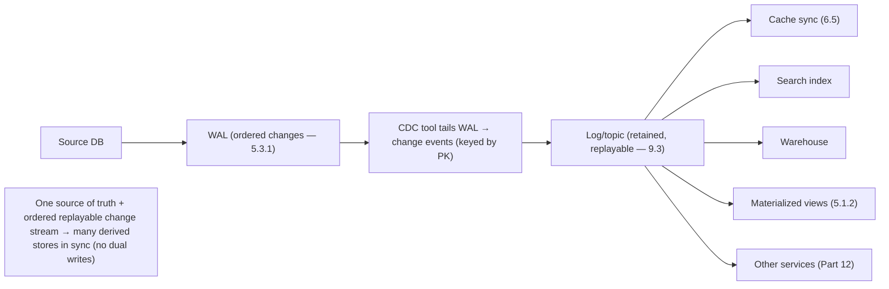

# Lesson 9.8 — Data Pipelines, CDC (Change Data Capture), and the Outbox Pattern

> Part 9: Messaging & Streaming · Difficulty: 🔴
>
> **Prerequisites:** [9.3 Distributed Log], [9.4 Delivery Guarantees], [9.5 Ordering/Idempotency], [5.3.1 WAL], [5.1.2 Derived Data], [6.5 CDC-driven invalidation].
> **Unlocks:** [Part 10 Replication], [Part 12 Microservices Data], [Part 20 Capstone], [5.4.3 Migrations].

---

## 1. Learning Objectives

After this lesson you will be able to:

- Define a **data pipeline** (moving/transforming data between systems) and the central problem it must solve: **keeping multiple datastores in sync** without the **dual-write** trap.
- Explain the **dual-write problem** (writing to two systems non-atomically corrupts consistency) and why it's the root cause of many sync bugs.
- Describe **Change Data Capture (CDC)** — streaming a database's changes (from its WAL — 5.3.1) as an ordered event log — and its uses (replication, cache/index sync, materialized views, microservice integration).
- Describe the **Outbox pattern** — atomically writing business data + an event to the same database, then reliably publishing — as the correct way to get "update DB **and** emit event" without dual writes; and how CDC and outbox combine.

---

## 2. Motivation — Keeping many datastores in sync without corrupting everything

Real systems don't have one datastore — they have many: the primary database (source of truth), a **cache** (Part 6), a **search index** (Elasticsearch), a **data warehouse** (OLAP — 5.4.1), **materialized views** (5.1.2), and, in microservices, **a database per service** (Part 12). All of these hold **derived copies** of data that must stay **in sync** with the source. The naive approach — **write to the database, then also write to the cache/index/other-service** ("dual writes") — is **fundamentally broken**: the two writes aren't atomic, so a crash or failure between them leaves the systems **inconsistent** (the DB updated but the index stale, or vice versa), and concurrent dual writes **race** (the stale-set problem from 6.3/6.5, now across systems). This **dual-write problem** is the root cause of countless "the cache/index/other-service is out of sync with the database" bugs.

The robust solution leverages everything Part 9 built: treat **changes as an event stream**. **Change Data Capture (CDC)** taps the database's own **write-ahead log** (5.3.1) — the authoritative, ordered record of every change — and publishes those changes as an **ordered event stream** (a log — 9.3) that any number of consumers can read (independently, replayably — 9.2) to update caches, indexes, warehouses, and other services. The **Outbox pattern** solves the complementary problem — "I need to update my database **and** emit an event atomically" — by writing both the business change **and** the event to the **same database in one transaction** (atomic — 5.2.1), then reliably publishing the event (often via CDC on the outbox table). Together, CDC and outbox replace fragile dual writes with **a single source of truth (the DB/WAL) + a reliable, ordered, replayable change stream** — the backbone of data integration, cache/index sync (6.5), and microservice data consistency (Part 12). This lesson develops the dual-write problem, CDC, and the outbox pattern.

---

## 3. Theory — From first principles

### 3.1 Data pipelines and the sync problem

`[CS]` A **data pipeline** moves and transforms data between systems — from sources (databases, events) to sinks (warehouses, indexes, caches, other services), often via streaming/batch (9.6/9.7). The central problem in most pipelines is **keeping derived datastores in sync with a source of truth**:
- The **source of truth** holds the authoritative data (the primary DB).
- **Derived stores** hold copies optimized for a purpose: cache (low-latency reads — Part 6), search index (full-text — Part 18), warehouse (analytics — 5.4.1), materialized view (precomputed query — 5.1.2), another service's DB (Part 12).
- These derived stores must **reflect changes** to the source — and doing this **correctly** (without inconsistency) is the hard part (§3.2).

### 3.2 The dual-write problem (the root anti-pattern)

`[CS]` The naive sync approach — **dual writes** — is broken:
```
update database (order status = SHIPPED)
... then ...
publish "OrderShipped" event / update search index / call other service
```
**Why it fails:**
- **Not atomic:** the two operations are **separate, non-transactional** actions across **different systems**. If the process **crashes** (or the network fails) **between** them, you get **one done, the other not** → **inconsistency**: the DB says SHIPPED but no event was published (downstream never learns), or the event published but the DB write rolled back (downstream acts on a non-event). 
- **Races / ordering:** concurrent dual writes can **interleave** so the two systems disagree on order (the stale-set race — 6.3/6.5 — now across systems).
- **Partial failure (8.1.1):** a failed second write with a "successful" first write is the ambiguous-outcome problem at the data layer.
**You cannot make two writes to two different systems atomic** without distributed transactions (2PC — Part 11, expensive/fragile) — so **dual writes are an anti-pattern**. CDC and outbox avoid them by making **one atomic write** the source, then **deriving** the rest from it.

### 3.3 Change Data Capture (CDC)

`[CS]` **CDC** captures **every change** (insert/update/delete) to a database and streams them as an **ordered sequence of change events**:
- **How (log-based CDC — the good way):** read the database's **write-ahead log / replication log** (5.3.1 — the WAL is the authoritative, ordered record of all changes the DB already maintains for durability/replication — 5.4.2). A CDC tool (e.g., Debezium) **tails the WAL** and emits a change event per row change to a **log/topic** (9.3), typically **keyed by primary key** (so a row's changes are ordered — 9.5). This is **low-overhead** (the WAL exists anyway), **complete** (captures every change), and **ordered** (WAL order).
- **(vs query-based CDC — polling for changed rows by timestamp/version — simpler but lossy, higher-overhead, misses deletes; log-based is preferred.)**
- **The change stream is just a log** (9.2/9.3): retained, replayable, multi-consumer. So **many derived stores** independently consume it to stay in sync: update the **cache** (invalidate/refresh — 6.5), reindex **search**, load the **warehouse**, rebuild **materialized views** (5.1.2), notify **other services** (Part 12).
- **Compacted CDC topics** (9.3) keep the **latest value per key** → a consumer can **rebuild full current state** by replaying (event-sourcing-like — 9.7).
**CDC turns the database's changes into a first-class, reliable, ordered, replayable event stream** — the integration backbone, replacing dual writes for **"keep derived stores in sync."**

### 3.4 CDC uses

`[CONV]`
- **Cache/index synchronization (6.5):** drive cache invalidation and search reindexing from the DB change stream — **reliable and ordered** (no missed/forgotten invalidations, unlike scattered app-side `cache.delete()` calls — 6.5 §3.7).
- **Materialized views / read models (5.1.2, CQRS — 7.5):** maintain denormalized read-optimized views by consuming changes.
- **Data warehouse / analytics (5.4.1):** continuously load OLTP changes into the OLAP store (ETL → ELT).
- **Microservice integration (Part 12):** one service publishes its data changes via CDC; others consume to maintain their own copies (without coupling to the source's DB).
- **Replication / migration (5.4.3, Part 10):** CDC underlies logical replication and zero-downtime migrations (dual-running old/new schemas/stores synced via CDC).
- **Audit / event history:** the change stream is a complete, ordered audit log.

### 3.5 The Outbox pattern

`[CS]` CDC handles "stream the DB's changes." The **complementary** problem is: **a service needs to update its database AND publish an event atomically** (e.g., "save the order AND emit OrderPlaced"). Dual-writing (save, then publish) is the §3.2 anti-pattern. The **Outbox pattern** solves it:
1. In the **same local database transaction** that makes the business change, **also insert the event into an "outbox" table** (in the same DB). Because it's **one transaction**, the business change and the outbox event are **atomic** (both commit or neither — ACID, 5.2.1) → **no dual-write inconsistency.**
2. A **separate process** (a **message relay**, often **CDC on the outbox table**, or a poller) reads new outbox rows and **publishes them** to the message broker/log (9.3), marking them sent. 
- **Why it works:** the only "write" the service does is the **atomic local transaction** (business data + outbox event together). Publishing is **decoupled and reliable** (the relay retries until published — **at-least-once** — 9.4; consumers dedupe — 9.5). The event is **guaranteed to be published if and only if the business change committed** — exactly the atomicity dual writes lack.
- **Delivery:** outbox gives **at-least-once** publishing (the relay may publish a row more than once on retry/crash) → **consumers must be idempotent** (9.4/9.5). Combined with idempotent consumers → **exactly-once effects** (9.4).

### 3.6 CDC + Outbox together (the integration backbone)

`[BP]` CDC and outbox are complementary and often combined:
- **Outbox** ensures a service **reliably and atomically emits events** for its own state changes (no dual write) — solving the **producer** side.
- **CDC** is frequently the **mechanism that publishes the outbox** (tail the outbox table's changes → topic) — and more broadly streams **any** DB changes for **consumers** to sync.
- The result is a **single source of truth (the service's DB) + a reliable, ordered, replayable event stream** that all derived stores/services consume — **replacing dual writes everywhere** with **one atomic write + derive-the-rest-from-the-log**.
- This is the foundation of **CQRS/event-driven microservices** (Part 12), **cache/index sync** (6.5), **materialized views** (5.1.2), and the **immutable-log + reprocessing** philosophy (9.7) — the database's changes become the events that keep the whole system consistent.

### 3.7 Correctness considerations (ordering, idempotency, schema)

`[CS]` CDC/outbox pipelines inherit all of Part 9's correctness concerns:
- **Ordering (9.5):** change events for the **same row** must be applied **in order** → key the change stream by **primary key** (same partition → ordered — 9.3/9.5). Cross-row ordering isn't guaranteed (usually fine).
- **Idempotency (9.4/9.5):** CDC/outbox deliver **at-least-once** → consumers must be **idempotent** (dedup by event ID, **per-key last-applied version/offset** — 9.5; upsert into derived stores). A replayed change must not corrupt the derived store.
- **Out-of-order/duplicate handling:** use the **last-applied-version** pattern (9.5) so a duplicate or stale change is skipped.
- **Schema evolution (4.3.1):** change events carry the source schema; producers and consumers evolve independently → use compatible schemas (Avro/Protobuf + a schema registry — 4.3.1/3.2.6).
- **Initial snapshot + ongoing changes:** a new CDC consumer typically needs a **snapshot** of current state (bootstrap) **then** the ongoing change stream — handled by CDC tools (snapshot then stream from the WAL position).
- **Eventual consistency:** derived stores **lag** the source (the pipeline's latency — like replication lag, 5.4.2) → readers see bounded staleness (Part 10). Design for it (6.5 staleness budget).

### 3.8 Where CDC/outbox fit vs alternatives

`[BP]`
- **Use CDC** to **sync derived stores** from a source DB (cache/index/warehouse/views/other services) reliably and in order — **instead of dual writes** or scattered app-side sync (6.5).
- **Use outbox** when a service must **atomically change its DB and emit an event** — **instead of dual-writing** "save then publish."
- **Alternatives & when:** **2PC/distributed transactions** (Part 11) can make cross-system writes atomic but are **slow, fragile, and reduce availability** — usually avoided in favor of outbox+CDC (atomic *local* write + eventual propagation). **Application-level events** (publish directly from app code) reintroduce the dual-write problem — **prefer outbox**. **Event sourcing** (Part 20) goes further (the event log *is* the source of truth) — outbox/CDC are the pragmatic, incremental path most systems take.
**The principle:** **make exactly one atomic write (to one system), then derive everything else from its change log** — never dual-write across systems.

---

## 4. Visual Intuition

### Dual-write problem vs Outbox

```mermaid
flowchart TB
    subgraph BAD["Dual write (BROKEN): not atomic"]
      A1["update DB"] --> A2["publish event / update index"]
      A2 -.->|crash BETWEEN → DB updated but no event (or vice versa)| INC["INCONSISTENT"]
    end
    subgraph GOOD["Outbox (CORRECT): one atomic transaction"]
      B1["BEGIN tx: update business data + INSERT outbox event"] --> B2["COMMIT (atomic — both or neither)"]
      B2 --> RELAY["Relay/CDC reads outbox → publishes to log (at-least-once)"]
      RELAY --> CONS["Idempotent consumers"]
    end
```

### CDC: WAL → change stream → derived stores



---

## 5. Real-World Analogy

Imagine a company's **master record book** (the source-of-truth database) and several **summary boards** that must reflect it: a lobby "current status" board (cache), a searchable index card catalog (search index), and the finance department's ledger (warehouse).

- **The dual-write trap:** the naive clerk **writes a change in the master book and then walks over to update each board separately.** If they **collapse on the way** (crash) after updating the book but before updating the boards — or after updating one board but not the others — the boards now **disagree with the master book** (inconsistent), and nobody knows. Worse, two clerks updating in parallel can update the boards in the **wrong order**. This is fragile and a constant source of "the board is wrong" complaints.
- **CDC (the carbon-copy journal):** instead, the master book is a **carbon-copy ledger** that automatically produces an **ordered stream of "what changed" slips** (the WAL already records every change for the book's own safety — you just tap it). A **runner** takes these change-slips and posts them to a **bulletin feed** that every board's keeper reads at their own pace — so the lobby board, the catalog, and the finance ledger all **derive their updates from the same ordered stream of truth**. No clerk ever writes to two places; everyone **reads the one change feed**. If a board keeper falls behind or makes a mistake, they just **re-read the feed** (replay) to catch up or rebuild.
- **The outbox (write the to-do in the same ledger entry):** when a clerk needs to both **record a sale AND notify shipping**, they don't write the sale and then separately run to tell shipping (dual write). Instead, in the **same pen-stroke (transaction)**, they write the sale **and** a note in a dedicated **"to-send" column** of the very same book. Because it's the same atomic entry, the sale and the notification-note are **inseparable** — either both are recorded or neither. Then the runner picks up "to-send" notes from the book and delivers them to shipping (reliably, retrying if needed). Shipping might occasionally get a note **twice** (the runner retried), so shipping checks "did I already handle sale #A7?" (idempotency).
- **The principle:** **make one atomic entry in one book, then let everything else be derived from the book's change stream** — never try to write the same fact into two books at once.

---

## 6. Industry Example

- **Debezium (log-based CDC)** `[CONV]`: tails MySQL/Postgres/MongoDB WALs/oplogs and streams change events to Kafka, keyed by PK — the canonical CDC tool for sync/integration (§3.3/3.4). *(Representative.)*
- **CDC for cache/search/warehouse sync** `[BP]`: driving cache invalidation (6.5), Elasticsearch reindexing, and warehouse loads from the DB change stream instead of dual writes (§3.4). *(Representative.)*
- **Transactional Outbox pattern** `[BP]`: microservices write business data + an outbox event in one local transaction, then relay/CDC publishes — the standard fix for the dual-write problem (Microservices patterns lineage) (§3.5, Part 12). *(Representative.)*
- **CDC-driven materialized views / CQRS read models** `[CONV]`: maintaining denormalized read models from change streams (5.1.2, 7.5) (§3.4). *(Representative.)*
- **Zero-downtime migration via CDC** `[CONV]`: dual-running old/new stores kept in sync by CDC during a migration (5.4.3) (§3.4). *(Representative.)*

---

## 7. Implementation Details — building sync pipelines correctly

- **Never dual-write across systems** — make **one atomic write** to the source, then **derive** other stores from its change stream (CDC) or use the **outbox** for atomic DB-change-plus-event (§3.2/3.5/3.8) `[BP]`.
- **Use log-based CDC** (tail the WAL — Debezium-style) over query-based polling — complete, ordered, low-overhead, captures deletes (§3.3).
- **Key the change stream by primary key** so a row's changes are ordered (9.3/9.5); accept cross-row order isn't guaranteed (§3.7).
- **Make consumers idempotent** (at-least-once delivery): dedup by event ID, **per-key last-applied version**, **upsert** into derived stores (9.4/9.5) — replays/duplicates must not corrupt derived data (§3.7).
- **For "update DB + emit event," use the outbox** (business change + outbox row in one transaction; relay/CDC publishes; consumers dedupe) — never "save then publish" (§3.5).
- **Handle initial snapshot + ongoing stream** for new consumers (bootstrap current state, then tail changes) (§3.7).
- **Manage schema evolution** (Avro/Protobuf + schema registry — 4.3.1/3.2.6) so producers/consumers evolve independently (§3.7).
- **Design for eventual consistency / lag** — derived stores trail the source; set a **staleness budget** (6.5) and route freshness-critical reads to the source (5.4.2/7.5) (§3.7).
- **Avoid 2PC** for cross-system writes — prefer outbox+CDC (atomic local + eventual propagation) over slow/fragile distributed transactions (§3.8, Part 11).

---

## 8. Advantages

- **No dual-write inconsistency** — one atomic write + derive-the-rest replaces the broken dual-write pattern (§3.2/3.5).
- **Reliable, ordered, replayable change stream** — CDC turns DB changes into a first-class log (multi-consumer, replayable — 9.2/9.3) (§3.3).
- **Decoupled integration** — many derived stores/services sync independently from the change stream, without coupling to the source's internals (§3.4, Part 12).
- **Low overhead (log-based CDC)** — reuses the WAL the DB already maintains (§3.3).
- **Reprocessable** — replay the change stream to rebuild caches/indexes/views or recover from bugs (9.2/9.7) (§3.4/3.6).
- **Atomicity without 2PC** — outbox gets atomic DB-change-plus-event via a single local transaction (§3.5).

---

## 9. Disadvantages / limitations

- **Eventual consistency / lag** — derived stores trail the source (pipeline latency); readers see bounded staleness (§3.7, Part 10).
- **Operational complexity** — CDC tooling, a relay, topics, schema registry, monitoring lag — more moving parts (§3.3/3.7, Part 14).
- **At-least-once → idempotency required** — consumers must dedupe or corruption ensues (§3.7, 9.4/9.5).
- **Outbox overhead** — an extra table + relay; the outbox can grow if the relay falls behind (needs pruning/monitoring) (§3.5).
- **Coupling to DB internals (CDC)** — log-based CDC depends on the DB's WAL format/replication features; schema changes need care (§3.3/3.7).
- **Initial-snapshot cost** — bootstrapping a new consumer over large data (§3.7).

---

## 10. When NOT to / limits

- **Don't dual-write across systems** — ever; use outbox/CDC (§3.2) — the whole point.
- **Don't use query-based CDC** when log-based is available (misses deletes, higher overhead, lossy) (§3.3).
- **Don't skip idempotency** on CDC/outbox consumers — at-least-once guarantees duplicates (§3.7, 9.5).
- **Don't reach for 2PC** for cross-system sync when outbox+CDC + eventual consistency suffices (§3.8, Part 11).
- **Don't use CDC/outbox when strong immediate cross-system consistency is mandatory** — the pipeline is eventual; that need may require a different design (single store, or careful transactional boundaries) (§3.7).
- **Don't publish events directly from app code** alongside a DB write ("save then publish") — that's the dual-write anti-pattern; use outbox (§3.5).

---

## 11. Common Mistakes

1. **Dual writes** (update DB, then publish/update index) → inconsistency on crash/race (§3.2) — the root mistake.
2. **Publishing events from app code** alongside the DB write instead of via outbox → dual-write trap (§3.5).
3. **Query-based CDC** (polling by timestamp) → misses deletes, lossy, high overhead (use log-based) (§3.3).
4. **Non-idempotent CDC/outbox consumers** → duplicates corrupt derived stores (§3.7, 9.4/9.5).
5. **Not keying by PK** → a row's changes spread across partitions → out-of-order application (§3.7, 9.5).
6. **Ignoring lag/eventual consistency** → serving freshness-critical reads from a stale derived store (§3.7, 6.5).
7. **Unbounded outbox growth** → relay falls behind / no pruning → table bloat (§3.5).
8. **No schema-evolution plan** → CDC consumers break when the source schema changes (§3.7, 4.3.1).

---

## 12. Interview Questions

**🟢 Easy**
- What is the dual-write problem, and why is it broken?
- What is CDC, and where do the change events come from?

**🟡 Medium**
- How does the outbox pattern make "update DB + emit event" atomic without distributed transactions?
- Why is log-based CDC preferred over query-based (polling) CDC?

**🔴 Hard**
- Design a pipeline to keep a search index and a cache in sync with a primary database. Use CDC; address ordering (keying), idempotency, initial snapshot, and lag.
- How do CDC and the outbox pattern combine to replace dual writes across a system, and what consistency guarantee do you end up with?

**⚫ Staff+**
- A microservice must update its database and reliably notify three other services of the change, with no inconsistency on failure. Design the outbox + CDC solution end-to-end (atomic local transaction, relay/publish, keyed ordered stream, idempotent consumers, schema evolution, lag handling), and contrast with 2PC and naive event publishing.
- Your system has chronic "cache/search index out of sync with the database" bugs from scattered app-side dual writes. Diagnose the root cause and design the migration to a CDC-driven sync (and outbox where services emit events), including how you bootstrap (snapshot), handle duplicates/ordering, and bound staleness.

---

## 13. Production Pitfalls

- **Dual-write inconsistency:** a crash between the DB write and the index/event update leaves systems out of sync; intermittent and hard to detect (§3.2) — the bug CDC/outbox prevent.
- **Lost events from "save then publish":** the publish fails (or the process crashes) after the DB commit → downstream never learns; or the publish succeeds but the DB transaction rolls back → phantom event (§3.5).
- **Out-of-order derived state:** change events not keyed by PK → a row's update applied before its insert / out of order → corrupt derived store (§3.7, 9.5).
- **Duplicate corruption:** non-idempotent consumer + at-least-once CDC/outbox → double-applied changes (§3.7, 9.4/9.5).
- **Stale-read incident:** serving a freshness-critical read from a lagging derived store (cache/index trailing the DB) (§3.7, 6.5/5.4.2).
- **Outbox bloat:** the relay falls behind or fails → outbox table grows unbounded; or events never published (relay outage) → downstream stalls (§3.5).
- **Schema-change break:** a source schema change breaks CDC consumers with no compatibility plan (§3.7, 4.3.1).

---

## 14. Optimization Techniques

- **One atomic write + derive-the-rest (CDC/outbox)** — eliminate dual writes (§3.2/3.5/3.8) `[BP]`.
- **Log-based CDC (tail the WAL)** — complete, ordered, low-overhead change capture (§3.3, 5.3.1).
- **Key change streams by PK** for per-row ordering; **idempotent consumers (last-applied-version + upsert)** for safe replay/duplicates (§3.7, 9.5).
- **Outbox + CDC-on-outbox** for reliable atomic event emission from services (§3.5/3.6).
- **Compacted CDC topics** to keep latest-per-key state → rebuildable derived stores (9.3/9.7).
- **Snapshot + stream** bootstrap for new consumers; **schema registry** for evolution (§3.7, 4.3.1).
- **Monitor pipeline lag + outbox depth**; set a **staleness budget** and route freshness-critical reads to the source (§3.7, 6.5, Part 16).
- **Prefer outbox+CDC over 2PC** for cross-system consistency (eventual but reliable, far cheaper) (§3.8, Part 11).

---

## 15. Summary

Real systems keep many **derived datastores** (cache, search index, warehouse, materialized views, per-service DBs) that must stay **in sync** with a **source of truth** — and the naive way, **dual writes** ("update the DB, then also update the index / publish an event"), is **fundamentally broken**: the two writes are **not atomic** across systems, so a crash or failure **between** them leaves the stores **inconsistent**, and concurrent dual writes **race** — the root cause of pervasive "out of sync" bugs. You **cannot** make writes to two different systems atomic without **distributed transactions (2PC — Part 11, slow/fragile)**, so the correct approach is **make exactly one atomic write (to one system), then derive everything else from its change log.** **Change Data Capture (CDC)** does this by **tailing the database's write-ahead log** (5.3.1 — the authoritative, ordered record the DB already keeps) and emitting each row change as an event to a **log/topic** (9.3), **keyed by primary key** (so a row's changes are ordered — 9.5), producing a **reliable, ordered, replayable change stream** that **many derived stores consume independently** to stay synced — replacing dual writes for cache/index sync (6.5), materialized views/CQRS (5.1.2/7.5), warehouse loading (5.4.1), microservice integration (Part 12), and migrations (5.4.3). Log-based CDC (Debezium-style) is preferred over query-based polling (which misses deletes and is lossy/heavy). The **complementary** problem — a service needing to **update its DB AND emit an event atomically** — is solved by the **Outbox pattern**: write the business change **and** an event row to the **same database in one transaction** (atomic — 5.2.1, no dual write), then a **relay (often CDC on the outbox table)** reliably **publishes** the event (at-least-once → **idempotent consumers** → exactly-once effects — 9.4/9.5). Together, **outbox (reliable atomic event emission) + CDC (ordered replayable change streams)** form the **integration backbone**: one source of truth + a change log feeding all derived stores/services — the foundation of event-driven microservices (Part 12), the immutable-log/reprocessing model (9.7), and event sourcing (Part 20). The correctness essentials are Part 9's throughline: **key by PK for ordering, idempotent consumers (last-applied-version + upsert) for at-least-once, schema evolution for independent change, snapshot+stream bootstrap, and accept eventual consistency/lag** (bounded staleness — route freshness-critical reads to the source). The mantra: **never dual-write — make one atomic write and derive the rest from the change stream.**

---

## 16. Revision Notes (flashcard-ready)

- **Q:** Dual-write problem? **A:** Writing to two systems non-atomically (DB then index/event) → crash between → inconsistency; races. Broken.
- **Q:** Why can't you just make both writes work? **A:** No cross-system atomicity without 2PC (slow/fragile); so make one atomic write + derive the rest.
- **Q:** CDC? **A:** Capture every DB change by tailing the WAL (5.3.1) → ordered, keyed-by-PK change event stream (a log).
- **Q:** Log-based vs query-based CDC? **A:** Log-based (tail WAL) = complete/ordered/low-overhead/captures deletes; query-based (poll) = lossy, misses deletes, heavier.
- **Q:** CDC uses? **A:** Cache/index sync (6.5), materialized views/CQRS, warehouse, microservice integration, replication/migration, audit.
- **Q:** Outbox pattern? **A:** Write business change + event row in ONE local transaction (atomic); a relay/CDC publishes the outbox events.
- **Q:** Why does outbox work? **A:** The only write is one atomic local transaction → event published iff business change committed; no dual write.
- **Q:** Outbox delivery guarantee? **A:** At-least-once (relay may republish) → consumers must be idempotent → exactly-once effects.
- **Q:** CDC + outbox together? **A:** Outbox = reliable atomic emission (producer side); CDC = ordered replayable change streams; together replace dual writes everywhere.
- **Q:** Correctness essentials? **A:** Key by PK (ordering), idempotent consumers (last-applied-version + upsert), schema evolution, snapshot+stream, accept lag.
- **Q:** The mantra? **A:** Never dual-write — one atomic write, derive the rest from the change stream.

---

## 17. Further Reading + Knowledge-Graph Links

**Within this platform**
- **Builds on:** [5.3.1 WAL] (CDC's source), [9.3 Distributed Log] (the change stream), [9.4 Delivery Guarantees]/[9.5 Idempotency-Ordering] (at-least-once consumers), [5.1.2 Derived Data], [6.5 CDC-driven invalidation], [5.2.1 ACID] (outbox atomicity).
- **Next:** [9.9 Backpressure/DLQ] (pipeline failure handling). **Then:** Part 9 README; **[Part 10 Replication]** (CDC underlies logical replication), [Part 12 Microservices Data], [Part 20 Capstone] (event sourcing).
- **Enables:** [5.4.3 Zero-Downtime Migrations] (CDC dual-run), [7.5 CQRS read models].

**Foundational texts (synthesized)**
- Kleppmann, *Designing Data-Intensive Applications* — change data capture, dual writes, derived data, event logs (synthesized).
- Richardson, *Microservices Patterns* — transactional outbox, CDC (concept, synthesized).
- Debezium / Kafka Connect documentation (representative).

**Concept tags:** `[CS]` dual-write problem (no cross-system atomicity), CDC (tail the WAL), outbox (atomic DB-change+event), keyed-by-PK ordering · `[CONV]` Debezium log-based CDC, transactional outbox, CDC-driven sync/views/migration · `[BP]` never dual-write — one atomic write + derive from change stream, idempotent consumers, outbox over "save-then-publish", outbox+CDC over 2PC.
