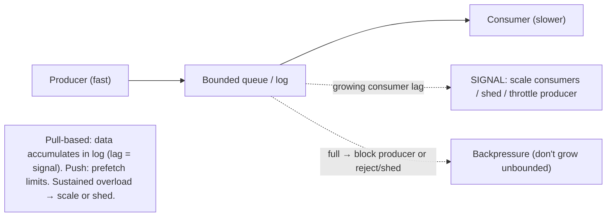
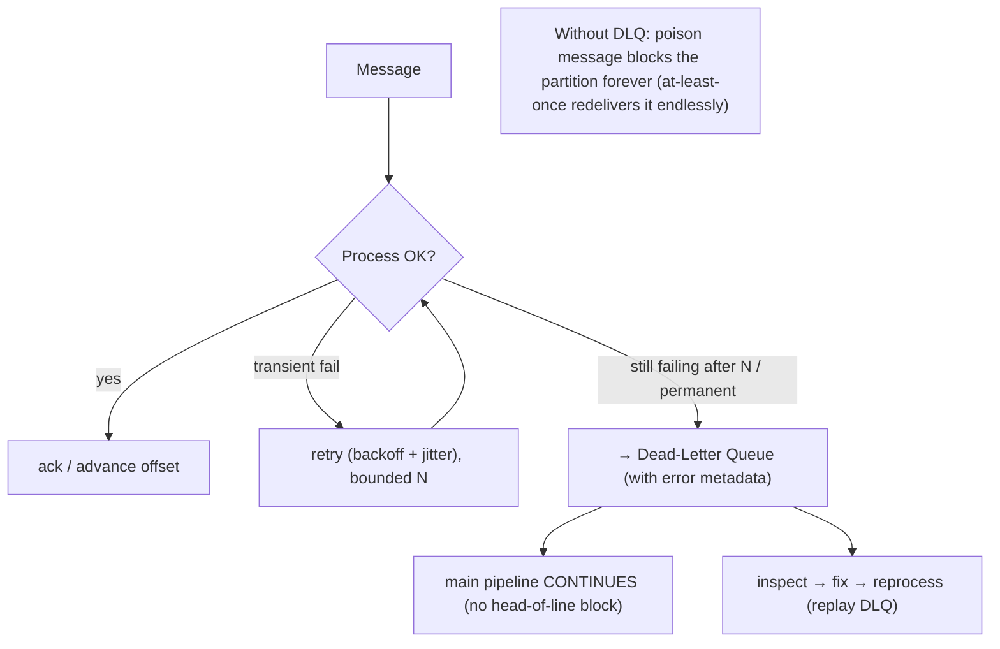

# Lesson 9.9 — Backpressure, Dead-Letter Queues, and Poison Messages

> Part 9: Messaging & Streaming · Difficulty: 🔴
>
> **Prerequisites:** [9.1 Messaging Fundamentals], [9.3 Distributed Log/Lag], [9.5 Idempotency], [3.3.4 Backpressure], [8.1.3 Retries/Backoff], [6.7 Stampede].
> **Unlocks:** [Part 11 Resilience], [Part 14 SRE/On-call], [Part 16 Observability].

---

## 1. Learning Objectives

After this lesson you will be able to:

- Explain **backpressure** in messaging — what happens when producers outpace consumers — and the mechanisms that handle it (pull-based flow control, bounded queues, consumer lag, scaling, load shedding).
- Define a **poison message** (one that repeatedly fails processing) and the danger it poses (blocking the queue / infinite retry loop), and how to handle it.
- Describe **dead-letter queues (DLQs)** — where failed/poison messages go after exhausting retries — and the **retry + DLQ + reprocess** workflow.
- Design robust failure handling for consumers: **retry policy (backoff/jitter/caps), DLQ routing, poison-message isolation, ordering implications, and monitoring (lag, DLQ depth)**.

---

## 2. Motivation — What happens when consumers can't keep up, or a message just won't process

Two failure modes plague every real messaging/streaming system, and ignoring them turns a healthy pipeline into an outage. The first is **overload**: producers send faster than consumers can process. In a synchronous world this would push back on the caller, but messaging's whole point is **decoupling via a buffer** (9.1) — so by default the buffer just **grows**. Unbounded, that growth consumes memory/disk until the **broker fails** or **consumer lag** balloons to hours (stale results, breached SLAs). Handling this is **backpressure** — propagating "slow down" upstream, bounding queues, scaling consumers, or **shedding load** (3.3.4, Part 11) — so overload degrades **gracefully** instead of catastrophically.

The second is the **poison message**: a single message that **consistently fails** to process — malformed data, a bug triggered by its content, a missing dependency, a schema mismatch (4.3.1). Under **at-least-once** delivery (9.4), a failed message is **redelivered** — and a poison message is redelivered **forever**, failing each time. Worse, in an **ordered** system (9.5), the poison message **blocks the entire partition/queue behind it** (nothing after it can be processed until it succeeds — which it never will), turning one bad message into a **stuck pipeline**. The fix is **retry policies** (a few attempts with backoff — 8.1.3) followed by routing the persistently-failing message to a **dead-letter queue (DLQ)** — quarantining it so the pipeline **moves on**, while preserving it for inspection/reprocessing. This lesson — the capstone of Part 9 — covers backpressure, poison messages, and DLQs: the operational robustness that keeps a streaming system **alive under overload and bad data**, tying together backpressure (3.3.4), retries/idempotency (8.1.3/9.4/9.5), and stampede/metastable concerns (6.7, Part 11).

---

## 3. Theory — From first principles

### 3.1 Backpressure — the overload problem

`[CS]` **Backpressure** is the mechanism by which a system under load signals **"slow down"** upstream so it isn't overwhelmed (3.3.4). In messaging, producers can outpace consumers; without backpressure, the buffer (queue/log) **grows unbounded** → memory/disk exhaustion → broker failure, or **consumer lag** (9.3) grows → results stale by hours → SLA breach. The question: **what happens when the buffer can't keep up?**
- **The decoupling double-edge:** messaging deliberately **decouples** producer speed from consumer speed (9.1) — a feature for absorbing **bursts** (load leveling — 7.6), but a **liability** under **sustained** overload (the buffer can't grow forever). The buffer handles *transient* spikes; backpressure (and scaling/shedding) handles *sustained* overload.

### 3.2 Backpressure mechanisms

`[CS]` How systems handle producer-faster-than-consumer:
- **Pull-based consumption (natural backpressure):** in a **pull** model (Kafka — 9.1), consumers **fetch what they can handle**, so they **can't be overwhelmed** — the data just **accumulates in the log** (bounded by retention — 9.3), and **consumer lag** is the signal. The log absorbs the burst; lag tells you to scale. (Push systems need explicit flow control — **prefetch limits** — to avoid overwhelming consumers — 9.1.)
- **Bounded buffers / queues:** cap the queue/in-flight size. When full, the system must **block the producer** (apply backpressure upstream) or **reject/shed** (return an error / drop) — never grow unbounded (3.3.4).
- **Scale consumers:** add consumer instances (up to partition count — 9.3) to **increase throughput** and drain the backlog. The primary response to **sustained** load.
- **Load shedding (Part 11):** under extreme overload, **drop or reject** lower-priority messages to protect the system (better to shed than collapse — 6.7/3.3.4). For loss-tolerant data, shedding is acceptable; for important data, prefer buffering + scaling.
- **Propagating backpressure through a pipeline:** in stream processing (9.6), a slow downstream operator backpressures upstream operators and ultimately the source (Flink-style) → the whole pipeline self-throttles rather than any stage exploding (3.3.4).
- **Producer-side throttling/rate limiting:** producers respect a rate limit / slow down when signaled (Part 15 rate limiting).

### 3.3 Consumer lag — the key metric

`[CS]` In a log (9.3), **consumer lag** = how far behind the consumer's offset is from the log's end (un-processed messages). It's the **primary health signal** for backpressure/overload:
- **Stable/low lag:** consumers keeping up.
- **Growing lag:** consumers **falling behind** (overload, slow processing, a stuck partition, a rebalance — 9.3) → results getting stale → act (scale, fix, investigate).
- **Lag per partition:** a single high-lag partition signals a **hot partition** (7.4/9.5) or a stuck consumer/poison message (§3.4).
**Monitor and alert on consumer lag** (Part 16) — it's the early warning for overload, hot partitions, and stuck pipelines.

### 3.4 Poison messages — the message that won't process

`[CS]` A **poison message** is one that **consistently fails** processing on every attempt — causes: **malformed/corrupt data**, a **schema mismatch** (4.3.1), content that triggers a **bug** or unhandled case, a **missing/permanently-failing dependency**, or an unrecoverable validation error. Under **at-least-once** delivery (9.4), a failure → **redelivery** → fails again → **redelivered forever** (an **infinite retry loop**). Two dangers:
- **Wasted resources / retry loop:** the consumer endlessly retries the same doomed message, burning CPU and never progressing (and possibly stampeding a dependency — 6.7).
- **Head-of-line blocking (the worse one):** in an **ordered** system (9.5 — per-partition order), the poison message **blocks everything behind it** in that partition/queue — nothing after it can be processed until it succeeds (which it never will) → the **whole partition stalls** → growing lag → effectively a pipeline outage from **one bad message.**
**You must detect persistent failure and get the poison message out of the way** — that's the DLQ (§3.5).

### 3.5 Dead-letter queues (DLQs)

`[CS]` A **dead-letter queue (DLQ)** is a **separate queue/topic** where messages that **cannot be processed** (after exhausting retries) are **routed**, so the main pipeline can **move on**:
- **The workflow:** consumer tries to process a message → on failure, **retry** a bounded number of times (with **backoff/jitter** — 8.1.3); if it **still fails** after the retry limit, **send it to the DLQ** (with metadata: error, attempt count, original topic/offset, timestamp) and **acknowledge/advance past it** in the main queue → the pipeline **continues** with subsequent messages (no head-of-line block).
- **The DLQ is a quarantine + inspection area:** failed messages are **preserved** (not lost) for humans/tools to **inspect** (why did it fail?), **fix** (correct the data / fix the bug / restore the dependency), and **reprocess** (replay the DLQ back into the main pipeline once the issue is resolved).
- **DLQ as a signal:** a growing DLQ is an **alert** — something is systematically failing (a bug, a bad producer, a schema break) → investigate (Part 16/14).
- **Brokers vs logs:** RabbitMQ has **dead-letter exchanges (DLX)** with TTL/max-retry routing; Kafka-style logs implement DLQs as **separate topics** the consumer routes to (often via a framework). Cloud queues (SQS) have built-in DLQ + `maxReceiveCount`.

### 3.6 Retry policy + DLQ design

`[BP]` A robust failure-handling policy combines retries and DLQs carefully (drawing on 8.1.3/6.7):
- **Distinguish transient vs permanent failures:** **transient** (a dependency briefly down, a timeout) → **retry** (with **exponential backoff + jitter** — 8.1.3 — to avoid hammering/retry storms — 6.7); **permanent** (malformed data, validation error) → **don't retry repeatedly** → DLQ sooner (retrying a permanently-bad message is futile and wasteful).
- **Bounded retries:** cap attempts (e.g., 3–5) before DLQ — never infinite (the poison-loop) (§3.4).
- **Retry placement:** **in-place retry** (reprocess immediately — risks blocking the partition for ordered systems), or **retry topics/queues** (move to a delayed-retry topic, then DLQ after N) — the latter avoids head-of-line blocking during retries (a common Kafka pattern: `retry` topics with increasing delays → `dlq`).
- **Idempotency still required** (9.5) — retries and redelivery mean duplicates; processing must be idempotent regardless of retry/DLQ logic.
- **DLQ handling process:** monitor DLQ depth, alert, have a **runbook** to inspect/fix/reprocess (Part 14) — a DLQ with no one watching is just silent data loss.

### 3.7 Ordering vs DLQ tension

`[CS]` There's a real tension between **strict ordering** (9.5) and **DLQ/skip-on-failure**:
- In an **ordered** partition, **skipping** a failed message (sending it to the DLQ and processing the next) **breaks ordering** — a later message is processed before the failed earlier one (which is now in the DLQ). For many use cases this is acceptable (the DLQ message is handled separately/later). 
- But for **strict-ordering-critical** flows (e.g., a per-account transaction sequence), skipping ahead may be **incorrect** (you can't apply "withdraw" if the earlier "deposit" failed and was skipped). Options: **halt the partition** (stop processing until the poison message is resolved — preserves ordering but stalls that partition — sometimes correct for critical flows), or **DLQ the whole entity's subsequent messages** too, or design so failures are rare/handled differently.
- **The tradeoff:** **DLQ-and-continue** maximizes liveness (pipeline keeps moving) but can **break strict ordering**; **halt-on-poison** preserves ordering but **stalls**. Choose by whether **ordering correctness** outweighs **liveness** for that flow (most non-critical flows: DLQ-and-continue; strict financial sequences: more care). 

### 3.8 Putting it together — robust pipeline operations

`[BP]` A resilient consumer/pipeline combines:
1. **Backpressure** (pull-based / bounded buffers / propagate upstream) so overload doesn't blow up the buffer (§3.2, 3.3.4).
2. **Scale consumers** on growing lag; **load-shed** loss-tolerant data under extreme overload (§3.2, Part 11).
3. **Bounded retries with backoff + jitter**, distinguishing transient vs permanent (§3.6, 8.1.3).
4. **DLQ** for persistently-failing/poison messages → quarantine, don't block, don't infinite-loop (§3.5).
5. **Idempotent processing** (retries/redelivery → duplicates) (§3.6, 9.5).
6. **Decide the ordering-vs-DLQ tradeoff** per flow (continue vs halt) (§3.7).
7. **Monitor + alert on consumer lag and DLQ depth**; have runbooks to inspect/fix/reprocess (§3.3/3.5, Part 14/16).
This is the operational robustness layer that keeps the elegant log/streaming machinery (9.1–9.8) **alive in production** under overload and bad data — and it's deeply tied to resilience patterns (Part 11) and SRE (Part 14).

---

## 4. Visual Intuition

### Backpressure: bounded buffer + lag

### Retry → DLQ workflow (poison message)

---

## 5. Real-World Analogy

Imagine an **assembly line** where parts arrive on a conveyor (the queue) and a worker processes each (the consumer).

- **Backpressure:** if parts arrive **faster than the worker can handle**, they **pile up** on the conveyor. A short burst is fine (the conveyor buffers it — that's the point). But if it's **sustained**, the conveyor **overflows onto the floor** (unbounded buffer → broker crash) — so you need a rule: when the conveyor is full, **signal the upstream machine to slow down** (backpressure), **add more workers** (scale), or, if it's truly hopeless and the parts are low-value, **let some fall off** (load shedding). The pile-up height (**consumer lag**) is your early-warning gauge — a growing pile means "act now."
- **Poison message:** one part is **defective in a way the worker can't process** — say it's the wrong shape and jams the machine. Under "keep trying" rules (at-least-once redelivery), the worker **keeps grabbing the same jammed part, failing, and grabbing it again forever** (infinite retry) — and worse, on a **strict in-order line**, that jammed part **blocks every part behind it** (head-of-line blocking): the whole line stops because of **one bad part.**
- **Dead-letter queue:** the fix is a **reject bin** beside the line. The worker tries the defective part a **few times** (bounded retries, pausing a bit between — backoff/jitter); if it still won't process, the worker **tosses it in the reject bin** (DLQ) **with a note about what went wrong**, and **moves on to the next part** — the line keeps running. Later, a specialist **examines the reject bin**, figures out the defect (bad data / a bug / a missing tool), **fixes it**, and **re-feeds the corrected parts** onto the line (reprocess). And a **growing reject bin** is itself an alarm — something is systematically producing bad parts, go investigate.
- **The ordering tension:** if the line **must** assemble parts in strict order (you can't attach the lid before the contents), tossing a jammed part in the reject bin and continuing might produce a **wrong assembly** — so for those strict lines you might **stop the line** until the jam is cleared (halt-on-poison) instead of skipping ahead. It's a tradeoff between **keeping moving** and **staying correct**.

---

## 6. Industry Example

- **Consumer lag monitoring** `[BP]`: Kafka consumer-group lag is *the* primary streaming health metric — alerting on growing lag drives scaling/investigation (§3.3, Part 16). *(Representative.)*
- **Pull-based natural backpressure** `[CONV]`: Kafka consumers fetch at their own pace; data accumulates in the (retention-bounded) log; lag signals overload (§3.2, 9.1/9.3). *(Representative.)*
- **Dead-letter exchanges/queues** `[CONV]`: RabbitMQ DLX (with TTL/max-retry), SQS DLQ + `maxReceiveCount`, and Kafka **retry-topics → DLQ** patterns route poison messages aside (§3.5/3.6). *(Representative.)*
- **Retry topics with increasing delays** `[BP]`: a common Kafka pattern — `topic` → `topic.retry.5s` → `topic.retry.30s` → `topic.dlq` — bounded backoff retries without blocking the main partition (§3.6). *(Representative.)*
- **Stream-processing backpressure** `[CONV]`: Flink propagates backpressure from slow operators upstream to the source so no stage explodes (§3.2, 3.3.4). *(Representative.)*
- **Load shedding under overload** `[BP]`: dropping/rejecting lower-priority messages to protect the system during extreme load (§3.2, Part 11, 6.7). *(Representative.)*

---

## 7. Implementation Details — robust failure handling

- **Use pull-based consumption (or push with prefetch limits)** so consumers aren't overwhelmed; **never let buffers grow unbounded** — bound queues, propagate backpressure, or shed (§3.2, 3.3.4, 9.1) `[BP]`.
- **Monitor and alert on consumer lag (per partition)** as the primary overload/health signal; **scale consumers** (up to partition count) on growing lag (§3.3, 9.3, Part 16).
- **Bounded retries with exponential backoff + jitter** (8.1.3/6.7); **distinguish transient (retry) vs permanent (DLQ sooner)** failures — don't infinitely retry a permanently-bad message (§3.4/3.6).
- **Route poison/persistently-failing messages to a DLQ** (with error metadata) and **advance** the main pipeline → no head-of-line block, no infinite loop (§3.5).
- **Use retry topics/queues (delayed)** to retry without blocking the main partition during backoff (a common log pattern) (§3.6).
- **Keep processing idempotent** (retries/redelivery → duplicates) regardless of retry/DLQ logic (§3.6, 9.5).
- **Decide the ordering-vs-DLQ tradeoff per flow** — DLQ-and-continue (liveness, may break order) for non-critical; halt-on-poison (preserve order, stalls) for strict-ordering-critical flows (§3.7).
- **Operate the DLQ** — monitor depth, alert, and have a **runbook** to inspect/fix/reprocess (a DLQ nobody watches is silent data loss) (§3.5, Part 14).
- **Load-shed loss-tolerant data** under extreme overload to protect the system; buffer+scale for important data (§3.2, Part 11).

---

## 8. Advantages (of robust handling)

- **Survives overload gracefully** — backpressure/scaling/shedding prevent buffer blowup and broker collapse (§3.2).
- **No stuck pipelines** — DLQ quarantines poison messages so the pipeline keeps moving (no head-of-line block / infinite loop) (§3.4/3.5).
- **No silent data loss** — DLQ preserves failed messages for inspection/fix/reprocess (§3.5).
- **Early warning** — consumer lag and DLQ depth surface problems before outage (§3.3/3.5, Part 16).
- **Resilience** — bounded backoff retries handle transient failures without storms (§3.6, 8.1.3/6.7).
- **Operational control** — explicit policies for retry, DLQ, ordering, shedding (§3.8).

---

## 9. Disadvantages / costs

- **Complexity** — retry policies, DLQs, retry topics, backpressure tuning, runbooks (§3.6/3.8).
- **Ordering vs liveness tension** — DLQ-and-continue can break strict ordering; halt-on-poison stalls (§3.7).
- **DLQ requires operations** — an unwatched DLQ = silent loss; needs monitoring + runbook (§3.5).
- **Load shedding = data loss** — acceptable only for loss-tolerant data; a deliberate tradeoff (§3.2, Part 11).
- **Backpressure can mask problems** — a system silently slowing under backpressure may hide a need to scale/fix (monitor lag) (§3.3).
- **Retry storms if misconfigured** — retries without backoff/jitter/caps amplify overload (8.1.3/6.7).

---

## 10. When NOT to / limits

- **Don't let buffers grow unbounded** — always bound + backpressure/shed (§3.2) — the cardinal rule.
- **Don't infinitely retry** — bound retries → DLQ (the poison-loop) (§3.4/3.6).
- **Don't retry permanent failures repeatedly** — DLQ them sooner (§3.6).
- **Don't DLQ-and-continue for strict-ordering-critical flows** without considering correctness — may need halt-on-poison (§3.7).
- **Don't load-shed important/financial data** — buffer + scale instead (§3.2).
- **Don't deploy a DLQ with no monitoring/runbook** — that's silent data loss (§3.5).
- **Don't skip idempotency** because you added retries/DLQ — duplicates still occur (§3.6, 9.5).

---

## 11. Common Mistakes

1. **Unbounded buffer / no backpressure** → broker disk/memory exhaustion → crash (§3.2).
2. **No DLQ → poison message blocks the partition forever** (head-of-line) or infinite-retries (§3.4/3.5).
3. **Infinite/uncapped retries** → resource waste, retry storms (8.1.3/6.7, §3.4/3.6).
4. **No backoff/jitter on retries** → hammering a struggling dependency → metastable failure (6.7/8.1.3, §3.6).
5. **Retrying permanent failures** (malformed data) repeatedly → futile, wasteful (§3.6).
6. **Ignoring consumer lag** → falling behind silently until SLA breach/outage (§3.3).
7. **Unwatched DLQ** → failed messages accumulate unnoticed = silent data loss (§3.5).
8. **DLQ-and-continue breaking strict ordering** unnoticed → incorrect results in order-critical flows (§3.7).
9. **Forgetting idempotency** with retries/redelivery → duplicate effects (§3.6, 9.5).

---

## 12. Interview Questions

**🟢 Easy**
- What is backpressure, and what happens without it in a messaging system?
- What is a poison message, and what is a dead-letter queue?

**🟡 Medium**
- How does pull-based consumption provide natural backpressure, and what's the key signal to watch?
- Walk through the retry → DLQ workflow. Why bound retries and use backoff/jitter?

**🔴 Hard**
- Why does a poison message block a partition in an ordered system, and how does a DLQ (or retry topics) solve it? What's the ordering tradeoff?
- Design overload handling for a consumer that can't keep up: bounded buffers, lag-based scaling, backpressure propagation, and load shedding. When do you shed vs buffer?

**⚫ Staff+**
- Design end-to-end failure handling for a streaming pipeline: backpressure (pull/bounded/propagated), retry policy (transient vs permanent, backoff/jitter/caps, retry topics), DLQ (routing, metadata, monitoring, reprocess runbook), idempotency, and the ordering-vs-liveness decision per flow. Tie to metastable-failure avoidance (6.7/Part 11).
- A single malformed message stalled an order-processing partition for hours (head-of-line blocking), and meanwhile consumer lag exploded. Diagnose both problems and design fixes (DLQ/retry topics for the poison message, lag monitoring + scaling/backpressure for the overload), addressing the ordering implications for order processing.

---

## 13. Production Pitfalls

- **Broker disk/memory exhaustion:** sustained producer > consumer with no backpressure/bounded buffer → the broker fills and crashes, taking down all flows (§3.2).
- **Poison-message partition stall:** one malformed message blocks an ordered partition; everything behind it stalls; lag explodes; effectively an outage from one message (§3.4) — the classic DLQ-prevents-this incident.
- **Infinite retry loop / retry storm:** a permanently-failing message retried forever (no cap), or retries without backoff hammering a dependency → metastable overload (§3.4/3.6, 6.7/8.1.3).
- **Silent lag accumulation:** consumers fall behind unmonitored → results hours stale → SLA breach discovered late (§3.3).
- **Unwatched DLQ = silent loss:** failed messages pile in a DLQ nobody monitors → data effectively lost, problem undiagnosed (§3.5).
- **Ordering broken by DLQ-and-continue:** an order-critical flow skipped a failed message to the DLQ and processed later ones → incorrect state (§3.7).
- **Duplicate effects:** retries/redelivery + non-idempotent consumer → double processing (§3.6, 9.5).

---

## 14. Optimization Techniques

- **Pull-based / bounded buffers + propagate backpressure** so overload never blows up the buffer (§3.2, 3.3.4) `[BP]`.
- **Lag-based autoscaling of consumers** (scale on growing lag, up to partition count) (§3.3, 9.3, Part 13).
- **Bounded retries + exponential backoff + jitter; transient-vs-permanent distinction; retry topics** to retry without blocking the main partition (§3.6, 8.1.3/6.7).
- **DLQ with rich error metadata + monitoring + reprocess runbook** — quarantine + fix + replay (§3.5, Part 14).
- **Idempotent consumers** so retries/redelivery are safe (§3.6, 9.5).
- **Load shedding** for loss-tolerant data under extreme overload; buffer+scale for important data (§3.2, Part 11).
- **Monitor lag + DLQ depth + retry rates** as core pipeline health signals (§3.3/3.5, Part 16).
- **Choose ordering-vs-DLQ policy per flow** (continue vs halt) deliberately (§3.7).

---

## 15. Summary

Two failure modes threaten every messaging/streaming system, and handling them is the **operational robustness** that keeps the elegant machinery of 9.1–9.8 alive. **Backpressure** addresses **overload** — producers outpacing consumers. Because messaging **decouples speeds via a buffer** (9.1), the buffer just **grows** by default; **unbounded growth crashes the broker** or balloons **consumer lag** (stale results, SLA breach). The buffer absorbs **transient** bursts (load leveling — 7.6); **sustained** overload needs backpressure: **pull-based consumption** (consumers fetch what they can handle → data accumulates in the retention-bounded log → **consumer lag is the signal**; push needs **prefetch limits**), **bounded buffers** (block/reject when full — never grow unbounded), **scaling consumers** (up to partition count — the primary sustained-load response), **propagating backpressure** through a pipeline (slow operator throttles the source — 3.3.4), and **load shedding** (drop/reject lower-priority/loss-tolerant data under extreme overload — better than collapse — 6.7/Part 11). **Consumer lag** (offset behind the log end) is the **key health metric** — monitor and alert on it. The second failure mode is the **poison message** — one that **consistently fails** (malformed data, schema mismatch, a content-triggered bug, a permanently-failing dependency). Under **at-least-once** delivery (9.4), it's **redelivered forever** (infinite retry loop), and in an **ordered** system (9.5) it **blocks the entire partition behind it** (head-of-line blocking) → a stuck pipeline from one bad message. The fix: **bounded retries** (with **exponential backoff + jitter** — 8.1.3 — distinguishing **transient** (retry) from **permanent** (DLQ sooner) failures, optionally via **delayed retry topics** to avoid blocking), then route the persistently-failing message to a **dead-letter queue (DLQ)** — a separate queue/topic that **quarantines** it (with error metadata) so the main pipeline **advances** (no block, no loop) while **preserving** it for **inspect → fix → reprocess**. A **growing DLQ is an alert**; an **unwatched DLQ is silent data loss** — so monitor depth and keep a runbook (Part 14). There's a real **ordering-vs-liveness tension**: **DLQ-and-continue** keeps the pipeline moving but can **break strict ordering** (a later message processed before a DLQ'd earlier one), while **halt-on-poison** preserves order but **stalls** — choose per flow (most non-critical: continue; strict financial sequences: more care). Throughout, **idempotency remains mandatory** (retries/redelivery → duplicates — 9.5). The resilient pipeline combines **backpressure + lag-based scaling + load shedding + bounded backoff retries + DLQ + idempotency + per-flow ordering policy + monitoring/runbooks** — the bridge from Part 9's streaming machinery to resilience engineering (Part 11) and SRE (Part 14).

---

## 16. Revision Notes (flashcard-ready)

- **Q:** Backpressure? **A:** Mechanism to signal "slow down" upstream so overload doesn't blow up the buffer (3.3.4).
- **Q:** What happens without backpressure? **A:** Buffer grows unbounded → broker crash, or consumer lag balloons → stale results/SLA breach.
- **Q:** Backpressure mechanisms? **A:** Pull-based (natural), bounded buffers (block/reject), scale consumers, propagate upstream, load shedding.
- **Q:** Key overload metric? **A:** Consumer lag (offset behind log end) — monitor/alert per partition.
- **Q:** Poison message? **A:** A message that consistently fails processing (malformed/schema/bug/dependency).
- **Q:** Two poison dangers? **A:** Infinite retry loop (at-least-once redelivers forever) + head-of-line blocking (stalls an ordered partition).
- **Q:** Dead-letter queue (DLQ)? **A:** Separate queue/topic for messages that fail after bounded retries → quarantine + inspect/fix/reprocess; pipeline continues.
- **Q:** Retry policy? **A:** Bounded retries + exponential backoff + jitter; transient → retry, permanent → DLQ sooner; idempotency required.
- **Q:** Ordering vs DLQ tension? **A:** DLQ-and-continue keeps moving but can break strict order; halt-on-poison preserves order but stalls — choose per flow.
- **Q:** Unwatched DLQ? **A:** Silent data loss — monitor depth + alert + reprocess runbook.
- **Q:** Load shedding when? **A:** Extreme overload, loss-tolerant data — drop/reject to protect the system (buffer+scale for important data).

---

## 17. Further Reading + Knowledge-Graph Links

**Within this platform**
- **Builds on:** [3.3.4 Backpressure], [8.1.3 Retries/Backoff/Jitter], [6.7 Stampede/metastable], [9.1 Messaging], [9.3 Lag], [9.4/9.5 Delivery/Idempotency].
- **Closes:** Part 9 (then the Part 9 README). **Next:** [Part 10 Consistency & Replication]; deeply tied to **[Part 11 Resilience]** (circuit breakers, load shedding, bulkheads, metastable failures), **[Part 14 SRE]** (on-call, runbooks, alerting).
- **Enables:** robust operations for all of 9.1–9.8; [Part 16 Observability] (lag/DLQ monitoring).

**Foundational texts (synthesized)**
- Hohpe & Woolf, *Enterprise Integration Patterns* — dead-letter channel, invalid message channel (synthesized).
- Nygard, *Release It!* — backpressure, load shedding, stability patterns (synthesized, Part 11).
- Kleppmann, *Designing Data-Intensive Applications* — consumer offsets/lag, failure handling (synthesized).
- Broker/cloud documentation (RabbitMQ DLX, SQS DLQ, Kafka retry topics) — representative.

**Concept tags:** `[CS]` backpressure, consumer lag, poison message, head-of-line blocking, dead-letter queue · `[CONV]` pull-based backpressure, DLX/SQS DLQ/retry topics, stream-processing backpressure · `[BP]` bounded buffers + scale + shed, bounded backoff+jitter retries (transient vs permanent), DLQ + monitoring + reprocess runbook, idempotency, per-flow ordering policy.
