# Part 9 — Messaging & Streaming ✅ COMPLETE

Asynchronous, decoupled, high-throughput communication — unified by one idea: **put a durable, ordered, replayable log between producers and consumers; accept at-least-once delivery and make every consumer idempotent (→ exactly-once effects); derive everything from one source of truth instead of dual-writing; and engineer the failure path (ordering, backpressure, poison messages) as carefully as the happy path.**

---

## Lessons

| # | Lesson | Core idea |
|---|--------|-----------|
| 9.1 | [Messaging Fundamentals](9.1-messaging-fundamentals.md) | Decouple in time/space/failure; queue (one consumer) vs topic (fan-out); push vs pull (backpressure); at-most/least/exactly-once + acks |
| 9.2 | [Brokers vs Logs](9.2-brokers-vs-logs.md) | Broker = deliver-and-delete (rich routing, no replay); log = append-and-retain (replay, many independent consumers, ordering, throughput) |
| 9.3 | [The Distributed Log](9.3-distributed-log.md) | Topic→partitions→offsets; per-partition ordering; consumer groups (queue+pub/sub); retention/compaction; ISR/acks; rebalancing |
| 9.4 | [Delivery Guarantees](9.4-delivery-guarantees.md) | Commit timing → guarantee; exactly-once *delivery* impossible → exactly-once *effects* via idempotency/dedup/txn; EOS scope stops at external side effects |
| 9.5 | [Ordering, Keys & Idempotent Consumers](9.5-ordering-partition-keys-idempotent-consumers.md) | Partition key = ordering scope (per-entity); avoid hot partitions; per-key last-applied-version dedupes + handles out-of-order |
| 9.6 | [Stream Processing](9.6-stream-processing.md) | Unbounded compute; stateful keyed operators + checkpointing; windows; event vs processing time; **watermarks** (completeness vs latency); late data |
| 9.7 | [Batch/Stream Unification](9.7-batch-stream-unification.md) | Batch (bounded, exact, slow) vs stream; dual-system problem; Lambda (dual paths) vs Kappa (stream+replay); batch = bounded streaming; immutability + reprocessing |
| 9.8 | [Data Pipelines, CDC & Outbox](9.8-data-pipelines-cdc-outbox.md) | Dual-write is broken; CDC (tail the WAL → ordered change stream); outbox (atomic DB-change+event); one source of truth, derive the rest |
| 9.9 | [Backpressure, DLQ & Poison Messages](9.9-backpressure-dlq-poison-messages.md) | Bounded buffers + lag-based scaling + shedding; poison message blocks/loops; bounded retries + DLQ; ordering-vs-liveness |

---

## The through-line of Part 9

```mermaid
flowchart LR
    A["9.1 Fundamentals\n(decouple; queue/topic; push/pull; semantics)"] --> B["9.2 Brokers vs logs\n(delete-on-consume vs append-and-retain)"]
    B --> C["9.3 The distributed log\n(partitions/offsets/consumer groups/retention)"]
    C --> D["9.4 Delivery guarantees\n(exactly-once EFFECTS, not delivery)"]
    D --> E["9.5 Ordering + idempotent consumers\n(partition key + last-applied-version)"]
    E --> F["9.6 Stream processing\n(windows, event time, watermarks, state)"]
    F --> G["9.7 Batch/stream unification\n(Lambda/Kappa; batch = bounded stream)"]
    G --> H["9.8 CDC + outbox\n(no dual writes; one source of truth)"]
    H --> I["9.9 Backpressure + DLQ\n(engineer the failure path)"]
    I --> J["→ Part 10 Consistency · Part 11 Resilience · Part 12 Microservices"]
    A -.->|builds on 8.4.1 delivery/idempotency, 8.4.2 async middleware, 7.6 queue tier| C
```

**One sentence:** Decouple producers and consumers with a durable buffer (9.1); prefer the **log** (append-and-retain → replay, fan-out, ordering, throughput) over delete-on-consume brokers for streaming (9.2), whose **partitions/offsets/consumer-groups/retention** give scale + per-partition ordering + replay (9.3); accept **at-least-once** and engineer **exactly-once effects** via idempotency (9.4), getting per-entity ordering from the **partition key** and dedup/out-of-order tolerance from a **per-key last-applied version** (9.5); compute continuously with **windows, event time, and watermarks** over stateful operators (9.6); unify with batch via **Kappa/unified engines** (batch = bounded stream; immutability + reprocessing) (9.7); keep all datastores in sync with **CDC + outbox** instead of dual writes (9.8); and keep it alive under overload and bad data with **backpressure, bounded retries, and DLQs** (9.9).

---

## The key decisions Part 9 equips you to make

- **Sync RPC or async messaging?** Messaging for async-tolerable, decoupling-worthy, spike-prone work; RPC for immediate answers. (9.1)
- **Queue/topic, broker/log?** Queue for work distribution, topic for fan-out; **log** for replay/many-consumers/ordering/throughput, **broker** for rich routing. (9.1/9.2)
- **How to scale + order the log?** Partition for throughput; key by the ordering entity (avoid hot partitions); consumer groups for queue+pub/sub; retention/compaction for replay/state. (9.3/9.5)
- **What delivery guarantee?** At-least-once + idempotent consumers (exactly-once effects); idempotency at external boundaries; at-most-once only for loss-tolerant. (9.4/9.5)
- **Real-time compute?** Event time + watermarks + keyed checkpointed state; tune completeness vs latency; handle late data. (9.6)
- **Batch + stream together?** Prefer Kappa/unified (one code path) over Lambda; immutable source + reprocessing. (9.7)
- **Keep datastores in sync?** Never dual-write — CDC (tail the WAL) + outbox (atomic DB-change+event), idempotent consumers. (9.8)
- **Survive overload/bad data?** Bounded buffers + lag-based scaling + shedding; bounded backoff retries + DLQ; per-flow ordering policy. (9.9)

---

## Self-check before Part 10

Without notes, can you:
1. Explain what messaging decouples and the queue/topic, push/pull distinctions?
2. Contrast brokers (delete-on-consume) and logs (append-and-retain), and why replay/fan-out favor logs?
3. Explain topics/partitions/offsets/consumer-groups/retention/compaction/ISR and per-partition ordering?
4. Explain why exactly-once *delivery* is impossible and how to get exactly-once *effects* (and where EOS scope stops)?
5. Choose a partition key for ordering + even spread, and design an idempotent (last-applied-version) consumer?
6. Explain windows, event vs processing time, and watermarks (completeness vs latency), plus stateful checkpointing?
7. Compare batch vs stream, Lambda vs Kappa, and the batch=bounded-stream unification?
8. Explain the dual-write problem and how CDC + outbox solve it (one source of truth, derive the rest)?
9. Design backpressure (bounded buffers/lag-scaling/shedding) and retry+DLQ handling for poison messages, including the ordering tradeoff?

If any are shaky, revisit that lesson's Revision Notes. Part 10 (Consistency & Replication) builds on delivery semantics + ordering (9.4/9.5), CDC/replication (9.8), and the eventual-consistency theme; Part 11 (Resilience) builds on idempotency (9.4/9.5), backpressure/DLQ/retries (9.9); Part 12 (Microservices) builds on the event backbone, CDC, and outbox (9.2/9.8).

---

*Reference asset for this part: `../../reference/messaging-guarantees-comparison.md`.*
