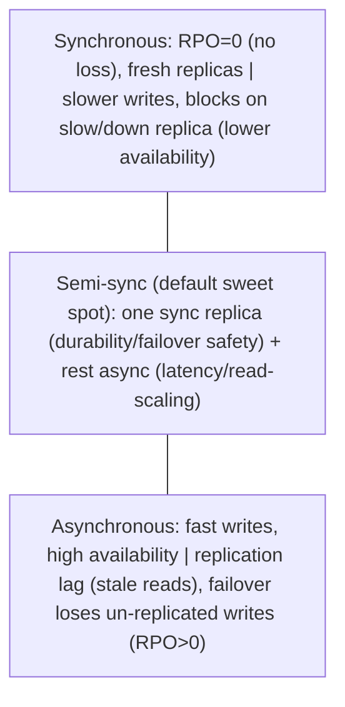

# Lesson 10.2 — Synchronous vs Asynchronous Replication; Replication Lag Effects

> Part 10: Consistency & Replication · Difficulty: 🔴
>
> **Prerequisites:** [10.1 Replication Topologies], [5.4.2 Replicas/Failover], [8.3.4 Quorums/ISR], [7.5 Read Scaling].
> **Unlocks:** [10.3 Read-Your-Writes/Lag Anomalies], [10.7 CAP], [10.8 PACELC], [Part 11 Failover/DR].

---

## 1. Learning Objectives

After this lesson you will be able to:

- Distinguish **synchronous** vs **asynchronous** replication (does the write wait for replicas before acking?) and the **semi-synchronous** middle ground, with their durability/latency/availability tradeoffs.
- Explain **replication lag** — the delay before a write propagates to replicas — its causes, and why it makes replicas **stale** (the source of the anomalies in 10.3).
- Reason about the **durability-vs-latency-vs-availability tradeoff**: sync = no data loss on failover but slower writes + blocks on a slow/down replica; async = fast/available but can **lose acknowledged writes** on failover.
- Connect this to **failover data loss** (the RPO — Part 11), the **ISR/acks** knob (9.3), and the **PACELC** framing (10.8) — the *else* (no partition) latency-vs-consistency choice.

---

## 2. Motivation — Does the write wait for the copies, or not?

Once you replicate (10.1), one deceptively simple question governs your durability, latency, and availability: **when a write happens, does the system wait for the replicas to confirm it before telling the client "done"?** This is the **synchronous vs asynchronous** replication choice, and it's one of the most consequential dials in distributed data systems — it sits behind database `acks` settings, Kafka's ISR (9.3), and the failover behavior that determines whether you **lose data** when a node dies.

The tradeoff is fundamental and unavoidable. **Synchronous replication** waits for replicas to confirm before acking the write → **no data loss on failover** (the replica already has it) and replicas are **fresh** (no lag for those replicas) — but writes are **slower** (wait for the round-trip to replicas) and **less available** (a **slow or down replica blocks writes** — you can't ack until it confirms). **Asynchronous replication** acks the write **immediately** (after the leader has it), then propagates to replicas in the background → **fast writes** and **high availability** (a slow/down replica doesn't block the leader) — but replicas **lag** (are stale), and, critically, a **failover can lose the last un-replicated writes** (the leader acked them but died before they reached a replica — permanent data loss the client thinks succeeded). Most systems default to **async** (for speed/availability) and accept bounded lag + a small data-loss window, or use **semi-synchronous** (wait for *one* replica synchronously for durability, the rest async) as a pragmatic compromise. This lesson makes the tradeoff precise, explains **replication lag** (which drives all the read anomalies in 10.3), and frames it as the **PACELC "else" choice** (latency vs consistency when there's no partition — 10.8). Getting this right is the difference between "we lost the last few seconds of orders when a node died" and "writes are too slow / an outage when one replica hiccups."

---

## 3. Theory — From first principles

### 3.1 The core question and the three modes

`[CS]` When a write occurs (to the leader, single-leader — 10.1), the system must decide **when to acknowledge success to the client** relative to **propagating to replicas**:
- **Synchronous replication:** the leader waits for **the replica(s) to confirm** they've received/persisted the write **before** acking the client. The write isn't "done" until replicas have it.
- **Asynchronous replication:** the leader acks the client **immediately** (once it has the write durably locally), then propagates to replicas **in the background**. The write is "done" from the client's view before replicas have it.
- **Semi-synchronous:** wait for **some but not all** replicas synchronously (typically **one**) and the rest asynchronously — a compromise (§3.5).

This maps directly to the **quorum/`acks`** knob (9.3/8.3.4): `acks=all` (+min-ISR) ≈ synchronous (wait for the in-sync replicas); `acks=1` ≈ leader-only (async to the rest); `acks=0` ≈ fire-and-forget.

### 3.2 Synchronous replication — tradeoffs

`[CS]`
- **Pros:** **No data loss on failover** — a confirmed replica already has every acked write, so promoting it loses nothing (**RPO = 0** — Part 11). Synchronous replicas are **always fresh** (no lag for them → strongly-consistent reads from them possible). 
- **Cons:** **Higher write latency** — every write pays the round-trip to replica(s) (worse across regions — geo-latency). **Reduced availability** — if a synchronous replica is **slow or down**, the leader **cannot ack** (it's waiting) → **writes block/fail** until the replica recovers or is removed from the sync set. So **synchronous replication makes write availability depend on the replica's availability** — a slow replica slows everyone; a down one can halt writes. (This is the **CAP consistency-over-availability** stance during a partition — 10.7.)
- **Use when:** data loss is unacceptable (financial ledgers, critical records) and you can tolerate the latency/availability cost. Rarely *all-synchronous* (too fragile) — usually **semi-sync** (§3.5).

### 3.3 Asynchronous replication — tradeoffs

`[CS]`
- **Pros:** **Fast writes** — the leader acks immediately, no waiting for replicas (best write latency). **High availability** — a slow/down replica **doesn't block** the leader (the leader keeps accepting writes; replicas catch up when able). Scales reads via replicas without slowing writes.
- **Cons — the big one — data loss on failover:** the leader acks a write, then **dies before propagating it** to any replica. On failover, a replica (missing that write) becomes leader → the **acked write is permanently lost** (the client was told "success," but it's gone — **RPO > 0**, a nonzero data-loss window equal to the lag at failure). **Replication lag** (§3.4) means replicas are **stale** → **stale reads** and the anomalies of 10.3.
- **Use when:** speed/availability matter more than a small failover-loss window and bounded staleness are acceptable — **the common default** for most systems (accepting the tradeoff).

### 3.4 Replication lag — what it is and its causes

`[CS]` **Replication lag** is the **delay between a write being applied on the leader and being applied on a replica** — the window during which the replica is **stale** (missing recent writes). It's inherent to **async** replication (and to the async portion of semi-sync). Causes:
- **Network latency** between leader and replica (especially cross-region — geo-lag).
- **Replica load / slowness** — a busy or underpowered replica applies changes slowly (falls behind).
- **Write spikes** — a burst of writes the replica can't apply as fast as the leader produces them → lag **grows** exactly when traffic is highest.
- **Long-running operations** on the replica blocking apply.

Lag is usually **milliseconds** but can spike to **seconds or more** under load/failure — and **unbounded lag** (a replica falling ever further behind) is a real operational hazard. **Monitor replication lag** (Part 16) — it's the key health metric for replica freshness and the driver of every read anomaly in 10.3.

### 3.5 Semi-synchronous replication — the pragmatic middle

`[CS]`/`[BP]` **Semi-synchronous** replication waits **synchronously for one (or a few) replica(s)** and **asynchronously for the rest**:
- **Guarantees:** at least **one** replica has every acked write → **failover to that replica loses nothing** (durability/RPO=0 for the sync replica) — the key benefit of sync.
- **Avoids full-sync fragility:** you don't wait for *all* replicas (which would make you as slow/fragile as the slowest), just one → **bounded latency** and better availability than full-sync.
- **Read scaling** via the async replicas (which lag).
- **The common production default** for durability-conscious systems (e.g., MySQL semi-sync, Postgres synchronous_commit with one sync standby): **durability + failover safety of sync (one replica) + read-scaling/latency of async (the rest).** If the sync replica is down, systems often **fall back to async** (or block, depending on config) — a safety-vs-availability choice.

### 3.6 Failover, data loss, and RPO

`[CS]` The **failover** behavior is where sync/async choice bites hardest (Part 11):
- **RPO (Recovery Point Objective):** how much data you can afford to lose on failure. **Sync = RPO 0** (no loss); **async = RPO > 0** (lose up to the lag-at-failure — could be seconds of writes).
- **The async failover loss:** leader acks writes → dies → a replica missing those writes is promoted → **those acked writes are gone** (and clients believe they succeeded — the worst kind of loss: silent, acknowledged). 
- **Split-brain risk on failover:** if the old leader returns (wasn't really dead — slow — 8.1.3) and both accept writes → divergence → **must fence** (8.3.6/8.3.5).
- **Failover unavailability:** even sync/async, failover has a **brief window** where no leader accepts writes (detection + election — 8.3.5) → **RTO (Recovery Time Objective)**.
So sync/async is really a **durability (RPO) vs latency/availability** choice, and failover design (fencing, quorum promotion, choosing a caught-up replica) determines correctness (Part 11).

### 3.7 The PACELC framing (the deeper lens)

`[CS]` This choice is best understood via **PACELC** (10.8): **if Partition (P) → choose Availability (A) or Consistency (C); Else (E, normal operation) → choose Latency (L) or Consistency (C).** Sync/async is largely the **"else" (no partition) L-vs-C choice**:
- **Async = choose Latency** (fast writes, but replicas lag → weaker consistency; on failover, possible loss).
- **Sync = choose Consistency** (fresh replicas, no failover loss, but higher latency + write-availability cost).
- During a **partition** (P), a sync system **blocks** (chooses C over A — can't reach the sync replica → refuse writes), while an async system **stays available** (chooses A, accepting lag/divergence). 
PACELC (10.8) captures that the tradeoff exists **both** during partitions **and** in normal operation — and sync/async replication is the concrete lever for the "else" latency-vs-consistency part. (CAP — 10.7 — covers only the partition case.)

### 3.8 Choosing and tuning

`[BP]`
| Need | Choice |
|---|---|
| Zero data loss on failover (money, critical records) | **Sync** (usually **semi-sync** — one sync replica) |
| Fast writes + high availability, bounded staleness OK | **Async** (the common default) |
| Balance durability + latency | **Semi-sync** (one sync replica + rest async) |
| Multi-region (avoid cross-region write latency) | usually **async** cross-region (accept lag) or async replicas |
| Read scaling | **async replicas** (accept lag → handle read-your-writes — 10.3) |

**Default: async (or semi-sync)** for most systems; **semi-sync** when you need failover durability without full-sync fragility; **full-sync** only for the most loss-intolerant data (accepting latency/availability cost). **Always monitor lag**, **fence failover**, and **handle read anomalies** (10.3). Tune per data class (a ledger vs a social feed) — often the same system uses different settings for different data.

---

## 4. Visual Intuition

### Sync vs async write path

```mermaid
sequenceDiagram
    participant C as Client
    participant L as Leader
    participant R as Replica
    Note over C,R: SYNCHRONOUS
    C->>L: write
    L->>R: replicate
    R-->>L: confirmed
    L-->>C: ack (only after replica has it) — no loss, but slower + blocks if R slow/down
    Note over C,R: ASYNCHRONOUS
    C->>L: write
    L-->>C: ack immediately (fast, available)
    L-->>R: replicate in background (replica LAGS; failover before this = LOST write)
```

### The tradeoff triangle



---

## 5. Real-World Analogy

Imagine a **manager (leader) recording decisions** and needing **assistants (replicas)** to have copies for safety.

- **Synchronous:** the manager makes a decision and **won't consider it official until an assistant has written it down too.** So a decision is **never lost** — even if the manager is hit by a bus right after, the assistant has it (no data loss). But the manager has to **wait for the assistant to confirm** before moving on (slower), and if the assistant is **out sick or slow**, the manager is **stuck** — can't finalize any decisions until the assistant is available (reduced availability). Great for **irreversible, critical** decisions (a signed contract), painful as a default.
- **Asynchronous:** the manager **declares each decision official immediately** and tells the assistants **afterward** (they copy it down when they get around to it). The manager is **fast** and **never blocked** by a slow assistant. But there's a catch: if the manager is **hit by a bus right after declaring a decision** but **before any assistant copied it**, that decision is **lost forever** — even though everyone was told it was "official" (the worst kind of loss). And the assistants' copies are always **a little behind** (lag → if you ask an assistant, you might get a stale answer).
- **Semi-synchronous (the sweet spot):** the manager waits for **just one trusted assistant** to confirm each decision (so it's never fully lost — that one assistant always has it), but **doesn't wait for all** of them. Fast enough, and durable enough — you get the safety of "someone always has a copy" without being held hostage by the slowest assistant. This is what most careful offices actually do.
- **The failover moment:** when the manager is gone and an **assistant takes over** (failover), with synchronous/semi-sync the new manager **has everything**; with pure asynchronous they might be **missing the last few decisions** the old manager declared but never shared — which are now permanently lost.

---

## 6. Industry Example

- **MySQL/Postgres semi-synchronous** `[CONV]`: wait for one standby to confirm (durability/failover safety) while others replicate async (read scaling) — the common durability-conscious default (§3.5). *(Representative.)*
- **Kafka acks + ISR** `[CONV]`: `acks=all` + min-ISR ≈ synchronous (wait for in-sync replicas → no loss); `acks=1` ≈ leader-only (async); `acks=0` ≈ fire-and-forget — the sync/async knob for the log (9.3, §3.1). *(Representative.)*
- **Async cross-region replicas** `[CONV]`: geo-distributed reads served by async replicas (accepting lag) to avoid cross-region write latency; sync cross-region is usually too slow (§3.8, Part 13). *(Representative.)*
- **Failover data-loss incidents** `[CONV]`: async-replication failovers that lost the last seconds of acked writes — the classic RPO>0 consequence (§3.6, Part 11). *(Representative.)*
- **PACELC classifications** `[CS]`: systems classified as PA/EL (Dynamo/Cassandra — available + low-latency, eventual) vs PC/EC (Spanner — consistent even at latency cost) — the sync/async "else" choice made explicit (10.8, §3.7). *(Representative.)*

---

## 7. Implementation Details — choosing and operating

- **Default to async (or semi-sync)** for most systems (speed/availability); use **semi-sync** (one sync replica) when you need **failover durability (RPO≈0)** without full-sync fragility (§3.5/3.8) `[BP]`.
- **Reserve full-sync** for the most loss-intolerant data, accepting write latency + availability cost (a slow/down sync replica blocks writes) (§3.2).
- **Set the acks/ISR knob deliberately** (9.3) per durability need: `acks=all`+min-ISR (no loss) vs `acks=1` (fast, lossy) (§3.1).
- **Monitor replication lag** (per replica) — the key freshness metric; alert on growing/unbounded lag (§3.4, Part 16).
- **Design failover for correctness** — promote a **caught-up** replica, **fence** the old leader (8.3.6/8.3.5), use **quorum** promotion — and know your **RPO (async loss window) and RTO (failover time)** (§3.6, Part 11).
- **Handle read anomalies from lag** (10.3) — route read-your-writes to the leader/caught-up replica; accept bounded staleness elsewhere.
- **Cross-region: usually async** (sync cross-region latency is often prohibitive) — or use bounded-uncertainty/consensus systems (Spanner — 8.2.4) if you need strong cross-region consistency (accepting their cost) (§3.8, Part 13).
- **Tune per data class** — a ledger (semi-sync/sync) vs a feed (async) in the same system (§3.8).

---

## 8. Advantages

- **Sync:** no data loss on failover (RPO=0), fresh replicas (strongly-consistent reads possible), durability guarantee.
- **Async:** fast writes (immediate ack), high write availability (slow/down replica doesn't block), read scaling without slowing writes.
- **Semi-sync:** durability/failover-safety of sync (one replica) + latency/read-scaling of async — the pragmatic best-of-both (§3.5).
- **Tunable (acks/ISR):** dial durability vs latency per topic/data class (9.3, §3.1).

---

## 9. Disadvantages

- **Sync:** higher write latency; **reduced availability** (a slow/down sync replica blocks writes); worse cross-region (§3.2).
- **Async:** **replication lag → stale reads** (anomalies — 10.3); **failover loses un-replicated acked writes** (RPO>0 — silent, acknowledged loss) (§3.3/3.6).
- **Semi-sync:** still some async lag on the async replicas; behavior when the sync replica is down (block vs fall back to async) is a config tradeoff (§3.5).
- **All:** failover has an **unavailability window** (RTO) and **split-brain risk** without fencing (§3.6, 8.3.5/8.3.6).

---

## 10. When NOT to / limits

- **Don't use full-sync as a default** — its latency + write-availability cost (blocks on a slow replica) is usually too high; prefer semi-sync (§3.2/3.5).
- **Don't use async for zero-loss-required data** without accepting the RPO>0 failover-loss window — use semi-sync/sync for money/critical records (§3.3/3.6).
- **Don't serve read-your-writes / freshness-critical reads from lagging async replicas** — route to leader/caught-up replica (10.3).
- **Don't use sync cross-region** if the latency is prohibitive — async or a purpose-built strong-consistency system (§3.8).
- **Don't ignore replication lag** — unbounded lag is stale reads + a large failover-loss window (§3.4).
- **Don't fail over to a stale replica without fencing/quorum** — data loss + split brain (§3.6).

---

## 11. Common Mistakes

1. **Async replication + assuming no data loss on failover** → losing the last seconds of acked writes when the leader dies (RPO>0) (§3.3/3.6).
2. **Full-sync as default** → writes blocked/slowed by a single slow replica; availability suffers (§3.2).
3. **Reading freshness-critical data from lagging replicas** → stale reads (read-your-writes violation — 10.3).
4. **Not monitoring replication lag** → unbounded lag / large loss window undetected (§3.4).
5. **Failover to a stale/uncaught-up replica** → extra data loss (§3.6).
6. **No fencing on failover** → old leader returns → split brain (§3.6, 8.3.6).
7. **Same replication mode for all data** → over-paying (sync for a feed) or under-protecting (async for money) (§3.8).
8. **Sync cross-region** → prohibitive write latency (§3.8).

---

## 12. Interview Questions

**🟢 Easy**
- What's the difference between synchronous and asynchronous replication?
- What is replication lag, and what causes it?

**🟡 Medium**
- Explain the durability-vs-latency-vs-availability tradeoff of sync vs async. Why can async lose data on failover?
- What is semi-synchronous replication, and why is it a common default?

**🔴 Hard**
- Walk through exactly how async replication loses an acknowledged write on failover, and how sync/semi-sync prevent it (RPO). What's the availability cost of sync?
- Relate sync/async to PACELC. What does each choose in the "else" (no-partition) case, and what happens during a partition?

**⚫ Staff+**
- Design replication for a system with a financial ledger (no loss allowed) and a social feed (staleness OK), across two regions. Choose sync/async/semi-sync per data class, address cross-region latency, failover RPO/RTO, fencing, and read anomalies — justifying each.
- Your team runs async replication and lost 8 seconds of orders when the primary crashed and a replica was promoted. Diagnose (RPO>0 from async lag), and design a fix (semi-sync for orders, monitoring lag, caught-up+fenced failover) with its latency/availability tradeoffs.

---

## 13. Production Pitfalls

- **Failover data loss (RPO>0):** async primary acks writes, crashes; a lagging replica is promoted; the last N seconds of acked writes are **permanently lost** — clients were told "success" (§3.3/3.6) — the classic async incident.
- **Write stall from a slow sync replica:** full-sync (or sync-required) config; one replica gets slow → all writes block/fail until it recovers or is removed (§3.2).
- **Unbounded lag under load:** a write spike makes a replica fall ever further behind → stale reads worsen + failover-loss window grows exactly when traffic is highest (§3.4).
- **Stale-read incident:** freshness-critical read served from a lagging replica → wrong balance/state (read-your-writes violation — 10.3).
- **Split brain on failover:** old (slow, not dead) leader returns; both accept writes; no fencing → divergence (§3.6, 8.3.6).
- **Failover to stale replica:** promoting an uncaught-up replica loses even more than necessary (§3.6).

---

## 14. Optimization Techniques

- **Semi-sync (one sync replica + rest async)** — durability/failover safety + latency/read-scaling (§3.5/3.8) `[BP]`.
- **Tune acks/ISR per data class** — `acks=all`+min-ISR for no-loss, `acks=1` for fast/lossy (9.3, §3.1).
- **Monitor + alert on replication lag** (per replica); cap/act on unbounded lag (§3.4, Part 16).
- **Caught-up + fenced, quorum-gated failover** — minimize loss, prevent split brain (§3.6, 8.3.5/8.3.6, Part 11).
- **Route freshness-critical reads to leader/caught-up replica**; accept staleness elsewhere (10.3, 7.5).
- **Async cross-region** (or Spanner-style strong-consistency system if needed) to avoid prohibitive sync latency (§3.8, 8.2.4, Part 13).
- **Per-data-class replication settings** — sync/semi-sync for critical, async for staleness-tolerant (§3.8).

---

## 15. Summary

Once you replicate (10.1), the pivotal question is **whether a write waits for replicas before acking** — the **synchronous vs asynchronous** choice. **Synchronous replication** waits for replica(s) to confirm before acking → **no data loss on failover (RPO=0)** and **fresh replicas** (strongly-consistent reads possible), but **higher write latency** and **reduced availability** (a **slow or down synchronous replica blocks writes** — write availability depends on replica availability). **Asynchronous replication** acks **immediately** and propagates in the background → **fast writes** and **high availability** (a slow/down replica doesn't block the leader), but replicas **lag** (stale) and — critically — a **failover can permanently lose the last acknowledged, un-replicated writes** (RPO>0, silent loss the client thought succeeded). **Semi-synchronous** (wait for **one** replica synchronously, the rest async) is the **pragmatic default** — durability/failover-safety of sync (one replica always has every write) without full-sync fragility, plus async read-scaling. This maps to the **acks/ISR** knob (9.3): `acks=all`+min-ISR ≈ sync, `acks=1` ≈ async, `acks=0` ≈ fire-and-forget. **Replication lag** — the delay before a write reaches a replica (from network latency, replica load, write spikes) — makes async replicas **stale** and is the root cause of the read anomalies in 10.3; it's usually ms but can spike to seconds and even grow unbounded, so **monitor it**. The choice is fundamentally **durability (RPO) vs latency vs availability**, and it's best framed by **PACELC** (10.8): sync/async is largely the **"else" (no-partition) latency-vs-consistency** choice (async=Latency, sync=Consistency), while during a **partition** sync **blocks** (C over A) and async **stays available** (A). **Default to async or semi-sync** (semi-sync when failover durability matters), reserve **full-sync** for the most loss-intolerant data (accepting its latency/availability cost), **tune per data class** (ledger vs feed), **monitor lag**, design **caught-up + fenced, quorum-gated failover** (minimize RPO, prevent split brain — Part 11/8.3.6), and **handle read-your-writes** anomalies from lag (10.3).

---

## 16. Revision Notes (flashcard-ready)

- **Q:** Sync vs async replication? **A:** Sync waits for replicas before acking (no loss, fresh, but slow + blocks on slow replica); async acks immediately (fast, available, but lag + failover loss).
- **Q:** Async's big risk? **A:** Failover loses the last acked, un-replicated writes (RPO>0) — silent, acknowledged loss.
- **Q:** Sync's big cost? **A:** Higher write latency + reduced availability (a slow/down sync replica blocks writes).
- **Q:** Semi-sync? **A:** Wait for one replica synchronously (durability/failover safety) + rest async (latency/read-scaling) — common default.
- **Q:** acks/ISR mapping? **A:** acks=all+min-ISR ≈ sync; acks=1 ≈ async (leader-only); acks=0 ≈ fire-and-forget.
- **Q:** Replication lag? **A:** Delay before a write reaches a replica (network, replica load, write spikes) → stale replicas; drives read anomalies (10.3).
- **Q:** RPO vs RTO? **A:** RPO = data you can lose on failure (sync=0, async>0); RTO = time to recover (failover window).
- **Q:** PACELC framing? **A:** Sync/async ≈ the "else" (no-partition) Latency-vs-Consistency choice; async=L, sync=C; during partition sync blocks (C), async stays available (A).
- **Q:** Default choice? **A:** Async or semi-sync; full-sync only for loss-intolerant data; tune per data class; monitor lag; fenced caught-up failover.
- **Q:** Cross-region? **A:** Usually async (sync latency prohibitive) — or a purpose-built strong-consistency system (Spanner — 8.2.4).

---

## 17. Further Reading + Knowledge-Graph Links

**Within this platform**
- **Previous:** [10.1 Replication Topologies] (who accepts writes). **Builds on:** [5.4.2 Replicas/Failover], [8.3.4 Quorums/ISR/acks], [7.5 Read Scaling], [8.1.3 slow-vs-dead], [8.3.5/8.3.6 failover/fencing].
- **Next:** [10.3 Read-Your-Writes & Lag Anomalies] (the consequences of lag). **Then:** [10.7 CAP], [10.8 PACELC] (the framing).
- **Enables:** [Part 11 Failover/DR/RPO-RTO], [Part 13 Multi-region], [8.2.4 Spanner] (strong cross-region).

**Foundational texts (synthesized)**
- Kleppmann, *Designing Data-Intensive Applications* — synchronous/asynchronous replication, replication lag, failover (synthesized).
- Abadi, "Consistency Tradeoffs in Modern Distributed Database System Design" (PACELC) (concept, synthesized).
- Database replication documentation (MySQL/Postgres semi-sync, Kafka acks/ISR) — representative.

**Concept tags:** `[CS]` sync vs async replication, replication lag, RPO/RTO, failover data loss, PACELC "else" choice · `[CONV]` semi-sync default, acks/ISR knob, async cross-region · `[BP]` default async/semi-sync, full-sync only for loss-intolerant, monitor lag, caught-up+fenced failover, tune per data class.
