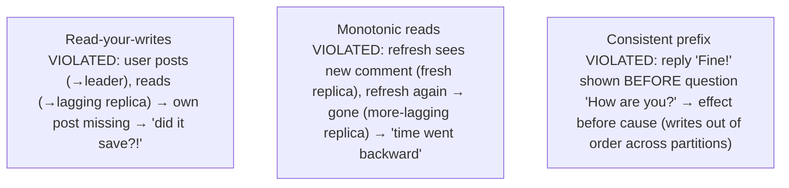
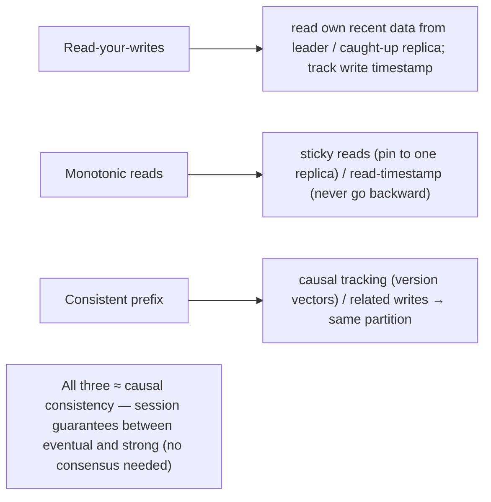

# Lesson 10.3 — Read-Your-Writes, Monotonic Reads, Consistent Prefix Reads

> Part 10: Consistency & Replication · Difficulty: 🔴
>
> **Prerequisites:** [10.2 Replication Lag], [10.1 Topologies], [7.5 Read Scaling], [8.2.2 Causal Ordering], [6.5 Read-Your-Writes in caching].
> **Unlocks:** [10.5 Consistency Spectrum], [10.4 Conflict Resolution], [Part 12 Microservices], [Part 20 Capstone].

---

## 1. Learning Objectives

After this lesson you will be able to:

- Explain the three **client-centric consistency guarantees** that combat replication-lag anomalies — **read-your-writes (read-after-write)**, **monotonic reads**, and **consistent prefix reads** — precisely, with the anomaly each prevents.
- Recognize these anomalies in real systems (stale reads from lagging replicas — 10.2) and the concrete user-facing bugs they cause ("I posted but don't see it," data "going backward," effects appearing before causes).
- Apply the standard **mitigations** — route reads to the leader/caught-up replica, sticky reads (pin to one replica), track a read timestamp/version — matching each guarantee.
- Place these guarantees on the **consistency spectrum** (10.5) as **weaker-than-strong but stronger-than-bare-eventual** session guarantees, and connect to **causal consistency** (8.2.2/10.5).

---

## 2. Motivation — The everyday bugs of "eventually consistent" reads

Async replication (10.2) gives you read scaling and availability, but its replication lag means replicas are **stale** — and reading from stale replicas produces a family of **user-facing anomalies** that are among the most common and confusing bugs in distributed systems. You've met the headline one already (7.5/6.5): a user **posts a comment**, then immediately reloads and **doesn't see their own comment** (their write went to the leader; their read hit a lagging replica) — "did it not save?!" But there are two more, equally real: a user refreshes and sees data **go backward in time** (a comment appears, then vanishes on the next refresh, because successive reads hit replicas with *different* lag), and a viewer sees **effects before their causes** (a reply shown before the message it replies to, because writes arrived at a replica out of causal order).

These anomalies aren't "bugs in the code" — they're the **inherent consequence of eventual consistency** (reading possibly-stale copies), and eliminating them entirely requires **strong consistency** (10.5/10.6), which is expensive and often unavailable (CAP — 10.7). The pragmatic and widely-used answer is a set of **session (client-centric) guarantees** that are **weaker than strong consistency but far stronger than bare eventual consistency** — they don't make the whole system linearizable, they just guarantee that a **single client's own experience is sensible**: **read-your-writes** (you always see your own writes), **monotonic reads** (you never see time go backward), and **consistent prefix reads** (you see writes in causal order). These three are the practical toolkit for making eventually-consistent systems *feel* correct to users, at a fraction of strong consistency's cost. This lesson defines each precisely, the anomaly it prevents, and how to implement it — essential for anyone building on replicas, caches, or any eventually-consistent store.

---

## 3. Theory — From first principles

### 3.1 The setup — anomalies from reading stale replicas

`[CS]` With async replication (10.2), writes go to the leader and propagate to replicas with **lag** → replicas are **stale**. Reading from these (for read scaling — 7.5) or across differently-lagged replicas produces anomalies. **Eventual consistency** only promises that *if writes stop, replicas eventually converge* — it makes **no promise about what a client sees in the meantime**, including about the client's *own* actions or the *order* of what they see. The three guarantees below add **client-centric (session) promises** on top of eventual consistency to eliminate the most jarring anomalies — **without** requiring full strong consistency (10.5).

### 3.2 Read-your-writes (read-after-write) consistency

`[CS]` **Guarantee:** after a client **writes** a value, that **same client** will **always see its own write** in subsequent reads (never a stale value older than its own write).
- **Anomaly it prevents:** the classic "**I updated my profile / posted a comment, then reloaded and it's gone**" — the write went to the leader, the read hit a lagging replica missing it. Deeply confusing (users assume the write failed and retry → duplicates).
- **Scope:** a guarantee about the client seeing **its own** writes — **not** about seeing *other* clients' writes promptly (that's stronger). It makes the user's *own* actions consistent.
- **Mitigations** `[BP]`:
  - **Read from the leader** for data the user may have just written (e.g., read a user's own profile from the leader for a short window after a write). Simple, common.
  - **Route to a caught-up replica** — track the write's position (timestamp/version/log offset) and read from a replica known to have applied at least up to it.
  - **Remember recent writes client-side / track a "write timestamp"** and ensure the read reflects at least that timestamp.
  - For **caches** (6.5): invalidate/update on the user's write, or read the user's own data from the source for a window.

### 3.3 Monotonic reads

`[CS]` **Guarantee:** if a client reads a value, subsequent reads by that client will **never see an older value** — reads **move forward in time (or stay), never backward**.
- **Anomaly it prevents:** **"time going backward"** — a user refreshes and sees a new comment (read hit an up-to-date replica), refreshes again and it **disappears** (read hit a *more lagging* replica). Because different reads hit **replicas with different lag**, successive reads can regress. Monotonic reads guarantees each read is **at least as fresh** as the previous one for that client.
- **Note:** monotonic reads is **weaker** than read-your-writes about *other* clients' data but specifically prevents *regression* across a client's reads.
- **Mitigations** `[BP]`:
  - **Sticky reads / session affinity to one replica** — pin a client to a **single replica** so all its reads come from the same (monotonically-advancing) source → no regression (the replica only moves forward). (Note: this reduces load-balancing flexibility — 7.2 sticky-session caveats; and if that replica fails, re-pin to a caught-up one.)
  - **Track a read timestamp/version** and only read from replicas at least that fresh (never go backward).

### 3.4 Consistent prefix reads

`[CS]` **Guarantee:** if a sequence of writes happens in a **causal order** (A then B, where B depends on A — 8.2.2), then anyone reading them sees them in **that order** — never B before A. Reads see a **consistent prefix** of the write history (writes in causal/committed order, no gaps that violate causality).
- **Anomaly it prevents:** **effects before causes** — the classic example: a **conversation** where person A asks "How are you?" and B replies "Fine!" — a viewer sees the **reply "Fine!" before the question** (nonsensical), because the two writes arrived at the replica **out of order** (especially across partitions — 9.3/8.2.3, where cross-partition order isn't guaranteed). Consistent prefix reads ensures **causally-ordered writes are read in causal order**.
- **Relationship to causal consistency:** consistent prefix reads is closely tied to **causal consistency** (10.5/8.2.2) — preserving the **happens-before** order (8.2.3) so effects never precede causes. It's especially relevant in **partitioned/sharded** systems where related writes land in different partitions (9.5).
- **Mitigations** `[BP]`: track **causal dependencies** (version vectors — 8.2.2; or ensure causally-related writes go to the **same partition** — 9.5 — so their order is preserved), or use a system providing **causal consistency** (10.5).

### 3.5 These are session/client-centric guarantees (not global)

`[CS]` A crucial framing: read-your-writes, monotonic reads, and consistent prefix reads are **client-centric (session) guarantees** — they promise a **single client/session a sensible experience**, **not** a globally-consistent view for everyone `[CS]`:
- They sit **between** bare **eventual consistency** (no promises) and **strong consistency** (10.5/10.6 — a single global up-to-date view) on the spectrum (10.5).
- They're **much cheaper than strong consistency** (achievable with routing/sticky-reads/version-tracking, no consensus — 8.3) while eliminating the **most jarring, common anomalies**.
- **They can be combined** (a session may want all three), and together they approximate **causal consistency** (10.5) — the "sweet spot" that prevents anomalies without strong-consistency cost.
- **Limitation:** they don't guarantee a client sees *others'* writes promptly (that's strong consistency), nor that two clients see the same thing at the same time. They make **each client's own experience** sensible — which is what fixes the visible bugs.

### 3.6 Choosing which guarantee(s) and the cost

`[BP]`
| Anomaly / need | Guarantee | Typical mitigation |
|---|---|---|
| "I don't see my own write" | **Read-your-writes** | read own recent data from leader/caught-up replica |
| Data "goes backward" on refresh | **Monotonic reads** | sticky reads (pin to one replica) / read-timestamp |
| Effect shown before cause (reply before question) | **Consistent prefix reads** | causal tracking / same-partition for related writes |
| A sensible per-user experience overall | **All three (≈ causal consistency)** | combination of the above |
| A single global up-to-date truth | **Strong consistency (10.5/10.6)** | leader reads / consensus (expensive) |

- **Cost ladder:** eventual (cheapest, anomalies) → session guarantees (cheap, no jarring anomalies) → causal (moderate) → strong (expensive/less available — CAP). 
- **Default** `[BP]`: use **session guarantees** to make eventually-consistent reads *feel* correct per user; reserve **strong consistency** for data where any staleness is unacceptable (money — read from leader). Match the guarantee to the anomaly that actually hurts users.

### 3.7 Interaction with topology, caching, and microservices

`[CS]` These anomalies and guarantees appear wherever there are **stale copies**:
- **Read replicas (10.1/10.2/7.5):** the primary source — route read-your-writes to the leader/caught-up replica; sticky reads for monotonic.
- **Caches (Part 6, 6.5):** a cache is a stale copy → same read-your-writes/monotonic concerns (6.5 covers cache read-your-writes).
- **Leaderless (10.1):** quorum reads + read repair help, but concurrent writes/lag still need these guarantees.
- **Microservices (Part 12):** a service reading another service's replicated/CDC'd data (9.8) sees lag → the consumer must tolerate/handle staleness (eventual consistency across services).
- **CDC-fed derived stores (9.8):** search index/materialized view lags the source → read-your-writes may require reading the source for a window.
So these guarantees are a **cross-cutting concern** for any system with replicas/caches/derived data — not just databases.

---

## 4. Visual Intuition

### The three anomalies

### Mitigations

---

## 5. Real-World Analogy

Imagine you and others share information through a **bank of bulletin boards**, where a central office posts updates but each board gets them **at slightly different times** (replication lag).

- **Read-your-writes:** you **pin a note to the central office** ("Meeting moved to 3pm"), then walk to a **nearby board to double-check** — and your note **isn't there yet** (that board hasn't received the update). Panicked, you think "did my note not post?" and pin it **again** (duplicate). The fix: after posting, **check the central office's own board** (the leader) for a bit — where your note is guaranteed to appear — so you always see **your own** updates.
- **Monotonic reads:** you check board #1 and see "**Alice joined the team**." Later you check board #2 (which lags more) and Alice's announcement is **gone** — as if she un-joined! Information **went backward** because the two boards are at different freshness. The fix: **always check the same board** (sticky reads) — since a single board only ever **moves forward**, you'll never see news disappear.
- **Consistent prefix reads:** on a board you see the reply "**Yes, let's do it!**" posted **above** (before) the question "**Should we launch Friday?**" — because the two notes arrived at that board out of order. A reader sees the **answer before the question** — nonsense. The fix: ensure **causally-related notes** (a question and its reply) are **ordered together** (e.g., posted through the same channel) so you always see the **question before its answer** (cause before effect).
- **The key insight:** you don't need **every board to be perfectly identical at every instant** (that would be strong consistency — expensive, and requires stopping the presses during a mail outage). You just need **each person's own experience to make sense**: they see their own posts, news doesn't reverse, and answers don't precede questions. These **per-person guarantees** are cheap and eliminate the maddening bugs — even though the boards are still "eventually consistent."

---

## 6. Industry Example

- **Read-your-writes via leader reads** `[BP]`: apps read a user's own just-written data from the primary (or a caught-up replica) for a short window to avoid "I don't see my post" (§3.2, 7.5). *(Representative.)*
- **Sticky reads for monotonic reads** `[CONV]`: pinning a session to one replica so successive reads don't regress (§3.3). *(Representative.)*
- **Consistent prefix / causal in partitioned systems** `[CONV]`: the "reply before question" anomaly in sharded/partitioned stores; fixed by causal tracking or keying related writes to the same partition (9.5, §3.4). *(Representative.)*
- **Session consistency (Cosmos DB, MongoDB causal sessions)** `[EMERGING]`: databases offering explicit **session-level** guarantees (read-your-writes, monotonic reads, consistent prefix) as a tunable level between eventual and strong (§3.5). *(Representative.)*
- **Cache read-your-writes** `[BP]`: invalidating/refreshing on the user's own write, or reading the source for a window, to avoid the user seeing a stale cache of their own change (6.5, §3.7). *(Representative.)*

---

## 7. Implementation Details — providing session guarantees

- **Identify which reads need which guarantee** (§3.6) — a user's own recently-written data (read-your-writes), successive reads in a session (monotonic), causally-related data (consistent prefix) — and apply the matching mitigation `[BP]`.
- **Read-your-writes:** route a user's reads of their own data to the **leader** (or a **caught-up replica** via tracked write version/timestamp/offset) for a window after their write (§3.2, 7.5); for caches, invalidate/refresh on the write (6.5).
- **Monotonic reads:** use **sticky reads** (pin the session to one replica — it only advances) or **track a read timestamp/version** and never read staler (§3.3). Re-pin to a caught-up replica on failure.
- **Consistent prefix reads:** **keep causally-related writes in the same partition** (9.5) so their order is preserved, or track **causal dependencies** (version vectors — 8.2.2), or use a **causally-consistent** system (10.5) (§3.4).
- **Prefer session guarantees over full strong consistency** where they suffice — much cheaper (no consensus), and they eliminate the jarring anomalies (§3.5/3.6).
- **Reserve strong consistency (leader reads / consensus)** for data where **any** staleness is unacceptable (money, inventory-at-checkout) (§3.6, 10.5).
- **Apply across all stale-copy layers** — replicas, caches, CDC-derived stores, cross-service reads (§3.7, 6.5, 9.8, Part 12).
- **Monitor replication lag** (10.2) — larger lag → worse anomalies → adjust routing (Part 16).

---

## 8. Advantages

- **Eliminates the most jarring, common anomalies** (own-write missing, time reversal, effect-before-cause) — a sensible per-user experience (§3.2–3.4).
- **Much cheaper than strong consistency** — routing/sticky/version-tracking, no consensus (§3.5).
- **Keeps read scaling / availability** of eventual consistency while fixing the visible bugs (§3.5, 7.5).
- **Composable** — combine the three for near-causal consistency per session (§3.5).
- **Cross-cutting** — applies to replicas, caches, derived stores, microservices (§3.7).

---

## 9. Disadvantages / limitations

- **Not global consistency** — they make *one client's* experience sensible, not a globally-consistent view; other clients may see different/stale data (§3.5).
- **Mitigation costs:** leader reads reduce read-scaling benefit; sticky reads reduce load-balancing flexibility and complicate failure handling (§3.2/3.3, 7.2).
- **Complexity:** tracking write/read timestamps/versions, causal dependencies, and routing logic (§3.2–3.4).
- **Still eventual for others' data** — a client may not promptly see *other* clients' writes (that's strong consistency) (§3.5).
- **Consistent prefix is hard across partitions** — needs causal tracking or same-partition keying (§3.4, 9.5).

---

## 10. When NOT to / limits

- **Don't rely on session guarantees for globally-strong needs** — money/inventory that must be globally fresh needs strong consistency (leader/consensus) (§3.6, 10.5).
- **Don't add sticky reads** if load-balancing flexibility matters more than monotonic reads and the anomaly is tolerable (§3.3).
- **Don't route everything to the leader** for read-your-writes — that defeats read scaling; scope it to the user's own recently-written data (§3.2).
- **Don't ignore these anomalies** on user-facing eventually-consistent reads — they cause real confusion/retries/duplicates (§3.2).
- **Don't assume eventual consistency alone is "fine"** — the anomalies are real and user-visible without session guarantees (§3.1).

---

## 11. Common Mistakes

1. **Reading a user's own write from a lagging replica** → "I don't see my post" → user retries → duplicates (§3.2).
2. **Round-robining a session across replicas with different lag** → monotonic-read violation (data goes backward) (§3.3).
3. **Related writes across partitions without causal tracking** → consistent-prefix violation (reply before question) (§3.4, 9.5).
4. **Assuming eventual consistency is anomaly-free** → the three anomalies surprise users (§3.1).
5. **Over-using strong consistency** for anomalies that session guarantees would fix cheaply (§3.6).
6. **Routing all reads to the leader** for read-your-writes → loses read scaling (§3.2).
7. **Sticky reads with no failover plan** → when the pinned replica fails, re-pinning to a laggier one regresses (§3.3).
8. **Ignoring these in caches/CDC-derived stores** → same anomalies at those layers (§3.7, 6.5, 9.8).

---

## 12. Interview Questions

**🟢 Easy**
- What is read-your-writes consistency, and what bug does it prevent?
- What is monotonic reads consistency?

**🟡 Medium**
- Explain all three anomalies (read-your-writes, monotonic reads, consistent prefix) with a concrete example each, and a mitigation for each.
- Why are these called session/client-centric guarantees, and where do they sit on the consistency spectrum?

**🔴 Hard**
- Design read routing for a read-scaled system (leader + lagging replicas) that provides read-your-writes and monotonic reads without routing all reads to the leader.
- How do you get consistent prefix reads in a partitioned/sharded system where related writes can land in different partitions? (Causal tracking / same-partition keying.)

**⚫ Staff+**
- A social app on read replicas suffers "I don't see my comment," "comments disappear on refresh," and "replies shown before the original." Diagnose each (which session guarantee is violated) and design the fixes (read-your-writes routing, sticky/monotonic reads, consistent-prefix via causal tracking/partitioning), balancing against read-scaling and load-balancing.
- Compare session guarantees vs strong consistency for a mixed workload (user profiles, feeds, account balances). Which data gets which guarantee and why, and what's the cost of each? Tie to the consistency spectrum (10.5) and CAP/PACELC (10.7/10.8).

---

## 13. Production Pitfalls

- **"My post didn't save" duplicate storm:** users don't see their own writes (lagging replica) → retry → duplicate posts/orders (§3.2) — the classic read-your-writes incident.
- **Disappearing data:** monotonic-read violation from round-robining across differently-lagged replicas → users see content vanish/reappear (§3.3).
- **Reply-before-question:** consistent-prefix violation in a partitioned store → nonsensical ordering visible to users (§3.4).
- **Read-scaling lost:** over-correcting by routing all reads to the leader → the leader is overloaded, read scaling gone (§3.2).
- **Sticky-read failover regression:** the pinned replica fails; the session re-pins to a laggier one → data regresses (§3.3).
- **Cache/CDC-layer anomalies:** the same anomalies appear at the cache (6.5) or CDC-derived store (9.8) if not handled there (§3.7).
- **Money staleness:** treating a balance with session guarantees when it needs strong consistency → user acts on a stale balance (§3.6).

---

## 14. Optimization Techniques

- **Scope read-your-writes to the user's own recently-written data** (leader/caught-up replica) — keep read scaling for everything else (§3.2, 7.5) `[BP]`.
- **Track write/read timestamps/versions** to route to caught-up replicas (read-your-writes + monotonic) without always hitting the leader (§3.2/3.3).
- **Sticky reads per session** for monotonic reads (with caught-up re-pinning on failure) (§3.3).
- **Keep causally-related writes in the same partition** (9.5) for consistent prefix reads cheaply (§3.4).
- **Combine the three for near-causal consistency** per session — the anomaly-free sweet spot without strong-consistency cost (§3.5, 10.5).
- **Reserve strong consistency for the few data types that need it** (money) — read from leader/consensus (§3.6).
- **Apply at every stale-copy layer** (replicas, caches, CDC stores) and **monitor lag** (§3.7, 10.2, 6.5, 9.8).

---

## 15. Summary

Async replication's **lag** (10.2) makes replicas **stale**, and reading stale copies produces three user-facing **anomalies** that **eventual consistency alone does nothing to prevent**: **read-your-writes violations** (a user writes then reads a lagging replica and **doesn't see their own write** — "did it save?!" → retries/duplicates), **monotonic-read violations** (successive reads hit **differently-lagged** replicas so data appears to **go backward** — a comment appears then vanishes), and **consistent-prefix violations** (writes read **out of causal order** — a reply shown **before** the question, an **effect before its cause**, especially across partitions where cross-partition order isn't guaranteed — 9.3/8.2.3). The three **client-centric (session) guarantees** that prevent them are **read-your-writes** (a client always sees **its own** writes — mitigate by reading its recently-written data from the **leader/caught-up replica** or tracking a write version), **monotonic reads** (a client's reads **never go backward** — mitigate with **sticky reads** pinning the session to one replica, or a read-timestamp), and **consistent prefix reads** (causally-ordered writes are **read in causal order** — mitigate by **causal tracking (version vectors — 8.2.2)** or keeping **related writes in the same partition** — 9.5). Crucially, these are **session/client-centric** guarantees — they make **a single client's own experience sensible**, **not** a globally-consistent view — so they sit **between bare eventual consistency (no promises) and strong consistency (10.5/10.6)** on the spectrum, are **far cheaper than strong consistency** (routing/sticky/version-tracking, **no consensus** — 8.3), and **combined approximate causal consistency** (10.5) — the anomaly-free sweet spot. They apply wherever there are **stale copies**: read replicas (7.5), caches (6.5), leaderless stores (10.1), CDC-derived stores (9.8), and cross-service reads (Part 12). **Default to session guarantees** to make eventually-consistent reads *feel* correct per user (scoping read-your-writes to the user's own data to preserve read scaling); **reserve strong consistency** (leader reads/consensus) only for data where **any** staleness is unacceptable (money) — matching each guarantee to the anomaly that actually hurts users, and **monitoring replication lag** (10.2) since larger lag means worse anomalies.

---

## 16. Revision Notes (flashcard-ready)

- **Q:** Read-your-writes? **A:** A client always sees its OWN writes in later reads (prevents "I posted but don't see it").
- **Q:** Read-your-writes mitigation? **A:** Read the user's own recent data from the leader / a caught-up replica (track write version); invalidate cache on write.
- **Q:** Monotonic reads? **A:** A client's reads never go backward (prevents data appearing then disappearing across differently-lagged replicas).
- **Q:** Monotonic reads mitigation? **A:** Sticky reads (pin session to one replica) or read-timestamp (never read staler).
- **Q:** Consistent prefix reads? **A:** Causally-ordered writes are read in causal order (prevents reply-before-question / effect-before-cause).
- **Q:** Consistent prefix mitigation? **A:** Causal tracking (version vectors) or keep related writes in the same partition (9.5).
- **Q:** What kind of guarantees are these? **A:** Session/client-centric — make ONE client's own experience sensible, not a global view.
- **Q:** Where on the spectrum? **A:** Between eventual (no promises) and strong; combined ≈ causal consistency; cheap (no consensus).
- **Q:** Cost vs strong consistency? **A:** Much cheaper (routing/sticky/version-tracking) vs consensus/leader-reads; keeps read scaling.
- **Q:** Where do these anomalies appear? **A:** Anywhere with stale copies — replicas, caches, leaderless, CDC-derived stores, cross-service reads.

---

## 17. Further Reading + Knowledge-Graph Links

**Within this platform**
- **Previous:** [10.2 Replication Lag] (the cause). **Builds on:** [10.1 Topologies], [7.5 Read Scaling] (read-your-writes intro), [8.2.2 Causal Ordering] (consistent prefix), [6.5 Cache Read-Your-Writes].
- **Next:** [10.4 Conflict Resolution]. **Then:** [10.5 Consistency Spectrum] (where these sit), [10.6 Linearizability].
- **Enables:** [Part 12 Microservices] (cross-service staleness), [9.8 CDC-derived stores], [Part 20 Capstone].

**Foundational texts (synthesized)**
- Kleppmann, *Designing Data-Intensive Applications* — read-your-writes, monotonic reads, consistent prefix reads (synthesized).
- Terry et al., session guarantees (Bayou) (concept, synthesized).
- Cosmos DB / MongoDB session-consistency documentation (representative).

**Concept tags:** `[CS]` read-your-writes, monotonic reads, consistent prefix reads, session/client-centric guarantees, replication-lag anomalies · `[CONV]` leader reads, sticky reads, session consistency levels · `[BP]` scope read-your-writes to own data, sticky/version-tracked reads, same-partition for causal, reserve strong consistency for money · `[EMERGING]` session consistency as a tunable level (≈ causal).
