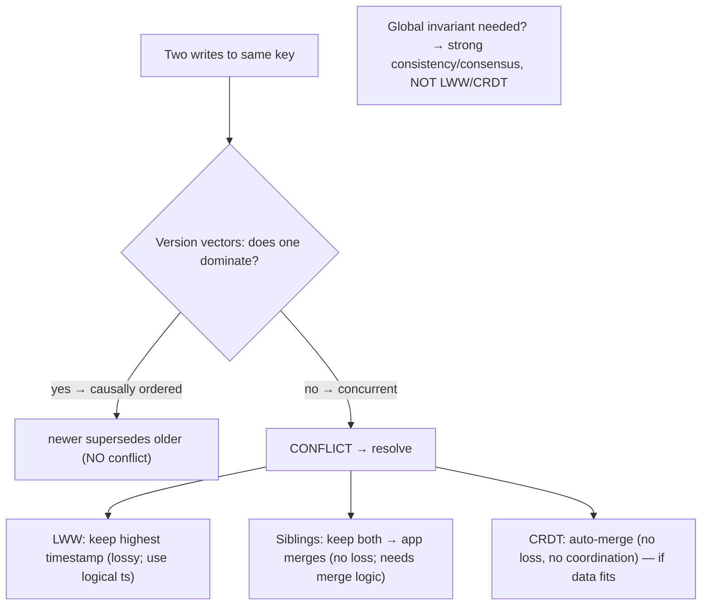
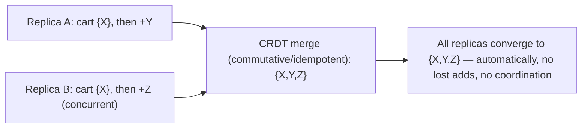

# Lesson 10.4 — Conflict Detection & Resolution; LWW, CRDTs, Version Vectors

> Part 10: Consistency & Replication · Difficulty: 🔴⚫
>
> **Prerequisites:** [10.1 Multi-leader/Leaderless], [8.2.2 Vector Clocks/Version Vectors], [8.1.2 Clock Skew/LWW], [6.5 Conflict in caching].
> **Unlocks:** [10.5 Consistency Spectrum], [10.9 Quorums], [Part 12 Offline/Collaborative], [Part 20 Capstone].

---

## 1. Learning Objectives

After this lesson you will be able to:

- Explain why **write conflicts** arise in multi-leader/leaderless replication (10.1) — concurrent writes to the same data with no single orderer — and why single-leader avoids them.
- **Detect** conflicts using **version vectors** (8.2.2) — distinguishing **concurrent** writes (true conflicts) from **causally-ordered** ones (no conflict).
- Compare **resolution strategies**: **last-write-wins (LWW)** (simple but lossy, clock-skew-prone — 8.1.2), **application/domain merge** (siblings), and **CRDTs** (conflict-free automatic merge) — with tradeoffs.
- Choose a resolution strategy per data type, and understand **CRDTs** (their convergence guarantee and common types) as the "conflict-free by construction" approach for collaborative/offline/multi-leader data.

---

## 2. Motivation — When two writers disagree, who wins (and do you lose data)?

The moment you allow writes at more than one place — **multi-leader** or **leaderless** replication (10.1) — you inherit the hardest problem in replicated data: **write conflicts.** Two clients (in two regions, or two offline devices, or two quorum writers) modify the **same data concurrently**, before either has seen the other's write. When these writes meet during replication, the system must decide: **which value survives?** Get this wrong and you get **silent data loss** (one write overwrites the other with no error — the exact trap of wall-clock LWW under clock skew, 8.1.2) or **divergent replicas** (copies that never agree). This is *the* cost of write-anywhere topologies, and it's why single-leader (one orderer, no conflicts — 10.1) is the default when you can afford it.

Handling conflicts has two parts: **detection** (is there even a conflict? — did these writes happen *concurrently*, or did one causally follow the other?) and **resolution** (given a conflict, what's the outcome?). **Detection** is exactly what **version vectors** (8.2.2) do — they distinguish **concurrent** writes (a real conflict to resolve) from **causally-ordered** writes (the later simply supersedes — no conflict), which Lamport timestamps and wall-clock timestamps **cannot** do (8.2.1/8.1.2). **Resolution** ranges from crude to elegant: **last-write-wins (LWW)** (keep the "latest" by timestamp — simple but **loses data** and is clock-skew-prone — 8.1.2), **application/domain merge** (surface conflicting **siblings** and let business logic combine them — e.g., union two shopping carts — 8.2.2), and the sophisticated **CRDTs (Conflict-free Replicated Data Types)** — data structures **mathematically designed so concurrent updates always merge automatically and correctly**, with no coordination and no lost writes (the technology behind collaborative editors and offline-first apps). This lesson develops detection (version vectors), the resolution spectrum, and CRDTs — the toolkit for making write-anywhere replication (and caches — 6.5) correct.

---

## 3. Theory — From first principles

### 3.1 Where conflicts come from (and why single-leader avoids them)

`[CS]` A **write conflict** occurs when **two writes modify the same data concurrently** — neither aware of the other (8.2.2 concurrency). This happens in **write-anywhere** topologies (10.1):
- **Multi-leader:** two leaders (regions) each accept a write to the same key before syncing → when they replicate, they disagree.
- **Leaderless:** two clients write the same key to overlapping quorums concurrently → replicas hold different values.
- **Offline/collaborative:** two devices edit the same data offline → conflict on sync.
**Single-leader avoids conflicts** (10.1) because **one leader orders all writes** — there's always a definitive "which came first," so a later write simply supersedes an earlier one (no concurrency, no conflict). **Conflicts are the price of write-anywhere availability/locality** — and the reason single-leader is the default.

### 3.2 Detection — concurrent vs causally-ordered (version vectors)

`[CS]` Before resolving, you must **detect** whether a conflict even exists — i.e., were the two writes **concurrent** (a real conflict) or **causally ordered** (one saw the other → the later just supersedes, no conflict)? This is precisely what **version vectors** (8.2.2) determine:
- Each value carries a **version vector** (per-replica counters — 8.2.2). Comparing two writes' vectors:
  - **One dominates the other** (`≤` in all entries) → **causally ordered** → the newer **supersedes** the older → **no conflict** (safe overwrite).
  - **Neither dominates** (each has a higher entry somewhere) → **concurrent** → **conflict** → must resolve (§3.3).
- **Why not timestamps?** Wall-clock timestamps **can't** distinguish concurrent from ordered (and are skew-prone → silent loss — 8.1.2); Lamport timestamps give an order but **can't detect concurrency** (8.2.1). **Version vectors are the correct detection mechanism** — they tell you exactly when there's a genuine conflict versus a simple supersession.
- **The payoff:** you only invoke (potentially-lossy) resolution for **actual concurrent conflicts**, and you **never silently lose** a causally-later write by mistaking it for a conflict.

### 3.3 Resolution strategy 1 — Last-Write-Wins (LWW)

`[CS]` **LWW:** attach a **timestamp** (or version) to each write; on conflict, **keep the one with the highest timestamp**, discard the other.
- **Pros:** **simple**, deterministic, no siblings to manage, easy to implement. Widely available (Cassandra default).
- **Cons — the big ones:**
  - **Data loss:** the "losing" write is **silently discarded** — LWW is **lossy by design** (one of two concurrent writes is thrown away). For data where losing a concurrent write is unacceptable, LWW is **wrong**.
  - **Clock skew (8.1.2):** with **wall-clock** timestamps, a skewed clock can give an **earlier** write a **higher** timestamp → the **truly-later** write is discarded → **silent, skew-induced data loss** (the trap from 8.1.2). Mitigate by using **logical timestamps** (Lamport/HLC — 8.2.1/8.2.4) instead of wall-clock, but **LWW is still lossy** even then (it just picks a consistent winner, not the "right" one).
- **When acceptable:** data where **losing a concurrent write is OK** — a cache entry (6.5), a "last setting wins" preference, idempotent state where the newest value is all that matters. **Not** for data where every write must survive (a shopping cart, a counter, collaborative content).

### 3.4 Resolution strategy 2 — Application / domain merge (siblings)

`[CS]` **Keep both conflicting values as siblings** and let the **application** merge them with **domain knowledge** (8.2.2):
- On a detected conflict (version vectors — §3.2), store **both versions** ("siblings"); the next read returns both, and the application (or the client) **merges** them using business logic.
- **Examples:** two concurrent **shopping-cart** adds → **union the items** (no lost item — the Dynamo cart example, 8.2.2); two concurrent edits → present both for the user to reconcile; two concurrent tag-sets → union.
- **Pros:** **no data loss** (both writes preserved and merged), **domain-correct** (the app knows the right merge — union, max, etc.).
- **Cons:** the application **must implement merge logic** (complexity); siblings can **accumulate** if not resolved; merge isn't always obvious (what's the "merge" of two conflicting price edits?). Requires conflict-detection (version vectors) to know when to create siblings.
- **When:** conflicts are meaningful and the app has a sensible merge (carts, sets, collaborative data) — better than lossy LWW when writes must survive.

### 3.5 Resolution strategy 3 — CRDTs (conflict-free by construction)

`[CS]`/`[EMERGING]` **CRDTs (Conflict-free Replicated Data Types)** are data structures **mathematically designed so that concurrent updates always merge automatically into a consistent result — with no coordination and no lost writes.** The magic: CRDT operations are defined to be **commutative, associative, and idempotent** (order-independent), so **any order/combination of concurrent updates converges to the same correct state** — conflicts are **impossible by construction** (they can't produce divergence).
- **The convergence guarantee:** given the same set of updates (in any order, with duplicates), all replicas **converge to the same state** — **Strong Eventual Consistency (SEC)**: replicas that have seen the same updates are in the same state, automatically, without conflict resolution logic (§3.6).
- **Common CRDT types:**
  - **G-Counter / PN-Counter:** counters that merge by summing per-replica increments (a distributed counter with no lost increments — solves the "concurrent counter" problem LWW can't).
  - **G-Set / OR-Set:** sets where concurrent adds/removes merge correctly (Observed-Remove Set handles add/remove without anomalies).
  - **LWW-Register / MV-Register:** registers (single values) with LWW or multi-value merge.
  - **Sequence CRDTs (RGA, Logoot, etc.):** ordered sequences for **collaborative text editing** (concurrent inserts merge into a consistent document — the tech behind real-time collaborative editors).
  - **Maps:** compositions of the above.
- **How merge works:** each CRDT defines a **merge function** (a mathematical join/least-upper-bound) that combines any two states into a consistent result; replicas exchange states/operations and merge — **automatically, no app logic, no conflicts.**
- **Two flavors:** **state-based (CvRDT)** — replicas exchange full state and merge via the join; **operation-based (CmRDT)** — replicas exchange operations (which must be commutative), requiring reliable delivery. Both converge.

### 3.6 CRDTs: the tradeoffs

`[CS]`
- **Pros:** **automatic, correct merging with no coordination** (no consensus, high availability — great for multi-leader/leaderless/offline); **no lost writes** (unlike LWW); **no manual merge logic** (unlike siblings); **strong eventual consistency** (converge automatically). The gold standard for **collaborative/offline/multi-leader** data.
- **Cons:** **not every data type/operation fits** a CRDT — you must express your data in terms of CRDT semantics (commutative merges), which isn't always natural or possible (e.g., "enforce a global uniqueness constraint" or "the balance must never go negative" — these need **coordination/consensus**, not CRDTs — CRDTs give convergence, **not** arbitrary invariants). **Metadata overhead** (CRDTs carry causal metadata — version-vector-like — which can grow — 8.2.2 §3.5). **Complexity** of implementation (though libraries exist). 
- **Key limitation:** CRDTs achieve **convergence** (all replicas agree eventually) but **cannot enforce global invariants** that require seeing all writes at once (uniqueness, non-negative balance, "at most N") — those need **strong consistency/consensus** (10.5/10.6, 8.3). CRDTs are for data where **any merge of concurrent updates is acceptable/correct**, not where a **global constraint** must hold.

### 3.7 Choosing a resolution strategy

`[BP]`
| Data / need | Strategy |
|---|---|
| Losing a concurrent write is OK (cache, last-setting-wins) | **LWW** (use logical, not wall-clock, timestamps — 8.1.2/8.2.1) |
| Writes must survive; a domain merge exists (carts, sets, tags) | **Siblings + application merge** |
| Collaborative/offline data, counters, sets, text; want automatic no-loss merge | **CRDTs** |
| A global invariant must hold (uniqueness, non-negative balance, at-most-N) | **Strong consistency / consensus** (10.5/10.6, 8.3) — NOT LWW/CRDT |
| Avoid conflicts entirely | **Single-leader** (one orderer — 10.1) |

- **First choice: avoid conflicts** (single-leader — 10.1) if you can. If you need write-anywhere: **detect with version vectors**, then resolve by **CRDT** (if the data fits — best: automatic, no loss), **application merge/siblings** (if a domain merge exists), or **LWW** (only if losing a concurrent write is acceptable — with logical timestamps). For **global invariants**, **coordinate** (consensus/single-leader) — no eventual-consistency scheme can enforce them.
- **Match to the data:** a cart → CRDT/siblings (no loss); a preference → LWW; a bank balance with a non-negative constraint → **strong consistency** (not eventual + merge).

### 3.8 Where this applies

`[CS]` Conflict detection/resolution is needed wherever **write-anywhere** or **stale copies with writes** exist:
- **Multi-leader / leaderless replication** (10.1) — the primary case.
- **Offline-first / collaborative apps** (Part 12) — each device writes locally, syncs, resolves → CRDTs shine here (collaborative editors, offline notes/calendars).
- **Caches with concurrent writes** (6.5) — the stale-set race is a conflict; "invalidate don't update" and version checks are conflict-avoidance.
- **Distributed counters/metrics** — concurrent increments → PN-Counter CRDT (no lost increments) or coordinate.
- **Multi-region systems** (Part 13) — regional writes conflict; choose per data type.

---

## 4. Visual Intuition

### Detect (version vectors) then resolve

### CRDT convergence

---

## 5. Real-World Analogy

Imagine two editors updating a **shared shopping list** while temporarily out of contact (multi-leader/offline).

- **The conflict:** Editor A (in the East office) adds "milk"; Editor B (in the West office) concurrently adds "eggs" — neither saw the other. When their lists sync, they **disagree**. Who wins?
- **Detecting a real conflict (version vectors):** first, figure out if this is even a conflict. If B had **already seen** A's "milk" before adding "eggs" (causally after), then B's list is just **newer** — no conflict, use B's. But if they edited **independently, in ignorance of each other** (concurrent), it's a **genuine conflict** — and version vectors tell you exactly which case you're in (timestamps can't).
- **Last-write-wins (LWW):** the crude rule — "keep whichever list has the later timestamp." So if B's edit was stamped later, you keep B's list ("eggs") and **throw away A's** — **"milk" is silently lost.** Simple, but you **lost an item**. And if the clocks are skewed (8.1.2), you might even keep the **wrong** list. Fine for a "last thumbnail wins" setting; **terrible** for a shopping list.
- **Application merge (siblings):** the smart human approach — **keep both lists** and **merge them with common sense**: the merged list is **{milk, eggs}** (union) — **nothing lost.** But someone (the app) has to **know** that "merge two shopping lists" means "combine the items."
- **CRDT (conflict-free by design):** the best approach — design the shopping list as a data structure where **adds always merge correctly no matter the order**. Then A's "add milk" and B's "add eggs" **automatically combine** into {milk, eggs} on sync — **no lost items, no human deciding, no coordination needed** — and *every* replica ends up with the identical list. This is exactly how **collaborative editors** let many people type in the same document simultaneously and always converge to one consistent document.
- **The limit of merging:** if the rule were "the list may contain **at most 3 items**" (a global invariant), no merging trick can enforce it when two offline editors each add items — you'd need them to **coordinate** (check with a central authority — strong consistency). CRDTs converge the *data*, but can't enforce *global constraints*.

---

## 6. Industry Example

- **Version vectors + siblings (Dynamo/Riak)** `[CONV]`: detect concurrent writes, return siblings, app merges (the shopping-cart union example) — no silent loss (8.2.2, §3.2/3.4). *(Representative.)*
- **LWW in Cassandra** `[CONV]`: last-write-wins by timestamp (default) — simple but lossy and skew-sensitive (use with care / logical timestamps) (§3.3, 8.1.2). *(Representative.)*
- **CRDTs in Riak, Redis (CRDTs/Active-Active), Azure Cosmos DB** `[EMERGING]`: built-in CRDT types (counters, sets, registers, maps) for multi-region/leaderless auto-merge (§3.5). *(Representative.)*
- **Collaborative editors (Google Docs-style, Figma, Automerge/Yjs)** `[EMERGING]`: sequence CRDTs (or OT) for real-time concurrent editing that always converges (§3.5, Part 12). *(Representative.)*
- **PN-Counters for distributed counts** `[CONV]`: no-lost-increment counters across replicas where LWW would lose increments (§3.5). *(Representative.)*
- **Coordination for invariants** `[BP]`: uniqueness/non-negative-balance enforced via single-leader/consensus, not eventual merge (§3.6/3.7, 8.3). *(Representative.)*

---

## 7. Implementation Details — handling conflicts

- **Prefer to avoid conflicts** — use **single-leader** (one orderer — 10.1) if you can; conflict handling is complex (§3.1/3.7) `[BP]`.
- **Detect with version vectors** (8.2.2) — distinguish concurrent (real conflict) from causally-ordered (safe supersession); **never use wall-clock timestamps to detect** (8.1.2/8.2.1) (§3.2).
- **Resolve by data type** (§3.7): **CRDT** (best — automatic, no loss — if the data fits: counters, sets, sequences, registers, maps); **siblings + app merge** (if a domain merge exists — carts, sets); **LWW** (only if losing a concurrent write is acceptable — cache/preferences — and use **logical timestamps**, not wall-clock — 8.1.2/8.2.1).
- **For global invariants (uniqueness, non-negative balance, at-most-N), coordinate** — single-leader/consensus (10.5/10.6, 8.3) — **CRDTs/LWW cannot enforce them** (§3.6).
- **Manage sibling accumulation** — ensure siblings get merged/resolved (don't let them pile up) (§3.4).
- **Bound CRDT metadata growth** (causal metadata — version-vector-like — 8.2.2 §3.5) — track replicas not clients, prune, use compact designs (DVV) (§3.6).
- **Use CRDTs for offline/collaborative** data (each device writes locally, syncs, auto-merges) — the ideal fit (§3.5/3.8, Part 12).
- **Test conflict scenarios** explicitly (concurrent writes, partitions, offline sync) — conflicts are hard to reason about and must be exercised (Part 14).

---

## 8. Advantages (by strategy)

- **LWW:** simple, deterministic, no siblings; fine for loss-tolerant data.
- **Siblings + app merge:** no data loss, domain-correct merges (union carts, etc.).
- **CRDTs:** **automatic, correct, coordination-free merging with no lost writes**; strong eventual consistency; ideal for collaborative/offline/multi-leader; no manual merge logic.
- **Version-vector detection:** precise concurrent-vs-ordered detection → resolve only real conflicts, no accidental loss (§3.2).
- **Single-leader (avoidance):** no conflicts at all (10.1).

---

## 9. Disadvantages (by strategy)

- **LWW:** **silent data loss** (discards a concurrent write); **clock-skew-prone** with wall-clock timestamps (8.1.2).
- **Siblings + app merge:** app must implement merge logic; siblings can accumulate; merge isn't always obvious.
- **CRDTs:** **not all data/operations fit**; **cannot enforce global invariants** (uniqueness/balance limits); metadata overhead; implementation complexity.
- **Version vectors:** O(N) metadata, membership growth (8.2.2 §3.5).
- **All (write-anywhere):** weaker (eventual) consistency; complexity vs single-leader's no-conflict simplicity (§3.1).

---

## 10. When NOT to / limits

- **Don't use LWW** for data where losing a concurrent write is unacceptable (carts, counters, collaborative content) — use CRDT/siblings (§3.3).
- **Don't use wall-clock timestamps** for LWW/detection — clock skew → silent loss (use logical — 8.1.2/8.2.1) (§3.3).
- **Don't use CRDTs/LWW to enforce global invariants** (uniqueness, non-negative balance) — they can't; coordinate (§3.6).
- **Don't adopt write-anywhere + conflict handling** if single-leader suffices — needless complexity (§3.1/3.7, 10.1).
- **Don't let siblings accumulate** unresolved — they bloat and confuse (§3.4).
- **Don't force data into a CRDT** if it doesn't naturally fit — awkward/incorrect semantics (§3.6).

---

## 11. Common Mistakes

1. **Wall-clock LWW for important data** → silent, skew-induced loss of concurrent writes (§3.3, 8.1.2) — the classic.
2. **Detecting conflicts with timestamps instead of version vectors** → mistaking concurrent for ordered (or vice versa) → wrong resolution/loss (§3.2).
3. **Using CRDTs/LWW where a global invariant is required** → can't enforce uniqueness/balance → violated constraint (§3.6).
4. **No merge strategy for siblings** → siblings pile up, reads return conflict sets the app can't handle (§3.4).
5. **Forcing non-fitting data into a CRDT** → awkward or incorrect semantics (§3.6).
6. **Adopting multi-leader/leaderless without any conflict handling** → concurrent writes corrupt/lose data (§3.1).
7. **Unbounded version-vector/CRDT metadata** (tracking clients) → explosion (§3.6, 8.2.2).
8. **Not testing conflict/partition/offline scenarios** → conflicts surface only in production (§7).

---

## 12. Interview Questions

**🟢 Easy**
- Why do write conflicts occur in multi-leader/leaderless replication, and why not in single-leader?
- What is last-write-wins, and what's its main danger?

**🟡 Medium**
- How do version vectors detect a conflict (concurrent vs causally-ordered), and why can't timestamps do this?
- What are CRDTs, and what guarantee do they provide (strong eventual consistency)?

**🔴 Hard**
- Compare LWW, application merge (siblings), and CRDTs for resolving conflicts — tradeoffs and when to use each.
- Why can't CRDTs enforce a global invariant like "balance must stay non-negative" or "username must be unique"? What do you need instead?

**⚫ Staff+**
- Design conflict handling for a multi-region collaborative app (offline editing) that must never lose a user's edit, plus a per-user "unique handle" constraint and a "cannot overdraw" balance. Choose per-data-type strategies (CRDT for edits, coordination for uniqueness/balance), and justify — detection with version vectors, resolution, and where you must fall back to single-leader/consensus.
- A multi-region deployment uses wall-clock LWW and users report "my changes disappeared." Diagnose (silent skew-induced loss of concurrent writes), and redesign: version-vector detection + CRDT/siblings for no-loss merge, logical timestamps if LWW is kept for some data, and coordination for invariants.

---

## 13. Production Pitfalls

- **Silent LWW data loss:** wall-clock LWW discards a concurrent (or truly-later, under skew) write → "my change disappeared" with no error (§3.3, 8.1.2) — the signature conflict bug.
- **Wrong-winner from skew:** a fast-clock replica's earlier write wins by timestamp → the correct later write is lost (§3.3, 8.1.2).
- **Violated invariant under merge:** eventual-consistency merge allowed two "unique" usernames or a negative balance (CRDTs/LWW can't enforce invariants) (§3.6).
- **Sibling pileup:** no merge logic → conflict sets accumulate, reads return unresolvable siblings (§3.4).
- **CRDT metadata bloat:** tracking clients (not replicas) → causal metadata explodes (§3.6, 8.2.2).
- **Divergent replicas:** multi-leader/leaderless with no conflict handling → replicas permanently disagree (§3.1).
- **Conflict bugs only in prod:** untested concurrent/offline/partition scenarios surface as data loss/divergence live (§7).

---

## 14. Optimization Techniques

- **Avoid conflicts (single-leader)** where possible — simplest (§3.1/3.7, 10.1) `[BP]`.
- **Version-vector detection** — resolve only genuine concurrent conflicts; never silently lose causally-later writes (§3.2, 8.2.2).
- **CRDTs for collaborative/offline/multi-leader data** — automatic, no-loss, coordination-free merge (counters, sets, sequences) (§3.5/3.8).
- **Siblings + domain merge** when a CRDT doesn't fit but writes must survive (union carts/sets) (§3.4).
- **LWW only for loss-tolerant data, with logical timestamps** (Lamport/HLC — 8.2.1/8.2.4), never wall-clock (§3.3).
- **Coordinate (single-leader/consensus) for global invariants** — uniqueness, non-negative balance, at-most-N (§3.6, 8.3).
- **Bound version-vector/CRDT metadata** (track replicas, prune, DVV) (§3.6, 8.2.2).
- **Explicitly test concurrent/offline/partition conflict scenarios** (Part 14).

---

## 15. Summary

**Write conflicts** arise in **write-anywhere** topologies (**multi-leader, leaderless, offline** — 10.1) when **two writes modify the same data concurrently** with no single orderer; **single-leader avoids them** (one leader orders all writes → later supersedes earlier — the reason it's the default). Handling conflicts has two parts. **Detection:** determine whether two writes are **concurrent** (a genuine conflict) or **causally ordered** (the later just supersedes — no conflict) — done correctly by **version vectors** (8.2.2), which (unlike wall-clock timestamps — skew-prone, 8.1.2 — or Lamport timestamps — can't detect concurrency, 8.2.1) **precisely** distinguish the cases, so you resolve **only real conflicts** and never silently lose a causally-later write. **Resolution** spans a spectrum: **Last-Write-Wins (LWW)** — keep the highest-timestamp write — is **simple but lossy** (silently discards a concurrent write) and, with **wall-clock** timestamps, **clock-skew-prone** (can discard the truly-later write — 8.1.2); acceptable only for **loss-tolerant** data (caches, last-setting-wins), and even then use **logical** timestamps. **Application/domain merge (siblings)** — keep both conflicting values and let business logic merge them (union carts/sets — the Dynamo example) — is **lossless and domain-correct** but requires **merge logic** and sibling management. **CRDTs (Conflict-free Replicated Data Types)** are data structures **mathematically designed** (commutative, associative, idempotent operations) so **concurrent updates always merge automatically into a consistent result with no coordination and no lost writes** — providing **Strong Eventual Consistency** (replicas that saw the same updates converge automatically) — the gold standard for **collaborative/offline/multi-leader** data (counters/PN-Counters, sets/OR-Sets, sequence CRDTs for collaborative text, registers, maps). CRDTs' **key limitation**: they achieve **convergence** but **cannot enforce global invariants** (uniqueness, non-negative balance, at-most-N) — those require **coordination/consensus** (10.5/10.6, 8.3), not eventual merge. **Choose by data type:** avoid conflicts with **single-leader** if you can; else **detect with version vectors** and resolve via **CRDT** (best — if the data fits), **siblings + merge** (if a domain merge exists), or **LWW** (only for loss-tolerant data, logical timestamps) — and **coordinate for global invariants**. This toolkit makes write-anywhere replication (and concurrent caches — 6.5) correct, at the cost of the complexity single-leader avoids.

---

## 16. Revision Notes (flashcard-ready)

- **Q:** Why do conflicts occur? **A:** Write-anywhere (multi-leader/leaderless/offline) → concurrent writes to the same data with no single orderer; single-leader avoids them.
- **Q:** How to DETECT a conflict? **A:** Version vectors (8.2.2) — neither dominates → concurrent (conflict); one dominates → causally ordered (no conflict, supersede).
- **Q:** Why not timestamps for detection? **A:** Wall-clock is skew-prone; Lamport can't detect concurrency — version vectors do it precisely.
- **Q:** LWW? **A:** Keep highest-timestamp write; simple but LOSSY (discards a concurrent write) and clock-skew-prone (use logical timestamps; only for loss-tolerant data).
- **Q:** Siblings + app merge? **A:** Keep both conflicting values; app merges with domain logic (union carts/sets); no loss but needs merge logic.
- **Q:** CRDTs? **A:** Data structures with commutative/associative/idempotent merges → concurrent updates auto-merge, no coordination, no lost writes; strong eventual consistency.
- **Q:** CRDT types? **A:** PN-Counter (counts), OR-Set (sets), sequence CRDTs (collaborative text), LWW/MV-Register, maps.
- **Q:** CRDT key limitation? **A:** Converge, but CANNOT enforce global invariants (uniqueness, non-negative balance) — need consensus/single-leader.
- **Q:** Choose by data type? **A:** Avoid (single-leader) > CRDT (if fits) > siblings/merge (if domain merge) > LWW (loss-tolerant only); invariants → coordinate.
- **Q:** Where does this apply? **A:** Multi-leader/leaderless, offline/collaborative apps, concurrent caches, distributed counters, multi-region.

---

## 17. Further Reading + Knowledge-Graph Links

**Within this platform**
- **Builds on:** [10.1 Multi-leader/Leaderless] (where conflicts arise), [8.2.2 Vector Clocks/Version Vectors] (detection), [8.1.2 Clock Skew/LWW] (why wall-clock LWW loses data), [6.5 Cache Conflicts].
- **Next:** [10.5 Consistency Spectrum] (where CRDTs/eventual sit). **Then:** [10.9 Quorums], [10.6 Linearizability] (invariants need it).
- **Enables:** [Part 12 Offline/Collaborative apps], [Part 13 Multi-region], [Part 20 Capstone].

**Foundational texts (synthesized)**
- Shapiro et al., "Conflict-free Replicated Data Types (CRDTs)" (concept, synthesized).
- DeCandia et al., *Dynamo* — version vectors, siblings, LWW (concept, synthesized).
- Kleppmann, *Designing Data-Intensive Applications* — conflict detection/resolution, LWW, CRDTs (synthesized).

**Concept tags:** `[CS]` write conflicts, version-vector detection (concurrent vs ordered), LWW (lossy/skew), siblings+merge, CRDTs (strong eventual consistency), invariants need coordination · `[CONV]` Dynamo/Riak version vectors+siblings, Cassandra LWW · `[BP]` avoid via single-leader, detect with version vectors, CRDT>siblings>LWW, logical timestamps, coordinate for invariants · `[EMERGING]` CRDTs, collaborative editors.
