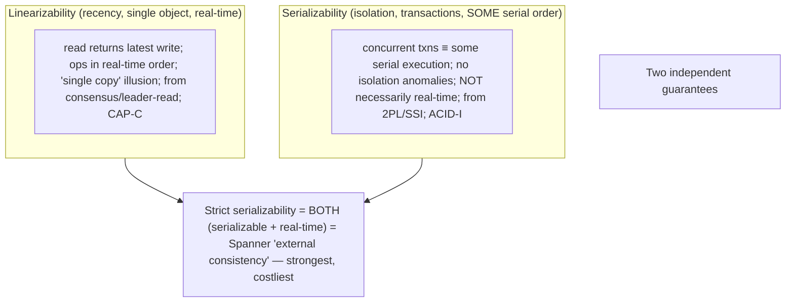
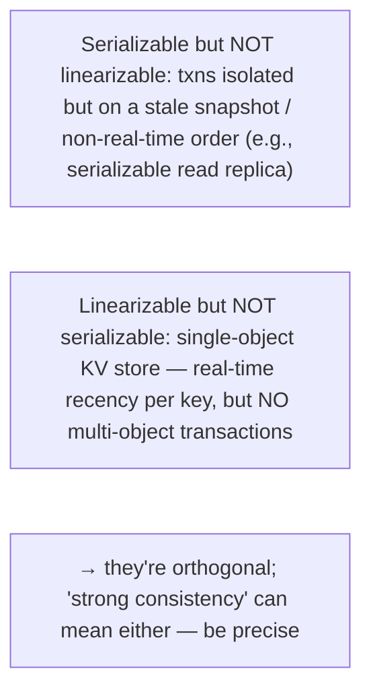

# Lesson 10.6 — Linearizability vs Serializability (and Why They're Different)

> Part 10: Consistency & Replication · Difficulty: ⚫
>
> **Prerequisites:** [10.5 Consistency Spectrum], [5.2.2 Isolation Levels], [5.2.4 Concurrency Control], [8.2.3 Total Order], [8.3 Consensus].
> **Unlocks:** [10.7 CAP], [8.2.4 External Consistency], [Part 20 Capstone].

---

## 1. Learning Objectives

After this lesson you will be able to:

- Define **linearizability** (a **recency/single-object** guarantee: operations appear to happen atomically in **real-time order**, as if on one copy) and **serializability** (a **transaction-isolation** guarantee: transactions appear to execute in **some serial order**).
- Explain precisely **why they're different and orthogonal** — linearizability is about **replication/recency of single objects in real time**; serializability is about **isolation of multi-operation transactions** — and that you can have either without the other.
- Define **strict serializability** (the combination: serializable **+** real-time order) and why it's the strongest practical guarantee (Spanner's "external consistency" — 8.2.4).
- Avoid the pervasive **terminology confusion** (both loosely called "strong consistency") and reason about which one a given requirement actually needs.

---

## 2. Motivation — The two "strong consistencies" that get conflated

**Linearizability** and **serializability** are the two most important — and most **confused** — correctness guarantees in distributed data systems. Both are casually called "strong consistency," both are the "strongest" in their respective areas, and both are expensive — so engineers routinely conflate them. But they are **different guarantees about different things**, and confusing them leads to real design errors (thinking your serializable database gives real-time recency, or that your linearizable store gives transaction isolation — neither implication holds). This lesson draws the distinction sharply, because getting it right is the mark of genuine understanding of consistency.

The distinction in one breath: **linearizability is a *recency* guarantee about *single objects* across *replicas* in *real time*** — it says the system behaves as if there's **one copy** and each operation takes effect **atomically at a single moment consistent with wall-clock order** (if I finish writing before you start reading, you see my write). It's the "C" of the CAP theorem (10.7) and the guarantee you get from consensus (8.3) or reading-from-the-leader — it comes from the **replication** world (Part 10). **Serializability is an *isolation* guarantee about *transactions*** — it says concurrent multi-operation transactions produce a result **equivalent to *some* serial (one-at-a-time) execution** — the strongest isolation level (5.2.2). It comes from the **transactions/concurrency-control** world (5.2). They are **orthogonal**: serializability says **nothing** about real-time order (the equivalent serial order need not match wall-clock, and a serializable system can serve stale data), and linearizability says **nothing** about transactions (it's about single objects, not multi-object atomic transactions). The combination — **strict serializability** — is serializable **and** real-time-respecting, the strongest practical guarantee (Google Spanner's "external consistency" — 8.2.4). This lesson defines each precisely, proves they're independent with concrete examples, and clears up the confusion — essential for reasoning correctly about what "strong consistency" your system actually provides and needs.

---

## 3. Theory — From first principles

### 3.1 Linearizability — a recency guarantee about single objects

`[CS]` **Linearizability** (Herlihy & Wing) is a **consistency model for single operations on single objects** across replicas: the system behaves **as if there is exactly one copy** of the data and **every operation takes effect atomically at some single point in time between its invocation and completion**, and this ordering is **consistent with real-time** `[CS]`. Concretely:
- **Recency:** a read returns the **most recent** completed write (no staleness) — reads reflect the latest value.
- **Real-time order:** if operation A **completes before** operation B **begins** (in wall-clock time), then every observer sees A before B. There's a **single, real-time-consistent** order of operations.
- **The "single copy" illusion:** despite replication (10.1), the system *looks like* one non-replicated copy that all operations hit atomically.
- **Where it comes from:** **consensus** (8.3 — e.g., reading through a Raft log), **reading from the leader** (single-leader — 10.1), or synchronous replication (10.2). It's the **"C" in CAP** (10.7) and the strongest model on the consistency spectrum (10.5).
- **Scope:** it's about **single objects / single operations** (a register, a key) — **not** about grouping multiple operations into a transaction (that's serializability). Linearizability makes each *individual* operation appear instantaneous and recent.

### 3.2 Serializability — an isolation guarantee about transactions

`[CS]` **Serializability** (from the transactions/ACID world — 5.2.2) is the **strongest isolation level**: concurrent **transactions** (each a group of multiple reads/writes) produce a result **equivalent to *some* serial execution** — as if the transactions ran **one at a time, in some order**, with no interleaving `[CS]`:
- **Scope:** about **multi-operation transactions** and their **isolation** — preventing all the anomalies (dirty reads, non-repeatable reads, phantoms, write skew, lost updates — 5.2.3) by making concurrent transactions behave as if serial.
- **"Some" serial order:** the equivalent serial order can be **any** order — it need **not** match real-time. If transaction T1 commits before T2 starts in wall-clock time, a **serializable** (but not *strict*) system may still order T2 before T1 in its equivalent serial order. **Serializability says nothing about which serial order or about real-time.**
- **Where it comes from:** concurrency control — **2PL, SSI, actual serial execution** (5.2.4) — on a single database (or distributed with coordination).
- It's from the **ACID/isolation** world (5.2), **not** the replication/recency world.

### 3.3 Why they're different and orthogonal (the crux)

`[CS]` The two guarantees are about **different dimensions** and are **independent** — you can have either without the other:
- **Linearizability = recency of single objects in real time (replication).** Serializability = isolation of multi-op transactions in *some* serial order (transactions). **Different scope (single object vs transaction) and different concern (real-time recency vs isolation).**
- **Serializable but NOT linearizable:** a system can make transactions equivalent to a serial order that **doesn't match real-time** — e.g., transactions run on a snapshot, or the serial order differs from wall-clock. A **serializable** database on a **read replica** could serve a transaction on **stale** data (isolation preserved among transactions, but not real-time recency) — so it's not linearizable. Serializability **permits stale reads / non-real-time order.**
- **Linearizable but NOT serializable:** a **single-object** linearizable register (a linearizable key-value store) gives real-time recency **per key** but has **no notion of transactions** — it doesn't provide multi-object isolation (no serializable transactions across keys). So it's linearizable (per object) but not serializable (no transaction isolation).
- **The independence proves they're separate guarantees**, not two names for the same thing. Conflating them is a genuine error (§3.6).

### 3.4 Strict serializability — the combination

`[CS]` **Strict serializability** = **serializability + linearizability** = transactions are equivalent to a serial order **that also respects real-time order** (if T1 completes before T2 starts, T1 is before T2 in the equivalent serial order) `[CS]`:
- It's the **strongest practical guarantee**: full transaction isolation (serializable) **and** real-time recency (linearizable) — the system behaves like a **single machine executing transactions one at a time in real-time order**.
- **Google Spanner's "external consistency"** (8.2.4) is essentially **strict serializability** — achieved via **TrueTime** (bounded clock uncertainty + commit-wait) + **Paxos** — giving globally-distributed transactions that respect real-time order.
- **Cost:** the most expensive — requires both serializable isolation (concurrency control) **and** linearizable ordering (consensus/coordination/real-time) — highest latency, lowest availability (CP under partition — 10.7). Reserve for data needing **both** (financial ledgers with transactions that must respect real-time order — Part 20).

### 3.5 Which one does a requirement need?

`[BP]` Map the requirement to the right guarantee:
- **"A read must return the latest value" (single object, recency):** → **linearizability** (leader read / consensus). E.g., a distributed lock, a leader-election flag, a single counter that must be current, a config value.
- **"Concurrent multi-step transactions must not interfere / no write skew/phantoms" (isolation):** → **serializability** (2PL/SSI — 5.2.4). E.g., a transaction reserving seats, transferring funds between accounts (multi-object).
- **"Transactions must be isolated AND respect real-time order globally":** → **strict serializability** (Spanner-style — 8.2.4). E.g., a financial ledger where transaction order must match real-time across regions.
- **Neither needed?** Weaker models (causal/eventual — 10.5) suffice for most data — don't pay for linearizable/serializable where you don't need them.
The key: **don't assume "strong consistency" gives you both** — a serializable DB may serve stale reads (not linearizable); a linearizable KV store has no transactions (not serializable). Ask which dimension (recency vs isolation) your correctness actually requires.

### 3.6 The terminology confusion (and how to be precise)

`[CS]`/`[OPINION]` Both are called "strong consistency," causing pervasive confusion `[BP]`:
- **"Strong consistency"** in a **replication** context usually means **linearizability** (recency); in a **transactions** context usually means **serializability** (isolation) — **different things**.
- **CAP's "C" is linearizability**, not serializability (10.7) — a common misunderstanding.
- **ACID's "I" (Isolation) at its strongest is serializability**, not linearizability (5.2.2).
- **Databases muddle it:** a database advertising "serializable" isolation may **not** be linearizable (stale replica reads); one advertising "strongly consistent" reads may mean linearizable-per-object but not serializable transactions.
**Be precise:** name **linearizability** (recency, single-object, real-time) vs **serializability** (isolation, transactions, some-serial-order) vs **strict serializability** (both) — and know which your requirement needs and which your system provides. This precision is the hallmark of correct consistency reasoning.

### 3.7 Relationship to the rest of the platform

`[CS]`
- **Linearizability** ↔ **replication/consensus** (Part 10, 8.3), **ordering** (total order in real time — 8.2.3), **CAP-C** (10.7), **external consistency/TrueTime** (8.2.4). The "recency" guarantee.
- **Serializability** ↔ **transactions/isolation** (5.2.2/5.2.3/5.2.4 — the anomalies it prevents, the concurrency control that provides it: 2PL/SSI). The "isolation" guarantee.
- **Strict serializability** ↔ both — Spanner (8.2.4), and the ideal for financial/transactional systems needing real-time transaction order (Part 20).
- **The spectrum (10.5)** places **linearizability** as the strongest *replication-consistency* model; **serializability** is the strongest *isolation* level (5.2.2) — **two different spectrums** (consistency vs isolation) that this lesson keeps distinct, with **strict serializability** at the top of both.

---

## 4. Visual Intuition

### The two orthogonal dimensions

### Independence

---

## 5. Real-World Analogy

Imagine a **shared bank**, and two different promises customers might want.

- **Linearizability = "when I check my balance, I see the very latest, and everyone agrees on the order of individual actions in real time."** It's about **recency of a single fact** (one account's balance): if my deposit *finished* before you *check* the balance, you **must** see my deposit — no staleness, real-time order, as if there's **one true ledger** everyone reads instantly. But it says **nothing** about grouping actions: it's per-single-fact.
- **Serializability = "when several multi-step operations run at once, the end result is as if they ran one-at-a-time, in *some* order, without stepping on each other."** It's about **isolation of transactions** — e.g., a "transfer $100 from A to B" (read A, read B, write A, write B) and a "compute interest on A and B" running concurrently should produce a result **equivalent to running one fully then the other** — no half-applied interleavings (no write skew, no phantoms — 5.2.3). But here's the twist: the "some order" **need not match real time** — a serializable bank could decide the equivalent order is "interest first, then transfer" even if the transfer clock-started earlier, and could even compute on a **slightly-stale snapshot** — so it's **not necessarily** giving you the *latest* (not linearizable).
- **Why they're different:** the **balance-recency** promise (linearizability) and the **transactions-don't-interfere** promise (serializability) are about **different things** — one about *how fresh/real-time a single fact is*, the other about *how multiple grouped operations interleave*. A bank could give you **isolated transactions on last-hour's snapshot** (serializable, not linearizable) or a **perfectly-current single balance with no transaction support** (linearizable, not serializable).
- **Strict serializability = both:** transactions are isolated **and** ordered to match real-time — the gold standard for a **financial ledger** (Spanner's external consistency): "transactions run as if one-at-a-time, in the exact real-world order they happened, globally." The strongest — and the most expensive — promise.

---

## 6. Industry Example

- **Linearizability from consensus/leader** `[CONV]`: etcd/ZooKeeper linearizable reads (8.3.8), single-leader read-from-leader, a distributed lock's register — recency guarantees for single objects (§3.1, 8.3). *(Representative.)*
- **Serializability from 2PL/SSI** `[CONV]`: Postgres Serializable (SSI), traditional 2PL — transaction isolation preventing write skew/phantoms (5.2.4), but a serializable read replica can serve stale data (not linearizable) (§3.2/3.3). *(Representative.)*
- **Strict serializability = Spanner external consistency** `[EMERGING]`: TrueTime (8.2.4) + Paxos give globally-distributed transactions that are serializable AND real-time-ordered — the combination (§3.4). *(Representative.)*
- **Terminology confusion in practice** `[OPINION]`: "strongly consistent" reads (often linearizable-per-object) vs "serializable" isolation (transactions) conflated → design errors assuming one implies the other (§3.6). *(Representative.)*
- **CAP-C is linearizability** `[CS]`: the CAP theorem's "consistency" is linearizability, not serializability — a frequently-missed precision point (10.7, §3.6). *(Representative.)*

---

## 7. Implementation Details — reasoning and choosing

- **Ask which dimension your correctness needs** (§3.5): **recency of a single object** → **linearizability** (leader read/consensus); **isolation of multi-op transactions** → **serializability** (2PL/SSI — 5.2.4); **both, real-time-ordered** → **strict serializability** (Spanner-style — 8.2.4) `[BP]`.
- **Don't assume "strong consistency" gives both** — verify: a serializable DB may serve stale replica reads (not linearizable); a linearizable KV store has no transactions (not serializable) (§3.3/3.6).
- **Use linearizability** for single-object recency-critical data (locks, leader flags, config, a must-be-current counter) — via consensus or leader reads (§3.1, 8.3).
- **Use serializability** for multi-object transactions where isolation anomalies (write skew, phantoms — 5.2.3) would be bugs — via SSI/2PL (§3.2, 5.2.4).
- **Use strict serializability** only where you need **both** (financial ledgers with real-time transaction order) — accept the highest cost (§3.4, Part 20).
- **Be precise in communication and design** — name the exact guarantee; don't say "strongly consistent" loosely (§3.6).
- **Match cost to need** — both are expensive (coordination); use weaker models (causal/eventual — 10.5) where recency/isolation isn't required (§3.5).

---

## 8. Advantages

- **Linearizability:** intuitive (single-copy illusion), real-time recency — reads always latest; foundation for locks, leader election, config, coordination (§3.1).
- **Serializability:** the strongest isolation — eliminates all transaction anomalies (write skew, phantoms, lost updates — 5.2.3); transactions "just work" as if serial (§3.2).
- **Strict serializability:** both — the gold standard for correctness-critical transactional systems (financial ledgers) (§3.4).
- **Precision (knowing the difference):** correct reasoning about what your system provides and needs — avoids design errors (§3.6).

---

## 9. Disadvantages / costs

- **Linearizability:** requires consensus/leader-reads → high latency, low availability (CP under partition — 10.7), throughput cost (§3.1, 8.3).
- **Serializability:** concurrency-control cost (2PL locking/contention, SSI aborts/retries — 5.2.4); doesn't give real-time recency (can serve stale) (§3.2/3.3).
- **Strict serializability:** the **most expensive** — both isolation and real-time ordering (Spanner needs special clocks + commit-wait — 8.2.4); highest latency, lowest availability (§3.4).
- **Confusion cost:** conflating them → wrong assumptions (e.g., expecting real-time recency from a serializable replica) (§3.6).

---

## 10. When NOT to / limits

- **Don't use strict serializability** unless you need **both** isolation and real-time order — it's the costliest; most data needs neither or just one (§3.4/3.5).
- **Don't assume serializable = linearizable** (or vice versa) — they're independent; verify what you actually get (§3.3/3.6).
- **Don't use linearizability/serializability** where causal/eventual suffices — wasted coordination cost (§3.5, 10.5).
- **Don't say "strong consistency"** without specifying which — it causes real errors (§3.6).
- **Don't expect single-object linearizable stores to give transactions** — they don't (§3.3).

---

## 11. Common Mistakes

1. **Conflating linearizability and serializability** — assuming "strong consistency" gives both (§3.3/3.6) — the headline mistake.
2. **Expecting real-time recency from a serializable system** — serializability permits stale/non-real-time order (§3.2/3.3).
3. **Expecting transactions from a linearizable KV store** — it's single-object, no isolation across keys (§3.3).
4. **Thinking CAP's C is serializability** — it's linearizability (§3.6, 10.7).
5. **Using strict serializability everywhere** — the costliest guarantee where weaker suffices (§3.4/3.5).
6. **Saying "strongly consistent" ambiguously** → misaligned expectations/design (§3.6).
7. **Over-paying** — using linearizable/serializable where causal/eventual would do (§3.5, 10.5).

---

## 12. Interview Questions

**🟢 Easy**
- Define linearizability and serializability in one sentence each.
- Which one is about single-object recency, and which is about transaction isolation?

**🟡 Medium**
- Why are linearizability and serializability orthogonal? Give an example of each without the other.
- What is strict serializability, and what real system provides it?

**🔴 Hard**
- CAP's "C" is which of the two, and why does that matter? What does a serializable-but-not-linearizable system permit that surprises people?
- For a distributed lock, a multi-account funds transfer, and a globally-ordered financial ledger, which guarantee does each need and why?

**⚫ Staff+**
- Design the consistency/isolation guarantees for a financial platform: a per-account balance (recency), multi-account transfers (isolation), and a global transaction ledger (both, real-time). Assign linearizability/serializability/strict serializability appropriately, justify the cost, and explain what would break if you conflated them (Part 20).
- Explain precisely why a serializable database running on read replicas can still return stale data (not linearizable), and why a linearizable key-value store cannot prevent write skew across two keys (not serializable). What do you use for each need, and when do you need strict serializability?

---

## 13. Production Pitfalls

- **Stale read from a "serializable" system:** a serializable DB serving reads from a lagging replica returns stale data (serializable ≠ linearizable) → users act on old values (§3.2/3.3).
- **Write skew despite "strong consistency":** a linearizable KV store (per-object recency) doesn't prevent a multi-key write-skew anomaly (needs serializable transactions — 5.2.3) (§3.3).
- **Conflation-driven design error:** assuming "strong consistency" gives both recency and isolation → a correctness bug where the missing guarantee was needed (§3.6).
- **Over-provisioned strict serializability:** paying Spanner-level cost (special clocks, commit-wait) for data that needed only causal/eventual (§3.4/3.5).
- **CAP misunderstanding:** designing for "CAP consistency = serializability" → wrong reasoning about partition behavior (CAP-C is linearizability) (§3.6, 10.7).
- **Ambiguous "strongly consistent" spec:** teams build to different interpretations → integration bugs (§3.6).

---

## 14. Optimization Techniques

> *Mostly precision + right-sizing.*

- **Name the exact guarantee** (linearizable / serializable / strict-serializable) and match it to the requirement's dimension (recency vs isolation) (§3.5/3.6) `[BP]`.
- **Linearizability via leader reads / consensus** for single-object recency (§3.1, 8.3).
- **Serializability via SSI** (optimistic — 5.2.4) for transaction isolation, tuning for its abort/retry cost.
- **Strict serializability only where both are needed** (financial ledgers) — Spanner-style (8.2.4) (§3.4).
- **Weaker models (causal/eventual — 10.5)** where neither recency nor isolation is required — avoid the coordination cost (§3.5).
- **Read vendor guarantees precisely** — what "serializable"/"strongly consistent" actually means for that system (§3.6).

---

## 15. Summary

**Linearizability** and **serializability** are the two most-confused correctness guarantees — both called "strong consistency," but **different guarantees about different things**. **Linearizability** is a **recency guarantee about single objects** across replicas: the system behaves **as if there's one copy** and each operation takes effect **atomically at a single point consistent with real-time order** — a read returns the **most recent** write, and if A completes before B begins (wall-clock), everyone sees A before B. It comes from the **replication** world (consensus/leader-reads/sync replication — 8.3/10.1/10.2), is the **"C" in CAP** (10.7), and is the strongest model on the *replication-consistency* spectrum (10.5). **Serializability** is an **isolation guarantee about transactions** (the ACID world — 5.2.2): concurrent multi-operation transactions produce a result **equivalent to *some* serial (one-at-a-time) execution** — the strongest **isolation** level, eliminating write skew/phantoms/lost updates (5.2.3) — provided by concurrency control (2PL/SSI — 5.2.4). **They're orthogonal:** linearizability is about **real-time recency of single objects**; serializability is about **isolation of multi-op transactions in *some* (not necessarily real-time) order** — and you can have **either without the other**: a **serializable** database on a **read replica** can serve **stale** data (isolated transactions, but not real-time recent → not linearizable), and a **linearizable single-object KV store** gives per-key recency but **no multi-object transactions** (→ not serializable). The combination — **strict serializability** — is serializable **and** real-time-ordered (transactions equivalent to a serial order matching wall-clock), the **strongest practical guarantee**, exemplified by **Google Spanner's "external consistency"** (TrueTime + Paxos — 8.2.4) and ideal for financial ledgers needing both isolation and real-time transaction order (Part 20) — at the **highest cost**. **Match the guarantee to the requirement's dimension:** single-object **recency** → **linearizability** (leader/consensus); transaction **isolation** → **serializability** (2PL/SSI); **both, real-time** → **strict serializability** — and **don't assume "strong consistency" gives both** (a serializable DB may serve stale reads; a linearizable KV store has no transactions). Be **precise** (CAP-C = linearizability, not serializability; ACID-I's strongest = serializability, not linearizability; vendor labels vary) — conflating them causes genuine design errors, and both are expensive, so use **weaker models (causal/eventual — 10.5)** where neither recency nor isolation is required.

---

## 16. Revision Notes (flashcard-ready)

- **Q:** Linearizability? **A:** Recency guarantee on single objects — behaves like one copy; reads return latest; real-time order. (Replication world; CAP-C.)
- **Q:** Serializability? **A:** Isolation guarantee on transactions — concurrent txns ≡ some serial execution (strongest isolation). (ACID world.)
- **Q:** Why orthogonal? **A:** Linearizability = real-time recency of single objects; serializability = isolation of multi-op txns in SOME (not necessarily real-time) order.
- **Q:** Serializable but not linearizable? **A:** Isolated transactions on a stale snapshot / non-real-time order (e.g., serializable read replica serves stale data).
- **Q:** Linearizable but not serializable? **A:** Single-object KV store — real-time recency per key, but no multi-object transactions.
- **Q:** Strict serializability? **A:** Serializable + linearizable = transactions equivalent to a serial order that respects real-time. Strongest, costliest.
- **Q:** Real system with strict serializability? **A:** Spanner ("external consistency") — TrueTime + Paxos (8.2.4).
- **Q:** CAP's "C"? **A:** Linearizability (NOT serializability).
- **Q:** ACID's strongest "I"? **A:** Serializability (NOT linearizability).
- **Q:** Which for what? **A:** Single-object recency → linearizability; transaction isolation → serializability; both real-time → strict serializability.
- **Q:** Key trap? **A:** "Strong consistency" doesn't imply both — verify recency vs isolation separately.

---

## 17. Further Reading + Knowledge-Graph Links

**Within this platform**
- **Previous:** [10.5 Consistency Spectrum] (linearizability = strongest replication-consistency). **Builds on:** [5.2.2 Isolation Levels] (serializability = strongest isolation), [5.2.4 Concurrency Control] (2PL/SSI), [8.2.3 Total Order], [8.3 Consensus] (linearizability source), [8.2.4 External Consistency/Spanner].
- **Next:** [10.7 CAP] (C = linearizability). **Then:** [10.8 PACELC], [10.9 Quorums].
- **Enables:** [Part 20 Capstone] (ledger = strict serializability), [Part 18 Spanner case study].

**Foundational texts (synthesized)**
- Herlihy & Wing, "Linearizability" (concept, synthesized).
- Bernstein et al. / database texts — serializability (5.2, synthesized).
- Corbett et al., *Spanner* — external consistency/strict serializability (concept, synthesized).
- Kleppmann, *Designing Data-Intensive Applications* — linearizability vs serializability (synthesized).

**Concept tags:** `[CS]` linearizability (recency/single-object/real-time), serializability (isolation/transactions/some-serial-order), orthogonality, strict serializability, CAP-C=linearizability · `[CONV]` consensus/leader-read linearizability, 2PL/SSI serializability, Spanner external consistency · `[BP]` match guarantee to dimension (recency vs isolation), don't conflate, be precise, weaker models where possible · `[OPINION]` terminology confusion.
