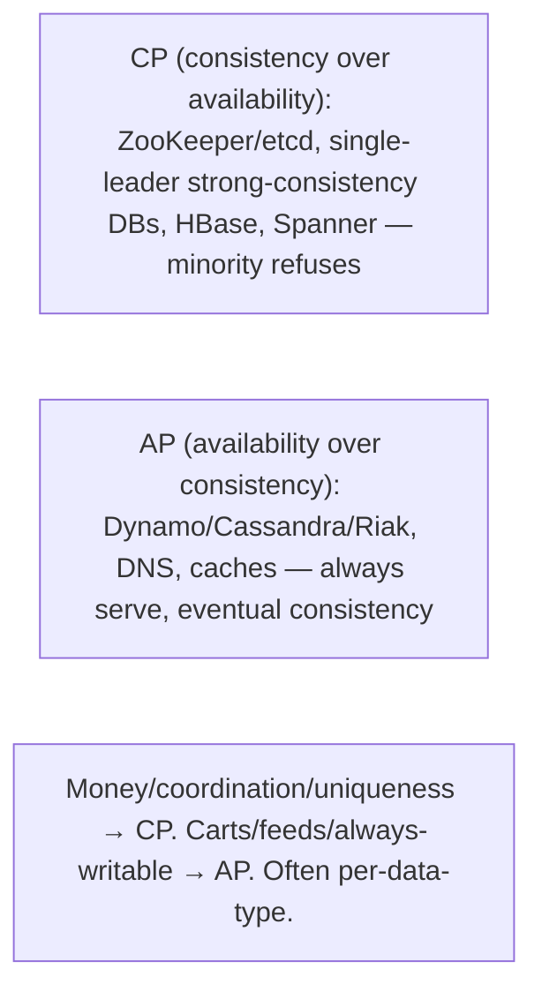

# Lesson 10.7 — CAP Theorem — Precisely, With Its Real Meaning and Limits

> Part 10: Consistency & Replication · Difficulty: 🔴⚫
>
> **Prerequisites:** [8.1.1 Partitions], [10.5 Consistency Spectrum], [10.6 Linearizability], [10.2 Sync/Async], [8.3.1 FLP].
> **Unlocks:** [10.8 PACELC], [10.9 Quorums], [Part 11 Resilience], [Part 20 Capstone].

---

## 1. Learning Objectives

After this lesson you will be able to:

- State the **CAP theorem precisely**: during a **network partition (P)**, a distributed system must choose between **consistency (C = linearizability — 10.6)** and **availability (A)** — you **cannot have both** when partitioned.
- Correct the **common misconceptions**: CAP is **not** "pick 2 of 3" (P is not optional — partitions *will* happen), "C" means **linearizability** specifically (not general "consistency"), and CAP only speaks about the **partition** case (PACELC — 10.8 — covers normal operation).
- Classify systems as **CP** (consistent, sacrifices availability under partition) vs **AP** (available, sacrifices consistency under partition), with examples, and explain there's **no "CA"** in a partition-prone system.
- Reason about CAP's **real meaning and limits** — it's a narrow, precise result (only about linearizability during partitions), often oversimplified/misused; the richer framing is **PACELC** (10.8).

---

## 2. Motivation — The most cited (and most misunderstood) theorem in distributed systems

The **CAP theorem** is the most famous result in distributed systems — and the most **misunderstood and misused**. "Pick 2 of 3: Consistency, Availability, Partition-tolerance" is repeated everywhere, and it's **wrong** (or at best misleading). This lesson states CAP **precisely**, dismantles the myths, and places it correctly among the consistency concepts you've built (10.5/10.6) so you can reason about it instead of parroting it.

The precise statement is narrow and specific: **when a network partition occurs (some nodes can't communicate — 8.1.1), a distributed system must choose between consistency and availability — it cannot provide both.** Why? During a partition, two sides can't coordinate; if both keep serving writes (**available**), they'll **diverge** (violating **consistency**); if they refuse to serve to avoid divergence (**consistent**), they're **unavailable** on at least one side. That's the whole theorem — and crucially: **partition-tolerance (P) is not a choice** (partitions *will* happen in any real distributed system — 8.1.1), so the real choice under partition is just **C or A**. The "pick 2 of 3" framing is misleading because you don't "pick" P — you *must* tolerate partitions, so you're really choosing **CP** (stay consistent, sacrifice availability) or **AP** (stay available, sacrifice consistency) when one strikes. Two more precision points that trip everyone up: **"C" means linearizability** (10.6) specifically (not vague "consistency," and not serializability), and **CAP says nothing about normal (non-partitioned) operation** — where there's *also* a consistency-vs-latency tradeoff that CAP ignores (the reason **PACELC** — 10.8 — is the more useful framing). Understanding CAP precisely — its exact claim, its narrow scope, and its limits — is essential to reasoning correctly about distributed data systems and to not being misled by the folklore.

---

## 3. Theory — From first principles

### 3.1 The three properties (precisely)

`[CS]` CAP concerns three properties of a distributed data system:
- **Consistency (C):** **linearizability** (10.6) — every read sees the most recent write; the system behaves like a single up-to-date copy. **(Specifically linearizability — not serializability, not general "consistency.")**
- **Availability (A):** every request to a **non-failing** node receives a **(non-error) response** — the system keeps serving (reads and writes succeed) even when nodes are unreachable.
- **Partition-tolerance (P):** the system **continues to operate despite network partitions** — messages between nodes being lost/delayed (8.1.1).

### 3.2 The theorem, precisely

`[CS]` **CAP theorem (Gilbert & Lynch, formalizing Brewer):** *When a network partition occurs, a distributed system cannot be both consistent (linearizable) and available.* During a partition, you must choose **C or A** — you cannot have both.

**Why (the intuition):** during a partition, the nodes on each side **cannot communicate** (8.1.1). Consider a write on side 1 and a read on side 2:
- To be **consistent (linearizable)**, side 2's read must reflect side 1's write — but they can't communicate, so side 2 must **refuse/block** the read (or the system must refuse the write) → **not available**.
- To be **available**, side 2 must **respond** — but it can't know about side 1's write, so it returns **stale data** (or accepts a conflicting write) → **not consistent**.
So during a partition, **C and A are mutually exclusive** — a rigorous, narrow result.

### 3.3 The "pick 2 of 3" myth — why it's wrong

`[CS]`/`[OPINION]` The popular "**pick 2 of 3**" framing is **misleading**:
- **Partition-tolerance is NOT optional.** In any real distributed system (multiple nodes, a network — 8.1.1), **partitions *will* happen** (switches fail, links congest, nodes get isolated). You **cannot choose to not tolerate partitions** — if you don't, a partition just breaks your system. So **P is a given**, not a choice.
- Therefore the real choice is **only between C and A**, and **only when a partition occurs**. The system is either **CP** (chooses consistency, sacrifices availability during a partition) or **AP** (chooses availability, sacrifices consistency during a partition). 
- **"CA" (consistent + available, no partition-tolerance) is not a real option** for a distributed system — it describes a **single-node** system (no partitions possible) or is a **fiction** (a distributed system that "assumes no partitions" will simply fail or violate C/A when one inevitably occurs). Claiming "CA" usually means "we ignore partitions" — which reality won't allow.
**Correct framing:** **P is mandatory; under a partition you choose C or A → systems are CP or AP.** Not "2 of 3."

### 3.4 CP vs AP systems

`[CS]`
- **CP (Consistency + Partition-tolerance):** under a partition, the system **sacrifices availability** to preserve consistency (linearizability) — it **refuses/blocks** requests on the minority side (or entirely) rather than serve stale/divergent data. **Examples:** consensus-based systems (ZooKeeper, etcd — 8.3.8 — minority side refuses; only the majority side serves), single-leader databases with strong consistency (the minority/leaderless side can't accept writes), HBase, Spanner (chooses C). **Use when** correctness/staleness matters more than uptime (money, coordination, uniqueness).
- **AP (Availability + Partition-tolerance):** under a partition, the system **sacrifices consistency** to stay available — **all sides keep serving** (reads/writes succeed), accepting **stale reads** and **conflicting writes** (resolved later — 10.4). **Examples:** Dynamo/Cassandra/Riak (leaderless, eventual — 10.1), DNS, caches. **Use when** uptime/availability matters more than immediate consistency (shopping carts, feeds, "always writable").
- **The choice reflects the business need:** would you rather be **wrong (stale/divergent) but up** (AP) or **correct but down** (CP) during a partition? For money → CP; for a cart → AP (accept it, reconcile later). Often **different data in the same system** makes different choices.

### 3.5 What CAP does NOT say (the limits)

`[CS]` CAP is **narrow and precise** — and often overextended `[BP]`:
- **CAP only speaks about the partition case.** It says **nothing** about behavior when there's **no partition** (normal operation) — where there's *also* a real tradeoff (consistency vs **latency** — even without a partition, being consistent/linearizable costs coordination latency — 10.2/10.6). CAP ignores this entirely → **PACELC** (10.8) adds it.
- **"C" is specifically linearizability** (10.6) — not general "consistency," not serializability. Systems that give up CAP-consistency can still offer weaker-but-useful models (causal, session — 10.5).
- **It's not binary/absolute in practice.** Real systems make **nuanced, per-operation** choices (tunable consistency — 8.3.4/10.9; some operations CP, others AP), and partitions are often **partial/brief** — the "choice" is a spectrum, not a hard switch. CAP is a **theoretical boundary**, not a design recipe.
- **P isn't "chosen"** (§3.3) — the "pick 2 of 3" reading is the biggest misuse.
- **CAP ≠ FLP** — related but distinct: FLP (8.3.1) is about consensus *termination* in async systems; CAP is about consistency-vs-availability *under partition*. Both stem from the impossibility of coordination without communication.
So CAP is **true but narrow** — a precise statement about linearizability during partitions, frequently oversimplified into folklore. Reason with the precise version.

### 3.6 Connecting to the rest (consistency spectrum, quorums, PACELC)

`[CS]`
- **Consistency spectrum (10.5):** CAP's "C" (linearizability) is the **strong** end. Under a partition, a CP system can offer linearizability (on the available side) but is unavailable elsewhere; an AP system drops to **eventual/causal** consistency (10.5 — causal is the strongest model an AP system can offer during a partition — 10.5 §3.3). So CAP maps directly onto "how far down the spectrum you fall during a partition."
- **Quorums (8.3.4/10.9):** a majority-quorum system is **CP** — the minority side (no quorum) refuses (unavailable), the majority side stays consistent. **Sloppy quorums** (10.9) lean **AP** (accept writes to any reachable nodes, sacrificing the R+W>N guarantee for availability). Tuning R/W (8.3.4) moves along the CP↔AP axis.
- **PACELC (10.8):** the richer framing — **if Partition → C or A; Else (no partition) → Latency or Consistency.** CAP is just the **"if Partition"** half; PACELC adds the **"else"** (normal-operation latency-vs-consistency) half that CAP omits — which is why PACELC is more useful (§3.5, 10.8).
- **Sync/async replication (10.2):** async ≈ AP-leaning (stays available, lags/diverges); sync ≈ CP-leaning (blocks on unreachable replica to stay consistent). The sync/async choice *is* a CAP/PACELC choice at the replication level.

### 3.7 Using CAP correctly in design

`[BP]` How to actually apply CAP:
- **Accept P** (partitions will happen — 8.1.1) and **decide C-vs-A per data type/operation** for when they do: money/uniqueness/coordination → **CP** (refuse rather than diverge); carts/feeds/"always writable" → **AP** (stay up, reconcile later — 10.4).
- **Recognize it's per-operation, not whole-system** — a system can be **CP for some data** (balances) and **AP for others** (feeds) — like the consistency spectrum (10.5), choose per data.
- **Design the partition behavior explicitly** — what does each side do during a partition? (CP: minority refuses; AP: both serve + reconcile — 10.4.) Undefined partition behavior = split-brain/corruption (8.1.1/10.1).
- **Use PACELC (10.8)** for the fuller picture — also decide the **normal-operation** latency-vs-consistency tradeoff (usually the *more* impactful one, since partitions are rare but latency is always present).
- **Don't parrot "pick 2 of 3"** — reason with the precise statement (P mandatory; C-or-A under partition; C = linearizability).

---

## 4. Visual Intuition

### The CAP choice during a partition

```mermaid
flowchart TB
    PART["Network partition: side 1 ↔ side 2 can't communicate (8.1.1)"] --> CHOICE{"Choose"}
    CHOICE -->|Consistency (CP)| CP["Refuse/block on the minority side → NOT available (but no stale/divergent data)"]
    CHOICE -->|Availability (AP)| AP["Both sides keep serving → stale reads / conflicting writes → NOT consistent (reconcile later)"]
    note["P is NOT optional (partitions happen). Real choice = C or A. No real 'CA' in a distributed system."]
```

### CP vs AP examples



---

## 5. Real-World Analogy

Imagine a **bank with two branches** connected by a phone line, and the line **goes down** (a partition) — the branches **can't talk to each other**.

- **The unavoidable situation (P):** you **can't prevent** the phone line from ever going down — partitions **will** happen. So the question isn't "will we tolerate this?" (you must) but "**what do we do when it happens?**"
- **The choice — CP (consistency):** you say **"if the branches can't verify with each other, neither branch may process withdrawals"** — because if both allowed withdrawals from the same account without checking, the customer could **overdraw** (divergent, inconsistent state). So during the outage, withdrawals are **refused** — the branch is **unavailable** for those operations, but the bank is never **wrong**. (You'd rather be **down than wrong** for money.)
- **The choice — AP (availability):** alternatively, you say **"keep serving no matter what — let both branches process withdrawals, and we'll reconcile the accounts once the phone line is back."** The bank stays **available**, but the two branches might **both** hand out money the account didn't have (inconsistent), which you fix up later (conflict resolution — 10.4). (You'd rather be **up than perfectly correct** — acceptable for, say, a **loyalty-points** system where a small over-issue is fine.)
- **Why "pick 2 of 3" is wrong:** you don't get to "not tolerate" the phone line failing (it fails regardless). The **only real decision** is, **during the outage**, do you prioritize **being correct (CP, refuse)** or **staying open (AP, serve and reconcile)?**
- **The limit of CAP:** this analogy only covers **"when the phone line is down."** It says **nothing** about the normal case, where there's *still* a tradeoff — checking with the other branch on **every** transaction (to be perfectly consistent) makes each transaction **slower** (latency), even when the line is up. That everyday latency-vs-consistency tradeoff is what **PACELC** adds (10.8) — and it's often the one that matters more, since the phone line is usually fine.

---

## 6. Industry Example

- **CP systems** `[CONV]`: ZooKeeper/etcd (consensus — minority refuses — 8.3.8), Spanner (chooses consistency — 8.2.4), HBase, single-leader strong-consistency DBs — sacrifice availability under partition (§3.4). *(Representative.)*
- **AP systems** `[CONV]`: Dynamo/Cassandra/Riak (leaderless, eventual — 10.1), DNS, CDNs/caches — stay available, eventual consistency, reconcile conflicts (§3.4, 10.4). *(Representative.)*
- **Tunable CP/AP** `[CONV]`: Cassandra's consistency levels (ONE=more AP, QUORUM/ALL=more CP — 8.3.4/10.9); a system choosing per-operation (§3.6). *(Representative.)*
- **The "pick 2 of 3" correction** `[OPINION]`: Brewer's and Gilbert-Lynch's clarifications that P isn't optional and CAP is narrow (partition-only, C=linearizability) — widely-cited corrections to the folklore (§3.3/3.5). *(Representative.)*
- **PACELC as the fuller framing** `[EMERGING]`: Abadi's PACELC classification (PA/EL, PC/EC) extending CAP to normal operation (§3.6, 10.8). *(Representative.)*

---

## 7. Implementation Details — applying CAP correctly

- **Accept that P is mandatory** (partitions will happen — 8.1.1) and **explicitly design partition behavior** per data type: **CP** (refuse on the minority side — for money/uniqueness/coordination) or **AP** (stay available + reconcile — for carts/feeds) (§3.4/3.7) `[BP]`.
- **Choose C-vs-A per operation, not whole-system** — the same system can be CP for balances and AP for feeds (§3.6/3.7, like the consistency spectrum — 10.5).
- **Know "C" = linearizability** (10.6) — giving it up doesn't mean chaos; you can still offer **causal/session** consistency (the strongest an AP system offers during a partition — 10.5) (§3.5).
- **Prevent split-brain in AP designs** — conflicting writes must be **detected + resolved** (version vectors, CRDTs, LWW — 10.4); undefined partition behavior corrupts data (§3.7, 8.1.1).
- **For CP, use quorums/consensus** (majority refuses on the minority side — 8.3.4/8.3.8) and **fence** failover (8.3.6) to avoid split brain (§3.6).
- **Use PACELC (10.8)** to *also* decide the **normal-operation** latency-vs-consistency tradeoff — usually the more impactful daily choice (§3.5/3.6).
- **Don't parrot "pick 2 of 3"** — reason with the precise statement and per-data choices (§3.3/3.5).

---

## 8. Advantages (of understanding CAP correctly)

- **Correct partition-behavior design** — you explicitly decide CP vs AP per data, avoiding split-brain/corruption or unexpected downtime (§3.4/3.7).
- **Right tradeoff per data type** — money gets CP, feeds get AP → correctness where needed, uptime where acceptable (§3.4/3.6).
- **Avoids folklore errors** — not treating P as optional or "C" as vague (§3.3/3.5).
- **Connects to the spectrum** — CAP maps onto how far consistency degrades under partition (10.5) (§3.6).
- **Foundation for PACELC** — the fuller, more useful framing (10.8) (§3.5).

---

## 9. Disadvantages / limits (of CAP itself)

- **Narrow scope** — only the **partition** case; ignores normal-operation latency-vs-consistency (PACELC fixes this — 10.8) (§3.5).
- **Binary framing** — oversimplifies; real systems are nuanced/tunable/per-operation and partitions are partial/brief (§3.5).
- **Widely misused** — "pick 2 of 3," "C = any consistency," "CA is an option" are common errors (§3.3/3.5).
- **"C" = linearizability only** — doesn't address weaker-but-useful models (causal/session) directly (§3.5, 10.5).
- **A boundary, not a recipe** — tells you a limit, not how to design (§3.5).

---

## 10. When NOT to / misuse to avoid

- **Don't treat P as optional / claim "CA"** for a distributed system — partitions happen; "CA" = single-node or fiction (§3.3).
- **Don't say "C" means general consistency** — it's **linearizability** specifically (§3.1/3.5, 10.6).
- **Don't apply CAP to normal operation** — it's partition-only; use PACELC for the everyday latency-vs-consistency tradeoff (§3.5, 10.8).
- **Don't make a whole-system CP/AP choice** when per-data is right — mix (§3.6/3.7).
- **Don't parrot "pick 2 of 3"** — it's the classic misuse (§3.3).
- **Don't build AP without conflict resolution** — split-brain corruption (§3.7, 10.4).

---

## 11. Common Mistakes

1. **"Pick 2 of 3"** — treating P as a choice; the real choice is C-or-A under partition (P mandatory) (§3.3).
2. **Claiming a distributed system is "CA"** — not real; means "we ignore partitions" (which fails) (§3.3).
3. **Thinking "C" = general/any consistency** — it's linearizability (not serializability, not causal) (§3.1/3.5, 10.6).
4. **Applying CAP to normal operation** — CAP is partition-only; latency-vs-consistency needs PACELC (§3.5, 10.8).
5. **Whole-system CP/AP** — ignoring that different data needs different choices (§3.6/3.7).
6. **AP without conflict resolution** — divergent/corrupt data (§3.7, 10.4).
7. **CP without fencing** — split brain on failover (§3.6, 8.3.6).
8. **Parroting CAP as a design recipe** — it's a boundary, not a design method (§3.5).

---

## 12. Interview Questions

**🟢 Easy**
- State the CAP theorem precisely. What does "C" mean?
- Why is "pick 2 of 3" a misleading way to describe CAP?

**🟡 Medium**
- Why can't you have both consistency and availability during a partition? Walk through the intuition.
- Give examples of CP and AP systems and explain what each does during a partition.

**🔴 Hard**
- Why is partition-tolerance not optional, and why is "CA" not a real choice for a distributed system?
- What does CAP NOT tell you, and how does PACELC (10.8) fill the gap?

**⚫ Staff+**
- For a system with account balances, a shopping cart, a social feed, and a uniqueness constraint, decide CP vs AP per data type, justify by "wrong-but-up vs correct-but-down," and design the explicit partition behavior (CP: refuse where; AP: reconcile how — 10.4). Then extend to PACELC for the normal-operation tradeoff (10.8).
- Precisely state and prove (intuitively) the CAP theorem, correct the three common misconceptions (pick-2-of-3, C=any-consistency, CA-is-an-option), and explain its relationship to the consistency spectrum (10.5), quorums (10.9), FLP (8.3.1), and PACELC (10.8).

---

## 13. Production Pitfalls

- **Split-brain from an AP design without conflict resolution:** both partition sides accept writes; on heal, divergent/corrupt data with no reconciliation (§3.7, 10.1/10.4) — the classic AP failure.
- **Unexpected downtime from a CP system:** the minority side (or the whole system) refuses requests during a partition; teams surprised it's "down" (it chose C — §3.4) — correct, but must be understood.
- **"CA" assumption failure:** a system "assuming no partitions" hits one and either loses data or hangs (§3.3).
- **Misapplied CAP to normal ops:** blaming CAP for everyday latency issues that are actually the PACELC "else" tradeoff (§3.5, 10.8).
- **Whole-system CP/AP mistake:** making everything CP (needless downtime) or everything AP (correctness bugs for money) instead of per-data (§3.6).
- **CP without fencing:** failover during a partition creates two leaders → split brain despite "choosing consistency" (§3.6, 8.3.6).

---

## 14. Optimization Techniques

> *Mostly correct application.*

- **Decide C-vs-A per data type** and **design partition behavior explicitly** (CP refuse / AP reconcile) (§3.4/3.7) `[BP]`.
- **CP via consensus/majority quorums + fencing** for correctness-critical data (§3.6, 8.3.4/8.3.6/8.3.8).
- **AP via leaderless + conflict resolution** (version vectors/CRDTs — 10.4) for availability-critical data, with defined reconciliation (§3.7).
- **Tunable consistency (R/W levels — 8.3.4/10.9)** to move per-operation along CP↔AP.
- **Offer causal/session consistency** on the AP side to minimize anomalies while staying available (10.5) (§3.5).
- **Use PACELC (10.8)** for the fuller design — also decide the normal-operation latency-vs-consistency tradeoff (§3.5/3.6).
- **Reason with the precise statement**, not the folklore (§3.3/3.5).

---

## 15. Summary

The **CAP theorem**, stated precisely (Gilbert & Lynch): *during a **network partition (P)**, a distributed system cannot be both **consistent (C = linearizability — 10.6)** and **available (A)** — it must choose one.* The intuition: during a partition the two sides **can't communicate** (8.1.1), so a read on one side either **reflects a write on the other** (impossible without communication → must **refuse/block** → not available) or **responds anyway** (returns stale data / accepts conflicting writes → not consistent). Three **critical precision points** correct the pervasive folklore: **(1)** the "**pick 2 of 3**" framing is **wrong** — **partition-tolerance is NOT optional** (partitions *will* happen in any real distributed system — 8.1.1), so the real choice is **only C or A, and only when a partition occurs**, making systems **CP** (choose consistency, sacrifice availability — refuse on the minority side) or **AP** (choose availability, sacrifice consistency — keep serving, reconcile later); **"CA" is not a real option** for a distributed system (it describes a single node or the fiction of "ignoring partitions"). **(2)** "**C" means linearizability** specifically — not vague "consistency," not serializability (10.6). **(3)** **CAP only speaks about the partition case** — it says **nothing** about normal operation, where there's *also* a **consistency-vs-latency** tradeoff (being linearizable costs coordination latency even without a partition — 10.2/10.6), which is why **PACELC** (10.8 — *if Partition → C or A; Else → Latency or Consistency*) is the more useful, complete framing. **CP examples:** ZooKeeper/etcd (consensus — minority refuses), Spanner, single-leader strong-consistency DBs — for money/uniqueness/coordination (**wrong-but-up is unacceptable → be correct-but-down**). **AP examples:** Dynamo/Cassandra/Riak, DNS, caches — for carts/feeds/always-writable (**down is unacceptable → be up-but-eventually-consistent, reconcile conflicts — 10.4**). CAP maps onto the **consistency spectrum** (10.5 — an AP system falls to eventual/causal during a partition; causal is the strongest available under partition), the **quorum** axis (majority = CP, sloppy quorums = AP — 8.3.4/10.9), and the **sync/async replication** choice (10.2). **Apply it correctly:** accept P, choose **C-vs-A per data type/operation** (not whole-system), **design partition behavior explicitly** (CP refuse / AP reconcile — prevent split-brain with fencing/conflict-resolution — 8.3.6/10.4), and use **PACELC** for the fuller picture (including the everyday latency-vs-consistency tradeoff, often the more impactful one since partitions are rare). CAP is **true but narrow** — reason with the precise version, not the "pick 2 of 3" folklore.

---

## 16. Revision Notes (flashcard-ready)

- **Q:** CAP theorem precisely? **A:** During a network partition, a system can't be both consistent (linearizable) and available — choose C or A.
- **Q:** What does "C" mean in CAP? **A:** Linearizability (10.6) — not general consistency, not serializability.
- **Q:** Why is "pick 2 of 3" wrong? **A:** P (partition-tolerance) isn't optional — partitions happen; the real choice is C-or-A under partition.
- **Q:** Is "CA" a real option? **A:** No — for a distributed system; it means single-node or "ignoring partitions" (which fails).
- **Q:** CP system? **A:** Under partition, sacrifices availability to stay consistent (minority side refuses). E.g., ZooKeeper/etcd, Spanner.
- **Q:** AP system? **A:** Under partition, sacrifices consistency to stay available (both serve, reconcile later). E.g., Dynamo/Cassandra, DNS.
- **Q:** CP vs AP business question? **A:** During a partition, rather be correct-but-down (CP) or wrong-but-up (AP)? Money → CP; cart/feed → AP.
- **Q:** What does CAP NOT cover? **A:** Normal (non-partition) operation — where consistency-vs-latency also trades off (PACELC — 10.8).
- **Q:** CAP vs PACELC? **A:** CAP = the "if partition" half; PACELC adds "else (normal) → Latency or Consistency."
- **Q:** Per-system or per-data? **A:** Per data type/operation — a system can be CP for balances, AP for feeds.
- **Q:** AP requirement to avoid corruption? **A:** Conflict detection + resolution (version vectors/CRDTs — 10.4); CP needs fencing (8.3.6).

---

## 17. Further Reading + Knowledge-Graph Links

**Within this platform**
- **Builds on:** [8.1.1 Partitions] (why the choice exists), [10.6 Linearizability] (the "C"), [10.5 Consistency Spectrum] (degradation under partition), [10.2 Sync/Async] (CP/AP at replication level), [8.3.1 FLP] (related impossibility).
- **Next:** [10.8 PACELC] (the fuller framing — CAP + normal-op tradeoff). **Then:** [10.9 Quorums] (CP/AP tuning).
- **Enables:** [Part 11 Resilience/partition handling], [Part 13 Multi-region], [Part 20 Capstone] (per-data CP/AP).

**Foundational texts (synthesized)**
- Gilbert & Lynch, "Brewer's Conjecture and the Feasibility of Consistent, Available, Partition-Tolerant Web Services" (concept, synthesized).
- Brewer, "CAP Twelve Years Later" (clarifications) (concept, synthesized).
- Abadi, PACELC (concept, synthesized — 10.8).
- Kleppmann, *Designing Data-Intensive Applications* — CAP precisely and its limits (synthesized).

**Concept tags:** `[CS]` CAP (C=linearizability), partition forces C-or-A, P mandatory, CP vs AP, narrow/partition-only scope · `[CONV]` CP (ZK/etcd/Spanner) vs AP (Dynamo/Cassandra/DNS), tunable · `[BP]` per-data C-vs-A, explicit partition behavior, fencing (CP) / conflict resolution (AP), use PACELC · `[OPINION]` "pick 2 of 3" is a myth.
