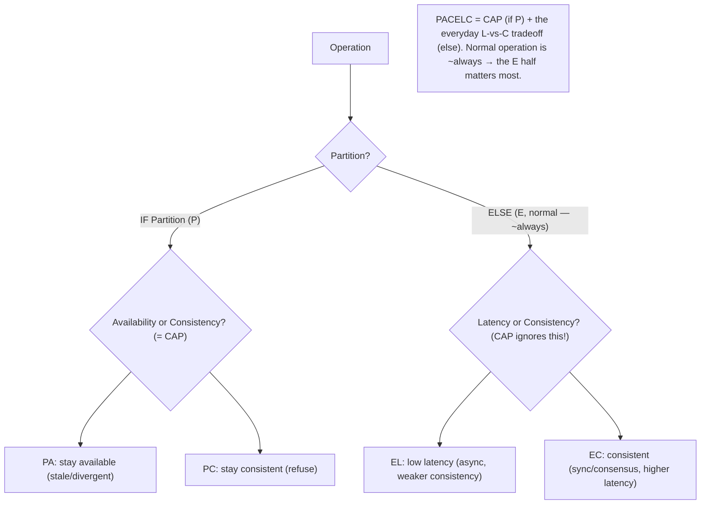
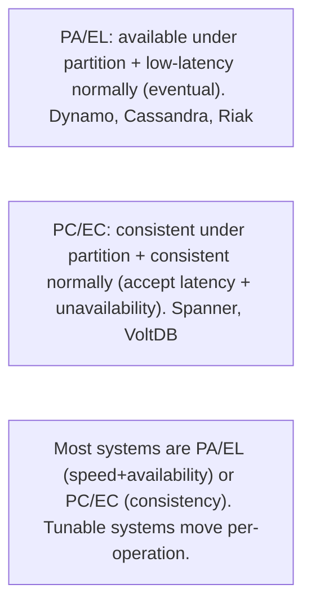

# Lesson 10.8 — PACELC — The More Useful Framing

> Part 10: Consistency & Replication · Difficulty: 🔴
>
> **Prerequisites:** [10.7 CAP], [10.2 Sync/Async Replication], [10.5 Consistency Spectrum], [10.6 Linearizability].
> **Unlocks:** [10.9 Quorums], [Part 13 Multi-region], [Part 20 Capstone].

---

## 1. Learning Objectives

After this lesson you will be able to:

- State **PACELC**: **if Partition (P) → choose Availability (A) or Consistency (C); Else (E, normal operation) → choose Latency (L) or Consistency (C)** — and why it's a **more complete and useful** framing than CAP (10.7).
- Explain the key insight PACELC adds: the **consistency-vs-latency tradeoff exists even without a partition** (in normal operation) — and is often the **more impactful daily** tradeoff (since partitions are rare but latency is always present).
- Classify systems with PACELC notation (**PA/EL, PC/EC, PA/EC, PC/EL**) and interpret real-system classifications (Dynamo/Cassandra = PA/EL; Spanner = PC/EC; etc.).
- Use PACELC as a **design lens**: decide **both** the partition behavior (like CAP) **and** the everyday latency-vs-consistency tradeoff, per data type.

---

## 2. Motivation — CAP's blind spot: the everyday tradeoff

CAP (10.7) is famous but **incomplete**: it only tells you what happens **during a network partition** — a **rare** event. It says **nothing** about the **99.9% of the time when there's no partition** — yet there's a real, constant tradeoff even then. **PACELC** (Daniel Abadi, 2012) fills exactly this gap, and in doing so becomes the **more useful framing** for actually designing systems. The insight is simple but profound: **even without a partition, a replicated system faces a consistency-vs-latency tradeoff.** To provide **strong consistency (linearizability — 10.6)**, replicas must **coordinate** on every write (synchronous replication — 10.2, consensus — 8.3) — which **costs latency** (round-trips to replicas, possibly cross-region). To be **fast (low latency)**, you replicate **asynchronously** — which means replicas **lag** and reads can be **stale** (weaker consistency — 10.3/10.5). This tradeoff is present **all the time**, not just during partitions — and since partitions are rare, it's the **more impactful, everyday** decision.

PACELC captures both: **if there's a Partition (P), you trade Availability (A) vs Consistency (C)** — that's CAP; **Else (E, normal operation), you trade Latency (L) vs Consistency (C)** — the part CAP ignores. This gives a **four-way classification** (PA/EL, PC/EC, etc.) that describes a system's behavior **both during partitions and in normal operation** — far richer than CAP's partition-only view. It also explains real systems better: Cassandra/Dynamo are **PA/EL** (available under partition, low-latency normally — both favor availability/speed over consistency), while Spanner is **PC/EC** (consistent under partition, consistent normally — favors consistency in both cases, accepting latency). This lesson develops PACELC as the practical design lens — because most of the time you're not partitioned, and the latency-vs-consistency choice you make for **normal operation** shapes your system's everyday behavior more than the rare partition case does.

---

## 3. Theory — From first principles

### 3.1 The PACELC statement

`[CS]` **PACELC (Abadi):** 
> **If** there is a **Partition (P)**, the system must trade between **Availability (A)** and **Consistency (C)** [this is CAP]; 
> **Else (E)** — during **normal operation (no partition)** — the system must trade between **Latency (L)** and **Consistency (C)**.

Read as: **P → A|C ; E → L|C.** Two tradeoffs, two situations. **CAP is just the "if P" half**; PACELC adds the **"else" (E) half** — the normal-operation latency-vs-consistency tradeoff CAP omits (10.7 §3.5).

### 3.2 The key insight — consistency costs latency even without a partition

`[CS]` The heart of PACELC is the **"else" clause**: **even when there's no partition, providing strong consistency costs latency** `[CS]`:
- To be **strongly consistent (linearizable — 10.6)**, every write must be **coordinated across replicas** before it's acknowledged (**synchronous replication** — 10.2) and reads must see the latest (leader reads / consensus — 8.3) → **round-trips to replicas** (possibly **cross-region** — high latency) on every operation → **higher latency, always** (not just during partitions).
- To be **low-latency**, you replicate **asynchronously** (10.2) — ack immediately, propagate in the background → **fast**, but replicas **lag** (stale reads — 10.3) → **weaker consistency**.
So the **consistency-vs-latency tradeoff is inherent to replication itself**, present in **normal operation**, independent of partitions. This is the tradeoff CAP **misses** — and it's the one you live with **every day** (partitions are rare; latency is constant). **That's why PACELC is more useful:** it forces you to decide the **everyday** behavior, not just the rare-partition behavior.

### 3.3 The four-way classification

`[CS]` PACELC classifies systems by **two** choices (partition behavior + normal behavior), giving four combinations:
- **PA/EL:** under **P**artition → **A**vailable; **E**lse → **L**atency. **Favors availability + low latency** over consistency in **both** cases. **Examples:** Dynamo, Cassandra, Riak (AP + async/low-latency) — "always fast and available, eventually consistent." The classic high-availability, low-latency, eventually-consistent stores.
- **PC/EC:** under **P**artition → **C**onsistent; **E**lse → **C**onsistent. **Favors consistency in both** cases, accepting unavailability under partition **and** higher latency normally. **Examples:** Spanner (external consistency — 8.2.4), traditional strongly-consistent systems, VoltDB. "Always consistent, at the cost of availability under partition and latency normally."
- **PA/EC:** under partition → **A**vailable; else → **C**onsistent. Favors consistency normally (accepts latency) but availability under partition. (Less common; some configurations.)
- **PC/EL:** under partition → **C**onsistent; else → **L**atency. Consistent under partition but fast (weaker) normally. (Less common; some configurations — e.g., PNUTS-like.)
Most systems are **PA/EL** (availability + speed, eventual) or **PC/EC** (consistency in both, at latency/availability cost) — the two "coherent" extremes. The notation captures a system's **full behavior profile** across both situations.

### 3.4 Why PACELC is more useful than CAP

`[CS]`/`[OPINION]`
- **It covers the common case.** Partitions are **rare**; normal operation is **~always**. CAP describes only the rare case; PACELC describes **both**, including the everyday latency-vs-consistency choice that shapes your system's normal behavior (§3.2).
- **It exposes the real daily tradeoff.** Many systems that look "the same" under CAP (both AP, say) differ enormously in **normal operation** — one might be strongly consistent normally (EC), another eventually consistent for low latency (EL). PACELC distinguishes them.
- **It matches how you actually design.** You spend most effort on the **normal-operation** behavior (latency vs consistency — sync vs async replication — 10.2), which CAP doesn't address. PACELC makes that a **first-class** decision.
- **It's a superset of CAP.** PACELC = CAP (the "if P" half) + the normal-operation tradeoff (the "else" half). Nothing is lost; more is gained. **Use PACELC.**

### 3.5 PACELC maps to concrete mechanisms

`[CS]` PACELC's abstract tradeoffs are made real by mechanisms you know:
- **The "else" (L vs C) choice = the sync/async replication choice (10.2):** **async replication = EL** (fast, lagging, weaker consistency); **synchronous replication / consensus = EC** (consistent, higher latency). So **choosing sync vs async replication IS choosing the PACELC "else" behavior.**
- **The "if P" (A vs C) choice = the CAP choice (10.7):** quorum/consensus (majority refuses on minority → **PC**) vs leaderless/sloppy-quorum (stay available → **PA**) (8.3.4/10.9).
- **Tunable systems** (Cassandra R/W levels — 8.3.4/10.9) let you **move along both axes per operation** — a QUORUM read/write leans PC/EC; ONE leans PA/EL. So the same system can offer different PACELC behavior **per query**.
- **Cross-region** amplifies the "else" latency cost — EC across regions means cross-region round-trips per write (very high latency), which is why cross-region systems often choose **EL** (async — 10.2) or invest in TrueTime-style bounded latency (Spanner — 8.2.4) to afford EC.

### 3.6 Using PACELC as a design lens

`[BP]` The practical framework (extending CAP's per-data approach — 10.7):
1. **For each data type, decide BOTH tradeoffs:** 
   - **P (partition):** availability or consistency? (CAP — 10.7 — money→C, cart→A.)
   - **E (normal):** latency or consistency? (money→C accept latency; feed→L accept staleness.)
2. **Money/uniqueness/coordination → PC/EC** (consistent in both — accept latency + unavailability under partition).
3. **Feeds/carts/analytics/caches → PA/EL** (available + fast — accept eventual consistency in both).
4. **Mix per data type** (like the consistency spectrum — 10.5 — and CAP — 10.7): a system is rarely uniformly PA/EL or PC/EC — balances are PC/EC, feeds are PA/EL.
5. **Implement via sync/async replication (10.2) + quorum/consensus (8.3.4)** — the concrete levers for the L-vs-C and A-vs-C choices (§3.5).
The key mindset shift from CAP: **also decide the normal-operation behavior** — because that's what your users experience the vast majority of the time.

### 3.7 Relationship to the rest of Part 10

`[CS]`
- **CAP (10.7):** PACELC's "if P" half. PACELC = CAP + normal-operation tradeoff.
- **Sync/async replication (10.2):** the "else" (L vs C) lever — async=EL, sync=EC.
- **Consistency spectrum (10.5):** the "C" in PACELC is where you land on the spectrum (linearizable=EC, eventual/causal=EL); PACELC's L-vs-C is "how strong on the spectrum in normal operation."
- **Quorums (10.9):** tuning R/W moves along both PACELC axes per operation.
- **Linearizability (10.6):** the "C" (both in P and E) is linearizability; EL/PA give it up for latency/availability.
So PACELC is the **integrating framework** for Part 10's tradeoffs — it names both the partition (CAP) and the normal-operation (latency-vs-consistency) choices, both implemented by sync/async replication and quorum/consensus, landing you at a point on the consistency spectrum for each situation.

---

## 4. Visual Intuition

### PACELC: two situations, two tradeoffs

### Classification examples

---

## 5. Real-World Analogy

Recall the **two-branch bank** from CAP (10.7), where the phone line between branches can go down.

- **CAP only asked:** "**when the phone line is down** (partition), do you stay open-but-risk-errors (A) or refuse-but-stay-correct (C)?" — a decision about a **rare** event.
- **PACELC adds the everyday question:** "**even when the phone line is perfectly fine** (normal operation, ~always), do you **call the other branch to verify every transaction** — making each transaction **correct but slow** (Consistency, high Latency) — or do you **process locally and sync up later** — making each transaction **fast but occasionally based on slightly-stale info** (Latency, weaker Consistency)?" This tradeoff is present **all day, every day**, not just during phone outages — and since outages are rare, **this everyday choice affects customers far more.**
- **PA/EL bank:** "We always process transactions **fast and locally**, and if the phone line drops we **keep serving** — we reconcile any discrepancies afterward." Fast and always-open, occasionally slightly wrong (like a **loyalty-points** system).
- **PC/EC bank:** "We **always verify with the other branch** before finalizing (slower, but never wrong), and if the phone line drops we **stop** rather than risk an error." Always correct, but slower every day and closed during outages (like a **core banking ledger**).
- **The insight:** CAP only debated the **rare phone-outage** behavior; PACELC points out you *also* — and more importantly — must decide the **everyday "verify-or-not"** behavior, because that's what customers experience the **vast majority** of the time. A real bank makes **different choices per product**: the **ledger** is PC/EC (always verify, refuse during outages), the **loyalty points** are PA/EL (fast, local, reconcile later).

---

## 6. Industry Example

- **PA/EL: Dynamo, Cassandra, Riak** `[CONV]`: available under partition (leaderless — 10.1) + low-latency normally (async, eventual consistency, ONE-level reads/writes) — favor availability + speed over consistency in both cases (§3.3). *(Representative.)*
- **PC/EC: Google Spanner, VoltDB** `[EMERGING]`: consistent under partition (refuse rather than diverge) + consistent normally (accept latency — TrueTime commit-wait — 8.2.4) — consistency in both, at latency/availability cost (§3.3). *(Representative.)*
- **Tunable PACELC (Cassandra levels)** `[CONV]`: QUORUM reads/writes lean PC/EC; ONE leans PA/EL — per-operation choice along both axes (§3.5, 8.3.4/10.9). *(Representative.)*
- **PC/EL and PA/EC (less common)** `[CS]`: PNUTS-like (consistent under partition but low-latency normally), etc. — the four-way classification captures nuanced systems (§3.3). *(Representative.)*
- **Abadi's PACELC framing** `[EMERGING]`: introduced explicitly to fix CAP's omission of the normal-operation latency-vs-consistency tradeoff — widely adopted as the more complete lens (§3.4). *(Representative.)*

---

## 7. Implementation Details — designing with PACELC

- **For each data type, decide BOTH:** the **partition** tradeoff (A vs C — CAP, 10.7) **and** the **normal-operation** tradeoff (L vs C) (§3.6) — the latter is what users experience daily `[BP]`.
- **Money/uniqueness/coordination → PC/EC** (consistent in both — accept latency + unavailability under partition); implement via **sync replication / consensus / leader reads** (10.2/8.3) (§3.6).
- **Feeds/carts/analytics/caches → PA/EL** (available + fast — accept eventual/causal consistency); implement via **async replication / leaderless / low quorum** (10.2/10.1/8.3.4) (§3.6).
- **Use tunable consistency (R/W levels — 8.3.4/10.9)** to choose PACELC behavior **per operation** where the store supports it (§3.5).
- **Mind cross-region latency** — EC across regions = cross-region round-trips per write (very high latency); often choose **EL** cross-region, or invest in TrueTime-style bounded latency (Spanner) to afford EC (§3.5, 8.2.4, Part 13).
- **Prefer PACELC over CAP** as your design lens — it forces the everyday (normal-operation) decision CAP omits (§3.4).
- **Mix per data type** — rarely uniformly PA/EL or PC/EC; balances PC/EC, feeds PA/EL (§3.6, 10.5/10.7).

---

## 8. Advantages (of the PACELC lens)

- **Covers the common case** — the normal-operation (everyday) latency-vs-consistency tradeoff, which CAP ignores (§3.2/3.4).
- **Distinguishes systems CAP conflates** — two AP systems can differ (EL vs EC) in normal operation (§3.4).
- **Matches real design** — you spend most effort on normal-operation behavior; PACELC makes it first-class (§3.4).
- **Superset of CAP** — nothing lost, the partition tradeoff plus the normal-operation one (§3.4).
- **Maps to concrete levers** — sync/async replication (L-vs-C) + quorum/consensus (A-vs-C) (§3.5).
- **Per-data / per-operation** — decide both tradeoffs per data type (§3.6).

---

## 9. Disadvantages / limits

- **Still a simplification** — real behavior is a spectrum/tunable, not four discrete boxes; partitions are partial/brief (like CAP's limits — 10.7 §3.5).
- **"C" is linearizability** — doesn't directly address weaker-but-useful models (causal/session — 10.5); a system can be "EL" but still offer causal consistency (§3.3, 10.5).
- **Classification can be coarse** — many systems are tunable (per-operation), so a single PACELC label is approximate (§3.5).
- **Requires understanding the mechanisms** — sync/async, quorums, consensus — to apply meaningfully (§3.5).
- **Less famous than CAP** — you'll often have to explain it (though it's more useful) (§3.4).

---

## 10. When NOT to / limits

- **Don't ignore the "else" (normal-operation) tradeoff** — it's the everyday one; designing only for the partition case (CAP) misses what users experience most (§3.2/3.4).
- **Don't treat PACELC labels as absolute** — many systems are tunable per-operation; the label is approximate (§3.5).
- **Don't force one PACELC choice system-wide** — mix per data type (money PC/EC, feed PA/EL) (§3.6).
- **Don't use EC across regions** without accounting for cross-region latency (or bounded-latency clocks — Spanner) (§3.5).
- **Don't conflate "EL" with "no consistency"** — EL can still offer causal/session consistency (10.5) (§3.3).

---

## 11. Common Mistakes

1. **Using CAP alone (ignoring the "else")** — designing only for partitions, missing the everyday latency-vs-consistency tradeoff (§3.2/3.4).
2. **Choosing EC without accounting for its latency** — strong consistency's coordination cost surprises in normal operation (esp. cross-region) (§3.2/3.5).
3. **Choosing EL then being surprised by stale reads** — low latency means async lag → the anomalies of 10.3 (§3.2).
4. **One PACELC choice system-wide** — money and feeds need different profiles (§3.6).
5. **Treating labels as absolute** — ignoring that tunable systems vary per operation (§3.5).
6. **Conflating "EL" with no consistency** — EL can still be causal/session (§3.3, 10.5).
7. **EC across regions unplanned** — cross-region round-trips per write → high latency (§3.5).

---

## 12. Interview Questions

**🟢 Easy**
- State PACELC. How does it extend CAP?
- What is the "else" tradeoff, and why does it exist even without a partition?

**🟡 Medium**
- Why is the consistency-vs-latency tradeoff present in normal operation (no partition)? Tie it to sync vs async replication.
- Classify Cassandra and Spanner with PACELC and explain each letter.

**🔴 Hard**
- Why is PACELC more useful than CAP for real design? What does it capture that CAP misses, and why does that matter more day-to-day?
- How do the PACELC axes map to concrete mechanisms (sync/async replication, quorums, consensus), and how does a tunable system (Cassandra levels) move along them?

**⚫ Staff+**
- Design the replication/consistency profile for a global system with balances, a social feed, and analytics. Assign each a PACELC classification (PC/EC vs PA/EL), justify both the partition and normal-operation choices, implement via sync/async replication + quorums, and address cross-region latency for the EC data (TrueTime/Spanner-style vs accepting EL — 8.2.4/10.2).
- Explain why two systems both classified "AP" under CAP can behave very differently, and how PACELC (EL vs EC) captures that difference. Give a scenario where the normal-operation (E) choice matters far more than the partition (P) choice.

---

## 13. Production Pitfalls

- **Unexpected latency from EC:** choosing strong consistency (EC) means coordination on every write — normal-operation latency spikes, especially cross-region (§3.2/3.5) — a daily cost, not just a partition one.
- **Stale-read surprise from EL:** choosing low latency (EL, async) means lagging replicas → stale reads/anomalies in normal operation (10.3) (§3.2).
- **CAP-only design misses the everyday tradeoff:** a system tuned only for partition behavior has an unconsidered (and possibly wrong) normal-operation latency/consistency profile (§3.4).
- **One-size PACELC:** treating everything as PC/EC (needless latency for feeds) or PA/EL (correctness bugs for money) instead of per-data (§3.6).
- **Cross-region EC latency:** strong consistency across regions without bounded-latency clocks → cross-ocean round-trips per write (§3.5, Part 13).
- **Label confusion:** assuming an "EL" system has no consistency (it may offer causal/session) (§3.3, 10.5).

---

## 14. Optimization Techniques

- **Decide both P (A|C) and E (L|C) per data type** — PC/EC for money, PA/EL for feeds (§3.6) `[BP]`.
- **Implement E via sync/async replication (10.2)** — EL=async (fast), EC=sync/consensus (consistent); implement P via quorum/consensus vs leaderless (8.3.4/10.1) (§3.5).
- **Tunable consistency per operation** (Cassandra R/W levels — 8.3.4/10.9) to hit the right PACELC point per query (§3.5).
- **Causal/session consistency on the EL side** (10.5/10.3) — low latency + fewer anomalies (better than bare eventual) (§3.3).
- **Bounded-latency clocks (TrueTime — 8.2.4)** to afford EC with acceptable latency, even cross-region (§3.5).
- **Prefer PACELC over CAP** as the design lens — decide the everyday behavior, not just the rare-partition one (§3.4).
- **Locality-aware placement** (nearby replicas) to reduce EC's normal-operation latency (Part 13).

---

## 15. Summary

**PACELC** (Abadi) is the **more complete and useful** framing than CAP: **if there is a Partition (P), trade Availability (A) vs Consistency (C)** [this is CAP — 10.7]; **Else (E), in normal operation, trade Latency (L) vs Consistency (C)**. Its key insight — the one CAP **misses** — is that **the consistency-vs-latency tradeoff exists even without a partition**: to be **strongly consistent (linearizable — 10.6)**, replicas must **coordinate on every write** (synchronous replication — 10.2, consensus — 8.3), which **costs latency (always)**; to be **low-latency**, you replicate **asynchronously** → replicas **lag** → **stale reads/weaker consistency** (10.3). Since **partitions are rare but latency is constant**, the **"else" (normal-operation) tradeoff is the more impactful, everyday** decision — which is exactly why PACELC beats CAP for real design. It yields a **four-way classification**: **PA/EL** (available under partition + low-latency normally — favors availability + speed, eventual consistency — **Dynamo, Cassandra, Riak**), **PC/EC** (consistent in both — accepts unavailability under partition + latency normally — **Spanner, VoltDB**), and the less-common **PA/EC** and **PC/EL**. The axes map to **concrete mechanisms**: the **"else" (L vs C) = the sync/async replication choice** (10.2 — async=EL, sync/consensus=EC); the **"if P" (A vs C) = the CAP/quorum choice** (10.7 — leaderless/sloppy-quorum=PA, majority/consensus=PC); and **tunable systems** (Cassandra R/W — 8.3.4/10.9) move along **both axes per operation**. Use PACELC as a **design lens**: for **each data type**, decide **both** tradeoffs — **money/uniqueness/coordination → PC/EC** (consistent in both, accept latency), **feeds/carts/analytics → PA/EL** (available + fast, eventual/causal) — **mixing per data** (like CAP — 10.7 — and the consistency spectrum — 10.5), and mind that **cross-region EC** means cross-region round-trips per write (very high latency — often choose EL cross-region or invest in TrueTime-style bounded latency — 8.2.4). The mindset shift from CAP: **also (and especially) decide the normal-operation behavior**, because that's what your users experience the vast majority of the time. PACELC is the **integrating framework** for Part 10 — naming both the partition and everyday tradeoffs, implemented by sync/async replication and quorum/consensus, landing you at a point on the consistency spectrum for each situation.

---

## 16. Revision Notes (flashcard-ready)

- **Q:** PACELC? **A:** If Partition → Availability or Consistency; Else (normal) → Latency or Consistency.
- **Q:** What does PACELC add over CAP? **A:** The "else" — the consistency-vs-latency tradeoff in normal operation (no partition), which CAP ignores.
- **Q:** Why does consistency cost latency without a partition? **A:** Strong consistency needs cross-replica coordination on every write (sync replication/consensus) → round-trips → latency.
- **Q:** Why is PACELC more useful? **A:** Partitions are rare; normal operation is ~always → the everyday L-vs-C choice matters more.
- **Q:** PA/EL? **A:** Available under partition + low-latency normally (eventual). Dynamo, Cassandra, Riak.
- **Q:** PC/EC? **A:** Consistent under partition + consistent normally (accept unavailability + latency). Spanner, VoltDB.
- **Q:** "Else" (L vs C) maps to? **A:** Sync vs async replication (10.2): async=EL, sync/consensus=EC.
- **Q:** "If P" (A vs C) maps to? **A:** CAP/quorum choice: leaderless/sloppy=PA, majority/consensus=PC.
- **Q:** Design use? **A:** Decide BOTH tradeoffs per data type: money PC/EC, feeds PA/EL; mix; tunable per operation.
- **Q:** Cross-region EC caveat? **A:** Cross-region round-trips per write = high latency; choose EL or bounded-latency clocks (TrueTime).

---

## 17. Further Reading + Knowledge-Graph Links

**Within this platform**
- **Previous:** [10.7 CAP] (the "if P" half). **Builds on:** [10.2 Sync/Async Replication] (the "else" lever), [10.5 Consistency Spectrum] (where "C" lands), [10.6 Linearizability] (the "C").
- **Next:** [10.9 Quorums] (tuning along both axes). **Then:** Part 10 README.
- **Enables:** [Part 13 Multi-region] (cross-region L-vs-C), [Part 20 Capstone] (per-data PACELC), [8.2.4 TrueTime] (afford EC).

**Foundational texts (synthesized)**
- Abadi, "Consistency Tradeoffs in Modern Distributed Database System Design" (PACELC) (concept, synthesized).
- Gilbert & Lynch (CAP — 10.7) (concept, synthesized).
- Kleppmann, *Designing Data-Intensive Applications* — consistency/latency tradeoffs (synthesized).

**Concept tags:** `[CS]` PACELC (P→A|C, E→L|C), consistency-costs-latency in normal operation, four-way classification, superset of CAP · `[CONV]` PA/EL (Dynamo/Cassandra) vs PC/EC (Spanner), tunable per-operation · `[BP]` decide both tradeoffs per data type, sync/async=E lever, prefer PACELC over CAP, causal on the EL side · `[EMERGING]` PACELC framing, TrueTime to afford EC.
