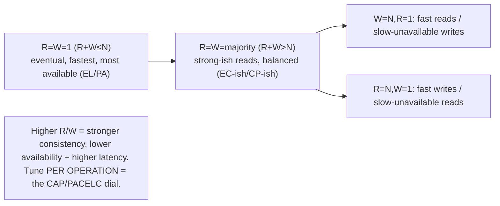
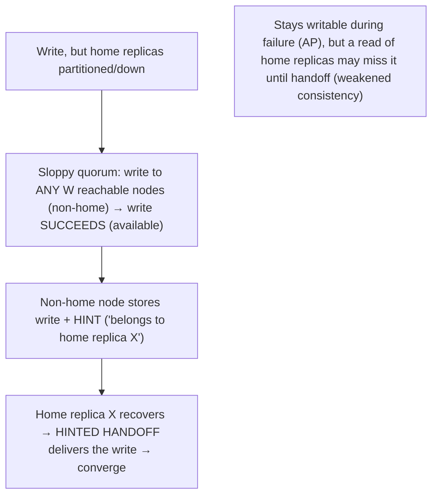

# Lesson 10.9 — Quorum Tuning and Sloppy Quorums / Hinted Handoff

> Part 10: Consistency & Replication · Difficulty: 🔴
>
> **Prerequisites:** [8.3.4 Quorums R+W>N], [10.1 Leaderless], [10.4 Conflicts], [10.7 CAP], [10.8 PACELC].
> **Unlocks:** [Part 11 Resilience], [Part 13 Multi-region], [Part 18 Dynamo/Cassandra], [Part 20 Capstone].

---

## 1. Learning Objectives

After this lesson you will be able to:

- Apply **quorum tuning** in leaderless replication (10.1) — choosing **N, R, W** to move along the **consistency ↔ availability ↔ latency** spectrum (CAP/PACELC — 10.7/10.8), per operation.
- Explain **`R + W > N`** as the strong-read threshold and the practical tunings (`W=N`, `R=N`, `R=W=majority`, `R=W=1`) and what each optimizes.
- Describe **sloppy quorums + hinted handoff** — how leaderless systems stay **available during partitions/failures** by writing to *any* reachable nodes and handing off later — and the **consistency guarantee it sacrifices**.
- Reason about the operational realities that **quorums alone don't fully solve** (concurrent-write conflicts, read repair, anti-entropy — 10.4/8.3.4) and choose quorum settings for a workload.

---

## 2. Motivation — The tuning knobs of leaderless replication (and the availability hack)

Leaderless replication (10.1, Dynamo-style) is unique in giving you **explicit, per-operation control** over the consistency/availability/latency tradeoff through three numbers: **N** (replicas per item), **W** (replicas that must ack a write), and **R** (replicas that must respond to a read). These are the **concrete tuning knobs** for CAP/PACELC (10.7/10.8) — by adjusting R and W you slide along the spectrum from "fast and available but stale" to "consistent but slower and less available," and you can do it **per operation** (a critical write uses a high quorum; a tolerant read uses R=1). This lesson makes quorum tuning practical, building on the mechanics from 8.3.4 (`R+W>N`, intersection) and framing it with the tradeoffs from 10.5–10.8.

The second half is the **availability hack** that makes leaderless systems so resilient: **sloppy quorums with hinted handoff.** A strict quorum requires W of the item's *home* replicas — but during a partition or failure, those home replicas might be **unreachable**, which would block writes. A **sloppy quorum** relaxes this: write to **any W reachable nodes** (even ones that don't normally own the data), which hold the write temporarily and **hand it off** to the home replicas when they recover. This keeps the system **writable even during failures** (maximizing availability — the AP choice, 10.7) — but it **weakens the consistency guarantee** (a read of the home replicas might not see a sloppily-written value until handoff completes). This is the mechanism behind "always writable" Dynamo-style stores, and it's a deliberate **availability-over-consistency** tradeoff. This lesson develops quorum tuning as the practical CAP/PACELC dial and sloppy quorums/hinted handoff as the availability mechanism — the operational toolkit for leaderless systems, essential for Dynamo/Cassandra-style design (Part 18) and the capstone (Part 20).

---

## 3. Theory — From first principles

### 3.1 Recap: N, R, W and R+W>N (from 8.3.4)

`[CS]` In leaderless replication (10.1), each item has **N replicas**; a **write** must be acked by **W** of them, a **read** must get responses from **R** of them (8.3.4). The key rule: **`R + W > N`** guarantees the read and write quorums **overlap in at least one node** → that node has the latest write → **a read sees the most recent successful write** (strong-read guarantee). Reads reconcile multiple responses using **versions** (version vectors — 8.2.2 — to detect concurrent conflicts) or timestamps, taking the newest. This is the mechanical foundation (8.3.4); this lesson is about **choosing** N/R/W and the **sloppy** variant.

### 3.2 Quorum tuning — the consistency/availability/latency dial

`[CS]` By choosing R and W (given N), you tune the tradeoff **per operation** `[BP]`:
- **`R = W = majority` (⌊N/2⌋+1):** balanced — `R+W>N` (strong reads), tolerates `f` failures with `N=2f+1` (8.3.4). The common default for strong-ish reads.
- **`W = N, R = 1`:** writes hit **all** replicas (slow writes, low write availability — any replica down blocks the write), reads hit **one** (fast reads). Optimizes **read latency/availability** at the cost of write availability. Good for **read-heavy, write-rare** data.
- **`R = N, W = 1`:** fast writes (one replica acks), reads consult **all** (slow reads, low read availability). Optimizes **write latency/availability**.
- **`R = W = 1` (so `R+W ≤ N`):** **no overlap guaranteed** → reads may **miss** the latest write → **eventual consistency** (fastest, most available, but stale reads possible). The maximal availability/latency, weakest consistency.
- **Higher R/W = stronger consistency but lower availability + higher latency** (must reach more replicas); **lower R/W = weaker consistency but faster + more available.** This is the **CAP/PACELC tradeoff (10.7/10.8) made into a dial** — and tunable **per operation**: a critical read uses QUORUM (strong), a tolerant read uses ONE (fast/available).

### 3.3 The tradeoffs each tuning makes (CAP/PACELC lens)

`[CS]` Framing via PACELC (10.8):
- **`R+W>N` (e.g., majority) = leaning EC/CP** — strong reads (see latest write), but writes/reads need more replicas → **higher latency** and **lower availability** (if you can't reach the quorum, the operation fails — CP under partition).
- **`R+W≤N` (e.g., R=W=1) = leaning EL/PA** — fast, highly available (reach fewer replicas), but **stale reads** (no overlap guarantee) → **eventual consistency** (AP under partition).
- **Per-operation tuning** = per-operation PACELC choice: the same store can serve a **strong** read (QUORUM, EC-ish) and a **fast** read (ONE, EL) — the flexibility leaderless replication uniquely offers. So **quorum settings are the concrete implementation of the CAP/PACELC dial** (10.7/10.8).

### 3.4 What quorums alone don't solve (the caveats — recap from 8.3.4)

`[CS]` `R+W>N` guarantees **intersection**, **not** full linearizability (8.3.4 §3.6, 10.6) — real caveats:
- **Concurrent writes conflict:** two writes to overlapping quorums can be **concurrent** (8.2.2) — the overlap node sees both, but "which is latest?" needs **conflict resolution** (version vectors → siblings/LWW/CRDTs — 10.4). Quorums don't resolve concurrent writes.
- **Partial writes:** a write reaching *some* but not *W* replicas (then the client crashes) leaves an in-between state; later reads may or may not see it.
- **Read repair + anti-entropy needed:** quorum reads **repair** stale replicas they encounter (write back the latest — 8.3.4), and background **anti-entropy** (e.g., Merkle-tree sync) reconciles replicas — needed because quorums don't *push* every write to all N replicas synchronously.
- **Not linearizable:** bare `R+W>N` gives "strong-ish" (read-your-writes-ish for sequential writes) but **not** linearizable consistency (10.6) — edge cases (concurrent ops, sloppy quorums — §3.5) break linearizability. For true linearizability you need a leader/consensus (8.3), not bare quorums.
So quorum tuning gives a **tunable consistency dial**, but **not** strong (linearizable) guarantees by itself — pair with conflict resolution (10.4), read repair, and anti-entropy.

### 3.5 Sloppy quorums — availability during failures

`[CS]` A **strict quorum** requires W of the item's **designated home replicas** (the N nodes that normally own it — via consistent hashing, 8.3.4/7.3). But during a **partition or failures**, those home replicas might be **unreachable** → a strict quorum write would **fail** (unavailable). A **sloppy quorum** relaxes this `[CONV]`:
- **Write to any W *reachable* nodes** — even nodes that are **not** the item's home replicas — so the write **succeeds** as long as **any W nodes** in the cluster are reachable (not necessarily the home ones).
- **Benefit:** dramatically **higher write availability** — the system stays **writable** even when many home replicas are down or partitioned away (the "always writable" Dynamo property). This is the **AP choice** (10.7) — favor availability over consistency during failures.
- **Cost:** the write is on **non-home** nodes → a **read of the home replicas might not see it** (they don't have it yet) → **stale reads even with `R+W>N`** → the **intersection/strong-read guarantee is weakened** (8.3.4 §3.7). Sloppy quorums **trade the consistency guarantee for availability.**

### 3.6 Hinted handoff — reconciling sloppy writes

`[CS]` Sloppy quorums need a way to get the temporarily-misplaced writes back to their **home replicas** — that's **hinted handoff** `[CONV]`:
- When a write goes to a **non-home** node (because a home replica was unreachable), that node stores the write **with a "hint"** — metadata saying "this actually belongs to home replica X; deliver it when X is reachable again."
- When the home replica **recovers** (or the partition heals), the temporary holder **hands off** the write to it (delivers the hinted data), then discards its temporary copy.
- **Result:** the write is eventually delivered to its proper home replicas → the system **converges** (eventual consistency) after the failure heals. Hinted handoff is the **repair mechanism** that reconciles sloppy-quorum writes, ensuring durability + eventual convergence despite the temporary misplacement.
- Combined with **read repair** and **anti-entropy** (§3.4), hinted handoff keeps a leaderless system **available during failures and eventually consistent afterward** — the operational backbone of Dynamo-style availability.

### 3.7 Choosing quorum settings for a workload

`[BP]`
| Need | Setting |
|---|---|
| Strong-ish reads (see latest write), balanced | **R=W=majority** (`R+W>N`) |
| Read-heavy, write-rare, fast reads | **W=N, R=1** (slow/less-available writes) |
| Write-heavy, fast writes | **R=N, W=1** (slow/less-available reads) |
| Max availability + latency, staleness OK | **R=W=1** (`R+W≤N`, eventual) |
| Stay writable during failures/partitions | **Sloppy quorums + hinted handoff** (weaken consistency guarantee) |
| True linearizability | **Not bare quorums** — use leader/consensus (8.3) |

- **Tune per operation** — critical reads QUORUM, tolerant reads ONE (§3.2/3.3).
- **Odd N (3/5)** for clean majorities and failure tolerance (8.3.4).
- **Enable/accept sloppy quorums** for the AP "always writable" property, **or disable** them when you need the strict intersection guarantee (accepting reduced availability during failures) — a deliberate CAP choice (10.7).
- **Always pair with conflict resolution** (version vectors/CRDTs — 10.4), **read repair**, and **anti-entropy** (§3.4) — quorums don't handle concurrent writes or full sync alone.

### 3.8 Where this fits

`[CS]` Quorum tuning + sloppy quorums are the **operational toolkit of leaderless (Dynamo-style) replication** (10.1):
- They implement the **CAP/PACELC dial** (10.7/10.8) concretely and **per-operation**.
- They're **specific to leaderless** — single-leader systems (10.1) don't tune R/W this way (the leader orders writes). Multi-leader has its own conflict-heavy model.
- They pair with **conflict resolution** (10.4 — the concurrent-write problem quorums don't solve), **consistent hashing** (8.3.4/7.3 — defines home replicas), and **read repair/anti-entropy** (convergence).
- They power **Cassandra/Dynamo/Riak** (Part 18) and inform the capstone's data-store choices (Part 20).

---

## 4. Visual Intuition

### Quorum tuning dial

### Sloppy quorum + hinted handoff

---

## 5. Real-World Analogy

Imagine a **package delivery network** where each address is normally served by **3 specific local depots** (N=3 home replicas).

- **Quorum tuning (N, R, W):** to **confirm a delivery** (a write), you require **W** depots to log it; to **check a package's status** (a read), you query **R** depots. If **R + W > 3** (e.g., both 2), then whenever you check, at least one queried depot **definitely has** the latest delivery info (overlap) — accurate status. If you cut corners (**query just 1, log to just 1**), you're **fast** but might check a depot that **hasn't heard** about the delivery yet (stale status — eventual consistency). You **tune per task**: for a **critical shipment**, require more depots to confirm (accurate but slower); for a **routine parcel**, one depot is fine (fast).
- **The tradeoff:** requiring **more depots** (higher R/W) means more accurate/consistent info, but it's **slower** and **fails if too many depots are unreachable** (you can't get enough to confirm). Requiring **fewer** is fast and works even when depots are down, but the info might be **stale**.
- **Sloppy quorum (the availability hack):** suppose a **snowstorm** cuts off the 3 home depots for an address (partition/failure). A **strict** rule says "can't confirm the delivery — those depots are unreachable" → the delivery is **blocked**. A **sloppy** rule says: "just log the delivery at **any 2 reachable depots**, even ones that don't normally serve this address" → the delivery **succeeds** (stays available). Those depots keep a **sticky note**: *"this delivery record actually belongs to the North-side depots — pass it along when they're back."*
- **Hinted handoff:** when the snowstorm clears and the North-side home depots reopen, the temporary depots **forward the delivery records** (with their sticky-note hints) to the proper home depots, which now have the complete picture (converge). During the storm, someone checking **only the North-side depots** wouldn't have seen the delivery (weakened consistency) — but nothing was lost, and it all reconciles afterward. **Stay open during the storm, sort it out after** — the availability-over-consistency choice.

---

## 6. Industry Example

- **Cassandra consistency levels** `[CONV]`: `ONE`/`QUORUM`/`ALL` (and `LOCAL_QUORUM` etc.) are R/W quorum tunings — per-query CAP/PACELC choice (§3.2/3.3, 8.3.4). *(Representative.)*
- **Dynamo sloppy quorums + hinted handoff** `[CONV]`: the canonical mechanism — write to any W reachable nodes during failures, hand off to home replicas on recovery → "always writable" (§3.5/3.6, Part 18). *(Representative.)*
- **Read repair + anti-entropy (Merkle trees)** `[CONV]`: Dynamo/Cassandra repair stale replicas on read and sync via Merkle-tree anti-entropy — the convergence mechanisms quorums rely on (§3.4). *(Representative.)*
- **Per-operation tuning** `[BP]`: a critical write with QUORUM/ALL, a tolerant read with ONE — moving along the dial per operation (§3.2/3.7). *(Representative.)*
- **Version vectors + siblings for concurrent writes** `[CONV]`: the conflict resolution quorums require (10.4/8.2.2) — quorums detect via versions, resolve via siblings/LWW/CRDT (§3.4). *(Representative.)*

---

## 7. Implementation Details — tuning and operating quorums

- **Tune R/W per operation** to hit the right consistency/availability/latency point (§3.2/3.7): **R=W=majority** for strong-ish reads (balanced), **W=N,R=1** for read-heavy, **R=N,W=1** for write-heavy, **R=W=1** for max availability/eventual `[BP]`.
- **Use `R+W>N`** when reads must see the latest write; **`R+W≤N`** only when staleness is acceptable (eventual) (§3.1/3.2, 8.3.4).
- **Odd N (3/5)** across failure domains for clean majorities + failure tolerance (8.3.4, Part 13).
- **Decide on sloppy quorums explicitly** — **enable** for the AP "always writable" property (weakened consistency during failures — §3.5), or **disable** when you need the strict intersection guarantee (accepting reduced availability) — a deliberate CAP choice (10.7).
- **Ensure hinted handoff + read repair + anti-entropy** are working — they provide durability and eventual convergence for sloppy/lagging writes (§3.4/3.6); monitor hint backlogs.
- **Pair with conflict resolution** (version vectors → siblings/CRDTs/LWW — 10.4/8.2.2) — quorums detect but don't resolve concurrent writes (§3.4).
- **Don't expect linearizability from bare quorums** — for true linearizability use a leader/consensus (8.3, 10.6) (§3.4).
- **Use LOCAL_QUORUM-style settings** in multi-region to avoid cross-region latency where a local quorum suffices (§3.7, Part 13, 10.8).

---

## 8. Advantages

- **Per-operation tunable consistency/availability/latency** — the CAP/PACELC dial, adjustable per query (§3.2/3.3).
- **High availability + tunable strength** — from strong-ish (majority) to eventual (R=W=1) as needed (§3.2).
- **Sloppy quorums = "always writable"** — stay available during partitions/failures (§3.5).
- **Hinted handoff + read repair + anti-entropy** — durability + eventual convergence despite failures (§3.4/3.6).
- **No single leader to fail** — leaderless resilience (10.1).

---

## 9. Disadvantages / limitations

- **Quorum ≠ linearizability** — concurrent writes, partial writes, sloppy quorums break strong consistency (§3.4, 8.3.4/10.6).
- **Concurrent-write conflicts** — quorums detect but don't resolve; need version vectors/CRDTs/siblings (§3.4, 10.4).
- **Sloppy quorums weaken the consistency guarantee** — stale reads even with `R+W>N` during failures (§3.5).
- **Higher R/W = higher latency + lower availability** (must reach more replicas) (§3.2/3.3).
- **Operational complexity** — read repair, anti-entropy, hinted-handoff backlogs, conflict resolution to run/monitor (§3.4/3.6).
- **Tuning burden** — choosing N/R/W and sloppy settings per data type/operation (§3.7).

---

## 10. When NOT to / limits

- **Don't rely on quorums for linearizability** — use a leader/consensus (8.3, 10.6) (§3.4).
- **Don't use sloppy quorums when you need the strict intersection guarantee** — disable them (accept reduced availability during failures) (§3.5).
- **Don't use `R=W=1`** when reads must see the latest write — that's eventual consistency (stale reads) (§3.2).
- **Don't skip conflict resolution** — concurrent quorum writes will conflict; without resolution → silent loss/divergence (§3.4, 10.4).
- **Don't use even N** — no extra tolerance + split-tie risk (8.3.4).
- **Don't ignore hint backlogs / anti-entropy health** — unconverged replicas / lost hints (§3.6).

---

## 11. Common Mistakes

1. **Assuming `R+W>N` = linearizability** → surprised by concurrent-write conflicts / partial writes / sloppy-quorum staleness (§3.4, 8.3.4/10.6).
2. **`R=W=1` while expecting consistency** → eventual consistency, stale reads (§3.2).
3. **Sloppy quorums without realizing the weakened guarantee** → unexpected stale reads during failures (§3.5).
4. **No conflict resolution** → concurrent quorum writes silently lose/diverge (§3.4, 10.4).
5. **Not monitoring hinted-handoff backlog / anti-entropy** → unconverged/lost writes after failures (§3.6).
6. **Even N** → no extra tolerance, split-tie risk (8.3.4).
7. **Uniform R/W for all operations** → over- or under-consistent per case (tune per operation) (§3.2/3.7).
8. **Cross-region full QUORUM** → high latency; use LOCAL_QUORUM where sufficient (§3.7, 10.8).

---

## 12. Interview Questions

**🟢 Easy**
- What do N, R, W mean, and what does `R+W>N` guarantee?
- What does tuning R and W trade off?

**🟡 Medium**
- Give three R/W tunings and what each optimizes (read-heavy, write-heavy, max-availability).
- What is a sloppy quorum, and what does it sacrifice to gain availability?

**🔴 Hard**
- Why doesn't `R+W>N` give linearizability? What else is needed (conflict resolution, read repair, anti-entropy, or a leader)?
- Explain sloppy quorums + hinted handoff end-to-end: how a write survives a partition and converges afterward, and the consistency guarantee lost meanwhile.

**⚫ Staff+**
- Design quorum settings for a leaderless store with mixed data: a "must-see-latest" config value, a high-availability shopping cart, and write-heavy telemetry. Choose N/R/W per data type, decide sloppy-quorum use, and specify conflict resolution / read repair / anti-entropy — tying to CAP/PACELC (10.7/10.8) and multi-region latency (10.8/Part 13).
- Your Cassandra cluster uses QUORUM but users still see stale/lost data during a partition. Diagnose (sloppy quorums weakening the guarantee, concurrent-write conflicts without proper resolution, or hint backlog), and design fixes (disable sloppy for critical data, version-vector/CRDT resolution, monitor hints/anti-entropy, LOCAL_QUORUM tuning).

---

## 13. Production Pitfalls

- **Stale reads under "QUORUM":** sloppy quorums (during a failure) put writes on non-home nodes → a home-replica read misses them until handoff → stale despite `R+W>N` (§3.5).
- **Lost concurrent writes:** two quorum writes were concurrent; resolved by LWW (skew — 8.1.2) → one silently lost (needed version vectors/CRDTs — §3.4, 10.4).
- **`R=W=1` stale data:** deployed believing it's consistent → eventual consistency surprises (§3.2).
- **Hint backlog / lost hints:** hinted-handoff backlog grows (many failures) or hints expire → writes never delivered to home replicas → data loss/divergence (§3.6).
- **Cross-region QUORUM latency:** full quorum spanning regions → cross-region round-trips per operation → high latency (§3.7, 10.8).
- **Even-N split:** a 4-node replica set partitions 2-2 → no quorum → unavailable (8.3.4).
- **Anti-entropy off/failing:** replicas never converge → persistent inconsistency (§3.4/3.6).

---

## 14. Optimization Techniques

- **Tune R/W per operation** — QUORUM for critical, ONE for tolerant — the CAP/PACELC dial per query (§3.2/3.7, 10.8) `[BP]`.
- **`R+W>N` (majority) for strong reads**; `R+W≤N` only for eventual/latency (§3.1/3.2, 8.3.4).
- **Sloppy quorums + hinted handoff** for "always writable" availability (accepting weakened consistency during failures); **disable** for strict-guarantee data (§3.5/3.6).
- **Version vectors + siblings/CRDTs** for concurrent-write resolution (10.4/8.2.2); **read repair + anti-entropy** for convergence (§3.4).
- **Odd N (3/5) across failure domains** (8.3.4, Part 13).
- **LOCAL_QUORUM in multi-region** to avoid cross-region latency where a local quorum suffices (§3.7, 10.8, Part 13).
- **Monitor hint backlog, anti-entropy, replica lag, conflict rates** (§3.6, Part 16).
- **Use a leader/consensus for data needing true linearizability** — not bare quorums (§3.4, 8.3, 10.6).

---

## 15. Summary

Quorum tuning is the **per-operation CAP/PACELC dial** (10.7/10.8) unique to **leaderless replication** (10.1). With **N replicas**, a write needs **W** acks and a read needs **R** responses; **`R + W > N`** makes the read and write quorums **overlap** → a read **sees the latest write** (8.3.4). **Tuning R/W** slides along the consistency/availability/latency spectrum: **`R=W=majority`** (balanced, strong-ish reads), **`W=N,R=1`** (fast reads, slow/less-available writes — read-heavy), **`R=N,W=1`** (fast writes, slow reads — write-heavy), **`R=W=1`** (`R+W≤N` → **eventual consistency**, fastest and most available, but stale reads). **Higher R/W = stronger consistency but higher latency + lower availability; lower R/W = faster + more available but weaker consistency** — and you tune it **per operation** (a critical read uses QUORUM/EC-ish; a tolerant read uses ONE/EL) — the concrete implementation of PACELC (10.8). Crucially, **`R+W>N` gives intersection, NOT linearizability** (8.3.4/10.6): **concurrent writes conflict** (quorums detect via version vectors but don't resolve — need siblings/CRDTs/LWW — 10.4), **partial writes** leave in-between states, and **read repair + anti-entropy** are needed for convergence (quorums don't push every write to all N synchronously). The **availability mechanism** is **sloppy quorums + hinted handoff**: a strict quorum needs W of the item's **home** replicas, which may be **unreachable** during a partition/failure → a **sloppy quorum** writes to **any W reachable nodes** (non-home) so the write **succeeds** (stays "always writable" — the AP choice, 10.7), and those nodes store the write with a **hint**; when the home replicas recover, **hinted handoff** delivers the writes to them (converge). This **trades the consistency guarantee for availability** — a read of the home replicas may **miss** a sloppily-written value until handoff (stale even with `R+W>N`). Together, quorum tuning + sloppy quorums + hinted handoff + read repair + anti-entropy + conflict resolution form the **operational toolkit of Dynamo-style leaderless systems** (Cassandra/Riak — Part 18): tunable, highly available, eventually consistent. **Choose per data type/operation** — strong-ish (majority, `R+W>N`) for must-see-latest, eventual (`R=W=1`) for max availability, sloppy quorums for always-writable — pairing with conflict resolution and anti-entropy, and using a **leader/consensus (not bare quorums) when you need true linearizability** (8.3/10.6).

---

## 16. Revision Notes (flashcard-ready)

- **Q:** N, R, W? **A:** N = replicas per item; W = replicas that must ack a write; R = replicas that must respond to a read.
- **Q:** `R+W>N` guarantees? **A:** Read & write quorums overlap → read sees the latest write (strong-read threshold). NOT linearizability.
- **Q:** Tuning R/W tradeoff? **A:** Higher R/W = stronger consistency, higher latency, lower availability; lower = faster, more available, weaker consistency.
- **Q:** R=W=1? **A:** `R+W≤N` → eventual consistency (fastest, most available, stale reads possible).
- **Q:** W=N,R=1 vs R=N,W=1? **A:** Fast reads/slow writes (read-heavy) vs fast writes/slow reads (write-heavy).
- **Q:** Quorums ≠ linearizability because? **A:** Concurrent writes conflict, partial writes, sloppy quorums; need conflict resolution + read repair + anti-entropy (or a leader).
- **Q:** Sloppy quorum? **A:** Write to any W reachable nodes (non-home) during failure → stay writable (available); weakens the read guarantee.
- **Q:** Hinted handoff? **A:** Non-home node stores a sloppy write with a hint; delivers it to the home replica on recovery → converge.
- **Q:** What does sloppy quorum sacrifice? **A:** The consistency guarantee — a home-replica read may miss a sloppily-written value until handoff (stale even with R+W>N).
- **Q:** Tune per what? **A:** Per operation (QUORUM for critical, ONE for tolerant) — the CAP/PACELC dial per query.
- **Q:** For true linearizability? **A:** Use a leader/consensus (8.3), not bare quorums.

---

## 17. Further Reading + Knowledge-Graph Links

**Within this platform**
- **Builds on:** [8.3.4 Quorums (R+W>N, intersection)] (mechanics), [10.1 Leaderless], [10.4 Conflict Resolution] (concurrent writes), [10.7 CAP]/[10.8 PACELC] (the dial), [10.6 Linearizability] (what quorums don't give).
- **Closes:** Part 10 (then the Part 10 README). **Next:** [Part 11 Fault Tolerance].
- **Enables:** [Part 18 Dynamo/Cassandra case studies], [Part 13 Multi-region (LOCAL_QUORUM)], [Part 20 Capstone] (data-store tuning).

**Foundational texts (synthesized)**
- DeCandia et al., *Dynamo* — R/W quorums, sloppy quorums, hinted handoff, read repair, anti-entropy (concept, synthesized).
- Kleppmann, *Designing Data-Intensive Applications* — quorums, sloppy quorums, hinted handoff, limitations (synthesized).
- Cassandra documentation — consistency levels (representative).

**Concept tags:** `[CS]` N/R/W tuning, R+W>N, quorum≠linearizability, sloppy quorums, hinted handoff, read repair, anti-entropy · `[CONV]` Cassandra consistency levels, Dynamo sloppy quorums · `[BP]` tune per operation, R+W>N for strong reads, sloppy for availability, conflict resolution + anti-entropy, odd N, LOCAL_QUORUM cross-region, leader/consensus for linearizability.
