# Part 10 — Consistency & Replication ✅ COMPLETE

Reasoning precisely about what readers see — unified by one idea: **replication forces a consistency-vs-availability-vs-latency tradeoff; choose the weakest consistency that's still correct per data type, name it precisely (linearizable ≠ serializable, CAP-C is linearizability), and decide behavior both under partition (CAP) and in normal operation (PACELC).**

---

## Lessons

| # | Lesson | Core idea |
|---|--------|-----------|
| 10.1 | [Replication Topologies](10.1-replication-topologies.md) | Single-leader (no conflicts, bottleneck) vs multi-leader/leaderless (write-anywhere, conflicts); single-orderer vs write-anywhere tension |
| 10.2 | [Sync vs Async Replication; Lag](10.2-sync-async-replication-lag.md) | Sync (no loss, slow, blocks) vs async (fast, available, failover loss/RPO>0); semi-sync sweet spot; replication lag |
| 10.3 | [Read-Your-Writes, Monotonic, Consistent Prefix](10.3-read-your-writes-monotonic-consistent-prefix.md) | Session guarantees fixing lag anomalies (own-write missing, time reversal, effect-before-cause); ≈ causal; cheap (no consensus) |
| 10.4 | [Conflict Detection & Resolution; CRDTs](10.4-conflict-detection-resolution-crdts.md) | Version vectors detect concurrent vs ordered; LWW (lossy) / siblings-merge / CRDTs (auto-merge, no loss); invariants need consensus |
| 10.5 | [The Consistency Spectrum](10.5-consistency-spectrum.md) | Strong/linearizable → sequential → causal → session → eventual; stronger = more coordination; causal = sweet spot; weakest-correct |
| 10.6 | [Linearizability vs Serializability](10.6-linearizability-vs-serializability.md) | Linearizability = single-object real-time recency; serializability = transaction isolation; orthogonal; strict serializability = both (Spanner) |
| 10.7 | [CAP Theorem](10.7-cap-theorem.md) | Under partition: C (linearizability) or A — not both; P mandatory (not "pick 2 of 3"); CP vs AP; narrow/partition-only |
| 10.8 | [PACELC](10.8-pacelc.md) | If Partition→A\|C (CAP); Else→Latency\|Consistency; consistency costs latency even without a partition; PA/EL vs PC/EC |
| 10.9 | [Quorum Tuning & Sloppy Quorums](10.9-quorum-tuning-sloppy-quorums.md) | N/R/W as the CAP/PACELC dial per operation; sloppy quorums + hinted handoff = availability during failures (weaker consistency) |

---

## The through-line of Part 10

```mermaid
flowchart LR
    A["10.1 Topologies\n(single-leader vs write-anywhere)"] --> B["10.2 Sync/async + lag\n(durability vs latency vs availability)"]
    B --> C["10.3 Session guarantees\n(fix lag anomalies cheaply)"]
    C --> D["10.4 Conflicts\n(version vectors; LWW/siblings/CRDTs)"]
    D --> E["10.5 Consistency spectrum\n(strong→causal→eventual; weakest-correct)"]
    E --> F["10.6 Linearizable vs serializable\n(recency vs isolation; orthogonal)"]
    F --> G["10.7 CAP\n(partition: C or A)"]
    G --> H["10.8 PACELC\n(+ normal-op latency vs consistency)"]
    H --> I["10.9 Quorum tuning\n(N/R/W dial; sloppy quorums)"]
    I --> J["→ Part 11 Fault Tolerance · Part 12 Microservices · Part 13 Multi-region"]
    A -.->|builds on 8.1.1 partitions, 8.1.2 clocks/LWW, 8.2.2 vector clocks, 8.3 consensus, 8.3.4 quorums| E
```

**One sentence:** Replication brings copies (10.1) whose sync/async propagation trades durability/latency/availability and creates lag (10.2); lag causes read anomalies fixed cheaply by session guarantees (10.3); write-anywhere brings conflicts detected by version vectors and resolved by LWW/siblings/CRDTs (10.4); all of this lives on a consistency spectrum from strong to eventual where you pick the weakest correct model — causal being the sweet spot (10.5); precision matters (linearizability ≠ serializability — 10.6); and the master tradeoffs are CAP (consistency vs availability under partition — 10.7) and its superset PACELC (also latency vs consistency in normal operation — 10.8), implemented concretely by quorum tuning and sloppy quorums (10.9).

---

## The key decisions Part 10 equips you to make

- **Which topology?** Single-leader (default, no conflicts) + sharding; multi-leader for multi-DC/offline; leaderless for availability. (10.1)
- **Sync or async?** Async/semi-sync default; full-sync for zero-loss data; tune per data class; monitor lag. (10.2)
- **Fix lag anomalies?** Session guarantees (read-your-writes, monotonic, consistent prefix) — cheap, ≈ causal. (10.3)
- **Resolve conflicts?** Version-vector detection; CRDT (auto-merge) > siblings > LWW; consensus for global invariants. (10.4)
- **Which consistency model?** Weakest correct per data type: strong for money, causal for feeds, eventual for analytics. (10.5)
- **Recency or isolation?** Linearizability (single-object recency) vs serializability (transaction isolation) vs strict-serializable (both). (10.6)
- **Partition behavior?** CP (refuse) for money, AP (serve+reconcile) for carts — per data. (10.7)
- **Normal-operation behavior?** Latency vs consistency (PACELC "else") — the everyday choice. (10.8)
- **Tune leaderless?** N/R/W per operation; sloppy quorums for always-writable; pair with conflict resolution + anti-entropy. (10.9)

---

## Self-check before Part 11

Without notes, can you:
1. Compare single-leader/multi-leader/leaderless and the single-orderer-vs-write-anywhere tension?
2. Explain sync vs async vs semi-sync replication, replication lag, and failover data loss (RPO)?
3. Define read-your-writes, monotonic reads, and consistent prefix, and how to implement each cheaply?
4. Detect conflicts with version vectors and resolve with LWW/siblings/CRDTs (and why CRDTs can't enforce invariants)?
5. Order the consistency spectrum and explain why causal is the sweet spot and how to choose the weakest correct model?
6. Distinguish linearizability from serializability (and define strict serializability)?
7. State CAP precisely (C=linearizability, P mandatory, CP vs AP) and correct "pick 2 of 3"?
8. State PACELC and explain the normal-operation latency-vs-consistency tradeoff CAP misses?
9. Tune N/R/W per operation and explain sloppy quorums + hinted handoff and what they sacrifice?

If any are shaky, revisit that lesson's Revision Notes. Part 11 (Fault Tolerance & Resilience) builds on failover/RPO (10.2), partition behavior (10.7), and idempotency; Part 12 (Microservices) builds on eventual consistency across services, sagas, and CQRS; Part 13 (Cloud Native) builds on multi-region replication and the CAP/PACELC choices.

---

*Reference asset for this part: `../../reference/consistency-and-cap-decision-tree.md`.*
