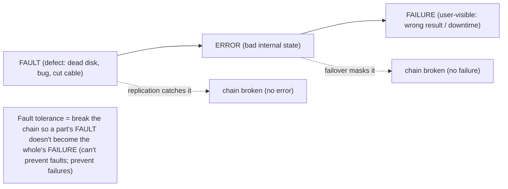
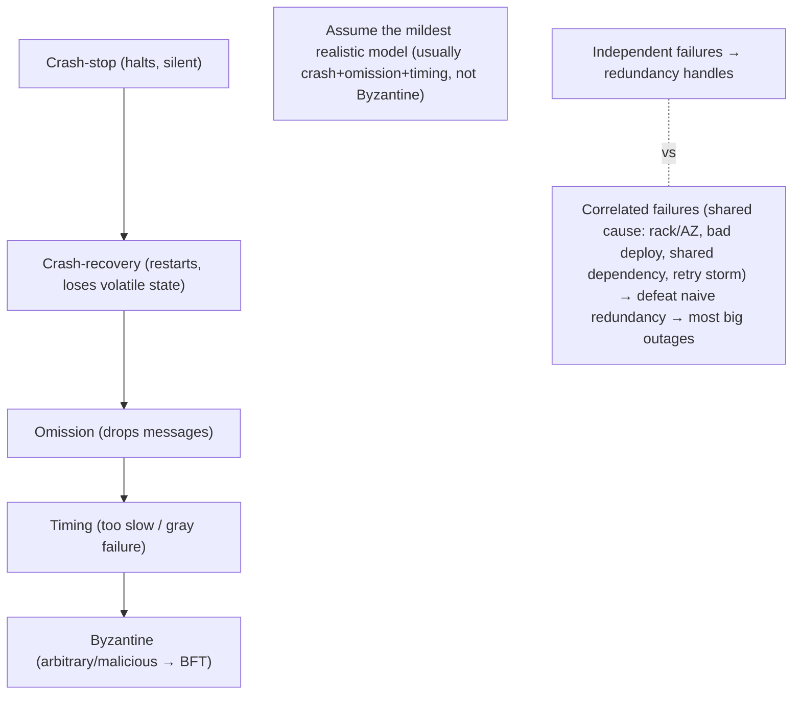

# Lesson 11.1 — Failure Models and the Fallacies of Distributed Computing

> Part 11: Fault Tolerance & Resilience · Difficulty: 🟡🔴
>
> **Prerequisites:** [8.1.1 Unreliable Networks/Partial Failure], [8.1.3 Failure Detection], [1.2.1 Reliability/Availability], [8.3.7 Byzantine].
> **Unlocks:** [11.2 Redundancy/Failover], [11.3 Resilience Patterns], [11.4 Graceful Degradation], [Part 14 SRE].

---

## 1. Learning Objectives

After this lesson you will be able to:

- Distinguish **fault → error → failure** precisely, and explain why the goal of fault *tolerance* is to stop faults from becoming user-visible failures.
- Enumerate the **failure models** (crash-stop, crash-recovery, omission, timing, Byzantine) and why the model you assume determines the mechanisms you need (8.3.7).
- Recall the **Fallacies of Distributed Computing** (8.1.1) as the false assumptions that cause failures, and use them as a **design-review checklist**.
- Frame the **resilience mindset** — assume everything fails, design for it, and measure via reliability/availability (1.2.1) — that grounds the rest of Part 11.

---

## 2. Motivation — Everything fails, all the time

The foundational premise of fault tolerance is a mindset shift: **in a distributed system, failure is not an exception — it's the steady state.** At scale, with thousands of machines, disks, network links, and dependencies, **something is always broken**: a disk dies, a node crashes, a link congests, a dependency slows, a deploy goes bad, a datacenter loses power. The question is never "will it fail?" but "**when a component fails, does the *system* keep working for users?**" That is **fault tolerance / resilience**: the ability to **keep providing service despite the failure of some of its parts** (1.2.1) — and it's the difference between a robust production system and one that falls over the first time reality intrudes.

This lesson sets the frame for all of Part 11 by establishing two things. First, the **vocabulary and models** of failure: the precise chain **fault → error → failure** (a fault is a defect, which may cause an error in state, which may cause a user-visible failure — and fault tolerance is about **breaking that chain**), and the **failure models** (how components fail — crash-stop, crash-recovery, omission, timing, Byzantine) that determine which resilience mechanisms you need (a system tolerating crashes needs different machinery than one tolerating lies — 8.3.7). Second, the **Fallacies of Distributed Computing** (introduced in 8.1.1) — the eight false assumptions ("the network is reliable," "latency is zero," etc.) that, when they leak into a design, *cause* the very failures we must tolerate. Together these give you the **resilience mindset**: assume every component and interaction can fail, know *how* things fail (the model), design so faults don't become failures, and measure the result (reliability/availability — 1.2.1). Everything else in Part 11 — redundancy/failover (11.2), timeouts/retries/circuit breakers (11.3), graceful degradation (11.4), idempotency (11.5), distributed transactions/sagas (11.6/11.7), disaster recovery (11.8) — is a technique for breaking the fault→failure chain under a specific failure model.

---

## 3. Theory — From first principles

### 3.1 Fault, error, failure — the chain

`[CS]` Precise vocabulary (from dependability engineering):
- **Fault:** a **defect** or flaw in a component — a bug, a dead disk, a cut cable, a misconfiguration. The **root cause**.
- **Error:** a fault **manifesting** as an incorrect internal state — the system is now in a bad state (a corrupted value, a wrong computation, a hung thread).
- **Failure:** the error becoming **externally observable** — the system **deviates from its specified/correct service** as seen by users (wrong result, no response, downtime).

**Fault tolerance = breaking this chain**: prevent faults from becoming errors, or errors from becoming failures — so that **a fault in a part does not become a failure of the whole** `[CS]`. E.g., a disk fault (fault) is caught by replication (no error propagates), or a node crash (fault → local error) is masked by failover (no user-visible failure). **The goal is not to prevent faults (impossible) but to prevent them from causing failures.** This reframing — tolerate faults, don't try to eliminate them — is the essence of resilience.

### 3.2 Reliability vs availability (recap — 1.2.1)

`[CS]` Fault tolerance serves two related quality attributes (1.2.1):
- **Reliability:** the system **performs correctly** (produces the right result) — freedom from failures over time (MTBF — mean time between failures).
- **Availability:** the system is **up and serving** — the fraction of time it's operational (the "nines" — 99.9%, 99.99%…), driven by MTBF and MTTR (mean time to recovery). **Availability ≈ MTBF / (MTBF + MTTR)** — so you improve it by **failing less often (MTBF)** *or* **recovering faster (MTTR)** — and **fast recovery (low MTTR) is often the higher-leverage lever** (you can't prevent all faults, but you can recover quickly).
Fault tolerance improves both: masking faults (fewer failures → reliability) and fast failover/recovery (lower MTTR → availability). Part 11's techniques target both — and often the biggest wins come from **reducing MTTR** (fast detection + failover + degradation) rather than chasing impossible fault-freedom.

### 3.3 Failure models — how components fail

`[CS]` The **failure model** specifies *how* a component can fail — and determines which mechanisms you need (from mildest to harshest — cf. 8.3.7):
- **Crash-stop (fail-stop):** a component works correctly, then **halts** and stays halted — silent, never wrong. The **mildest** model; handled by failover/redundancy. (Paxos/Raft's model — 8.3.)
- **Crash-recovery:** crashes and **restarts**, losing volatile state (but durable state — WAL — 5.3.1 — survives). Needs durable state + recovery logic so a restarted node rejoins correctly.
- **Omission:** drops some messages (send-omission / receive-omission) — the unreliable network (8.1.1). Handled by retries/acks/idempotency (11.3/11.5).
- **Timing (performance):** responds, but **too slowly** (misses deadlines) — the **slow node / gray failure** (8.1.3) — often worse than a crash (poisons latency while passing health checks). Handled by timeouts, hedging, load shedding, slow-vs-dead detection (11.3/11.4/8.1.3).
- **Byzantine (arbitrary/malicious):** does **anything** — lies, sends conflicting messages, corrupts data (8.3.7). The **harshest**; needs BFT (3f+1). Rare for internal trusted systems.
**Key point** `[BP]`: **assume the mildest model that's realistic** — most internal systems assume **crash + crash-recovery + omission + timing** (not Byzantine), which Part 11's standard techniques (redundancy, retries, timeouts, failover) handle. Knowing your model tells you which mechanisms you need and how many replicas (crash: 2f+1; Byzantine: 3f+1 — 8.3.4/8.3.7).

### 3.4 The Fallacies of Distributed Computing (the failure-causers)

`[CS]` The **eight fallacies** (Deutsch/Gosling — recap from 8.1.1) are the **false assumptions** that, when they leak into a design, **cause** failures — treat them as a **design-review checklist**:
1. **The network is reliable** → it loses/delays/partitions (8.1.1) → design for loss (retries/idempotency — 11.3/11.5) and partitions (10.7).
2. **Latency is zero** → remote calls are ms–seconds (1.1.3) → design timeouts/deadlines, avoid chatty calls (11.3, 8.4.1).
3. **Bandwidth is infinite** → it's finite/shared → bound payloads, backpressure (11.4, 3.3.4).
4. **The network is secure** → it's hostile → auth/encrypt (Part 15).
5. **Topology doesn't change** → nodes/links come and go → discovery, no hardcoded addresses (8.3.8).
6. **There is one administrator** → many parties/configs/versions → coordination, schema evolution (4.3.1).
7. **Transport cost is zero** → serialization/bandwidth cost → efficient encoding (3.2.6).
8. **The network is homogeneous** → mixed hardware/protocols/speeds → tolerate heterogeneity.

Each fallacy is a place systems break when single-machine intuition leaks in. **The resilience discipline is to check every remote interaction against all eight** — and Part 11's patterns are, largely, the *countermeasures* to these false assumptions.

### 3.5 The resilience mindset

`[BP]` The overarching posture that grounds Part 11:
- **Assume everything fails** — every component, every dependency, every network call. Design as if faults are constant (because they are).
- **Break the fault→failure chain** — use redundancy/failover (11.2), retries/timeouts/circuit-breakers (11.3), graceful degradation (11.4), idempotency (11.5) so a part's fault doesn't become the whole's failure.
- **Know your failure model** — design for crash/omission/timing (usually), Byzantine only if the threat is real (8.3.7).
- **Minimize blast radius** — contain a failure so it doesn't cascade (bulkheads, isolation — 11.3/11.4); a failure in one part shouldn't take down the rest.
- **Optimize MTTR, not just MTBF** — you can't prevent all faults; **recover fast** (fast detection, failover, degradation) — often the higher-leverage lever for availability (§3.2).
- **Expect the unexpected — test failure** — inject faults (chaos engineering — Part 14) because failures you don't test are failures you don't handle; failure paths that aren't exercised don't work.
- **Degrade, don't collapse** — under stress, provide reduced service (11.4) rather than total failure.
This mindset — *plan for failure, contain it, recover fast, and test it* — is what separates systems that survive production from those that don't.

### 3.6 Independent vs correlated failures

`[CS]` A subtle but critical point for redundancy (11.2): failures can be **independent** (one node dies for its own reasons) or **correlated** (many fail together for a common cause) `[CS]`:
- **Independent failures** are what redundancy handles well — N replicas fail independently, so the probability all fail at once is tiny (that's why redundancy works — 11.2).
- **Correlated failures** defeat naive redundancy — a **shared cause** takes out many "redundant" components at once: same power supply/rack/AZ (physical), same bad deploy/config (software), same dependency (a shared DB/DNS/auth service), a **thundering-herd/retry-storm** (6.7/8.1.3), or a **poison input** hitting all replicas. **Redundancy only helps against *independent* failures** — so you must **spread across failure domains** (racks/AZs/regions — Part 13), **stagger deploys** (canary — Part 13), and avoid **shared single points** (a common dependency is a common failure).
**Design lesson:** redundancy assumes independence; **correlated failures are the ones that cause big outages** — hunt for shared causes (the hidden SPOF) and eliminate/spread them (§11.2). Most large outages are **correlated** failures (a bad deploy, a shared-dependency outage, a cascading overload), not the independent single-node failures redundancy easily handles.

---

## 4. Visual Intuition

### The fault → error → failure chain

### Failure models (mild → harsh) and correlated failures

---

## 5. Real-World Analogy

Think of **keeping a hospital running** — where lives depend on service continuing despite constant problems.

- **Everything fails:** equipment breaks, staff call in sick, power flickers, supplies run out — **something is always going wrong.** A good hospital isn't one where nothing fails (impossible); it's one that **keeps treating patients anyway** (fault tolerance).
- **Fault → error → failure:** a **fault** is a generator breaking; the **error** is a ward losing power; the **failure** is a patient's monitor going dark. Hospitals **break this chain** with **backup generators** (redundancy) that kick in (failover) so the power blip **never reaches the patient** — the fault happened, but it caused **no failure**.
- **Failure models:** a nurse who **calls in sick** (crash-stop — cleanly absent, cover them) is easy to handle; a nurse who's **present but exhausted and slow** (timing/gray failure) is trickier and often worse (they take assignments but bottleneck everything); a nurse who's **actively negligent/malicious** (Byzantine) is the rare, hardest case needing oversight/checks (BFT). You staff and design differently depending on **how** people/equipment fail.
- **The fallacies:** the rookie assumptions that cause disasters — "the power will always be on," "the ambulance always arrives instantly," "everyone follows the same procedure." Experienced hospitals **assume the opposite** and prepare (backups, triage, checklists).
- **Correlated failures (the big ones):** a single dead nurse is easy to cover (independent); but a **food-poisoning outbreak that sicken half the staff at once** (correlated — shared cause) overwhelms all your redundancy. So you **don't feed all staff from the same source**, **don't put all backup generators on the same fuel line**, and **don't schedule all your experienced staff on the same shift** — you **spread across failure domains** so no single event takes out your redundancy. The catastrophic outages are almost always these **correlated** ones — a shared cause hitting everything — not the routine single failures.
- **MTTR over MTBF:** you can't stop equipment from ever breaking (MTBF), but you can make sure a **replacement is wheeled in within seconds** (low MTTR) — fast recovery keeps the hospital "available" far more than trying to make unbreakable equipment.

---

## 6. Industry Example

- **"Everything fails all the time"** `[OPINION]`/`[CONV]`: Amazon's Werner Vogels' maxim — the design premise of resilient systems (§3.5). *(Representative.)*
- **Crash-stop assumption in consensus** `[CS]`: Paxos/Raft (8.3) assume crash faults, not Byzantine — the standard for trusted internal systems (§3.3, 8.3.7). *(Representative.)*
- **Correlated-failure outages** `[CONV]`: many large, documented outages trace to a **shared cause** — a bad config/deploy pushed everywhere, a shared dependency (DNS/auth/DB) failing, or a retry storm — defeating redundancy (§3.6). *(Representative.)*
- **Failure domains (AZs/regions)** `[BP]`: cloud designs spread replicas across availability zones/regions so a single physical failure domain doesn't take out all redundancy (§3.6, Part 13). *(Representative.)*
- **Chaos engineering** `[BP]`: Netflix's Chaos Monkey lineage — deliberately injecting faults (kills, latency, partitions) to verify the fault→failure chain is broken and failure paths actually work (§3.5, Part 14). *(Representative.)*
- **The Fallacies as a checklist** `[CONV]`: teams review remote interactions against the eight fallacies to catch resilience gaps (§3.4, 8.1.1). *(Representative.)*

---

## 7. Implementation Details — establishing resilience

- **Adopt the resilience mindset** (§3.5): assume everything fails, design to break the fault→failure chain, minimize blast radius, optimize MTTR, and **test failure** (chaos — Part 14) `[BP]`.
- **Identify your failure model** (§3.3): design for crash/crash-recovery/omission/timing (usual); Byzantine only if the threat is real (untrusted participants — 8.3.7). This dictates mechanisms and replica counts (2f+1 vs 3f+1).
- **Break the chain with the right mechanism per fault:** replication/failover for crashes (11.2), retries/idempotency for omission (11.3/11.5), timeouts/hedging/shedding for timing/gray failures (11.3/11.4, 8.1.3), durable state (WAL) for crash-recovery (5.3.1).
- **Hunt correlated failures** (§3.6): find shared causes (same rack/AZ/region, shared dependency, single config/deploy, retry storm) and **spread across failure domains** (Part 13), **stagger deploys** (canary), and **decouple shared dependencies** — redundancy only helps against *independent* failures.
- **Optimize MTTR** (§3.2): fast detection (8.1.3), fast failover (11.2), graceful degradation (11.4) — recovering fast beats chasing fault-freedom.
- **Review against the fallacies** (§3.4): check every remote interaction (network reliability, latency, bandwidth, security, topology, etc.) for the false assumption that would cause a failure.
- **Measure reliability/availability** (1.2.1) — track failures, MTBF/MTTR, the nines — to know if your fault tolerance is working (Part 14/16).

---

## 8. Advantages (of a fault-tolerance mindset)

- **Survives production reality** — keeps serving despite the constant faults that *will* happen (§3.1/3.5).
- **Higher availability + reliability** — masking faults (fewer failures) + fast recovery (low MTTR) (§3.2).
- **Contained blast radius** — failures don't cascade; a part's fault stays a part's fault (§3.5/3.6).
- **Correct mechanism selection** — knowing the failure model picks the right (and cheapest sufficient) resilience machinery (§3.3).
- **Fewer surprises** — checking the fallacies + testing failure catches gaps before production (§3.4/3.5).

---

## 9. Disadvantages / hard realities

- **Faults are unavoidable** — you can only tolerate them, not eliminate them (§3.1).
- **Correlated failures defeat naive redundancy** — the big outages come from shared causes redundancy doesn't cover (§3.6).
- **Resilience has cost** — redundancy (extra machines), complexity (failover/retry/degradation logic), and coordination (§3.5, Part 11).
- **Failure paths must be tested** — untested failure handling usually doesn't work when needed (§3.5) — testing failure is itself effort.
- **Byzantine is expensive** — if the threat is real, BFT (3f+1) is costly (usually avoidable — §3.3, 8.3.7).
- **Over-engineering risk** — building for failure modes you don't have wastes effort (1.1.5).

---

## 10. When NOT to / limits

- **Don't design for Byzantine faults** unless the threat is real (untrusted participants) — assume the mildest realistic model (§3.3, 8.3.7).
- **Don't rely on redundancy alone** — it only handles *independent* failures; correlated failures need failure-domain spreading + shared-dependency elimination (§3.6).
- **Don't chase fault-freedom** — impossible; tolerate faults and optimize MTTR instead (§3.1/3.2).
- **Don't over-engineer resilience** for failure modes/scales you don't face (match effort to the SLO — 1.1.5, Part 14).
- **Don't skip testing failure paths** — untested resilience is a false sense of security (§3.5).
- **Don't ignore the fallacies** — the classic source of "it worked in dev" failures (§3.4).

---

## 11. Common Mistakes

1. **Assuming failures are rare exceptions** rather than the steady state → no fault handling → falls over in production (§3.1/3.5).
2. **Trying to prevent faults instead of tolerating them** → chasing the impossible instead of breaking the chain / optimizing MTTR (§3.1/3.2).
3. **Redundancy without failure-domain spreading** → correlated failure (same rack/AZ, shared dependency, bad deploy) takes out all replicas (§3.6).
4. **Ignoring the fallacies** → designs assuming a reliable, zero-latency, secure, static network → break in reality (§3.4).
5. **Designing for the wrong failure model** → e.g., assuming crash-only when slow/gray failures are the real problem (§3.3, 8.1.3).
6. **Optimizing MTBF only** → ignoring fast recovery (MTTR), the higher-leverage lever (§3.2).
7. **Not testing failure paths** → resilience logic that doesn't actually work when triggered (§3.5).
8. **Over-engineering for Byzantine/rare modes** you don't have → wasted cost (§3.3, 10).

---

## 12. Interview Questions

**🟢 Easy**
- Define fault, error, and failure. What does fault tolerance aim to do?
- What's the difference between reliability and availability, and how does MTTR relate?

**🟡 Medium**
- List the failure models (crash-stop → Byzantine). Why does the model you assume matter?
- What are the Fallacies of Distributed Computing, and how do they cause failures?

**🔴 Hard**
- Why does redundancy only help against independent failures? Give examples of correlated failures and how to mitigate them.
- Why is optimizing MTTR often higher-leverage than MTBF for availability? How do Part 11 techniques target each?

**⚫ Staff+**
- A system has N-way redundancy but suffered a total outage. Walk through the likely correlated-failure causes (shared AZ/dependency/deploy/retry storm) and design the fixes (failure-domain spreading, staggered deploys, dependency decoupling, backpressure) — and explain why redundancy alone was insufficient.
- Establish the resilience strategy for a new service: which failure model to assume, how to break the fault→failure chain for each fault type, how to minimize blast radius and MTTR, and how you'd test it (chaos) — grounding each choice in the fallacies and reliability/availability targets.

---

## 13. Production Pitfalls

- **Correlated-failure total outage:** "redundant" replicas all in one AZ / behind one dependency / hit by one bad deploy → all fail together despite redundancy (§3.6) — the classic big outage.
- **Retry-storm cascade:** a transient fault triggers synchronized retries (6.7/8.1.3) that overload and take down the whole system (a correlated, self-inflicted failure) (§3.6).
- **Gray-failure degradation:** a slow (not dead) node passes health checks while poisoning latency system-wide (timing failure) — worse than a clean crash (§3.3, 8.1.3).
- **"Worked in dev" fallacy failures:** designs assuming reliable/zero-latency network break under real loss/latency/partitions (§3.4).
- **Untested failover:** the standby/failover path was never exercised and fails when finally needed (§3.5) — resilience that doesn't work.
- **High MTTR outage:** a fault takes hours to detect/recover because recovery wasn't designed/automated (MTBF was fine, MTTR wasn't) (§3.2).

---

## 14. Optimization Techniques

- **Break the fault→failure chain per fault type** — redundancy/failover (crash), retries/idempotency (omission), timeouts/hedging/shedding (timing), durable state (crash-recovery) (§3.3, 11.2–11.5) `[BP]`.
- **Spread across failure domains** (racks/AZs/regions) + **stagger deploys** (canary) + **decouple shared dependencies** — defeat correlated failures (§3.6, Part 13).
- **Optimize MTTR** — fast detection, automated failover, graceful degradation (§3.2, 11.2/11.4, 8.1.3).
- **Minimize blast radius** — bulkheads/isolation so a failure is contained (§3.5, 11.3).
- **Assume the mildest realistic failure model** — don't over-pay for Byzantine (§3.3).
- **Test failure (chaos engineering)** — inject faults to verify the chain is broken and failure paths work (§3.5, Part 14).
- **Review against the fallacies** and **measure reliability/availability (MTBF/MTTR/nines)** (§3.4, 1.2.1, Part 16).

---

## 15. Summary

Fault tolerance begins with a mindset: **in a distributed system, failure is the steady state** — with enough components, **something is always broken** — so the goal is never to prevent faults (impossible) but to ensure that **a fault in a part does not become a failure of the whole**. The precise chain is **fault** (a defect — dead disk, bug, cut cable) → **error** (bad internal state) → **failure** (user-visible deviation from correct service); **fault tolerance = breaking this chain** (e.g., replication catches a disk fault before it errors; failover masks a crash before it fails). This serves **reliability** (correctness over time — MTBF) and **availability** (uptime — driven by MTBF and MTTR, where **`availability ≈ MTBF/(MTBF+MTTR)`** — so **fast recovery (low MTTR) is often the higher-leverage lever** since you can't prevent all faults). The **failure model** — *how* components fail — determines the mechanisms you need: **crash-stop** (halts silently — failover), **crash-recovery** (restarts, loses volatile state — durable WAL), **omission** (drops messages — retries/idempotency), **timing** (too slow / gray failure — often worse than a crash — timeouts/hedging/shedding), and **Byzantine** (arbitrary/malicious — needs BFT, 3f+1 — 8.3.7); **assume the mildest realistic model** (usually crash+omission+timing, not Byzantine). The **Fallacies of Distributed Computing** (network is reliable / latency zero / bandwidth infinite / network secure / topology static / one admin / zero transport cost / homogeneous) are the **false assumptions that cause failures** — use them as a **design-review checklist**, since Part 11's patterns are largely their countermeasures. Critically, **redundancy only helps against *independent* failures** — **correlated failures** (shared rack/AZ/region, a shared dependency, one bad config/deploy, a retry storm) defeat naive redundancy and cause **most big outages** — so you must **spread across failure domains, stagger deploys, and eliminate shared single points**. The resulting **resilience mindset**: *assume everything fails, break the fault→failure chain with the right mechanism per fault type, minimize blast radius, optimize MTTR over MTBF, hunt correlated failures, and test failure (chaos engineering)* — the frame for all of Part 11 (redundancy/failover 11.2, timeouts/retries/circuit breakers 11.3, graceful degradation 11.4, idempotency 11.5, distributed transactions/sagas 11.6/11.7, disaster recovery 11.8).

---

## 16. Revision Notes (flashcard-ready)

- **Q:** Fault vs error vs failure? **A:** Fault = defect; error = bad internal state; failure = user-visible deviation. Fault tolerance breaks the chain.
- **Q:** Goal of fault tolerance? **A:** Prevent a part's fault from becoming the whole's failure (can't prevent faults; prevent failures).
- **Q:** Reliability vs availability? **A:** Reliability = correctness over time (MTBF); availability = uptime ≈ MTBF/(MTBF+MTTR).
- **Q:** Higher-leverage availability lever? **A:** MTTR (recover fast) — you can't prevent all faults.
- **Q:** Failure models (mild→harsh)? **A:** Crash-stop, crash-recovery, omission, timing (gray failure), Byzantine.
- **Q:** Which model to assume? **A:** The mildest realistic — usually crash+recovery+omission+timing (not Byzantine).
- **Q:** Which failure is often worse than a crash? **A:** Timing/gray failure — slow node passes health checks while poisoning latency (8.1.3).
- **Q:** The fallacies (a few)? **A:** Network reliable, latency zero, bandwidth infinite, secure, static topology, one admin, zero transport cost, homogeneous — all false.
- **Q:** Independent vs correlated failures? **A:** Redundancy handles independent; correlated (shared cause: AZ/dependency/deploy/retry storm) defeat it → most big outages.
- **Q:** Mitigate correlated failures? **A:** Spread across failure domains, stagger deploys, decouple shared dependencies.
- **Q:** Resilience mindset? **A:** Assume everything fails, break the chain, minimize blast radius, optimize MTTR, hunt correlated failures, test failure.

---

## 17. Further Reading + Knowledge-Graph Links

**Within this platform**
- **Builds on:** [8.1.1 Unreliable Networks/Partial Failure/Fallacies], [8.1.3 Failure Detection] (timing/gray), [1.2.1 Reliability/Availability], [8.3.7 Byzantine].
- **Next:** [11.2 Redundancy, Replication, Failover] (break the chain for crashes). **Then:** [11.3 Resilience Patterns], [11.4 Graceful Degradation], [11.5 Idempotency].
- **Enables:** [Part 14 SRE] (MTTR, chaos, incident response), [Part 13 Multi-region] (failure domains).

**Foundational texts (synthesized)**
- Avizienis et al., "Basic Concepts and Taxonomy of Dependable and Secure Computing" (fault/error/failure) (concept, synthesized).
- Nygard, *Release It!* — failure modes, stability (synthesized).
- Deutsch & Gosling, Fallacies of Distributed Computing (concept, synthesized).
- *Site Reliability Engineering* (Beyer et al.) — MTBF/MTTR, chaos (synthesized, Part 14).

**Concept tags:** `[CS]` fault→error→failure, failure models (crash/omission/timing/Byzantine), reliability vs availability (MTBF/MTTR), independent vs correlated failures · `[CONV]` fallacies as checklist, crash-model assumption, failure domains · `[BP]` assume everything fails, break the chain per fault, spread across domains, optimize MTTR, test failure (chaos) · `[OPINION]` "everything fails all the time."
