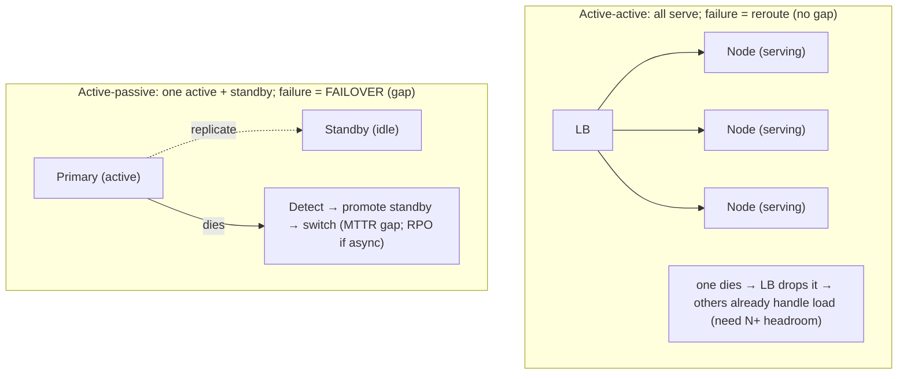
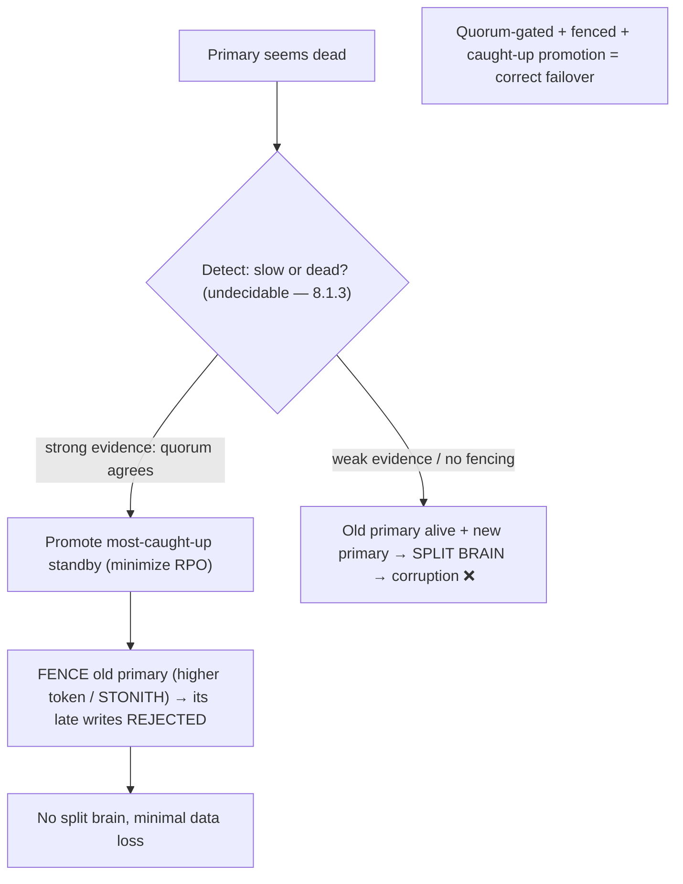

# Lesson 11.2 — Redundancy, Replication, and Failover

> Part 11: Fault Tolerance & Resilience · Difficulty: 🔴
>
> **Prerequisites:** [11.1 Failure Models], [10.1 Replication Topologies], [10.2 Sync/Async], [8.3.5 Leader Election], [8.3.6 Fencing].
> **Unlocks:** [11.3 Resilience Patterns], [11.8 Disaster Recovery], [Part 13 Multi-region], [Part 14 SRE].

---

## 1. Learning Objectives

After this lesson you will be able to:

- Explain **redundancy** as the foundation of fault tolerance (no single point of failure — SPOF) and the forms it takes (active-active vs active-passive; N+1/N+2).
- Describe **failover** — detecting a failure and switching to a redundant component — and its key metrics (**MTTR**, and the failover-induced **RPO/RTO**).
- Reason about **failover correctness**: avoiding **split brain** (fencing — 8.3.6, quorum — 8.3.5), the **slow-vs-dead** problem (8.1.3), and data loss on async failover (10.2).
- Identify and eliminate **single points of failure** (including hidden ones — the load balancer, the failover mechanism itself, shared dependencies) and spread redundancy across **failure domains** (correlated failures — 11.1).

---

## 2. Motivation — No single point of failure

The most fundamental fault-tolerance technique is **redundancy**: have **more than one** of everything critical, so that when one fails, another takes over and the system keeps serving. This is how you break the fault→failure chain for **crash faults** (11.1) — a component's fault doesn't become a system failure because a **redundant** component covers it. Redundancy is why every serious system runs **multiple** app servers (7.1), **replicated** databases (10.1), **redundant** load balancers, and spans **multiple** availability zones (Part 13). The guiding principle is **eliminate single points of failure (SPOFs)** — any component whose failure takes down the whole system.

But redundancy alone isn't enough; you also need **failover** — the mechanism that **detects** a failure and **switches** to the redundant component. And failover is where fault tolerance gets hard, because it collides with everything from Part 8/10: **detecting** the failure is undecidable (slow vs dead — 8.1.3), so failover can be triggered wrongly (a slow-but-alive primary) or too late; **switching** can create **split brain** (the old and new both active — 8.1.1) unless **fenced** (8.3.6) and **quorum-gated** (8.3.5); and **async replication** means failover can **lose data** (RPO>0 — 10.2). The failover mechanism itself can be a SPOF, and "redundant" components can share a hidden common cause (**correlated failures** — 11.1) that defeats the redundancy. This lesson develops redundancy (its forms and the N+ math), failover (detection + switching + its metrics), the correctness hazards (split brain, slow-vs-dead, data loss), and the discipline of hunting SPOFs and spreading across failure domains — the crash-fault half of resilience, building directly on Part 10's replication and Part 8's failover/fencing.

---

## 3. Theory — From first principles

### 3.1 Redundancy — the foundation

`[CS]` **Redundancy** = having **duplicate/spare components** so that the failure of one doesn't stop the system. It's the core technique for tolerating **crash faults** (11.1): with N redundant components failing **independently**, the probability that **all** fail simultaneously is tiny → the system survives (this is *why* redundancy works — and why **correlated** failures that violate independence defeat it — 11.1 §3.6). Redundancy applies at every level: **compute** (multiple app instances — 7.1), **data** (replication — 10.1), **network** (redundant LBs/links), **power/hardware** (dual PSUs, RAID), and **geography** (multiple AZs/regions — Part 13). **The guiding goal: no single point of failure (SPOF).**

### 3.2 Active-active vs active-passive

`[CS]` Two redundancy configurations:
- **Active-active (active-active):** **all** redundant components are **serving live traffic simultaneously** (e.g., N app servers behind a load balancer — 7.1; multi-leader — 10.1). If one fails, the others **already** handle the load (no "switch" needed — the LB just stops routing to the dead one). **Pros:** no failover delay (instant — traffic just reroutes), full utilization of all capacity, graceful capacity degradation. **Cons:** requires the components to be able to serve concurrently (stateless — 7.2 — or conflict-handling for writes — 10.1/10.4), and you need **N+ capacity headroom** to absorb a failed node's load (§3.3).
- **Active-passive (primary-standby / failover):** **one** component is **active** (serving); one or more **standbys** are **idle/replicating** but not serving. On failure, a standby is **promoted** to active (**failover**). **Pros:** simpler for stateful/single-writer systems (single-leader DB — 10.1); avoids conflicts (only one active). **Cons:** **failover delay** (detection + promotion — MTTR), standby capacity is **idle** (wasted), and failover has correctness hazards (§3.5–3.7). Used for single-leader databases, leader-based systems.
**Choose:** active-active for stateless/read-heavy/conflict-tolerant (best availability, no failover gap); active-passive for stateful single-writer systems where only one can be active (accept the failover gap, make it fast + correct).

### 3.3 N+1, N+2, and capacity headroom

`[CS]` Redundancy must be **sized** so the system survives failures **at load** (7.7):
- **N+1 redundancy:** provision **one more** than the N needed to handle peak load → survive **one** failure without losing capacity. **N+2** survives two (e.g., a failure *during* maintenance).
- **The capacity trap (recap 7.7 §3.8):** if N nodes each run at ~100% and one dies, the survivors can't absorb its load → **cascade**. So redundancy requires **headroom**: after losing a node, the survivors must stay **below the latency knee** (7.7). **N+1 at, say, 70% utilization** means one failure pushes the rest to ~80% (still OK); N+1 at 95% means one failure → overload → cascade. **Redundancy without headroom is not real redundancy** — it's a delayed cascade.
- This ties redundancy to **capacity planning** (7.7): provision for **peak-load-during-failure**, not just peak load.

### 3.4 Failover — detect and switch

`[CS]` **Failover** is the mechanism that, when a component fails, **detects** the failure and **switches** to a redundant one:
1. **Detect** the failure (health checks / heartbeats / failure detector — 8.1.3/8.3.5). This is the hard, undecidable part (slow vs dead — §3.5).
2. **Switch:** promote a standby (active-passive — 10.1 leader election — 8.3.5) or reroute traffic away from the dead node (active-active — the LB drops it — 3.3.1).
3. **Recover:** the system resumes on the redundant component; the failed one is repaired/replaced and rejoins.
- **Metrics:** failover time contributes directly to **MTTR** (11.1) → **availability** (fast failover = low MTTR = high availability). For data systems, failover has an **RTO** (time to recover service) and an **RPO** (data lost — >0 for async replication — 10.2/11.8).
- **Automatic vs manual:** automatic failover is fast (low MTTR) but risky (false triggers → §3.5); manual is safe but slow (high MTTR). Common practice: **automatic but well-guarded** (quorum + fencing + good detection) for fast, safe failover.

### 3.5 The slow-vs-dead problem (false failover)

`[CS]` Failover detection is **undecidable** (8.1.3): you **can't reliably tell a crashed component from a slow one**. This makes failover hazardous:
- **False positive (too eager):** a **slow-but-alive** primary (GC pause, overload — a **timing/gray failure** — 11.1) is declared dead → failover triggers → but the old primary is **still alive and processing** → now **two actives** (split brain — §3.6) → divergence/corruption. Also causes **needless failovers** (churn, brief unavailability).
- **False negative (too slow):** a genuinely dead primary isn't detected quickly → long user-facing outage (high MTTR).
- **Mitigations** `[BP]`: **good failure detection** (phi-accrual, indirect probing — 8.1.3), **require strong evidence** (a quorum agreeing the node is dead — 8.3.5) before the drastic step of failover, and — crucially — **fence** the old primary (§3.6) so even if it *was* alive, it **can't cause damage** after being deposed. **Never auto-failover on a single missed heartbeat / mere slowness.**

### 3.6 Split brain and fencing (recap 8.3.6/8.1.1)

`[CS]` The worst failover hazard is **split brain**: the failover promotes a new primary, but the **old primary is still alive** (it was slow, or a partition isolated it — 8.1.1) and **keeps accepting writes** → **two primaries** → **divergent, conflicting state** → corruption/data loss (10.1). Prevention:
- **Quorum-gated failover (8.3.5):** only elect a new primary with a **majority** → only one side of a partition can win (the majority side); the minority (isolated old primary) **can't** be re-elected and should stop (CAP CP — 10.7).
- **Fencing tokens (8.3.6):** the new primary gets a **higher fencing token** (monotonic epoch); downstream systems (storage) **reject** writes carrying the **old** token → the deposed-but-alive old primary's writes are **rejected**, even if it doesn't know it was deposed. **Fencing is the definitive split-brain prevention** — it doesn't rely on the old primary "knowing" to stop.
- **STONITH ("shoot the other node in the head"):** forcibly power off/isolate the old node before promoting (hardware fencing) — a blunt but effective guarantee.
**Election alone doesn't prevent split-brain damage — you need fencing** (8.3.6). This is the single most important failover-correctness rule.

### 3.7 Data loss on failover (recap 10.2)

`[CS]` With **async replication** (10.2), failover can **lose data**: the old primary acked writes → died before replicating them → a standby (missing those writes) is promoted → **those acked writes are permanently lost** (RPO>0). Mitigations (10.2): **semi-synchronous replication** (one standby always has every write → promote *it* → RPO≈0), **promote the most-caught-up standby** (minimize loss — track replication position), and understand the **RPO/RTO** tradeoff (11.8). Failover correctness thus combines **split-brain prevention** (fencing/quorum — §3.6) **and** **minimal-loss promotion** (semi-sync/caught-up standby — 10.2).

### 3.8 Hunting SPOFs and spreading across failure domains

`[BP]` The discipline: **find and eliminate single points of failure**, including **hidden** ones:
- **Obvious SPOFs:** a single database, a single app server, a single cache — replicate/redundify them.
- **Hidden SPOFs:** the **load balancer** itself (make it redundant — 3.3.1), the **failover mechanism** (a single failover coordinator), a **shared dependency** (one DNS/auth/config service everything needs — a shared SPOF), the **network** (single link/switch), **power** (single PSU/circuit). Hunt these — a "redundant" system with a hidden shared SPOF isn't redundant.
- **Correlated failures (11.1 §3.6):** redundancy only helps against **independent** failures — so **spread redundant components across failure domains**: different **racks** (power/switch), **availability zones** (isolated infrastructure — Part 13), **regions** (geographic — 11.8), and **stagger deploys** (a bad deploy is a correlated failure — canary — Part 13). Two "redundant" nodes in the same rack share the rack's failure; put them in different AZs.
- **The failover path is a SPOF too** — test it (chaos — Part 14); an untested failover mechanism that doesn't work is worse than none (false confidence).
**Rule:** redundancy is only as good as its **independence** — eliminate shared causes and spread across failure domains, or a correlated failure defeats it.

---

## 4. Visual Intuition

### Active-active vs active-passive

### Failover correctness

---

## 5. Real-World Analogy

Think of keeping a **critical service desk staffed** so it never goes unattended.

- **Redundancy:** you don't rely on **one** clerk — if they're out, the desk is unstaffed (SPOF). You have **several** clerks so one being out doesn't close the desk.
- **Active-active:** **multiple clerks work the desk simultaneously**; if one steps away, the others **just absorb the customers** — no gap, as long as you have **enough clerks that the rest can handle the load** (N+ headroom — if all clerks are already maxed, one leaving overwhelms the rest → the line collapses).
- **Active-passive:** **one clerk works** while a **backup sits ready** (idle). If the working clerk collapses, the backup **takes over** — but there's a **gap** while you notice and get the backup into the chair (failover time / MTTR). And any **half-finished paperwork** the collapsed clerk hadn't handed off is **lost** (RPO for async).
- **The slow-vs-dead trap:** the working clerk goes quiet — did they **collapse** (dead) or are they **on a slow phone call** (slow)? If you **wrongly assume dead** and put the backup in the chair, but the original clerk was just on the phone and **keeps working**, now **two clerks are both processing the same customers** → **conflicting, duplicated work** (split brain). So you **require strong evidence** (a supervisor confirms) before swapping — and, critically, when you do swap, you **physically lock the old clerk's terminal** (fencing) so even if they come back thinking they're still on duty, **their entries are rejected**.
- **Hunting hidden SPOFs:** you proudly have "redundant" clerks — but they all share **one login system**, sit at **one power circuit**, and were all **trained by the same manual (that had an error)**. A failure of the *shared* thing takes out all your "redundant" clerks at once (correlated failure). So you **spread them** across different systems/circuits/rooms (failure domains) and don't let a single shared thing be able to sink them all.

---

## 6. Industry Example

- **Active-active stateless tiers behind redundant LBs** `[CONV]`: N app servers serving live, LB reroutes around failures instantly (7.1/3.3.1); the LB itself made redundant (§3.2/3.8). *(Representative.)*
- **Active-passive DB failover** `[CONV]`: single-leader databases (Postgres/MySQL) with standby replicas promoted on primary failure — with quorum/fencing to avoid split brain (§3.4–3.6, 10.1/8.3.5). *(Representative.)*
- **Fencing tokens / STONITH** `[BP]`: HA clustering (Pacemaker/Corosync), ZooKeeper/etcd-based leader locks with fencing (8.3.6), storage fencing — definitive split-brain prevention (§3.6). *(Representative.)*
- **Semi-sync replication for low-RPO failover** `[CONV]`: promote a synchronously-replicated standby to avoid data loss (10.2, §3.7). *(Representative.)*
- **Multi-AZ/region redundancy** `[BP]`: spreading replicas across availability zones/regions so a single failure domain doesn't take out redundancy (§3.8, Part 13). *(Representative.)*
- **Split-brain outages** `[CONV]`: documented incidents where failover created two primaries (no fencing) → data divergence/corruption (§3.6). *(Representative.)*

---

## 7. Implementation Details — redundancy & failover done right

- **Eliminate SPOFs everywhere** (§3.1/3.8) — redundify app tier, database, cache, load balancer, and the failover mechanism itself; hunt **hidden** SPOFs (shared dependencies, single LB, network, power) `[BP]`.
- **Choose active-active for stateless/read-heavy** (no failover gap, full utilization — 7.2), **active-passive for stateful single-writer** systems (accept the gap, make it fast + correct) (§3.2).
- **Provision N+1/N+2 with headroom** — survivors must stay below the latency knee after a failure (peak-load-during-failure — 7.7); redundancy without headroom is a delayed cascade (§3.3).
- **Make failover fast (low MTTR) but well-guarded** — good detection (phi-accrual/indirect probing — 8.1.3), **quorum-gated** (strong evidence — 8.3.5), and **fenced** (§3.4–3.6).
- **Prevent split brain with fencing tokens (and/or STONITH)** — the definitive rule; don't rely on the old primary "knowing" to stop (§3.6, 8.3.6).
- **Minimize failover data loss** — semi-sync replication + promote the most-caught-up standby (RPO — 10.2); understand RPO/RTO (11.8) (§3.7).
- **Spread redundancy across failure domains** (racks/AZs/regions) + **stagger deploys** — defeat correlated failures (§3.8, 11.1, Part 13).
- **Test failover** (chaos — Part 14) — an untested failover path is a SPOF that fails when needed (§3.8).

---

## 8. Advantages

- **No single point of failure** — a component's fault doesn't fail the system (§3.1).
- **High availability** — fast failover (low MTTR) / instant reroute (active-active) keeps service up (§3.4, 11.1).
- **Graceful capacity handling** — active-active + N+ headroom degrades capacity, not availability, on failure (§3.2/3.3).
- **Combines with replication** — redundant data (10.1) + redundant compute + fenced failover = a resilient whole.
- **Correctness (with fencing/quorum)** — split-brain-proof, minimal-loss failover (§3.6/3.7).

---

## 9. Disadvantages / hard realities

- **Cost** — redundant components (idle standbys, N+ headroom) cost money (§3.2/3.3).
- **Failover is hard & hazardous** — undecidable detection (slow vs dead — §3.5), split-brain risk (§3.6), data loss on async (§3.7).
- **Correlated failures defeat naive redundancy** — shared causes/failure domains must be eliminated (§3.8, 11.1).
- **Hidden SPOFs** — the LB, failover mechanism, shared dependencies are easy to miss (§3.8).
- **Failover gap (active-passive)** — MTTR downtime + possible RPO loss during promotion (§3.4/3.7).
- **Untested failover** — often doesn't work when finally triggered (§3.8).

---

## 10. When NOT to / limits

- **Don't rely on redundancy without headroom** — N+1 at 100% utilization cascades on one failure (§3.3, 7.7).
- **Don't auto-failover on weak evidence** (single missed heartbeat / mere slowness) — false failover → split brain (§3.5).
- **Don't fail over without fencing** — split-brain corruption (§3.6, 8.3.6).
- **Don't put "redundant" components in the same failure domain** — correlated failure defeats redundancy (§3.8, 11.1).
- **Don't ignore hidden SPOFs** (LB, failover coordinator, shared dependency) — they're the real single points (§3.8).
- **Don't assume async failover is lossless** — RPO>0 (use semi-sync for low-RPO — §3.7, 10.2).

---

## 11. Common Mistakes

1. **Redundancy without headroom** → one failure overloads survivors → cascade (§3.3, 7.7).
2. **Failover without fencing** → old primary alive + new primary → split brain → corruption (§3.6) — the classic.
3. **Auto-failover on slow (not dead)** → false failover / dual primaries (§3.5, 8.1.3).
4. **Hidden SPOF** — single LB, single failover coordinator, shared dependency not made redundant (§3.8).
5. **Redundant nodes in the same rack/AZ** → correlated failure kills all (§3.8, 11.1).
6. **Async failover assumed lossless** → data loss (RPO>0) on promotion (§3.7, 10.2).
7. **Untested failover path** → doesn't work when triggered (§3.8) — false confidence.
8. **Promoting a lagging standby** → more data loss than necessary (§3.7).

---

## 12. Interview Questions

**🟢 Easy**
- What is redundancy, and what does it prevent (SPOF)?
- What's the difference between active-active and active-passive redundancy?

**🟡 Medium**
- What is failover, and how does it relate to MTTR and availability?
- Why is N+1 redundancy without capacity headroom dangerous?

**🔴 Hard**
- Walk through failover correctness: the slow-vs-dead problem, split brain, and how fencing + quorum + caught-up promotion solve it.
- Why does redundancy only help against independent failures? How do you defeat correlated failures?

**⚫ Staff+**
- Design a highly-available data tier: active-passive with fenced, quorum-gated, low-RPO failover across AZs. Address detection (slow vs dead), split-brain prevention (fencing/STONITH), data loss (semi-sync/caught-up promotion), capacity headroom, and how you'd test it (chaos).
- A failover event caused a 20-minute outage and data corruption: the slow (not dead) primary was declared dead, a lagging standby was promoted without fencing, and the old primary kept writing. Diagnose each failure and design the fixes (phi-accrual + quorum detection, fencing tokens, semi-sync + caught-up promotion, headroom).

---

## 13. Production Pitfalls

- **Split-brain corruption:** failover without fencing → old (slow/partitioned) primary + new primary both write → divergent/corrupt data (§3.6) — the signature failover incident.
- **Cascade from no headroom:** N+1 at ~100% utilization; one node dies, survivors overload past the knee → cascade → total outage (§3.3, 7.7).
- **False failover from gray failure:** a slow (GC/overloaded) primary declared dead → needless failover / dual primaries (§3.5, 8.1.3).
- **Hidden-SPOF outage:** the "redundant" system had a single LB / failover coordinator / shared dependency that failed (§3.8).
- **Correlated-failure outage:** "redundant" replicas in one AZ / behind one dependency / hit by one bad deploy → all fail together (§3.8, 11.1).
- **Failover data loss:** async replication + promoting a lagging standby → acked writes lost (RPO>0) (§3.7, 10.2).
- **Untested failover fails:** the standby/failover path was never exercised and doesn't work when finally needed (§3.8).

---

## 14. Optimization Techniques

- **Active-active + N+ headroom** for stateless tiers — instant reroute, no failover gap, graceful capacity degradation (§3.2/3.3, 7.1/7.7) `[BP]`.
- **Fenced, quorum-gated, caught-up failover** for stateful systems — split-brain-proof, minimal-RPO (§3.4–3.7, 8.3.5/8.3.6, 10.2).
- **Semi-sync replication** for low-RPO failover (§3.7, 10.2).
- **Good failure detection** (phi-accrual/indirect probing) + strong evidence before failover (§3.5, 8.1.3).
- **Spread across failure domains** (racks/AZs/regions) + **stagger deploys** — defeat correlated failures (§3.8, Part 13).
- **Hunt & eliminate hidden SPOFs** (LB, failover coordinator, shared dependencies, network, power) (§3.8).
- **Test failover / chaos-engineer it** — prove the failover path works before you need it (§3.8, Part 14).
- **Provision for peak-load-during-failure** (capacity planning — 7.7).

---

## 15. Summary

**Redundancy** — duplicate/spare components so the failure of one doesn't stop the system — is the **foundation of fault tolerance** for **crash faults** (11.1): N components failing **independently** rarely all fail at once, so the system survives (which is *why* redundancy works — and why **correlated** failures that violate independence defeat it). The guiding goal is **no single point of failure (SPOF)**, applied at every level (compute/data/network/power/geography). Two configurations: **active-active** (all serve live; a failure just **reroutes** — no failover gap, full utilization, but needs **N+ capacity headroom** to absorb a failed node's load) and **active-passive** (one active + idle standby; a failure triggers **failover** — promote the standby — simpler for stateful single-writer systems but with a failover gap and idle standby). Redundancy must be **sized with headroom** (**N+1/N+2**) so survivors stay **below the latency knee** after a failure (peak-load-during-failure — 7.7); **redundancy without headroom is a delayed cascade**. **Failover** — **detect** the failure (health checks/heartbeats — the undecidable slow-vs-dead problem — 8.1.3) and **switch** to a redundant component — contributes to **MTTR** (fast failover = high availability) and, for data, an **RPO/RTO** (11.8). Failover is **hazardous** and must be **correct**: the **slow-vs-dead** problem means a slow-but-alive primary can be wrongly declared dead → failover → **two actives → split brain → corruption** (10.1/8.1.1); prevent this with **quorum-gated failover** (only the majority side elects — 8.3.5), **strong-evidence detection** (phi-accrual — 8.1.3), and — definitively — **fencing tokens** (the new primary gets a higher monotonic token; downstream **rejects** the old primary's writes even if it doesn't know it was deposed — 8.3.6) and/or **STONITH**. **Async replication** also means failover can **lose data** (RPO>0 — 10.2) → mitigate with **semi-sync replication** and **promoting the most-caught-up standby**. Finally, redundancy is only as good as its **independence**: **hunt hidden SPOFs** (the load balancer, the failover mechanism, shared dependencies, network, power) and **spread redundant components across failure domains** (racks/AZs/regions — Part 13) + **stagger deploys** to defeat **correlated failures** (11.1) — and **test the failover path** (chaos — Part 14), because an untested failover is a SPOF that fails when needed. Correct failover = **fenced + quorum-gated + caught-up + spread across domains + tested**.

---

## 16. Revision Notes (flashcard-ready)

- **Q:** Redundancy? **A:** Duplicate/spare components so one failure doesn't stop the system; goal = no SPOF; works because independent failures rarely coincide.
- **Q:** Active-active vs active-passive? **A:** Active-active = all serve, failure reroutes (no gap, needs N+ headroom); active-passive = one active + standby, failure triggers failover (gap).
- **Q:** N+1 with headroom? **A:** One more than needed for peak, AND survivors stay below the knee after a failure (else cascade — 7.7).
- **Q:** Failover? **A:** Detect a failure + switch to a redundant component; contributes to MTTR (fast = high availability) + RPO/RTO for data.
- **Q:** Slow-vs-dead problem? **A:** Can't tell crashed from slow (8.1.3) → false failover of a slow-but-alive primary → split brain.
- **Q:** Split brain? **A:** Old primary alive + new primary both active → divergence/corruption.
- **Q:** Prevent split brain? **A:** Quorum-gated failover (majority) + fencing tokens (reject old primary's writes) + STONITH.
- **Q:** Failover data loss? **A:** Async replication → promoting a standby missing acked writes loses them (RPO>0); mitigate with semi-sync + caught-up promotion (10.2).
- **Q:** Hidden SPOFs? **A:** The LB, the failover mechanism, shared dependencies, network, power — hunt and redundify.
- **Q:** Redundancy defeated by? **A:** Correlated failures (shared rack/AZ/dependency/deploy) — spread across failure domains + stagger deploys.
- **Q:** Correct failover = ? **A:** Fenced + quorum-gated + caught-up promotion + spread across domains + tested (chaos).

---

## 17. Further Reading + Knowledge-Graph Links

**Within this platform**
- **Previous:** [11.1 Failure Models] (redundancy tolerates crashes; correlated failures defeat it). **Builds on:** [10.1 Replication Topologies], [10.2 Sync/Async/Failover Loss], [8.3.5 Leader Election/Quorum], [8.3.6 Fencing], [8.1.3 Slow-vs-Dead], [7.7 Capacity Headroom].
- **Next:** [11.3 Resilience Patterns] (timeout/retry/circuit breaker/bulkhead). **Then:** [11.8 Disaster Recovery] (RPO/RTO/multi-region).
- **Enables:** [Part 13 Multi-region/AZ] (failure domains), [Part 14 SRE] (MTTR, chaos).

**Foundational texts (synthesized)**
- Kleppmann, *Designing Data-Intensive Applications* — replication, failover, split brain, fencing (synthesized).
- Nygard, *Release It!* — redundancy, failover, stability (synthesized).
- HA clustering documentation (Pacemaker/fencing/STONITH) — representative.

**Concept tags:** `[CS]` redundancy (no SPOF), active-active vs active-passive, failover (detect+switch), split brain, slow-vs-dead, independent vs correlated · `[CONV]` DB failover, fencing/STONITH, multi-AZ, redundant LBs · `[BP]` N+ headroom, quorum+fenced+caught-up failover, semi-sync for RPO, spread across failure domains, hunt hidden SPOFs, test failover.
