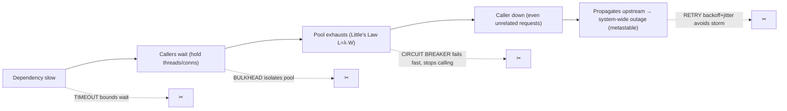
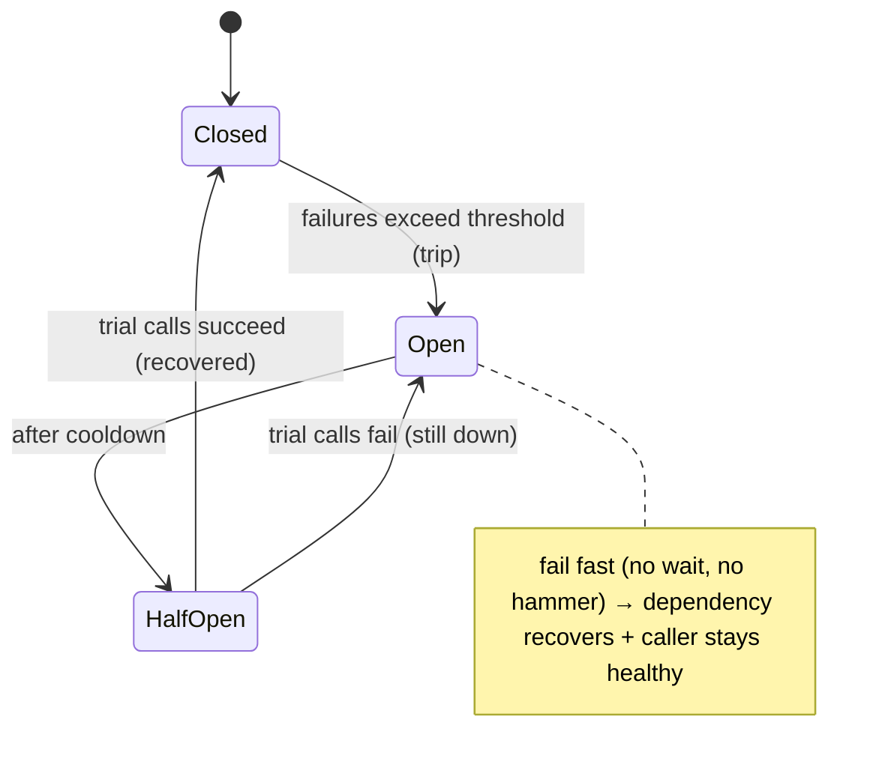

# Lesson 11.3 — Resilience Patterns: Timeout, Retry (with Jitter/Backoff), Circuit Breaker, Bulkhead

> Part 11: Fault Tolerance & Resilience · Difficulty: 🔴
>
> **Prerequisites:** [8.1.3 Timeouts/Retries/Failure Detection], [6.7 Stampede/Backoff], [3.3.4 Backpressure], [8.4.1 Idempotency], [11.1 Failure Models].
> **Unlocks:** [11.4 Graceful Degradation], [11.5 Idempotency], [Part 12 Service Mesh], [Part 14 SRE].

---

## 1. Learning Objectives

After this lesson you will be able to:

- Apply the four core **stability patterns** — **timeout**, **retry (with backoff + jitter)**, **circuit breaker**, and **bulkhead** — and explain the failure each prevents.
- Explain how they **compose** to stop a single slow/failing dependency from **cascading** into a system-wide outage (the **metastable failure** — 8.1.3/6.7).
- Reason about the **circuit breaker state machine** (closed → open → half-open) and why "stop calling a failing dependency" is essential for recovery.
- Design a resilient remote-call stack combining all four (+ idempotency — 11.5) — the practical resilience toolkit, as implemented by service meshes (Part 12) and libraries.

---

## 2. Motivation — Stopping a small failure from taking down everything

The most common way distributed systems suffer **large** outages isn't a single component dying — it's a **small, local failure cascading** into a system-wide collapse. A downstream dependency gets slow; callers wait (holding threads/connections); their pools exhaust; the callers become slow/unavailable; *their* callers back up; and soon the **whole system is down because of one slow service** — often staying down even after the original trigger clears (a **metastable failure** — 8.1.3/6.7). The **resilience patterns** in this lesson — **timeout, retry, circuit breaker, bulkhead** — are the battle-tested countermeasures (popularized by Nygard's *Release It!* and Hystrix) that **contain** such failures so a fault in one part stays a fault in one part (breaking the fault→failure chain — 11.1).

We've met the pieces already — timeouts and safe retries in 8.1.3, backoff/jitter in 6.7, backpressure in 3.3.4 — and this lesson **assembles them into the standard resilience toolkit** and adds the two that specifically prevent cascades: the **circuit breaker** (stop hammering a failing dependency, so it can recover and you fail fast) and the **bulkhead** (isolate resources so one failing dependency can't exhaust the pool the whole system shares). Each pattern targets a specific failure: **timeout** bounds how long you wait (no unbounded resource-holding — 8.1.3); **retry with backoff+jitter** recovers from transient faults without causing retry storms (6.7); **circuit breaker** prevents relentless retrying of a down dependency and gives it room to recover; **bulkhead** confines the blast radius so one dependency's failure doesn't sink the ship. Composed together (+ **idempotency** — 11.5 — to make retries safe), they turn "one slow dependency = total outage" into "one slow dependency = a degraded feature, contained." This is the everyday resilience toolkit every production service needs.

---

## 3. Theory — From first principles

### 3.1 The cascade problem these patterns solve

`[CS]` The failure mode all four patterns target: **a single slow/failing dependency cascading into a system-wide outage** `[CS]`:
1. A downstream dependency gets **slow** (a timing failure — 11.1 — or overloaded).
2. Callers **wait** on it (blocking calls), **holding threads/connections** for the whole wait.
3. By **Little's Law** (7.7), held requests (`L = λ·W`) balloon as `W` (wait time) grows → the caller's **thread/connection pool exhausts**.
4. The caller can no longer serve **any** request (even those not needing the slow dependency) → the caller is now **down**.
5. *Its* callers back up the same way → the failure **propagates upstream** → **system-wide outage** — often **self-sustaining** (retries pile on) even after the trigger clears (**metastable failure** — 8.1.3/6.7).
The patterns break this at each step: **timeout** (bound `W` — step 2/3), **bulkhead** (isolate the pool — step 3/4), **circuit breaker** (stop calling the failing dep — step 4/5, and break the metastable loop), **retry+backoff/jitter** (recover from transient faults without amplifying — avoid step 5's retry storm).

### 3.2 Pattern 1 — Timeout

`[CS]` **Timeout:** bound how long you wait for a response; if it doesn't arrive, **give up** and handle the failure (8.1.3). Without timeouts, a hung dependency causes **unbounded resource-holding** → pool exhaustion → cascade (§3.1). Key points (recap 8.1.3):
- **Always set timeouts on every remote call** — never wait indefinitely. Use **monotonic clocks** (8.1.2), ideally **adaptive** (a multiple of observed p99) and **deadline-propagated** through call chains (do no work that's already too late — 8.1.3).
- **The tradeoff:** too long → resource exhaustion (slow to give up); too short → false failures (give up on healthy-but-slow) — no perfect value (undecidable — 8.1.3). Adaptive/deadline-based timeouts help.
- **Timeout is the foundation** — the other patterns build on it (a circuit breaker counts timeouts as failures; a bulkhead bounds concurrent waits).

### 3.3 Pattern 2 — Retry (with backoff + jitter)

`[CS]` **Retry:** on a **transient** failure (timeout, 503, connection error), **try again** — because many failures are momentary (a brief blip, a lost message — omission — 11.1). But retries are **dangerous** and must be engineered (8.1.3/6.7):
- **Exponential backoff:** wait increasingly longer between retries (100ms, 200ms, 400ms…) so you don't hammer a struggling dependency (6.7).
- **Jitter:** **randomize** the backoff so clients **don't synchronize** their retries → prevents **retry storms / thundering herds** (6.7) — the key to not amplifying an outage.
- **Retry caps + budgets:** cap attempts (e.g., 3), and cap the **fraction of traffic that is retries** (a "retry budget," e.g., ≤10%) so retries can't dominate load (8.1.3).
- **Retry only retriable errors** (timeouts/5xx/connection) — **not** 4xx/validation (they'll fail again).
- **Retries require idempotency** (11.5/8.4.1) — a retried write must not double-execute (a lost *response* means the original may have succeeded). **Never retry a non-idempotent operation without idempotency.**
- **The danger:** naive retries (immediate, unbounded, synchronized) **amplify** an outage into a **retry storm → metastable failure** (6.7) — retries turn a blip into a prolonged outage. Backoff+jitter+caps+budgets tame this.

### 3.4 Pattern 3 — Circuit breaker

`[CS]` **Circuit breaker:** when a dependency is failing, **stop calling it** for a while — **fail fast** instead of waiting/retrying — giving the dependency room to recover and freeing your resources. Modeled on an electrical breaker (trips to prevent damage). A **state machine** `[CS]`:
- **Closed (normal):** calls pass through; the breaker **counts failures** (timeouts/errors). If failures exceed a threshold (e.g., 50% error rate over a window), it **trips → Open**.
- **Open (tripped):** calls **fail immediately** (fail fast — return an error/fallback **without** calling the dependency) → **no waiting, no resource-holding, no hammering** the down dependency → the caller stays healthy and the dependency gets breathing room to recover. After a **cooldown**, → Half-Open.
- **Half-Open (testing):** allow a **few trial calls** through. If they **succeed**, the dependency recovered → **Closed** (resume normal). If they **fail**, back to **Open** (keep waiting).
- **Why it's essential:** without a breaker, callers **relentlessly wait/retry** a down dependency → resource exhaustion + retry storm → cascade + **metastable failure** (the dependency can't recover because it's being hammered — 6.7/8.1.3). The breaker **breaks the loop**: stop calling → resources freed, dependency recovers → self-heals. **Fail fast + stop hammering = recovery.**
- Usually paired with a **fallback** (§11.4 graceful degradation) — when open, return a default/cached/degraded response instead of an error.

### 3.5 Pattern 4 — Bulkhead

`[CS]` **Bulkhead:** **isolate resources** so a failure in one part can't exhaust resources shared by the whole system — named after a ship's watertight compartments (a breach floods one compartment, not the whole ship) `[CS]`:
- **The problem it solves:** if **all** calls share **one** thread/connection pool, a **single slow dependency** can consume the **entire** pool (§3.1 step 3) → **every** feature fails, even those not using the slow dependency. One dependency sinks the ship.
- **The fix:** give each dependency (or each class of work) its **own bounded pool** (threads/connections/concurrency limit). If dependency X gets slow, it exhausts **only X's pool** → calls to X fail/degrade, but calls to Y, Z (separate pools) **keep working**. The failure is **contained** to one compartment.
- **Forms:** separate thread pools per dependency, per-dependency **concurrency limits** (semaphores — cap in-flight calls), separate connection pools, even separate service instances for critical vs non-critical work.
- **Why essential:** bulkheads **contain the blast radius** (11.1) — one dependency's failure degrades one feature, not the whole system. Combined with timeouts (bound each wait) and circuit breakers (stop calling the failing one), a slow dependency becomes a **contained, degraded feature** rather than a total outage.

### 3.6 How they compose (the resilient call stack)

`[BP]` The patterns **compose** into a resilient remote call — each addressing a step of the cascade (§3.1):
1. **Bulkhead:** the call runs in a **bounded, isolated pool** (concurrency limit) → a slow dependency can't exhaust shared resources.
2. **Timeout:** bound the wait → no unbounded resource-holding; a slow call fails quickly (with a deadline propagated — 8.1.3).
3. **Circuit breaker:** if the dependency is failing, **fail fast** (open) → don't wait/retry a down dependency; let it recover.
4. **Retry (backoff+jitter+caps+budget):** for **transient** failures, retry safely → recover without storms (6.7); **only if idempotent** (11.5).
5. **Fallback (11.4):** when the call fails/breaker is open, return a **degraded** response (cached/default/partial) instead of an error → graceful degradation.
6. **Idempotency (11.5):** makes the retries in step 4 safe.
Together: a slow/failing dependency → **contained** (bulkhead), **fails fast** (timeout + open breaker), **recovers safely** (backoff retries), and **degrades gracefully** (fallback) — **one dependency's failure = a degraded feature, not a system outage.** This is the standard resilience toolkit, and modern **service meshes** (Envoy/Istio — Part 12) provide timeouts/retries/circuit-breaking **transparently** (sidecar) so services get resilience without coding it each time.

### 3.7 The metastable-failure connection

`[CS]` These patterns specifically prevent **metastable failures** (8.1.3/6.7) — self-sustaining overload that persists **after** the trigger clears `[CS]`:
- A trigger (a blip) causes retries/waiting → **load amplifies** → the system stays overloaded because the amplified load (retries, held resources) **feeds itself** → it won't recover even when the trigger is gone.
- **Circuit breaker** breaks this by **stopping the amplifying calls** (fail fast, don't hammer) → load drops → the system recovers. **Backoff+jitter** prevent the synchronized-retry amplification. **Bulkheads** contain the amplification to one pool. **Load shedding** (11.4) rejects excess load to break the loop.
- **Without these patterns, a transient blip becomes a prolonged outage** (the retry-storm metastable collapse — 6.7); **with them, a blip stays a blip.** This is *why* these patterns are non-negotiable in production distributed systems.

---

## 4. Visual Intuition

### The cascade the patterns prevent

### Circuit breaker state machine

---

## 5. Real-World Analogy

Think of a **restaurant kitchen** that depends on several **suppliers** (downstream dependencies).

- **The cascade:** one supplier (the fish delivery) is **running very late**. If the kitchen just **keeps waiting** for the fish, cooks stand idle holding orders, the ticket rail backs up, and soon **no dish** gets out — even the pasta that doesn't need fish — because all the cooks are **stuck waiting** (pool exhausted). One late supplier shuts the whole kitchen.
- **Timeout:** the head chef sets a rule — "**if the fish isn't here in 10 minutes, stop waiting** and tell the table it's unavailable." No cook stands idle indefinitely (bounded wait → no resource-holding).
- **Retry (backoff + jitter):** the kitchen **re-calls the supplier**, but **not frantically** — it waits a bit longer between calls (backoff) and staggers calls (jitter) so it doesn't **flood** the already-overwhelmed supplier (which would make them *later*). And it caps how many times it re-calls.
- **Circuit breaker:** after several failed deliveries, the chef declares "**the fish supplier is down — stop calling them entirely for the next hour**" and **immediately** tells customers "no fish today" (fail fast) instead of trying and waiting each time. This **frees the kitchen** to keep cooking everything else, and gives the supplier **breathing room** to recover. After an hour, the chef **tries one test order** (half-open); if it arrives, they **resume** ordering fish (closed); if not, they **keep the supplier off** (open).
- **Bulkhead:** the kitchen **dedicates separate cooks/stations** to fish, pasta, and grill (separate pools). So even when the fish station is jammed waiting, the **pasta and grill cooks keep working** — the fish problem is **contained to the fish station**, not the whole kitchen. One flooded compartment doesn't sink the ship.
- **Together:** a late fish supplier becomes "**no fish today, everything else is fine**" (a degraded menu — graceful degradation) instead of "**the restaurant is closed**" (total outage). And critically, the kitchen **doesn't stay closed** after the supplier recovers — the breaker lets it come back (no metastable collapse).

---

## 6. Industry Example

- **Hystrix / resilience4j / Polly** `[CONV]`: libraries providing circuit breakers, bulkheads (thread pools / semaphores), timeouts, and retries — Netflix's Hystrix popularized the pattern (§3.4/3.5). *(Representative.)*
- **Service mesh (Envoy/Istio/Linkerd)** `[EMERGING]`: provide timeouts, retries (with budgets), circuit breaking, and outlier detection **transparently** via sidecars — resilience without coding it per service (§3.6, Part 12). *(Representative.)*
- **Exponential backoff + jitter** `[BP]`: AWS's "full jitter" guidance, SDK retry policies — the standard retry-storm defense (§3.3, 6.7, 8.1.3). *(Representative.)*
- **Bulkhead isolation** `[BP]`: separate thread/connection pools or concurrency limits per dependency so one slow backend doesn't exhaust the shared pool (§3.5). *(Representative.)*
- **Circuit breakers preventing metastable failures** `[CONV]`: breakers that stop hammering a struggling dependency, allowing recovery — documented as key to avoiding self-sustaining overload (§3.7, 6.7). *(Representative.)*

---

## 7. Implementation Details — building the resilient call stack

- **Set timeouts on every remote call** (monotonic, ideally adaptive + deadline-propagated — 8.1.2/8.1.3) — the foundation; never wait indefinitely (§3.2) `[BP]`.
- **Retry only transient/retriable errors** with **exponential backoff + jitter + caps + retry budgets** (6.7/8.1.3); **only if the operation is idempotent** (11.5) — never retry non-idempotent writes unsafely (§3.3).
- **Add circuit breakers** around failure-prone dependencies (closed→open→half-open) — fail fast when open, with a **fallback** (11.4); tune thresholds/cooldowns (§3.4).
- **Bulkhead resources** — per-dependency bounded pools / concurrency limits (semaphores) so one slow dependency can't exhaust shared resources; isolate critical from non-critical work (§3.5).
- **Compose all four + idempotency + fallback** into the standard resilient call (§3.6) — or get them **from a service mesh** (Envoy/Istio — Part 12) transparently.
- **Tune to prevent metastable failures** — breakers + jittered backoff + bulkheads + shedding (11.4) so a blip stays a blip (§3.7, 6.7).
- **Test under failure/load** (chaos + load tests — Part 14/7.7) — verify the patterns actually prevent cascades (untested resilience doesn't work — 11.1).
- **Set sensible defaults** — no unbounded timeouts, no unbounded retries, bounded pools — as platform defaults so every call is resilient by default.

---

## 8. Advantages

- **Prevents cascades** — a slow/failing dependency stays contained, doesn't take down the system (§3.1/3.6).
- **Prevents metastable failures** — breakers + jitter + bulkheads + shedding stop self-sustaining overload → a blip stays a blip (§3.7).
- **Fast failure + recovery** — fail fast (timeout/open breaker) frees resources; breakers let dependencies recover; low MTTR (11.1).
- **Contained blast radius** — bulkheads isolate one dependency's failure to one feature (§3.5).
- **Transient-fault recovery** — safe retries handle blips automatically (§3.3).
- **Available transparently** — service meshes provide these without per-service code (§3.6, Part 12).

---

## 9. Disadvantages / costs

- **Complexity & tuning** — timeouts, backoff, budgets, breaker thresholds/cooldowns, pool sizes all need tuning per dependency/workload (§3.2–3.5).
- **Retries need idempotency** — otherwise double-execution (§3.3, 11.5); a correctness prerequisite.
- **Wrong thresholds hurt** — too-aggressive breaker/timeout → false trips (unavailability); too-lax → doesn't protect (§3.4).
- **Bulkhead sizing tradeoff** — pools too small → underutilization/queuing; too big → don't isolate (§3.5).
- **Fallbacks add complexity** — degraded responses/logic to design (§3.6, 11.4).
- **False confidence if untested** — patterns that aren't load/chaos-tested may not work when needed (§7, 11.1).

---

## 10. When NOT to / limits

- **Don't retry non-idempotent operations** without idempotency → double effects (§3.3, 11.5/8.4.1).
- **Don't retry without backoff+jitter+caps** → retry storm / metastable collapse (§3.3, 6.7).
- **Don't use unbounded timeouts / no timeout** → resource exhaustion (§3.2).
- **Don't share one pool across all dependencies** → one slow dep exhausts it (no bulkhead) (§3.5).
- **Don't set breaker thresholds too aggressively** (false trips → unnecessary unavailability) or too laxly (no protection) (§3.4).
- **Don't skip fallbacks** where a degraded response beats an error (11.4) — but don't fabricate incorrect data as a "fallback" for correctness-critical operations.

---

## 11. Common Mistakes

1. **No timeout / unbounded wait** → hung dependency exhausts pools → cascade (§3.2, 8.1.3).
2. **Retry without backoff/jitter/caps** → retry storm → metastable outage (§3.3, 6.7).
3. **Retry without idempotency** → double charges/orders on lost-response retries (§3.3, 11.5).
4. **One shared pool (no bulkhead)** → one slow dependency exhausts it → whole system down (§3.5).
5. **No circuit breaker** → relentless waiting/retrying a down dependency → resource exhaustion + prevents its recovery (§3.4/3.7).
6. **Breaker thresholds mis-tuned** → false trips (too aggressive) or no protection (too lax) (§3.4).
7. **Retrying non-retriable errors** (4xx) → wasted load, same failure (§3.3).
8. **Untested resilience** → patterns don't actually work when triggered (§7, 11.1).

---

## 12. Interview Questions

**🟢 Easy**
- What does a timeout prevent, and why is it foundational?
- What is a circuit breaker, and what are its three states?

**🟡 Medium**
- Why must retries use backoff + jitter + caps? What happens without them?
- What is a bulkhead, and what failure does it contain?

**🔴 Hard**
- Walk through how a single slow dependency cascades into a system-wide outage, and how each of the four patterns breaks the cascade.
- Explain the circuit breaker state machine and why "stop calling a failing dependency" is essential for its recovery (metastable failures).

**⚫ Staff+**
- Design the resilient remote-call stack for a service calling several dependencies of varying criticality: timeouts (adaptive/deadline-propagated), retries (backoff/jitter/budgets/idempotency), circuit breakers (thresholds/fallbacks), bulkheads (per-dependency pools), and fallbacks. Explain how it prevents both cascades and metastable failures, and how you'd tune and test it.
- A transient 3-second dependency blip caused a 40-minute total outage. Diagnose the cascade + metastable failure (no timeouts/breakers, shared pool, synchronized retries), and design the fixes (timeouts, bulkheads, circuit breakers, jittered backoff, load shedding) so a blip stays a blip.

---

## 13. Production Pitfalls

- **Cascade from a shared pool:** all calls share one thread/connection pool; one slow dependency exhausts it → every feature fails (no bulkhead) (§3.5) — the classic.
- **Metastable retry-storm outage:** a blip triggers synchronized, uncapped retries → amplified load keeps the system down after the trigger clears (§3.3/3.7, 6.7).
- **Resource exhaustion from no timeout:** a hung dependency holds threads/connections indefinitely → caller falls over (§3.2, 8.1.3).
- **Double execution:** retries without idempotency → double charges/orders (§3.3, 11.5).
- **Breaker never recovers / false trips:** mis-tuned thresholds → stuck open (unavailable) or flapping, or trips on normal variance (§3.4).
- **Dependency can't recover:** no breaker → relentless traffic keeps hammering the struggling dependency, preventing recovery (metastable) (§3.4/3.7).
- **Untested failover of resilience:** the breaker/fallback path was never exercised and fails when needed (§7, 11.1).

---

## 14. Optimization Techniques

- **Compose timeout + bulkhead + circuit breaker + backoff/jitter retries + fallback + idempotency** — the full resilient call stack (§3.6) `[BP]`.
- **Adaptive timeouts + deadline propagation** (8.1.3) — fast, context-aware, no wasted downstream work.
- **Exponential backoff + full jitter + retry caps + budgets** (6.7/8.1.3) — safe transient-fault recovery, no storms.
- **Circuit breakers + fallbacks** — fail fast, let dependencies recover, degrade gracefully (§3.4, 11.4).
- **Per-dependency bulkheads (pools/concurrency limits)** — contain blast radius (§3.5).
- **Service mesh** (Envoy/Istio) for transparent, consistent resilience across services (§3.6, Part 12).
- **Load shedding + backpressure** (11.4/3.3.4) alongside breakers to break metastable loops (§3.7, 6.7).
- **Chaos + load testing** to verify the patterns prevent cascades (Part 14/7.7).

---

## 15. Summary

The most common cause of **large** outages is a **small, local failure cascading**: a dependency gets **slow** → callers **wait** (holding threads/connections — by Little's Law, `L=λ·W` balloons — 7.7) → the caller's **pool exhausts** → the caller goes **down** (even for unrelated requests) → the failure **propagates upstream** → **system-wide outage**, often **self-sustaining** after the trigger clears (a **metastable failure** — 8.1.3/6.7). The four **resilience/stability patterns** contain this. **Timeout** bounds how long you wait (monotonic, adaptive, deadline-propagated — 8.1.2/8.1.3) → no unbounded resource-holding; it's the **foundation**. **Retry** recovers from **transient** faults, but **must** use **exponential backoff + jitter + caps + budgets** (6.7/8.1.3) to avoid **retry storms**, **only retriable errors**, and **only if idempotent** (11.5) to avoid double-execution. **Circuit breaker** — a **closed → open → half-open** state machine — **stops calling a failing dependency** (fail fast when open), which **frees the caller's resources** and gives the dependency **room to recover** (breaking the metastable loop), then **tests recovery** (half-open) before resuming; it's usually paired with a **fallback** (11.4). **Bulkhead** **isolates resources** (per-dependency bounded pools / concurrency limits) so **one slow dependency exhausts only its own pool**, not the shared one → the failure is **contained to one feature** (watertight compartments). **Composed** — bulkhead (isolate) + timeout (bound wait) + circuit breaker (fail fast, let recover) + backoff/jitter retries (safe transient recovery) + fallback (degrade) + idempotency (safe retries) — they turn **"one slow dependency = total outage"** into **"one slow dependency = a contained, degraded feature."** They specifically prevent **metastable failures** (the breaker stops the amplifying calls, jitter de-synchronizes retries, bulkheads contain amplification, shedding — 11.4 — rejects excess) so **a blip stays a blip**. Modern **service meshes** (Envoy/Istio — Part 12) provide timeouts/retries/circuit-breaking **transparently**. These patterns are **non-negotiable** in production distributed systems — but must be **tuned** (thresholds, pool sizes, backoff) and **tested** (chaos/load — Part 14) because untested resilience doesn't work when needed (11.1).

---

## 16. Revision Notes (flashcard-ready)

- **Q:** What cascade do these patterns prevent? **A:** Slow dependency → callers wait → pool exhausts → caller down → propagates → system-wide (metastable) outage.
- **Q:** Timeout? **A:** Bound the wait (monotonic/adaptive/deadline-propagated); no unbounded resource-holding. The foundation.
- **Q:** Retry safely? **A:** Exponential backoff + jitter + caps + budgets; only retriable errors; only if idempotent (else double-execution + retry storms).
- **Q:** Circuit breaker states? **A:** Closed (pass, count failures) → Open (fail fast, don't call) → Half-open (trial calls) → Closed/Open.
- **Q:** Why is a circuit breaker essential? **A:** Stops hammering a failing dependency → frees resources + lets it recover → breaks the metastable loop.
- **Q:** Bulkhead? **A:** Isolate resources (per-dependency pools/limits) so one slow dependency exhausts only its own pool, not shared → contain blast radius.
- **Q:** How do they compose? **A:** Bulkhead + timeout + circuit breaker + backoff/jitter retries + fallback + idempotency → one dependency's failure = degraded feature.
- **Q:** Metastable failure connection? **A:** These patterns stop self-sustaining overload (retry storm / hammering) so a blip stays a blip.
- **Q:** Retries prerequisite? **A:** Idempotency (11.5) — else double effects on lost-response retries.
- **Q:** Where provided transparently? **A:** Service mesh (Envoy/Istio) — sidecar (Part 12).
- **Q:** Must you test them? **A:** Yes (chaos/load) — untested resilience doesn't work when triggered.

---

## 17. Further Reading + Knowledge-Graph Links

**Within this platform**
- **Builds on:** [8.1.3 Timeouts/Retries/Failure Detection], [6.7 Stampede/Backoff/Jitter/Metastable], [3.3.4 Backpressure], [8.4.1 Idempotency], [11.1 Failure Models], [7.7 Little's Law].
- **Next:** [11.4 Graceful Degradation/Load Shedding] (fallbacks, shedding). **Then:** [11.5 Idempotency] (makes retries safe).
- **Enables:** [Part 12 Service Mesh] (transparent resilience), [Part 14 SRE] (chaos, incident response).

**Foundational texts (synthesized)**
- Nygard, *Release It!* — timeout, circuit breaker, bulkhead, stability patterns (concept, synthesized).
- Netflix Hystrix / resilience4j documentation (representative).
- AWS "Exponential Backoff and Jitter" (concept, synthesized).

**Concept tags:** `[CS]` cascade/metastable failure, timeout, retry (backoff+jitter), circuit breaker (closed/open/half-open), bulkhead (isolation) · `[CONV]` Hystrix/resilience4j, service-mesh resilience · `[BP]` timeouts everywhere, backoff+jitter+caps+budgets, breakers+fallbacks, per-dependency bulkheads, idempotency for retries, chaos-test.
