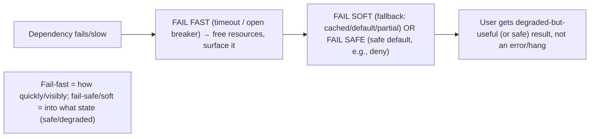

# Lesson 11.4 — Graceful Degradation, Load Shedding, Fail-Fast vs Fail-Safe

> Part 11: Fault Tolerance & Resilience · Difficulty: 🔴
>
> **Prerequisites:** [11.3 Resilience Patterns], [6.7 Load Shedding/Stampede], [3.3.4 Backpressure], [7.7 Capacity/Knee], [11.1 Failure Models].
> **Unlocks:** [11.8 Disaster Recovery], [Part 14 SRE], [Part 15 Rate Limiting], [Part 17 Performance].

---

## 1. Learning Objectives

After this lesson you will be able to:

- Explain **graceful degradation** — providing **reduced but useful** service under failure/overload instead of total failure — and design **fallbacks** (cached/default/partial responses, disabled non-critical features).
- Explain **load shedding** — deliberately **rejecting/dropping** excess load to protect the system under overload — and how it (with backpressure and prioritization) keeps the system alive past capacity (7.7/6.7).
- Distinguish **fail-fast** (detect and fail immediately) from **fail-safe/fail-soft** (fail into a safe/degraded state) and when each is appropriate.
- Combine these with the resilience patterns (11.3) so a system **degrades and sheds** under stress rather than **collapsing** — the difference between "some features slow/off" and "everything down."

---

## 2. Motivation — Degrade, don't collapse

When a system is under **overload** or **partial failure**, it faces a choice: **collapse entirely** (everything fails) or **degrade gracefully** (provide reduced-but-useful service). The resilient choice is always to **degrade, not collapse** — and this lesson covers the techniques that make that possible: **graceful degradation** (fallbacks, disabling non-essential features), **load shedding** (rejecting excess load to protect the core), and the **fail-fast vs fail-safe** design decision. These build on the resilience patterns (11.3) — a circuit breaker that trips needs a **fallback** to return (degradation); an overloaded system needs to **shed** load (not just backpressure) to stay alive — and complete the resilience toolkit.

The core insight is that **partial service beats no service, and a protected system beats a collapsed one.** If a recommendation service is down, the product page should still load **without** recommendations (degraded) rather than error entirely. If traffic exceeds capacity, the system should **reject some requests fast** (shed) so the accepted ones succeed, rather than accept everything and slow to a crawl until it collapses (the latency knee — 7.7; the metastable overload — 6.7). And under failure, a component should **fail into a known-safe or degraded state** (fail-safe) or **fail immediately and visibly** (fail-fast) — a deliberate choice per component. These techniques are what let large systems survive traffic spikes, dependency outages, and partial failures with **graceful, controlled degradation** instead of catastrophic collapse. This lesson develops graceful degradation, load shedding, and the fail-fast/fail-safe distinction — the "degrade, don't collapse" discipline that, with 11.3's patterns, keeps systems serving under stress.

---

## 3. Theory — From first principles

### 3.1 Graceful degradation — reduced but useful service

`[CS]` **Graceful degradation:** when a component fails or is overloaded, the system provides **reduced but still useful** functionality instead of **total failure** `[CS]`. The principle: **partial service beats no service.** Mechanisms:
- **Fallbacks** (the circuit-breaker companion — 11.3): when a dependency fails/breaker is open, return a **fallback** — a **cached** value (possibly stale — Part 6), a **default** value, a **partial** response (omit the failed part), or a **precomputed** result — instead of an error.
- **Disable non-essential features:** shed **non-critical** functionality to protect the **core**. E.g., an e-commerce site under stress **disables recommendations, reviews, "customers also bought"** but keeps **browse + add-to-cart + checkout** working. The core transaction survives; the nice-to-haves are dropped.
- **Serve stale/cached data** (`stale-if-error` — 3.3.3/6.5): if the source is down, serve the last-known-good cached value rather than failing.
- **Reduced fidelity:** lower quality/resolution/precision (e.g., lower-res images, approximate results, fewer results) to reduce load/dependency.
- **Read-only mode:** if writes fail (e.g., primary down — 11.2), serve **reads** (from replicas) while writes are unavailable — partial service.
**The design work:** identify what's **critical** (must work) vs **non-critical** (can degrade/disable), and build **fallbacks** for dependencies so their failure degrades rather than fails the whole.

### 3.2 Feature criticality and dependency classification

`[BP]` Graceful degradation requires **classifying** functionality and dependencies by criticality:
- **Critical (core):** the essential function that **must** work (checkout, login, the core read/write). Protect these — give them dedicated resources (bulkheads — 11.3), highest priority (§3.4), and no non-critical dependencies on the critical path.
- **Non-critical (enhancers):** features that **improve** the experience but aren't essential (recommendations, reviews, related items, personalization). These should **fail independently** (bulkheaded — 11.3) and **degrade/disable** under stress without affecting the core.
- **Dependency criticality:** a dependency is **hard** (the feature can't work without it) or **soft** (the feature can degrade if it's down — use a fallback). **Minimize hard dependencies on the critical path** — every hard dependency is a potential SPOF for the core (11.2). Turn hard dependencies **soft** where possible (fallback to cached/default/partial).
**Rule:** the **critical path** should have **minimal hard dependencies**; non-critical features should degrade independently. This is what lets you shed the enhancers to save the core.

### 3.3 Load shedding — reject excess to protect the core

`[CS]` **Load shedding:** under **overload** (demand exceeds capacity), **deliberately reject or drop some requests** so the system doesn't collapse and the **accepted** requests succeed `[CS]`. The problem it solves (recap 7.7/6.7):
- If an overloaded system **accepts everything**, latency **explodes past the knee** (7.7 — `∝1/(1−ρ)`), queues grow unbounded, and it **collapses** (metastable — 6.7) — serving **nothing** well.
- **Better to serve a *subset* well than everything badly.** Load shedding **caps concurrency/rate** and **rejects the excess fast** (fail-fast — §3.5) → accepted requests stay below the knee (fast), rejected ones get a quick error (retry later) → the system **stays alive and useful** at reduced throughput.
- **Distinct from backpressure (3.3.4):** backpressure **slows the producer** (push back upstream); load shedding **rejects/drops** when you can't slow the producer or the queue is full. Often combined: backpressure first, shed when overwhelmed. Both prevent unbounded buffering.
- **Where:** at the edge (LB/gateway — 3.3.1/3.3.2), at concurrency limits (bulkheads — 11.3), at the source protecting a bottleneck (6.7).

### 3.4 Prioritized load shedding

`[BP]` Not all requests are equal — **shed the least-important first** `[CS]`:
- **Priority/criticality:** shed **non-critical** requests (analytics, recommendations, low-priority background) before **critical** ones (checkout, login, paying customers). Keep the core alive by dropping the periphery.
- **Cost-based:** shed **expensive** requests (that consume the most resources) preferentially to preserve capacity for many cheap ones.
- **Fairness / tenant isolation:** shed to prevent one heavy user/tenant from starving others (rate limiting — Part 15; per-tenant quotas).
- **Adaptive:** shed **more** as overload worsens (based on latency/queue depth/CPU signals), **less** as it eases — dynamically match shedding to the overload.
**Combine with graceful degradation:** shedding the non-critical is *both* load shedding *and* degradation — dropping recommendations under load protects checkout (§3.1/3.2). Prioritized shedding + degradation = "keep the important things working, drop the rest."

### 3.5 Fail-fast vs fail-safe (fail-soft)

`[CS]` When a component **can't do its job**, how should it fail? Two philosophies:
- **Fail-fast:** detect the problem and **fail immediately and visibly** — return an error quickly rather than hang, retry endlessly, or partially proceed. **Why:** fast failure **frees resources** (no hanging — 11.3 timeout), **surfaces the problem** (visible, alertable), and **prevents cascades** (don't hold threads waiting). A circuit breaker's "open" state is fail-fast (11.3). **Use for:** most request-path operations — fail fast + let the caller handle it (retry/degrade). "Fail fast" is generally the resilient default for detecting and containing failures quickly.
- **Fail-safe / fail-soft:** fail into a **known-safe or degraded state** rather than an error/unsafe state. **Fail-safe:** default to the **safe** outcome (e.g., a security system defaults to **locked/deny** on failure — fail-closed; a traffic light defaults to **flashing red**). **Fail-soft (fail-operational):** continue with **degraded** functionality (graceful degradation — §3.1). **Use for:** where a **safe default** or **degraded operation** is better than an error (security defaults, safety-critical systems, degradable features).
- **Fail-open vs fail-closed (a key fail-safe choice):** on failure, do you **allow** (fail-open) or **deny** (fail-closed)? **Security controls fail-closed** (deny on failure — safe — Part 15); **availability-first non-critical checks might fail-open** (allow on failure — e.g., a rate limiter failing open to not block traffic — a deliberate risk). **This choice is critical and must be deliberate** — failing the wrong way (e.g., auth failing open) is a security disaster.
- **The relationship:** fail-fast is about **how quickly/visibly** you fail (contain, surface); fail-safe/soft is about **what state** you fail into (safe/degraded). A well-designed system often **fails fast** (detect quickly) **into a degraded/safe state** (fail-soft/safe) — e.g., a circuit breaker trips fast (fail-fast) and returns a cached fallback (fail-soft).

### 3.6 Composing with the resilience patterns (11.3)

`[BP]` Graceful degradation + load shedding **complete** the resilience toolkit from 11.3:
- **Circuit breaker (11.3) → fallback (§3.1):** when the breaker opens (fail-fast), return a **degraded fallback** (fail-soft) instead of an error → the failing dependency degrades a feature, doesn't fail the page.
- **Bulkhead (11.3) → feature isolation (§3.2):** isolate non-critical features so they degrade independently without affecting the core.
- **Timeout (11.3) → fail-fast + fallback:** a slow dependency times out (fail-fast) → serve a fallback (degrade).
- **Overload → load shed (§3.3) + backpressure (3.3.4):** cap concurrency, shed excess (prioritized — §3.4) → stay below the knee (7.7), avoid metastable collapse (6.7).
- **Together:** under a dependency failure or overload, the system **fails fast, degrades gracefully (fallbacks + disable non-critical), and sheds excess load (prioritized)** → it **stays alive and serves the core** rather than collapsing. This is the full "degrade, don't collapse" resilience posture.

### 3.7 The overarching principle

`[OPINION]`/`[BP]` The unifying principle across 11.3–11.4: **under stress, provide the best service you can with what's working, and protect the core at all costs** `[CS]`:
- **Never collapse entirely** if partial service is possible — degrade (§3.1).
- **Protect the core** — shed/disable the periphery to keep critical functions alive (§3.2/3.4).
- **Fail fast to contain and surface**, fail into a **safe/degraded** state (§3.5).
- **Reject excess rather than accept-and-collapse** — shed load past capacity (§3.3).
- **The user experience under stress** should be "some features are slow/unavailable" (degraded, recoverable) — **never** "everything is down" (collapse). A system that degrades gracefully under a 10x spike or a dependency outage is **resilient**; one that collapses is not — even if both work fine on a good day.
This posture, combined with 11.3's patterns and 11.2's redundancy, is what makes systems survive real-world stress (Part 14).

---

## 4. Visual Intuition

### Degrade vs collapse

```mermaid
flowchart TB
    STRESS["Overload / dependency failure"] --> CHOICE{"Response"}
    CHOICE -->|Collapse (bad)| COL["Accept everything → latency explodes (knee) → everything fails → outage"]
    CHOICE -->|Degrade + shed (good)| DEG["Fallbacks (cached/default/partial) + disable non-critical + SHED excess (prioritized) → core stays alive"]
    note["Partial service beats no service; protect the core, drop the periphery"]
```

### Fail-fast + fail-soft together



---

## 5. Real-World Analogy

Think of a **restaurant during an overwhelming dinner rush** (overload) or when a **supplier fails** (dependency failure).

- **Graceful degradation:** when the kitchen is swamped, a smart restaurant **shrinks the menu to the core dishes** it can reliably make fast (disable non-critical), and if a garnish supplier is out, it serves the dish **without the garnish** (fallback/partial) rather than **refusing to serve the dish at all**. Customers get a **slightly reduced but still good meal** — partial service beats no service.
- **Load shedding:** when the line out the door exceeds what the kitchen can handle, the host **stops seating new customers** (or takes reservations for later) — **rejecting excess** so the customers **already seated get served well**, instead of **cramming everyone in** and having **nobody** get their food (collapse). Better to serve a full-but-manageable room excellently than an overcrowded room terribly.
- **Prioritized shedding:** if they must turn people away, they **prioritize** — seat the **reservation holders and regulars** (critical/paying), turn away **walk-ins wanting just water** (non-critical). Protect the important customers.
- **Fail-fast:** if a dish **can't be made** (out of an ingredient), the waiter tells you **immediately** ("sorry, the special is out") rather than making you **wait an hour** to find out — fast, visible failure frees you (and the kitchen) to move on.
- **Fail-safe vs fail-open:** the **cash register** failing should default to **not charging incorrectly** (fail-safe — deny/hold rather than overcharge); but the **front door lock** during a fire should **fail-open** (unlock — safety over security). The **direction** of failure is a deliberate, critical choice — a **bank vault** fails **closed** (locked/deny — security), a **fire exit** fails **open** (unlocked — safety).
- **The principle:** on the worst night, the restaurant that **degrades** (smaller menu, longer waits, turn some away) **stays open and serving**; the one that tries to **do everything for everyone** **collapses** (kitchen jams, nobody eats, chaos). Resilience is **degrade, don't collapse.**

---

## 6. Industry Example

- **Feature degradation under stress** `[CONV]`: large sites disable non-critical features (recommendations, reviews, personalization) under load/failure to protect the core (browse/checkout) — graceful degradation (§3.1/3.2). *(Representative.)*
- **Circuit breaker + fallback** `[BP]`: Hystrix-style fallbacks return cached/default/partial data when a dependency's breaker opens (11.3, §3.6). *(Representative.)*
- **Load shedding at the edge** `[BP]`: LBs/gateways and adaptive concurrency limits (e.g., Netflix's concurrency-limits, TCP-style AIMD) reject excess to protect the system (§3.3, 3.3.1/3.3.2). *(Representative.)*
- **`stale-if-error` / serve-stale** `[BP]`: CDNs/caches serve stale content when the origin is down (3.3.3/6.5) — degradation over failure (§3.1). *(Representative.)*
- **Fail-closed security / fail-open availability** `[BP]`: auth/security controls fail-closed (deny on failure — Part 15); some non-critical checks (a rate limiter) may fail-open deliberately (§3.5). *(Representative.)*
- **Read-only mode during failover** `[CONV]`: serving reads (from replicas) while writes are unavailable during a primary failure (11.2, §3.1). *(Representative.)*

---

## 7. Implementation Details — degrade, shed, and fail well

- **Classify functionality/dependencies by criticality** (§3.2): protect the **core** (bulkheads — 11.3, priority, minimal hard dependencies), let **non-critical** features degrade/disable independently `[BP]`.
- **Build fallbacks for dependencies** (§3.1): cached (stale-if-error — 6.5/3.3.3), default, partial, or precomputed responses — pair with circuit breakers (11.3) so a dependency failure degrades a feature, not the page. **Turn hard dependencies soft** where possible.
- **Implement load shedding** (§3.3): cap concurrency/rate (at the edge/bulkheads), **reject excess fast** (fail-fast) to stay below the knee (7.7); combine with backpressure (3.3.4).
- **Prioritize shedding** (§3.4): drop non-critical/expensive/low-priority requests first; protect critical/paying/core; adapt to overload signals (latency/queue/CPU).
- **Choose fail-fast for detection/containment** (timeout/open breaker — 11.3) and **fail-safe/soft for the resulting state** (safe default or degraded fallback) (§3.5).
- **Make the fail-open vs fail-closed choice deliberately** — security controls **fail-closed** (deny); non-critical availability checks **may fail-open** (allow) — never let auth/critical controls fail-open (§3.5, Part 15).
- **Compose with 11.3's patterns** (§3.6): breaker→fallback, bulkhead→feature isolation, timeout→fail-fast+degrade, overload→shed+backpressure.
- **Test degradation and shedding** (chaos + load — Part 14/7.7): verify the system degrades (not collapses) under dependency failure and overload — untested degradation doesn't work (11.1).

---

## 8. Advantages

- **Stays alive under stress** — degrade + shed = partial service instead of total collapse (§3.1/3.3).
- **Protects the core** — non-critical features degrade/shed to keep critical functions working (§3.2/3.4).
- **Prevents overload collapse** — shedding keeps the system below the latency knee (no metastable collapse — 7.7/6.7).
- **Fast, contained failure** — fail-fast frees resources and surfaces problems (§3.5, 11.3).
- **Safe failure states** — fail-safe/closed defaults protect security/safety (§3.5).
- **Better user experience under stress** — "some features off" beats "everything down" (§3.7).

---

## 9. Disadvantages / costs

- **Complexity** — fallbacks, criticality classification, shedding logic, priority schemes, fail-mode choices all add design/code (§3.1–3.5).
- **Degraded correctness** — fallbacks may serve **stale/approximate/partial** data (acceptable for non-critical, not for correctness-critical — §3.1); must be chosen carefully.
- **Shedding = dropped requests** — rejected users get errors (retry later); a deliberate loss for system survival (§3.3).
- **Wrong fail direction is dangerous** — auth failing open, or safety failing closed, is catastrophic (§3.5).
- **Fallback bugs** — untested/incorrect fallbacks can serve wrong data or fail themselves (§7).
- **Tuning** — shedding thresholds, priorities, breaker/fallback behavior need tuning (§3.3/3.4).

---

## 10. When NOT to / limits

- **Don't serve incorrect fallback data for correctness-critical operations** — degrade fidelity/features, not correctness (money must not fall back to a stale/wrong value silently) (§3.1).
- **Don't let critical controls fail-open** — auth/security/safety must fail-closed (§3.5, Part 15).
- **Don't shed critical requests** to preserve non-critical ones — prioritize correctly (§3.4).
- **Don't accept-everything-and-collapse** under overload — shed excess (§3.3, 7.7).
- **Don't put non-critical hard dependencies on the critical path** — turn them soft or move them off (§3.2).
- **Don't skip testing** degradation/shedding — untested = collapses when needed (§7, 11.1).

---

## 11. Common Mistakes

1. **No degradation — collapse on dependency failure** → a non-critical dependency's outage fails the whole page (should degrade) (§3.1/3.2).
2. **No load shedding — accept everything under overload** → latency explodes → metastable collapse (§3.3, 7.7/6.7).
3. **Non-critical hard dependency on the critical path** → its failure takes down the core (§3.2).
4. **Shedding critical requests** while serving non-critical → protecting the wrong things (§3.4).
5. **Auth/security failing open** → a security disaster (should fail-closed) (§3.5, Part 15).
6. **Fallback serving wrong data for correctness-critical ops** → silent incorrectness (§3.1).
7. **Fail-slow (hang) instead of fail-fast** → resource exhaustion / cascade (§3.5, 11.3).
8. **Untested fallbacks/shedding** → don't work when triggered (§7, 11.1).

---

## 12. Interview Questions

**🟢 Easy**
- What is graceful degradation, and why is partial service better than no service?
- What is load shedding, and what does it protect against?

**🟡 Medium**
- How do you classify functionality/dependencies to decide what degrades vs what's protected?
- Distinguish fail-fast from fail-safe, and give an example of each. What's fail-open vs fail-closed?

**🔴 Hard**
- Design graceful degradation for a product page with a critical path (browse/add-to-cart/checkout) and non-critical enhancers (recommendations/reviews). How does it degrade when each dependency fails?
- How do load shedding and backpressure differ and combine? How does prioritized shedding keep the core alive under a 10x spike?

**⚫ Staff+**
- Design the "degrade, don't collapse" strategy for a service under a dependency outage and a traffic spike: criticality classification, fallbacks (breaker-paired), bulkheads, prioritized load shedding, fail-fast + fail-safe/soft choices, and fail-open/closed decisions — and how you'd test it (chaos/load). Tie to the latency knee (7.7) and metastable failures (6.7).
- A non-critical recommendations service went down and took the entire checkout flow with it. Diagnose (hard dependency on the critical path, no fallback, no bulkhead, no circuit breaker), and redesign so the core degrades gracefully (soft dependency + fallback + bulkhead + breaker).

---

## 13. Production Pitfalls

- **Non-critical dependency fails the core:** recommendations/reviews down → the whole page errors (hard dependency, no fallback/bulkhead) (§3.2) — the classic degradation failure.
- **Overload collapse (no shedding):** a spike is fully accepted → latency past the knee → metastable collapse → total outage (§3.3, 7.7/6.7).
- **Auth fails open:** an auth-service failure defaults to "allow" → unauthorized access (should fail-closed) (§3.5, Part 15) — a security disaster.
- **Shedding the wrong things:** critical/paying requests shed while non-critical served → business-critical failures under load (§3.4).
- **Fail-slow cascade:** components hang instead of failing fast → resource exhaustion → cascade (§3.5, 11.3).
- **Silent wrong fallback:** a fallback serves stale/incorrect data for a correctness-critical operation (§3.1).
- **Untested degradation:** the fallback/shedding path was never exercised → collapses when the real failure hits (§7, 11.1).

---

## 14. Optimization Techniques

- **Criticality classification + minimal hard dependencies on the critical path** — protect the core, degrade the periphery (§3.2) `[BP]`.
- **Breaker-paired fallbacks** (cached/default/partial/stale-if-error) — degrade dependencies, don't fail the page (§3.1/3.6, 11.3, 6.5).
- **Bulkheads** to isolate non-critical features so they degrade independently (§3.2, 11.3).
- **Prioritized, adaptive load shedding** + backpressure — reject non-critical/expensive excess to stay below the knee (§3.3/3.4, 7.7/3.3.4).
- **Fail-fast (timeout/open breaker) into fail-safe/soft (safe default/degraded fallback)** (§3.5, 11.3).
- **Deliberate fail-open/closed** — security fails-closed, non-critical availability checks may fail-open (§3.5, Part 15).
- **Read-only mode / reduced fidelity** as degradation levers (§3.1).
- **Chaos + load testing** to prove degradation and shedding work (§7, Part 14/7.7).

---

## 15. Summary

Under **overload or partial failure**, a resilient system's guiding principle is **degrade, don't collapse** — **partial service beats no service, and a protected system beats a collapsed one**. **Graceful degradation** provides **reduced-but-useful** functionality: **fallbacks** (cached/`stale-if-error` — 6.5/3.3.3, default, partial, or precomputed responses — paired with circuit breakers, 11.3, so a dependency failure degrades a *feature*, not the page), **disabling non-critical features** (drop recommendations/reviews/personalization to protect browse/checkout), **reduced fidelity**, and **read-only mode** (serve reads during a write/primary failure — 11.2). This requires **classifying** functionality and dependencies by **criticality** — protect the **core** (bulkheads, priority, **minimal hard dependencies on the critical path**), let **non-critical** enhancers **degrade/disable independently** — and **turning hard dependencies soft** (fallbacks) where possible. **Load shedding** deliberately **rejects/drops excess load** under overload so the system stays **below the latency knee** (7.7) and the **accepted** requests succeed — because **accept-everything → latency explodes → metastable collapse** (6.7), so **serving a subset well beats everything badly**; it's distinct from **backpressure** (which slows the producer — 3.3.4) but combined with it, and should be **prioritized** (shed non-critical/expensive/low-priority first, protect critical/paying/core) and **adaptive** (more as overload worsens). **Fail-fast vs fail-safe** is the failure-mode choice: **fail-fast** = fail **immediately and visibly** (free resources, surface the problem, prevent cascades — the open circuit breaker, 11.3 — generally the resilient default for *detection/containment*); **fail-safe/fail-soft** = fail into a **known-safe or degraded state** (a safe default, or graceful degradation). The **fail-open vs fail-closed** direction is critical and deliberate — **security/critical controls fail-closed (deny)**, some non-critical availability checks **may fail-open (allow)** — failing the wrong way (auth failing open) is a disaster. Well-designed systems **fail fast into a degraded/safe state** (breaker trips fast → returns a cached fallback). Composed with 11.3's patterns (breaker→fallback, bulkhead→feature isolation, timeout→fail-fast+degrade, overload→shed+backpressure) and 11.2's redundancy, these make the user experience under stress **"some features slow/off" (degraded, recoverable)** rather than **"everything down" (collapse)** — the hallmark of a resilient system, verified by **chaos and load testing** (Part 14/7.7).

---

## 16. Revision Notes (flashcard-ready)

- **Q:** Graceful degradation? **A:** Reduced-but-useful service under failure/overload instead of total failure; partial service beats no service.
- **Q:** Degradation mechanisms? **A:** Fallbacks (cached/default/partial/stale-if-error), disable non-critical features, reduced fidelity, read-only mode.
- **Q:** Criticality classification? **A:** Protect the core (minimal hard dependencies, bulkheads, priority); let non-critical degrade independently; turn hard deps soft.
- **Q:** Load shedding? **A:** Deliberately reject/drop excess load under overload → stay below the knee, accepted requests succeed (beats accept-everything-and-collapse).
- **Q:** Shedding vs backpressure? **A:** Backpressure slows the producer; shedding rejects/drops when you can't slow or the queue's full. Combine.
- **Q:** Prioritized shedding? **A:** Drop non-critical/expensive/low-priority first; protect critical/paying/core; adapt to overload.
- **Q:** Fail-fast? **A:** Fail immediately and visibly (free resources, surface, prevent cascade); e.g., open circuit breaker.
- **Q:** Fail-safe / fail-soft? **A:** Fail into a safe default (fail-safe) or degraded operation (fail-soft/graceful degradation).
- **Q:** Fail-open vs fail-closed? **A:** On failure, allow (open) or deny (closed). Security fails-closed; non-critical availability may fail-open — deliberate, critical choice.
- **Q:** Overarching principle? **A:** Degrade, don't collapse — protect the core, shed/disable the periphery, fail fast into a safe/degraded state.

---

## 17. Further Reading + Knowledge-Graph Links

**Within this platform**
- **Previous:** [11.3 Resilience Patterns] (breaker→fallback, bulkhead, timeout→fail-fast). **Builds on:** [6.7 Load Shedding/Stampede/Metastable], [3.3.4 Backpressure], [7.7 Latency Knee/Capacity], [11.1 Failure Models], [6.5/3.3.3 stale-if-error].
- **Next:** [11.5 Idempotency]. **Then:** [11.8 Disaster Recovery].
- **Enables:** [Part 14 SRE] (graceful degradation, load shedding, chaos), [Part 15 Rate Limiting/fail-closed], [Part 17 Performance].

**Foundational texts (synthesized)**
- Nygard, *Release It!* — fail fast, graceful degradation, shed load, stability patterns (concept, synthesized).
- *Site Reliability Engineering* (Beyer et al.) — load shedding, graceful degradation, handling overload (synthesized).

**Concept tags:** `[CS]` graceful degradation, fallbacks, load shedding, prioritized shedding, fail-fast, fail-safe/soft, fail-open/closed · `[CONV]` feature degradation, edge shedding, stale-if-error, read-only mode · `[BP]` protect the core / degrade the periphery, breaker+fallback, prioritized+adaptive shedding, fail-fast into safe/degraded state, security fails-closed · `[OPINION]` degrade-don't-collapse.
