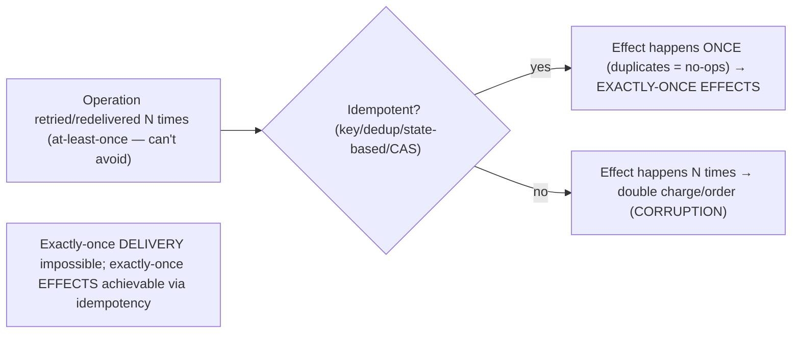

# Lesson 11.5 — Idempotency, Deduplication, and Exactly-Once Effects

> Part 11: Fault Tolerance & Resilience · Difficulty: 🔴
>
> **Prerequisites:** [8.4.1 RPC/Exactly-Once Effects], [9.4 Delivery Guarantees], [9.5 Idempotent Consumers], [11.3 Retries], [5.2.4 CAS/OCC].
> **Unlocks:** [11.6 Distributed Transactions], [11.7 Sagas], [Part 12 Microservices], [Part 20 Capstone].

---

## 1. Learning Objectives

After this lesson you will be able to:

- Define **idempotency** precisely and explain why it's the **foundational requirement** that makes retries (11.3), at-least-once delivery (9.4), and failure recovery **safe** — turning "retry might double-execute" into "retry is harmless."
- Implement idempotency: **idempotency keys** + a **dedup store**, **natural idempotency** (state-based operations), **conditional writes / CAS / version checks** (5.2.4), and **natural business keys**.
- Explain **exactly-once *effects*** (the achievable goal — vs impossible exactly-once *delivery* — 8.4.1/9.4) via **at-least-once + idempotency/dedup**, and its scope/limits (end-to-end requires idempotency at every hop).
- Design idempotent operations across the stack (RPC, messaging, retries, payments) so failures/retries/duplicates never corrupt state.

---

## 2. Motivation — The property that makes retries safe

Every resilience technique we've built **depends on idempotency**. Retries (11.3) recover from transient failures — but a retry of a **lost-response** write **double-executes** unless idempotent. At-least-once delivery (9.4) guarantees no message loss — but redelivers duplicates unless consumers are idempotent. Failover (11.2) and crash-recovery (11.1) can reprocess in-flight operations. The unreliable network's **ambiguous timeout** (8.1.1/8.4.1) means you can **never know** if an operation succeeded — so you **must** retry to be safe, and retrying is only safe if the operation is **idempotent**. **Idempotency is therefore not an optional nicety — it's the foundational property that makes fault tolerance possible**: it turns "retry/redelivery/reprocessing might corrupt state" into "retry/redelivery/reprocessing is harmless."

We've developed the pieces across the platform — idempotency in RPC (8.4.1), idempotent consumers in messaging (9.5), delivery guarantees (9.4), CAS/OCC (5.2.4) — and this lesson **consolidates idempotency as the central resilience primitive** and the route to **exactly-once effects**. The key reframe (from 8.4.1/9.4): **exactly-once *delivery* is impossible** (the two-generals problem — a lost ack forces choosing between possibly-losing and possibly-duplicating), but **exactly-once *effects*** — the operation's observable effect on state happens **once**, no matter how many times it's delivered/attempted — **is** achievable via **at-least-once delivery + idempotency/deduplication**. This is what you actually want (a customer charged **once**, an order created **once**) and what every credible "exactly-once" system provides. This lesson makes idempotency concrete (the techniques), explains exactly-once effects and its end-to-end scope, and shows how to design operations so the **retries and duplicates that fault tolerance inevitably produces never corrupt state** — the linchpin that ties together 11.3's retries, 9.4's delivery, and correct distributed systems.

---

## 3. Theory — From first principles

### 3.1 Idempotency, precisely

`[CS]` An operation is **idempotent** if **applying it multiple times produces the same result/effect as applying it once** `[CS]`. Formally, `f(f(x)) = f(x)` — repeating it doesn't change the outcome beyond the first application. Examples:
- **Idempotent:** `set balance = 100` (setting again = same), `DELETE /resource/42` (deleting an already-deleted thing = no-op), `PUT` (replace — 3.2.1), reads (GET), "mark order SHIPPED" (already shipped → no change).
- **NOT idempotent:** `balance += 100` (each application adds again), "create a new order" (each creates another), "charge the card $50" (each charges again), "increment counter," `POST` (3.2.1). Applying these twice **doubles** the effect.
**Why it's the resilience linchpin:** because the network's ambiguous timeout (8.4.1) means you must retry without knowing if the original succeeded, **idempotency makes retrying safe** — a duplicate application is a no-op, so you can retry freely → **at-least-once + idempotency = exactly-once effects** (§3.5).

### 3.2 Why fault tolerance requires idempotency

`[CS]` Idempotency is required by essentially every resilience mechanism:
- **Retries (11.3):** a retry after a **lost response** (the original succeeded, ack lost — 8.4.1) **re-executes** → double effect **unless idempotent**.
- **At-least-once delivery (9.4/9.5):** messaging redelivers on failure (crash before ack/offset-commit) → duplicate processing **unless idempotent**.
- **Failover (11.2) / crash-recovery (11.1):** in-flight operations may be **reprocessed** after a failover or restart → duplicates unless idempotent.
- **Client retries / user double-clicks:** users retry (double-submit a form) → duplicate requests unless idempotent.
So **idempotency is the precondition for safe retries/redelivery/reprocessing** — without it, the fault-tolerance techniques that recover from failures **cause** data corruption (double charges/orders). **Make operations idempotent, and failure recovery becomes safe.**

### 3.3 Technique 1 — Idempotency keys + dedup store

`[CS]`/`[BP]` The general technique to make **any** operation idempotent (recap 8.4.1):
- The client attaches a **unique idempotency key** to the request (a UUID per **logical** operation — the *same* key on retries of the *same* operation).
- The server maintains a **dedup store** (a table/cache of processed keys). On receiving a request:
  - **New key:** execute the operation, **record the key** (+ the result), return the result.
  - **Duplicate key** (already processed): **do NOT re-execute** — return the **stored original result**.
- This makes the operation **effectively idempotent** regardless of its intrinsic nature (even a non-idempotent "charge card" becomes safe). The **Stripe pattern** — payment APIs require an idempotency key so retrying a charge never double-charges.
- **Design points:** the key must be **stable across retries** (client generates it once per logical op, reuses on retry — not a new key each retry); the dedup store needs a **TTL/retention window** (bounded — long enough to cover the retry window, else it grows unbounded); the **record + execute** should be atomic (or handle the race — see §3.6).

### 3.4 Technique 2 — Natural idempotency (state-based operations)

`[CS]`/`[BP]` The **simplest** idempotency: design operations to be **naturally idempotent** — **state-based (absolute), not delta-based (relative)**:
- **State-based (idempotent):** `set status = SHIPPED`, `set balance = 100`, `set config = X`, `PUT` (replace the whole resource). Applying twice = same state → safe to retry, no dedup needed.
- **Delta-based (NOT idempotent):** `balance += 100`, `increment count`, `append item`. Applying twice = wrong result.
- **The technique:** **prefer state-based operations** where possible — they're idempotent **by construction** (no idempotency key/dedup store needed). E.g., instead of "add $100 to balance," compute the new balance and "set balance = new_value" (with a version check — §3.5 — to avoid lost updates). This is the cheapest idempotency (§9.5).

### 3.5 Technique 3 — Conditional writes / CAS / version checks

`[CS]`/`[BP]` Use the **database** to enforce idempotency/no-double-effect:
- **Natural business keys + upsert:** use a **unique business key** (order number, request ID) with `INSERT ... ON CONFLICT DO NOTHING` (upsert) → a duplicate insert is a **no-op** (the unique constraint rejects it). "Create order #A7" twice → only one order.
- **Compare-and-set (CAS) / optimistic concurrency (OCC — 5.2.4):** write **only if** the current version/value matches expected → a stale/duplicate update is **rejected** (like fencing — 8.3.6). Also prevents lost updates (5.2.3) for state-based operations (§3.4).
- **Conditional operations:** `UPDATE ... WHERE status = 'PENDING'` → applying twice, the second finds status already changed → no-op.
These leverage the database's atomicity (5.2.1) to make operations idempotent without a separate dedup store — often the cleanest approach.

### 3.6 Exactly-once *effects* (the achievable goal)

`[CS]` The reframe from 8.4.1/9.4: **exactly-once *delivery* is impossible** (the two-generals argument — a lost ack forces choosing between loss and duplication), but **exactly-once *effects*** (a.k.a. exactly-once processing) — the operation's **observable effect on state happens exactly once** regardless of how many times it's delivered/attempted — **is** achievable `[CS]`:
- **The formula: at-least-once delivery + idempotency/deduplication = exactly-once effects.** Deliver/retry as many times as needed (never lose it — at-least-once), and make the **effect** happen once (idempotency — §3.3–3.5).
- **This is what you actually want** — not "the message is delivered exactly once" (impossible/unobservable) but "**the customer is charged exactly once**," "**the order is created exactly once**." The visible behavior is exactly-once even though delivery is at-least-once.
- **Every credible "exactly-once" system** (Kafka EOS — 9.4, payment APIs) implements it as **at-least-once + dedup/idempotency (or transactions)** under the hood. There is no exactly-once delivery magic.

### 3.7 End-to-end scope and limits

`[CS]`/`[BP]` The **crucial caveat** (recap 9.4 §3.6): **exactly-once effects must hold at *every* hop** — the guarantee is only as strong as the weakest non-idempotent step:
- **In-system EOS** (Kafka transactions — 9.4) covers exactly-once *within* the streaming system, but **NOT external side effects** (a third-party payment API call, an email, an external DB write not in the transaction). If your processing charges a card via an external API and the transaction retries, **the external charge already happened** — the in-system EOS doesn't undo it.
- **So: for each external boundary, add idempotency** (idempotency keys on the payment API — §3.3, the **outbox pattern** — 9.8 — to make DB-write+event atomic and reliable).
- **End-to-end exactly-once effects = every hop idempotent/deduplicated/transactional.** A single unguarded non-idempotent external effect breaks it (the #1 source of double-charge bugs — 9.4). There is **no global "exactly-once"** for arbitrary external actions — you build it hop-by-hop with idempotency.

### 3.8 Design discipline

`[BP]` The idempotency design discipline for resilient systems:
- **Assume every operation may be retried/redelivered/reprocessed** (retries, at-least-once, failover, user double-clicks — §3.2). Design so duplicates are **harmless**.
- **Prefer natural idempotency** (state-based operations — §3.4) — the cheapest, no dedup store.
- **Use conditional writes / upsert / CAS** (natural business keys, version checks — §3.5) — leverage the DB's atomicity.
- **Add idempotency keys + dedup store** for operations that can't be made naturally idempotent (charges, order creation — §3.3), especially at **external boundaries** (§3.7).
- **For messaging consumers**, use the **per-key last-applied-version** pattern (dedup + out-of-order tolerance — 9.5).
- **Bound dedup state** (TTL/window — §3.3) to prevent unbounded growth.
- **Make idempotency end-to-end** — every hop (RPC, messaging, external calls) idempotent → exactly-once effects (§3.7).
- **Test with duplicates/retries injected** — verify idempotency actually holds (Part 14).
**The mantra (from 9.5): assume at-least-once → assume duplicates → make every effect idempotent** → the visible behavior is exactly-once.

---

## 4. Visual Intuition

### At-least-once + idempotency = exactly-once effects



### Idempotency key + dedup store

```mermaid
flowchart TB
    REQ["Request with idempotency key K (stable across retries)"] --> CHK{"Seen K in dedup store?"}
    CHK -->|no (new)| EXEC["Execute, record K + result, return result"]
    CHK -->|yes (duplicate)| RET["Skip execution, return STORED original result"]
    note["Turns any operation (even 'charge card') into effectively-idempotent. Dedup store needs a TTL window."]
```

---

## 5. Real-World Analogy

Recall the **pizza-by-postcard** analogy (8.4.1), now as the resilience linchpin.

- **The problem:** you mail "send me a pizza," and — because the mail is unreliable (8.1.1) — you might not get a confirmation, so to be safe you **re-mail** it (retry). But if the first postcard *did* arrive and the pizzeria is already making your pizza, re-mailing means **two pizzas** (double charge). You **can't tell** if the first arrived (ambiguous — 8.4.1), so you **must** re-mail to avoid getting **no** pizza — but re-mailing risks **two**.
- **Idempotency solves it:** you write an **order number ("#A7")** on every postcard, and the pizzeria keeps a **list of order numbers it has filled**. If a second "#A7" arrives, they see "we already made #A7" and **don't make another** — they just re-confirm the existing one. Now you can **re-mail #A7 as many times as you want** (at-least-once, safe against loss) and still get **exactly one pizza** (exactly-once effect). **The order number made re-mailing harmless** — that's idempotency turning "retry might duplicate" into "retry is safe."
- **State-based (natural idempotency):** even simpler — instead of "**add** a pizza to my order" (delta — re-mailing adds more), you say "**my order IS: one pizza**" (state — re-mailing just re-states the same order). Re-stating the same absolute order any number of times = one pizza, no order number needed.
- **The end-to-end caveat:** suppose making the pizza involves the pizzeria **calling a supplier to charge for premium cheese** (an external side effect). Their internal "we already made #A7" list doesn't stop the **supplier** from being charged twice if the pizzeria's process retried — so the **supplier** also needs to honor "#A7 — already charged, don't charge again." **Every hop needs its own order-number check** — the guarantee is only as strong as the weakest step that forgot to dedup.
- **The universal truth:** because the mail (network) is unreliable and you must re-send to be safe, **the order number (idempotency) is what makes the whole system correct** — without it, every safety re-send risks corruption.

---

## 6. Industry Example

- **Stripe idempotency keys** `[BP]`: the canonical example — every charge request carries an idempotency key; retrying never double-charges (§3.3, 8.4.1). *(Representative.)*
- **Kafka EOS = at-least-once + idempotent producer + transactions** `[EMERGING]`: "exactly-once" implemented as at-least-once delivery + dedup/transactions within Kafka (§3.6, 9.4) — not exactly-once delivery magic. *(Representative.)*
- **Upsert / `INSERT ... ON CONFLICT`** `[BP]`: natural-business-key idempotency — a duplicate insert is a no-op (§3.5). *(Representative.)*
- **Idempotent consumers (last-applied-version)** `[CONV]`: messaging consumers dedup by event ID / per-key version to survive at-least-once redelivery (9.5, §3.8). *(Representative.)*
- **Outbox pattern for external effects** `[BP]`: atomically write DB change + event, then reliably publish — making external integration exactly-once-effect (9.8, §3.7). *(Representative.)*
- **HTTP method idempotency** `[CONV]`: GET/PUT/DELETE idempotent, POST not (3.2.1) — clients safely retry idempotent methods (§3.1). *(Representative.)*

---

## 7. Implementation Details — making operations idempotent

- **Assume every operation may be retried/redelivered/reprocessed** (retries — 11.3, at-least-once — 9.4, failover — 11.2, double-clicks) → make duplicates **harmless** (§3.2/3.8) `[BP]`.
- **Prefer natural idempotency** — **state-based (absolute) operations** (`set X`, `PUT`) over delta-based (`+= X`) — idempotent by construction, no dedup needed (§3.4).
- **Use conditional writes / upsert / CAS** — natural business keys with `INSERT ... ON CONFLICT DO NOTHING`, or version-checked updates (OCC — 5.2.4) — leverage DB atomicity for idempotency + no lost updates (§3.5).
- **Add idempotency keys + a dedup store** for operations that can't be naturally idempotent (charges, order creation) — client sends a **stable** key per logical op; server records processed keys (with a **TTL window**) and returns the stored result on duplicates (§3.3). Handle the record+execute race atomically.
- **Idempotency at every external boundary** (payment APIs, emails, external DBs) — in-system EOS (Kafka) does **not** cover external side effects (§3.7, 9.4); use idempotency keys / outbox (9.8).
- **For messaging consumers**, use per-key **last-applied-version** (dedup + out-of-order — 9.5).
- **Bound dedup state** (TTL) to prevent unbounded growth (§3.3).
- **Test with injected duplicates/retries** (chaos — Part 14) — verify idempotency holds end-to-end.

---

## 8. Advantages

- **Makes retries/redelivery/failover safe** — the foundation of fault tolerance (§3.2) — duplicates become harmless.
- **Exactly-once effects** — at-least-once + idempotency → correct outcomes (no double charge/order) despite the impossible exactly-once delivery (§3.6).
- **Simplicity via natural idempotency** — state-based operations need no dedup machinery (§3.4).
- **Handles user double-clicks / client retries** gracefully (§3.2).
- **Enables safe at-least-once messaging** (9.4/9.5) and safe resilient retries (11.3).
- **DB-enforced (upsert/CAS)** — clean, atomic idempotency without extra stores (§3.5).

---

## 9. Disadvantages / costs

- **Dedup state to maintain** — idempotency-key stores (TTL/window management, storage) for non-naturally-idempotent operations (§3.3).
- **End-to-end burden** — every hop must be idempotent; easy to miss an external boundary (the #1 double-charge bug — §3.7).
- **Design effort** — reworking delta-based operations to state-based, adding keys/upserts/CAS (§3.4/3.5).
- **Race handling** — the record+execute step needs atomicity/careful handling (§3.3/3.6).
- **Not always natural** — some operations are intrinsically non-idempotent and need keys/dedup (§3.3).
- **Doesn't give exactly-once *delivery*** — only effects (a reframe some find confusing — §3.6).

---

## 10. When NOT to / limits

- **Don't retry non-idempotent operations** without making them idempotent first → double effects (§3.2/3.3).
- **Don't assume in-system EOS covers external side effects** — add idempotency at each external boundary (§3.7, 9.4).
- **Don't use delta-based operations** where state-based would be naturally idempotent (§3.4).
- **Don't let the dedup store grow unbounded** — bound with TTL (§3.3).
- **Don't design for exactly-once *delivery*** — it's impossible; design exactly-once *effects* (§3.6).
- **Don't skip idempotency thinking "retries are rare"** — the ambiguous timeout means you *must* retry, so duplicates *will* happen (§3.2).

---

## 11. Common Mistakes

1. **Retrying non-idempotent operations** → double charges/orders (§3.2/3.3) — the signature bug.
2. **Delta-based operations** (`+= x`) retried → wrong totals (use state-based) (§3.4).
3. **Assuming in-system EOS covers external effects** → double external effects on retry (§3.7, 9.4).
4. **New idempotency key per retry** (instead of stable per logical op) → dedup fails, duplicates execute (§3.3).
5. **Unbounded dedup store** → memory/storage blowup; or **too-short TTL** → misses duplicates after the window (§3.3).
6. **Believing in exactly-once delivery** → building on a myth instead of at-least-once + idempotency (§3.6).
7. **Non-idempotent consumers under at-least-once** → duplicate processing (§3.2, 9.5).
8. **Not testing with duplicates** → idempotency assumed, not verified (§3.8).

---

## 12. Interview Questions

**🟢 Easy**
- What is idempotency? Give an idempotent and a non-idempotent operation.
- Why is idempotency required for safe retries?

**🟡 Medium**
- How do idempotency keys + a dedup store make a non-idempotent operation (like charging a card) safe to retry?
- What's the difference between exactly-once delivery and exactly-once effects, and how do you achieve the latter?

**🔴 Hard**
- Design idempotency for a payment "charge" operation retried over an unreliable network. Cover the key, the dedup store, races, TTL, and returning the original result.
- Why must exactly-once effects hold at every hop? Where does in-system EOS (Kafka) stop, and how do you cover external side effects (idempotency keys / outbox)?

**⚫ Staff+**
- Design end-to-end exactly-once effects for an order flow: receive order (RPC retry), charge card (external API), write DB, emit event (messaging at-least-once). Make each hop idempotent (keys/upsert/CAS/outbox), and analyze what happens on a crash/retry at each step. Why is there no global exactly-once?
- A payments service double-charged customers after a network blip triggered retries. Diagnose (at-least-once retries without idempotency), design the fix (idempotency keys + dedup + returning original result, state-based where possible), and explain how you'd reconcile the existing duplicates.

---

## 13. Production Pitfalls

- **Double-charge / duplicate-order:** a lost response triggers a retry of a non-idempotent operation → charged/created twice (§3.2/3.3) — the classic resilience bug.
- **External-effect duplicate despite "exactly-once":** in-system EOS covers the pipeline but the external payment API isn't idempotent → retry re-charges (§3.7, 9.4).
- **Delta reprocessing:** `balance += x` retried → inflated balance (§3.4).
- **Key-per-retry bug:** a new idempotency key generated on each retry → dedup never matches → duplicates execute (§3.3).
- **Dedup store blowup / misses:** no TTL → unbounded; too-short TTL → duplicates slip through after the window (§3.3).
- **Non-idempotent consumer duplicates:** at-least-once redelivery + non-idempotent processing → double effects (§3.2, 9.5).
- **Untested idempotency:** the dedup path was never exercised with real duplicates → fails when it matters (§3.8).

---

## 14. Optimization Techniques

- **Natural idempotency (state-based operations)** — cheapest, no dedup store (§3.4) `[BP]`.
- **Conditional writes / upsert / CAS** (natural keys, version checks — 5.2.4) — DB-enforced idempotency + no lost updates (§3.5).
- **Idempotency keys + bounded dedup store** for non-naturally-idempotent ops, at every external boundary (§3.3/3.7).
- **Per-key last-applied-version** for messaging consumers (dedup + out-of-order — 9.5).
- **Outbox pattern** for atomic DB-change + reliable event (external integration — 9.8, §3.7).
- **At-least-once + idempotency = exactly-once effects** — the default correctness pattern (§3.6, 9.4).
- **End-to-end idempotency** (every hop) + **duplicate-injection testing** (Part 14) (§3.7/3.8).

---

## 15. Summary

**Idempotency** — applying an operation multiple times produces the **same effect as applying it once** (`f(f(x)) = f(x)`) — is the **foundational property that makes fault tolerance possible**. Because the unreliable network's **ambiguous timeout** (8.4.1) means you can **never know** if an operation succeeded, you **must retry** to avoid losing it — and **retrying is only safe if the operation is idempotent** (else a lost-response retry **double-executes**). Every resilience mechanism depends on it: **retries** (11.3), **at-least-once delivery** (9.4/9.5), **failover/crash-recovery** (11.2/11.1), and even **user double-clicks** all produce **duplicates** that corrupt state **unless idempotent**. Idempotency techniques: **(1) natural idempotency** — prefer **state-based (absolute)** operations (`set X`, `PUT`) over **delta-based (relative)** ones (`+= X`) — idempotent by construction, no dedup needed (the cheapest); **(2) conditional writes / upsert / CAS** — natural business keys with `INSERT ... ON CONFLICT DO NOTHING`, or version-checked updates (OCC — 5.2.4) — leverage DB atomicity for idempotency + no lost updates; **(3) idempotency keys + a dedup store** — the client sends a **stable unique key** per logical operation (reused on retries), the server records processed keys (with a **TTL window**) and **returns the stored result on duplicates without re-executing** (the Stripe pattern — makes even "charge card" safe). This delivers **exactly-once *effects***: since **exactly-once *delivery* is impossible** (the two-generals problem — a lost ack forces choosing between loss and duplication), the achievable and desired goal is that the **observable effect happens once** — via **at-least-once delivery + idempotency/deduplication** (what you want: charged **once**, order created **once**; what every "exactly-once" system actually does — 9.4). **Crucially, exactly-once effects must hold at *every* hop** — in-system EOS (Kafka transactions) does **not** cover **external side effects** (a third-party payment API, an email, an external DB), so you must add **idempotency at each external boundary** (idempotency keys / the **outbox pattern** — 9.8); the guarantee is only as strong as the weakest unguarded non-idempotent step (the #1 double-charge bug), and there is **no global exactly-once** — you build it hop-by-hop. The design discipline (from 9.5): **assume at-least-once → assume duplicates → make every effect idempotent** (prefer state-based, use upsert/CAS, add idempotency keys at external boundaries, bound dedup state, test with injected duplicates) → the visible behavior becomes **exactly-once** even though delivery is at-least-once. Idempotency is the linchpin that makes 11.3's retries, 9.4's delivery, and correct distributed systems safe.

---

## 16. Revision Notes (flashcard-ready)

- **Q:** Idempotency? **A:** Applying an operation N times = applying it once (`f(f(x))=f(x)`); duplicates are no-ops.
- **Q:** Idempotent vs not? **A:** Idempotent: set/PUT/DELETE/read, "mark SHIPPED". Not: `+= x`, "create order", "charge card", POST, increment.
- **Q:** Why is idempotency the resilience linchpin? **A:** Ambiguous timeout → must retry; retry is safe only if idempotent → turns "retry might duplicate" into "retry is harmless."
- **Q:** Three idempotency techniques? **A:** Natural (state-based ops), conditional writes/upsert/CAS (DB-enforced), idempotency keys + dedup store.
- **Q:** Idempotency key pattern? **A:** Client sends a stable unique key per logical op; server records processed keys (TTL), returns stored result on duplicates without re-executing.
- **Q:** Exactly-once delivery vs effects? **A:** Delivery is impossible; effects (observable effect happens once) achievable via at-least-once + idempotency/dedup.
- **Q:** End-to-end scope? **A:** Must hold at every hop; in-system EOS doesn't cover external side effects → add idempotency at each external boundary (keys/outbox).
- **Q:** State-based vs delta-based? **A:** State-based (`set X`) is naturally idempotent; delta-based (`+= X`) is not — prefer state-based.
- **Q:** Dedup store requirement? **A:** Bounded TTL/window (long enough to cover retries; not unbounded).
- **Q:** The mantra? **A:** Assume at-least-once → assume duplicates → make every effect idempotent → exactly-once effects.

---

## 17. Further Reading + Knowledge-Graph Links

**Within this platform**
- **Builds on:** [8.4.1 RPC/Exactly-Once Effects] (the impossibility + idempotency), [9.4 Delivery Guarantees], [9.5 Idempotent Consumers] (last-applied-version), [11.3 Retries] (why idempotency is needed), [5.2.4 CAS/OCC].
- **Next:** [11.6 Distributed Transactions] (2PC — when you need cross-system atomicity). **Then:** [11.7 Sagas] (idempotent compensations), [11.8 DR].
- **Enables:** [Part 12 Microservices] (idempotent inter-service calls), [Part 20 Capstone] (financial correctness), [9.8 Outbox].

**Foundational texts (synthesized)**
- Kleppmann, *Designing Data-Intensive Applications* — idempotence, exactly-once, deduplication (synthesized).
- Stripe / payment-API idempotency-key documentation (concept, synthesized).
- Two-generals problem (concept, synthesized).

**Concept tags:** `[CS]` idempotency (f(f(x))=f(x)), state-based vs delta-based, exactly-once effects (not delivery), end-to-end scope · `[CONV]` idempotency keys + dedup store, upsert/CAS, HTTP method idempotency, Kafka EOS · `[BP]` prefer natural idempotency, idempotency at every external boundary, bounded dedup store, assume-at-least-once→make-idempotent, test with duplicates.
