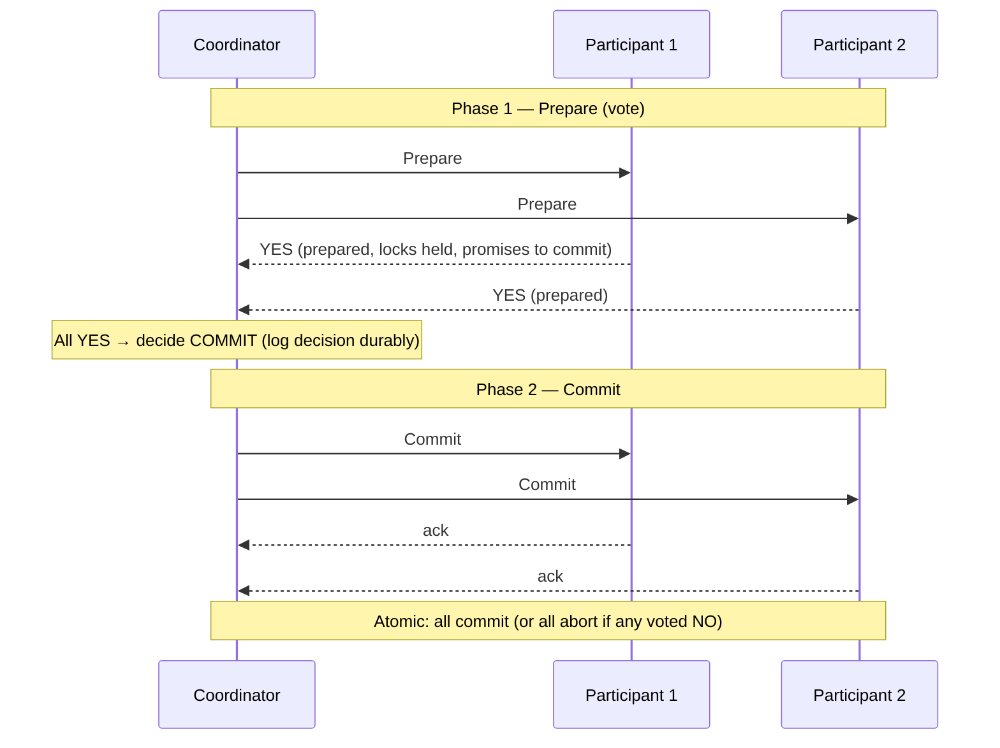
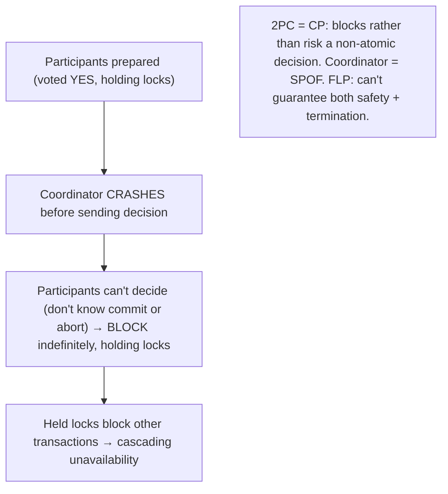

# Lesson 11.6 — Distributed Transactions: 2PC/3PC, Their Failure Modes

> Part 11: Fault Tolerance & Resilience · Difficulty: 🔴⚫
>
> **Prerequisites:** [5.2.1 ACID], [8.3.1 Consensus/FLP], [8.1.1 Partial Failure], [11.5 Idempotency], [10.7 CAP].
> **Unlocks:** [11.7 Sagas], [Part 12 Microservices Data], [Part 20 Capstone].

---

## 1. Learning Objectives

After this lesson you will be able to:

- Explain the **distributed atomic commit** problem — making a transaction spanning **multiple systems** either **all commit or all abort** — and why it's hard (partial failure — 8.1.1).
- Describe **Two-Phase Commit (2PC)**: the **prepare** (voting) and **commit** phases, the **coordinator** role, and how it achieves atomicity across participants.
- Explain **2PC's fatal failure mode**: the **blocking problem** — if the coordinator crashes after prepare but before commit, participants are **blocked** (holding locks, unable to decide) — and why 2PC is a **CP, availability-sacrificing** protocol.
- Understand **3PC** (adds a phase to reduce blocking, but assumptions make it impractical) and why modern systems **avoid distributed transactions**, preferring **Sagas** (11.7) or single-system transactions.

---

## 2. Motivation — Making "all or nothing" work across systems

ACID transactions (5.2.1) give **atomicity** — all-or-nothing — **within a single database**. But distributed systems constantly need atomicity **across multiple systems**: transfer money between accounts in **two different databases**, book a flight **and** a hotel in **two services**, update an order **and** decrement inventory in **two microservices** (Part 12). The problem: how do you make a transaction spanning **N independent systems** either **all commit or all abort** — never a partial state where some committed and some didn't (money debited but not credited)? This is the **distributed atomic commit** problem, and it's genuinely hard because of **partial failure** (8.1.1) — any participant or the coordinator can crash mid-transaction, the network can drop messages, and you must still reach a consistent all-or-nothing decision.

The classic solution is **Two-Phase Commit (2PC)** — a protocol where a **coordinator** first asks all participants to **prepare** (vote to commit, promising they *can*), and only if **all** vote yes does it tell them to **commit** (otherwise **abort**). 2PC does achieve atomic commit across systems — and it's what XA transactions and distributed-database commits use. But 2PC has a **fatal flaw**: the **blocking problem** — if the coordinator **crashes after participants have prepared but before it sends the commit/abort decision**, the participants are **stuck** — they've promised to commit (holding locks — 5.2.5), but they **can't decide** on their own (they don't know the coordinator's decision), so they **block indefinitely**, holding resources, unable to proceed or abort. This makes 2PC a **CP, availability-sacrificing** protocol (10.7) that's fragile and blocks under failure — which is *why* modern distributed systems, especially microservices (Part 12), **largely avoid distributed transactions** in favor of **Sagas** (11.7 — eventual consistency with compensations) or keeping transactions within a single system. This lesson develops the atomic-commit problem, 2PC and its blocking failure, 3PC's (impractical) attempt to fix it, and the pragmatic conclusion: **avoid distributed transactions when you can.**

---

## 3. Theory — From first principles

### 3.1 The distributed atomic commit problem

`[CS]` **Atomic commit across multiple systems:** a transaction spanning **N independent participants** (databases/services) must reach an **all-or-nothing** outcome — **all** participants commit, or **all** abort — **never partial** (some committed, some aborted → inconsistent, e.g., money debited from account A but not credited to account B) `[CS]`. This is the distributed version of ACID **atomicity** (5.2.1), and it's hard because:
- **Partial failure (8.1.1):** any participant or the coordinator can **crash** mid-protocol; messages can be **lost/delayed**; you can't tell crashed from slow (8.1.3).
- **No shared state:** the participants are independent systems with no shared transaction manager (unlike a single DB's internal atomicity — 5.3.1).
- **Must agree despite failures:** this is essentially a **consensus** problem (8.3.1) — agree on commit-or-abort — subject to **FLP** (can't guarantee termination under async — 8.3.1) → hence blocking (§3.4).

### 3.2 Two-Phase Commit (2PC) — the protocol

`[CS]` **2PC** uses a **coordinator** (transaction manager) and **participants** (the systems in the transaction). Two phases:

**Phase 1 — Prepare (voting):**
1. The coordinator sends **`Prepare`** to all participants: "can you commit this transaction?"
2. Each participant does the work **provisionally** (writes to its WAL — 5.3.1, acquires locks — 5.2.5), and if it **can** commit, **votes YES** (and **promises** it *will* commit if told to — it must be able to commit even after a crash, so it durably logs the prepared state). If it **can't** (constraint violation, error), it **votes NO**.
3. Once a participant votes YES, it is **prepared** — it has **given up its autonomy** (it can no longer unilaterally abort; it must await the coordinator's decision, holding locks).

**Phase 2 — Commit/Abort:**
4. The coordinator collects votes. If **ALL** voted YES → it decides **COMMIT** and sends `Commit` to all; if **ANY** voted NO (or timed out) → it decides **ABORT** and sends `Abort` to all. The coordinator **durably logs its decision** before sending (so it can recover).
5. Participants **commit** (or abort) as told, release locks, and **acknowledge**. The transaction is complete.

**Atomicity:** because a participant only commits after **all** voted YES and the coordinator decided commit, either **all** commit or **all** abort — the all-or-nothing guarantee (§3.1). This is what XA/distributed-DB transactions implement.

### 3.3 Why 2PC works (when nothing fails)

`[CS]` The guarantee: **no participant commits until the coordinator knows all can commit.** Phase 1 ensures every participant has **promised** it can commit (durably prepared). Only then does the coordinator decide commit; a single NO → global abort. So there's **no partial commit** — the prepare phase is the safety mechanism (like a "point of no return" only crossed when everyone's ready). When nothing fails, 2PC cleanly achieves atomic commit across systems.

### 3.4 The blocking problem — 2PC's fatal flaw

`[CS]` 2PC's **critical weakness**: if the **coordinator crashes after participants have prepared (voted YES) but before sending the commit/abort decision**, the participants are **stuck (blocked)** `[CS]`:
- The prepared participants have **promised to commit** and are **holding locks** (5.2.5) — but they **don't know the decision** (the coordinator crashed before telling them, and they can't tell if it decided commit or abort).
- They **cannot unilaterally decide** — committing might violate atomicity (maybe another participant voted NO and the coordinator decided abort); aborting might too (maybe the coordinator decided commit). So they must **wait for the coordinator to recover** — **blocked indefinitely**, holding locks, unable to proceed.
- **Consequences:** held locks block **other** transactions → cascading unavailability; the transaction hangs until the coordinator recovers (if ever). The **coordinator is a single point of failure** whose crash at the wrong moment **blocks the whole transaction**.
- **This is why 2PC is a CP, availability-sacrificing protocol (10.7):** it prioritizes consistency (atomicity) over availability — under coordinator failure, it **blocks rather than risk a wrong (non-atomic) decision**. And it can't fully escape this: the atomic-commit problem is a **consensus** problem (8.3.1), subject to **FLP** — you **can't guarantee** both safety and termination under async failures. 2PC chooses safety (no partial commit) and accepts blocking (no termination guarantee).

### 3.5 Other 2PC failure modes

`[CS]` Beyond coordinator-crash blocking:
- **Participant crashes before voting:** coordinator times out → decides **abort** (safe) — no blocking (the participant hadn't prepared).
- **Participant crashes after voting YES (prepared):** on recovery, it must **recover its prepared state** (from its WAL — 5.3.1) and **ask the coordinator** for the decision → then commit/abort accordingly. (Requires durable prepared-state logging.)
- **Participant blocked awaiting decision:** same as §3.4 — holds locks until the coordinator responds.
- **Coordinator recovery:** the coordinator logs its decision durably (§3.2), so on recovery it can **re-send** the decision to participants → the transaction completes (this is why the coordinator's decision log is critical). But between crash and recovery, participants **block**.
The fundamental issue remains: **2PC is synchronous, blocking, and coordinator-dependent** — held locks + potential indefinite blocking make it **fragile and unsuitable for high-availability or high-throughput** systems.

### 3.6 Three-Phase Commit (3PC) — the (impractical) fix

`[CS]` **3PC** adds a **third phase** to reduce blocking `[CS]`:
- It inserts a **"pre-commit"** phase between prepare and commit: after all vote YES, the coordinator sends **`PreCommit`** (everyone acknowledges they know the decision *will* be commit), and only then sends **`Commit`**. 
- **The goal:** if the coordinator crashes, participants that reached **pre-commit** can **safely commit on their own** (they know the decision was going to be commit) → **non-blocking** in more cases.
- **Why it's impractical** `[OPINION]`: 3PC's non-blocking guarantee relies on **synchronous-network / bounded-timeout assumptions** and **no network partitions** — assumptions distributed systems **can't** guarantee (8.1.1 — partitions happen). Under a **partition**, 3PC can produce **inconsistent decisions** (split-brain — different participants decide differently) — trading blocking for a **safety** risk, which is worse. So **3PC is rarely used in practice** — it adds complexity and latency (an extra round-trip) without a guarantee that holds under real (partition-prone) conditions. The lesson: you **can't cheaply escape** the atomic-commit/consensus tradeoff (FLP — 8.3.1).

### 3.7 Why modern systems avoid distributed transactions

`[BP]` The pragmatic conclusion, especially for microservices (Part 12) `[OPINION]`/`[CS]`:
- **2PC is blocking, fragile, and low-availability** (§3.4) — the coordinator is a SPOF, held locks hurt throughput/availability, and it's a **CP** protocol that blocks under failure. **3PC doesn't reliably fix it** (§3.6).
- **2PC also couples systems tightly** (all participants must support the protocol — XA — and be available together; it doesn't scale well or cross heterogeneous systems easily).
- **So modern distributed systems (especially microservices — Part 12) largely avoid distributed transactions**, preferring:
  - **Keep transactions within a single system** (a single database's ACID — 5.2.1) — design boundaries so a transaction doesn't span systems (the best option — avoid the problem).
  - **Sagas (11.7):** for transactions that *must* span services, use a **saga** — a sequence of **local** transactions with **compensating** transactions to undo on failure → **eventual consistency** (not atomic), but **available and non-blocking** (accepts intermediate inconsistency + compensation complexity). The dominant microservices approach.
  - **The outbox pattern (9.8):** atomic local DB write + reliable event → avoid cross-system dual writes without 2PC.
- **When 2PC is still used:** within tightly-coupled, co-located, high-consistency systems where blocking is acceptable (some distributed databases use 2PC internally across shards — often combined with consensus to avoid the blocking SPOF, e.g., Spanner uses Paxos + 2PC). But for **loosely-coupled microservices**, **avoid it** — use Sagas.
**The rule** `[BP]`: **prefer single-system transactions; when you must span systems, use Sagas (eventual consistency), not 2PC** — accept eventual consistency + compensation over 2PC's blocking fragility.

---

## 4. Visual Intuition

### 2PC protocol

### The blocking problem

---

## 5. Real-World Analogy

Imagine **coordinating a group purchase** where **everyone must buy in or nobody does** (all-or-nothing) — say, chipping in for a shared gift, where you can't buy half a gift.

- **The problem:** three friends must **each** commit their share, and the gift is only bought if **all three** are in — never a partial state where two paid and one didn't (money stuck).
- **2PC — the organizer (coordinator):** the organizer first **asks each friend "are you in? (can you commit your share?)"** (Phase 1 — prepare). Each friend who says "**yes**" **sets aside their money** (holds it, promising to pay — prepared, locks held) and **waits** for the organizer's final word. Once the organizer hears **all three say yes**, they announce "**we're buying it — pay up!**" (Phase 2 — commit); if **anyone** said no, "**it's off — keep your money**" (abort). Either all pay or none — atomic.
- **The blocking problem — the organizer vanishes:** all three friends have said yes and **set their money aside** (prepared), waiting for the final word — and then the **organizer's phone dies** (coordinator crashes before announcing the decision). Now the three friends are **stuck**: they've **promised** to pay and are **holding their money aside** (locks held), but they **don't know** if the deal is on or off — and they **can't decide on their own** (paying might be wrong if someone actually backed out; not paying might be wrong if it was going through). So they **wait indefinitely**, money frozen, unable to do anything else with it (their held money can't be used for other purchases — cascading unavailability). Only when the organizer's phone comes back and they announce the decision can it resolve. **The organizer is a single point of failure whose disappearance freezes everyone.**
- **Why modern systems avoid this:** it's fragile and freezes people. So instead of this rigid all-or-nothing-with-a-single-organizer approach, groups often use a **saga-style** approach (11.7): **each person just buys their part independently, and if the deal falls through, whoever already paid gets a refund (compensation)** — nobody's money is frozen waiting on an organizer; it's more available, at the cost of a temporary in-between state (someone paid before the refund).

---

## 6. Industry Example

- **XA distributed transactions / 2PC** `[CONV]`: the XA standard and JTA implement 2PC across databases/resource managers — used in tightly-coupled enterprise systems; known for blocking and poor scalability (§3.2/3.4). *(Representative.)*
- **2PC's blocking = why microservices avoid it** `[OPINION]`: the microservices community strongly discourages distributed transactions across services due to blocking/coupling — preferring Sagas (§3.7, 11.7, Part 12). *(Representative.)*
- **Spanner: Paxos + 2PC** `[EMERGING]`: Spanner uses 2PC across shards but each participant is a **Paxos group** (8.3.2), so the coordinator/participants are **fault-tolerant** (no single-point blocking) — combining 2PC atomicity with consensus availability (§3.7, 8.2.4). *(Representative.)*
- **3PC rarely used** `[CS]`: 3PC's non-blocking guarantee fails under partitions, so it's largely academic/impractical (§3.6). *(Representative.)*
- **Sagas + outbox as the alternative** `[BP]`: microservices use Sagas (11.7) and the outbox pattern (9.8) instead of 2PC for cross-service consistency (§3.7). *(Representative.)*

---

## 7. Implementation Details — distributed atomicity in practice

- **Prefer to avoid distributed transactions** (§3.7): design service/data boundaries so a transaction stays **within a single system** (single-DB ACID — 5.2.1) — the best option (avoid the problem) `[BP]`.
- **When a transaction must span systems, use Sagas** (11.7) — local transactions + compensations → eventual consistency, available, non-blocking — not 2PC, for loosely-coupled microservices (§3.7).
- **Use the outbox pattern** (9.8) to avoid cross-system dual writes (atomic local write + reliable event) without 2PC (§3.7).
- **If you must use 2PC** (tightly-coupled, co-located, high-consistency, blocking-tolerant systems): ensure the **coordinator is fault-tolerant** (replicated / backed by consensus — like Spanner's Paxos+2PC — §3.7) to avoid single-point blocking, **durably log** the coordinator's decision and participants' prepared state (5.3.1), and accept the held-locks/blocking tradeoff (§3.4/3.5).
- **Don't use 3PC** — its non-blocking guarantee doesn't hold under partitions (§3.6).
- **Make participant operations recoverable** — a crashed participant recovers its prepared state and queries the coordinator (§3.5).
- **Accept the CAP reality** — 2PC is CP (blocks under failure — 10.7); if you need availability, use Sagas (eventual consistency) (§3.4/3.7).

---

## 8. Advantages (of 2PC, where applicable)

- **Atomic commit across systems** — all-or-nothing across multiple databases/participants (§3.2) — true distributed atomicity.
- **Strong consistency** — no partial commits; immediate consistency (unlike Sagas' eventual — 11.7).
- **Standard & supported** — XA/JTA; works within distributed databases (§6).
- **Simple mental model** — a clean all-or-nothing across systems (when nothing fails).
- **Fault-tolerant when coordinator is replicated** (Paxos+2PC — Spanner) — avoids the single-point blocking (§3.7).

---

## 9. Disadvantages / hard realities

- **The blocking problem** — coordinator crash after prepare → participants block indefinitely, holding locks (the fatal flaw — §3.4).
- **Coordinator is a SPOF** — its failure blocks the whole transaction (unless replicated) (§3.4).
- **CP / low availability** — blocks under failure (chooses consistency over availability — 10.7) (§3.4).
- **Held locks hurt throughput/availability** — prepared participants hold locks until the decision → contention, reduced concurrency (§3.4/3.5, 5.2.5).
- **Tight coupling / poor scalability** — all participants must support the protocol and be available together; doesn't scale or cross heterogeneous systems well (§3.7).
- **Latency** — synchronous multi-round protocol (worse across regions).
- **3PC doesn't fix it** — its guarantee fails under partitions (§3.6).

---

## 10. When NOT to use 2PC / limits

- **Loosely-coupled microservices** — avoid 2PC (blocking, coupling); use **Sagas** (11.7) (§3.7, Part 12) — the main case.
- **High-availability / high-throughput systems** — 2PC's blocking + held locks are unacceptable (§3.4).
- **Across heterogeneous / geographically-distributed systems** — coupling + latency + partition-induced blocking (§3.7).
- **When eventual consistency is acceptable** — use Sagas (available, non-blocking) instead (§3.7, 11.7).
- **3PC** — essentially never (unreliable under partitions — §3.6).
- **When you can keep the transaction in one system** — do that instead (avoid the problem) (§3.7).

---

## 11. Common Mistakes

1. **Using 2PC across microservices** → blocking, tight coupling, low availability (use Sagas — §3.7, 11.7).
2. **Coordinator not fault-tolerant (single point)** → its crash blocks all transactions (replicate it — §3.4/3.7).
3. **Not durably logging the coordinator's decision / prepared state** → can't recover → permanent blocking or inconsistency (§3.5, 5.3.1).
4. **Using 3PC expecting non-blocking** → fails under partitions (inconsistent decisions) (§3.6).
5. **Ignoring held-lock contention** → prepared transactions hold locks, killing throughput (§3.4/3.5).
6. **Not considering Sagas** for cross-system transactions → forcing 2PC where eventual consistency would be better (§3.7).
7. **Assuming distributed transactions are as easy as single-DB ACID** → surprised by blocking/coupling/availability cost (§3.1/3.4).

---

## 12. Interview Questions

**🟢 Easy**
- What problem does 2PC solve, and why is it hard?
- Describe the two phases of 2PC.

**🟡 Medium**
- What is 2PC's blocking problem, and why does it make 2PC a CP (availability-sacrificing) protocol?
- Why is the coordinator a single point of failure, and how does that block participants?

**🔴 Hard**
- Walk through a coordinator crash after prepare: why can't the prepared participants decide on their own, and what happens? How does durable logging + a fault-tolerant coordinator help?
- Why doesn't 3PC reliably solve the blocking problem? (Partition assumptions.) Tie to FLP (8.3.1).

**⚫ Staff+**
- A microservices system needs an "order + payment + inventory" operation to be atomic. Compare 2PC vs Sagas (11.7): analyze 2PC's blocking/coupling/availability problems and why Sagas (eventual consistency + compensations) are preferred — and when 2PC (or Paxos+2PC like Spanner) would still be appropriate.
- Explain how Spanner combines Paxos and 2PC to get distributed atomicity without the single-point-blocking flaw, and contrast with naive 2PC and with Sagas — covering consistency, availability, and complexity tradeoffs.

---

## 13. Production Pitfalls

- **Coordinator-crash blocking:** the coordinator dies after participants prepared → they block indefinitely holding locks → cascading unavailability (§3.4) — 2PC's signature failure.
- **Held-lock contention:** long-running 2PC transactions hold locks across systems → throughput collapse, deadlocks (§3.4/3.5, 5.2.5).
- **2PC across microservices → outages:** using distributed transactions across loosely-coupled services → coupling + blocking → poor availability (§3.7, Part 12).
- **3PC inconsistency under partition:** relying on 3PC's non-blocking guarantee → a partition causes split-brain-like inconsistent commit decisions (§3.6).
- **Lost coordinator decision:** the coordinator didn't durably log its decision → can't recover → transactions stuck or inconsistent (§3.5).
- **Non-fault-tolerant coordinator SPOF:** a single coordinator instance whose failure blocks all in-flight transactions (§3.4).

---

## 14. Optimization Techniques

> *Mostly "avoid or make fault-tolerant."*

- **Avoid distributed transactions** — keep transactions in a single system (single-DB ACID) where possible (§3.7) `[BP]`.
- **Use Sagas (11.7) for cross-service transactions** — available, non-blocking, eventual consistency (§3.7).
- **Outbox pattern (9.8)** to avoid cross-system dual writes without 2PC (§3.7).
- **If 2PC is required, make the coordinator fault-tolerant** (replicate / back with consensus — Paxos+2PC like Spanner) to avoid single-point blocking (§3.7, 8.2.4).
- **Durably log decisions + prepared state** (WAL — 5.3.1) for recovery (§3.5).
- **Minimize the transaction's lock-holding window** (short transactions — 5.2.5) to reduce blocking impact (§3.4).
- **Never use 3PC** (unreliable under partitions — §3.6).

---

## 15. Summary

The **distributed atomic commit** problem — making a transaction spanning **multiple independent systems** either **all commit or all abort** (never partial — money debited but not credited) — is the distributed version of ACID atomicity (5.2.1), hard because of **partial failure** (8.1.1: any participant or coordinator can crash, messages drop) and because it's essentially a **consensus** problem (8.3.1) subject to **FLP**. **Two-Phase Commit (2PC)** solves it with a **coordinator** and two phases: **Phase 1 (Prepare/vote)** — the coordinator asks all participants "can you commit?"; each does the work provisionally (durably logs, holds locks — 5.2.5) and **votes YES** (promising it *will* commit, giving up its autonomy) or NO; **Phase 2 (Commit/Abort)** — if **all** voted YES the coordinator decides **commit** (durably logging the decision first) and tells all to commit, else **abort**. This gives atomicity: no participant commits until the coordinator knows all can. But 2PC has a **fatal flaw — the blocking problem**: if the **coordinator crashes after participants prepared but before sending the decision**, the prepared participants are **stuck** — they've promised to commit and are **holding locks**, but they **can't decide on their own** (they don't know if the decision was commit or abort), so they **block indefinitely**, holding locks (which block *other* transactions → cascading unavailability). The **coordinator is a single point of failure**, and 2PC is thus a **CP, availability-sacrificing** protocol (10.7) that **blocks rather than risk a non-atomic decision** — and it can't escape this (FLP: can't guarantee both safety and termination under async). **3PC** adds a "pre-commit" phase so participants can sometimes commit on their own if the coordinator crashes, but its non-blocking guarantee relies on **synchronous-network / no-partition assumptions** that **don't hold** in reality — under a partition 3PC can produce **inconsistent decisions**, so it's **impractical and rarely used**. Because 2PC is **blocking, fragile, low-availability, tightly-coupling, and doesn't scale well** (and 3PC doesn't fix it), **modern distributed systems — especially microservices (Part 12) — largely avoid distributed transactions**, preferring to **keep transactions within a single system** (single-DB ACID — the best option, avoid the problem) or, when a transaction *must* span services, use **Sagas** (11.7 — a sequence of local transactions with **compensating** transactions → **eventual consistency**, but **available and non-blocking**) and the **outbox pattern** (9.8). 2PC is still used **within tightly-coupled systems** and inside distributed databases — often combined with **consensus** (Spanner's **Paxos+2PC**) to make the coordinator/participants **fault-tolerant** and avoid the single-point-blocking flaw. **The rule: prefer single-system transactions; when you must span systems, use Sagas (eventual consistency), not 2PC** — accepting eventual consistency + compensation complexity over 2PC's blocking fragility.

---

## 16. Revision Notes (flashcard-ready)

- **Q:** Distributed atomic commit problem? **A:** Make a transaction across N independent systems all-commit-or-all-abort (never partial), despite partial failure.
- **Q:** 2PC phases? **A:** Phase 1 Prepare (participants vote YES/NO, prepared = hold locks + promise); Phase 2 Commit/Abort (all YES → commit, else abort).
- **Q:** How does 2PC ensure atomicity? **A:** No one commits until the coordinator knows all voted YES; any NO → global abort.
- **Q:** 2PC's fatal flaw? **A:** Blocking — coordinator crashes after prepare, before decision → prepared participants block indefinitely holding locks (can't decide alone).
- **Q:** Why can't prepared participants decide alone? **A:** They don't know if the decision was commit or abort; deciding wrong breaks atomicity → must wait for the coordinator.
- **Q:** 2PC + CAP? **A:** CP — blocks (sacrifices availability) rather than risk a non-atomic decision; coordinator is a SPOF.
- **Q:** 3PC? **A:** Adds a pre-commit phase to reduce blocking, but relies on no-partition/synchronous assumptions → inconsistent under partitions → impractical.
- **Q:** Why do microservices avoid 2PC? **A:** Blocking, tight coupling, low availability, poor scalability → use Sagas instead.
- **Q:** Alternatives to 2PC? **A:** Single-system transactions (best), Sagas (eventual consistency + compensations — 11.7), outbox pattern (9.8).
- **Q:** When is 2PC OK? **A:** Tightly-coupled/co-located high-consistency systems, or with a fault-tolerant coordinator (Paxos+2PC like Spanner).

---

## 17. Further Reading + Knowledge-Graph Links

**Within this platform**
- **Builds on:** [5.2.1 ACID] (atomicity within one DB), [8.3.1 Consensus/FLP] (atomic commit = consensus), [8.1.1 Partial Failure], [11.5 Idempotency], [5.2.5 Locking], [10.7 CAP].
- **Next:** [11.7 Sagas] (the microservices alternative — eventual consistency + compensations). 
- **Enables:** [Part 12 Microservices Data] (avoid distributed transactions), [Part 20 Capstone] (cross-account transactions via Saga), [8.2.4 Spanner Paxos+2PC].

**Foundational texts (synthesized)**
- Gray & Reuter, *Transaction Processing* — 2PC/3PC (concept, synthesized).
- Kleppmann, *Designing Data-Intensive Applications* — distributed transactions, 2PC, blocking, XA (synthesized).
- Corbett et al., *Spanner* — Paxos + 2PC (concept, synthesized).

**Concept tags:** `[CS]` distributed atomic commit, 2PC (prepare/commit), blocking problem (coordinator crash after prepare), coordinator SPOF, 2PC=CP, 3PC impracticality · `[CONV]` XA/JTA, Spanner Paxos+2PC · `[BP]` avoid distributed transactions, single-system or Sagas, outbox, fault-tolerant coordinator if 2PC · `[OPINION]` microservices avoid 2PC, 3PC is impractical.
