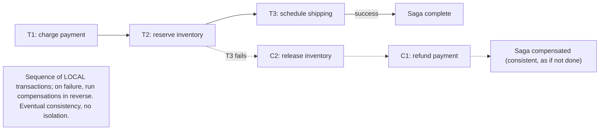
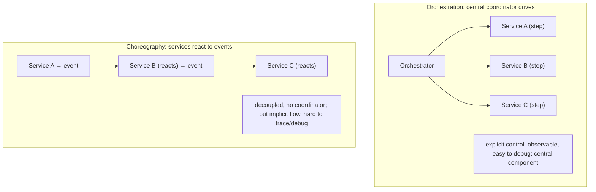

# Lesson 11.7 — Sagas (Orchestration vs Choreography), Compensating Transactions

> Part 11: Fault Tolerance & Resilience · Difficulty: 🔴
>
> **Prerequisites:** [11.6 Distributed Transactions/2PC], [11.5 Idempotency], [9.8 Outbox/CDC], [2.2.4 Event-Driven], [10.5 Eventual Consistency].
> **Unlocks:** [Part 12 Microservices Data], [Part 20 Capstone], [Part 13 Cloud Native].

---

## 1. Learning Objectives

After this lesson you will be able to:

- Explain the **Saga pattern** — a cross-service "transaction" as a **sequence of local transactions**, each with a **compensating transaction** to undo it on failure — and why it replaces 2PC (11.6) for microservices.
- Distinguish **orchestration** (a central coordinator drives the steps) from **choreography** (services react to each other's events) — with their tradeoffs.
- Design **compensating transactions** (semantic undo) and reason about the **caveats**: no isolation (intermediate states are visible), eventual consistency, idempotency (11.5), and unrecoverable steps.
- Choose sagas (and orchestration vs choreography) for a cross-service workflow, and handle failures/retries correctly.

---

## 2. Motivation — Cross-service transactions without 2PC

2PC (11.6) gives atomic cross-system transactions but is **blocking, fragile, and low-availability** — unacceptable for loosely-coupled microservices (Part 12). Yet microservices constantly need multi-service operations to be **consistent**: place an order (which must charge payment, reserve inventory, and schedule shipping across **three services**, each with its **own database** — database-per-service). If the payment succeeds but inventory reservation fails, you can't leave the customer charged for an unfulfillable order. So how do you get "all-or-nothing-ish" across services **without** 2PC's blocking? The answer is the **Saga pattern**: model the cross-service operation as a **sequence of local transactions**, each in one service's own database (fast, non-blocking, ACID locally — 5.2.1), and if a later step **fails**, run **compensating transactions** that **semantically undo** the earlier completed steps (refund the payment, release the inventory) → the system ends in a consistent state, just via **eventual consistency** rather than atomic all-or-nothing.

Sagas are **the** dominant pattern for cross-service consistency in microservices, and the natural home of much of Part 11's toolkit: **compensations** must be **idempotent** (11.5 — they may be retried), the steps are driven by **events/messaging** (Part 9) often via the **outbox pattern** (9.8), and the whole thing embraces **eventual consistency** (10.5). This lesson develops the saga model, the two coordination styles — **orchestration** (a central orchestrator explicitly drives each step and issues compensations — clear but centralized) vs **choreography** (each service publishes events that trigger the next service's local transaction — decoupled but harder to trace) — the design of **compensating transactions**, and the crucial **caveats** (sagas have **no isolation** — intermediate states are visible, so you must handle anomalies; some steps can't be undone; idempotency is required). Sagas are how real microservice systems (and the capstone — Part 20) achieve cross-service consistency, trading 2PC's atomicity/blocking for availability + eventual consistency + compensation complexity.

---

## 3. Theory — From first principles

### 3.1 The saga concept

`[CS]` A **Saga** is a way to manage a transaction that **spans multiple services**, modeled as a **sequence of local transactions** `[CS]`:
- The cross-service operation is broken into **steps**, each a **local ACID transaction** in one service's own database (5.2.1 — fast, non-blocking, no distributed locks).
- Each step **T1, T2, …, Tn** has a corresponding **compensating transaction C1, C2, …, Cn** that **semantically undoes** it.
- **Happy path:** execute T1, T2, …, Tn in order → all succeed → the saga completes.
- **Failure path:** if step **Tk fails**, run the **compensating transactions Ck-1, …, C1** (in reverse) to **undo** the already-completed steps T1…Tk-1 → the system returns to a **consistent state** (as if the operation didn't happen).
- **Result:** the multi-service operation is **atomic-ish** (either it fully completes, or it's fully compensated) — but via **eventual consistency** (there are **intermediate states** where some steps are done and others aren't) and **no isolation** (those intermediate states are **visible** — §3.5), rather than 2PC's atomic, isolated all-or-nothing.

### 3.2 Why sagas over 2PC

`[BP]` Sagas trade 2PC's properties for microservice-friendly ones (11.6 §3.7):
- **No blocking / no distributed locks:** each step is a **local** transaction that commits immediately (releasing its locks) → **no held locks across services**, **no coordinator-crash blocking** (11.6 §3.4). Highly available.
- **Loose coupling:** services interact via **events/messages** (Part 9), not a synchronous 2PC protocol → services stay independent, can be down temporarily (the saga waits/retries).
- **Scalable & available:** no synchronous coordination across all participants; each step proceeds independently.
- **The cost:** **eventual consistency** (not atomic — intermediate states exist), **no isolation** (intermediate states visible — §3.5), and **compensation complexity** (you must design semantic undos and handle their failures). Sagas accept these to **avoid 2PC's blocking/fragility** — the right trade for loosely-coupled microservices.

### 3.3 Compensating transactions — semantic undo

`[CS]` A **compensating transaction** **semantically undoes** a completed step — it's **not** a rollback (the local transaction already committed; you can't roll it back), but a **new transaction that reverses the effect** `[CS]`:
- **Examples:** compensate "charged $50" with "**refund** $50"; compensate "reserved inventory" with "**release** the reservation"; compensate "created a booking" with "**cancel** the booking."
- **Semantic, not literal:** the compensation restores a **consistent** state, but not necessarily the **exact prior** state — a refund is visible in the transaction history (the charge and refund both happened), unlike a rollback that erases the charge. It's **forward recovery** (do something to fix it), not backward (undo as if nothing happened).
- **Must be idempotent (11.5):** compensations may be **retried** (the saga's failure handling itself can fail/retry) → applying a compensation twice must be safe (refunding twice would be wrong) → use idempotency (11.5).
- **Design requirement:** **every step that can be followed by a step that might fail needs a compensation.** Designing correct compensations is the core saga design work.

### 3.4 Orchestration vs Choreography — the two coordination styles

`[CS]` Sagas coordinate their steps in one of two ways:

**Orchestration (centralized):** a **central orchestrator** (a saga coordinator/state machine) **explicitly drives** the saga — it calls each service's step in order, tracks progress, and on failure **issues the compensating transactions**:
- **Pros:** **clear, explicit** control flow (the orchestrator holds the whole saga logic); easy to **understand, monitor, and debug** (one place shows the saga's state); centralized failure handling / compensation logic; easier to change the workflow.
- **Cons:** the orchestrator is a **central component** (more coupling to it; a potential bottleneck/SPOF — make it fault-tolerant); services must expose commands the orchestrator calls. 
- **Use when:** complex workflows with many steps/conditional logic, where explicit control and observability matter (the **more common** choice for non-trivial sagas).

**Choreography (decentralized / event-driven):** **no central coordinator** — each service **publishes events** when it completes its step, and other services **subscribe** and react by running their own local transaction (and publishing their own events):
- **Pros:** **decoupled** (no central orchestrator; services only know events — 2.2.4); each service is autonomous; no single coordinator SPOF.
- **Cons:** the workflow is **implicit and distributed** (spread across event handlers — hard to see the whole saga, hard to **trace/debug** — "where are we in the saga?"); **cyclic dependencies** and complex flows get tangled; **compensation logic is distributed** (each service must handle rollback events). 
- **Use when:** simple sagas with few steps and clear event flows; where decoupling is paramount.

**Rule of thumb** `[BP]`: **orchestration for complex workflows** (clarity, observability, control); **choreography for simple, loosely-coupled flows** (decoupling). Many systems use orchestration for non-trivial sagas because the **observability and explicit control** are worth the central component.

### 3.5 The caveats — no isolation, eventual consistency, unrecoverable steps

`[CS]` Sagas are **not ACID** — critical caveats you must handle:
- **No isolation (the big one):** unlike a database transaction (5.2.1 — I), a saga's **intermediate states are visible** to other operations. Between T1 and Tn, other transactions can **see and act on** the partial state (e.g., after "reserve inventory" but before the saga completes, another operation sees the reduced inventory; if the saga later compensates, that other operation saw a state that got undone). This can cause **anomalies** (lost updates, dirty reads — 5.2.3 — across the saga). **Countermeasures:** **semantic locks** (mark records as "pending/in-saga" so others treat them specially), **commutative updates** (order-independent — like CRDTs — 10.4), **pessimistic/reordering** techniques, or designing steps so intermediate visibility is acceptable. **You must reason about what other operations see during the saga.**
- **Eventual consistency (10.5):** the system is **temporarily inconsistent** during the saga (some steps done, others not) and only **eventually** consistent (when the saga completes or fully compensates). Callers/readers may see the in-between state.
- **Compensations may not fully undo:** some effects are **hard or impossible to compensate** — you can refund a charge, but you **can't un-send an email**, un-ship a package easily, or un-launch a missile. For **unrecoverable steps**, order them **last** (so earlier compensable steps run first and failures happen before the irreversible step), or use **retry-until-success** (make the step retry rather than compensate), or accept the effect.
- **Idempotency required (11.5):** steps and compensations may be retried → must be idempotent (§3.3).
- **Failure of compensations:** a compensation itself can fail → must be **retriable** (idempotent, retry with backoff) — the saga's failure handling must be robust (a compensation that can't complete leaves the saga stuck — needs monitoring/alerting/manual intervention).

### 3.6 Ordering steps for compensability

`[BP]` A key design technique: **order saga steps so failures happen before irreversible steps** `[CS]`:
- Put **easily-compensable / reversible** steps **first** (reserve inventory — releasable, authorize payment — voidable) and **irreversible / hard-to-undo** steps **last** (ship the package, send the email, capture the payment).
- Use **retriable steps** (that retry until they succeed rather than compensate) for steps that must eventually happen, and **compensable steps** (that can be undone) for the rest — a saga is often a sequence of **compensable steps, then a "pivot" step (the point of no return), then retriable steps**.
- This way, if the saga is going to fail, it **fails during the compensable prefix** (before the irreversible pivot) → clean compensation; once past the pivot, it **retries forward** to completion (no undo needed). Structuring the saga around the **pivot** (the irreversible point) is a core design skill.

### 3.7 Sagas in the microservices toolkit

`[CS]` Sagas connect to the rest of Part 11 and the microservices patterns:
- **Event-driven (2.2.4) + messaging (Part 9):** saga steps are triggered by **events/commands** over a broker/log; choreography is inherently event-driven, and orchestration often uses messaging for the orchestrator↔service commands.
- **Outbox pattern (9.8):** each step's **local transaction + event emission** should be **atomic** — use the **outbox** (write the state change + the "step done" event in one local transaction, publish reliably) to avoid dual-write inconsistency (9.8). This is how a saga step reliably triggers the next.
- **Idempotency (11.5) + at-least-once (9.4):** steps/compensations are delivered at-least-once → must be idempotent.
- **Eventual consistency (10.5):** sagas are the practical embodiment of "cross-service operations are eventually consistent, not atomic" — accept the intermediate inconsistency + compensations.
- **Database-per-service (Part 12):** sagas exist *because* each microservice has its own database (no shared transaction) — they're the answer to "how do I keep data consistent across service databases without 2PC."
Sagas are thus the **integration point** of eventual consistency (10.5), messaging/outbox (9/9.8), idempotency (11.5), and microservice data management (Part 12) — the standard cross-service consistency mechanism.

---

## 4. Visual Intuition

### Saga: steps + compensations

### Orchestration vs Choreography

---

## 5. Real-World Analogy

Imagine booking a **vacation package** across three separate companies: an **airline**, a **hotel**, and a **car rental** — each with its own booking system (database-per-service), and you want the whole trip to succeed or be cleanly undone (not end up with a flight but no hotel).

- **Why not 2PC:** you *could* try to make all three "hold everything and wait for a final go-ahead from a central organizer" (2PC) — but if the organizer disappears mid-process, all three are **stuck holding your reservation** indefinitely (blocking — 11.6). Impractical across independent companies.
- **The saga way:** you book them **one at a time** — first the **flight** (a complete, committed booking), then the **hotel**, then the **car**. Each booking is a **local transaction** that fully completes (no holding/blocking). If the **car rental fails** (sold out), you run **compensations in reverse**: **cancel the hotel** (C2) and **cancel the flight** (C1) → you're back to a consistent state (no trip), just via **cancellations** rather than a magic atomic undo.
- **Compensation ≠ rollback:** cancelling the flight is a **new action** (a cancellation) — the booking-and-cancellation both happened (and might show a cancellation fee) — it's a **semantic undo** (restore consistency), not erasing history as if you never booked.
- **Orchestration vs choreography:** *orchestration* is like using a **travel agent** who explicitly books each piece in order and, if something fails, personally cancels the earlier bookings — **one person sees the whole trip's status** (clear, easy to track). *Choreography* is like each company **automatically triggering the next**: booking the flight **emails** the hotel to book, which **emails** the car company — no central agent, but **no one sees the whole picture** (if it gets stuck, "where are we?" is hard to answer).
- **No isolation (the catch):** between booking the flight and finishing the car, someone else browsing might see **one fewer seat** on that flight (your intermediate booking is **visible**) — and if your saga later cancels, that seat comes back, but they briefly saw a state that got undone. You handle this by marking things "**pending**" (semantic locks) or accepting the brief visibility.
- **Irreversible steps last:** you'd book the **refundable/cancellable** things first (flight, hotel) and only do the **non-refundable** thing (buy travel insurance, or actually board the plane) **last** — so if the trip falls apart, it fails **before** the irreversible step, and you can cleanly cancel the rest.

---

## 6. Industry Example

- **Saga pattern in microservices** `[CONV]`: the standard pattern for cross-service transactions (order + payment + inventory + shipping) with database-per-service — replacing 2PC (§3.1/3.2, Part 12, *Microservices Patterns* lineage). *(Representative.)*
- **Orchestration frameworks** `[CONV]`: workflow/orchestration engines (Temporal, Camunda, AWS Step Functions, Netflix Conductor) implement orchestrated sagas with explicit state machines, retries, and compensations (§3.4). *(Representative.)*
- **Choreography via events** `[CONV]`: event-driven sagas where services react to each other's domain events over Kafka (2.2.4/Part 9), often with the outbox pattern (9.8) for reliable event emission (§3.4/3.7). *(Representative.)*
- **Compensating transactions** `[CONV]`: refund (compensate charge), release-reservation (compensate reserve), cancel-booking (compensate book) — semantic undos (§3.3). *(Representative.)*
- **Pivot/irreversible-step ordering** `[BP]`: structuring sagas as compensable steps → pivot → retriable steps (irreversible last) (§3.6). *(Representative.)*

---

## 7. Implementation Details — designing sagas

- **Model the cross-service operation as a sequence of local transactions, each with a compensation** (§3.1/3.3) — use sagas instead of 2PC for loosely-coupled services (§3.2, 11.6) `[BP]`.
- **Choose orchestration vs choreography** (§3.4): **orchestration** (central coordinator/state machine — Temporal/Step Functions) for **complex workflows** (clarity, observability, control); **choreography** (event-driven) for **simple, decoupled** flows — most non-trivial sagas benefit from orchestration.
- **Design idempotent steps and compensations** (11.5) — both may be retried (at-least-once — 9.4); compensating twice must be safe (§3.3/3.5).
- **Order steps for compensability** (§3.6): compensable/reversible steps first, irreversible "pivot" last; use retriable steps for must-happen actions after the pivot.
- **Handle no-isolation anomalies** (§3.5): use **semantic locks** ("pending/in-saga" flags), commutative updates, or design so intermediate visibility is acceptable — reason about what others see during the saga.
- **Use the outbox pattern** (9.8) for each step's atomic local-transaction + reliable-event-emission (avoid dual writes); drive steps via messaging (Part 9).
- **Make the orchestrator fault-tolerant** (persist saga state durably — a workflow engine does this) so a coordinator crash doesn't lose the saga (§3.4).
- **Monitor stuck sagas** — a compensation that can't complete leaves the saga stuck → alert + manual intervention path (§3.5, Part 14).
- **Accept eventual consistency** (10.5) — callers see intermediate states; design the UX/contracts accordingly (§3.2/3.5).

---

## 8. Advantages

- **No blocking / no distributed locks** — each step is a local transaction; highly available (§3.2) — the key win over 2PC.
- **Loose coupling** — services interact via events/commands, stay independent (§3.2/3.4, Part 12).
- **Scalable** — no synchronous cross-service coordination; steps proceed independently (§3.2).
- **Cross-service consistency** — achieves atomic-ish outcomes (complete or fully compensated) via eventual consistency (§3.1).
- **Fits microservices** — the answer to database-per-service consistency without 2PC (§3.7, Part 12).
- **Orchestration: observable/controllable**; **choreography: decoupled** — pick per workflow (§3.4).

---

## 9. Disadvantages / hard realities

- **No isolation** — intermediate states are **visible** → anomalies (dirty reads/lost updates across the saga) to handle (semantic locks etc.) (§3.5) — the hardest caveat.
- **Eventual consistency** — temporarily inconsistent; not atomic (§3.2/3.5, 10.5).
- **Compensation complexity** — must design correct, idempotent semantic undos for every step; compensations can fail (§3.3/3.5).
- **Unrecoverable steps** — some effects can't be undone (email/shipment); need careful ordering (§3.5/3.6).
- **Choreography: hard to trace/debug** (implicit distributed flow); **orchestration: central component** (§3.4).
- **Stuck sagas** — a failing compensation leaves the saga stuck → needs monitoring/manual intervention (§3.5).
- **More moving parts** than a single-DB transaction (messaging, outbox, state, compensations) (§3.7).

---

## 10. When NOT to / limits

- **When a single-system transaction suffices** — keep it in one database (ACID — 5.2.1); don't build a saga for what fits in one transaction (§3.2, 11.6).
- **When true isolation/atomicity is required** — sagas have no isolation and are eventually consistent; if you need strict atomic+isolated, that's a single-DB transaction (or, rarely, 2PC) (§3.5).
- **For irreversible operations with no compensation** — carefully order/retry, or reconsider (§3.5/3.6).
- **Choreography for complex workflows** — it becomes untraceable; use orchestration (§3.4).
- **When you can't tolerate visible intermediate states** without heavy anomaly-handling — reconsider the design (§3.5).

---

## 11. Common Mistakes

1. **Ignoring the no-isolation problem** → anomalies from other operations acting on visible intermediate saga state (§3.5) — the most-missed caveat.
2. **Non-idempotent steps/compensations** → double effects on retry (double refund, double reserve) (§3.3/3.5, 11.5).
3. **Irreversible step not ordered last** → the saga fails after an un-undoable step → stuck/inconsistent (§3.6).
4. **Choreography for a complex workflow** → untraceable, tangled event flows (use orchestration) (§3.4).
5. **Non-fault-tolerant orchestrator** → coordinator crash loses saga state (use a durable workflow engine) (§3.4).
6. **Dual writes (state + event not atomic)** → lost/phantom events between saga steps (use the outbox — §3.7, 9.8).
7. **No monitoring for stuck sagas** → a failing compensation silently leaves an inconsistent state (§3.5).
8. **Using a saga where a single-DB transaction would do** → needless complexity (§3.2).

---

## 12. Interview Questions

**🟢 Easy**
- What is a Saga, and how does it differ from 2PC?
- What is a compensating transaction? Why is it "semantic undo," not rollback?

**🟡 Medium**
- Compare orchestration vs choreography sagas — tradeoffs and when to use each.
- Why do sagas have "no isolation," and what problems does that cause? How do you mitigate it?

**🔴 Hard**
- Design an order saga (payment, inventory, shipping) with orchestration: the steps, compensations, idempotency, step ordering (pivot/irreversible), and no-isolation handling. What happens if a compensation fails?
- Why must saga steps and compensations be idempotent, and how does the outbox pattern (9.8) fit into reliably driving saga steps?

**⚫ Staff+**
- Design cross-service consistency for a microservices order flow (order, payment, inventory, notification) where 2PC is unacceptable. Choose orchestration vs choreography, design compensations, handle the no-isolation anomalies (semantic locks), order steps around the irreversible pivot, ensure idempotency + reliable eventing (outbox), and make the orchestrator fault-tolerant with stuck-saga monitoring. Tie to eventual consistency (10.5).
- Compare 2PC vs Saga for a funds-transfer-across-accounts-in-different-services operation: analyze atomicity/isolation/availability/blocking, and justify a choice — including how you'd handle the lack of isolation and irreversibility for financial correctness (Part 20).

---

## 13. Production Pitfalls

- **No-isolation anomaly:** another operation reads/acts on a saga's visible intermediate state (e.g., sees reserved-but-not-committed inventory) that later gets compensated → inconsistency/incorrect decisions (§3.5) — the classic saga bug.
- **Double compensation/step:** non-idempotent retries → double refund / double reserve (§3.3/3.5, 11.5).
- **Stuck saga:** a compensation fails repeatedly → the saga hangs in an inconsistent state; no monitoring → silent corruption (§3.5).
- **Irreversible-step-then-failure:** an un-undoable step (email sent, package shipped) ran, then the saga failed → can't cleanly compensate (poor step ordering — §3.6).
- **Choreography tangle:** a complex event-driven saga becomes an untraceable web of event handlers; debugging "where's the saga?" is impossible (§3.4).
- **Lost saga events (dual write):** a step committed but its event wasn't published (or vice versa) → the saga stalls / phantom progresses (no outbox — §3.7, 9.8).
- **Orchestrator crash loses state:** a non-durable orchestrator crashes mid-saga → the saga is lost (§3.4).

---

## 14. Optimization Techniques

- **Sagas over 2PC for cross-service transactions** — non-blocking, available, loosely-coupled (§3.2, 11.6) `[BP]`.
- **Orchestration (durable workflow engine) for complex sagas** — observability, control, fault-tolerant state (Temporal/Step Functions); **choreography** for simple decoupled flows (§3.4).
- **Idempotent steps + compensations** (11.5) — safe retries; **outbox pattern** (9.8) for atomic step-commit + reliable event (§3.3/3.7).
- **Order steps around the pivot** — compensable/reversible first, irreversible last; retriable steps after the pivot (§3.6).
- **Semantic locks / commutative updates** to handle the no-isolation problem (§3.5).
- **Monitor + alert on stuck sagas** with a manual-intervention path (§3.5, Part 14).
- **Accept eventual consistency** and design contracts/UX for intermediate states (§3.2, 10.5).

---

## 15. Summary

The **Saga pattern** is how microservices achieve cross-service consistency **without 2PC** (11.6): model a transaction spanning multiple services as a **sequence of local transactions** (each a fast, non-blocking, locally-ACID transaction in one service's own database — 5.2.1), where each step **Tk** has a **compensating transaction Ck** that **semantically undoes** it. On the **happy path** all steps execute in order; on **failure** at step Tk, the **compensations** for the completed steps run **in reverse** (Ck-1…C1), returning the system to a consistent state. This gives an **atomic-ish** outcome (fully completes or is fully compensated) via **eventual consistency** rather than 2PC's atomic all-or-nothing — trading **atomicity + isolation** for **no blocking, no distributed locks, loose coupling, and high availability** (the right trade for loosely-coupled services — 11.6 §3.7). **Compensating transactions** are **semantic undos** (a **refund** for a charge, a **release** for a reservation), **not rollbacks** (the local transaction already committed) — they're **forward recovery** that restores consistency (both the action and its undo happened, e.g., a visible refund), and they **must be idempotent** (11.5 — they may be retried). Sagas coordinate in two styles: **orchestration** (a **central orchestrator/state machine** explicitly drives the steps and issues compensations — **clear, observable, controllable**, but a central component — the common choice for complex workflows, via engines like Temporal/Step Functions) vs **choreography** (services **react to each other's events** — 2.2.4 — **decoupled, no coordinator**, but the workflow is **implicit and hard to trace/debug** — best for simple flows). The **critical caveats**: sagas have **NO isolation** — **intermediate states are visible** to other operations (causing anomalies like dirty reads/lost updates across the saga), handled with **semantic locks** ("pending/in-saga" flags), commutative updates, or accepting the visibility; they're **eventually consistent** (temporarily inconsistent during the saga — 10.5); some steps are **irreversible** (can't un-send an email) → **order steps around the "pivot"** (compensable steps first, irreversible last, retriable steps after) so failures happen before the irreversible point; **compensations can fail** → must be retriable/idempotent, with **monitoring for stuck sagas**. Sagas integrate the rest of the toolkit — **event-driven messaging** (Part 9) drives the steps, the **outbox pattern** (9.8) makes each step's local-commit + event-emission atomic and reliable, **idempotency** (11.5) handles at-least-once retries, and they embody **eventual consistency** (10.5) — making them the standard answer to **database-per-service** consistency in microservices (Part 12) and the capstone (Part 20): **prefer single-system transactions; when a transaction must span services, use a Saga (orchestrated for complex flows), not 2PC** — accepting eventual consistency + no isolation + compensation complexity for availability and loose coupling.

---

## 16. Revision Notes (flashcard-ready)

- **Q:** Saga? **A:** A cross-service transaction as a sequence of local transactions, each with a compensating transaction to undo it on failure.
- **Q:** Saga vs 2PC? **A:** Saga = non-blocking, loosely-coupled, eventually consistent (no isolation); 2PC = atomic + isolated but blocking/fragile.
- **Q:** Compensating transaction? **A:** A new transaction that semantically UNDOES a committed step (refund a charge) — forward recovery, not rollback; must be idempotent.
- **Q:** Orchestration? **A:** Central orchestrator explicitly drives steps + issues compensations; clear/observable/controllable; central component. For complex workflows.
- **Q:** Choreography? **A:** Services react to each other's events; decoupled, no coordinator; but implicit flow, hard to trace. For simple flows.
- **Q:** Biggest saga caveat? **A:** No isolation — intermediate states are visible → anomalies; mitigate with semantic locks / commutative updates.
- **Q:** Irreversible steps? **A:** Some steps can't be undone (email/shipment) → order them last (after the "pivot"); use retriable steps after the pivot.
- **Q:** Why idempotent steps/compensations? **A:** At-least-once delivery + retries → they may run twice → must be safe (double refund would be wrong).
- **Q:** How are saga steps driven reliably? **A:** Event-driven messaging (Part 9) + outbox pattern (9.8) for atomic step-commit + reliable event.
- **Q:** When to use a saga? **A:** Cross-service transaction that can't be a single-DB transaction and where 2PC's blocking is unacceptable (microservices) — accept eventual consistency.

---

## 17. Further Reading + Knowledge-Graph Links

**Within this platform**
- **Previous:** [11.6 Distributed Transactions/2PC] (the blocking alternative sagas replace). **Builds on:** [11.5 Idempotency] (steps/compensations), [9.8 Outbox/CDC] (reliable eventing), [2.2.4 Event-Driven], [10.5 Eventual Consistency], [5.2.1 ACID] (local transactions).
- **Closes:** the distributed-transaction arc. **Next:** [11.8 Disaster Recovery].
- **Enables:** [Part 12 Microservices Data] (database-per-service consistency), [Part 20 Capstone] (cross-account sagas), [Part 13 Cloud Native].

**Foundational texts (synthesized)**
- Garcia-Molina & Salem, "Sagas" (1987) (concept, synthesized).
- Richardson, *Microservices Patterns* — sagas, orchestration/choreography, compensations (concept, synthesized).
- Kleppmann, *Designing Data-Intensive Applications* — eventual consistency, compensating transactions (synthesized).

**Concept tags:** `[CS]` saga (local transactions + compensations), compensating transaction (semantic undo), orchestration vs choreography, no-isolation caveat, pivot/irreversible ordering · `[CONV]` orchestration engines (Temporal/Step Functions), event-driven choreography, refund/release compensations · `[BP]` sagas over 2PC, orchestration for complex flows, idempotent steps/compensations, outbox for reliable eventing, semantic locks, irreversible-last ordering, monitor stuck sagas.
