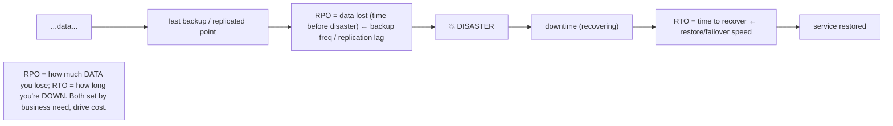
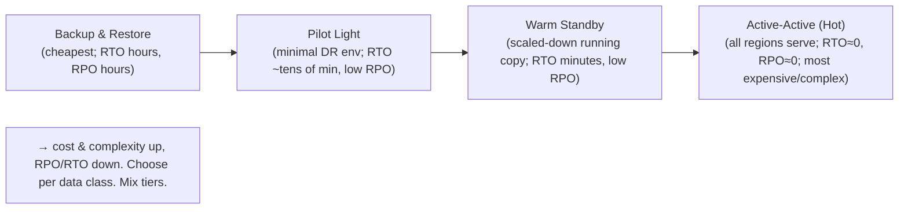

# Lesson 11.8 — Disaster Recovery: RPO/RTO, Backups, Multi-Region Failover

> Part 11: Fault Tolerance & Resilience · Difficulty: 🔴
>
> **Prerequisites:** [11.2 Redundancy/Failover], [10.2 Sync/Async/RPO], [11.1 Correlated Failures], [10.7 CAP], [8.3.6 Fencing].
> **Unlocks:** [Part 13 Multi-region], [Part 14 SRE], [Part 20 Capstone].

---

## 1. Learning Objectives

After this lesson you will be able to:

- Distinguish **disaster recovery (DR)** — recovering from **large-scale/regional failures** — from ordinary fault tolerance (11.1–11.7), and define the two governing metrics: **RPO (data loss tolerance)** and **RTO (downtime tolerance)**.
- Explain **backups** (types, the 3-2-1 rule, and why backups you can't *restore* are worthless) and their role in DR.
- Describe **multi-region DR strategies** — backup/restore, pilot light, warm standby, active-active (hot) — along the **cost ↔ RPO/RTO** spectrum.
- Design a DR plan: choose RPO/RTO targets per data class, a matching strategy, cross-region replication (10.2), failover (11.2/8.3.6), and — critically — **test it** (DR drills).

---

## 2. Motivation — Surviving the disasters redundancy doesn't cover

Redundancy and failover (11.2) handle **component** failures — a node, a disk, a rack. But some failures are **bigger**: an **entire datacenter or region** goes down (power, network, natural disaster, a cloud-provider outage), a **catastrophic bug or bad deploy** corrupts data everywhere, **ransomware** encrypts your data, or a **fat-fingered operator** deletes a production database. These are **disasters** — large-scale, often **correlated** failures (11.1 §3.6) that take out **all** your in-region redundancy at once. **Disaster recovery (DR)** is the discipline of surviving and recovering from these — and it's governed by two metrics that quantify your requirements: **RPO** (how much **data** you can afford to lose) and **RTO** (how long you can afford to be **down**).

These metrics drive every DR decision. **RPO (Recovery Point Objective)** = the maximum acceptable **data loss**, measured in **time** (e.g., "RPO = 5 minutes" means you can lose at most the last 5 minutes of data) — determined by your **backup frequency / replication lag** (10.2). **RTO (Recovery Time Objective)** = the maximum acceptable **downtime** to recover (e.g., "RTO = 1 hour" means you must be back up within an hour) — determined by your recovery/failover speed. Together they define your DR **cost**: **RPO≈0 and RTO≈0 (active-active multi-region) is very expensive; large RPO/RTO (nightly backup + restore) is cheap** — you buy down RPO/RTO with money. This lesson covers the DR metrics, **backups** (and the crucial truth that a backup you've never *restored* is worthless), the **multi-region DR strategy spectrum** (backup/restore → pilot light → warm standby → active-active, trading cost for RPO/RTO), and the discipline of **testing DR** (a DR plan that's never drilled will fail when the real disaster hits — 11.1). DR is the outermost layer of resilience — the capstone of Part 11 and the bridge to multi-region architecture (Part 13).

---

## 3. Theory — From first principles

### 3.1 What DR is (vs ordinary fault tolerance)

`[CS]` **Disaster recovery (DR)** = recovering from **large-scale, catastrophic failures** — an entire **region/datacenter** loss, **data corruption/deletion** (bug, ransomware, human error), or a provider-wide outage — as opposed to the **component-level** failures (node/disk/rack) that redundancy/failover (11.2) handle within a region. Disasters are typically **correlated failures** (11.1 §3.6) that defeat in-region redundancy (they take out *all* your local replicas at once) — so DR requires **geographic separation** (another region — Part 13) and/or **offline/immutable backups** (to survive corruption/ransomware that replicates to all copies). DR is the **outermost resilience layer**: when everything local fails, DR gets you back.

### 3.2 RPO and RTO — the governing metrics

`[CS]` DR requirements are quantified by two metrics `[CS]`:
- **RPO (Recovery Point Objective):** the maximum acceptable **data loss**, measured in **time** — "how much recent data can we lose?" **RPO = 5 min** → you can lose at most the last 5 minutes of data. Determined by **backup frequency** and **replication lag** (10.2 — async replication → RPO > 0 = the lag at failure; sync/semi-sync → RPO ≈ 0). Nightly backups → RPO up to 24 hours; continuous replication → RPO seconds.
- **RTO (Recovery Time Objective):** the maximum acceptable **downtime** to recover — "how long can we be down?" **RTO = 1 hour** → you must be serving again within an hour. Determined by **recovery/failover speed** — restoring from backup (slow, hours) vs failing over to a hot standby (fast, seconds/minutes).
- **They're independent:** you can have low RPO but high RTO (continuous replication but slow failover) or vice versa. Both are set by the **business requirement** ("how much data loss / downtime is acceptable for this data?") — and they **drive the cost** (§3.5).
- **RTO/RPO ≈ 0 is expensive** (active-active multi-region); **large RTO/RPO is cheap** (nightly backup + manual restore). You **buy down RPO/RTO with money and complexity.**

### 3.3 Backups — the foundation of DR

`[CS]` **Backups** are copies of data kept for recovery from corruption/loss/disaster — distinct from **replicas** (which serve traffic and replicate *corruption/deletion* too!) `[CS]`:
- **Why backups ≠ replicas:** replication (10.1) protects against **hardware/node** failure, but **replicates logical errors** — if a bug or a `DROP TABLE` corrupts/deletes data, it's **replicated to all replicas instantly** (correlated failure — 11.1). **Backups (point-in-time copies, especially immutable/offline ones) are the only protection against data corruption, accidental deletion, and ransomware** — you restore to a point *before* the damage. Replication is **not** a backup.
- **Backup types:** **full** (complete copy — slow, big), **incremental** (only changes since the last backup — fast, small, but restore needs the chain), **differential** (changes since the last full), **snapshots** (point-in-time, often storage-level), **continuous / point-in-time recovery (PITR)** (log-based — restore to any moment, e.g., replay the WAL — 5.3.1 — to just before the bad transaction → very low RPO).
- **The 3-2-1 rule** `[BP]`: keep **3** copies of data, on **2** different media/systems, with **1** copy **off-site** (and increasingly **1 offline/immutable** — air-gapped or write-once — to survive ransomware that encrypts online copies). Geographic + media diversity defeats correlated failures (11.1).
- **The critical truth:** **a backup you've never restored is worthless** `[BP]`. Backups fail silently (corrupt backups, incomplete backups, missing dependencies, wrong retention) → the disaster is exactly the wrong time to discover your backups don't restore. **Regularly test restores** (§3.6). Also: **encrypt backups** (they contain all your data — Part 15) and **retain** per compliance/RPO needs.

### 3.4 The multi-region DR strategy spectrum

`[CS]` DR strategies trade **cost** against **RPO/RTO** (from cheapest/slowest to most expensive/fastest) `[CONV]`:
- **Backup & Restore:** back up data (to another region/offline); on disaster, **provision new infrastructure and restore from backup**. **Cheapest** (no standby infra), but **highest RTO** (hours — provision + restore) and **RPO** = backup frequency (up to hours). For non-critical / cost-sensitive systems.
- **Pilot Light:** a **minimal** version of the environment always running in the DR region (core data replicated, critical services scaled to near-zero) — the "pilot light" stays lit. On disaster, **scale up** the DR region to full capacity. **Lower RTO** than backup/restore (infra exists, just scale up — tens of minutes), **low RPO** (continuous replication), moderate cost.
- **Warm Standby:** a **scaled-down but fully-functional** copy always running in the DR region (handling little/no traffic). On disaster, **scale up + redirect traffic**. **Lower RTO** (minutes — it's already running), low RPO, higher cost (running a real standby).
- **Active-Active (Hot / Multi-Region):** **all regions serve live traffic** simultaneously (multi-region active — Part 13). On a region failure, traffic just **reroutes** to the surviving regions (like active-active redundancy — 11.2, but geographic). **Lowest RTO (≈0 — instant reroute) and RPO (≈0 with sync, small with async)**, **highest cost + complexity** (multi-region data consistency — 10.1/10.7, cross-region latency — 10.8). For the most critical systems.
- **The spectrum:** **cost and complexity increase, RPO/RTO decrease** left to right. **Choose per the RPO/RTO requirement** (and budget) — often **different tiers for different data** (active-active for the critical ledger, backup/restore for analytics).

### 3.5 Choosing RPO/RTO and strategy per data class

`[BP]` Match RPO/RTO (and thus strategy + cost) to the **business criticality** of each data class:
- **Mission-critical (payments, core transactions):** low RPO (≈0 — no data loss) + low RTO (minutes) → **warm standby or active-active** + sync/semi-sync replication (10.2) — expensive but justified.
- **Important (user data, orders):** moderate RPO/RTO (minutes) → **pilot light / warm standby** + continuous async replication.
- **Non-critical (analytics, logs, derived data):** high RPO/RTO acceptable (hours) → **backup & restore** — cheap; and derived data can often be **recomputed** (9.7 reprocessing) rather than backed up.
- **The cost/RPO/RTO tradeoff drives it** (§3.2/3.4): you don't pay active-active cost for analytics, and you don't accept nightly-backup RPO for payments. **Mix strategies per data tier.** And align RPO with **replication mode** (10.2 — sync for RPO≈0, async accepts lag-sized RPO).

### 3.6 Testing DR — the discipline that makes it real

`[BP]` The most important (and most neglected) DR practice: **test your DR plan** `[CS]`:
- **Untested DR fails** (11.1) — backups that don't restore, failover procedures that don't work, missing dependencies, stale runbooks, permissions gaps. The **disaster is the worst time to discover this.**
- **DR drills / game days:** regularly **exercise** the DR plan — restore backups (verify they work + measure restore time = actual RTO), fail over to the DR region (verify it serves + measure RTO/RPO), simulate a region loss (chaos at the region level — Part 14). Some organizations do **regular, mandatory** DR failovers (even in production) to keep the DR path exercised and trusted.
- **Measure actual RPO/RTO** — your *tested* recovery time/data-loss vs your *targets*; a plan whose measured RTO is 6 hours doesn't meet a 1-hour RTO no matter what the diagram says.
- **Keep runbooks current** — DR procedures documented, updated, and rehearsed so the on-call team can execute under pressure (Part 14).
- **The maxim:** **DR that isn't tested is a hope, not a plan.** Regular drills turn a paper plan into a proven capability.

### 3.7 DR mechanisms and connections

`[CS]` DR builds on the rest of the platform:
- **Cross-region replication (10.2, Part 13):** async (RPO = lag, low cost) or sync (RPO≈0, high latency — 10.8) replication to the DR region feeds pilot-light/warm-standby/active-active.
- **Failover (11.2) + fencing (8.3.6):** regional failover needs the same correctness as node failover — fence the old region, avoid split-brain (two regions both active — 10.1/10.7), promote a caught-up replica (minimize RPO).
- **DNS/global traffic management (Part 13):** failover often reroutes traffic via DNS/global load balancing (GeoDNS — 3.2.4, anycast — 3.3.3) to the DR region — with the DNS TTL affecting RTO.
- **CAP/PACELC (10.7/10.8):** multi-region DR faces the partition/latency tradeoffs — cross-region strong consistency is costly; many DR setups accept async (some RPO) for availability/latency.
- **Immutable/reprocessable data (9.7):** derived data can be **recomputed** from an immutable source (reprocessing) rather than backed up — a cheaper "DR" for derived stores.
- **Correlated-failure defense (11.1):** DR is fundamentally about surviving the **correlated, large-scale** failures redundancy doesn't cover — geographic + offline/immutable separation.

---

## 4. Visual Intuition

### RPO vs RTO

### DR strategy spectrum (cost ↔ RPO/RTO)

---

## 5. Real-World Analogy

Think of protecting a **business against catastrophes** (fire, flood, theft) — beyond everyday problems.

- **DR vs everyday fault tolerance:** having a **spare cash register** covers a register breaking (component failure — redundancy). But if the **whole store burns down** (disaster — regional loss), or an **employee accidentally shreds all the records** (data corruption/deletion), or **thieves lock up everything** (ransomware) — your in-store spares are **gone too** (correlated failure). **DR** is your plan for *those* catastrophes.
- **RPO (data loss):** "if disaster strikes, **how much recent record-keeping can we afford to lose?**" If you **photocopy records to an off-site vault every night**, you could lose up to a **day's** records (RPO = 24h). If you **fax every transaction off-site as it happens**, you lose almost nothing (RPO ≈ 0) — but that's more effort/cost.
- **RTO (downtime):** "**how fast must we reopen?**" If you must **find a new location, rebuild, and restore records from the vault**, that's days (high RTO). If you have a **fully-stocked second store ready to open**, you reopen in minutes (low RTO) — but you pay to maintain that second store.
- **Backups ≠ having a second store staffed:** crucially, a **replica store that mirrors everything you do** doesn't protect against the **shredded records** — because it would **mirror the shredding** too (replication copies corruption). Only the **off-site vault of past snapshots** lets you recover records from *before* the shredding. And a vault you've **never actually opened to check** might be full of **blank or unreadable copies** — so you **test the restore** (open the vault, verify the records) regularly. *A backup you've never restored is worthless.*
- **The strategy spectrum:** *backup & restore* = off-site vault, rebuild from scratch (cheap, slow). *Pilot light* = a small always-ready location you can quickly scale up. *Warm standby* = a second store running quietly, ready to ramp up. *Active-active* = **two full stores both open**, so if one burns, customers just go to the other (instant, but you run two full stores). You pick based on **how much downtime/data-loss you can tolerate** vs **what you're willing to spend** — and you might do **active-active for the cash-handling** (critical) but just **nightly backups for the old archives** (non-critical).
- **The 3-2-1 rule & testing:** keep **3 copies, 2 media, 1 off-site (1 offline)** so no single catastrophe gets them all — and **run a fire drill** so everyone knows how to reopen, because a plan nobody has rehearsed **fails on the real bad day.**

---

## 6. Industry Example

- **RPO/RTO-driven DR tiers** `[CONV]`: organizations define RPO/RTO per system and choose DR strategies (backup/restore → active-active) accordingly, mixing tiers by criticality (§3.4/3.5). *(Representative.)*
- **Point-in-time recovery (PITR)** `[CONV]`: log-based backups (replay the WAL — 5.3.1) restore to any moment → very low RPO + recovery from a bad transaction/corruption (§3.3). *(Representative.)*
- **3-2-1 + immutable/air-gapped backups** `[BP]`: the standard backup discipline; immutable/offline copies to survive ransomware (§3.3). *(Representative.)*
- **Multi-region strategies** `[CONV]`: AWS's documented DR patterns — Backup & Restore, Pilot Light, Warm Standby, Multi-Site Active-Active — the canonical cost↔RPO/RTO spectrum (§3.4, Part 13). *(Representative.)*
- **DR drills / game days** `[BP]`: regular DR failover exercises (some run mandatory region-failover drills) to verify and measure RPO/RTO and keep runbooks current (§3.6, Part 14). *(Representative.)*
- **"Replication is not a backup"** `[OPINION]`: the widely-repeated lesson after incidents where replication faithfully copied a deletion/corruption to all replicas (§3.3). *(Representative.)*

---

## 7. Implementation Details — building a DR plan

- **Define RPO/RTO targets per data class** (§3.2/3.5) — the business requirement ("how much data loss / downtime is acceptable?") — and let them drive the strategy and cost `[BP]`.
- **Choose a DR strategy per tier** (§3.4): backup & restore (non-critical), pilot light / warm standby (important), active-active (mission-critical) — matching cost to RPO/RTO; **mix tiers**.
- **Keep real backups (not just replicas)** — replication protects hardware but replicates corruption/deletion; use **point-in-time / PITR** backups, follow **3-2-1** (3 copies, 2 media, 1 off-site, ideally 1 offline/immutable for ransomware), **encrypt** them (§3.3).
- **Align replication mode with RPO** (10.2) — sync/semi-sync for RPO≈0, async accepts lag-sized RPO; cross-region often async (latency — 10.8).
- **Make regional failover correct** — fence the old region (8.3.6), avoid split-brain (two active regions — 10.7), promote a caught-up replica (minimize RPO), reroute traffic (DNS/global LB — Part 13, mind TTL for RTO) (§3.7, 11.2).
- **TEST DR regularly** (§3.6) — restore backups (verify + measure RTO), run failover drills/game days (measure RPO/RTO vs targets), keep runbooks current — **untested DR fails** (11.1).
- **Recompute derived data** where possible (9.7) instead of backing it up — cheaper DR for derived stores (§3.7).
- **Document + rehearse runbooks** so on-call can execute under pressure (Part 14).

---

## 8. Advantages

- **Survives catastrophes** redundancy can't — regional loss, corruption, deletion, ransomware (§3.1).
- **Quantified requirements** — RPO/RTO make DR needs explicit and testable (§3.2).
- **Cost-matched** — the strategy spectrum lets you buy exactly the RPO/RTO each data class needs (§3.4/3.5).
- **Backups defeat correlated logical failures** — the only protection against corruption/deletion (which replication copies) (§3.3, 11.1).
- **Active-active = near-zero RPO/RTO** for the most critical systems (§3.4, Part 13).
- **Tested DR = proven recovery** — confidence you can actually recover (§3.6).

---

## 9. Disadvantages / costs

- **Cost ↔ RPO/RTO** — low RPO/RTO (active-active, sync replication) is **expensive** (running standby/multi-region infra, cross-region complexity) (§3.4).
- **Multi-region complexity** — data consistency across regions (10.1/10.7), cross-region latency (10.8), failover correctness (§3.4/3.7).
- **Backup overhead** — storage, retention, encryption, and the discipline to test restores (§3.3).
- **DR is neglected** — often under-invested and untested until a disaster proves it doesn't work (§3.6).
- **Testing DR is disruptive/effortful** — drills take time and risk; skipping them (common) makes DR a false hope (§3.6).
- **RPO>0 with async** — data loss on regional failover unless sync/semi-sync (10.2, §3.2).

---

## 10. When NOT to / limits

- **Don't treat replication as a backup** — it copies corruption/deletion; you need real (point-in-time, offline/immutable) backups (§3.3).
- **Don't over-invest in low RPO/RTO for non-critical data** — nightly backup/restore is fine for analytics; save active-active for mission-critical (§3.5).
- **Don't skip DR testing** — untested DR fails when needed (§3.6, 11.1).
- **Don't run active-active without solving multi-region consistency** (10.1/10.7) — split-brain/divergence across regions (§3.7).
- **Don't ignore backup encryption/retention** — backups are a security + compliance concern (Part 15) (§3.3).
- **Don't fail over regions without fencing** — two active regions → split brain (§3.7, 8.3.6).

---

## 11. Common Mistakes

1. **"Replication is a backup"** → a deletion/corruption replicates to all copies → no recovery point (§3.3) — the classic.
2. **Never testing restores** → discover backups are corrupt/incomplete during the actual disaster (§3.3/3.6).
3. **RPO/RTO not defined** → no clear DR requirement → over- or under-invest (§3.2).
4. **Over-investing in low RPO/RTO for non-critical data** (or under-investing for critical) → wrong cost/risk (§3.5).
5. **Untested DR failover** → the procedure/runbook doesn't work when the disaster hits (§3.6, 11.1).
6. **Async cross-region replication assumed lossless** → data loss (RPO>0) on regional failover (§3.2, 10.2).
7. **Active-active region failover without fencing** → split brain across regions (§3.7, 8.3.6).
8. **No offline/immutable backup** → ransomware encrypts all online copies including backups (§3.3).

---

## 12. Interview Questions

**🟢 Easy**
- What are RPO and RTO? How do they differ?
- Why is replication not a backup?

**🟡 Medium**
- Describe the DR strategy spectrum (backup/restore → active-active) and the cost↔RPO/RTO tradeoff.
- Why must you test DR / restores, and what goes wrong if you don't?

**🔴 Hard**
- Design DR for a system with mission-critical (payments) and non-critical (analytics) data. Choose RPO/RTO and strategy per tier, and justify the cost.
- How does regional failover differ from node failover, and what correctness issues (split-brain, RPO, traffic rerouting) must it handle?

**⚫ Staff+**
- Design an end-to-end DR plan for a global financial platform: RPO/RTO targets per data class, backup strategy (PITR, 3-2-1, immutable), cross-region replication (sync/async — 10.2), multi-region failover (fencing, split-brain avoidance, DNS rerouting — Part 13), and a DR testing regimen (drills, game days, measured RPO/RTO). Tie to CAP/PACELC for cross-region consistency (10.7/10.8).
- A region-loss disaster caused 8 hours of downtime and 2 hours of lost data, exceeding the 1-hour RTO / 5-minute RPO targets. Diagnose (untested failover, async replication lag, missing pilot-light infra, stale runbook), and design the fixes (warm standby, semi-sync replication, DR drills, updated runbooks) to meet the targets.

---

## 13. Production Pitfalls

- **"Replication is a backup" disaster:** a bad deploy / `DROP TABLE` / corruption is instantly replicated to all replicas → no clean recovery point (needed a real backup) (§3.3) — the signature DR failure.
- **Backups don't restore:** the disaster reveals backups are corrupt, incomplete, missing dependencies, or the restore takes far longer than RTO (never tested) (§3.3/3.6).
- **RTO/RPO missed:** the actual (untested) recovery time/data-loss vastly exceeds the targets on the diagram (§3.6).
- **Ransomware encrypts online backups too:** no offline/immutable copy → all backups encrypted → no recovery (§3.3).
- **Regional split-brain:** active-active/failover without fencing → two regions both active → divergence (§3.7, 8.3.6).
- **Async cross-region data loss:** a region fails; the DR region (lagging) is promoted → recent acked writes lost (RPO>0) (§3.2, 10.2).
- **Stale runbook / unprepared team:** the DR procedure is outdated and the on-call team can't execute under pressure (§3.6).

---

## 14. Optimization Techniques

- **Define RPO/RTO per data class → choose the matching strategy** (backup/restore → active-active) and cost (§3.2/3.4/3.5) `[BP]`.
- **PITR / continuous backups** for low RPO + recovery from corruption; **3-2-1 + immutable/offline** backups for ransomware/correlated-failure defense; **encrypt** them (§3.3).
- **Warm standby / active-active** for low RTO on critical tiers; **backup & restore** for cheap non-critical DR (§3.4/3.5).
- **Sync/semi-sync replication for RPO≈0** critical data; async (accept RPO) for the rest / cross-region (10.2, §3.2).
- **Recompute derived data** (9.7) instead of backing it up — cheaper DR for derived stores (§3.7).
- **Fenced, caught-up regional failover + DNS/global-LB rerouting** (mind TTL for RTO) (§3.7, 11.2/8.3.6, Part 13).
- **Test DR relentlessly** — restore drills + failover game days + measured RPO/RTO + current runbooks (§3.6, Part 14).

---

## 15. Summary

**Disaster recovery (DR)** is recovering from **large-scale, catastrophic failures** — an entire **region/datacenter loss**, **data corruption/deletion** (bug, `DROP TABLE`, ransomware), or a provider-wide outage — which are typically **correlated failures** (11.1) that **defeat in-region redundancy** (they take out *all* local replicas at once), so DR requires **geographic separation** and/or **offline/immutable backups**. DR requirements are quantified by two metrics: **RPO (Recovery Point Objective)** — the maximum acceptable **data loss** (in time; set by **backup frequency / replication lag** — 10.2: async → RPO = lag, sync → RPO≈0) — and **RTO (Recovery Time Objective)** — the maximum acceptable **downtime** to recover (set by restore/failover speed). Both are **business-driven** and **drive cost**: **RPO/RTO≈0 (active-active multi-region) is expensive; large RPO/RTO (nightly backup + restore) is cheap** — you **buy down RPO/RTO with money/complexity**. **Backups are the foundation of DR and are NOT the same as replicas**: replication protects against hardware failure but **replicates corruption/deletion to all replicas** (a correlated logical failure), so **only point-in-time backups (especially immutable/offline ones) protect against corruption, accidental deletion, and ransomware** — restore to a point *before* the damage (**PITR** via WAL replay — 5.3.1 — gives very low RPO). Follow the **3-2-1 rule** (3 copies, 2 media, 1 off-site, ideally 1 offline/immutable), **encrypt** backups, and above all — **a backup you've never restored is worthless** (they fail silently), so **test restores regularly**. The **multi-region DR strategy spectrum** trades **cost ↔ RPO/RTO**: **Backup & Restore** (cheapest; RTO hours, RPO hours) → **Pilot Light** (minimal always-on DR env, scale up on disaster; RTO tens-of-minutes, low RPO) → **Warm Standby** (scaled-down running copy; RTO minutes) → **Active-Active/Hot** (all regions serve; RTO≈0, RPO≈0; most expensive/complex — multi-region consistency + latency — 10.1/10.7/10.8). **Choose per data class** — active-active + sync replication for **mission-critical** (payments), backup/restore for **non-critical** (analytics, which can often be **recomputed** — 9.7) — and **mix tiers**. Regional failover needs the same correctness as node failover — **fence** the old region (8.3.6), avoid **split-brain** (two active regions — 10.7), promote a **caught-up** replica (minimize RPO), and reroute traffic (DNS/global LB — Part 13, TTL affects RTO). Most critically, **DR must be tested** — **untested DR fails** (11.1): run **restore drills** and **failover game days**, **measure actual RPO/RTO vs targets**, and keep **runbooks current** — because **DR that isn't tested is a hope, not a plan.** DR is the outermost layer of resilience (Part 11) and the bridge to multi-region architecture (Part 13).

---

## 16. Revision Notes (flashcard-ready)

- **Q:** DR vs ordinary fault tolerance? **A:** DR = recover from large-scale/correlated disasters (region loss, corruption, ransomware) that defeat in-region redundancy; needs geo-separation + backups.
- **Q:** RPO? **A:** Max acceptable DATA loss (in time); set by backup frequency / replication lag (async→RPO>0, sync→RPO≈0).
- **Q:** RTO? **A:** Max acceptable DOWNTIME to recover; set by restore/failover speed.
- **Q:** Cost tradeoff? **A:** Low RPO/RTO (active-active, sync) = expensive; high RPO/RTO (nightly backup/restore) = cheap. Buy down with money.
- **Q:** Why is replication NOT a backup? **A:** It replicates corruption/deletion to all replicas (correlated failure); backups (point-in-time/offline) restore to before the damage.
- **Q:** 3-2-1 rule? **A:** 3 copies, 2 media, 1 off-site (ideally 1 offline/immutable for ransomware).
- **Q:** PITR? **A:** Point-in-time recovery (log/WAL replay) → restore to any moment → very low RPO + recover from a bad transaction.
- **Q:** DR strategy spectrum? **A:** Backup&Restore → Pilot Light → Warm Standby → Active-Active (cost & complexity up, RPO/RTO down).
- **Q:** Most critical DR practice? **A:** TEST it — restore drills + failover game days + measure actual RPO/RTO; untested DR fails.
- **Q:** "A backup you've never restored is..."? **A:** Worthless (they fail silently).
- **Q:** Regional failover correctness? **A:** Fence old region, avoid split-brain, promote caught-up replica (RPO), reroute traffic (DNS/global LB).

---

## 17. Further Reading + Knowledge-Graph Links

**Within this platform**
- **Previous:** [11.7 Sagas]. **Builds on:** [11.2 Redundancy/Failover], [10.2 Sync/Async/RPO], [11.1 Correlated Failures], [10.7 CAP]/[10.8 PACELC] (cross-region), [8.3.6 Fencing], [5.3.1 WAL] (PITR), [9.7 Reprocessing derived data].
- **Closes:** Part 11 (then the Part 11 README). **Next:** [Part 12 Microservices].
- **Enables:** [Part 13 Multi-region / Global Traffic] (DR strategies in depth), [Part 14 SRE] (DR drills, incident response), [Part 20 Capstone] (DR plan).

**Foundational texts (synthesized)**
- *Site Reliability Engineering* (Beyer et al.) — DR, backups, testing recovery (synthesized).
- Cloud DR documentation (AWS DR strategies: backup/restore, pilot light, warm standby, active-active) — representative.
- Backup best practices (3-2-1, PITR, immutable backups) — concept, synthesized.

**Concept tags:** `[CS]` DR (large-scale/correlated failures), RPO (data loss) / RTO (downtime), backups ≠ replicas, DR strategy spectrum · `[CONV]` PITR, 3-2-1, backup/restore/pilot-light/warm-standby/active-active, multi-region DR · `[BP]` RPO/RTO per data class, immutable backups, test DR (drills/game days), fenced regional failover, replication-is-not-a-backup · `[OPINION]` untested DR is a hope not a plan.
