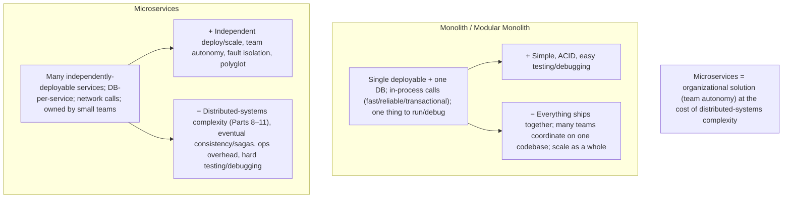
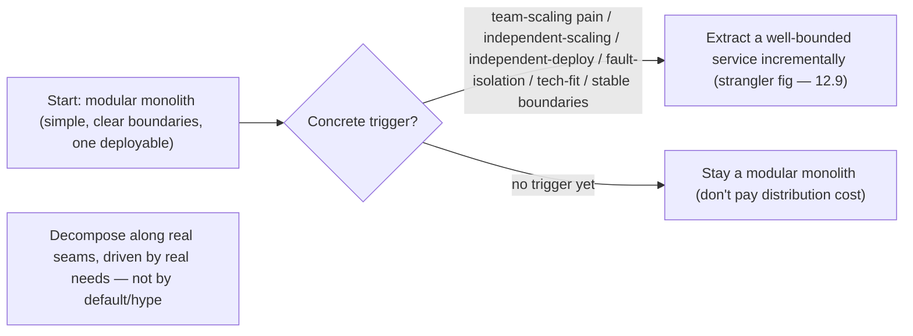

# Lesson 12.1 — Why/Why-Not Microservices; Monolith-First and the Decomposition Triggers

> Part 12: Microservices · Difficulty: 🟡🔴
>
> **Prerequisites:** [2.2.1 Monolith/Modular Monolith], [2.2.3 Service-Based/Microservices/SOA], [2.3.2 The Hard Parts], [8.1.1 Distributed Difficulties], [11.x Resilience].
> **Unlocks:** [12.2 Decomposition], [12.3 Communication], [12.4 Data], [Part 13 Cloud Native].

---

## 1. Learning Objectives

After this lesson you will be able to:

- Define **microservices** and articulate their **real benefits** — **independent deployability, team autonomy, independent scaling, fault isolation, technology diversity** — precisely (not as buzzwords).
- Enumerate the **costs** microservices impose — **distributed-systems complexity** (all of Parts 8–11), **data consistency** (eventual/sagas), **operational overhead**, **testing/debugging difficulty** — and why they're often **underestimated**.
- Argue **"monolith-first"**: why starting with a (modular) monolith and decomposing later is usually the right call, and the **decomposition triggers** that justify splitting.
- Make a **balanced, requirements-driven decision** (1.1.5) about whether/when to adopt microservices, avoiding both cargo-cult adoption and dogmatic rejection.

---

## 2. Motivation — The most over-adopted (and over-criticized) architecture

**Microservices** — decomposing an application into a set of **small, independently-deployable services**, each owning a business capability and its own data — is the most hyped architectural style of the last decade, and consequently the most **cargo-culted**. Teams adopt microservices because "that's how Netflix/Amazon do it," inherit **enormous distributed-systems complexity** (everything in Parts 8–11: partial failure, consistency, sagas, resilience), and often end up worse off than a well-structured monolith would have left them — a "distributed monolith" with all the costs and none of the benefits. Equally, some dismiss microservices entirely, missing the genuine, transformative benefits they bring at the **right scale and organizational maturity**. This lesson cuts through both by treating the microservices decision as what it is: a **tradeoff** (1.1.5) with real benefits and real, frequently-underestimated costs.

The core insight is that **microservices are primarily an *organizational* solution, not a technical one.** Their headline benefit — **independent deployability and team autonomy** — lets **many teams work and ship independently** without coordinating a single monolithic release, which is the binding constraint at large organizations (Conway's Law — Part 2). But you pay for that autonomy with **distributed-systems complexity**: what was an in-process function call (reliable, fast, transactional — 8.4.2) becomes a network call (unreliable, slow, ambiguous — 8.1.1), what was one ACID transaction becomes a **saga** (11.7), and what was one deployable becomes dozens of services to operate, monitor, and secure. This is why the pragmatic consensus is **"monolith-first"**: start with a **well-structured (modular) monolith** (2.2.1), and **decompose into microservices only when specific triggers** (team-scaling pain, independent-scaling needs, deployment coupling) justify the cost. This lesson develops the benefits, the costs, the monolith-first argument, and the decomposition triggers — so you can make (and defend) a balanced decision rather than follow the hype.

---

## 3. Theory — From first principles

### 3.1 What microservices are

`[CS]` **Microservices** = an architectural style that structures an application as a collection of **small, independently-deployable services**, each `[CS]`:
- **Owns a business capability** (a bounded context — DDD, 2.1.3) — organized around business functions, not technical layers.
- **Owns its own data** (database-per-service — 12.4) — no shared database; services communicate via **APIs/events**, not shared tables.
- Is **independently deployable** — you can deploy/scale/change one service without redeploying the others (the defining property).
- Communicates over the **network** (sync RPC/REST — 8.4/3.2.6, or async messaging — Part 9) — not in-process calls.
- Is often **owned by a small team** ("two-pizza team") that builds, deploys, and operates it end-to-end.
Contrast: a **monolith** (2.2.1) is a **single deployable** where components call each other **in-process** and typically share **one database** — simpler, but everything ships together. Microservices trade the monolith's simplicity for independence — at the cost of becoming a **distributed system** (Parts 8–11).

### 3.2 The real benefits

`[CS]` Microservices' genuine benefits (when they apply):
- **Independent deployability (the headline):** deploy a service **without redeploying the whole app** → faster, smaller, safer releases; teams ship on their own cadence. This is the primary reason to adopt microservices.
- **Team autonomy / organizational scaling (the real driver):** **many teams** each own services and work **independently** — no coordinating one giant release, no stepping on each other in one codebase. This solves the **organizational** bottleneck of large teams on a monolith (Conway's Law — a system's structure mirrors the org's communication structure — Part 2). **This is usually the deepest motivation** — microservices are an org solution.
- **Independent scaling:** scale **only** the services that need it (e.g., scale the image-processing service, not the whole app — 7.1) → resource efficiency.
- **Fault isolation:** a failure in one service can be **contained** (with bulkheads/circuit breakers — 11.3) so it doesn't crash the whole app (unlike a monolith where one bad component can take down the process). *(But careless microservices can cascade — 11.3 — so fault isolation requires deliberate resilience.)*
- **Technology diversity:** each service can use the **best-fit** language/framework/database (polyglot — 5.1.3) → the right tool per job, and easier tech evolution/experimentation.

### 3.3 The costs (frequently underestimated)

`[CS]` The costs are **large and often underestimated** `[BP]`:
- **Distributed-systems complexity (the big one):** an in-process call (reliable, fast, transactional — 8.4.2) becomes a **network call** — **unreliable** (8.1.1: loss/latency/partial failure), **slow** (ms vs ns — 1.1.3), **ambiguous** (can't tell success from failure — 8.4.1). You inherit **all of Parts 8–11**: timeouts/retries/idempotency (8.1.3/11.5), circuit breakers/bulkheads (11.3), the fallacies (8.1.1). Every inter-service interaction is now a distributed-systems problem.
- **Data consistency:** no shared database (12.4) → cross-service operations can't use ACID transactions (5.2.1) → **eventual consistency + sagas** (11.7) + the outbox pattern (9.8) → far more complex than a single transaction. Distributed queries need API composition/CQRS (12.4).
- **Operational overhead:** dozens/hundreds of services to **deploy, monitor, secure, and operate** → needs **serious infrastructure** (orchestration — Part 13, service discovery — 12.6, service mesh — 12.7, distributed tracing — Part 16, CI/CD per service). A monolith is **one** thing to run; microservices are **many**.
- **Testing & debugging:** **integration/end-to-end testing** across services is hard (12.8 — contract tests); **debugging** a request spanning many services requires **distributed tracing** (Part 16) — far harder than a stack trace in a monolith.
- **Network/latency cost:** chatty inter-service calls add latency (the fallacies — 8.1.1); a request fanning out to many services amplifies tail latency (Part 17).
- **The "distributed monolith" trap:** if services are **tightly coupled** (must deploy together, share data, chatty synchronous chains), you get **all the costs of distribution with none of the benefits** — the worst outcome (§3.6).

### 3.4 Microservices are primarily an organizational solution

`[OPINION]`/`[CS]` The key reframe: **microservices' primary benefit is organizational (team autonomy / independent deployability), not technical** `[OPINION]`:
- A **monolith scales technically** a long way (a well-built monolith serves huge traffic — 2.2.1); the thing that **doesn't scale** is **many teams working on one codebase/deployable** — coordination overhead, merge conflicts, one team's bug blocking everyone's release, one giant risky deploy.
- Microservices solve *that* — **team autonomy**: each team owns a service, deploys independently, moves at its own pace (Conway's Law — align architecture with org structure).
- **So the honest test:** do you have **enough teams** that coordinating on a monolith is the bottleneck? A **small team** on a monolith has **no coordination problem** to solve — microservices just add distributed-systems complexity for benefits they can't yet use. Microservices pay off when **organizational scale** demands independent teams/deployments — which is why they suit **large organizations** and are usually **premature for small ones** (§3.5).

### 3.5 Monolith-first

`[BP]` The pragmatic consensus (Fowler et al.): **start with a monolith, decompose later** `[BP]`:
- **Start with a well-structured (modular) monolith** (2.2.1) — clear internal module boundaries (bounded contexts — 2.1.3), but a **single deployable + database**. You get **simplicity** (in-process calls, ACID transactions, one thing to deploy/debug) while you're **small and still learning the domain**.
- **Why monolith-first:** (1) at small scale, you **don't have the organizational problem** microservices solve (§3.4); (2) you **don't yet understand the domain well enough** to draw the right service boundaries — and **wrong boundaries are extremely costly** to fix once they're network boundaries (12.2 — you can refactor a module boundary easily, but moving logic/data across services is painful); (3) you **avoid the distributed-systems complexity** until it's justified.
- **The modular monolith** (2.2.1) is the sweet spot for most systems — well-organized internally (so it *could* be decomposed later), but deployed as one → **most of the maintainability, none of the distribution cost.** Keep module boundaries clean so decomposition is *possible* when triggers arrive.
- **"You must be this tall to ride microservices"** — you need the operational maturity (CI/CD, monitoring, orchestration — Part 13/14/16) and organizational scale *before* microservices pay off; adopting them without that maturity is a common, costly mistake.

### 3.6 The decomposition triggers — when to split

`[BP]` Decompose the monolith into microservices when **specific triggers** justify the cost (not by default):
- **Team-scaling pain (the main trigger):** so many teams/developers that coordinating on one codebase/deployable is the bottleneck (merge conflicts, release coordination, one team blocking another) → split so teams own services and deploy independently (§3.4).
- **Independent scaling needs:** one part has **very different scaling** needs (e.g., a compute-heavy component needs 10x nodes while the rest doesn't) → extract it to scale independently (7.1).
- **Independent deployment / release-cadence needs:** parts need to release at **very different frequencies** or a risky component keeps blocking others' releases → extract to decouple deployments.
- **Fault isolation needs:** a component's failures keep taking down the whole app → extract + isolate (11.3).
- **Technology needs:** a part is far better served by a **different tech stack/database** (5.1.3) → extract (polyglot).
- **Clear, stable bounded contexts:** the domain has **well-understood, stable boundaries** (12.2) → safe to make them service boundaries.
**Rule** `[BP]`: **extract a service when a concrete trigger justifies the distributed-systems cost** — often incrementally (strangler fig — 12.9), pulling out one well-bounded capability at a time from the monolith, rather than a big-bang rewrite. **Decompose along real seams, driven by real needs.**

### 3.7 Making the balanced decision

`[BP]` The requirements-driven decision (1.1.5, 2.3.2):
- **Default: modular monolith** (2.2.1) — simplest, defers distribution cost, keeps decomposition possible. Right for **most systems / small-to-medium teams / early-stage / unclear domains**.
- **Adopt microservices when:** you have **organizational scale** (many teams needing autonomy — §3.4), the **operational maturity** to run them (§3.5), **clear stable boundaries** (§3.6), and **concrete triggers** (§3.6) — and you **decompose incrementally** (12.9).
- **Avoid microservices when:** small team, early stage, unclear domain, or lacking operational maturity — you'll pay distribution costs for benefits you can't use (the cargo-cult trap).
- **The honest questions:** *Do we have the org-scaling problem microservices solve? Do we understand the domain boundaries? Do we have the operational maturity? Is there a concrete trigger?* If not → **modular monolith**. Microservices are a **means to independent teams/deployments at scale**, not a goal — choose them for the problem they solve, not the hype (1.1.5).

---

## 4. Visual Intuition

### The tradeoff

### Monolith-first + decomposition triggers

---

## 5. Real-World Analogy

Think of organizing a **growing company** — as one big open office (monolith) vs many independent departments in separate buildings (microservices).

- **The monolith (one open office):** everyone works in **one room, sharing one filing system** (one database). Communication is **instant** (turn around and ask — in-process calls), everyone can access any file (ACID transactions across everything), and there's **one door to lock up at night** (one deployment). For a **small company**, this is **ideal** — fast, simple, no bureaucracy.
- **The pain that triggers change:** as the company **grows to hundreds of people**, the one open office becomes chaotic — you **can't renovate your corner** without disrupting everyone (can't deploy independently), **everyone's changes collide** (merge conflicts / release coordination), and one team's mess affects all (a bad component crashes the shared process). The **binding problem is organizational** — too many people in one room.
- **Microservices (independent departments in separate buildings):** you split into **autonomous departments**, each in **its own building with its own filing system** (database-per-service), free to **renovate independently** (deploy independently), work at their own pace (team autonomy), and use whatever tools suit them (polyglot). But now they can only communicate by **phone/mail between buildings** (network calls — slow, unreliable, sometimes lost — 8.1.1), a task needing files from three buildings requires **coordinating across them** (sagas — 11.7, no more instant shared-file access), and you now have **many buildings to secure, maintain, and monitor** (operational overhead). **You solved the crowding (org) problem but took on inter-building logistics (distributed-systems) complexity.**
- **Monolith-first:** a **startup** shouldn't lease ten separate buildings on day one — it doesn't have hundreds of people yet (no crowding problem), it's still figuring out **which departments even make sense** (unclear boundaries), and it can't afford the logistics overhead. **Start in one well-organized office** (modular monolith — with clear internal team areas so you *could* split later), and **spin off a department into its own building only when a real need arises** (that team is big/independent enough, needs to scale/deploy on its own). Leasing buildings for departments that don't exist yet is the **cargo-cult** mistake — all the logistics cost, none of the benefit.

---

## 6. Industry Example

- **Amazon/Netflix microservices at scale** `[CONV]`: adopted microservices to enable **thousands of engineers in autonomous teams** to deploy independently — the organizational-scaling driver (§3.4). *(Representative.)*
- **Monolith-first (Fowler, Shopify, others)** `[BP]`: the widely-endorsed advice to start monolithic and decompose when justified; several large companies deliberately run **modular monoliths** at significant scale (§3.5). *(Representative.)*
- **The "distributed monolith" anti-pattern** `[OPINION]`: teams that split prematurely into tightly-coupled services (deploy together, shared data, chatty sync chains) — all the distribution cost, none of the benefit (§3.3/3.6). *(Representative.)*
- **Reverting microservices → monolith** `[CONV]`: documented cases of teams consolidating over-decomposed microservices back into a monolith/modular-monolith for simplicity/cost (e.g., some cost/latency-driven reversals) (§3.7). *(Representative.)*
- **"You must be this tall to ride"** `[OPINION]`: the maturity-prerequisite framing (CI/CD, monitoring, orchestration) before microservices pay off (§3.5, Part 13/14/16). *(Representative.)*

---

## 7. Implementation Details — deciding on microservices

- **Default to a modular monolith** (2.2.1) — one deployable + DB, but **clean internal module/bounded-context boundaries** (2.1.3) so decomposition is possible later; simplest, defers distribution cost (§3.5) `[BP]`.
- **Adopt microservices only with a concrete trigger + maturity** (§3.6/3.7): organizational scale (many teams needing autonomy — §3.4), operational maturity (CI/CD, monitoring, orchestration — Part 13/14/16), and clear stable boundaries (12.2).
- **Decompose incrementally** (strangler fig — 12.9), extracting one well-bounded capability at a time — never a big-bang rewrite.
- **Budget the distributed-systems cost** — every inter-service call needs timeouts/retries/idempotency/circuit-breakers (8.1.3/11.3/11.5); cross-service transactions need sagas (11.7); plan the operational infrastructure (12.6/12.7, Part 13/16).
- **Avoid the distributed-monolith trap** — services must be **loosely coupled** (independent deploy, no shared DB, minimal synchronous chains — 12.3/12.4); if they must deploy together, you've failed (§3.6).
- **Make it a requirements-driven decision** (1.1.5) — ask the honest questions (org-scaling problem? domain clarity? maturity? trigger?); don't cargo-cult (§3.7).
- **Keep the option open** — a clean modular monolith can become microservices when triggers arrive; a tangled monolith or premature microservices are both hard to fix.

---

## 8. Advantages (of microservices, when warranted)

- **Independent deployability** — deploy/change one service without the whole app (§3.2) — the headline benefit.
- **Team autonomy / organizational scaling** — many teams work and ship independently (Conway's Law) — the real driver (§3.4).
- **Independent scaling** — scale only what needs it (resource efficiency) (§3.2, 7.1).
- **Fault isolation** — contain failures (with resilience — 11.3) so one service doesn't crash all (§3.2).
- **Technology diversity** — best-fit stack/DB per service (polyglot — 5.1.3) (§3.2).
- **Evolvability** — replace/rewrite one service independently.

---

## 9. Disadvantages / costs

- **Distributed-systems complexity** — inherit all of Parts 8–11 (partial failure, latency, consistency, resilience) (§3.3) — the big cost.
- **Data consistency** — no cross-service ACID → eventual consistency + sagas (11.7) + outbox (9.8) (§3.3, 12.4/12.5).
- **Operational overhead** — many services to deploy/monitor/secure/operate; needs serious infra (§3.3, Part 13/14/16).
- **Testing/debugging difficulty** — integration/E2E tests + distributed tracing (§3.3, 12.8/Part 16).
- **Network/latency cost** — chatty calls + fan-out amplify latency (§3.3, 8.1.1/Part 17).
- **The distributed-monolith trap** — worst of both worlds if coupled (§3.6).
- **Premature-adoption cost** — distribution costs without the org benefits at small scale (§3.4/3.5).

---

## 10. When NOT to use microservices

- **Small team / early stage** — no org-scaling problem to solve; microservices add cost for unusable benefits (§3.4/3.5).
- **Unclear/unstable domain boundaries** — wrong service boundaries are extremely costly; stay a modular monolith until boundaries are clear (§3.5, 12.2).
- **Lacking operational maturity** (CI/CD, monitoring, orchestration) — you can't run microservices well yet (§3.5).
- **No concrete trigger** — don't decompose by default/hype (§3.6/3.7).
- **Heavily transactional / tightly-coupled domains** — cross-service sagas may be more costly than a monolith's transactions (§3.3, 11.7).
- **When a modular monolith meets the requirement** — it usually does for most systems (§3.5/3.7).

---

## 11. Common Mistakes

1. **Cargo-cult adoption** — microservices "because Netflix" without the org-scaling problem, maturity, or triggers (§3.4/3.7).
2. **The distributed monolith** — tightly-coupled services (deploy together, shared DB, chatty sync) → all costs, no benefits (§3.6).
3. **Premature decomposition** — splitting before the domain/boundaries are understood → wrong, costly-to-fix boundaries (§3.5, 12.2).
4. **Underestimating distributed-systems complexity** — treating network calls like in-process calls (fallacies — 8.1.1) (§3.3).
5. **No operational maturity** — adopting microservices without CI/CD, monitoring, orchestration → operational chaos (§3.5).
6. **Ignoring data consistency** — expecting ACID across services (there isn't) → correctness bugs (§3.3, 12.4).
7. **Big-bang rewrite** — rewriting a monolith into microservices at once (should be incremental — strangler fig — 12.9).
8. **Too-fine granularity** — nano-services with excessive inter-service chatter/latency (§3.3).

---

## 12. Interview Questions

**🟢 Easy**
- What are microservices, and how do they differ from a monolith?
- What is the primary (organizational) benefit of microservices?

**🟡 Medium**
- List microservices' benefits and costs. Why are the costs often underestimated?
- What is "monolith-first," and why is it usually the right approach?

**🔴 Hard**
- Why are microservices primarily an organizational solution, not a technical one? When does a monolith's limit become organizational rather than technical?
- What are the decomposition triggers, and how do you decide whether to extract a service?

**⚫ Staff+**
- A startup wants to build microservices "to scale like the big companies." Advise them: why monolith-first, what triggers would justify decomposition later, and how to keep the modular monolith decomposable — versus the cargo-cult/distributed-monolith risks.
- A large organization's monolith is causing release-coordination pain across 20 teams. Make the case for (incrementally) decomposing to microservices: which triggers apply, what distributed-systems costs they must budget (sagas, resilience, observability), the operational prerequisites, and how to decompose without a big-bang rewrite (strangler fig — 12.9).

---

## 13. Production Pitfalls

- **Distributed monolith:** premature/badly-bounded microservices that must deploy together and share data → all the distribution cost, none of the autonomy (§3.6) — the worst outcome.
- **Cargo-cult complexity crush:** a small team adopts microservices, drowns in ops/distributed-systems complexity, ships slower than a monolith would have (§3.4/3.7).
- **Wrong boundaries baked into the network:** premature decomposition drew wrong service lines; fixing them (moving logic/data across services) is painfully expensive (§3.5, 12.2).
- **Consistency bugs:** teams expected cross-service ACID, got eventual consistency, and shipped correctness bugs (should have used sagas — §3.3, 11.7).
- **Operational overwhelm:** dozens of services without CI/CD, monitoring, tracing, orchestration → chaos, slow incident response (§3.5, Part 13/14/16).
- **Latency/tail amplification:** chatty synchronous inter-service chains blow up request latency (§3.3, 8.1.1/Part 17).

---

## 14. Optimization Techniques

> *Mostly "decide well."*

- **Modular monolith default** (2.2.1) — clean bounded-context boundaries, one deployable, decomposable later — most maintainability for least cost (§3.5) `[BP]`.
- **Decompose incrementally on concrete triggers** (strangler fig — 12.9), one well-bounded capability at a time (§3.6).
- **Ensure operational maturity first** (CI/CD, monitoring, orchestration, tracing — Part 13/14/16) before adopting microservices (§3.5).
- **Design for loose coupling** (independent deploy, DB-per-service, async where possible — 12.3/12.4) to avoid the distributed monolith (§3.6).
- **Budget distributed-systems costs** (resilience — 11.3, idempotency — 11.5, sagas — 11.7, observability — Part 16) upfront (§3.3).
- **Align architecture with org structure** (Conway's Law) — services map to teams (§3.4).
- **Keep the modular monolith decomposable** so you can split when triggers arrive without a rewrite (§3.5/3.7).

---

## 15. Summary

**Microservices** structure an application as **small, independently-deployable services**, each owning a **business capability** and its **own data** (database-per-service — 12.4), communicating over the **network** (sync/async — 8.4/9) and typically owned by a **small team**. Their **real benefits** are **independent deployability** (deploy one service without the whole app — the headline), **team autonomy / organizational scaling** (many teams ship independently — Conway's Law — **the deepest driver**), **independent scaling** (scale only what needs it), **fault isolation** (with resilience — 11.3), and **technology diversity** (polyglot — 5.1.3). But the **costs are large and underestimated**: **distributed-systems complexity** (an in-process call becomes an unreliable/slow/ambiguous network call — 8.1.1/8.4.1 — inheriting all of Parts 8–11: timeouts/retries/idempotency/circuit-breakers/bulkheads), **data consistency** (no cross-service ACID → eventual consistency + **sagas** — 11.7 + outbox — 9.8), **operational overhead** (many services to deploy/monitor/secure/operate — needs orchestration, discovery, mesh, tracing — Parts 13/14/16), **testing/debugging difficulty**, and **network/latency cost** (fan-out amplifies tail latency). The pivotal reframe: **microservices are primarily an *organizational* solution, not a technical one** — a monolith **scales technically** a long way; what doesn't scale is **many teams on one codebase/deployable** (coordination, merge conflicts, one giant risky release) — so microservices pay off when **organizational scale** demands independent teams/deployments, and are usually **premature for small teams** (who have no coordination problem to solve, just added complexity). Hence **"monolith-first"**: start with a **well-structured (modular) monolith** (2.2.1 — clean internal bounded-context boundaries but one deployable + DB) for **simplicity** (in-process calls, ACID, easy testing/debugging) while you're **small and still learning the domain** (wrong service boundaries baked into the network are extremely costly — 12.2), and **decompose only when concrete triggers** justify the cost: **team-scaling pain** (the main one), **independent-scaling needs**, **independent-deployment/release-cadence needs**, **fault-isolation needs**, **technology needs**, and **clear stable boundaries** — extracting services **incrementally** (strangler fig — 12.9), along real seams, driven by real needs. **Avoid** microservices for small teams / early stage / unclear domains / lacking operational maturity — you'll pay distribution costs for benefits you can't use (the **cargo-cult** trap), and beware the **distributed monolith** (tightly-coupled services = all costs, no benefits). Make it a **requirements-driven decision** (1.1.5): *do we have the org-scaling problem, domain clarity, operational maturity, and a concrete trigger?* If not → **modular monolith**. Microservices are a **means to independent teams/deployments at scale**, not a goal.

---

## 16. Revision Notes (flashcard-ready)

- **Q:** Microservices? **A:** Small, independently-deployable services, each owning a business capability + its own data, communicating over the network.
- **Q:** Real benefits? **A:** Independent deployability, team autonomy (org scaling), independent scaling, fault isolation, tech diversity.
- **Q:** Primary benefit / driver? **A:** Organizational — team autonomy / independent deployment (Conway's Law); a monolith scales technically, but many teams on one codebase doesn't.
- **Q:** Main costs? **A:** Distributed-systems complexity (Parts 8–11), data consistency (sagas), operational overhead, testing/debugging, latency.
- **Q:** Why are costs underestimated? **A:** In-process calls become unreliable/slow/ambiguous network calls; ACID becomes sagas; one deployable becomes many.
- **Q:** Monolith-first? **A:** Start with a modular monolith (simple, ACID, one deployable, clear boundaries); decompose only when triggers justify it.
- **Q:** Why monolith-first? **A:** Small scale has no org problem; domain boundaries unclear (wrong network boundaries are costly); avoid distribution cost until justified.
- **Q:** Modular monolith? **A:** Clean internal bounded-context boundaries + one deployable/DB → most maintainability, none of the distribution cost; decomposable later.
- **Q:** Decomposition triggers? **A:** Team-scaling pain (main), independent scaling, independent deploy/release cadence, fault isolation, tech fit, stable boundaries.
- **Q:** Distributed monolith? **A:** Tightly-coupled services (deploy together, shared DB, chatty sync) → all costs, no benefits — the worst outcome.
- **Q:** The decision test? **A:** Org-scaling problem? domain clarity? operational maturity? concrete trigger? If not → modular monolith.

---

## 17. Further Reading + Knowledge-Graph Links

**Within this platform**
- **Builds on:** [2.2.1 Monolith/Modular Monolith], [2.2.3 Service-Based/Microservices/SOA], [2.1.3 DDD/Bounded Contexts], [2.3.2 The Hard Parts], [8.1.1 Distributed Difficulties], [11.x Resilience].
- **Next:** [12.2 Service Decomposition] (how to draw boundaries). **Then:** [12.3 Communication], [12.4 Data], [12.5 Saga/Outbox], [12.9 Migration].
- **Enables:** [Part 13 Cloud Native] (running microservices), [Part 14 SRE], [Part 16 Observability].

**Foundational texts (synthesized)**
- Newman, *Building Microservices* — benefits/costs, monolith-first, decomposition (synthesized).
- Fowler, "MonolithFirst" / "Microservice Premium" (concept, synthesized).
- Richardson, *Microservices Patterns* — when to use, decomposition (synthesized).
- Conway's Law (concept, synthesized).

**Concept tags:** `[CS]` microservices definition, independent deployability, distributed-systems cost, database-per-service · `[CONV]` team autonomy/Conway's Law, monolith-first, modular monolith · `[BP]` default modular monolith, decompose on triggers, incremental (strangler fig), budget distributed costs, avoid distributed monolith · `[OPINION]` microservices as org solution, cargo-cult trap.
