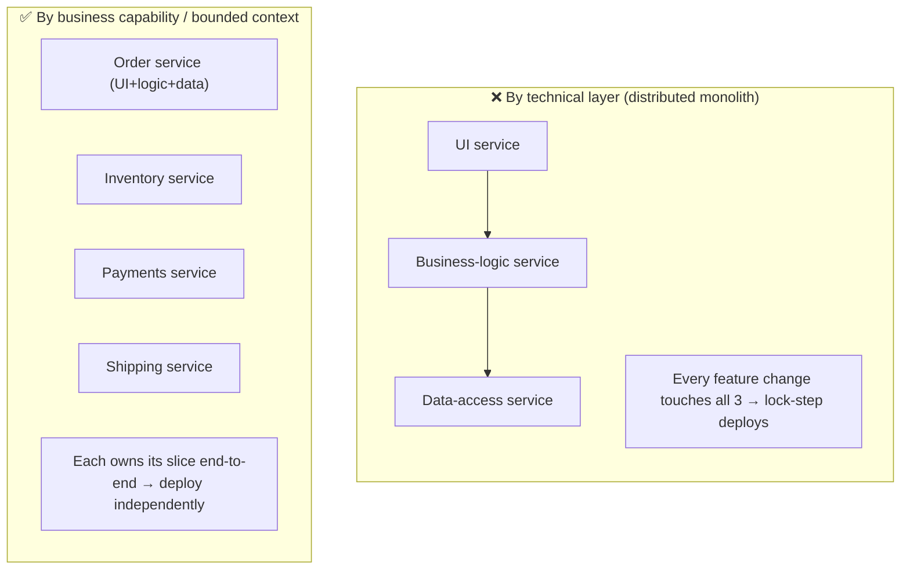
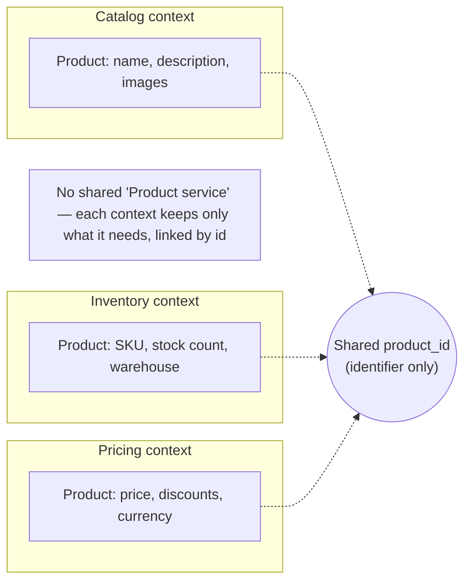

# Lesson 12.2 — Service Decomposition: By Business Capability, By Subdomain

> Part 12: Microservices · Difficulty: 🔴
>
> **Prerequisites:** [2.1.1 Cohesion/Coupling/Connascence], [2.1.3 Domain-Driven Design Essentials], [2.3.2 The Hard Parts], [12.1 Why/Why-Not Microservices].
> **Unlocks:** [12.3 Communication], [12.4 Data Management], [12.5 Saga & Outbox], [12.9 Migration].

---

## 1. Learning Objectives

After this lesson you will be able to:

- Explain why **service boundaries are the single most consequential decision** in a microservices architecture — and why getting them wrong produces a **distributed monolith** (12.1).
- Apply the two canonical decomposition strategies — **decompose by business capability** and **decompose by subdomain (DDD bounded contexts — 2.1.3)** — and explain how they relate.
- Use **cohesion and coupling** (2.1.1) as the objective test for a good boundary: high cohesion *within* a service, loose coupling *between* services.
- Identify decomposition **anti-patterns** (entity services, decomposition by technical layer, nano-services, the god service) and the smells that reveal a bad boundary.
- Handle the hard cases: **shared concepts across contexts**, **god classes**, and where to put logic that seems to belong everywhere.

---

## 2. Motivation — Boundaries are destiny

In 12.1 we decided *whether* to use microservices. This lesson answers the far harder question: **where do the boundaries go?** This is the decision that determines whether you get the benefits (independent deployability, team autonomy) or a **distributed monolith** (12.1 §3.6) — services so entangled that they must deploy together, share data, and chat constantly over the network, paying every cost of distribution for none of the benefits.

The stakes are asymmetric. Inside a monolith, a wrong module boundary is a **refactor** — move a class, adjust an import, done in an afternoon. Once that boundary becomes a **network boundary** between services with separate databases, separate deploy pipelines, and separate teams, fixing it means **migrating data across services, rewriting APIs, and coordinating multiple teams** — a project measured in months (12.1 §3.5). Boundaries drawn early, when you understand the domain least, are the ones that hurt most. That is why decomposition demands a **disciplined method** rather than intuition, and why the two methods that survive contact with reality — **by business capability** and **by subdomain** — both derive boundaries from the *business*, not from the technology or the data model. This lesson develops both, grounds them in cohesion/coupling (2.1.1) and DDD (2.1.3), and catalogs the anti-patterns that produce distributed monoliths.

---

## 3. Theory — From first principles

### 3.1 The goal of decomposition: a good boundary

`[CS]` A **service boundary** is good when it maximizes **independent changeability**. Concretely `[BP]`:
- **High cohesion within a service** (2.1.1): everything that **changes together** lives together — a single business responsibility, owning its data and logic. When a requirement changes, ideally **one service** changes.
- **Loose coupling between services** (2.1.1): services interact through **small, stable contracts** (12.3), know as little as possible about each other's internals, and can be **deployed independently**. A change inside one service should not force a change in another.
- **The litmus test** `[BP]`: *Can this service be developed, deployed, and scaled independently by a single team without lock-step coordination with others?* If yes, the boundary is doing its job; if changes constantly ripple across services, the boundary is wrong.

This is exactly the cohesion/coupling principle from 2.1.1 — microservices just raise the **cost of getting it wrong** because the boundary is now a network and a database wall, not a package name.

### 3.2 Decomposition by business capability

`[CS]` A **business capability** is *something a business does* to generate value — a stable, high-level function of the organization `[CS]`:
- Examples (e-commerce): **Order Management**, **Inventory**, **Payments**, **Shipping**, **Catalog**, **Pricing**, **Customer**.
- You derive capabilities by analyzing **what the business does** (its functions/operations), typically producing a hierarchy (capability → sub-capabilities).
- Each capability (or a cohesive group) becomes a **service**; the service owns everything needed to deliver that capability — its data, its rules, its API.

`[BP]` **Why capabilities make good boundaries:** business capabilities are **relatively stable** — a retailer will "manage inventory" and "take payments" for decades, even as *how* it does them changes. Stable boundaries mean stable service boundaries, which is exactly what you want (you don't want to re-draw network boundaries often — §3.1). Capabilities also align with how the business is **organized** (teams often already map to capabilities), which aligns architecture with org structure (Conway's Law — 12.1 §3.4).

### 3.3 Decomposition by subdomain (DDD)

`[CS]` **Domain-Driven Design** (2.1.3) offers the complementary, more rigorous method: decompose by **subdomain**, and make each service a **bounded context** `[CS]`:
- The **domain** is the whole problem space (e.g., "e-commerce"). It divides into **subdomains**:
  - **Core subdomain** — your competitive differentiator (where you invest most; e.g., a recommendation engine for a retailer).
  - **Supporting subdomain** — necessary but not differentiating (e.g., inventory).
  - **Generic subdomain** — solved problems, often buy-not-build (e.g., authentication, payments-via-provider).
- A **bounded context** (2.1.3) is a boundary within which a **domain model and its ubiquitous language are consistent** — the *same term means one thing* inside it. "Customer" in the Sales context (a lead with contact info) is a **different model** from "Customer" in the Support context (a ticket history) or Billing context (an account with payment methods).
- `[BP]` **Map each bounded context to a service** (or a small cluster of services). Because a bounded context is defined by *model consistency*, it produces **naturally cohesive, loosely-coupled** boundaries — the model inside is self-consistent, and contexts interact through explicit, translated contracts (context maps — §3.7).

### 3.4 Capability vs subdomain — how they relate

`[BP]` The two methods **usually converge** and are best used **together** `[OPINION]`:
- **Business capability** is the *outside-in, business-function* view — "what does the org do?" Good for the first-cut, coarse partition, and aligns with org/teams.
- **Subdomain/bounded context** is the *model-consistency* view — "where is the language and model consistent?" Good for validating and refining boundaries and for revealing where the *same word* hides *different models* (the classic source of bad boundaries).
- In practice: **start with business capabilities** to sketch coarse services, then **use DDD bounded contexts** to validate and sharpen them — especially to split a capability where two inconsistent models lurk, or to confirm two capabilities truly belong apart. Both derive boundaries from the **business/domain**, never from technical layers or the data model (§3.6).

### 3.5 Right-sizing: "micro" is not the point

`[BP]` **"Microservice" is a misleading name** — the goal is **right-sized services aligned to boundaries**, not maximally small ones `[OPINION]`:
- A service should be **as big as its bounded context / capability requires** and no bigger — cohesive around one responsibility.
- **Too big** (a "mini-monolith") → low cohesion, multiple teams contend, can't deploy independently → you haven't really decomposed.
- **Too small** ("nano-services") → excessive inter-service chatter, distributed transactions everywhere, operational overhead per trivial service → the costs of distribution amplified (12.1 §3.3). A rule of thumb `[BP]`: if two services are **always deployed and changed together**, they should be **one service**.
- The honest sizing heuristic: **one service per bounded context / team-ownable capability**, sized so a **single team owns it** and it changes for **one business reason**.

### 3.6 Anti-patterns — how boundaries go wrong

`[BP]` The classic decomposition anti-patterns (each produces a distributed monolith or worse):
- **Decomposition by technical layer** (the worst): a "UI service", "business-logic service", "data-access service". Every feature change touches **all three** → maximal coupling, zero independent deployability. Boundaries must be **vertical (by capability)**, not **horizontal (by layer)**.
- **Entity services / CRUD services:** one service per database *table/entity* ("Customer service", "Address service") with only CRUD. Real operations span many entities → chatty cross-service calls + distributed transactions; the logic ends up **outside** the services (anemic — 2.1.3). Model **behavior/capability**, not tables.
- **Nano-services:** over-fine services (§3.5) → chatter, latency, ops overhead.
- **The god service:** one service accretes too many responsibilities → becomes a distributed monolith's hub everything depends on (a coupling magnet).
- **Boundaries from the data model:** drawing services around the existing normalized schema rather than business behavior → entity services by another name.
- `[BP]` **The unifying rule:** decompose by **business capability / bounded context** (vertical slices that own behavior *and* data), never by technical layer or database table.

### 3.7 Hard cases: shared concepts, context mapping, and the "everywhere" logic

`[CS]`/`[BP]` The genuinely difficult parts of decomposition:
- **The same concept in multiple contexts:** "Product" means different things to Catalog (description, images), Inventory (stock count), and Pricing (price rules). **Don't** create one shared "Product service" everyone couples to (a god/entity service). Instead, **each context keeps its own model** of Product (just the attributes it needs), linked by a **shared identifier** — this is the bounded-context insight (§3.3) and it's what lets contexts evolve independently.
- **Context mapping (DDD — 2.1.3):** the relationships *between* contexts — **shared kernel**, **customer/supplier**, **conformist**, and the crucial **anti-corruption layer (ACL)** (a translation layer that stops one context's model from leaking into and corrupting another — revisited in migration, 12.9). Explicit context maps make coupling **visible and deliberate**.
- **Cross-cutting logic:** logic that seems to belong "everywhere" (e.g., tax calculation, notifications) → usually its **own supporting service** or a **shared library** for truly generic concerns (careful: shared libraries create coupling — use for stable, generic code only).
- **When in doubt, keep it together:** if you can't confidently place a boundary, **don't split yet** — a coarser service (or staying in the modular monolith — 12.1) is far cheaper to split later than a wrong split is to merge (§3.1, 12.9).

---

## 4. Visual Intuition

### Vertical (right) vs horizontal (wrong) decomposition

### The same concept, different models per context

---

## 5. Real-World Analogy

Think of reorganizing a **large hospital** into departments.

- **The wrong cut (by technical layer):** imagine splitting the hospital into a "**Reception** department," a "**Decision-Making** department," and a "**Records** department" — where *every* patient interaction must pass through all three: reception takes you in, decision-making decides everything for every specialty, records stores it. Every new treatment requires changing all three departments, and they can never work independently. This is **decomposition by layer** — nonsensical, yet it's exactly what "UI service / logic service / data service" does.
- **The right cut (by capability):** real hospitals organize by **capability/specialty** — **Cardiology**, **Oncology**, **Emergency**, **Radiology**. Each is **cohesive** (everything about heart care in one place), **owns its resources end-to-end** (its staff, equipment, records), and can **operate and change independently** (Cardiology adopts a new protocol without disrupting Oncology). This is **decomposition by business capability / bounded context**.
- **The same word, different meanings (bounded context):** the word "**patient**" means different things in different departments — to **Billing**, a patient is an account with insurance and charges; to **Radiology**, a patient is a set of scans and a body to image; to **Pharmacy**, a patient is a medication list and allergy profile. Forcing all departments to share **one giant "patient" definition** would couple them all together — every department would have to agree on every change. Instead, **each department keeps its own view of the patient**, linked by a shared **patient ID**. That's the bounded-context insight.
- **The anti-corruption layer:** when the modern Cardiology department must talk to the **ancient legacy records system** that uses obsolete terminology, it employs a **translator/liaison** who converts between the old system's language and Cardiology's modern model — so the legacy mess doesn't infect the new department. That's the **anti-corruption layer** (12.9).

---

## 6. Industry Example

- **Amazon's "two-pizza teams" ↔ service ownership** `[CONV]`: services sized so a small team owns each end-to-end — capability-aligned ownership (§3.2, 12.1 §3.4). *(Representative.)*
- **DDD strategic design in practice** `[BP]`: teams using **event storming / context mapping** workshops to discover bounded contexts before drawing service boundaries (§3.3/3.7). *(Representative.)*
- **The "shared Customer/Product service" trap** `[OPINION]`: organizations that built a central entity service everyone depends on, then found it became a coupling bottleneck that must change for everyone (§3.6). *(Representative.)*
- **Monzo/other banks' service maps** `[CONV]`: fine-grained services organized around banking capabilities (payments, accounts, ledger, cards) with explicit inter-service contracts. *(Representative — sizing philosophy varies widely across orgs.)*
- **The distributed monolith from layer-decomposition** `[OPINION]`: teams that split "frontend/backend/db" into services and then had to deploy all three for every feature (§3.6). *(Representative.)*

---

## 7. Implementation Details — how to actually decompose

- **Start from the business, outside-in** `[BP]`: enumerate **business capabilities** (§3.2) for the coarse partition; run **event storming / domain modeling** (2.1.3) to find **bounded contexts** (§3.3) and validate/refine the capability boundaries.
- **Draw vertical slices** (§3.6): each service owns its **UI-facing API + logic + data** for one capability — never a horizontal layer.
- **Assign each service its own data** (database-per-service — 12.4): if two "services" can't own separate data, they're probably one service.
- **Map the same concept per context** (§3.7): each context keeps only the attributes it needs, linked by a shared **identifier**; no shared entity service.
- **Draw the context map** (§3.7): make inter-context relationships explicit (customer/supplier, conformist, ACL) so coupling is deliberate.
- **Right-size** (§3.5): one service per team-ownable capability; if two are always changed/deployed together, merge them.
- **Decompose incrementally** (12.9): extract one well-bounded capability at a time from the monolith (strangler fig) rather than a big-bang split; you learn the boundaries as you go.
- **Prefer a coarser cut when unsure** (§3.7): under-splitting is cheap to fix (split later); over-splitting/wrong boundaries are expensive to fix (merge/re-draw across the network).

---

## 8. Advantages (of principled decomposition)

- **Real independent deployability** — vertical, cohesive services deploy without rippling (§3.1, 12.1 §3.2).
- **Team autonomy** — one team owns one capability end-to-end (Conway's Law — 12.1 §3.4).
- **Stable boundaries** — capabilities/subdomains change slowly, so service boundaries stay stable (§3.2).
- **Independent evolvability** — each context evolves its own model without coordinating with others (§3.7).
- **Cohesion/loose coupling by construction** — boundaries derived from model consistency are naturally cohesive (2.1.1/§3.3).

---

## 9. Disadvantages / costs

- **Hard, judgment-heavy, and requires domain expertise** — good decomposition needs deep domain understanding you often lack early (§3.1, 12.1 §3.5).
- **Expensive to get wrong** — a wrong boundary baked into the network + separate DBs is very costly to fix (§3.1).
- **Requires DDD/modeling skill** — event storming, context mapping, ubiquitous language are non-trivial disciplines (§3.3).
- **Duplicated concepts** — the same concept modeled in multiple contexts feels like duplication (it's actually decoupling — §3.7) and needs identifier discipline.
- **Ongoing boundary maintenance** — as the domain evolves, boundaries may need to shift (a hard, cross-service operation).

---

## 10. When NOT to decompose (yet)

- **When you don't understand the domain** — draw boundaries you'll regret; stay a **modular monolith** (12.1 §3.5) with clean internal module boundaries until the domain is clear.
- **When there's no concrete trigger** (12.1 §3.6) — don't split for its own sake.
- **When two candidate services always change together** — they're one service (§3.5).
- **When the split would create chatty synchronous chains / distributed transactions** for a naturally cohesive operation — keep it together (§3.5, 12.4).
- **For a small team** — the coordination benefit of separate services doesn't apply yet (12.1 §3.4).

---

## 11. Common Mistakes

1. **Decomposing by technical layer** (UI/logic/data) → the worst distributed monolith (§3.6).
2. **Entity/CRUD services** (one per table) → chatty, anemic, distributed transactions everywhere (§3.6).
3. **A shared "Customer/Product" god service** everyone couples to → coupling bottleneck (§3.6/3.7).
4. **Nano-services** → chatter, latency, ops overhead (§3.5).
5. **Boundaries from the existing schema** rather than business behavior (§3.6).
6. **Splitting before understanding the domain** → wrong, costly-to-fix boundaries (§3.1, 12.1 §3.5).
7. **Ignoring the ubiquitous language** — the same word meaning different things across contexts is the #1 signal you have separate contexts (§3.3/3.7); missing it merges things that should be split.
8. **Big-bang decomposition** — split everything at once instead of incrementally (§3.7, 12.9).

---

## 12. Interview Questions

**🟢 Easy**
- What is a business capability? What is a bounded context?
- Why is decomposing by technical layer (UI/logic/data services) a bad idea?

**🟡 Medium**
- Compare decomposition by business capability vs by subdomain. How do you use them together?
- What are entity/CRUD services and why are they an anti-pattern? What should you model instead?

**🔴 Hard**
- The word "Product" appears in Catalog, Inventory, and Pricing. Should there be one Product service? Explain your answer using bounded contexts and identifiers.
- How do you right-size a service? What smells tell you a service is too big or too small?

**⚫ Staff+**
- You're decomposing a large e-commerce monolith. Walk through your method (capabilities → bounded contexts → context map → incremental extraction), how you'd validate boundaries with cohesion/coupling, avoid the distributed-monolith and entity-service traps, and handle a concept shared across contexts.
- A team split their system into "frontend-service / backend-service / db-service" and now every feature requires deploying all three. Diagnose the problem, explain the correct decomposition, and describe how you'd migrate to it without a big-bang rewrite (12.9).

---

## 13. Production Pitfalls

- **The distributed monolith from bad boundaries:** services that must deploy together / share data / chat constantly — the direct result of layer- or entity-decomposition (§3.6, 12.1 §3.6).
- **The coupling-magnet god service:** a central service everything depends on becomes a change bottleneck and a availability SPOF (§3.6).
- **Chatty cross-service operations:** an operation that spans many too-fine services generates N network calls + partial-failure handling for what was one function (§3.5, 8.1.1).
- **Distributed transactions everywhere:** entity services force cross-service atomic operations → sagas for what should have been one local transaction (§3.6, 12.5).
- **Wrong boundary discovered late:** the domain turned out different from the initial guess; re-drawing network boundaries is a multi-team, multi-month project (§3.1).
- **Model leakage:** without anti-corruption layers, one context's model leaks into another and couples them (§3.7, 12.9).

---

## 14. Optimization Techniques

> *Mostly "decompose well," which is a design activity.*

- **Event storming / domain modeling** (2.1.3) to discover real boundaries before coding `[BP]`.
- **Cohesion/coupling as the objective test** (2.1.1): boundaries that maximize within-cohesion and minimize cross-coupling (§3.1).
- **Bounded contexts with per-context models + shared identifiers** to decouple shared concepts (§3.7).
- **Explicit context maps + anti-corruption layers** to make and manage coupling deliberately (§3.7, 12.9).
- **Right-size to team ownership** — one team, one capability, one business reason to change (§3.5).
- **Incremental extraction (strangler fig — 12.9)** — extract one capability at a time, learning boundaries empirically.
- **Bias to coarser services when unsure** — merging is easier than un-merging across the network (§3.7).

---

## 15. Summary

**Service decomposition** — deciding *where the boundaries go* — is the **most consequential decision** in a microservices architecture, because the boundary becomes a **network + database wall** whose mistakes are enormously costly to fix (unlike a monolith's module boundary, a cheap refactor). A **good boundary** maximizes **independent changeability**: **high cohesion within** a service (everything that changes together lives together — one business responsibility, owning its data) and **loose coupling between** services (small stable contracts, independent deployment) — exactly the cohesion/coupling principle (2.1.1), litmus-tested by "*can one team develop/deploy/scale this independently?*". Two canonical methods, both deriving boundaries from the **business** (never from technical layers or the data model): **decompose by business capability** (what the business *does* — Order/Inventory/Payments/Shipping — stable, org-aligned, good for the coarse first cut) and **decompose by subdomain / bounded context** (DDD — 2.1.3 — a boundary of **model + ubiquitous-language consistency**, where the *same term means one thing*; map each context to a service). They **converge and combine**: start with capabilities, refine with bounded contexts — especially to split where the *same word hides different models*. **"Micro" is not the goal** — **right-size** to one team-ownable capability (too big = mini-monolith; too small = nano-service chatter; if two are always changed together, merge them). The **anti-patterns** all produce a distributed monolith: **decomposition by technical layer** (UI/logic/data — the worst), **entity/CRUD services** (one per table — anemic + chatty + distributed transactions), **nano-services**, the **god service**, and **boundaries drawn from the schema**. The **hard cases**: a concept appearing in many contexts (e.g., "Product") should **not** become one shared entity service — **each context keeps its own model linked by a shared identifier** (the bounded-context insight); inter-context relationships are made explicit via **context maps** and protected by **anti-corruption layers** (12.9); cross-cutting logic gets its own supporting service or a carefully-scoped shared library; and **when unsure, don't split** — a coarser service (or the modular monolith — 12.1) is cheap to split later, while a wrong split is expensive to merge. Decompose from the business, incrementally (strangler fig — 12.9), along real seams — and let cohesion/coupling be the judge.

---

## 16. Revision Notes (flashcard-ready)

- **Q:** What makes a good service boundary? **A:** High cohesion within (changes together, owns its data) + loose coupling between (small stable contracts, independent deploy).
- **Q:** Two decomposition methods? **A:** By business capability (what the business does) and by subdomain/bounded context (DDD — model+language consistency).
- **Q:** How do they combine? **A:** Start with capabilities for the coarse cut; refine/validate with bounded contexts; both derive boundaries from the business.
- **Q:** What is a bounded context? **A:** A boundary within which a domain model and its ubiquitous language are consistent (same term = one meaning).
- **Q:** Why not decompose by technical layer? **A:** Every feature touches all layers → maximal coupling, no independent deployment (worst distributed monolith).
- **Q:** Why not entity/CRUD services? **A:** Real operations span entities → chatty cross-service calls + distributed transactions + anemic (logic outside).
- **Q:** "Product" in Catalog/Inventory/Pricing — one service? **A:** No — each context keeps its own model with only what it needs, linked by a shared identifier.
- **Q:** Right-sizing rule of thumb? **A:** One team-ownable capability, one business reason to change; if two are always changed/deployed together, merge them.
- **Q:** What is an anti-corruption layer? **A:** A translation layer that stops one context's (e.g., legacy) model from leaking into and corrupting another.
- **Q:** When unsure about a boundary? **A:** Don't split — coarser is cheap to split later; wrong split is expensive to merge across the network.
- **Q:** The unifying decomposition rule? **A:** Vertical slices by capability/bounded context (own behavior + data), never horizontal layers or tables.

---

## 17. Further Reading + Knowledge-Graph Links

**Foundations (in-platform):**
- **[2.1.1 Cohesion/Coupling/Connascence]** — the objective test for a good boundary.
- **[2.1.3 Domain-Driven Design Essentials]** — bounded contexts, ubiquitous language, aggregates, context maps.
- **[2.3.2 The Hard Parts]** — decomposition, data ownership, communication tradeoffs.
- **[12.1 Why/Why-Not Microservices]** — the distributed-monolith trap, monolith-first, triggers.

**Unlocks / next:**
- **[12.3 Inter-Service Communication]** — the contracts across the boundaries you drew.
- **[12.4 Data Management]** — database-per-service, distributed query across contexts.
- **[12.5 Saga & Outbox]** — cross-service consistency when operations span boundaries.
- **[12.9 Migration]** — strangler fig + anti-corruption layer to decompose incrementally.

**External (canonical):**
- Newman, *Building Microservices* (2nd ed.) — decomposition, bounded contexts.
- Richardson, *Microservices Patterns* — decompose by business capability / by subdomain.
- Evans, *Domain-Driven Design* & Vernon, *Implementing DDD* — strategic design, context mapping.
- Ford/Richards, *Software Architecture: The Hard Parts* — decomposition & data ownership.

> **Knowledge-graph:** `2.1.3 DDD` + `2.1.1 cohesion/coupling` → **`12.2 Decomposition`** → `12.3 Communication` / `12.4 Data` / `12.5 Saga` / `12.9 Migration`.
