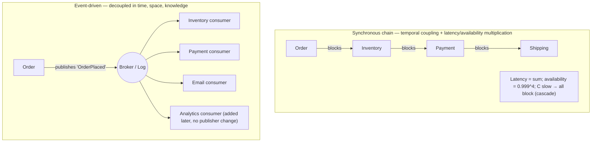
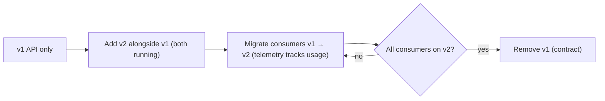

# Lesson 12.3 — Inter-Service Communication: Sync vs Async, API Design, Versioning

> Part 12: Microservices · Difficulty: 🔴
>
> **Prerequisites:** [3.2.6 API Styles & Serialization], [4.3.1 Data Encoding & Schema Evolution], [8.4.1 RPC Semantics/Failure Modes/Idempotency], [9.1 Messaging Fundamentals], [11.3 Resilience Patterns], [12.2 Decomposition].
> **Unlocks:** [12.4 Data Management], [12.5 Saga & Outbox], [12.6 Discovery/Gateway/BFF], [12.8 Testing].

---

## 1. Learning Objectives

After this lesson you will be able to:

- Choose between **synchronous request/response** and **asynchronous messaging** for a given interaction, and explain the **coupling implications** of each.
- Explain why **synchronous call chains** create **temporal coupling**, **latency amplification**, and **cascading-failure** risk — and how async messaging + events break that coupling.
- Design **stable, evolvable APIs** across service boundaries, applying **schema evolution** (4.3.1) for backward/forward compatibility.
- Apply **API versioning** strategies and the discipline of **not breaking consumers**.
- Wrap every synchronous call in the **resilience patterns** (11.3) and make every interaction **idempotent** (11.5) — because inter-service calls are network calls (8.1.1).

---

## 2. Motivation — The network is the hard part

Once 12.2 draws the boundaries, the services must **talk** — and this is where microservices earn their reputation for difficulty. Inside a monolith, one component calls another with an **in-process method call**: reliable, sub-microsecond, transactional, and impossible to "half-fail." Across services, that same interaction becomes a **network call** (8.1.1): it can be **lost, delayed, or duplicated**; it's **thousands of times slower**; it can **fail ambiguously** (you can't tell "it didn't run" from "it ran but the reply was lost" — 8.4.1); and it can **cascade** — if service B is slow, every caller of B backs up (11.3). Every inter-service interaction is a **distributed-systems problem** (12.1 §3.3).

The single most important decision is **synchronous vs asynchronous** communication, because it determines the **coupling** between services — and coupling is what microservices exist to reduce (12.2). Synchronous request/response is intuitive and often necessary, but it creates **temporal coupling** (both services must be up *at the same time*) and turns independent services into a **latency- and failure-linked chain**. Asynchronous messaging (Part 9) decouples services in **time** and **space**, but pays with eventual consistency and added complexity. On top of the transport choice sits the **API contract** — the promise one service makes to its callers — which must be designed to **evolve without breaking consumers** (4.3.1), because in microservices you **cannot deploy all services atomically** (that's the whole point). This lesson develops the sync/async decision, API design, and versioning as the discipline of communicating across boundaries safely.

---

## 3. Theory — From first principles

### 3.1 The two communication styles

`[CS]` Inter-service communication is fundamentally either:
- **Synchronous (request/response):** the caller **sends a request and waits (blocks)** for a response — e.g., **REST over HTTP**, **gRPC** (3.2.6). The caller needs the answer **now** to proceed.
- **Asynchronous (message/event):** the sender **sends a message and does not wait** — it's delivered via a **broker/log** (Part 9) to be processed later. Includes **commands** (do this) and **events** (this happened). The sender proceeds immediately.

`[CS]` A crucial sub-distinction for async: **one-to-one messaging** (a command to one consumer, like a queue — 9.1) vs **publish/subscribe events** (an event broadcast to many interested consumers — 9.1/2.2.4). Events are the backbone of **event-driven microservices** (2.2.4) and enable the deepest decoupling (§3.4).

### 3.2 Coupling: the real axis of the decision

`[CS]` The decision is really about **coupling** (2.1.1):
- **Temporal coupling:** synchronous calls require **both services to be available simultaneously** — if the callee is down/slow, the caller is blocked/failed. Async **removes** temporal coupling: the sender fires a message and moves on; the receiver processes when able (even if it was down — the message waits in the broker).
- **Behavioral/afferent coupling:** synchronous request/response means the caller **knows about and depends on** the callee (it calls it by name, expects a specific response). Events **invert** this: the publisher doesn't know or care who consumes the event → the deepest decoupling (§3.4).
- `[BP]` **The heuristic:** synchronous couples services in **time and knowledge**; asynchronous decouples them. Since microservices exist to **decouple**, **prefer async where the interaction allows it** — but not dogmatically (some interactions genuinely need a synchronous answer — §3.5).

### 3.3 The cost of synchronous chains

`[CS]` Chained synchronous calls (A→B→C→D) are the source of major microservices pain:
- **Latency amplification:** total latency is the **sum** of the chain (plus each hop's network cost — 8.1.1); tail latency compounds (a slow tail anywhere slows the whole request — Part 17).
- **Availability multiplication:** if each service is 99.9% available, a chain of *n* synchronous dependencies has availability ≈ **0.999ⁿ** — availability **degrades multiplicatively**. A request depending synchronously on 10 services at 99.9% each is only ~99% available.
- **Cascading failure:** if C is slow, B's threads block waiting on C, then A's threads block waiting on B → the slowness **propagates upstream** and can collapse the whole system (a **metastable failure** — 11.3). This is *the* classic microservices outage.
- `[BP]` **Mitigations** (all from 11.3): timeouts (never wait forever), retries with backoff+jitter (carefully — can amplify load), **circuit breakers** (stop calling a failing dependency), **bulkheads** (isolate thread pools per dependency), and — most fundamentally — **reduce synchronous fan-out/chaining** (prefer async, cache, or data replication — 12.4).

### 3.4 Why events decouple deepest

`[CS]` **Event-driven communication** (2.2.4, Part 9) is the strongest decoupler:
- A service **publishes an event** ("OrderPlaced") to a broker/log and moves on; **any number of consumers** subscribe and react (update inventory, send email, update analytics) — the publisher **doesn't know they exist**.
- **Adding a new consumer** requires **no change to the publisher** → new features without touching existing services (open/closed at the architecture level).
- Services are decoupled in **time** (broker buffers), **space** (don't know each other's location), and **knowledge** (publisher doesn't know consumers).
- This underpins **choreographed sagas** (11.7/12.5), **CDC/outbox** (9.8/12.5), and **CQRS read models** (12.4).
- `[BP]` **The cost:** eventual consistency (consumers react *later* — 10.x), harder end-to-end reasoning/debugging (need tracing — Part 16), and the need for idempotent consumers (9.5/11.5). Events trade **simplicity of reasoning** for **decoupling and resilience**.

### 3.5 Choosing sync vs async

`[BP]` A practical decision guide:
- **Use synchronous** when the caller **genuinely needs the answer now to proceed** and can't continue without it: **queries** (read this data to render a response), **user-facing reads**, and interactions where an immediate confirmation is required. Keep synchronous **chains short** (§3.3).
- **Use asynchronous** when: the work can happen **later** (fire-and-forget commands, notifications), you want to **decouple** producer and consumers (events), you need to **absorb load spikes** (broker as buffer — 9.9), or you're doing **cross-service workflows** (sagas — 12.5). **Prefer async for writes/side-effects** that don't need a synchronous answer.
- **Common hybrid:** synchronous for the **read path** (queries the user waits on), asynchronous **events** for the **write/side-effect path** (propagate changes, trigger downstream work) — often with **CQRS** (12.4) so reads hit a local replica instead of a synchronous call.
- `[BP]` **Reduce the need to communicate at all:** the best inter-service call is the one you don't make. Good boundaries (12.2) minimize cross-service chatter; **data replication / CQRS read models** (12.4) let a service answer locally instead of calling another synchronously.

### 3.6 API design across boundaries

`[BP]` The **API contract** is the promise a service makes; across services it must be **stable and evolvable** `[BP]`:
- **Coarse-grained APIs:** design operations around **business use-cases**, not fine-grained entity CRUD — one call that does a meaningful unit of work, to avoid chatty round-trips (the fallacies — 8.1.1; contrast entity services — 12.2).
- **Contract-first / explicit contracts:** define the interface explicitly (OpenAPI for REST, `.proto` for gRPC — 3.2.6) — the contract is the boundary; treat it as a **published interface** with all the stability obligations that implies.
- **Hide internals:** the API exposes a **stable abstraction**, not the service's internal data model — so the service can change internally without breaking callers (encapsulation — 2.1.1). Never expose your database schema as your API.
- **Style choice** (3.2.6): **REST** (broad, cacheable, loosely-coupled, great for public/edge), **gRPC** (efficient, typed, streaming, great for internal service-to-service), **GraphQL** (client-driven aggregation, often at a BFF/gateway — 12.6), **async events** (Part 9, decoupling). Choose per interaction.

### 3.7 Schema evolution & versioning — never break consumers

`[CS]`/`[BP]` Because you **cannot deploy all services atomically** (12.1), APIs and message schemas **must evolve compatibly** (4.3.1) `[BP]`:
- **Backward compatibility** (new code reads old data/requests) and **forward compatibility** (old code reads new data/requests) — the schema-evolution discipline from 4.3.1. **Practically:** only make **additive, optional** changes — add optional fields; **never remove/rename/repurpose** a field or change its type or semantics in place.
- **Tolerant reader** `[BP]`: consumers should **ignore unknown fields** and not break on additions (Postel's law) — enables producers to add fields freely. Formats like **Protobuf/Avro** (4.3.1) support this by design.
- **When a breaking change is unavoidable → version:**
  - **Explicit API versions** (`/v1/`, `/v2/`, or a header/gRPC package version) and **run both versions in parallel** during a migration window.
  - **Expand/contract (parallel change):** add the new field/version (expand) → migrate consumers → remove the old (contract) — **only after all consumers moved** (mirrors zero-downtime schema migration — 5.4.3).
  - **Consumer-driven contracts** (12.8) verify you haven't broken any consumer *before* you deploy.
- `[BP]` **The golden rule:** **a provider must never break its consumers.** In a system you can't deploy atomically, compatibility *is* the contract. Deprecate slowly, with communication and telemetry on who still uses the old version.

### 3.8 Every call is a distributed-systems call

`[BP]` Regardless of style, every inter-service interaction inherits Parts 8–11:
- **Wrap synchronous calls** in timeouts + retries(backoff/jitter) + circuit breakers + bulkheads (11.3) — often provided by a **service mesh** (12.7).
- **Make everything idempotent** (11.5, 8.4.1): retries and redelivery are inevitable → operations must be safe to repeat (idempotency keys / dedup / state-based).
- **Design for partial failure** (8.1.1): assume the callee may be down/slow; have a fallback or degrade (11.4).
- **Propagate tracing context** (Part 16): a request spanning services needs distributed tracing to debug.
- **Secure the calls:** mTLS/authZ between services (12.7/Part 15) — the network is not trusted (zero-trust).

---

## 4. Visual Intuition

### Sync chain (coupled) vs event-driven (decoupled)

### Expand/contract API versioning (never break consumers)

---

## 5. Real-World Analogy

Think of two ways colleagues coordinate: a **phone call** (synchronous) vs **email/a shared bulletin board** (asynchronous).

- **The phone call (synchronous):** you call a colleague and **wait on the line** until they answer and give you the information. It's immediate and conversational — great when you need an answer *right now* to continue. But it has costs: they **must be at their desk** (temporal coupling — if they're out, you're blocked); if you need info that requires *them* to call *someone else* while you hold, and that person calls a fourth, you're all **stuck on a chain of holds** (latency amplification + cascade); and if any person in the chain is unavailable, the whole call fails.
- **Email / the bulletin board (asynchronous):** you **send a message and hang up** — get on with your day. Your colleague reads and acts when they can (even if they were out this morning — the message waited). Better still, you **post an announcement on the shared board** ("the Q3 report is ready") and **anyone who cares** reacts — you don't need to know who's interested, and a **new team** can start reacting next year **without you changing anything**. That's event-driven decoupling. The cost: things happen **eventually, not instantly**, and if you need to trace "what happened to my request," you have to follow the trail across many people's inboxes (distributed tracing).
- **The contract (API + versioning):** when you send that email, you use a **format everyone understands**. If you start adding new fields, you do it so **old readers still cope** (they ignore the new bits — tolerant reader). If you must change the format fundamentally, you **run the old and new formats in parallel** and give everyone time to switch **before** you retire the old one — because if you change the format overnight, you break everyone who hasn't updated. **You never break your readers.**

---

## 6. Industry Example

- **gRPC for internal service-to-service, REST/GraphQL at the edge** `[CONV]`: many orgs use efficient typed gRPC between internal services and REST/GraphQL (via a gateway/BFF — 12.6) for external clients (§3.6, 3.2.6). *(Representative.)*
- **Event-driven backbones (Kafka-style logs)** `[CONV]`: services publish domain events to a distributed log; many consumers react; new consumers added without touching producers (§3.4, Part 9). *(Representative.)*
- **The synchronous-chain cascade outage** `[OPINION]`: documented microservices outages where one slow dependency caused upstream thread-pool exhaustion and system-wide collapse — fixed with timeouts/circuit breakers/bulkheads (§3.3, 11.3). *(Representative.)*
- **Protobuf/Avro schema registries** `[CONV]`: teams enforce backward/forward-compatible schema evolution via a schema registry for events (§3.7, 4.3.1). *(Representative.)*
- **Consumer-driven contract testing (Pact-style)** `[CONV]`: providers verify against consumer expectations in CI before deploy (§3.7, 12.8). *(Representative.)*

---

## 7. Implementation Details — communicating safely

- **Choose style per interaction** (§3.5): synchronous for queries the caller must have now (keep chains short); asynchronous events for side-effects, decoupling, load absorption, and workflows.
- **Prefer events for cross-service writes/side-effects** (§3.4); use **CQRS/replicated read models** (12.4) to avoid synchronous read chains.
- **Design coarse-grained, use-case APIs** (§3.6) — not chatty entity CRUD; hide internal models behind a stable contract; contract-first (OpenAPI/`.proto`).
- **Evolve compatibly** (§3.7): additive/optional changes only; tolerant readers; Protobuf/Avro + schema registry; version + expand/contract only when a break is unavoidable; verify with consumer-driven contracts (12.8).
- **Wrap every sync call** in timeout + retry(backoff/jitter) + circuit breaker + bulkhead (11.3); often via a **service mesh** (12.7).
- **Make everything idempotent** (11.5/8.4.1); design for partial failure + fallbacks (11.4/8.1.1).
- **Propagate trace context** (Part 16) and **secure calls** (mTLS/authZ — 12.7/Part 15).
- **Minimize communication** (§3.5): the best call is the one you don't make — good boundaries (12.2) + local data (12.4).

---

## 8. Advantages

- **Async/events:** deep decoupling (time/space/knowledge), resilience (broker buffers failures/spikes), extensibility (add consumers freely), enables sagas/CQRS/CDC (§3.4).
- **Sync:** simple, immediate, easy to reason about for queries; strong request/response semantics (§3.5).
- **Good API design:** stable contracts + compatible evolution let services deploy independently (the core microservices benefit — §3.6/3.7).
- **Resilience-wrapped calls:** prevent cascades, contain failures (§3.3/3.8, 11.3).

---

## 9. Disadvantages / costs

- **Sync chains:** temporal coupling, latency amplification, availability multiplication, cascade risk (§3.3).
- **Async/events:** eventual consistency, harder reasoning/debugging (needs tracing), requires idempotent consumers + duplicate/ordering handling (§3.4, 9.5).
- **Versioning/compatibility burden:** must maintain compatibility and run parallel versions; deprecation is slow and coordinated (§3.7).
- **Operational complexity:** brokers, schema registries, service mesh, tracing — all infrastructure to run (12.6/12.7, Part 16).
- **Every call is a distributed-systems problem** — timeouts/retries/idempotency/security on every interaction (§3.8).

---

## 10. When NOT to use each

- **Don't use synchronous** for long chains, side-effects that can be async, or anything that can tolerate eventual processing — you're multiplying latency/availability risk (§3.3/3.5).
- **Don't use asynchronous** when the caller genuinely needs an immediate answer to proceed (a user waiting on a query) — forcing async there adds latency and complexity (§3.5).
- **Don't expose fine-grained/CRUD/internal-model APIs** across services — chatty + brittle (§3.6, 12.2).
- **Don't make breaking API changes** without versioning + parallel-run + consumer migration (§3.7).
- **Don't skip resilience/idempotency** on any inter-service call (§3.8).

---

## 11. Common Mistakes

1. **Deep synchronous chains** → latency/availability multiplication + cascades (§3.3).
2. **Treating remote calls like local calls** — ignoring the fallacies (8.1.1); no timeout/retry/idempotency (§3.8).
3. **Chatty fine-grained APIs** — N round-trips for one use-case (§3.6).
4. **Exposing the internal data model as the API** — can't change internals without breaking callers (§3.6).
5. **Breaking changes without versioning** — deploying a provider change that breaks consumers (§3.7).
6. **Non-idempotent consumers/handlers** — retries/redelivery cause duplicates/corruption (§3.8, 11.5).
7. **Distributed monolith via sync coupling** — services that can't function unless all are up (§3.2, 12.1).
8. **No distributed tracing** — impossible to debug a multi-service request (§3.8, Part 16).

---

## 12. Interview Questions

**🟢 Easy**
- What's the difference between synchronous and asynchronous inter-service communication?
- What is an event, and how does publish/subscribe decouple services?

**🟡 Medium**
- Why do synchronous call chains hurt latency and availability? Give the availability math for a chain of n dependencies.
- How do you evolve an API without breaking consumers? What is a tolerant reader?

**🔴 Hard**
- When would you choose async events over synchronous calls, and vice versa? Describe a hybrid (sync reads + async write events + CQRS).
- Walk through a cascading failure caused by a synchronous chain and the exact patterns that prevent it (11.3).

**⚫ Staff+**
- Design the communication architecture for an order-processing system across Order/Inventory/Payment/Shipping services: which interactions are sync vs async, how you version APIs/events, how you prevent cascades, and how you keep it from becoming a distributed monolith.
- You must make a breaking change to a widely-consumed API/event schema in a system you can't deploy atomically. Describe the full expand/contract + versioning + consumer-driven-contract process to do it safely.

---

## 13. Production Pitfalls

- **Cascade from a slow dependency:** one slow service exhausts upstream thread pools → system-wide collapse (§3.3, 11.3 metastable failure).
- **Retry storms:** naive retries on a struggling service amplify load and worsen the outage (§3.8, 11.3 — need backoff/jitter/budgets/circuit breakers).
- **Silent breaking change:** a provider removes/renames a field; consumers break in production because there was no compatibility discipline (§3.7).
- **Duplicate side-effects:** non-idempotent handler + at-least-once delivery → double charges/double sends (§3.8, 11.5/9.5).
- **Chatty fan-out latency:** a request fans out to many services synchronously → tail latency explodes (§3.3, Part 17).
- **Undebuggable requests:** no trace context propagation → can't follow a request across services during an incident (§3.8, Part 16).

---

## 14. Optimization Techniques

- **Prefer async/events** to remove temporal coupling and absorb spikes (§3.4/3.5).
- **Reduce synchronous fan-out** — cache, batch, or replicate data locally (CQRS read models — 12.4) so a service answers without calling others (§3.5).
- **Coarse-grained use-case APIs** to cut round-trips (§3.6); batch/aggregate at a BFF/gateway (12.6).
- **Circuit breakers + bulkheads + timeouts** to cap and isolate failure (§3.3/3.8, 11.3).
- **Efficient protocols** (gRPC/Protobuf) for internal high-volume paths (3.2.6).
- **Schema registry + tolerant readers** for cheap, safe evolution (§3.7).
- **Service mesh** (12.7) to offload resilience/mTLS/tracing from application code.

---

## 15. Summary

Once boundaries are drawn (12.2), services must **communicate over the network** — and every interaction inherits the distributed-systems reality (8.1.1): loss, latency, ambiguity, and cascade risk. The pivotal choice is **synchronous request/response** (REST/gRPC — caller blocks for an answer) vs **asynchronous messaging/events** (send-and-forget via a broker/log — Part 9), and the real axis is **coupling**: synchronous couples services in **time** (both must be up) and **knowledge** (caller knows the callee); asynchronous **decouples** them, and **events** decouple deepest (publisher doesn't know its consumers → add consumers without touching the producer). **Synchronous chains** are the classic microservices trap: latency **sums**, availability **multiplies** (0.999ⁿ), and a slow dependency **cascades** upstream into a metastable collapse — mitigated by timeouts + retries(backoff/jitter) + **circuit breakers** + **bulkheads** (11.3) and, more fundamentally, by **reducing synchronous fan-out** (prefer async, cache, or replicate data — CQRS read models — 12.4). The practical guide: **synchronous** for queries the caller must have now (keep chains short); **asynchronous events** for side-effects, decoupling, load absorption, and cross-service workflows (sagas — 12.5) — often a **hybrid** (sync reads + async write events + CQRS). The **API contract** is the boundary's promise: design **coarse-grained, use-case** APIs (not chatty entity CRUD), **hide the internal data model** behind a stable abstraction, and **evolve compatibly** (4.3.1) — additive/optional changes, tolerant readers, Protobuf/Avro + schema registry — because you **cannot deploy all services atomically**. When a breaking change is unavoidable, **version** and use **expand/contract** (add v2 alongside v1 → migrate consumers → remove v1 only after all moved), verified by **consumer-driven contracts** (12.8): **a provider must never break its consumers**. And regardless of style, **wrap every call in resilience** (11.3), make **everything idempotent** (11.5/8.4.1), **design for partial failure** (11.4), and **propagate tracing + secure with mTLS** (Part 16/12.7). The best inter-service call is the one you don't have to make — good boundaries (12.2) and local data (12.4) minimize communication.

---

## 16. Revision Notes (flashcard-ready)

- **Q:** Sync vs async, core difference? **A:** Sync = caller blocks for a response (REST/gRPC); async = send-and-forget via broker/log (commands/events).
- **Q:** The real axis of the decision? **A:** Coupling — sync couples in time+knowledge; async decouples; events decouple deepest.
- **Q:** Why do sync chains hurt? **A:** Latency sums, availability multiplies (0.999ⁿ), slow dependency cascades upstream (metastable failure).
- **Q:** How to mitigate sync-chain risk? **A:** Timeout + retry(backoff/jitter) + circuit breaker + bulkhead (11.3); and reduce fan-out (async/cache/replicate).
- **Q:** Why do events decouple deepest? **A:** Publisher doesn't know consumers → add new consumers without changing the producer.
- **Q:** When to use sync vs async? **A:** Sync for queries you need now (short chains); async events for side-effects/decoupling/load/workflows. Often hybrid.
- **Q:** API design across services? **A:** Coarse-grained use-case APIs, hide internal model behind a stable contract, contract-first.
- **Q:** How to evolve APIs safely? **A:** Additive/optional changes, tolerant readers, Protobuf/Avro; version + expand/contract only when a break is unavoidable.
- **Q:** The golden rule of API evolution? **A:** A provider must never break its consumers (you can't deploy atomically).
- **Q:** What must wrap every inter-service call? **A:** Resilience (timeouts/retries/breaker/bulkhead), idempotency, partial-failure handling, tracing, mTLS.

---

## 17. Further Reading + Knowledge-Graph Links

**Foundations (in-platform):**
- **[3.2.6 API Styles & Serialization]** — REST/gRPC/GraphQL, Protobuf/Avro/Thrift.
- **[4.3.1 Data Encoding & Schema Evolution]** — backward/forward compatibility, tolerant readers.
- **[8.4.1 RPC Semantics/Failure Modes/Idempotency]** — why remote ≠ local; ambiguous failures.
- **[9.1 Messaging Fundamentals]** / **[2.2.4 Event-Driven Architecture]** — async, queues/topics, events.
- **[11.3 Resilience Patterns]** — timeout/retry/circuit-breaker/bulkhead against cascades.

**Unlocks / next:**
- **[12.4 Data Management]** — CQRS read models to avoid sync read chains; distributed query.
- **[12.5 Saga & Outbox]** — event-driven cross-service workflows and reliable publishing.
- **[12.6 Discovery/Gateway/BFF]** — where API aggregation and versioning live at the edge.
- **[12.8 Testing]** — consumer-driven contract tests that enforce "never break consumers".

**External (canonical):**
- Richardson, *Microservices Patterns* — communication styles, API design, idempotency.
- Newman, *Building Microservices* — synchronous vs asynchronous, event-driven collaboration.
- Fowler, *Patterns of Enterprise Application Architecture* & articles on Tolerant Reader / Consumer-Driven Contracts.

> **Knowledge-graph:** `3.2.6 API` + `9 messaging` + `11.3 resilience` → **`12.3 Communication`** → `12.4 Data` / `12.5 Saga` / `12.6 Gateway` / `12.8 Testing`.
