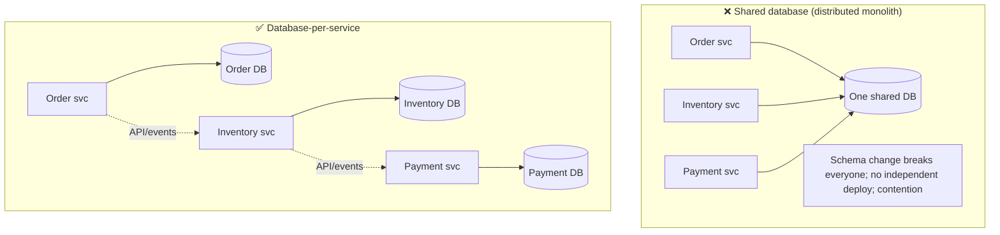
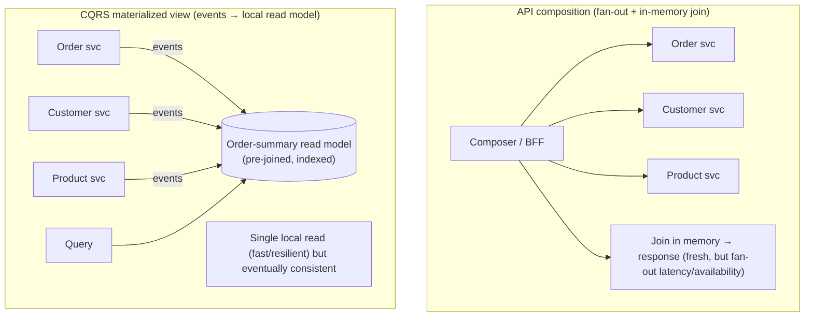

# Lesson 12.4 — Data Management: Database-per-Service, Distributed Query (API Composition, CQRS)

> Part 12: Microservices · Difficulty: 🔴⚫
>
> **Prerequisites:** [5.1.3 Polyglot Persistence], [7.5 Read vs Write Scaling / CQRS], [9.8 CDC & Outbox], [10.5 Consistency Spectrum], [12.2 Decomposition], [12.3 Communication].
> **Unlocks:** [12.5 Saga & Outbox], [12.7 Service Mesh], [Part 18 Case Studies], [Part 20 Capstone].

---

## 1. Learning Objectives

After this lesson you will be able to:

- Explain **database-per-service** — why each service must **own its data privately** — and why a **shared database** destroys the entire point of microservices.
- Articulate the consequences: **no cross-service ACID transactions**, **no cross-service joins**, and therefore the need for **sagas** (12.5) and **distributed query** patterns.
- Implement the two distributed-query patterns — **API composition** and **CQRS with materialized views** — and choose between them.
- Use **events + CDC/outbox** (9.8) to **replicate data** so a service can answer queries **locally** instead of chattily calling others.
- Reason about the **consistency** implications (eventual consistency — 10.5) and when they're acceptable.

---

## 2. Motivation — The hardest part of microservices

If communication (12.3) is where microservices get *difficult*, **data** is where they get *genuinely hard*. In a monolith, all data lives in **one database**: any component can **join across any tables** in a single query, and any operation can wrap multiple changes in **one ACID transaction** (5.2.1) that's atomic, consistent, isolated, and durable. This is enormously powerful — and microservices **give it up**. The defining rule of microservices data management is **database-per-service**: each service **privately owns its data**, and **no other service may touch it** except through the owning service's API (12.3). Without this, you don't have microservices — you have a **distributed monolith** coupled through a shared schema (12.2 §3.6), where any table change breaks multiple services and no one can deploy independently.

But private data ownership breaks two things we took for granted. First, an operation that must change data in **multiple services** can no longer be **one transaction** — there's no shared database to be atomic over — so we need **sagas** (11.7/12.5). Second, a **query that needs data from multiple services** can no longer be a **join** — the data lives in separate databases — so we need **distributed query** patterns: **API composition** (gather from each service and join in memory) and **CQRS** (maintain a pre-joined read model, kept up to date by events). This lesson develops database-per-service and the distributed-query patterns; sagas get their own lesson (12.5). Together they are the price — and the discipline — of decoupled data.

---

## 3. Theory — From first principles

### 3.1 Database-per-service — the defining rule

`[CS]` **Database-per-service:** each service **owns its persistent data privately**; the data is accessible **only** through that service's API — never by another service reaching into its database `[CS]`:
- "Database" here is **logical** — it can be a separate database server, or a separate schema/keyspace/set-of-tables on shared infrastructure — the key is **no other service reads or writes it directly**.
- Services exchange data **only via APIs/events** (12.3), never via shared tables.
- `[BP]` This enables the whole microservices value proposition: a service can **change its schema, switch its database technology (polyglot — 5.1.3), and deploy independently** — because nothing else depends on its internal storage. It also enforces **encapsulation** at the data layer (2.1.1).

### 3.2 Why a shared database is fatal

`[CS]` The **shared database** anti-pattern (multiple services reading/writing the same tables) destroys microservices `[BP]`:
- **Coupling through the schema:** any table change potentially breaks **every** service that touches it → you **can't change or deploy independently** (the whole point is lost).
- **Hidden coupling / no encapsulation:** services depend on each other's **internal data representation**, not a stable API → the tightest, most brittle coupling there is.
- **No clear ownership:** who's responsible for the data's integrity/rules? Diffused → bugs and conflicting writes.
- **Contention:** all services contend on one database → it becomes the shared bottleneck and SPOF (7.6).
- `[BP]` A shared database yields a **distributed monolith** (12.1/12.2): all the distribution cost, none of the independence. Private ownership is **non-negotiable**.

### 3.3 The two consequences: no cross-service transactions, no cross-service joins

`[CS]` Private databases break two monolith conveniences:
- **No cross-service ACID transactions.** An operation spanning services (place order → reserve inventory → charge payment) touches **multiple databases**; there's no single transaction to make it atomic. **2PC** (11.6) could in theory, but it's blocking/fragile and generally avoided → the answer is the **saga** (11.7/12.5): a sequence of **local transactions** (each atomic within one service) coordinated by events/commands, with **compensating transactions** to undo on failure — giving **eventual consistency** and **atomicity without isolation**, not ACID.
- **No cross-service joins.** A query needing data from multiple services (order details + customer name + product info) can't `JOIN` across separate databases. → **distributed query** patterns (§3.4/3.5).

These aren't bugs to fix — they're the **inherent cost** of decoupled data. The design job is to arrange boundaries (12.2) so that **most operations and queries stay within one service**, and handle the genuinely-cross-service cases with sagas and distributed query.

### 3.4 Distributed query — pattern 1: API composition

`[CS]` **API composition:** a **composer** (a service, a BFF/gateway — 12.6, or the client) **queries each owning service** for its piece and **joins the results in memory** `[CS]`:
- Example: to show an order page, call Order service (order), Customer service (name), Product service (details) → assemble the view.
- `[BP]` **Pros:** simple, no extra data stores, always reads **fresh** data from each source.
- `[BP]` **Cons:** **in-memory joins** are inefficient for large datasets; **latency = the slowest call** (fan-out — Part 17) and **availability multiplies** (12.3 §3.3 — need all services up, or partial results); **can't do complex joins/filters/sorts across services** efficiently (e.g., "all orders sorted by customer's loyalty tier" is painful). Best for **simple compositions of a few results**.

### 3.5 Distributed query — pattern 2: CQRS with materialized views

`[CS]` **CQRS (Command Query Responsibility Segregation — 7.5)** applied across services: maintain a **separate read model** (a **materialized view**) that **pre-joins/denormalizes** data from multiple services, kept up to date by **subscribing to their events** `[CS]`:
- The **command side** (each owning service) publishes **events** when its data changes (via outbox/CDC — 9.8/12.5).
- A **query service** subscribes to those events and maintains a **read-optimized view** (e.g., a denormalized "order summary" table, or an Elasticsearch index) that already contains everything a query needs — so the query is a **single local read**, no fan-out.
- `[BP]` **Pros:** **efficient queries** (pre-joined, indexed, purpose-built store — even a different DB type, polyglot 5.1.3), **no synchronous fan-out** (query hits one local store — resilient), scales the read side independently (7.5).
- `[BP]` **Cons:** **eventual consistency** (the view lags the source by the event-propagation delay — 10.5); **more moving parts** (event pipeline, a separate store to build/rebuild/keep consistent); **duplicated data** (the view copies source data). It's the go-to for **complex queries, search, and high-read-volume views** across services.

### 3.6 Data replication via events — answer locally

`[BP]` The unifying technique behind CQRS (and a decoupling tool in its own right): **replicate the data a service needs locally**, kept fresh by **events** `[BP]`:
- Instead of synchronously calling the Customer service every time the Order service needs a customer's name, the Order service **subscribes to Customer events** and keeps a **local read-only copy** of the few customer fields it needs → it answers **locally** (fast, resilient, no temporal coupling — 12.3 §3.2).
- This is how you **eliminate synchronous cross-service calls** (12.3 §3.5): each service holds a **local materialized view** of the upstream data it needs.
- **Trade-off:** the local copy is **eventually consistent** (10.5) and **duplicated** — acceptable when slight staleness is fine (most read paths) and worth it for the decoupling/performance. The **source of truth remains the owning service**; copies are read-only projections.
- **Reliability:** replication events must be published **reliably** (no dual-write) via the **outbox pattern / CDC** (9.8/12.5) — this is why outbox is central to microservices data.

### 3.7 Consistency: embrace eventual, protect invariants

`[CS]`/`[BP]` Microservices data is **mostly eventually consistent** (10.5), and that's usually fine — but some invariants need care:
- **Eventual consistency is the norm:** read models, replicated data, and saga outcomes all converge **after a delay**. Design UX/APIs to tolerate it (10.3 read-your-writes where needed; show "processing" states).
- **Cross-service invariants are the hard part:** an invariant spanning services (e.g., "total withdrawals ≤ balance" when balance and withdrawals live in different services) **cannot be enforced by a single transaction**. Options: (a) **redesign boundaries** so the invariant lives inside **one** service (best — 12.2); (b) use a **saga** with **semantic locks / compensations** (12.5) accepting temporary violation + correction; (c) accept eventual enforcement. **Rule:** keep tightly-coupled, invariant-bound data **inside one service** (a strong argument for the right boundaries — 12.2).
- **Uniqueness across services** (e.g., unique email) is similarly hard — often solved by a dedicated owning service or eventual detection + compensation.

### 3.8 Putting it together

`[BP]` The microservices data playbook:
- **Own data privately** (database-per-service — §3.1); **never share databases** (§3.2).
- **Draw boundaries** (12.2) so **most operations & queries are single-service** — the best way to avoid distributed transactions/queries is to not need them.
- For **cross-service writes** → **sagas** (12.5); publish changes reliably via **outbox/CDC** (9.8).
- For **cross-service reads** → **API composition** (simple, fresh, few results) or **CQRS/materialized views + local replication** (complex/high-volume, eventually consistent).
- **Embrace eventual consistency**; keep **invariant-bound data together** in one service (§3.7).
- **Polyglot** where it pays (5.1.3) — each service picks its best-fit store.

---

## 4. Visual Intuition

### Shared DB (wrong) vs database-per-service (right)

### Distributed query: API composition vs CQRS

---

## 5. Real-World Analogy

Think of a company where each **department keeps its own private filing cabinet** (database-per-service) — versus one giant **shared records room** everyone rummages through (shared database).

- **The shared records room (shared database):** every department pulls and edits the same physical files. The moment Accounting **reorganizes the folder structure**, Sales and Support — who also rely on those exact folders — are thrown into chaos. Nobody can reorganize their own files without a company-wide meeting. And everyone crowds the one room. This is the shared-database trap: **any change breaks everyone**.
- **Private filing cabinets (database-per-service):** each department **owns its cabinet**, organizes it however suits them, and **no one else opens it** — if you need something from Accounting, you **ask Accounting** (call its API). Now Accounting can reorganize freely; nobody else is affected. That's private data ownership and independence.
- **The cost — no more "grab everything at once":** in the shared room you could pull a customer's sales record, support tickets, and invoices in **one trip** (a join) or make a change across all three at once (a transaction). With private cabinets, a report needing all three requires either **asking each department and stapling the answers together** (API composition — simple but you wait on the slowest department and need all of them available), or **keeping a pre-assembled summary binder** that each department **updates by sending you memos whenever something changes** (CQRS materialized view — instant to read, but your binder is always **slightly behind** the latest change — eventual consistency).
- **Keeping local copies (event replication):** rather than phoning Customer Records every single time you need a customer's name, you keep a **small index card** with the few customer details you use, and Customer Records **sends you an update memo** whenever a detail changes. Now you work from your own desk — fast and independent — accepting your card might be **a memo or two behind**.
- **The invariant problem:** if the rule "don't spend more than your budget" requires comparing the **budget** (held by Finance) with **spending** (held by Procurement), and they're in separate cabinets, **no single locked drawer** can guarantee it — you either **put both in the same cabinet** (right boundary) or accept **check-and-correct-later** (saga). That's why invariant-bound data belongs together.

---

## 6. Industry Example

- **Database-per-service as a defining practice** `[CONV]`: microservices adopters enforce private data ownership, often with **polyglot** stores per service (relational, document, search, KV — 5.1.3) (§3.1). *(Representative.)*
- **CQRS + search indexes** `[CONV]`: e-commerce/order systems maintain denormalized read models (e.g., Elasticsearch) fed by domain events for fast, complex queries (§3.5, Part 18.7). *(Representative.)*
- **Event-carried state transfer / local replicas** `[CONV]`: services keep local read-only copies of upstream reference data, updated via events, to avoid synchronous calls (§3.6). *(Representative.)*
- **Outbox/CDC as the reliability backbone** `[CONV]`: Debezium-style CDC and transactional outbox to publish data changes reliably without dual writes (§3.6, 9.8/12.5). *(Representative.)*
- **Shared-database "distributed monolith"** `[OPINION]`: teams that kept one shared database across "services" and couldn't deploy independently — the classic failure (§3.2). *(Representative.)*

---

## 7. Implementation Details — managing microservices data

- **Enforce private ownership** (§3.1): each service its own DB/schema; **no direct cross-service DB access** — access only via API/events (12.3). Enforce via separate credentials/network policy.
- **Draw boundaries to minimize cross-service data needs** (12.2) — the cheapest distributed query is the one you don't do.
- **Cross-service writes → sagas** (12.5); publish reliably via **outbox/CDC** (9.8) — never dual-write DB+broker.
- **Cross-service reads →** choose:
  - **API composition** for simple, low-cardinality, freshness-critical compositions (§3.4).
  - **CQRS materialized view** for complex/aggregated/high-read queries; build via event subscription; make it **rebuildable** from the event log (9.7 reprocessing) (§3.5).
- **Local read replicas via events** (§3.6) to eliminate synchronous read chains; keep them read-only projections; source of truth stays with the owner.
- **Idempotent event consumers** (9.5/11.5) so view/replica updates tolerate duplicates/reordering; track last-applied version per key.
- **Design for eventual consistency** (§3.7): tolerate lag in UX/APIs; keep invariant-bound data in one service; use read-your-writes (10.3) where the user must see their own change.
- **Polyglot per service** (5.1.3) where the workload justifies it.

---

## 8. Advantages

- **Independence** — private data → change schema/DB tech/deploy independently (the core benefit — §3.1).
- **Encapsulation** — services depend on stable APIs, not each other's storage (§3.1/3.2).
- **Polyglot** — best-fit store per service (5.1.3).
- **Scalable, resilient reads** — CQRS/local replicas answer locally (no fan-out) and scale independently (§3.5/3.6, 7.5).
- **Clear ownership** — one service is responsible for its data's integrity/rules (§3.2).

---

## 9. Disadvantages / costs

- **No cross-service ACID / joins** — need sagas + distributed query (§3.3) — the big cost.
- **Eventual consistency** — read models/replicas/sagas lag; harder to reason about (§3.7, 10.5).
- **Data duplication** — CQRS views and local replicas copy data (storage + sync complexity) (§3.5/3.6).
- **Operational complexity** — event pipelines, outbox/CDC, rebuildable views, many databases to run/back up (§3.6, 9.8).
- **Cross-service invariants are hard** — can't enforce with one transaction (§3.7).
- **API-composition limits** — fan-out latency/availability, weak at complex joins/sorts (§3.4).

---

## 10. When NOT to use these patterns

- **Don't use a shared database** across services — ever (it's the anti-pattern — §3.2).
- **Don't use API composition** for large-dataset joins, complex filters/sorts, or when you can't tolerate fan-out latency/availability — use CQRS (§3.4/3.5).
- **Don't use CQRS** when a simple composition suffices or when the eventual-consistency lag is unacceptable and freshness is mandatory — its complexity isn't free (§3.5).
- **Don't split invariant-bound data** across services if you can keep it together — redraw the boundary (§3.7, 12.2).
- **Don't adopt database-per-service** at all if you're still a **modular monolith** — a well-modularized monolith with one DB is fine until you decompose (12.1).

---

## 11. Common Mistakes

1. **Shared database across services** → distributed monolith; can't deploy independently (§3.2).
2. **Sneaky direct DB access** — one service reads another's tables "just this once" → hidden coupling (§3.1).
3. **Expecting cross-service ACID** — designing as if a distributed transaction exists → correctness bugs (§3.3, 12.5).
4. **Dual writes** — writing to DB and publishing an event non-atomically → lost/ghost events; use outbox (§3.6, 9.8).
5. **Non-idempotent view/replica updates** — duplicates/reordering corrupt the read model (§3.6, 9.5).
6. **Over-using API composition** — fan-out for complex queries → latency/availability pain (§3.4).
7. **Splitting invariant-bound data** — creating cross-service invariants that can't be enforced (§3.7).
8. **Forgetting to make views rebuildable** — can't recover/reshape a read model from events (§3.5, 9.7).

---

## 12. Interview Questions

**🟢 Easy**
- What is database-per-service, and why can't services share a database?
- What two things can you no longer do once each service owns its own database?

**🟡 Medium**
- Compare API composition vs CQRS for distributed queries. When would you use each?
- How do you let one service answer queries about another service's data without calling it synchronously?

**🔴 Hard**
- Explain eventual consistency in a CQRS read model: where does the lag come from, and how do you handle read-your-writes for a user who just made a change?
- How do you publish data changes reliably to keep a read model in sync (outbox/CDC), and why not just write to the DB and the broker separately?

**⚫ Staff+**
- Design the data architecture for an order system (Order/Customer/Product/Inventory services): private databases, which queries use API composition vs CQRS, how read models are built and rebuilt, how cross-service writes stay consistent (sagas + outbox), and how you'd handle a cross-service invariant.
- You inherit a "microservices" system where all services share one database. Explain why it's a distributed monolith and lay out a migration to database-per-service (data ownership, breaking joins, introducing events/CQRS) without downtime (ties to 12.9).

---

## 13. Production Pitfalls

- **Shared-DB coupling discovered late:** a schema change breaks three "independent" services simultaneously (§3.2).
- **Dual-write inconsistency:** the DB commit succeeds but the event publish fails (or vice versa) → the read model/replica silently diverges from the source of truth (§3.6, 9.8).
- **Read-model drift:** an unhandled duplicate/out-of-order event or a bug slowly corrupts the CQRS view; without rebuildability, recovery is painful (§3.5/3.6).
- **Stale-read surprises:** a user updates data and immediately doesn't see it (read model lag) → confusion/bug reports; needs read-your-writes handling (§3.7, 10.3).
- **Fan-out availability collapse:** an API-composition query needs 5 services up; one is down → the whole query fails or degrades (§3.4, 12.3).
- **Cross-service invariant violation:** money/inventory over-committed because no single transaction guarded the invariant (§3.7, 12.5).

---

## 14. Optimization Techniques

- **Boundaries that localize data** (12.2) — keep operations/queries within one service; the best optimization is not needing distributed data ops (§3.8).
- **CQRS materialized views + local event-driven replicas** to turn fan-out reads into single local reads (§3.5/3.6, 7.5).
- **Purpose-built read stores (polyglot)** — search index, denormalized table, cache — for each query shape (5.1.3, Part 6).
- **Outbox/CDC** for reliable, efficient change propagation without dual writes (9.8).
- **Rebuildable views from the event log** (9.7) — reshape/recover read models by reprocessing.
- **Idempotent, versioned consumers** to keep views correct cheaply (9.5/11.5).
- **Keep invariant-bound data together** to avoid expensive cross-service coordination (§3.7).

---

## 15. Summary

**Data is the hardest part of microservices.** The defining rule is **database-per-service**: each service **privately owns its data**, accessible **only through its API/events** (12.3) — never a **shared database**, which couples services through the schema, kills independent deployment, diffuses ownership, and yields a **distributed monolith** (12.2). Private ownership enables the core benefits (change schema/DB tech/deploy independently; polyglot — 5.1.3; encapsulation), but breaks two monolith conveniences: **no cross-service ACID transactions** (an operation spanning services can't be one atomic transaction → use **sagas** — 11.7/12.5 — local transactions + compensations → eventual consistency, atomicity without isolation) and **no cross-service joins** (a query spanning services can't `JOIN` across separate databases → use **distributed query**). Two distributed-query patterns: **API composition** (a composer/BFF queries each owning service and joins **in memory** — simple and **fresh**, but suffers fan-out latency + multiplied availability and can't do complex joins/sorts — best for simple compositions), and **CQRS with materialized views** (maintain a **pre-joined, read-optimized view** fed by the owning services' **events** — a **single local read**, efficient and resilient and independently scalable, but **eventually consistent** with more moving parts — best for complex/high-read queries and search). The unifying technique is **replicating the data a service needs locally**, kept fresh by **events** published **reliably via outbox/CDC** (9.8), so a service answers **locally** instead of chattily calling others (eliminating synchronous read chains — 12.3) — accepting eventual consistency and duplication, with the **owning service remaining the source of truth**. Microservices data is **mostly eventually consistent** (10.5), which is usually fine (design UX/APIs to tolerate lag; read-your-writes — 10.3 — where a user must see their own change); the genuinely hard case is **cross-service invariants**, which no single transaction can enforce — so **keep invariant-bound data inside one service** (a strong argument for the right boundaries — 12.2), or handle it via sagas with semantic locks/compensation. The playbook: own data privately, draw boundaries so most operations/queries are single-service, use **sagas + outbox** for cross-service writes and **API composition or CQRS** for cross-service reads, embrace eventual consistency, keep invariant-bound data together, and go polyglot where it pays.

---

## 16. Revision Notes (flashcard-ready)

- **Q:** Database-per-service? **A:** Each service owns its data privately; accessible only via its API/events — no other service touches its DB.
- **Q:** Why is a shared database fatal? **A:** Schema changes break everyone, no independent deploy, no clear ownership, contention → distributed monolith.
- **Q:** Two things you lose with private DBs? **A:** Cross-service ACID transactions (→ sagas) and cross-service joins (→ distributed query).
- **Q:** API composition? **A:** Composer queries each owning service and joins in memory — simple + fresh, but fan-out latency/availability, weak at complex joins.
- **Q:** CQRS materialized view? **A:** A pre-joined read model fed by services' events; single local read — efficient/resilient but eventually consistent.
- **Q:** How to answer about another service's data locally? **A:** Subscribe to its events, keep a local read-only replica (event-carried state transfer) — eventually consistent.
- **Q:** How to publish changes reliably? **A:** Outbox/CDC (9.8) — never dual-write DB + broker.
- **Q:** Consistency norm in microservices? **A:** Eventual consistency; design UX/APIs to tolerate lag; read-your-writes where needed.
- **Q:** Hardest data case? **A:** Cross-service invariants — no single transaction can enforce them; keep invariant-bound data in one service.
- **Q:** Best way to avoid distributed transactions/queries? **A:** Draw boundaries (12.2) so most operations/queries stay within one service.

---

## 17. Further Reading + Knowledge-Graph Links

**Foundations (in-platform):**
- **[5.1.3 Polyglot Persistence]** — best-fit store per service.
- **[7.5 Read vs Write Scaling / CQRS]** — command/query separation, read models.
- **[9.8 CDC & Outbox]** — reliable change propagation without dual writes.
- **[10.5 Consistency Spectrum]** / **[10.3 Session Guarantees]** — eventual consistency, read-your-writes.
- **[11.7 Sagas]** — cross-service consistency without distributed transactions.

**Unlocks / next:**
- **[12.5 Saga & Outbox in Microservices]** — the cross-service write story in depth.
- **[12.7 Service Mesh]** — secure/observe the data-carrying calls.
- **[Part 18 Case Studies]** / **[Part 20 Capstone]** — data architecture composed at scale (ledger, search, CQRS + event sourcing).

**External (canonical):**
- Richardson, *Microservices Patterns* — database-per-service, API composition, CQRS, sagas.
- Kleppmann, *Designing Data-Intensive Applications* — derived data, materialized views, dataflow.
- Newman, *Building Microservices* & *Monolith to Microservices* — data decomposition.

> **Knowledge-graph:** `database-per-service` → {`no cross-service ACID` → **12.5 sagas**} + {`no cross-service joins` → **API composition / CQRS**}; powered by `9.8 outbox/CDC` + `10.5 eventual consistency`.
