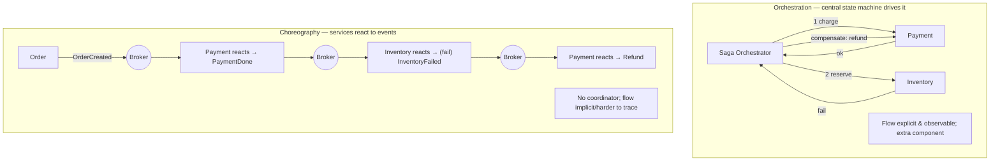
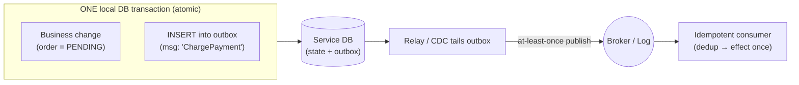

# Lesson 12.5 — Saga & Outbox in Microservices

> Part 12: Microservices · Difficulty: 🔴⚫
>
> **Prerequisites:** [9.8 CDC & Outbox], [11.5 Idempotency/Exactly-Once Effects], [11.6 Distributed Transactions 2PC/3PC], [11.7 Sagas & Compensating Transactions], [12.3 Communication], [12.4 Data Management].
> **Unlocks:** [12.6 Discovery/Gateway/BFF], [Part 18 Case Studies], [Part 20 Capstone (ledger/payments)].

---

## 1. Learning Objectives

After this lesson you will be able to:

- Apply the **saga pattern** (11.7) specifically to microservices: coordinate a **business transaction across services** without distributed transactions.
- Choose between **orchestration** and **choreography**, and justify the choice by complexity, coupling, and observability.
- Solve the **dual-write problem** with the **transactional outbox** (9.8): atomically update state **and** emit an event/command.
- Handle sagas' hard realities: **no isolation** (dirty reads, lost updates — 5.2.3), **countermeasures** (semantic locks, commutative updates), **idempotent + compensatable** steps, and **irreversible-last** ordering.
- Assemble the complete pattern — **local transaction + outbox → reliable event → idempotent handler → next local transaction (or compensation)** — the backbone of microservices consistency.

---

## 2. Motivation — Business transactions that span services

12.4 established the constraint: with **database-per-service**, an operation touching **multiple services** cannot be **one ACID transaction** — there's no shared database to be atomic over. Yet businesses are full of such operations: *place an order* means reserve inventory, charge payment, and schedule shipping — across three or four services, each with its own database. Either they **all effectively happen** or the whole thing is **cleanly undone**; you must never charge a customer for an order you can't fulfill, or ship goods you never charged for.

The tempting answer, **2PC** (11.6), is a trap: it's **blocking** (a coordinator crash leaves participants stuck holding locks), CP/fragile, doesn't scale, and many modern datastores/brokers don't support it — so microservices **avoid distributed transactions** (11.6). The real answer is the **saga** (11.7): break the business transaction into a sequence of **local transactions** (each atomic within one service), coordinate them with **messages/events**, and on failure run **compensating transactions** to semantically undo the completed steps. This gives **atomicity without isolation** and **eventual consistency** instead of ACID.

But sagas rest on a subtle prerequisite: each step must **atomically update its database *and* reliably tell the next step to run**. Doing those as two separate operations (write DB, then publish message) is the **dual-write problem** — a crash between them loses the message or produces a ghost one, breaking the saga. The **transactional outbox** (9.8) solves it. This lesson unifies sagas (11.7) and outbox (9.8) into the concrete microservices consistency mechanism.

---

## 3. Theory — From first principles

### 3.1 The saga (recap + microservices framing)

`[CS]` A **saga** (11.7) is a **sequence of local transactions**, one per service; each local transaction is atomic within its own database, and after committing it **triggers the next** step via a message/event. If a step **fails**, the saga runs **compensating transactions** to **semantically undo** the previously-completed steps (in reverse) `[CS]`:
- Example — *Create Order* saga: (1) Order service creates order (PENDING), (2) → Payment service charges card, (3) → Inventory service reserves stock, (4) → Shipping service schedules, (5) Order service marks order CONFIRMED. If **Inventory fails**, compensate: **refund** the payment (compensation for step 2) and mark the order **CANCELLED**.
- **Compensation ≠ rollback:** you can't roll back a **committed** local transaction; you run a **new** transaction that **semantically undoes** it (refund, not "un-charge"). Some steps are **irreversible** (send an email, ship goods) → order the saga so irreversible steps come **last** (11.7).
- Result: **atomicity without isolation**, **eventual consistency** — the correct microservices answer given database-per-service (12.4).

### 3.2 Orchestration vs choreography

`[CS]` Two ways to coordinate the steps (11.7):
- **Choreography (event-driven, decentralized):** each service **publishes events**; other services **subscribe and react**, publishing their own events in turn — **no central coordinator**. Order publishes `OrderCreated` → Payment reacts and publishes `PaymentCompleted` → Inventory reacts, etc.
  - **Pros:** loose coupling, no central component, simple for **short/simple** sagas; naturally event-driven (12.3 §3.4).
  - **Cons:** the **workflow is implicit** — smeared across services, hard to understand/debug/change ("what's the overall flow?"); risk of **cyclic dependencies**; hard to see saga state.
- **Orchestration (centralized):** a **saga orchestrator** (often a state machine) **explicitly drives** the flow — it sends a command to each service, awaits the reply, and decides the next step (or compensation).
  - **Pros:** the **workflow is explicit and centralized** (easy to understand, change, monitor); clear saga state; simpler for **complex** sagas with many steps/branches.
  - **Cons:** an extra component (the orchestrator) to build/run; risk of **too much logic centralizing** in the orchestrator (keep business rules in the services).
- `[BP]` **Rule of thumb** (11.7): **choreography for simple/short** sagas (2–4 steps, few branches); **orchestration for complex** sagas (many steps, branching, need for visibility). Orchestration's **observability** advantage matters a lot in production.

### 3.3 The dual-write problem

`[CS]` A saga step must do two things: **update its local database** (e.g., mark order PENDING) **and** **send a message** (e.g., command Payment / publish `OrderCreated`). If these are **two separate operations**, no combination is safe `[CS]`:
- **DB commit, then publish:** crash after commit but before publish → state changed but **no message sent** → the saga **stalls** (next step never triggered). ❌
- **Publish, then DB commit:** crash after publish but before commit → message sent for a change that **didn't persist** → a **ghost/phantom** event triggers downstream work for nothing. ❌
- You **cannot** wrap a database transaction and a message-broker send in one atomic unit (they're different systems; 2PC across them is the fragile thing we're avoiding — 11.6).
- This is the **dual-write problem** (9.8): reliably updating **two systems** (DB + broker) atomically is impossible with naive sequential writes.

### 3.4 The transactional outbox — the solution

`[CS]` **Transactional outbox** (9.8): make the "send a message" part of the **same local database transaction** as the state change `[CS]`:
- The service, in **one local ACID transaction**, writes **both** its business change **and** a row into an **`outbox` table** (the message to send). Because it's one transaction, they commit **atomically** — either both or neither. No dual write.
- A separate **message relay** (a **CDC** tail of the outbox table — 9.8, e.g., Debezium reading the WAL — or a poller) reads new outbox rows and **publishes them to the broker**, marking them sent.
- **Delivery is at-least-once** (the relay may publish, crash before marking sent, and re-publish) → downstream consumers **must be idempotent** (§3.5).
- `[BP]` This is *the* pattern that makes sagas (and CQRS event feeds — 12.4) reliable in microservices. **Outbox = atomic state-change + intent-to-message; relay + CDC = reliable delivery.** (Alternative: **event sourcing** — the event *is* the state, so there's no dual write at all — 9.7/Part 20.)

### 3.5 Idempotency & exactly-once effects in sagas

`[CS]` Because messaging is **at-least-once** (9.4) and the relay/consumers can retry, **every saga participant and compensation must be idempotent** (11.5) `[BP]`:
- **Idempotent steps:** processing the same command/event twice has the **same effect as once** — via **idempotency keys + dedup**, **state-based checks** ("if already charged, skip"), or **CAS** (11.5). Track a **last-processed message id / saga step** per entity.
- **Exactly-once *effects*** (11.5/9.4): at-least-once delivery + idempotent handlers = each step's **effect** happens once, even though messages may be delivered multiple times. There is **no exactly-once delivery** — only exactly-once effects.
- **Compensations must be idempotent too** (a compensation may be retried) and should be **commutative/safe** to apply.

### 3.6 The missing isolation — sagas' hardest problem

`[CS]` A saga is **not isolated** (the "I" of ACID is absent — 11.7): its intermediate state is **visible** to other transactions between steps, causing **ACD without I** anomalies (5.2.3) `[CS]`:
- **Dirty reads:** another transaction reads the order's PENDING state (mid-saga) and acts on data that may later be **compensated away**.
- **Lost updates / non-repeatable reads:** concurrent sagas interleave on the same data.
- **Countermeasures** (Garcia-Molina/Richardson) `[BP]`:
  - **Semantic lock:** mark a record as "in-progress/pending" (an application-level lock) so others know it's mid-saga and can wait/reject (e.g., order status = PENDING; funds "held" not "captured").
  - **Commutative updates:** design updates so order doesn't matter (e.g., increments) → interleaving is safe.
  - **Pessimistic view:** reorder saga steps to minimize the window a dirty read could hurt.
  - **Reread value / version file:** detect concurrent changes (optimistic — 5.2.4) and abort/retry.
  - **By value:** route high-risk (e.g., large-amount) requests through stricter handling.
- `[BP]` **Practical rule:** use **semantic locks** (pending states) + **idempotency** + careful **step ordering (irreversible-last)**; and, best of all, **draw boundaries (12.2) so tightly-coupled invariant-bound data stays in one service** — avoiding the cross-service saga (and its lack of isolation) entirely (12.4 §3.7).

### 3.7 Putting it all together — the canonical mechanism

`[BP]` The complete microservices consistency loop, per step:

1. A service receives a **command** (or reacts to an **event**).
2. In **one local transaction**: it applies the **business change** *and* writes an **outbox** row (the next command/event) — atomic (§3.4). Idempotency check first (skip if already processed — §3.5).
3. The **relay/CDC** publishes the outbox message reliably (at-least-once) to the broker (§3.4, 9.8).
4. The **next participant** (orchestrator or subscribing service) consumes it **idempotently** and repeats from step 1.
5. On a **failure** reply, the orchestrator (or choreography logic) triggers **compensating** commands in reverse for completed steps (§3.1) — themselves idempotent (§3.5).

This chain — **local txn + outbox → reliable message → idempotent handler → next local txn / compensation** — is the backbone of consistency across microservices. It replaces the monolith's single ACID transaction with a **reliable, idempotent, compensatable, eventually-consistent** workflow.

---

## 4. Visual Intuition

### Orchestration vs choreography

### Transactional outbox solves the dual write

---

## 5. Real-World Analogy

Think of booking a **multi-leg trip through separate travel agencies** — flight agency, hotel agency, car-rental agency — none of which share a booking system (database-per-service).

- **No single "book everything" button (no distributed transaction):** you can't atomically reserve all three at once. So you book them **in sequence** — flight, then hotel, then car — each agency confirming its own booking (a **local transaction**). That's a **saga**.
- **Compensation, not rollback:** if the **car rental falls through** after the flight and hotel are already **confirmed and paid**, you can't magically un-book them — you **cancel and request refunds** (a **compensating transaction**). And you'd book the **non-refundable, irreversible** thing (say, a concert ticket) **last**, so if something fails you haven't committed to the thing you can't undo (**irreversible-last**).
- **Orchestration vs choreography:** you can act as the **orchestrator** — personally calling each agency in order, deciding what's next based on each reply (explicit, you always know the trip's status). Or you set up **choreography** — "when the flight is confirmed, my assistant automatically books the hotel; when the hotel confirms, the car" — no central conductor, but now **no one has the whole picture** if you ask "where are we?"
- **The dual-write problem (outbox):** suppose your process is "**write the booking in my notebook**, then **email the next agency**." If you write the note and your phone dies **before the email sends**, the trip **stalls** — the note says booked, but the next agency was never told. The fix: in **one atomic act**, write the booking **and** drop the outgoing email into a physical **outbox tray** on your desk. Later, an **assistant empties the outbox tray and sends the emails** — if they're unsure whether an email already went out, they **resend** (at-least-once), so each agency must **ignore duplicate requests** (idempotency). Because the note and the outbox slip were written **together**, you can never have one without the other.
- **No isolation (semantic locks):** while your trip is half-booked, someone else booking the **same last hotel room** might grab it. To prevent chaos, the hotel marks the room "**on hold / pending**" while your saga is in flight (a **semantic lock**) rather than fully free or fully booked.

---

## 6. Industry Example

- **Order/checkout sagas** `[CONV]`: e-commerce order flows implemented as sagas across order/payment/inventory/shipping services, with compensations (refund, release stock) (§3.1). *(Representative.)*
- **Orchestration engines** `[CONV]`: workflow/saga orchestrators (state-machine engines like Temporal/Camunda-style, or bespoke) used for complex, observable, long-running sagas (§3.2). *(Representative.)*
- **Transactional outbox + CDC (Debezium-style)** `[CONV]`: the standard way to publish domain events reliably from a service's database without dual writes (§3.4, 9.8). *(Representative.)*
- **Event sourcing as a dual-write-free alternative** `[CONV]`: systems where the event log *is* the source of truth, sidestepping outbox entirely (§3.4, Part 20). *(Representative.)*
- **Payment idempotency keys** `[CONV]`: payment APIs require an idempotency key so retried charge requests don't double-charge — exactly-once *effects* (§3.5, 11.5). *(Representative.)*

---

## 7. Implementation Details — building sagas + outbox

- **Model the business transaction as a saga** (§3.1): identify steps, each a **local transaction** in one service; define a **compensation** for each reversible step; order steps so **irreversible steps are last** (11.7).
- **Choose coordination** (§3.2): **choreography** (events) for simple/short sagas; **orchestration** (state machine) for complex/branching sagas needing visibility.
- **Solve dual-write with the outbox** (§3.4, 9.8): write business change + outbox row in **one local transaction**; a **relay/CDC** publishes reliably (at-least-once). (Or use **event sourcing**.)
- **Make every participant + compensation idempotent** (§3.5, 11.5): idempotency keys / state checks / CAS; track last-processed message per entity/saga; exactly-once **effects**, not delivery.
- **Handle missing isolation** (§3.6): **semantic locks** (PENDING/held states), commutative updates, careful ordering; surface intermediate state in the UX ("processing").
- **Persist saga state** (orchestrator) so it survives crashes and can resume/timeout/retry; handle **stuck sagas** (timeouts → compensate).
- **Observe it** (Part 16): correlate saga steps with tracing; orchestration gives you a natural place to see saga status.
- **Prefer boundaries that avoid sagas** (12.2/12.4 §3.7): keep invariant-bound, tightly-coupled data in one service to use a **local** transaction instead of a cross-service saga.

---

## 8. Advantages

- **Cross-service atomicity without 2PC** — no blocking distributed transactions (§3.1, 11.6).
- **Loose coupling + resilience** — especially choreography/events (§3.2, 12.3); services stay independent.
- **Reliable messaging** — outbox eliminates dual-write inconsistency (§3.4).
- **Exactly-once effects** — idempotency makes at-least-once safe (§3.5, 11.5).
- **Scalable & available** — no global locks; each step is a local transaction (§3.1).
- **Observable (orchestration)** — explicit, monitorable workflow (§3.2).

---

## 9. Disadvantages / costs

- **No isolation** — dirty reads/lost updates; must add countermeasures (§3.6) — the hardest cost.
- **Eventual consistency** — the business transaction completes over time, not instantly (§3.1, 10.5).
- **Complexity** — compensations, idempotency, outbox, relay, saga state, stuck-saga handling (§3.5/3.7).
- **Compensations are hard/impossible for irreversible actions** — must design ordering + sometimes accept "cannot fully undo" (§3.1).
- **Choreography obscures the flow**; **orchestration adds a component** (§3.2).
- **Operational surface** — outbox tables, CDC, broker, orchestrator all to run/monitor (§3.4/3.7).

---

## 10. When NOT to use sagas/outbox

- **When the operation fits in one service** — use a **local ACID transaction**; don't build a saga for single-service work (§3.7, 12.4) — redraw boundaries if possible (12.2).
- **When you truly need isolation/strong consistency across services** — sagas can't give it; reconsider boundaries or (rarely, carefully) other mechanisms; 2PC only in narrow, supported, tolerant-of-blocking cases (11.6).
- **When actions are irreversible and failure would be catastrophic without any compensation** — rethink the flow so the irreversible step is genuinely last and only after all reversible steps succeed (§3.1).
- **Dual-write "fixes" via best-effort publish** — don't; use outbox/event sourcing (§3.4).
- **Non-idempotent participants** — never run a saga over handlers that can't dedup (§3.5).

---

## 11. Common Mistakes

1. **Reaching for 2PC** for cross-service atomicity → blocking/fragile (§3.1, 11.6).
2. **Dual write** (commit DB then publish) → stalled sagas or ghost events (§3.3) — use outbox.
3. **Non-idempotent handlers/compensations** → duplicates (double charge) under at-least-once (§3.5).
4. **Forgetting compensations** or making them impossible (irreversible step early) (§3.1).
5. **Ignoring the lack of isolation** → dirty-read anomalies acting on soon-compensated state (§3.6).
6. **Choreography for a complex saga** → an implicit, un-debuggable web of events (§3.2).
7. **No saga timeout/stuck handling** → sagas hang forever holding semantic locks (§3.7).
8. **Building a saga for single-service work** → needless complexity (§3.7, 12.4).

---

## 12. Interview Questions

**🟢 Easy**
- What is a saga, and why do microservices use sagas instead of distributed transactions?
- What is a compensating transaction? Why isn't it the same as a rollback?

**🟡 Medium**
- Compare orchestration and choreography. When would you use each?
- What is the dual-write problem, and how does the transactional outbox solve it?

**🔴 Hard**
- Sagas lack isolation. What anomalies does that cause, and what countermeasures (semantic locks, commutative updates, ordering) do you apply?
- Why is at-least-once delivery + idempotency = exactly-once effects, and why is there no exactly-once *delivery*?

**⚫ Staff+**
- Design a "create order" saga across Order/Payment/Inventory/Shipping: choose orchestration vs choreography, define each step + compensation + ordering (irreversible-last), solve dual-write with outbox, ensure idempotency, and handle a mid-saga failure and a stuck saga.
- A payment saga occasionally double-charges customers and sometimes stalls with orders stuck PENDING. Diagnose the likely causes (non-idempotent handler; dual-write without outbox; no timeout/compensation) and design the fix end-to-end.

---

## 13. Production Pitfalls

- **Stalled saga (dual-write):** DB committed but the trigger message never published → order stuck PENDING forever, holding a semantic lock (§3.3) — outbox prevents it.
- **Double side-effect:** at-least-once redelivery + non-idempotent handler → double charge / double ship (§3.5, 11.5).
- **Dirty-read damage:** downstream logic acted on a mid-saga PENDING value that was later compensated away (§3.6).
- **Compensation failure:** a compensation itself fails/isn't idempotent → inconsistent state needing manual repair; needs retries + alerting (§3.5).
- **Irreversible-step-too-early:** shipped goods / sent money before a later step failed → can't fully compensate (§3.1).
- **Orphaned/stuck sagas:** no timeout → semantic locks held indefinitely, blocking other work (§3.7).
- **Outbox relay lag/backlog:** relay falls behind → events delayed → saga latency spikes (§3.4, monitor lag).

---

## 14. Optimization Techniques

- **Avoid the saga where possible** — boundaries that keep invariant-bound data in one service → local ACID transaction (§3.7, 12.2/12.4).
- **Orchestration for complex sagas** — explicit state → easier to optimize, monitor, and recover (§3.2).
- **Outbox + CDC (log-tailing)** rather than polling for low-latency, low-overhead publishing (§3.4, 9.8).
- **Idempotency keys + last-processed tracking** — cheap dedup, safe retries (§3.5).
- **Semantic locks with timeouts** — bound the isolation window; auto-compensate stuck sagas (§3.6/3.7).
- **Event sourcing** to remove dual writes entirely where it fits (§3.4, Part 20).
- **Parallelize independent steps** where the saga allows (fan-out steps that don't depend on each other), then join.

---

## 15. Summary

With **database-per-service** (12.4), a business operation spanning services **cannot be one ACID transaction**, and **2PC** is a blocking/fragile trap (11.6) — so microservices use the **saga** (11.7): a **sequence of local transactions** (each atomic in one service), triggered by messages/events, with **compensating transactions** to **semantically undo** completed steps on failure (compensation ≠ rollback; order the saga so **irreversible steps are last**). This yields **atomicity without isolation** and **eventual consistency**. Coordinate via **choreography** (services publish/react to events, no coordinator — loosely coupled, good for simple/short sagas, but the flow is implicit and hard to trace) or **orchestration** (a central state machine explicitly drives steps — extra component, but explicit, observable, and better for complex/branching sagas). Sagas rest on a prerequisite: each step must **atomically update its DB *and* reliably emit the next message** — doing these as separate writes is the **dual-write problem** (commit-then-publish can stall the saga; publish-then-commit can emit ghost events), which the **transactional outbox** (9.8) solves by writing the business change **and** an **outbox row** in **one local transaction**, then having a **relay/CDC** publish it reliably **at-least-once** (or use **event sourcing** to avoid dual writes entirely). Because delivery is at-least-once, **every participant and compensation must be idempotent** (idempotency keys / state checks / CAS; track last-processed per entity) → **exactly-once effects**, never exactly-once *delivery* (11.5/9.4). Sagas' **hardest problem is the missing isolation** (ACD without I — 11.7): intermediate state is visible, causing **dirty reads / lost updates** (5.2.3) — countered with **semantic locks** (PENDING/held states), **commutative updates**, careful **ordering**, and reread/version checks; best of all, **draw boundaries (12.2) so invariant-bound data stays in one service** and you can use a **local transaction** instead of a cross-service saga. The complete mechanism — **local transaction + outbox → reliable message → idempotent handler → next local transaction (or compensation)** — is the **backbone of consistency across microservices**, replacing the monolith's single ACID transaction with a reliable, idempotent, compensatable, eventually-consistent workflow. Operate it with persisted saga state, timeouts for stuck sagas, and distributed tracing.

---

## 16. Revision Notes (flashcard-ready)

- **Q:** Why sagas not 2PC in microservices? **A:** No shared DB for ACID; 2PC is blocking/fragile/unsupported → saga = local txns + compensations.
- **Q:** Compensation vs rollback? **A:** Can't roll back a committed local txn; run a new txn that semantically undoes it (refund, not un-charge).
- **Q:** Irreversible steps? **A:** Order them last, so failures happen before you do the un-undoable thing.
- **Q:** Orchestration vs choreography? **A:** Orchestration = central state machine (explicit/observable, complex sagas); choreography = event reactions (loose, simple sagas, implicit flow).
- **Q:** Dual-write problem? **A:** Updating DB and publishing a message as two ops isn't atomic → stalled saga or ghost event.
- **Q:** Outbox solution? **A:** Write business change + outbox row in one local txn; relay/CDC publishes it reliably (at-least-once).
- **Q:** Why must handlers be idempotent? **A:** At-least-once delivery → duplicates; idempotency → exactly-once effects (no exactly-once delivery).
- **Q:** Sagas' hardest problem? **A:** No isolation → dirty reads/lost updates; use semantic locks, commutative updates, ordering.
- **Q:** Best way to avoid a saga? **A:** Boundaries (12.2) that keep invariant-bound data in one service → local ACID transaction.
- **Q:** The full mechanism? **A:** Local txn + outbox → reliable message → idempotent handler → next local txn / compensation.

---

## 17. Further Reading + Knowledge-Graph Links

**Foundations (in-platform):**
- **[11.7 Sagas & Compensating Transactions]** — orchestration/choreography, compensations, isolation.
- **[11.6 Distributed Transactions 2PC/3PC]** — why to avoid distributed transactions.
- **[11.5 Idempotency/Exactly-Once Effects]** — idempotency keys, dedup, CAS.
- **[9.8 CDC & Outbox]** — the outbox pattern and log-tailing relay.
- **[12.4 Data Management]** — database-per-service, the constraint that necessitates sagas.

**Unlocks / next:**
- **[12.6 Discovery/Gateway/BFF]** — orchestrators/gateways in the topology.
- **[Part 18 Case Studies]** & **[Part 20 Capstone]** — sagas + event sourcing + ledger correctness at scale.

**External (canonical):**
- Richardson, *Microservices Patterns* — sagas, orchestration/choreography, outbox, countermeasures.
- Garcia-Molina & Salem, *Sagas* (1987) — the original paper.
- Kleppmann, *Designing Data-Intensive Applications* — dataflow, exactly-once, dual writes.

> **Knowledge-graph:** `12.4 database-per-service` → **`12.5 saga`** (from `11.7`) + **`outbox`** (from `9.8`) + **idempotency** (from `11.5`) → reliable eventually-consistent cross-service transactions.
