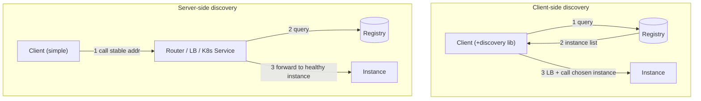
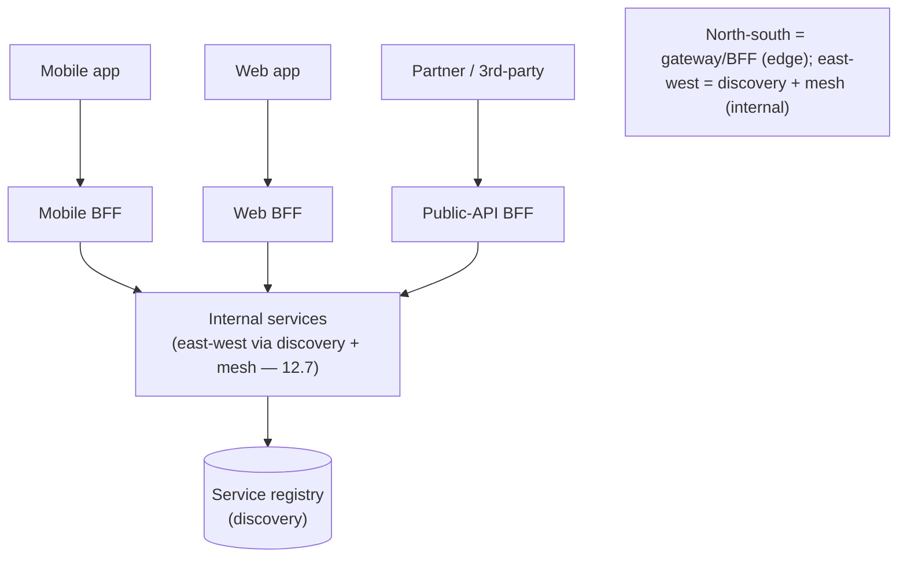

# Lesson 12.6 — Service Discovery, API Gateway, and BFF

> Part 12: Microservices · Difficulty: 🔴
>
> **Prerequisites:** [3.3.1 Load Balancing], [3.3.2 Reverse Proxies/API Gateways/Ingress], [8.3.5 Membership/Gossip/SWIM], [8.3.8 Coordination Services (ZooKeeper/etcd)], [12.3 Communication].
> **Unlocks:** [12.7 Service Mesh], [Part 13 Cloud Native], [Part 15 Security], [Part 19 Interview Designs].

---

## 1. Learning Objectives

After this lesson you will be able to:

- Explain **service discovery** — how a caller finds a callee's dynamic network location — and the two models: **client-side** and **server-side** discovery.
- Describe the **service registry** and how services register/deregister and stay healthy (self-registration vs third-party registration; health checks).
- Explain the **API gateway** — the single entry point for external clients — and the cross-cutting concerns it centralizes (routing, auth, rate limiting, aggregation, TLS termination).
- Apply the **Backend-for-Frontend (BFF)** pattern — a gateway per client type — and justify it over one monolithic gateway.
- Distinguish **gateway vs discovery vs load balancer vs service mesh** (12.7) and where each sits.

---

## 2. Motivation — Finding services and fronting them

Microservices introduce two location problems the monolith never had. First, **internal**: in a monolith, one component calls another by an in-process reference — the location is trivial. In microservices, service instances are **ephemeral and dynamic** — they scale up/down, move across hosts, get replaced on deploy, and fail — so their **network locations (IP:port) change constantly** (especially with containers/autoscaling — Part 13). A caller can't hard-code an address. It needs **service discovery**: a way to ask "where are the healthy instances of the Payment service *right now*?" and get a current answer.

Second, **external**: dozens or hundreds of internal services can't each be exposed directly to clients (mobile apps, browsers, partners). That would leak internal structure, force clients to know many endpoints, duplicate cross-cutting concerns (auth, TLS, rate limiting) in every service, and be a security nightmare. The **API gateway** solves this: a **single entry point** that fronts the services, routes requests, and centralizes cross-cutting concerns (extending the reverse-proxy/gateway idea from 3.3.2). And because different clients (a data-hungry desktop web app vs a bandwidth-constrained mobile app vs a third-party API consumer) have very different needs, the **Backend-for-Frontend (BFF)** refinement gives **each client type its own tailored gateway**. This lesson develops discovery, the gateway, and BFF — the connective tissue that makes a fleet of services usable.

---

## 3. Theory — From first principles

### 3.1 The service-discovery problem

`[CS]` **Service discovery** answers: *given a logical service name, what are the current network locations of its healthy instances?* `[CS]`:
- Instances are **dynamic** (autoscaling, deploys, failures, container rescheduling — Part 13) → locations change continuously → **static config / DNS-with-long-TTL is insufficient**.
- Core component: the **service registry** — a **database of service instances and their locations**, kept current. It must itself be **highly available and consistent-enough** (often built on a coordination service — ZooKeeper/etcd/Consul — 8.3.8).
- Two questions to answer: **how instances get into the registry** (registration — §3.3) and **how callers use it to find instances** (client-side vs server-side discovery — §3.2).

### 3.2 Client-side vs server-side discovery

`[CS]` Two models for how a caller finds and reaches an instance:
- **Client-side discovery:** the **client queries the registry** directly, gets the list of healthy instances, and **load-balances itself** (picks one — 3.3.1). (e.g., a client library + registry.)
  - **Pros:** no extra network hop; the client can make smart, load-aware balancing decisions.
  - **Cons:** **discovery logic in every client** (coupling to the registry, per-language client libraries); harder to keep consistent across polyglot services.
- **Server-side discovery:** the client calls a **router/load balancer** at a **stable address**; the **router** queries the registry and forwards to a healthy instance (e.g., a load balancer / gateway / Kubernetes Service — Part 13).
  - **Pros:** clients are **simple** (just call the stable endpoint); discovery is **centralized** and language-agnostic.
  - **Cons:** the router is an **extra hop** and must itself be HA; it's another component to run.
- `[BP]` **Modern default:** server-side discovery via platform primitives (Kubernetes Services / cloud load balancers) or a **service mesh** (12.7) is most common — clients stay simple and the platform handles discovery/balancing. Client-side discovery persists in some frameworks (e.g., older Netflix-stack). *(Representative.)*

### 3.3 Registration: self vs third-party; health

`[CS]` How instances get into (and out of) the registry:
- **Self-registration:** the instance **registers itself** on startup and **sends heartbeats**; deregisters on shutdown. Simple, but couples the service to the registry.
- **Third-party registration:** a **registrar** (a platform component) watches instances (via the orchestrator/deployment system) and registers/deregisters them — the service stays unaware. Common in orchestrated environments (Part 13).
- **Health checking is essential** (3.3.1): the registry must **only return healthy instances** — via heartbeats (instance→registry) and/or **health-check probes** (registry/LB→instance). A crashed instance that fails to deregister must be **evicted** (heartbeat timeout) so callers don't route to it (ties to failure detection — 8.1.3, membership — 8.3.5).
- `[BP]` Registry data is **soft state** with TTLs — instances must keep proving they're alive, and stale entries expire.

### 3.4 The API gateway

`[CS]` An **API gateway** is a **single entry point** for external clients into the microservices system (a specialized reverse proxy — 3.3.2) `[CS]`:
- **Request routing:** maps external requests to the right internal service(s) — clients see one endpoint, not the internal topology.
- **API composition/aggregation:** can **fan out to several services and combine** results into one client response (reduces client round-trips over slow mobile networks — API composition, 12.4).
- **Cross-cutting concerns centralized** (so services don't each reimplement them): **authentication/authorization** (verify tokens once at the edge — Part 15), **TLS termination**, **rate limiting / throttling** (Part 15/11.4), **request/response transformation**, **caching** (Part 6), **logging/metrics/tracing** entry (Part 16), and **protocol translation** (e.g., external REST → internal gRPC — 3.2.6).
- `[BP]` **Benefits:** hides internal structure (clients decoupled from topology), single place for edge security/policy, fewer client round-trips (aggregation). **Costs:** it's a **potential bottleneck and SPOF** (must be HA/scaled — 3.3.1/11.2), **another component to develop/operate**, and risks becoming an **overloaded god-gateway** if too much logic accretes.

### 3.5 The god-gateway problem → BFF

`[CS]` A single API gateway serving **all** client types tends to bloat: mobile, web, and third-party clients have **different, conflicting needs**, so one gateway accumulates all their special-casing → hard to maintain, owned by no one, a change bottleneck `[CS]`.
- **Backend-for-Frontend (BFF):** provide a **separate gateway per client type/experience** — a **Mobile BFF**, a **Web BFF**, a **Public-API BFF** — each **tailored** to its client and **owned by the team that builds that client** `[CS]`.
- Each BFF: aggregates/shapes data **exactly** as its client needs (e.g., mobile BFF returns compact payloads with fewer round-trips; web BFF returns richer data), handles that client's auth flow, and evolves at that client's pace.
- `[BP]` **Benefits:** each client gets an **optimized** API; **team ownership** aligns with client teams (Conway's Law — 12.1); no god-gateway; clients decoupled from backend churn. **Costs:** **more gateways** to build/run, some **logic duplication** across BFFs (mitigate by sharing common edge concerns / a shared library or a thin common gateway layer).

### 3.6 How the pieces fit (and vs service mesh)

`[BP]` The layered topology:
- **External client** → **API gateway / BFF** (edge: auth, TLS, rate limit, routing, aggregation) → **internal services**.
- **Internal service → internal service** uses **service discovery** (find the callee) + **load balancing** (pick an instance) + **resilience** (11.3). This **east-west** (service-to-service) concern is increasingly handled by a **service mesh** (12.7) — sidecars that do discovery, mTLS, retries, and telemetry transparently.
- **Distinctions** `[BP]`:
  - **Load balancer** (3.3.1): distributes requests across instances (a mechanism used by both discovery and gateways).
  - **Service discovery**: the registry + lookup that *tells* the LB/caller where instances are.
  - **API gateway/BFF**: the **north-south** edge (client↔system) — routing + cross-cutting + aggregation.
  - **Service mesh** (12.7): the **east-west** fabric (service↔service) — discovery/mTLS/resilience/telemetry via sidecars.
  - They're **complementary**, not alternatives: gateway at the edge, mesh inside, discovery underpinning both.

---

## 4. Visual Intuition

### Client-side vs server-side discovery

### Gateway/BFF topology

---

## 5. Real-World Analogy

Think of a **large office tower** full of specialist firms (services), and how visitors and couriers navigate it.

- **Service discovery = the constantly-updated building directory.** Firms move floors, expand, downsize, or temporarily close (instances scale/redeploy/fail). A **directory in the lobby** is kept current — when a firm moves, the directory updates; when a firm shuts for the day, it's **removed so no one is sent to an empty office** (health checks / deregistration). **Client-side discovery** is like a courier who reads the directory himself and walks to the office. **Server-side discovery** is like handing your package to the **front desk**, which looks up the current location and routes it for you (you don't need the directory).
- **API gateway = the building's single reception + security desk.** Visitors don't wander in and knock on every door. They enter through **one reception** that **checks ID once** (authentication), enforces **visitor limits** (rate limiting), directs them to the right firm (routing), and can even **collect documents from three firms and hand you one folder** (aggregation) so you don't trek to each floor. It also hides the building's internal layout from visitors (encapsulation). But if reception is overwhelmed or closed, **no one gets in** — so it must be staffed redundantly (HA).
- **BFF = a dedicated concierge per visitor type.** A **VIP concierge** for executives, a **delivery desk** for couriers, a **tour guide** for tourists — each tailored to what that visitor needs, staffed by people who understand that visitor group. Far better than one overloaded desk trying to serve executives, couriers, and tourists with the same script (the god-gateway). Each concierge (**BFF**) shapes the experience for its audience and is run by the team that cares about that audience.
- **Service mesh (12.7) = the internal mail system between firms.** Once inside, firms send documents to each other through a standardized **internal courier network** that knows every firm's current office (discovery), seals every envelope (mTLS), retries failed deliveries, and logs every handoff — all without each firm managing its own couriers. That's east-west; reception is north-south.

---

## 6. Industry Example

- **Kubernetes Services + kube-proxy / CoreDNS** `[CONV]`: server-side discovery via a stable virtual IP/DNS name that load-balances to healthy pods; the platform registers/deregisters pods (§3.2/3.3, Part 13). *(Representative.)*
- **Consul / etcd / ZooKeeper as registries** `[CONV]`: coordination services (8.3.8) used as the service registry with health checks and TTLs (§3.1/3.3). *(Representative.)*
- **Netflix Eureka + Ribbon (client-side)** `[CONV]`: a historically influential client-side discovery + client LB stack (§3.2). *(Representative.)*
- **API gateways (Kong/NGINX/cloud API gateways)** `[CONV]`: edge routing, auth, rate limiting, TLS termination, aggregation (§3.4, 3.3.2). *(Representative.)*
- **BFF pattern (SoundCloud/Netflix device-specific edges)** `[CONV]`: per-client edge services tailored to mobile/web/TV (§3.5). *(Representative.)*

---

## 7. Implementation Details — building the connective tissue

- **Stand up a registry** (Consul/etcd/ZooKeeper or platform-native — 8.3.8) that's HA and health-aware; entries are **soft state with TTLs + heartbeats/probes** (§3.1/3.3).
- **Prefer server-side discovery** via platform primitives (K8s Services) or a **mesh** (12.7) so clients stay simple and polyglot-friendly (§3.2); use **third-party registration** in orchestrated environments (§3.3).
- **Health checks everywhere** (3.3.1): only route to healthy instances; evict on heartbeat timeout (§3.3).
- **Put an API gateway at the edge** (§3.4): centralize auth/TLS/rate-limiting/routing/aggregation; make it **HA + horizontally scaled** (3.3.1/11.2) — it's a critical path SPOF risk.
- **Use BFFs per client type** (§3.5) when clients diverge (mobile/web/partner); let client teams own their BFF; share common edge concerns to limit duplication.
- **Keep business logic out of the gateway** — the gateway does **edge/cross-cutting** concerns; business rules stay in services (avoid the god-gateway).
- **Separate north-south (gateway) from east-west (mesh/discovery)** (§3.6); use the mesh (12.7) for internal discovery/mTLS/resilience/telemetry.
- **Secure the edge** (Part 15): terminate TLS, authenticate/authorize at the gateway, rate-limit and shed load (11.4).

---

## 8. Advantages

- **Discovery:** callers reach dynamic, healthy instances without hard-coded addresses; enables autoscaling/redeploys (§3.1).
- **Gateway:** single entry point; hides topology; centralizes cross-cutting concerns; aggregation cuts client round-trips (§3.4).
- **BFF:** per-client-optimized APIs; team ownership aligned with clients; no god-gateway (§3.5).
- **Simplicity for clients** (server-side discovery + gateway): clients call stable endpoints, stay dumb (§3.2).
- **Security & policy at the edge** — one place to enforce auth/rate-limits/TLS (§3.4, Part 15).

---

## 9. Disadvantages / costs

- **More infrastructure** — registry, gateway(s), BFFs to build, run, and keep HA (§3.1/3.4/3.5).
- **Gateway = SPOF/bottleneck risk** — must be HA and scaled; a bad gateway is a system-wide failure point (§3.4).
- **Extra hops/latency** — server-side discovery + gateway add network hops (§3.2/3.4).
- **Registry consistency/HA is hard** — a wrong registry routes to dead instances or hides live ones (§3.1/3.3).
- **BFF duplication** — logic repeated across BFFs if not shared (§3.5).
- **God-gateway risk** — logic accreting in the gateway (§3.4/3.5).

---

## 10. When NOT to use / overkill

- **Small system / few services** — a simple load balancer + DNS may suffice; a full discovery stack + gateway may be overkill (start simple — 12.1).
- **One client type** — a single gateway is fine; **don't** build BFFs until clients genuinely diverge (§3.5).
- **Business logic in the gateway** — don't; it belongs in services (§3.4).
- **Client-side discovery in a polyglot fleet** — avoid unless you can maintain client libs in every language; prefer server-side/mesh (§3.2).
- **Reinventing discovery** when the platform (Kubernetes) already provides it (§3.2, Part 13).

---

## 11. Common Mistakes

1. **Hard-coding instance addresses** — breaks the moment instances move/scale (§3.1).
2. **No/weak health checks** — routing to dead instances; stale registry entries (§3.3).
3. **Gateway as a SPOF** — single, unscaled gateway takes the whole system down (§3.4).
4. **God-gateway / business logic in the gateway** — bloated, un-ownable, coupling magnet (§3.4/3.5).
5. **One gateway for divergent clients** — conflicting needs bloat it; should be BFFs (§3.5).
6. **BFF logic duplication** — copy-pasting edge concerns across BFFs instead of sharing (§3.5).
7. **Confusing gateway (north-south) with mesh (east-west)** — using one for the other's job (§3.6, 12.7).
8. **Ignoring registry HA/consistency** — a flaky registry mis-routes everything (§3.1).

---

## 12. Interview Questions

**🟢 Easy**
- What problem does service discovery solve? What is a service registry?
- What is an API gateway, and what cross-cutting concerns does it centralize?

**🟡 Medium**
- Compare client-side and server-side discovery. What are the tradeoffs?
- What is the BFF pattern, and what problem with a single gateway does it solve?

**🔴 Hard**
- How does the registry stay accurate as instances scale/fail (registration models, health checks, TTLs, eviction)? How does this relate to failure detection (8.1.3)?
- Distinguish load balancer vs service discovery vs API gateway vs service mesh, and say where each sits (north-south vs east-west).

**⚫ Staff+**
- Design the edge and discovery architecture for a system with mobile/web/partner clients and ~50 internal services on Kubernetes: discovery model, gateway vs BFFs, what lives at the edge vs in a service mesh (12.7), how you keep the gateway from being a SPOF/god-gateway, and where auth/rate-limiting/TLS live.
- Your single API gateway has become a bottleneck and a dumping ground for client-specific logic, and it's a SPOF. Propose a migration to BFFs + HA + mesh, and explain what stays at the edge vs moves into services/mesh.

---

## 13. Production Pitfalls

- **Routing to dead instances:** an instance crashed without deregistering and health checks were too slow → callers hit a black hole until eviction (§3.3, 8.1.3).
- **Gateway outage = total outage:** the single gateway went down / got overloaded and the whole system became unreachable (§3.4) — needs HA + autoscaling + load shedding (11.4).
- **Registry split-brain/staleness:** an inconsistent or lagging registry returned wrong instance lists → mass mis-routing (§3.1/3.3, 8.3.8).
- **Thundering herd on registry:** every client polling the registry hammered it → needs caching/watches (§3.1).
- **God-gateway change bottleneck:** every team's change funneled through one gateway owned by no one → releases stalled (§3.4/3.5).
- **BFF drift:** mobile and web BFFs diverged in auth handling, creating security inconsistencies (§3.5, Part 15).

---

## 14. Optimization Techniques

- **Server-side discovery / mesh** to keep clients simple and centralize balancing (§3.2, 12.7).
- **Client-side caching of registry data + watches** (not constant polling) to reduce registry load and latency (§3.1).
- **Gateway aggregation** to collapse client round-trips (esp. mobile) (§3.4, 12.4 API composition).
- **Edge caching at the gateway** (Part 6) for cacheable responses.
- **HA + horizontal scaling + load shedding** for the gateway so it's never a SPOF (§3.4, 3.3.1/11.4).
- **BFF per client** to right-size payloads (compact for mobile, rich for web) (§3.5).
- **Push discovery/mTLS/resilience into a service mesh** (12.7) to unburden application code (§3.6).

---

## 15. Summary

Microservices create two location problems the monolith lacked. **Internally**, service instances are **dynamic** (autoscaling, deploys, failures — Part 13), so callers can't hard-code addresses — they need **service discovery**: a **service registry** (a current DB of healthy instances, often on a coordination service — 8.3.8) plus a lookup model. **Client-side discovery** has the client query the registry and load-balance itself (no extra hop, but discovery logic in every client); **server-side discovery** has the client call a **stable router/LB** (K8s Service) that queries the registry and forwards (simple clients, but an extra HA hop) — the **modern default** (via platform primitives or a **service mesh** — 12.7). Instances enter the registry via **self-registration** (register + heartbeat) or **third-party registration** (a registrar watches the platform), and **health checks + TTLs** ensure only **healthy** instances are returned, evicting the dead (ties to failure detection — 8.1.3, membership — 8.3.5). **Externally**, you can't expose many services directly to clients — so an **API gateway** provides a **single entry point** (a specialized reverse proxy — 3.3.2) that **routes**, **aggregates** (fan-out + combine to cut client round-trips — 12.4), and **centralizes cross-cutting concerns** (auth/authz, TLS termination, rate limiting, caching, transformation, tracing entry, protocol translation) — hiding internal topology and giving one place for edge security. Its risks: it's a **SPOF/bottleneck** (must be HA + scaled — 3.3.1/11.2) and can bloat into a **god-gateway**. The **BFF (Backend-for-Frontend)** refinement fixes bloat by giving **each client type its own tailored gateway** (mobile/web/partner), **owned by that client's team** (Conway's Law), each optimized for its client — at the cost of more gateways and some duplication. The topology: **north-south** (client↔system) is the **gateway/BFF** edge; **east-west** (service↔service) is **discovery + load balancing + resilience**, increasingly handled by a **service mesh** (12.7). Load balancer, discovery, gateway/BFF, and mesh are **complementary** layers — LB distributes, discovery locates, gateway/BFF fronts the edge, mesh fabricates internal comms — together making a fleet of dynamic services findable, usable, and safe.

---

## 16. Revision Notes (flashcard-ready)

- **Q:** What does service discovery solve? **A:** Finding the current network locations of a service's healthy instances, which change constantly.
- **Q:** Service registry? **A:** An HA, health-aware database of service instances + locations (soft state, TTLs, heartbeats).
- **Q:** Client-side vs server-side discovery? **A:** Client queries registry + self-LB (no hop, logic in client) vs client calls a router/LB that queries registry (simple client, extra hop) — server-side is the modern default.
- **Q:** Registration models? **A:** Self-registration (instance registers + heartbeats) vs third-party (a registrar watches the platform).
- **Q:** API gateway? **A:** Single external entry point; routes, aggregates, and centralizes auth/TLS/rate-limiting/caching/tracing.
- **Q:** Gateway risks? **A:** SPOF/bottleneck (needs HA+scaling) and god-gateway bloat.
- **Q:** BFF? **A:** A separate gateway per client type (mobile/web/partner), owned by the client team, tailored to that client.
- **Q:** North-south vs east-west? **A:** Gateway/BFF = north-south (client↔system); discovery + mesh = east-west (service↔service).
- **Q:** Gateway vs mesh? **A:** Complementary — gateway fronts the edge; mesh handles internal service-to-service discovery/mTLS/resilience/telemetry.
- **Q:** Where does business logic go? **A:** In the services — never in the gateway (avoid god-gateway).

---

## 17. Further Reading + Knowledge-Graph Links

**Foundations (in-platform):**
- **[3.3.1 Load Balancing]** — L4/L7, algorithms, health checks.
- **[3.3.2 Reverse Proxies/API Gateways/Ingress]** — the gateway's lineage.
- **[8.3.5 Membership/Gossip/SWIM]** & **[8.3.8 Coordination Services]** — registry/health/membership foundations.
- **[8.1.3 Failure Detection]** — why health checks + eviction are hard.
- **[12.3 Communication]** — the calls discovery/gateways route.

**Unlocks / next:**
- **[12.7 Service Mesh]** — east-west discovery/mTLS/resilience via sidecars.
- **[Part 13 Cloud Native]** — Kubernetes Services, ingress, autoscaling.
- **[Part 15 Security]** — edge auth/authz, rate limiting, TLS.
- **[Part 19 Interview Designs]** — gateways/BFF in end-to-end designs.

**External (canonical):**
- Richardson, *Microservices Patterns* — discovery (client/server-side), registry, API gateway, BFF.
- Newman, *Building Microservices* — gateways, discovery, BFF.
- BFF pattern write-ups (SoundCloud/Netflix lineage). *(Representative.)*

> **Knowledge-graph:** `8.3.8 registry` + `3.3.1 LB` → **discovery**; `3.3.2 reverse proxy` → **API gateway → BFF**; north-south (gateway) ↔ east-west (**12.7 mesh**).
