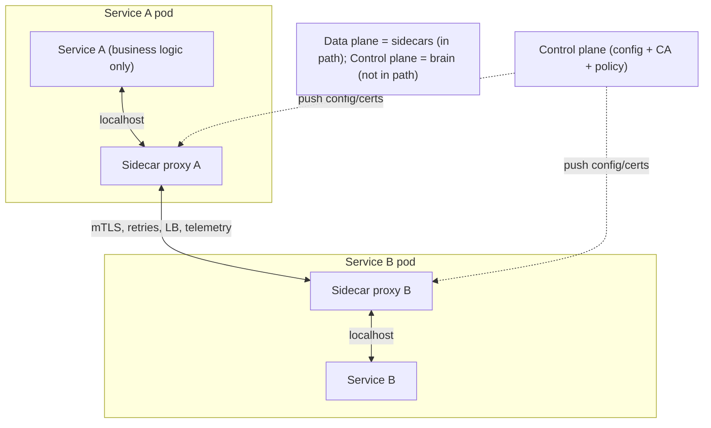
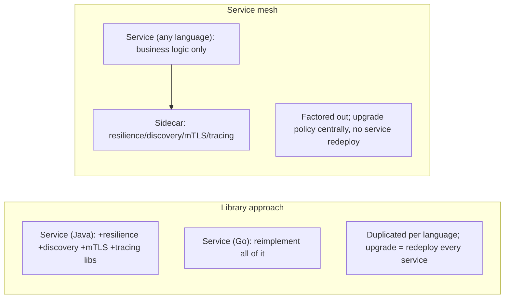

# Lesson 12.7 — Service Mesh: Sidecars, mTLS, Traffic Policy

> Part 12: Microservices · Difficulty: 🔴⚫
>
> **Prerequisites:** [3.2.3 TLS/SSL/mTLS/PKI], [3.3.1 Load Balancing], [11.3 Resilience Patterns], [12.3 Communication], [12.6 Discovery/Gateway/BFF], [Part 16 preview: Observability].
> **Unlocks:** [Part 13 Cloud Native], [Part 15 Security (zero-trust)], [Part 16 Observability].

---

## 1. Learning Objectives

After this lesson you will be able to:

- Explain the **problem a service mesh solves**: cross-cutting **service-to-service (east-west)** concerns (discovery, resilience, mTLS, telemetry) that would otherwise be **duplicated in every service** in every language.
- Describe the **sidecar proxy** architecture and the **data plane / control plane** split.
- Enumerate what a mesh provides: **mTLS + identity**, **traffic management** (routing, canary, retries, timeouts, circuit breaking), **observability** (metrics, traces, logs), and **policy**.
- Weigh the **costs**: extra latency/resource per hop, operational complexity, and when a mesh is **overkill**.
- Position the mesh relative to **libraries** (e.g., resilience libs), the **API gateway** (12.6), and emerging **sidecar-less** approaches `[EMERGING]`.

---

## 2. Motivation — Stop rewriting the network layer in every service

By now every inter-service call must carry a heavy payload of cross-cutting concerns: **service discovery** (12.6), **load balancing** (3.3.1), **timeouts, retries, circuit breakers, bulkheads** (11.3), **mutual TLS** for zero-trust security (3.2.3/Part 15), and **metrics, logs, and distributed tracing** (Part 16). In early microservices practice, all of this lived in **application libraries** — every service imported a resilience library, a discovery client, a tracing SDK, and TLS code. This created two serious problems. First, **duplication across languages**: a polyglot fleet (12.1) needed each capability reimplemented and kept consistent in Java, Go, Python, Node, etc. — expensive and error-prone. Second, **coupling of infrastructure concerns to business code**: upgrading a retry policy or rotating certificates meant **rebuilding and redeploying every service**, and the network behavior of the system was scattered across dozens of codebases with no central control.

The **service mesh** is the response: **move all of this out of the application and into a dedicated infrastructure layer** — a **sidecar proxy** deployed alongside each service instance that transparently intercepts all its network traffic and applies discovery, resilience, mTLS, and telemetry — controlled centrally by a **control plane**. The service's own code shrinks back to **just business logic**, making a plain network call to `localhost`; the sidecar does the rest. This lesson develops the sidecar/control-plane architecture, what the mesh provides, and — crucially — when it's worth its very real costs (many systems don't need one).

---

## 3. Theory — From first principles

### 3.1 The problem: east-west cross-cutting concerns

`[CS]` **East-west traffic** = **service-to-service** communication *inside* the system (contrast **north-south** = client↔system at the gateway — 12.6). Every east-west call needs `[CS]`:
- **Discovery + load balancing** (12.6/3.3.1) — find and pick a healthy instance.
- **Resilience** (11.3) — timeouts, retries+backoff, circuit breaking, bulkheads.
- **Security** — **mTLS** (mutual auth + encryption — 3.2.3), authorization (which service may call which).
- **Observability** (Part 16) — metrics (latency/errors/throughput), distributed traces, access logs.
- **Traffic control** — routing rules, canary/blue-green splits, fault injection.

Putting these in **application libraries** → duplicated per language, coupled to business deploys, decentralized/inconsistent (§2). The mesh factors them out.

### 3.2 The sidecar pattern

`[CS]` A **sidecar** is a **proxy process deployed alongside each service instance** (e.g., in the same Kubernetes pod), sharing its lifecycle `[CS]`:
- **All of the service's inbound and outbound traffic is transparently routed through its sidecar** (via iptables/eBPF interception) — the service just talks to `localhost`, unaware.
- The sidecar (e.g., **Envoy** — representative) applies discovery, LB, retries, timeouts, circuit breaking, **mTLS** (terminating/originating TLS with the peer sidecar), and emits telemetry.
- The service code becomes **infrastructure-agnostic** — no discovery/resilience/TLS/tracing libraries needed; it's the same in any language (**polyglot-friendly** — a key win).
- `[CS]` This is the **decorator/proxy pattern at the process level** — behavior added around the service without modifying it (2.4.2).

### 3.3 Data plane vs control plane

`[CS]` A service mesh splits into two planes `[CS]`:
- **Data plane:** the **fleet of sidecar proxies** that actually **carry and act on the traffic** (route, balance, retry, encrypt, measure). It's in the request path for every call.
- **Control plane:** the **central brain** that **configures** all the sidecars — distributes routing rules, mTLS certificates/identity (a built-in CA — §3.4), resilience policies, and collects telemetry. It is **not** in the request path (so its outage doesn't immediately stop traffic — existing config keeps working, but you can't push changes).
- `[BP]` **Operators set policy once in the control plane** (declaratively) → it's pushed to all sidecars → **centralized control, decentralized enforcement**. Change a retry policy or rotate certs **without touching or redeploying services** — the core operational win.
- Examples (representative): **Istio** (Envoy data plane + Istiod control plane), **Linkerd** (lightweight Rust micro-proxy). *(Representative.)*

### 3.4 What the mesh provides

`[CS]` The mesh's feature set (all **without application code changes**):
- **Security — mTLS + identity** `[BP]`: automatic **mutual TLS** between all services (encryption + both sides authenticated by cryptographic **workload identity**), with **automatic certificate issuance/rotation** by the control-plane CA. This is the backbone of **zero-trust networking** (Part 15) — the network is untrusted, every call is authenticated/encrypted. Plus **authorization policies** (service A may call service B's endpoint X).
- **Traffic management** `[BP]`: fine-grained **routing** (by header/version), **canary/blue-green/weighted** rollouts (send 5% to v2 — Part 13/14), **traffic mirroring/shadowing**, **timeouts/retries/circuit breaking/outlier detection** (11.3) configured centrally, **fault injection** (inject latency/errors for chaos testing — Part 14), and **rate limiting**.
- **Observability** `[BP]`: uniform **golden-signal metrics** (latency, traffic, errors, saturation — Part 14/16), **distributed-trace** context propagation and span emission (Part 16), and **access logs** — for **every** service, consistently, **for free** (the sidecar sees all traffic). This is often the single biggest reason teams adopt a mesh.
- **Reliability**: load balancing, retries, failover, locality-aware routing — the 11.3 patterns applied uniformly.

### 3.5 The costs — a mesh is not free

`[BP]` The mesh imposes real costs; adopt it deliberately `[BP]`:
- **Latency:** each call now traverses **two extra proxies** (caller's sidecar + callee's sidecar) → added hops/latency per request (small per hop but real, and it compounds on chatty paths — 12.3 §3.3, Part 17).
- **Resource overhead:** a sidecar per instance consumes **CPU/memory** — multiplied across the fleet (hundreds of proxies).
- **Operational complexity:** the mesh itself is a **complex distributed system** to install, upgrade, secure, and debug; the control plane is critical infrastructure; misconfiguration can break all traffic.
- **Debugging complexity:** an extra layer between services — "is it my service or the sidecar?" — new failure modes and learning curve.
- `[BP]` **The honest tradeoff:** a mesh **removes duplication and centralizes control** but **adds a heavyweight infrastructure layer**. It pays off at **scale** (many services, polyglot, strong zero-trust/observability needs) and is often **overkill for small deployments** (§3.6) — the same "you must be this tall" caution as microservices themselves (12.1).

### 3.6 When to use a mesh (and alternatives)

`[BP]` Decision guidance:
- **Use a mesh when:** you have **many services**, a **polyglot** fleet (can't maintain libraries per language), strong **zero-trust/mTLS** requirements (Part 15), a need for **uniform observability** (Part 16), and the **operational maturity** to run it (Part 13/14). Its value scales with fleet size and heterogeneity.
- **Don't use a mesh when:** few services, single language (a **resilience/discovery library** may suffice — e.g., a well-supported framework), early stage, or you lack the ops maturity — the mesh's complexity/latency/resource cost outweighs the benefit (§3.5). **Start without one**; add it when the duplication/observability/security pain is real.
- **Alternatives / complements:**
  - **Libraries** (in-process resilience/discovery/tracing) — no extra hop, but per-language and coupled to deploys (the thing meshes replace). Fine for homogeneous small fleets.
  - **API gateway** (12.6) — handles **north-south**, not east-west; **complementary** to a mesh (some products blur into a mesh's ingress gateway).
  - **`[EMERGING]` Sidecar-less / eBPF-based / ambient meshes** — newer approaches (e.g., ambient mesh, eBPF-driven) that reduce the per-pod sidecar overhead by handling mesh functions at the node/kernel level; evolving and contested — reduces resource/latency cost but changes the model. `[EMERGING]`
- `[BP]` **Rule:** the mesh is an **operational-maturity + scale** decision — adopt for the concrete pain (polyglot duplication, mTLS everywhere, uniform observability), not by default.

---

## 4. Visual Intuition

### Sidecar interception + control plane

### Library vs mesh (where the concerns live)

---

## 5. Real-World Analogy

Think of a company where every department must handle its own **shipping, security, and record-keeping** for anything it sends to another department — versus hiring a **standardized internal logistics company** that embeds a **dedicated logistics clerk beside every department** (the sidecar).

- **The library approach (do-it-yourself):** each department buys its own postage meter, hires its own security guard to seal and verify packages, keeps its own delivery logs, and learns its own routing rules. If the company changes its security policy (say, "all packages must now be tamper-sealed a new way"), **every single department** must retrain and re-equip — and departments that speak different "languages" (different tech stacks) each implement it differently, inconsistently.
- **The service mesh (a clerk beside every desk):** the company embeds a **logistics clerk (sidecar)** right next to each department. A department just hands its package to **the clerk at the next desk** ("localhost") and forgets about it. The clerk **finds the recipient's current office** (discovery), **picks the best route** (load balancing), **retries if delivery fails** (resilience), **seals and verifies every package cryptographically** so no one can tamper or impersonate (**mTLS + identity**), and **logs every shipment** with tracking numbers (observability). The department itself does **none** of this — it focuses on its actual work.
- **The control plane (logistics HQ):** a central **logistics headquarters** sets all the policies — routing rules, the sealing standard, retry limits — and **pushes them to every clerk**. To change the security standard, HQ updates the policy **once** and all clerks adopt it — **no department is disturbed** (no service redeploy). HQ also **issues and rotates the tamper-seals (certificates)** automatically. Notably, if HQ goes on holiday (control-plane outage), the clerks **keep working with their last instructions** — deliveries continue; you just can't change policy until HQ is back.
- **The cost:** every package now passes through **two clerks** (sender's and receiver's), adding a little time (latency), and you're **paying a clerk's salary for every desk** (resource overhead per sidecar). For a **huge, multilingual company** this is a bargain versus the chaos of do-it-yourself. For a **tiny two-person shop**, hiring a logistics company is **absurd overkill** — they should just walk the package over themselves (a library, or nothing).

---

## 6. Industry Example

- **Istio (Envoy + Istiod)** `[CONV]`: the widely-known mesh — Envoy sidecars (data plane) configured by Istiod (control plane) providing mTLS, traffic management, and telemetry (§3.3/3.4). *(Representative.)*
- **Linkerd** `[CONV]`: a lightweight, Rust micro-proxy mesh emphasizing simplicity and low overhead (§3.3). *(Representative.)*
- **Envoy as the ubiquitous data-plane proxy** `[CONV]`: the L7 proxy underlying many meshes and gateways (§3.2). *(Representative.)*
- **Automatic mTLS for zero-trust** `[CONV]`: orgs use the mesh to get workload-identity mTLS across the fleet without touching app code (§3.4, Part 15). *(Representative.)*
- **`[EMERGING]` Ambient / eBPF meshes** `[EMERGING]`: newer sidecar-less designs (e.g., Istio ambient, Cilium/eBPF) reducing per-pod overhead — evolving (§3.6). *(Representative.)*

---

## 7. Implementation Details — running a mesh

- **Decide you need it first** (§3.6): scale + polyglot + zero-trust + uniform observability + ops maturity; otherwise use a library or nothing.
- **Deploy sidecars** (usually auto-injected into pods) so all traffic is intercepted transparently (§3.2); services keep talking to `localhost`.
- **Run the control plane as critical HA infrastructure** (§3.3); understand that its outage stops **config changes**, not existing traffic.
- **Turn on mTLS + workload identity** (§3.4, 3.2.3) for zero-trust; let the mesh CA auto-issue/rotate certs; add **authorization policies** (who calls whom).
- **Configure resilience centrally** (11.3): timeouts, retries(backoff), circuit breaking/outlier detection, locality-aware LB — declaratively, no service redeploy.
- **Use traffic management** for **canary/blue-green/weighted** rollouts (Part 13/14) and **fault injection** for chaos (Part 14).
- **Wire observability** (Part 16): consume the mesh's golden-signal metrics/traces/logs; ensure **trace-context propagation** end-to-end (the mesh propagates but apps must forward headers).
- **Budget the overhead** (§3.5): size for the extra latency/CPU/memory; monitor sidecar resource use; watch chatty paths (12.3/Part 17).

---

## 8. Advantages

- **Language-agnostic cross-cutting** — resilience/discovery/mTLS/telemetry for **any** service without libraries (§3.2) — the polyglot win.
- **Centralized control** — change policy/certs/routing centrally, no service redeploy (§3.3).
- **Zero-trust mTLS + identity for free** — automatic encryption + mutual auth + cert rotation (§3.4, Part 15).
- **Uniform observability** — consistent golden-signal metrics/traces/logs for every call (§3.4, Part 16) — often the top reason to adopt.
- **Advanced traffic management** — canary/blue-green/mirroring/fault-injection without app changes (§3.4).
- **Decoupling** — business code shrinks to business logic (§3.2).

---

## 9. Disadvantages / costs

- **Latency** — two extra proxy hops per call, compounding on chatty paths (§3.5).
- **Resource overhead** — a sidecar per instance × the whole fleet (§3.5).
- **Operational complexity** — the mesh is itself a complex distributed system to run/upgrade/secure (§3.5).
- **Debugging complexity** — an extra layer + new failure modes + learning curve (§3.5).
- **Control-plane criticality** — its failure blocks config changes (and mis-config can break all traffic) (§3.3).
- **Overkill for small systems** — cost outweighs benefit below a scale/heterogeneity threshold (§3.6).

---

## 10. When NOT to use a service mesh

- **Few services / single language** — a resilience/discovery **library** suffices; the mesh's overhead isn't justified (§3.6).
- **Early stage / low ops maturity** — you can't run a mesh well yet; start simpler (§3.6, 12.1).
- **Latency-critical chatty paths** where extra proxy hops matter — measure carefully (§3.5, Part 17).
- **When a gateway alone meets the need** — north-south only; you may not need east-west mesh (§3.6, 12.6).
- **When the concern is business logic** — a mesh handles infrastructure, not business rules (§3.1).

---

## 11. Common Mistakes

1. **Adopting a mesh prematurely** — small/homogeneous system drowns in mesh complexity (§3.6, 12.1).
2. **Ignoring the latency/resource cost** — surprised by added tail latency and CPU/memory across the fleet (§3.5).
3. **Treating the control plane as non-critical** — no HA, then can't push config in an incident (§3.3).
4. **Mesh misconfiguration breaking all traffic** — a bad global policy pushed everywhere (§3.3).
5. **Expecting the mesh to propagate trace context automatically end-to-end** — apps still must forward tracing headers (§3.4, Part 16).
6. **Conflating mesh (east-west) with gateway (north-south)** — using one for the other's job (§3.6, 12.6).
7. **Duplicating resilience in both libraries and the mesh** — conflicting retries/timeouts stacking (§3.4, 11.3).
8. **No plan for the overhead at scale** — sidecar resource cost surprises the budget (§3.5).

---

## 12. Interview Questions

**🟢 Easy**
- What is a service mesh, and what problem does it solve?
- What is a sidecar proxy? What's the difference between the data plane and control plane?

**🟡 Medium**
- What does a mesh provide (security/traffic/observability), and why is it valuable for a polyglot fleet?
- What are the costs of a mesh, and when is it overkill?

**🔴 Hard**
- How does a mesh implement zero-trust mTLS with automatic cert rotation, and why is that hard to do with libraries?
- Compare doing resilience (11.3) in a library vs a mesh. What are the tradeoffs, and what goes wrong if you do both?

**⚫ Staff+**
- You run 80 polyglot services on Kubernetes with growing security (mTLS) and observability needs. Make the case for (or against) a service mesh: what it buys you, the latency/resource/ops costs, how you'd roll it out safely, and what stays in the gateway (12.6) vs the mesh.
- Design the network/security/observability layer for a zero-trust microservices platform: mesh vs libraries vs emerging sidecar-less approaches, control-plane HA, and how canary deploys + fault injection + tracing are enabled without app changes.

---

## 13. Production Pitfalls

- **Tail-latency regression after adoption:** the two-proxy overhead noticeably raised p99 on chatty paths (§3.5, Part 17).
- **Fleet-wide outage from a bad control-plane push:** one misconfigured policy propagated to all sidecars and broke traffic (§3.3).
- **Control-plane down during an incident:** couldn't push a fix/route change because the control plane was unavailable (§3.3).
- **Resource exhaustion:** aggregate sidecar CPU/memory across hundreds of pods blew the cluster budget (§3.5).
- **Double resilience:** app-library retries + mesh retries multiplied → retry storms (§3.4, 11.3).
- **Broken traces:** teams assumed the mesh gave full tracing but apps didn't propagate context → disjointed traces (§3.4, Part 16).

---

## 14. Optimization Techniques

- **Adopt only at the right scale** — the biggest optimization is not paying the cost until it's warranted (§3.6).
- **Lightweight proxies** (e.g., Linkerd's micro-proxy) or **`[EMERGING]` sidecar-less/eBPF/ambient** meshes to cut per-pod overhead (§3.6).
- **Locality-aware load balancing** in the mesh to reduce cross-zone latency (§3.4).
- **Centralized, consistent resilience** (avoid double retries between app + mesh) with sane budgets (§3.4, 11.3).
- **mTLS + auto cert rotation** for zero-trust without app burden (§3.4, Part 15).
- **Consume mesh telemetry** for golden signals/tracing rather than instrumenting each app (§3.4, Part 16).
- **Reduce chatty east-west traffic** (good boundaries — 12.2; local data — 12.4) so the per-hop overhead matters less (§3.5).

---

## 15. Summary

A **service mesh** factors out the cross-cutting concerns of **east-west (service-to-service)** communication — **discovery + load balancing** (12.6/3.3.1), **resilience** (timeouts/retries/circuit breaking/bulkheads — 11.3), **mTLS + identity** (3.2.3/zero-trust — Part 15), and **observability** (golden-signal metrics, distributed traces, access logs — Part 16) — out of **application libraries** (where they're duplicated per language and coupled to business deploys) and into a **dedicated infrastructure layer**. It does this with the **sidecar pattern**: a **proxy process (e.g., Envoy) deployed beside each service instance** that **transparently intercepts all its traffic** (the service just talks to `localhost`, unaware and language-agnostic) and applies discovery/resilience/mTLS/telemetry. The mesh splits into a **data plane** (the fleet of sidecars, **in** the request path, carrying and acting on traffic) and a **control plane** (the central brain — **not** in the request path — that pushes routing rules, resilience policy, and CA-issued/rotated certificates to all sidecars, and collects telemetry): **centralized control, decentralized enforcement**, so you can change a retry policy or rotate certs **without redeploying any service**. What it provides, all **without app code changes**: automatic **mTLS + workload identity** (the backbone of zero-trust — encryption + mutual auth + auto cert rotation + authorization policies), **traffic management** (header/version routing, canary/blue-green/weighted rollouts, mirroring, fault injection, central timeouts/retries/circuit breaking), and **uniform observability** (consistent golden-signal metrics, trace propagation, access logs for every call — often the #1 reason to adopt). But it is **not free**: **two extra proxy hops** of latency per call (compounding on chatty paths — Part 17), a **sidecar's CPU/memory per instance** across the whole fleet, and the **operational + debugging complexity** of running a complex distributed system whose control plane is critical infrastructure. So the mesh is an **operational-maturity + scale** decision (the same "you must be this tall" as microservices — 12.1): adopt it for the **concrete pain** — many polyglot services, mTLS everywhere, uniform observability — and **not by default**; small/homogeneous systems are better served by a **resilience/discovery library** (no extra hop) or nothing, and emerging **`[EMERGING]` sidecar-less/eBPF/ambient** approaches aim to cut the overhead. The mesh (east-west) is **complementary** to the API gateway (north-south — 12.6): gateway fronts the edge, mesh fabricates internal communication.

---

## 16. Revision Notes (flashcard-ready)

- **Q:** What problem does a service mesh solve? **A:** East-west cross-cutting concerns (discovery/resilience/mTLS/telemetry) duplicated per-language in app libraries.
- **Q:** Sidecar? **A:** A proxy process beside each service instance that transparently intercepts all its traffic (service talks to localhost).
- **Q:** Data plane vs control plane? **A:** Data plane = sidecars carrying traffic (in path); control plane = central brain pushing config/certs (not in path).
- **Q:** Control-plane outage effect? **A:** Existing traffic keeps flowing with last config; you just can't push changes.
- **Q:** What does a mesh provide? **A:** mTLS+identity (zero-trust), traffic management (canary/routing/fault injection), resilience, uniform observability — no app changes.
- **Q:** Big operational win? **A:** Change policy/certs/routing centrally without redeploying services; language-agnostic.
- **Q:** Costs? **A:** Two extra proxy hops (latency), sidecar CPU/mem per instance, mesh operational + debugging complexity.
- **Q:** When to use a mesh? **A:** Many polyglot services + zero-trust mTLS + uniform observability + ops maturity; overkill for small/homogeneous systems.
- **Q:** Mesh vs gateway? **A:** Mesh = east-west (service↔service); gateway = north-south (client↔system); complementary.
- **Q:** Emerging alternative? **A:** [EMERGING] sidecar-less / eBPF / ambient meshes reducing per-pod overhead.

---

## 17. Further Reading + Knowledge-Graph Links

**Foundations (in-platform):**
- **[3.2.3 TLS/SSL/mTLS/PKI]** — mutual TLS, certificates, identity.
- **[3.3.1 Load Balancing]** — the balancing the sidecar performs.
- **[11.3 Resilience Patterns]** — timeouts/retries/circuit breaker/bulkhead the mesh enforces.
- **[12.3 Communication]** & **[12.6 Discovery/Gateway/BFF]** — the east-west traffic and the north-south counterpart.

**Unlocks / next:**
- **[Part 13 Cloud Native]** — Kubernetes, where meshes run; sidecar/ambassador patterns.
- **[Part 15 Security]** — zero-trust networking, mTLS, workload identity.
- **[Part 16 Observability]** — golden signals, distributed tracing the mesh feeds.

**External (canonical):**
- Istio & Linkerd documentation (architecture, mTLS, traffic management). *(Representative.)*
- Newman, *Building Microservices* (2nd ed.) — service mesh chapter.
- Envoy proxy documentation. *(Representative.)*

> **Knowledge-graph:** `11.3 resilience` + `3.2.3 mTLS` + `12.6 discovery` → **`12.7 service mesh`** (sidecars/control plane) → `Part 13 cloud native` / `Part 15 zero-trust` / `Part 16 observability`.
