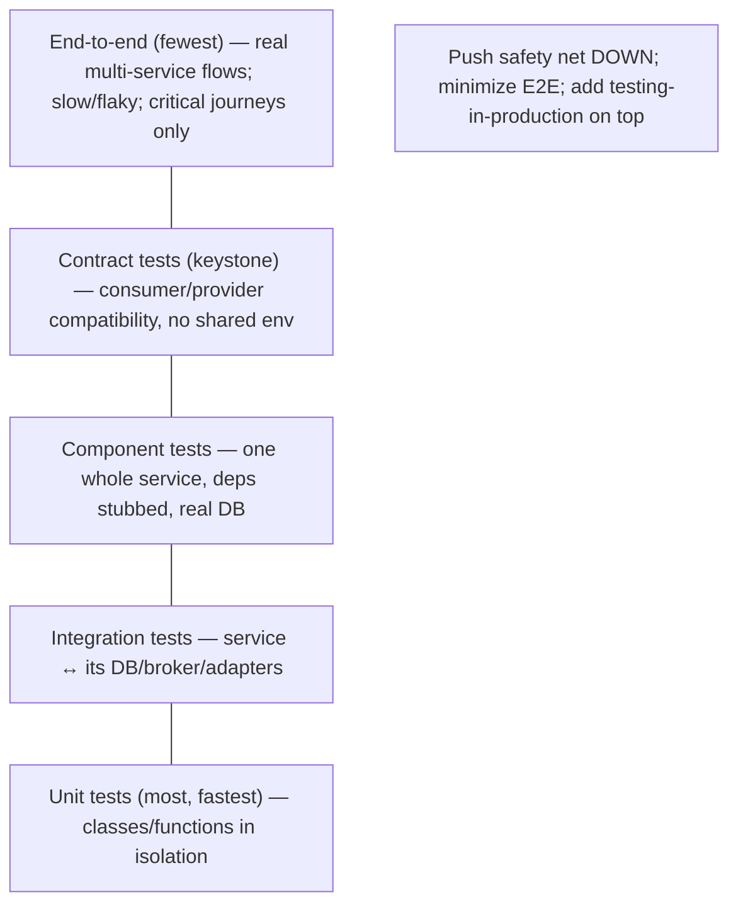
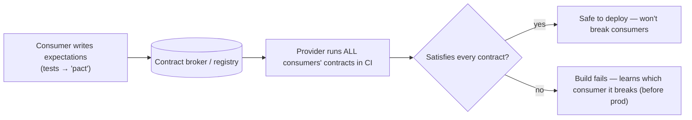

# Lesson 12.8 — Testing Strategies: Contract Tests, Consumer-Driven Contracts

> Part 12: Microservices · Difficulty: 🔴
>
> **Prerequisites:** [3.2.6 API Styles & Serialization], [4.3.1 Data Encoding & Schema Evolution], [12.3 Communication], [12.4 Data Management], [12.5 Saga & Outbox].
> **Unlocks:** [Part 14 SRE (progressive delivery)], [12.9 Migration].

---

## 1. Learning Objectives

After this lesson you will be able to:

- Explain why **testing microservices is fundamentally harder** than testing a monolith, and why **end-to-end tests don't scale** as the trust anchor.
- Apply the **test pyramid** for microservices: unit → integration → **component** → **contract** → (minimal) end-to-end.
- Define **contract testing** and, specifically, **consumer-driven contracts (CDC)** — and explain how they let services deploy independently **without breaking consumers** (12.3).
- Distinguish **integration/component tests**, **contract tests**, and **end-to-end tests**, and know what each does and does *not* verify.
- Combine contract testing with **testing in production** (canary, synthetic monitoring — Part 14) as the realistic modern strategy.

---

## 2. Motivation — The test that used to work no longer does

In a monolith, testing is comparatively tractable: everything runs in **one process**, so you can wire up components, run the whole app in a test, and an **end-to-end test** genuinely exercises the real system. In microservices, that comfortable world collapses. The system is now **dozens of independently-deployed services**, each with its **own database** (12.4), communicating over the **network** (12.3), owned by **different teams** deploying on **different schedules**. Three things break:

First, **end-to-end tests become slow, flaky, and unscalable.** To test one flow end-to-end you must spin up *many* services + their databases + brokers; any one being down or slow fails the test for reasons unrelated to your change; the combinatorial surface is enormous; and you can't run them fast enough to gate every deploy. Relying on E2E tests as the safety net produces a **brittle, slow pipeline** that teams learn to ignore.

Second, and most importantly, **the central risk shifts to the integration points** — the contracts between services (12.3). The most common way to break production in microservices is a **provider changing its API/event schema in a way that breaks a consumer** — precisely because you **can't deploy all services atomically** (12.3 §3.7). A test strategy must verify **compatibility at every boundary** *before* deploy, without requiring all services to be running together.

The answer is a rebalanced **test pyramid** anchored not by E2E tests but by **contract tests** — and especially **consumer-driven contracts**, where consumers publish their expectations and providers verify against them in CI, guaranteeing "never break a consumer" (12.3) as an automated check. This lesson develops the microservices test pyramid and contract testing as its keystone.

---

## 3. Theory — From first principles

### 3.1 Why microservices testing is hard

`[CS]` The difficulties, all stemming from distribution + independent deployment:
- **Many moving parts:** a flow spans services + databases + brokers; running "the whole system" for a test is expensive and fragile.
- **Independent deployment/teams:** services change on different schedules; you can't assume the versions you tested against are what's in production.
- **Network + partial failure** (8.1.1): tests must account for timeouts, retries, and failures that don't exist in-process.
- **Eventual consistency** (12.4): asynchronous/event flows don't complete synchronously → tests must wait/poll, and correctness is time-dependent.
- **The real risk is the boundary:** most breakages are **integration contract** violations, not internal logic bugs.

### 3.2 The microservices test pyramid

`[CS]` The classic **test pyramid** (many cheap fast tests at the bottom, few expensive slow tests at the top), adapted `[BP]`:
- **Unit tests (most, fastest):** test a class/function **in isolation** within one service. Cheap, fast, deterministic — the bulk.
- **Integration tests:** test a service against its **immediate dependencies' interfaces** — e.g., the service ↔ its **own database**, or the service ↔ a **broker/adapter** — verifying it integrates correctly with infrastructure it owns (often using real DB/broker in a container, or the persistence layer).
- **Component tests:** test **one whole service in isolation**, with its **external dependencies stubbed/mocked** (other services replaced by test doubles) and its own database real. Verifies the service's behavior through its API end-to-end **without** the rest of the fleet — fast and reliable.
- **Contract tests (the keystone — §3.3):** verify that the **interaction between a consumer and a provider conforms to an agreed contract** — without running both together. Cheap, fast, and they catch the #1 microservices failure (broken integration).
- **End-to-end tests (fewest, top):** exercise a **real flow across multiple deployed services**. Highest fidelity but slowest/flakiest → keep to a **small set of critical user journeys** only.
- `[BP]` **The shift vs monolith:** push the safety net **down** to unit/component/contract tests; **minimize** E2E; supplement with **testing in production** (§3.6). Don't invert the pyramid (lots of E2E) — that's the anti-pattern that produces slow, flaky pipelines.

### 3.3 Contract testing

`[CS]` A **contract** is the agreement between a **consumer** (caller) and a **provider** (callee) about the interaction — request/response shape, fields, types, status codes, event schema (12.3 §3.6). **Contract testing verifies both sides honor it — separately** `[CS]`:
- Instead of running consumer + provider together, you capture the **contract** and test each side against it:
  - The **consumer** is tested against a **mock provider** that behaves per the contract (does the consumer send valid requests and handle the agreed responses?).
  - The **provider** is tested against the **contract** (does the provider actually satisfy what consumers expect?).
- If both pass, they are **compatible** — verified **without** a shared running environment, **fast** and in each team's own CI.
- **This directly enforces "a provider must never break its consumers" (12.3 §3.7):** if a provider change violates a contract, its build fails **before** deploy.

### 3.4 Consumer-driven contracts (CDC)

`[CS]` **Consumer-driven contracts** are the powerful refinement: **the consumers define the contract** — they specify *exactly what they need* from the provider `[CS]`:
- **Flow:** each consumer writes tests expressing its expectations of the provider → these generate a **contract (a "pact")** → the contracts are shared with the provider (via a **broker/registry**) → the **provider runs all its consumers' contracts in its CI** and must satisfy **every** one to deploy.
- **Key property:** the provider knows **exactly which consumers depend on what**, so it can:
  - **Change safely:** if a change breaks a contract, the provider's build fails → it learns *before* production which consumer it would break.
  - **Remove/deprecate safely:** if no consumer's contract uses a field, it's safe to remove it (data-driven deprecation — 12.3 §3.7).
- `[BP]` **Why "consumer-driven":** the provider builds/keeps **only what consumers actually use**, and gets an automated guarantee it won't break them — solving the independent-deployability testing problem (12.1). (e.g., **Pact**, **Spring Cloud Contract** — representative.)
- **Scope:** works for both **synchronous** APIs (request/response) and **asynchronous** messages/events (the contract is the message schema + semantics — critical for event-driven systems and sagas — 12.5).

### 3.5 What each test level does and doesn't verify

`[BP]` Crucial to avoid false confidence:
- **Contract tests verify *compatibility of the interaction* (structure/schema/semantics of the contract), NOT that the end-to-end business flow is correct.** They ensure A and B *can talk*; they don't prove the whole saga produces the right outcome.
- **Component tests verify one service's behavior** with dependencies stubbed — not real inter-service behavior.
- **E2E tests verify a real flow** but are slow/flaky and can't cover the combinatorial space.
- `[BP]` **The combination is the strategy:** unit + component (each service correct in isolation) + **contract** (services are mutually compatible) + a **few** E2E (critical journeys really work) + **production testing** (real behavior under real conditions — §3.6). No single level suffices; contract testing is what **replaces the bulk of E2E** for integration safety.

### 3.6 Testing in production (the realistic complement)

`[BP]` Because pre-production can never fully replicate production (scale, data, real dependencies, real failures), modern practice **also tests in production** — safely `[BP]`:
- **Canary releases / progressive delivery** (Part 13/14): deploy to a **small % of traffic**, watch metrics (golden signals — Part 16), roll back automatically on regression — often via the **service mesh** (12.7) or deployment platform.
- **Synthetic monitoring:** continuously run scripted **synthetic transactions** against production to detect broken flows before users do.
- **Shadow/mirror traffic** (12.7): send a copy of real traffic to a new version without affecting users, to validate it.
- **Feature flags:** decouple deploy from release; turn features on gradually and kill instantly.
- **Observability as testing** (Part 16): rich metrics/traces/logs to detect and diagnose issues fast (optimize MTTR — 11.1).
- `[BP]` **Mindset:** you can't test everything before deploy in a distributed system → **combine strong pre-prod contract/component testing with safe progressive rollout + observability in prod.** This is the honest modern strategy.

---

## 4. Visual Intuition

### The microservices test pyramid

### Consumer-driven contract flow

---

## 5. Real-World Analogy

Think of manufacturing parts that must **fit together** — versus assembling the entire machine every time you tweak one part.

- **The end-to-end trap (assemble the whole machine):** imagine that to test a newly-machined **bolt**, you had to assemble the **entire car** around it every time. Slow, wildly expensive, and if the assembly line is down for any unrelated reason, you can't test your bolt at all. Worse, with hundreds of parts changing daily, you'd never finish assembling. That's over-relying on E2E tests.
- **Contracts = agreed specifications (the drawing with tolerances):** instead, the bolt and the nut are each manufactured to an **agreed specification** — thread pitch, diameter, tolerances (the **contract**). The bolt maker tests their bolt **against the spec**; the nut maker tests their nut **against the same spec** — **separately, in their own workshops**. If both meet the spec, they're guaranteed to fit **without ever assembling the car**. That's **contract testing**: verify compatibility at the interface, independently, fast.
- **Consumer-driven = the users specify the spec:** now suppose the parts that **use** the bolt (the consumers) write down **exactly** what they need — "I need M8 thread, 30mm length, this head shape." The bolt maker (**provider**) collects **all** these requirements and checks that every new bolt design **satisfies every user's stated needs** before shipping. If the bolt maker wants to change the head shape, they instantly see **which users would be broken** and can avoid it — or coordinate. And if **no user** ever asked for the 40mm variant, the bolt maker can safely **stop making it**. That's **consumer-driven contracts**: the users drive the spec, and the maker gets an automatic guarantee they won't break anyone.
- **Testing in production (the test drive):** even with perfectly-specced parts, you still **test-drive the finished car on a closed track with a few cars first** (canary), and keep **dashboard warning lights** running on every car on the road (observability/synthetic monitoring) — because the real road has conditions no workshop test can fully reproduce.

---

## 6. Industry Example

- **Pact (consumer-driven contracts)** `[CONV]`: the widely-used CDC framework — consumers generate pacts, a broker shares them, providers verify in CI (§3.4). *(Representative.)*
- **Spring Cloud Contract** `[CONV]`: contract testing in the Spring ecosystem for HTTP and messaging (§3.3/3.4). *(Representative.)*
- **The inverted-pyramid anti-pattern** `[OPINION]`: teams that leaned on huge E2E suites and got slow, flaky pipelines they eventually distrusted (§3.2). *(Representative.)*
- **Canary + automated rollback** `[CONV]`: progressive delivery gating on golden-signal metrics, often via mesh/deployment platforms (§3.6, Part 14/12.7). *(Representative.)*
- **Synthetic monitoring / production probes** `[CONV]`: scripted transactions continuously validating critical flows in prod (§3.6, Part 16). *(Representative.)*

---

## 7. Implementation Details — a workable strategy

- **Build a pyramid, not an ice-cream cone** (§3.2): lots of unit + component tests per service; **contract tests at every boundary**; a **small** E2E suite for critical journeys only.
- **Component-test each service in isolation** (§3.2): real own-DB (containerized), external dependencies stubbed; test through the service's API.
- **Adopt consumer-driven contracts** (§3.4): consumers publish pacts to a **broker**; providers verify **all** consumer contracts in CI and **fail the build** on any violation — this is your automated "never break a consumer" gate (12.3).
- **Contract-test async too** (§3.4): treat event/message schemas as contracts (schema registry + compatibility checks — 4.3.1); verify producers and consumers against them (critical for sagas — 12.5).
- **Handle eventual consistency** in tests (§3.1): poll/await with sensible timeouts for async outcomes; don't assume synchronous completion.
- **Test failure modes** (11.3): inject timeouts/errors (fault injection via mesh — 12.7) to verify resilience, not just happy paths.
- **Test in production safely** (§3.6): canary + automated rollback (Part 14), feature flags, synthetic monitoring, shadow traffic, and strong observability (Part 16).
- **Keep contracts versioned** and tied to API/schema evolution (4.3.1/12.3) so deprecation is data-driven.

---

## 8. Advantages (of contract/CDC-centered testing)

- **Independent deployability preserved** — providers verify they won't break consumers **before** deploy (§3.4, 12.1).
- **Fast, reliable, cheap** — no shared running environment; runs in each team's CI (§3.3).
- **Catches the #1 failure** — integration/contract breakage (§3.1/3.2).
- **Data-driven deprecation** — remove what no consumer uses (§3.4, 12.3).
- **Scales with the fleet** — unlike E2E, contract tests don't require the combinatorial whole-system setup (§3.2).
- **Works for sync and async** — APIs and event schemas alike (§3.4, 12.5).

---

## 9. Disadvantages / costs

- **Contracts ≠ correctness** — verify compatibility, not end-to-end business correctness (§3.5) — a common false-confidence trap.
- **Setup/tooling + discipline** — CDC needs a broker, CI integration, and cross-team process (§3.4).
- **Contract maintenance** — contracts must be kept accurate as APIs evolve; stale contracts mislead (§3.4).
- **Still need some E2E + prod testing** — no single technique suffices (§3.5/3.6).
- **Async/eventual-consistency testing is fiddly** — timing, polling, nondeterminism (§3.1).
- **Cross-team coordination** — CDC only works if consumers and providers both participate (§3.4).

---

## 10. When NOT to over-rely on each

- **Don't rely on E2E as the main safety net** — slow/flaky/unscalable; keep it minimal (§3.2).
- **Don't treat contract tests as proof of business correctness** — add component + a few E2E + prod monitoring (§3.5).
- **Don't skip production testing** assuming pre-prod is enough — it never fully replicates prod (§3.6).
- **Don't contract-test trivial/internal-only interfaces** where the coordination cost outweighs the benefit — focus on cross-team boundaries (§3.4).
- **Don't test only happy paths** — failure/latency behavior is where microservices break (§3.1, 11.3).

---

## 11. Common Mistakes

1. **Inverted pyramid (too many E2E)** — slow, flaky pipeline teams stop trusting (§3.2).
2. **No contract tests** — providers break consumers in production (the #1 failure) (§3.1/3.4).
3. **Confusing contract tests with correctness** — assume compatible = correct end-to-end (§3.5).
4. **Ignoring async contracts** — event schema drift breaks consumers/sagas silently (§3.4, 12.5).
5. **Stale/unmaintained contracts** — pass CI but don't reflect reality (§3.4).
6. **Not testing failure modes** — only happy paths; resilience untested (§3.1, 11.3).
7. **No production testing** — assuming staging = prod; surprised by real-world behavior (§3.6).
8. **Non-deterministic async tests** — flaky because they don't handle eventual consistency (§3.1).

---

## 12. Interview Questions

**🟢 Easy**
- Why is end-to-end testing harder and less reliable in microservices than in a monolith?
- What is a contract in the context of contract testing?

**🟡 Medium**
- Describe the microservices test pyramid. How does it differ from a monolith's?
- What is consumer-driven contract testing, and how does it let services deploy independently without breaking consumers?

**🔴 Hard**
- What do contract tests verify and what do they NOT verify? How do you avoid false confidence?
- How do you contract-test asynchronous/event-driven interactions, and why does it matter for sagas (12.5)?

**⚫ Staff+**
- Design a testing strategy for a 40-service system where teams deploy independently: the pyramid, where CDC fits, how you gate deploys on "never break a consumer," how you test failure modes and eventual consistency, and how you test in production (canary + synthetic + observability).
- A team's only safety net is a large, flaky E2E suite, and providers keep breaking consumers in prod. Propose a migration to a contract-centered pyramid + progressive delivery, and explain what risk each layer covers.

---

## 13. Production Pitfalls

- **Consumer broken by a provider deploy:** a "compatible-looking" change violated an unverified expectation → prod outage (§3.4) — CDC would have caught it.
- **Green pipeline, broken flow:** all contract tests passed but the end-to-end business outcome was wrong (compatibility ≠ correctness) (§3.5).
- **Silent event-schema drift:** a producer changed an event; consumers/sagas mis-processed it because async contracts weren't tested (§3.4, 12.5).
- **Flaky E2E masking real bugs:** a noisy E2E suite trained the team to ignore failures, hiding a genuine regression (§3.2).
- **Untested failure behavior:** a dependency timeout in prod behaved differently than assumed because only happy paths were tested (§3.1, 11.3).
- **Staging ≠ prod surprise:** behavior under real scale/data/dependencies differed from staging; no canary/observability to catch it (§3.6).

---

## 14. Optimization Techniques

- **Invest in the pyramid's base** — fast unit + component tests catch most bugs cheaply (§3.2).
- **Consumer-driven contracts + broker in CI** — automated "never break a consumer" gate; enables independent deploys (§3.4).
- **Schema registry + compatibility checks** for events (async contracts) (§3.4, 4.3.1).
- **Minimal, curated E2E** for critical journeys only — keep it fast and trustworthy (§3.2).
- **Fault injection (mesh — 12.7)** to test resilience/failure modes cheaply (§3.1, 11.3).
- **Progressive delivery (canary + auto-rollback) + synthetic monitoring** to shift risk detection into prod safely (§3.6, Part 14).
- **Strong observability (Part 16)** so issues are detected/diagnosed fast (MTTR — 11.1) — testing's production complement.

---

## 15. Summary

Testing microservices is **fundamentally harder** than a monolith because the system is **many independently-deployed services** with **their own databases** (12.4), communicating over the **network** (12.3), owned by **teams deploying on different schedules** — so **end-to-end tests become slow, flaky, and unscalable** (spinning up the whole fleet, combinatorial surface, unrelated failures), and the **central risk shifts to the integration contracts between services** (a provider breaking a consumer is the #1 way to break production, precisely because you can't deploy atomically — 12.3). The strategy is a rebalanced **test pyramid** — many **unit** tests, **integration** tests (service ↔ its own DB/broker), **component** tests (one whole service in isolation with dependencies stubbed), **contract** tests as the **keystone**, and only a **small set of E2E** tests for critical journeys — pushing the safety net **down** and refusing the inverted "ice-cream cone." **Contract testing** verifies that a **consumer** and **provider** honor an agreed **contract** (request/response shape, status, event schema) by testing **each side separately** — consumer against a mock provider, provider against the contract — so compatibility is proven **without a shared running environment**, fast, in each team's CI. **Consumer-driven contracts (CDC)** refine this: **consumers specify exactly what they need** (a "pact"), those contracts are shared via a broker, and the **provider must satisfy every consumer's contract in its CI to deploy** — giving an automated guarantee it **won't break consumers** (enforcing 12.3's golden rule) and enabling **data-driven deprecation** (remove what no consumer uses); it works for both **synchronous APIs and asynchronous event schemas** (critical for sagas — 12.5). Crucially, **contract tests verify compatibility, not end-to-end business correctness** — so no single level suffices: combine unit + component (each service correct alone) + **contract** (mutually compatible) + a **few** E2E (critical flows really work) + **testing in production** — because pre-prod never fully replicates prod — via **canary/progressive delivery with automated rollback** (Part 14), **synthetic monitoring**, **shadow traffic** (12.7), **feature flags**, and **observability** (Part 16, optimizing MTTR — 11.1). The honest modern strategy: **strong pre-prod contract/component testing + safe progressive rollout + rich production observability.**

---

## 16. Revision Notes (flashcard-ready)

- **Q:** Why is E2E testing bad as the main safety net in microservices? **A:** Slow, flaky, unscalable — needs the whole fleet + DBs + brokers; combinatorial; fails for unrelated reasons.
- **Q:** What's the biggest microservices testing risk? **A:** A provider breaking a consumer at the integration contract (can't deploy atomically).
- **Q:** The test pyramid (microservices)? **A:** Unit (most) → integration → component → contract (keystone) → few E2E; + testing in production.
- **Q:** Component test? **A:** One whole service in isolation, external deps stubbed, real own-DB, tested via its API.
- **Q:** Contract testing? **A:** Verify consumer and provider honor an agreed contract, each tested separately, no shared env.
- **Q:** Consumer-driven contracts? **A:** Consumers specify what they need (pacts); provider must satisfy all consumer contracts in CI to deploy.
- **Q:** What does CDC guarantee? **A:** Provider won't break consumers (automated 'never break a consumer'); enables safe deprecation.
- **Q:** Do contract tests prove correctness? **A:** No — only compatibility of the interaction; still need component + E2E + prod testing.
- **Q:** Testing in production techniques? **A:** Canary + auto-rollback, synthetic monitoring, shadow traffic, feature flags, observability.
- **Q:** Async contracts? **A:** Treat event/message schemas as contracts (schema registry + compatibility) — vital for sagas.

---

## 17. Further Reading + Knowledge-Graph Links

**Foundations (in-platform):**
- **[3.2.6 API Styles & Serialization]** & **[4.3.1 Data Encoding & Schema Evolution]** — what contracts are made of; compatibility.
- **[12.3 Communication]** — "never break a consumer"; API/event versioning.
- **[12.4 Data Management]** / **[12.5 Saga & Outbox]** — eventual consistency + async contracts to test.

**Unlocks / next:**
- **[Part 14 SRE]** — progressive delivery, canary, chaos engineering.
- **[Part 16 Observability]** — the production-testing complement.
- **[12.9 Migration]** — testing safely during strangler-fig migration.

**External (canonical):**
- Richardson, *Microservices Patterns* — the microservices test pyramid, consumer contract tests.
- Newman, *Building Microservices* — testing chapter, CDC.
- Pact / Spring Cloud Contract documentation. *(Representative.)*
- Fowler, "Testing Strategies in a Microservice Architecture." *(Representative.)*

> **Knowledge-graph:** `12.3 contracts/versioning` → **`12.8 contract + consumer-driven contract tests`** (the automated "never break a consumer") + testing-in-production → `Part 14 progressive delivery` / `Part 16 observability`.
