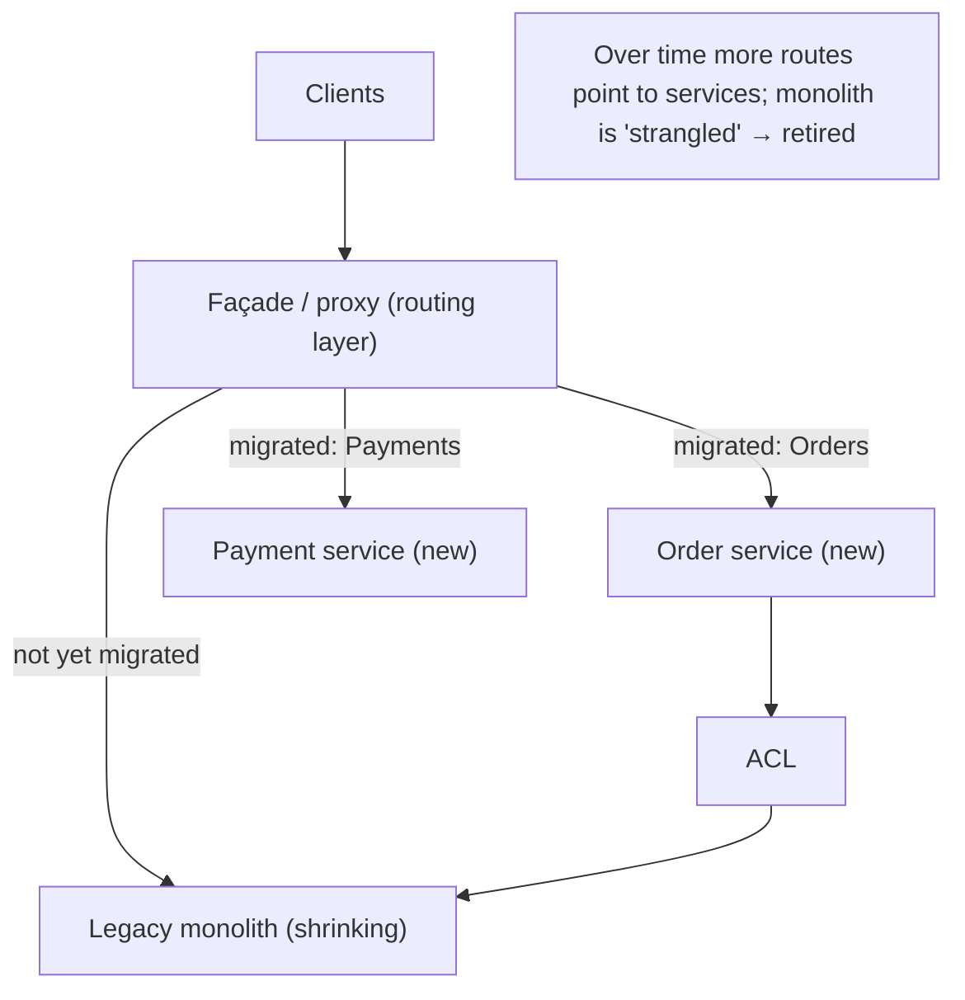
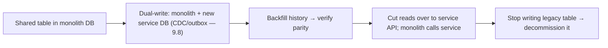

# Lesson 12.9 — Migration: Strangler Fig, Anti-Corruption Layer

> Part 12: Microservices · Difficulty: 🔴
>
> **Prerequisites:** [2.1.3 Domain-Driven Design Essentials], [5.4.3 Schema Migrations Without Downtime], [9.8 CDC & Outbox], [12.1 Why/Why-Not Microservices], [12.2 Decomposition], [12.4 Data Management].
> **Unlocks:** [Part 13 Cloud Native], [Part 18 Case Studies], [Part 20 Capstone].

---

## 1. Learning Objectives

After this lesson you will be able to:

- Explain why **big-bang rewrites fail** and why microservices migration must be **incremental**.
- Apply the **Strangler Fig pattern**: incrementally route functionality from a monolith to new services behind a façade until the monolith is "strangled."
- Use the **Anti-Corruption Layer (ACL)** to keep the legacy model from **corrupting** new services (and vice versa) during the long coexistence period.
- Handle the hardest part — **decomposing the data** (breaking shared tables, dual-writes/CDC, foreign keys across the seam) — using zero-downtime techniques (5.4.3, 9.8).
- Sequence a migration (extract easy/high-value bounded contexts first, measure, iterate) and know when to **stop**.

---

## 2. Motivation — You almost never start greenfield

Most microservices work is not building a new system from scratch — it's **extracting services from an existing monolith** (12.1 recommended monolith-first; 12.2 said decompose only when triggers justify it). So the practical question is: **how do you get from a large, working, business-critical monolith to microservices without stopping the business, without a risky rewrite, and without drawing the wrong boundaries?**

The instinct — a **big-bang rewrite** ("we'll build the new microservices system in parallel and switch over") — is one of the most reliable ways to fail in software. The old system keeps evolving while you rewrite (a moving target), the rewrite always takes far longer than planned, you get **no value until the very end** (a huge all-or-nothing bet), and the switchover is terrifying. History is littered with rewrites that were cancelled after years or shipped broken.

The disciplined alternative is **incremental migration**: keep the monolith running and **extract one capability at a time** into a service, delivering value continuously and **learning the boundaries empirically** (12.2). The two patterns that make this work are the **Strangler Fig** (incrementally divert functionality to new services behind a façade until the monolith withers) and the **Anti-Corruption Layer** (a translation boundary that protects the clean new services from the legacy's messy model during the long period they must coexist). And underneath both lies the genuinely hard part — **splitting the data** (breaking shared tables and cross-module transactions — 12.4) — which uses the zero-downtime data techniques from 5.4.3/9.8. This lesson develops incremental migration as an engineering discipline.

---

## 3. Theory — From first principles

### 3.1 Why big-bang rewrites fail

`[CS]`/`[OPINION]` The **big-bang rewrite** (build the whole new system, then switch) fails predictably `[OPINION]`:
- **Moving target:** the monolith keeps changing (bug fixes, features) during the multi-year rewrite → you're chasing a system that never stands still.
- **No value until the end:** all-or-nothing → years of investment with **zero delivered benefit** until the risky switchover; easy to cancel mid-way.
- **Underestimated scope + hidden behavior:** the monolith encodes years of undocumented business rules/edge cases → the rewrite discovers them painfully late.
- **Terrifying switchover:** a single massive cutover with huge blast radius.
- `[BP]` **Lesson:** migrate **incrementally** — deliver value continuously, reduce risk per step, and learn as you go.

### 3.2 The Strangler Fig pattern

`[CS]` Named after the strangler fig vine that grows around a tree, gradually replacing it until only the new plant remains — **incrementally build new services around the monolith, diverting functionality to them until the monolith is "strangled"** (reduced to nothing / retired) `[CS]`:
- **A façade/proxy in front of the monolith** (an interception layer — often an API gateway/reverse proxy — 12.6/3.3.2) intercepts incoming requests and **routes** each either to the **new service** (for migrated functionality) or the **legacy monolith** (for not-yet-migrated) — **transparently to clients**.
- **Extract one capability at a time:** pick a bounded context/capability (12.2), build it as a new service, then **flip the façade's routing** for that functionality from monolith → new service.
- Over time, more and more is routed to services; the monolith **shrinks** until it can be **retired** (or a small core remains — that's fine).
- `[BP]` **Benefits:** **incremental** (value each step), **reversible** (route back if a service misbehaves — low risk per step), **no big-bang cutover**, **learn boundaries empirically** (12.2), and the system **works throughout**.

### 3.3 The coexistence problem → Anti-Corruption Layer

`[CS]` During migration (which can last **months or years**), new services and the legacy monolith must **coexist and interoperate** — and the legacy has a **different, often messy, data model and semantics** (2.1.3). If a clean new service talks directly to the legacy, the **legacy's model leaks in and corrupts** the new service's design `[CS]`:
- **Anti-Corruption Layer (ACL)** (DDD — 2.1.3): a **translation layer** between the new service and the legacy system that **converts** between the legacy model/protocol and the new service's clean model — so **neither corrupts the other** `[CS]`.
- The ACL **isolates** the new service from legacy quirks: the new service works in **its own clean ubiquitous language** (2.1.3); the ACL does the ugly translation. When the legacy is retired, you **delete the ACL** — the clean service is untouched.
- Works **both directions:** protecting the new service from legacy, and (if needed) presenting new-service data to the legacy in the legacy's terms.
- `[BP]` The ACL is what lets you build **clean** services **before** the messy legacy is gone — essential during the long coexistence.

### 3.4 The hard part: decomposing the data

`[CS]` Splitting **code** is comparatively easy; splitting the **shared database** (12.4) is the hardest, riskiest part `[BP]`:
- The monolith has **one database** with **shared tables**, **cross-module joins**, and **cross-module transactions** — exactly what database-per-service forbids (12.4).
- **The sequence** `[BP]` (Richardson/Newman): often **split the code first** (extract the service, but it *temporarily* still uses the shared DB), then **split the data** (give it its own database) — or split data first, then code — but **the data must eventually be owned privately** (12.4).
- **Breaking a shared table** across the seam:
  - Move the table's data to the new service's database; the monolith now **calls the service's API** instead of querying the table.
  - Use **zero-downtime migration** techniques (5.4.3): **expand/contract**, **dual-write** during transition, **backfill**, and **verify** before cutover.
  - Replace **cross-service foreign keys/joins** with **API calls** or **replicated data via events** (12.4 §3.6, CDC/outbox — 9.8) — the join becomes API composition or a local materialized view.
  - Replace **cross-module transactions** that now span the seam with **sagas** (12.5).
- **Keep data in sync during coexistence:** while both systems need the data, use **CDC/events** (9.8) to replicate changes between legacy DB and new service DB until the legacy no longer needs it.
- `[BP]` This is why **data is the crux** of both microservices (12.4) and migration — plan it explicitly, do it incrementally, and keep it reversible.

### 3.5 Sequencing the migration

`[BP]` How to order the extractions:
- **Start where it pays / is safe** `[BP]`: extract capabilities that are **high-value** (a part needing independent scaling/deployment — 12.1 triggers) or **low-risk/easy** (well-bounded, few dependencies) — to build momentum, learn the process, and de-risk. Avoid starting with the most tangled core.
- **Extract along real bounded contexts** (12.2) — don't carve arbitrary pieces; use the decomposition discipline.
- **Measure and iterate:** after each extraction, verify benefits (deploy independence, scaling) and adjust; boundaries you got wrong are cheaper to fix early.
- **Know when to stop** `[BP]`: the goal is **the right architecture for the business**, not "zero monolith." It's entirely legitimate to **leave a stable core as a (modular) monolith** and only extract what benefits from being a service (12.1). Not everything must become a microservice.
- **Use the façade + ACL throughout** (§3.2/3.3), and **zero-downtime data techniques** (§3.4) for every data split.

### 3.6 Putting it together — the migration loop

`[BP]` The repeatable cycle:
1. **Choose** the next bounded context/capability to extract (high-value or low-risk; real boundary — §3.5, 12.2).
2. **Build** the new service (clean model), with an **ACL** to the legacy (§3.3).
3. **Split the data** incrementally (dual-write/CDC/backfill/verify — §3.4, 5.4.3/9.8); replace joins with API/events and cross-module transactions with sagas (12.5).
4. **Route** that functionality to the new service via the **façade** (§3.2) — canary/gradually (12.8 §3.6), reversible.
5. **Verify** (contract tests — 12.8, observability — Part 16), then **decommission** the old code/tables for that slice.
6. **Repeat**; retire the monolith (or stop when the remaining core is best left as-is — §3.5).

---

## 4. Visual Intuition

### Strangler Fig: façade routes to services or monolith

### Splitting a shared table (zero-downtime)

---

## 5. Real-World Analogy

Think of **renovating a occupied building** — a hospital that must keep treating patients — versus demolishing it and building a new one from scratch.

- **The big-bang rewrite (demolish and rebuild):** you can't tell a working hospital "we're knocking you down and you'll get a shiny new building in three years — no patients until then." The old hospital keeps needing repairs while you build; the new one always runs late; and moving everyone over in one weekend is a nightmare with enormous risk. Software rewrites fail the same way.
- **The Strangler Fig (renovate wing by wing):** instead, you **build a new wing**, move **one department** into it, and **redirect patients for that department to the new wing** while everyone else keeps using the old building. Then another wing, another department — a **receptionist (façade)** directs each patient to "new wing" or "old building" depending on which department they need, and patients don't even notice the transition. Bit by bit the old building empties until it can be closed. Value is delivered continuously, and if a new wing has a problem, you **send patients back to the old building** (reversible).
- **The Anti-Corruption Layer (a translator between old and new):** the shiny new cardiology wing uses **modern equipment and modern terminology**, but it still must read patient histories from the **ancient legacy records system** that uses obsolete codes and a bizarre filing scheme. Rather than let that mess **infect** the new wing's clean systems, you station a **translator (ACL)** at the boundary who converts the old codes into the new wing's clean format (and back). The new wing stays clean; the translator absorbs the ugliness. When the old records system is finally retired, you simply **dismiss the translator** — the new wing never learned the bad habits.
- **Splitting the data (the hard part):** the terrifying part isn't moving departments — it's **splitting the shared patient records**. You can't just yank the files. You **copy records to the new system while keeping both in sync** (dual-write/CDC), **verify they match**, then **switch the new wing to its own records**, and only then **stop updating the old files**. Done carefully, no record is lost and the hospital never stops.
- **Knowing when to stop:** you might renovate 80% of the hospital and decide the **old administrative core works fine as-is** — no need to rebuild everything. Not every department needs a new wing.

---

## 6. Industry Example

- **Strangler Fig as the standard migration pattern** `[CONV]`: the widely-endorsed approach (Fowler coined the term) for incrementally replacing legacy systems (§3.2). *(Representative.)*
- **Façade via API gateway/reverse proxy** `[CONV]`: teams place a routing layer in front of the monolith to divert traffic per-capability to new services (§3.2, 12.6). *(Representative.)*
- **CDC/dual-write for data decomposition** `[CONV]`: Debezium-style CDC and dual-write + backfill to split shared tables without downtime (§3.4, 9.8/5.4.3). *(Representative.)*
- **Anti-corruption layers around legacy/ERP systems** `[CONV]`: translation layers isolating clean new services from legacy models (§3.3, DDD). *(Representative.)*
- **"Stop when it's right" — modular-monolith cores** `[OPINION]`: organizations that deliberately kept a stable core monolithic and only extracted what benefited (§3.5, 12.1). *(Representative.)*

---

## 7. Implementation Details — running an incremental migration

- **Never big-bang** (§3.1): extract incrementally; deliver value each step; keep it reversible.
- **Put a façade in front of the monolith** (§3.2, 12.6/3.3.2): route per-capability to new service or monolith; migrate by flipping routes (canary/gradual — 12.8).
- **Extract along real bounded contexts** (12.2); **start high-value or low-risk** to build momentum (§3.5).
- **Use an ACL** (§3.3) so new services stay clean during coexistence; delete it when legacy retires.
- **Split data with zero-downtime techniques** (§3.4, 5.4.3): dual-write + CDC (9.8) + backfill + verify parity + gradual read cutover + decommission; replace cross-seam joins with API/events (12.4) and cross-module transactions with sagas (12.5).
- **Keep data in sync** during coexistence via CDC/events (9.8).
- **Verify each step** with contract tests (12.8) and observability (Part 16); be ready to route back.
- **Know when to stop** (§3.5): leave a stable core monolithic if that's the right architecture — the goal is business value, not "zero monolith."

---

## 8. Advantages

- **Low risk per step** — small, reversible changes vs one terrifying cutover (§3.1/3.2).
- **Continuous value** — benefits delivered throughout, not only at the end (§3.1).
- **Empirical boundary learning** — discover the right boundaries as you go; cheap to correct early (§3.2, 12.2).
- **System works throughout** — no downtime, business continues (§3.2/3.4).
- **Clean new services** — the ACL prevents legacy corruption (§3.3).
- **Reversibility** — route back / roll back a slice that misbehaves (§3.2).

---

## 9. Disadvantages / costs

- **Long coexistence period** — running two systems (legacy + services) simultaneously, with sync overhead, for months/years (§3.3/3.4).
- **Data decomposition is hard/risky** — breaking shared tables, dual-writes, keeping sync (§3.4).
- **ACL + façade are extra components** to build and maintain during migration (§3.2/3.3).
- **Requires discipline** — easy to stall halfway (a permanent, painful hybrid) without commitment (§3.5).
- **Temporary complexity** — the system is *more* complex during migration than before or after (§3.3/3.4).
- **Ongoing legacy sync** — CDC/dual-write pipelines to run and monitor until legacy retires (§3.4).

---

## 10. When NOT to / cautions

- **Don't big-bang rewrite** — the anti-pattern this lesson exists to prevent (§3.1).
- **Don't migrate at all without a trigger** — if the monolith serves the business, decomposing may not be justified (§3.5, 12.1).
- **Don't split data carelessly** — a botched shared-table split risks data loss/inconsistency; use zero-downtime techniques (§3.4, 5.4.3).
- **Don't start with the most tangled core** — start easy/high-value to learn and de-risk (§3.5).
- **Don't feel obligated to eliminate the monolith** — stop when the architecture fits (§3.5).
- **Don't skip the ACL** and let the legacy model corrupt new services (§3.3).

---

## 11. Common Mistakes

1. **Big-bang rewrite** — moving target, no value until the end, terrifying cutover (§3.1).
2. **Migrating code but not data** — leaving a shared database → distributed monolith (§3.4, 12.4).
3. **No ACL** — legacy model leaks into and corrupts new services (§3.3).
4. **Botched shared-table split** — no dual-write/backfill/verify → data loss/inconsistency (§3.4, 5.4.3).
5. **Arbitrary boundaries** — extracting pieces that aren't real bounded contexts (§3.5, 12.2).
6. **Stalling halfway** — a permanent, painful legacy-plus-services hybrid with no end (§3.5).
7. **Starting with the hardest core** — high risk, no momentum (§3.5).
8. **Trying to eliminate every last bit of monolith** — over-decomposing a stable core (§3.5, 12.1).

---

## 12. Interview Questions

**🟢 Easy**
- Why do big-bang rewrites usually fail?
- What is the Strangler Fig pattern?

**🟡 Medium**
- What is an Anti-Corruption Layer, and why is it needed during migration?
- How does a façade/routing layer enable incremental migration transparently to clients?

**🔴 Hard**
- How do you split a shared database table between the monolith and a new service without downtime (dual-write, CDC, backfill, verify, cutover)?
- How do you replace cross-module joins and cross-module transactions once a service owns its own data?

**⚫ Staff+**
- Plan the migration of a large e-commerce monolith to microservices: sequencing (what to extract first and why), the façade + ACL, how you decompose the data safely, how you keep both systems in sync during coexistence, how you verify each step, and when you'd stop.
- Midway through a migration, the team is stuck in a painful hybrid: half the data is dual-written, boundaries are proving wrong, and progress has stalled. Diagnose and propose how to get unstuck (reassess boundaries, prioritize data ownership, decide what to keep monolithic).

---

## 13. Production Pitfalls

- **Dual-write drift:** the legacy table and the new service DB silently diverge because dual-write/CDC wasn't atomic or wasn't monitored (§3.4, 9.8 outbox).
- **Botched cutover data loss:** switching reads to the new service before backfill/verify completed → missing/stale data (§3.4, 5.4.3).
- **Legacy corruption of new services:** skipping the ACL let legacy semantics infect the new model, negating the migration's benefit (§3.3).
- **Stalled half-migration:** the org lost commitment; a permanent, more-complex-than-ever hybrid results (§3.5).
- **Wrong boundary discovered late:** an extracted service turned out mis-bounded; re-splitting across the network + data is costly (§3.5, 12.2).
- **Coexistence sync backlog:** the CDC pipeline keeping legacy and service in sync fell behind → inconsistency window widened (§3.4).

---

## 14. Optimization Techniques

- **Incremental, reversible steps** — smallest safe slice at a time; route back if needed (§3.2).
- **Façade + gradual/canary routing** (12.8 §3.6) to shift traffic safely per capability (§3.2).
- **CDC/outbox for data sync** (9.8) — reliable, low-latency legacy↔service replication during coexistence (§3.4).
- **Expand/contract data migration** (5.4.3) — dual-write, backfill, verify, cutover without downtime (§3.4).
- **ACL to keep new services clean** — quarantine legacy complexity, delete ACL at the end (§3.3).
- **Extract high-value/low-risk first** to build momentum and learn (§3.5).
- **Contract tests + observability** to verify each step and detect regressions fast (12.8/Part 16).
- **Stop at the right architecture** — don't over-invest eliminating a stable core (§3.5).

---

## 15. Summary

Most microservices work is **extracting services from an existing monolith**, so the real question is **how to migrate without stopping the business or drawing the wrong boundaries**. The **big-bang rewrite** (build the new system in parallel, switch over) **reliably fails**: the monolith is a **moving target**, you get **no value until the risky end**, undocumented business rules surface late, and the cutover is terrifying — so migration must be **incremental**. The **Strangler Fig pattern** (after the vine that grows around a tree until only the vine remains) puts a **façade/routing layer** (an API gateway/reverse proxy — 12.6) in front of the monolith that **routes each request to a new service (migrated) or the legacy monolith (not yet)** transparently to clients; you **extract one bounded context/capability at a time** (12.2), **flip its route** from monolith to service, and repeat until the monolith **shrinks and is retired** — delivering value each step, staying **reversible**, working throughout, and **learning boundaries empirically**. Because migration lasts months/years, new services and the legacy must **coexist**, and the legacy's messy model would **leak into and corrupt** clean new services — so an **Anti-Corruption Layer (ACL)** (DDD — 2.1.3) sits at the boundary and **translates** between the legacy model/protocol and the new service's clean model, isolating each from the other; when the legacy retires, you **delete the ACL** and the clean service is untouched. The **hardest, riskiest part is decomposing the data** (12.4): the monolith's **one shared database** with cross-module joins and transactions violates database-per-service, so you split tables using **zero-downtime techniques** (5.4.3) — **dual-write + CDC** (9.8) + **backfill** + **verify parity** + **gradual read cutover** + **decommission** — replacing cross-seam **joins** with API calls or event-replicated local views (12.4) and cross-module **transactions** with **sagas** (12.5), and keeping both systems in sync via CDC during coexistence. **Sequence** by extracting **high-value or low-risk** contexts first (momentum + de-risking), along **real bounded contexts** (12.2), measuring and iterating — and **know when to stop**: the goal is the **right architecture for the business**, not "zero monolith" — leaving a stable core as a **modular monolith** (12.1) is a legitimate, often wise, endpoint. Migration is incremental, reversible, data-centric engineering — not a rewrite.

---

## 16. Revision Notes (flashcard-ready)

- **Q:** Why do big-bang rewrites fail? **A:** Moving target, no value until the end, hidden business rules surface late, terrifying cutover.
- **Q:** Strangler Fig pattern? **A:** A façade routes requests to new services (migrated) or the monolith (not yet); extract one capability at a time until the monolith is retired.
- **Q:** Role of the façade? **A:** Intercept + route per-capability to service or monolith, transparently to clients; flip routes to migrate (reversible).
- **Q:** Anti-Corruption Layer? **A:** A translation layer between new service and legacy that stops the legacy model from corrupting the new (delete it when legacy retires).
- **Q:** Hardest part of migration? **A:** Splitting the shared database (breaking shared tables, joins, cross-module transactions).
- **Q:** How to split a shared table without downtime? **A:** Dual-write + CDC + backfill + verify parity + gradual read cutover + decommission (5.4.3/9.8).
- **Q:** Replace cross-seam joins/transactions with? **A:** Joins → API composition / event-replicated local views; transactions → sagas (12.5).
- **Q:** What to extract first? **A:** High-value or low-risk, well-bounded contexts — build momentum and de-risk.
- **Q:** When to stop migrating? **A:** When the architecture fits the business — leaving a stable core monolithic is legitimate (not "zero monolith").
- **Q:** Migration mindset? **A:** Incremental, reversible, data-centric — never a big-bang rewrite.

---

## 17. Further Reading + Knowledge-Graph Links

**Foundations (in-platform):**
- **[2.1.3 Domain-Driven Design Essentials]** — bounded contexts, anti-corruption layer, context maps.
- **[5.4.3 Schema Migrations Without Downtime]** — expand/contract, dual-write, backfill.
- **[9.8 CDC & Outbox]** — reliable data replication/sync during coexistence.
- **[12.2 Decomposition]** — the boundaries you extract along.
- **[12.4 Data Management]** / **[12.5 Saga & Outbox]** — private data, replacing joins/transactions.

**Unlocks / next:**
- **[Part 13 Cloud Native]** — running the migrated services on modern infra.
- **[Part 18 Case Studies]** / **[Part 20 Capstone]** — evolving real architectures.

**External (canonical):**
- Newman, *Monolith to Microservices* — the definitive migration guide (strangler fig, data decomposition patterns).
- Richardson, *Microservices Patterns* — strangler application, ACL.
- Fowler, "StranglerFigApplication." *(Representative.)*
- Evans, *Domain-Driven Design* — anti-corruption layer.

> **Knowledge-graph:** `12.1 monolith-first` + `12.2 boundaries` → **`12.9 migration`** (strangler fig + ACL) using `5.4.3 zero-downtime` + `9.8 CDC` + `12.5 sagas` → clean incremental decomposition.
