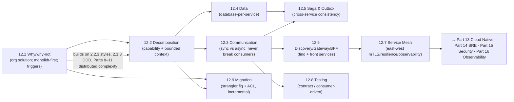

# Part 12 — Microservices ✅ COMPLETE

Building, decomposing, and operating service-based systems — unified by one idea: **microservices are primarily an *organizational* solution (independent teams/deployments) that you pay for with distributed-systems complexity, so decompose along real business boundaries, give each service its own data, connect them with loosely-coupled communication + reliable eventually-consistent workflows, front and connect them with gateways/discovery/mesh, verify compatibility with contract tests, and migrate to them incrementally — never by big-bang.**

---

## Lessons

| # | Lesson | Core idea |
|---|--------|-----------|
| 12.1 | [Why/Why-Not Microservices](12.1-why-why-not-microservices.md) | Real benefits (independent deploy/team autonomy/independent scale/fault isolation/polyglot) vs underestimated costs (Parts 8–11 complexity, sagas, ops, testing); microservices = org solution; monolith-first + decomposition triggers |
| 12.2 | [Service Decomposition](12.2-service-decomposition.md) | Boundaries are destiny; decompose by business capability + bounded context (DDD); high cohesion/loose coupling; avoid layer/entity/nano/god anti-patterns; same concept → per-context model + shared id |
| 12.3 | [Inter-Service Communication](12.3-inter-service-communication.md) | Sync (couples in time+knowledge; chains multiply latency/availability, cascade) vs async/events (decouple deepest); coarse use-case APIs; evolve compatibly; never break consumers; wrap every call in resilience + idempotency |
| 12.4 | [Data Management](12.4-data-management.md) | Database-per-service (private data) — shared DB is fatal; no cross-service ACID (→ sagas) or joins (→ API composition / CQRS materialized views + event-replicated local data); embrace eventual consistency; keep invariant-bound data together |
| 12.5 | [Saga & Outbox](12.5-saga-and-outbox.md) | Cross-service transaction = local txns + compensations (orchestration vs choreography); solve dual-write with the transactional outbox (+ CDC); idempotent handlers → exactly-once effects; no isolation → semantic locks/ordering |
| 12.6 | [Discovery, Gateway, BFF](12.6-discovery-gateway-bff.md) | Discovery (registry + client/server-side, health/TTL) finds dynamic instances; API gateway = single edge (routing/auth/TLS/rate-limit/aggregation); BFF per client type; north-south (gateway) vs east-west (discovery/mesh) |
| 12.7 | [Service Mesh](12.7-service-mesh.md) | Factor east-west cross-cutting concerns out of app libraries into sidecars (data plane) + control plane; mTLS/identity (zero-trust), traffic mgmt (canary/fault-injection), uniform observability — costs: latency/resource/ops; scale decision |
| 12.8 | [Testing Strategies](12.8-testing-strategies.md) | E2E doesn't scale; rebalanced pyramid (unit→integration→component→contract→few E2E); consumer-driven contracts = automated "never break a consumer"; contracts verify compatibility not correctness; test in production (canary/synthetic/observability) |
| 12.9 | [Migration: Strangler Fig & ACL](12.9-migration-strangler-fig-acl.md) | Never big-bang; strangler fig (façade routes to service or monolith, extract one capability at a time, reversible); anti-corruption layer keeps new services clean; split the shared data with zero-downtime techniques; know when to stop |

---

## The through-line of Part 12

**One sentence:** Adopt microservices only when organizational scale justifies the distributed-systems cost (12.1); decompose along real business capabilities/bounded contexts for high cohesion + loose coupling (12.2); connect services with loosely-coupled, compatibly-evolving communication that never breaks consumers (12.3); give each service its own private data — accepting no cross-service ACID (sagas) or joins (API composition/CQRS) and embracing eventual consistency (12.4); make cross-service workflows reliable with sagas + the transactional outbox + idempotency (12.5); find and front the fleet with discovery, gateways, and BFFs (12.6) and connect it internally with a service mesh for mTLS/resilience/observability when scale warrants (12.7); verify compatibility with consumer-driven contract tests rather than brittle E2E, plus testing in production (12.8); and get there by incremental strangler-fig migration with anti-corruption layers — never a big-bang rewrite (12.9).

---

## The key decisions Part 12 equips you to make

- **Microservices or not?** Only with organizational scale, operational maturity, clear boundaries, and a concrete trigger; default to a modular monolith. (12.1)
- **Where do the boundaries go?** Business capabilities + bounded contexts; high cohesion/loose coupling; vertical slices (never layers/tables); right-size to a team. (12.2)
- **Sync or async?** Sync for queries you need now (short chains); async events for side-effects/decoupling/workflows; evolve APIs compatibly and never break consumers. (12.3)
- **How is data owned/queried?** Database-per-service; cross-service reads via API composition or CQRS; keep invariant-bound data in one service. (12.4)
- **Cross-service consistency?** Sagas (orchestration for complex, choreography for simple) + transactional outbox + idempotency → exactly-once effects. (12.5)
- **How do services find/front each other?** Discovery (registry + health) + API gateway/BFF at the edge; north-south vs east-west. (12.6)
- **East-west cross-cutting concerns?** A service mesh (sidecars + control plane) for mTLS/resilience/observability — when scale/polyglot/zero-trust justify it. (12.7)
- **How to test?** Pyramid anchored on consumer-driven contract tests (never break a consumer) + minimal E2E + testing in production. (12.8)
- **How to get there?** Incremental strangler-fig migration + anti-corruption layer + zero-downtime data decomposition; stop at the right architecture. (12.9)

---

## Self-check before Part 13

Without notes, can you:
1. State microservices' real benefits and (underestimated) costs, explain why they're an organizational solution, and argue monolith-first + the decomposition triggers?
2. Decompose a domain by business capability and bounded context, apply cohesion/coupling, and name the decomposition anti-patterns?
3. Choose sync vs async for an interaction, explain the latency/availability math of sync chains, and evolve an API without breaking consumers?
4. Explain database-per-service, why a shared DB is fatal, and how API composition vs CQRS answer cross-service queries?
5. Design a saga (orchestration vs choreography) with compensations, solve the dual-write problem with the outbox, and explain exactly-once effects + the missing isolation?
6. Explain service discovery (client/server-side, registry, health), the API gateway's role, and the BFF pattern — and north-south vs east-west?
7. Explain what a service mesh provides (mTLS/traffic/observability via sidecars + control plane), its costs, and when it's overkill?
8. Design a contract/consumer-driven-contract testing strategy and explain why E2E doesn't scale and what contracts do/don't verify?
9. Plan an incremental strangler-fig migration with an ACL and zero-downtime data decomposition, and know when to stop?

If any are shaky, revisit that lesson's Revision Notes. Part 13 (Cloud Native) builds directly on how these services are **packaged (containers), orchestrated (Kubernetes), discovered/scaled, and deployed (canary/blue-green)** — the infrastructure that makes microservices operable; Parts 14–16 (SRE/Security/Observability) build on the mesh, contracts, and the distributed-systems complexity introduced here.

---

*Reference asset for this part: `../../reference/microservices-patterns-cheatsheet.md`.*
