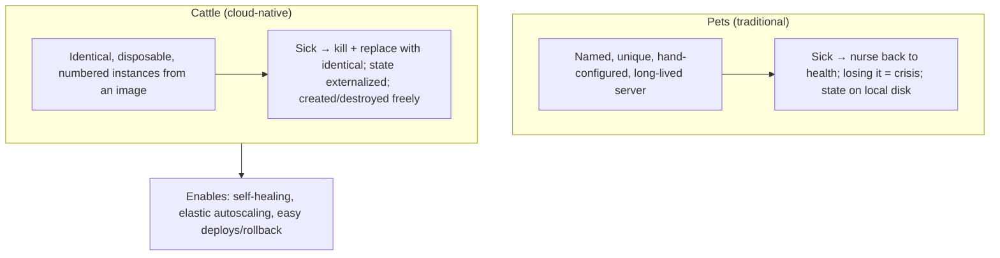
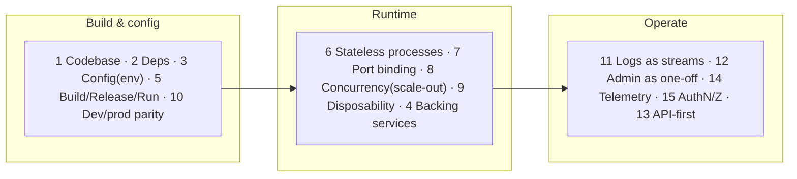

# Lesson 13.1 — The Cloud-Native Model and the 12/15-Factor App

> Part 13: Cloud Native · Difficulty: 🟡🔴
>
> **Prerequisites:** [1.2.2 Maintainability/Evolvability/Operability/Observability], [7.1 Vertical vs Horizontal Scaling], [7.2 Stateless Services + Externalized State], [11.2 Redundancy/Failover], [12.1 Why/Why-Not Microservices].
> **Unlocks:** [13.2 Containers], [13.3 Kubernetes], [13.5 Autoscaling], [13.7 IaC & Deployment Strategies].

---

## 1. Learning Objectives

After this lesson you will be able to:

- Define **cloud-native** precisely — not "runs in the cloud," but **designed to exploit cloud properties** (elasticity, on-demand, managed services, commodity failure-prone infrastructure).
- Explain the **cloud-native contract**: treat infrastructure as **disposable and unreliable**, and build apps that are **stateless, disposable, horizontally-scalable, and self-healing**.
- Apply the **Twelve-Factor App** methodology and its **15-factor** extensions as the concrete rules for cloud-native services.
- Connect cloud-native principles to the rest of the platform: statelessness (7.2), redundancy/self-healing (11.2), microservices (Part 12), and the infrastructure that follows (containers 13.2, Kubernetes 13.3).

---

## 2. Motivation — "In the cloud" is not "cloud-native"

Moving an application to the cloud is not the same as being **cloud-native**. You can lift-and-shift a traditional monolith onto a cloud VM — treating that VM like the physical server it replaced, patching it by hand, storing files on its local disk, and praying it never reboots — and gain almost none of the cloud's real value. That's "**in the cloud**" but not "**cloud-native**." Worse, it inherits the cloud's downsides (commodity hardware fails more often than a hand-tended server) without its upsides (elasticity, self-healing, managed services).

**Cloud-native** is an **architectural discipline**: designing applications to **fully exploit** what the cloud offers — **on-demand, elastic, self-service infrastructure**; **managed services**; and, crucially, **commodity infrastructure that is expected to fail** and be **replaced automatically**. The core mental shift is treating servers as **cattle, not pets** (7.2): a cloud-native app runs on **disposable, interchangeable, failure-prone instances** that can be created, destroyed, and replaced at any moment by an automated platform (13.3) — so the app must be **stateless** (7.2), **disposable** (start fast, stop gracefully), **horizontally scalable** (7.1), and **self-healing** (11.2). The **Twelve-Factor App** methodology (later extended to fifteen) codifies this into concrete, actionable rules — the practical contract a service must honor to thrive on a cloud platform. This lesson establishes the cloud-native model and the 12/15 factors as the foundation for everything in Part 13 (containers, Kubernetes, autoscaling, deployment strategies).

---

## 3. Theory — From first principles

### 3.1 What cloud-native means

`[CS]`/`[CONV]` **Cloud-native** = building and running applications that **fully exploit the cloud computing model** `[CONV]`:
- **On-demand, elastic infrastructure:** compute/storage/network provisioned via API in seconds, scaled up/down automatically with demand (elasticity — 7.1/13.5), paid per use.
- **Commodity, failure-prone infrastructure:** instances are cheap, numerous, and **expected to fail** — the platform **replaces** them automatically rather than repairing them (cattle not pets — 7.2).
- **Managed services:** offload undifferentiated heavy lifting (databases, queues, object storage) to the provider.
- **Automation everywhere:** provisioning, scaling, healing, and deployment are **automated** (IaC — 13.7), not manual.
- `[CONV]` The **CNCF** definition (representative) emphasizes **containers, microservices, service meshes, immutable infrastructure, and declarative APIs** to build **resilient, manageable, observable** systems that allow **frequent, predictable, high-impact changes with minimal toil**. *(Representative.)*

### 3.2 The core shift: cattle not pets

`[CS]` The central mindset (introduced in 7.2, foundational here):
- **Pet server (traditional):** a unique, hand-configured, long-lived, lovingly-maintained machine with a name; if it gets sick you nurse it back to health; losing it is a crisis.
- **Cattle instance (cloud-native):** one of many identical, disposable, numbered instances created from an image; if one is sick, you **kill it and replace it** with an identical one — no crisis.
- **Consequence:** the app **cannot depend on any specific instance surviving** — instances are terminated for scaling, deploys, hardware failure, or spot-reclamation at any time. So the app must be **stateless** (state externalized — 7.2), **disposable**, **horizontally scalable**, and tolerant of instances appearing/vanishing (11.2).
- `[BP]` This is what makes **self-healing** and **elastic autoscaling** possible (13.3/13.5): the platform freely creates/destroys interchangeable instances.

### 3.3 The cloud-native properties an app must have

`[BP]` To thrive as "cattle," a cloud-native app is `[BP]`:
- **Stateless** (7.2): no important state in instance memory/local disk; state lives in **external backing services** (databases, caches, object stores) → any instance can serve any request; instances are interchangeable.
- **Disposable:** **fast startup** (join the pool quickly for scaling/healing) and **graceful shutdown** (finish in-flight work, release resources on a termination signal) → can be created/destroyed freely.
- **Horizontally scalable** (7.1): scale by **adding/removing identical instances**, not by growing one — enables elasticity and redundancy.
- **Self-healing-friendly** (11.2): expose **health checks** (13.3) so the platform can detect and replace unhealthy instances; tolerate dependency failures (resilience — 11.3).
- **Configuration-externalized:** behavior driven by **environment/config** injected at runtime, not baked in → the same artifact runs in any environment (§3.5).
- **Observable** (Part 16): emit logs/metrics/traces so the platform and operators can understand it (1.2.2).

### 3.4 The Twelve-Factor App

`[CONV]` The **Twelve-Factor App** (Heroku, ~2011) is a widely-adopted methodology for building cloud-native (originally SaaS) apps — twelve concrete rules `[CONV]`:

1. **Codebase** — one codebase tracked in version control, many deploys (one repo per app/service).
2. **Dependencies** — **explicitly declare and isolate** dependencies (a manifest; no reliance on system-wide packages).
3. **Config** — store config in the **environment**, not in code (§3.5) — separate config from the artifact.
4. **Backing services** — treat databases/queues/caches as **attached resources** accessed via URL/credentials in config; swap local↔managed without code change.
5. **Build, release, run** — strictly **separate** the build stage (code→artifact), release stage (artifact+config), and run stage (execute) — enables reproducible releases + easy rollback.
6. **Processes** — execute as **one or more stateless processes**; **share nothing**; persist state only in backing services (7.2) — the heart of statelessness.
7. **Port binding** — the app is **self-contained** and exports services by **binding to a port** (no reliance on an injected runtime web server).
8. **Concurrency** — **scale out via the process model** (more processes/instances — horizontal scaling — 7.1), not by making one process bigger.
9. **Disposability** — **fast startup + graceful shutdown**; robust against sudden death (§3.3).
10. **Dev/prod parity** — keep development, staging, and production **as similar as possible** (same backing services, minimal drift) → fewer "works on my machine" surprises.
11. **Logs** — treat logs as **event streams** written to **stdout/stderr**; the environment captures/routes them (don't manage log files — Part 16).
12. **Admin processes** — run admin/management tasks (migrations, one-off scripts) as **one-off processes** in an identical environment.

`[BP]` These map directly onto the cloud-native properties (§3.3): factors 3/4 (externalized config/backing services), 6 (stateless processes), 8 (horizontal scaling), 9 (disposability), 11 (logs as streams) are the operational core.

### 3.5 Config in the environment (factor 3, elaborated)

`[BP]` A cornerstone factor worth its own treatment `[BP]`:
- **Config = everything that varies between deploys** (DB URLs, credentials, feature flags, resource handles) — must live **outside the code**, injected via **environment variables / config maps / secrets** at runtime (13.4).
- **Why:** the **same immutable build artifact** (image — 13.2) runs unchanged in dev/staging/prod, differing **only** by injected config → reproducible, portable, and secure (secrets not baked into images).
- This enables **immutable infrastructure** (13.7): build once, promote the identical artifact through environments, configure per-environment externally.
- `[BP]` **Anti-pattern:** config (esp. secrets) hard-coded or committed to the repo, or per-environment builds — breaks portability and security.

### 3.6 Beyond twelve: the 15-factor app

`[EMERGING]`/`[CONV]` Kevin Hoffman's **Beyond the Twelve-Factor App** added three factors for modern cloud-native/microservices realities `[CONV]`:
- **13. API first** — design the **API/contract first** (12.3) — services are consumed via APIs, so the contract is primary (enables independent teams — 12.1, contract testing — 12.8).
- **14. Telemetry** — **observability is first-class** (Part 16): apps must emit **metrics, logs, and traces** (health, domain-specific, and app-performance telemetry) — you can't operate what you can't see (1.2.2).
- **15. Authentication & authorization** — **security is first-class** (Part 15): every request should be authenticated/authorized (zero-trust — 12.7/Part 15), not bolted on.
- `[BP]` These reflect the shift from single SaaS apps (original 12-factor) to **microservices + observability + zero-trust** (Part 12/15/16). *(The exact numbering/naming varies by source — representative.)*

### 3.7 Cloud-native ≠ just microservices

`[BP]`/`[OPINION]` A clarifying boundary `[OPINION]`:
- Cloud-native and microservices **overlap heavily but aren't identical**: a **modular monolith** (2.2.1/12.1) can be **fully cloud-native** (12-factor, containerized, stateless, self-healing, autoscaling) without being microservices — and you can build a **non-cloud-native** mess of microservices (pets, local state).
- **Cloud-native is about *how* you build/run** (12-factor, disposable, elastic, automated); **microservices is about *how you decompose*** (Part 12). You can adopt cloud-native practices independent of decomposition granularity.
- `[BP]` **Takeaway:** apply cloud-native principles regardless of whether you go microservices — they're the foundation for running *anything* well on a cloud platform (containers/Kubernetes — 13.2/13.3).

---

## 4. Visual Intuition

### Pets vs cattle

### The 12/15 factors grouped

---

## 5. Real-World Analogy

Think of the difference between owning **one cherished classic car** versus running a **fleet of identical rental cars**.

- **The classic car (pet / "in the cloud"):** it's unique, hand-tuned, and you know every quirk. You park it in a special garage, service it yourself, and if it breaks down you painstakingly repair *that specific car* because it's irreplaceable. If it won't start one morning, your whole day stops. Moving this car into a bigger garage (the cloud) doesn't change how fragile and hands-on it is — you've just relocated the pet.
- **The rental fleet (cattle / cloud-native):** a rental company runs **hundreds of identical cars**. No car is special — they're numbered, interchangeable, and built to the same spec. If one breaks down, they **don't repair it on the roadside** — they send an identical replacement and cycle the broken one out (self-healing). On a busy weekend they **roll out more cars**; on a quiet Tuesday they **park most of them** (elastic autoscaling). Every car carries **standardized paperwork slots** where each renter's details are inserted per trip (config in the environment) — the car itself is unchanged; only the inserted info differs. Fuel, insurance, and maintenance are **outsourced to specialist providers** (managed backing services).
- **The 12-factor rules = the fleet operating manual:** every car is built from the **same blueprint** (one codebase), carries its **own complete toolkit** (declared dependencies), takes its **trip-specific details on a slip** (config), can be **started and returned in minutes** (disposability), and is **logged centrally** (logs as streams) so headquarters sees the whole fleet. Following the manual is exactly what lets the company operate **hundreds of disposable, interchangeable cars** reliably — which is impossible with a fleet of temperamental classic cars.
- **The lesson:** cloud-native isn't *where* the car is parked — it's *how it's designed and operated*: disposable, identical, externally-configured, and fleet-managed.

---

## 6. Industry Example

- **The Twelve-Factor App (Heroku)** `[CONV]`: the foundational methodology; widely adopted as the baseline for cloud-native services (§3.4). *(Representative.)*
- **CNCF cloud-native definition** `[CONV]`: containers + microservices + meshes + immutable infrastructure + declarative APIs for resilient/observable systems (§3.1). *(Representative.)*
- **"Cattle not pets"** `[CONV]`: the widely-cited metaphor (Bias/CERN lineage) for disposable infrastructure (§3.2). *(Representative.)*
- **Beyond the Twelve-Factor App (Hoffman/Pivotal)** `[CONV]`: added API-first, telemetry, security factors for microservices era (§3.6). *(Representative.)*
- **Managed backing services** `[CONV]`: teams offloading databases/queues/object storage to managed cloud services (factor 4) to reduce toil (§3.1/3.4). *(Representative.)*

---

## 7. Implementation Details — building cloud-native

- **Design for cattle** (§3.2/3.3): stateless processes (7.2), state in backing services, fast startup + graceful shutdown, horizontal scale-out.
- **Externalize config** (factor 3, §3.5): env vars / config maps / secrets injected at runtime; **one immutable artifact** across environments (13.2/13.7).
- **Treat backing services as attached resources** (factor 4): access DBs/queues/caches via config-supplied URLs/credentials; swap local↔managed freely.
- **Separate build/release/run** (factor 5): reproducible artifacts + easy rollback (13.7).
- **Logs to stdout/stderr as streams** (factor 11): let the platform capture/route them (Part 16); don't manage log files.
- **Expose health checks** (§3.3, 13.3) for self-healing; handle termination signals for graceful shutdown.
- **Add the 15-factor concerns** (§3.6): API-first contracts (12.3), first-class telemetry (Part 16), first-class authN/Z (Part 15).
- **Keep dev/prod parity** (factor 10): same backing services + containerized environments (13.2) to minimize drift.

---

## 8. Advantages

- **Elasticity** — scale out/in with demand automatically → cost efficiency + handling spikes (§3.1, 13.5).
- **Resilience / self-healing** — failed instances auto-replaced; no SPOF (§3.2/3.3, 11.2).
- **Portability** — one immutable artifact + externalized config runs anywhere (§3.5, 13.2).
- **Fast, safe change** — build/release/run separation + disposability → frequent deploys + easy rollback (§3.4, 13.7).
- **Operability/observability** — telemetry + logs-as-streams make systems understandable (§3.6, Part 16).
- **Leverage managed services** — less undifferentiated toil (§3.1).

---

## 9. Disadvantages / costs

- **Discipline + refactoring** — legacy/stateful apps need real rework to become 12-factor (§3.4).
- **Statelessness constraints** — must externalize all state; genuinely stateful workloads need special handling (§3.3, 13.4 StatefulSets).
- **Platform complexity** — the automation (containers/orchestration — 13.2/13.3) is itself complex to run.
- **Distributed-systems costs** — cloud-native usually means networked services → Parts 8–11 complexity (12.1).
- **Managed-service lock-in** — offloading to provider services can create coupling/lock-in (cost tradeoff — 1.2.3).
- **Observability is mandatory, not optional** — you must invest in it to operate (§3.6, Part 16).

---

## 10. When NOT to (fully) go cloud-native

- **Simple, static, low-change apps** — a small internal tool may not justify the full cloud-native machinery.
- **Genuinely stateful, latency-sensitive, or specialized workloads** — some don't fit the disposable/stateless model cleanly (handle with StatefulSets/managed services — 13.4).
- **Strict data-residency / on-prem constraints** — may limit managed-service use (still apply 12-factor principles).
- **Before the fundamentals** — don't chase cloud-native buzzwords (mesh, K8s) before the app is actually 12-factor; a non-12-factor app on Kubernetes is still a pet (§3.7).
- **Lift-and-shift with no refactor** — moving a pet to the cloud without change gains little (§2).

---

## 11. Common Mistakes

1. **"In the cloud" ≠ cloud-native** — lift-and-shift a pet and expect cloud benefits (§2).
2. **Stateful instances** — keeping session/state in instance memory/local disk → breaks scaling/healing (§3.3, 7.2).
3. **Config/secrets baked into the artifact** — breaks portability + security (§3.5).
4. **Managing log files** instead of streaming to stdout/stderr (§3.4 factor 11).
5. **No graceful shutdown** — dropping in-flight work when an instance is killed (§3.3).
6. **Slow startup** — instances take minutes to be ready → autoscaling/healing too slow (§3.3).
7. **Per-environment builds** — different artifacts per env → drift, "works on staging" (§3.5).
8. **Cloud-native theater** — adopting K8s/mesh while the app is still a non-12-factor pet (§3.7).

---

## 12. Interview Questions

**🟢 Easy**
- What does "cloud-native" mean, and how is it different from "running in the cloud"?
- What is the "cattle not pets" metaphor?

**🟡 Medium**
- Name the key Twelve-Factor rules and explain why statelessness and externalized config matter for cloud-native.
- What properties must an app have to work as disposable "cattle"?

**🔴 Hard**
- How do the 12 factors map onto cloud-native properties (statelessness, disposability, horizontal scaling, portability, self-healing)?
- What did the 15-factor extension add and why (API-first, telemetry, security)?

**⚫ Staff+**
- You're modernizing a stateful monolith for the cloud. Walk through making it cloud-native (12-factor): externalizing state/config, disposability, health checks, logs, and what you'd offload to managed services — and why lift-and-shift alone fails.
- Argue that cloud-native and microservices are distinct, and describe a fully cloud-native modular monolith. When would you keep the monolith but still go cloud-native?

---

## 13. Production Pitfalls

- **State lost on scale-in/deploy:** instance held session/upload state locally → killed during autoscaling → data/UX loss (§3.3, 7.2).
- **Slow-start scaling failure:** instances took too long to become ready → the platform couldn't scale fast enough for a spike (§3.3, 13.5).
- **Dropped in-flight requests:** no graceful shutdown → every deploy/scale-in dropped active requests (§3.3).
- **Secrets leaked in images:** config/secrets baked into the container image → security incident + no portability (§3.5, Part 15).
- **Log loss:** app wrote to local files on ephemeral instances → logs vanished with the instance (§3.4 factor 11, Part 16).
- **Cloud-native theater outage:** a non-12-factor pet deployed on Kubernetes behaved unpredictably under rescheduling (§3.7).

---

## 14. Optimization Techniques

- **Full statelessness + externalized state** (7.2) to maximize interchangeability, scaling, and healing (§3.3).
- **Fast startup + graceful shutdown** (small images, lazy init, signal handling) for responsive autoscaling/healing (§3.3, 13.2/13.5).
- **One immutable artifact + externalized config** for portability and reproducibility (§3.5, 13.7).
- **Health checks (liveness/readiness)** so the platform heals and routes correctly (§3.3, 13.3).
- **Logs/metrics/traces as first-class telemetry** (§3.6, Part 16) — operability by design.
- **Leverage managed backing services** to cut toil (weigh lock-in — §3.1, 1.2.3).
- **Dev/prod parity via containers** to eliminate environment drift (§3.4, 13.2).

---

## 15. Summary

**Cloud-native** is not "running in the cloud" — it's an **architectural discipline** of designing applications to **fully exploit the cloud model**: **on-demand, elastic, self-service infrastructure**; **managed services**; **automation everywhere**; and, crucially, **commodity infrastructure that is expected to fail** and be **automatically replaced**. The central mental shift is **cattle not pets** (7.2): instead of unique, hand-tended, long-lived servers you nurse back to health, cloud-native apps run on **identical, disposable, interchangeable instances** created from an image and **killed + replaced** when unhealthy — which is exactly what makes **self-healing** and **elastic autoscaling** (13.3/13.5) possible. To thrive as cattle, an app must be **stateless** (state externalized to backing services — 7.2), **disposable** (fast startup + graceful shutdown), **horizontally scalable** (7.1), **self-healing-friendly** (health checks — 13.3), **configuration-externalized**, and **observable** (Part 16). The **Twelve-Factor App** codifies this into concrete rules — one **codebase**, declared **dependencies**, **config in the environment**, **backing services as attached resources**, strict **build/release/run** separation, **stateless share-nothing processes**, **port binding**, **scale-out concurrency**, **disposability**, **dev/prod parity**, **logs as event streams**, and **admin as one-off processes** — whose operational core (externalized config/backing services, stateless processes, horizontal scaling, disposability, log streams) maps directly onto the cloud-native properties. The **15-factor** extension adds the microservices-era essentials: **API-first** (12.3), first-class **telemetry** (Part 16), and first-class **authentication/authorization** (Part 15/zero-trust). Cloud-native and microservices **overlap but differ**: cloud-native is about **how you build/run** (12-factor, disposable, elastic, automated), microservices about **how you decompose** — so a **modular monolith can be fully cloud-native**, and applying these principles is the foundation for running anything well on the container/orchestration platforms that follow (13.2/13.3). The anti-pattern to avoid throughout: **lift-and-shift a pet** (or deploy a non-12-factor app on Kubernetes) and expect cloud benefits — cloud-native is a property of the *app's design*, not its *location*.

---

## 16. Revision Notes (flashcard-ready)

- **Q:** Cloud-native vs "in the cloud"? **A:** Cloud-native = designed to exploit cloud (elastic, disposable, self-healing, automated); "in the cloud" = merely hosted there.
- **Q:** Cattle not pets? **A:** Identical disposable instances killed+replaced on failure — not unique hand-tended servers nursed back to health.
- **Q:** Properties of a cloud-native app? **A:** Stateless, disposable (fast start/graceful stop), horizontally scalable, self-healing-friendly, config-externalized, observable.
- **Q:** Twelve-Factor operational core? **A:** Config in env (3), backing services (4), stateless processes (6), scale-out concurrency (8), disposability (9), logs as streams (11).
- **Q:** Why config in the environment? **A:** One immutable artifact runs in all envs, differing only by injected config → portable, reproducible, secure.
- **Q:** 15-factor additions? **A:** API-first, first-class telemetry (observability), first-class authN/Z (security).
- **Q:** Why disposability (factor 9)? **A:** Fast startup + graceful shutdown → instances can be created/destroyed freely for scaling/healing.
- **Q:** Cloud-native = microservices? **A:** No — cloud-native = how you build/run; microservices = how you decompose; a modular monolith can be fully cloud-native.
- **Q:** Logs in 12-factor? **A:** Event streams to stdout/stderr; the platform captures/routes them — don't manage log files.
- **Q:** Biggest anti-pattern? **A:** Lift-and-shift a pet (or non-12-factor app on K8s) and expect cloud benefits.

---

## 17. Further Reading + Knowledge-Graph Links

**Foundations (in-platform):**
- **[7.2 Stateless Services + Externalized State]** — statelessness, cattle-not-pets.
- **[7.1 Vertical vs Horizontal Scaling]** — scale-out, elasticity.
- **[11.2 Redundancy/Failover]** — self-healing, no SPOF.
- **[1.2.2 Operability/Observability]** — why telemetry is first-class.
- **[12.1 Why/Why-Not Microservices]** — cloud-native vs microservices distinction.

**Unlocks / next:**
- **[13.2 Containers]** — the immutable artifact + isolation that packages a 12-factor app.
- **[13.3 Kubernetes]** — the platform that runs cattle (self-healing, scheduling).
- **[13.5 Autoscaling]** — elasticity in practice.
- **[13.7 IaC & Deployment Strategies]** — immutable infrastructure, build/release/run.

**External (canonical):**
- Wiggins, *The Twelve-Factor App* (12factor.net). *(Representative.)*
- Hoffman, *Beyond the Twelve-Factor App*. *(Representative.)*
- CNCF cloud-native definition. *(Representative.)*
- Davis, *Cloud Native Patterns*.

> **Knowledge-graph:** `7.2 stateless / cattle-not-pets` → **`13.1 cloud-native + 12/15-factor`** → `13.2 containers` / `13.3 Kubernetes` / `13.5 autoscaling` / `13.7 immutable infra`.
