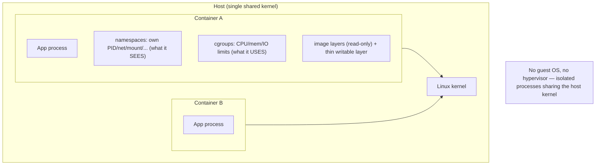
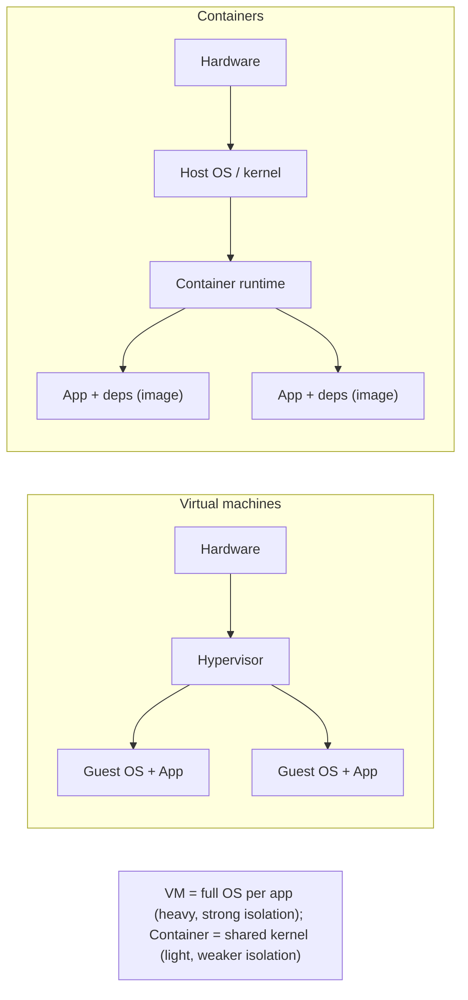

# Lesson 13.2 — Containers: Images, Namespaces, cgroups, OCI

> Part 13: Cloud Native · Difficulty: 🟡🔴
>
> **Prerequisites:** [4.1.2 Disks/Page Cache], [13.1 Cloud-Native Model & 12-Factor], [2.1.1 Cohesion/Coupling (isolation)].
> **Unlocks:** [13.3 Kubernetes], [13.6 Cloud-Native Patterns], [13.7 IaC & Immutable Infrastructure].

---

## 1. Learning Objectives

After this lesson you will be able to:

- Explain what a **container** is at the OS level — **process isolation** built from **namespaces** (what a process can *see*) and **cgroups** (what a process can *use*) — and why it's **not a VM**.
- Describe a **container image** as an **immutable, layered** package of an app + its dependencies, and how layering enables sharing/caching.
- Explain the **OCI** standards (image, runtime, distribution) and why they matter for portability.
- Contrast **containers vs virtual machines** on isolation strength, overhead, and startup speed.
- Connect containers to cloud-native (13.1): they are the **immutable, disposable, portable artifact** that makes the 12-factor app runnable anywhere (and orchestratable — 13.3).

---

## 2. Motivation — "Works on my machine," solved

The 12-factor app (13.1) demands a single **immutable artifact** that runs identically in dev, staging, and production, differing only by injected config — and that is **disposable, fast-starting, and portable**. But traditional deployment fought this at every turn: an app depends on a specific language runtime, system libraries, and OS packages, and getting the **exact same environment** on a developer laptop, a CI server, and a production fleet was a perennial nightmare — the "**works on my machine**" problem. Virtual machines solved environment consistency but at heavy cost: each VM bundles a **full guest operating system**, so it's **gigabytes in size**, takes **minutes to boot**, and consumes significant CPU/memory just for the OS — far too heavy to be the "cattle" of a cloud-native fleet where you want to start/stop hundreds of instances in seconds (13.1).

**Containers** are the answer. A container packages an application **with all its dependencies** into a single **immutable image** that runs as an **isolated process** on a shared host kernel — giving VM-like **environment consistency and isolation** but with **near-native performance**, **megabyte-to-hundreds-of-megabytes** size, and **sub-second startup**. This lightness is exactly what makes containers the ideal cloud-native artifact: disposable, portable, fast, and dense (many per host). Under the hood, a container isn't magic — it's ordinary **Linux kernel features** (namespaces + cgroups) that isolate a normal process. This lesson opens that hood: how containers isolate (namespaces/cgroups), how images are built (layers) and standardized (OCI), and why containers, not VMs, became the unit of cloud-native deployment.

---

## 3. Theory — From first principles

### 3.1 What a container actually is

`[CS]` A **container** is **not a lightweight VM** — it's an **ordinary process (or group of processes) running on the host's kernel, but isolated** so it *believes* it has its own machine `[CS]`:
- There is **no guest OS** and **no hypervisor**; the container **shares the host kernel** with all other containers.
- The isolation comes from **two Linux kernel mechanisms**:
  - **Namespaces** — control **what a process can *see*** (its view of the system).
  - **cgroups (control groups)** — control **what a process can *use*** (its resource consumption).
- Plus a **layered filesystem** (image) giving it its own root filesystem view.
- `[CS]` So a container = **a process + namespaces (isolated view) + cgroups (bounded resources) + an image filesystem**. That's the whole trick — no virtualization of hardware.

### 3.2 Namespaces — what a process can see

`[CS]` **Namespaces** partition kernel resources so a process sees only its own slice `[CS]`:
- **PID namespace** — its own process-ID space (the container's main process looks like PID 1; can't see host processes).
- **Network namespace** — its own network interfaces, IP, ports, routing table.
- **Mount namespace** — its own filesystem mount points / root filesystem (the image).
- **UTS namespace** — its own hostname.
- **IPC namespace** — its own inter-process-communication resources.
- **User namespace** — its own user/group ID mapping (e.g., root inside ≠ root on host — a security boundary).
- `[BP]` Together these make the process **believe it's alone on its own machine** — it can't see or touch the host's or other containers' processes, network, or files. **Isolation of *visibility*.**

### 3.3 cgroups — what a process can use

`[CS]` **Control groups (cgroups)** limit, account for, and isolate the **resource usage** of a group of processes `[CS]`:
- **CPU** — limit CPU shares/quota (a container can be capped at, say, 0.5 cores).
- **Memory** — hard memory limits (exceed it → the container is **OOM-killed**).
- **I/O** — limit disk/block I/O bandwidth.
- **Accounting** — measure resource usage (feeds metrics/billing).
- `[BP]` cgroups prevent the **noisy-neighbor** problem — one container can't starve others by hogging CPU/memory/IO on the shared host. **Isolation of *resource consumption*.** (Combined with namespaces: namespaces = "what you see," cgroups = "what you get.")

### 3.4 Container images and layering

`[CS]` A **container image** is a **read-only, immutable template** containing the app + its dependencies + a minimal filesystem, from which running containers are instantiated `[CS]`:
- **Built from a definition** (e.g., a Dockerfile) as a **stack of read-only layers** — each instruction (install packages, copy code) creates a **layer**; the image is the union of layers (via a **union/overlay filesystem**).
- **Layer sharing/caching** `[BP]`: layers are **content-addressed** and **shared** across images — if 10 images use the same base OS layer, it's **stored/downloaded once**. Rebuilding re-uses **cached** unchanged layers → **fast builds** and **efficient storage/transfer**. Order layers from least- to most-frequently-changed to maximize cache hits (e.g., dependencies before app code).
- **Copy-on-write at runtime** `[BP]`: a running container gets a **thin writable layer** on top of the read-only image layers; writes go there, the image stays immutable. Many containers share the same read-only layers (density).
- **Immutability** `[BP]`: the image never changes — this *is* the 12-factor "build once, run anywhere" immutable artifact (13.1/13.7). To change the app, **build a new image**, don't mutate a running container (cattle not pets — 13.1).
- **Tags & digests:** images are referenced by tag (e.g., `app:1.4.2`) or immutable **digest** (content hash) — use digests/pinned tags for reproducibility (avoid `latest`).

### 3.5 The OCI standards & the runtime stack

`[CS]`/`[CONV]` The **Open Container Initiative (OCI)** standardizes containers so they're **portable across tools/platforms** `[CONV]`:
- **OCI Image Spec** — the standard format for images (layers + manifest + config) → any compliant tool can build/read them.
- **OCI Runtime Spec** — how to run a container from an unpacked image (the low-level runtime, e.g., **runc**).
- **OCI Distribution Spec** — how images are **pushed/pulled** to/from a **registry**.
- The **runtime stack** (roughly): a high-level runtime / **CRI** (Container Runtime Interface — e.g., **containerd**, **CRI-O**) manages images and lifecycle and calls a low-level OCI runtime (**runc**) that actually sets up namespaces/cgroups and starts the process. (Docker is a developer-friendly toolchain on top; Kubernetes talks to containerd/CRI-O via the CRI — 13.3.) *(Representative.)*
- A **registry** (OCI Distribution) stores/serves images (public or private).
- `[BP]` **Why it matters:** OCI decoupled the **image format and runtime** from any single vendor → an image built anywhere runs anywhere compliant → **true portability**, the bedrock of cloud-native.

### 3.6 Containers vs virtual machines

`[CS]` The key comparison `[CS]`:

| | **Container** | **Virtual Machine** |
|---|---|---|
| Isolation via | namespaces + cgroups (shared host kernel) | hypervisor (virtualized hardware + full guest OS) |
| Guest OS | **none** (shares host kernel) | full guest OS per VM |
| Size | MBs–hundreds of MBs | GBs |
| Startup | **sub-second** | seconds–minutes |
| Overhead | near-native | OS + hypervisor overhead |
| Isolation strength | **weaker** (shared kernel = larger attack surface) | **stronger** (hardware-level) |
| Density | very high (many per host) | lower |

- `[BP]` **Tradeoff:** containers win on **speed, size, density, and portability**; VMs win on **isolation strength** (a kernel exploit can cross containers on a shared kernel, but not VMs). 
- **They combine:** in the cloud you typically run **containers *inside* VMs** — VMs give hard multi-tenant isolation, containers give density/speed within. For **hostile multi-tenant** workloads, use stronger sandboxes (**`[EMERGING]` gVisor, Kata Containers, Firecracker microVMs**) that add VM-like isolation to containers `[EMERGING]`.

### 3.7 Why containers are the cloud-native unit

`[BP]` Tying back to 13.1:
- **Immutable artifact** (§3.4) = the 12-factor "build once" artifact; config injected at runtime (13.1 §3.5).
- **Portable** (§3.5 OCI) = runs identically dev→prod (dev/prod parity — 13.1 factor 10; solves "works on my machine").
- **Disposable + fast-starting** (§3.6) = perfect cattle (13.1): create/destroy in seconds for scaling/healing.
- **Dense + efficient** (§3.3/3.6) = many per host → cost-efficient.
- **Self-contained** = app + deps in one image (12-factor dependencies).
- `[BP]` This is why containers — not VMs — became the **unit of deployment and orchestration** (13.3): they are exactly the immutable, portable, disposable artifact cloud-native needs.

---

## 4. Visual Intuition

### Container internals: process + namespaces + cgroups + image

### Containers vs VMs (the stack)

---

## 5. Real-World Analogy

Think of the difference between building **separate standalone houses** (VMs) and dividing **one large building into apartments** (containers).

- **Virtual machines = standalone houses:** each house has its **own foundation, plumbing, electrical, and roof** (a full guest OS). They're extremely **well-isolated** — what happens in one house barely affects another, and a break-in to one doesn't reach the next. But building a whole house for each family is **slow, expensive, and space-hungry**; you can't quickly spin up fifty houses for a busy weekend.
- **Containers = apartments in one building:** all apartments **share the building's foundation, plumbing, and structure** (the host kernel). Each apartment still has its **own locked door, its own rooms, and its own utility meter** — so residents feel like they have a private home. The **locked door and private rooms** are the **namespaces** (each apartment sees only its own space, not the neighbors'). The **utility meter with a usage cap** is the **cgroup** (each apartment is limited to so much water/power, so one can't drain the building dry — no noisy neighbor). Building apartments is **fast and cheap** — you can add many in the same footprint (density) — but they share the **same building structure**, so a **fire in the shared foundation** could threaten everyone (weaker isolation than separate houses).
- **The image = the prefab apartment blueprint + flat-pack kit:** an apartment is furnished from a **standardized, sealed kit** (the immutable image) built in **layers** — first the standard base fittings (shared across many apartments — a layer downloaded once), then the specific furniture (the app). To "renovate," you don't rebuild in place — you **swap in a freshly-built kit** (build a new image; cattle not pets).
- **OCI = universal building codes:** because every apartment kit follows the **same standard specification** (OCI), a kit assembled by one contractor can be installed in **any compliant building anywhere** (portability) — no more "it only fits in my building."
- **Best of both:** landlords often put **apartment buildings inside gated communities** — containers running inside VMs — combining the strong perimeter of houses with the density of apartments.

---

## 6. Industry Example

- **Docker** `[CONV]`: popularized containers with a developer-friendly image build + runtime toolchain; the Dockerfile/image workflow is ubiquitous (§3.4). *(Representative.)*
- **OCI + containerd/CRI-O + runc** `[CONV]`: the standardized runtime stack Kubernetes uses via the CRI (§3.5, 13.3). *(Representative.)*
- **Image registries (Docker Hub, cloud registries)** `[CONV]`: OCI-distribution registries storing/serving images (§3.5). *(Representative.)*
- **`[EMERGING]` Stronger sandboxes (gVisor, Kata Containers, Firecracker)** `[EMERGING]`: add VM-like isolation for hostile multi-tenant/serverless workloads (§3.6). *(Representative.)*
- **Multi-stage builds & slim base images** `[CONV]`: teams minimize image size/attack surface via multi-stage builds and minimal/distroless bases (§3.4, §14). *(Representative.)*

---

## 7. Implementation Details — working with containers

- **Write a build definition** (Dockerfile/equiv) producing a **minimal, layered image**; order layers least→most-frequently-changed for cache efficiency (§3.4).
- **Keep images small** (§14): minimal/distroless base, **multi-stage builds** (build tools in one stage, only artifacts in the final), remove build caches → faster pulls, smaller attack surface.
- **One concern per container** (12-factor processes — 13.1): typically one main process; use sidecars for auxiliary concerns (13.6) rather than cramming many services in one image.
- **Immutable + config-externalized** (§3.4, 13.1): never mutate running containers; inject config via env/mounted config/secrets (13.4); rebuild to change.
- **Pin images by digest/version** (not `latest`) for reproducibility (§3.4).
- **Set resource requests/limits** (cgroups — §3.3, surfaced in 13.3): so the scheduler places correctly and no container starves others.
- **Handle signals** for graceful shutdown (SIGTERM → drain → exit) — disposability (13.1 §3.3).
- **Scan images** for vulnerabilities and use trusted base images (Part 15); run as **non-root** (user namespace — §3.2) where possible.

---

## 8. Advantages

- **Environment consistency / portability** — same image dev→prod; solves "works on my machine" (§3.7, OCI §3.5).
- **Lightweight + fast** — sub-second startup, MBs not GBs, near-native perf → ideal cattle (§3.6).
- **Density** — many per host (shared kernel + CoW layers) → cost-efficient (§3.3/3.4).
- **Immutable artifact** — reproducible builds, easy rollback (build a prior image) (§3.4, 13.7).
- **Isolation** — namespaces (visibility) + cgroups (resources) prevent interference/noisy neighbors (§3.2/3.3).
- **Orchestratable** — the standard unit Kubernetes schedules/heals/scales (§3.7, 13.3).

---

## 9. Disadvantages / costs

- **Weaker isolation than VMs** — shared kernel = larger attack surface; a kernel exploit can cross containers (§3.6, Part 15).
- **Linux-kernel-centric** — containers are tied to the host kernel (Windows/other-kernel workloads need matching hosts or VMs).
- **Stateful/persistent data is awkward** — containers are ephemeral; persistence needs external volumes/storage (13.4).
- **Image sprawl & supply-chain risk** — many images to build/scan/patch; base-image vulnerabilities propagate (Part 15).
- **Operational complexity** — registries, builds, runtimes, orchestration to manage (13.3).
- **Not a security boundary by default** — needs hardening (non-root, seccomp, stronger sandboxes for hostile tenants — §3.6).

---

## 10. When NOT to use containers

- **Hard multi-tenant isolation of untrusted code** — plain containers' shared kernel may be insufficient; use VMs or stronger sandboxes (§3.6, Part 15).
- **Heavy stateful/latency-critical workloads** that fight ephemerality — possible but often better as managed services or carefully-designed stateful sets (13.4).
- **Non-Linux-kernel workloads** without matching host support.
- **Trivial single-server apps** where the container/orchestration overhead isn't justified (start simple — 13.1).
- **When a managed service does it better** — don't containerize a database you could consume as a managed service (13.1 factor 4).

---

## 11. Common Mistakes

1. **Treating containers like VMs/pets** — SSHing in and mutating running containers instead of rebuilding images (§3.4, 13.1).
2. **Huge images** — fat base + build tools shipped to prod → slow pulls, big attack surface (§14 — use multi-stage/slim).
3. **Using `latest` tags** — non-reproducible deploys; can't tell what's running (§3.4).
4. **Storing important state in the container** — lost on restart (containers are ephemeral — §3.4, 13.4).
5. **Running as root** — unnecessary privilege → security risk (§3.2/Part 15).
6. **No resource limits** — one container OOMs/starves the host (noisy neighbor — §3.3).
7. **Baking secrets into images** — leaked in the registry/layers (§3.4, 13.1/Part 15).
8. **Assuming containers = strong isolation** — for untrusted tenants, they're not by default (§3.6).

---

## 12. Interview Questions

**🟢 Easy**
- What is a container, and how is it different from a virtual machine?
- What is a container image, and why is it immutable?

**🟡 Medium**
- What are namespaces and cgroups, and what does each isolate?
- How does image layering enable fast builds and efficient storage/transfer?

**🔴 Hard**
- Walk through what happens (kernel-level) when a container starts. Why is a container "just an isolated process"?
- Compare containers and VMs on isolation, overhead, startup, and density. When would you run containers inside VMs or use stronger sandboxes?

**⚫ Staff+**
- Explain the OCI standards (image/runtime/distribution) and the runtime stack (CRI → containerd → runc). Why did standardization matter for cloud-native portability?
- Design a secure, efficient container build/deploy pipeline: minimal images, layer caching, digest pinning, non-root, secret handling, vulnerability scanning — and where containers alone are insufficient for isolation.

---

## 13. Production Pitfalls

- **OOM-killed containers:** memory limit set too low (or a leak) → the container is killed by cgroup enforcement, causing restarts/errors (§3.3).
- **Noisy neighbor:** a container with no CPU limit starved co-located containers (§3.3) — set requests/limits.
- **Slow image pulls delaying scale/heal:** bloated images took too long to pull → autoscaling/recovery lagged (§3.6/13.5).
- **Lost data on restart:** important state written to the container's writable layer vanished on reschedule (§3.4, 13.4).
- **Supply-chain vulnerability:** a compromised/outdated base image propagated a CVE across many services (Part 15).
- **`latest`-tag surprise:** a re-pull picked up a different image than tested → unexplained behavior change (§3.4).
- **Kernel-exploit blast radius:** a shared-kernel vulnerability affected all containers on a host (§3.6).

---

## 14. Optimization Techniques

- **Multi-stage builds + minimal/distroless base** → small images, faster pulls, smaller attack surface (§3.4/Part 15).
- **Layer ordering for cache hits** (deps before code) → fast rebuilds (§3.4).
- **Digest/version pinning** → reproducible, cache-friendly deploys (§3.4).
- **Right-sized resource requests/limits** (cgroups) → good scheduling + no noisy neighbors (§3.3, 13.3).
- **Fast startup** (lazy init, small runtime) → responsive autoscaling/healing (§3.6, 13.1/13.5).
- **Shared base layers** across services → storage/transfer efficiency (§3.4).
- **Stronger sandboxes only where needed** (hostile tenants) to balance isolation vs overhead (§3.6).

---

## 15. Summary

A **container** is the immutable, portable, disposable artifact cloud-native (13.1) needs — and it is **not a lightweight VM**. It's an **ordinary process running on the host's shared kernel**, isolated by two Linux kernel mechanisms: **namespaces** (partitioning what a process can **see** — its own PID/network/mount/UTS/IPC/user views, so it believes it's alone on its own machine) and **cgroups** (limiting what a process can **use** — CPU/memory/IO caps + accounting, preventing the noisy-neighbor problem). A container = **process + namespaces + cgroups + an image filesystem** — no guest OS, no hypervisor. A **container image** is a **read-only, immutable, layered** package of app + dependencies + minimal filesystem: layers are **content-addressed and shared/cached** (a base layer downloaded once across images; unchanged layers reused on rebuild), and a running container gets a **thin copy-on-write writable layer** over the immutable image — so you **build a new image to change the app** rather than mutating a running container (cattle not pets). The **OCI** standards (**Image**, **Runtime**, **Distribution** specs) decoupled the image format and runtime from any vendor — a CRI (containerd/CRI-O) drives a low-level OCI runtime (runc) that sets up namespaces/cgroups — giving **true portability** (an image built anywhere runs anywhere compliant). Versus **VMs**, containers share the host kernel, so they're **MBs not GBs**, start in **sub-seconds not minutes**, run at **near-native speed**, and pack **densely** — at the cost of **weaker isolation** (a shared-kernel exploit can cross containers, unlike hardware-isolated VMs); hence you often run **containers inside VMs**, and use **stronger sandboxes (gVisor/Kata/Firecracker)** for hostile multi-tenant workloads. These properties — **immutable, portable, disposable, fast-starting, dense, self-contained** — are exactly what make containers (not VMs) the **unit of cloud-native deployment and orchestration** (13.3): they realize the 12-factor "build once, run anywhere" artifact, solve "works on my machine," and serve as ideal cattle for elastic scaling and self-healing. Operate them well: minimal multi-stage images, layer-cache-friendly ordering, digest pinning, right-sized resource limits, graceful signal handling, non-root, and vulnerability scanning.

---

## 16. Revision Notes (flashcard-ready)

- **Q:** What is a container? **A:** An isolated process on the host's shared kernel — namespaces + cgroups + image filesystem; no guest OS/hypervisor.
- **Q:** Namespaces vs cgroups? **A:** Namespaces = what a process can SEE (PID/net/mount/...); cgroups = what it can USE (CPU/mem/IO limits).
- **Q:** Container image? **A:** Immutable, read-only, layered package of app + deps; layers shared/cached; CoW writable layer at runtime.
- **Q:** Why immutable? **A:** Build once run anywhere (12-factor artifact); change = new image, not mutate running container (cattle not pets).
- **Q:** Why layer ordering matters? **A:** Content-addressed layers are cached/shared; deps-before-code maximizes cache hits → fast builds, small transfers.
- **Q:** OCI? **A:** Standards for image/runtime/distribution → portability across tools/platforms (CRI → containerd/CRI-O → runc).
- **Q:** Container vs VM? **A:** Container = shared kernel, MBs, sub-second, dense, weaker isolation; VM = full guest OS, GBs, slower, stronger isolation.
- **Q:** How to combine them? **A:** Run containers inside VMs; use gVisor/Kata/Firecracker for hostile multi-tenant isolation.
- **Q:** Why containers for cloud-native? **A:** Immutable, portable, disposable, fast, dense — ideal cattle + orchestratable unit.
- **Q:** Noisy neighbor prevention? **A:** cgroup CPU/memory/IO limits; without limits one container can starve the host.

---

## 17. Further Reading + Knowledge-Graph Links

**Foundations (in-platform):**
- **[13.1 Cloud-Native Model & 12-Factor]** — the immutable-artifact / disposable requirements containers satisfy.
- **[4.1.2 Disks/Page Cache]** — filesystem/layer/CoW context.
- **[2.1.1 Cohesion/Coupling]** — isolation as a design goal.

**Unlocks / next:**
- **[13.3 Kubernetes]** — orchestrating containers (scheduling, self-healing, scaling).
- **[13.6 Cloud-Native Patterns]** — sidecar/ambassador/adapter/init (multi-container pods).
- **[13.7 IaC & Immutable Infrastructure]** — images as the immutable deployment unit.
- **[Part 15 Security]** — image scanning, non-root, sandboxing, supply chain.

**External (canonical):**
- OCI specifications (image/runtime/distribution). *(Representative.)*
- Docker & containerd documentation. *(Representative.)*
- Linux kernel namespaces/cgroups documentation. *(Representative.)*

> **Knowledge-graph:** `13.1 immutable artifact/cattle` → **`13.2 containers`** (namespaces + cgroups + image + OCI) → `13.3 Kubernetes` / `13.6 patterns` / `13.7 immutable infra`.
