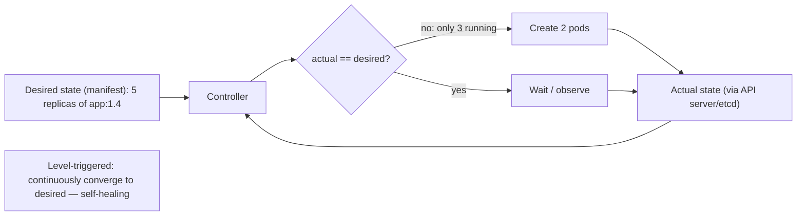
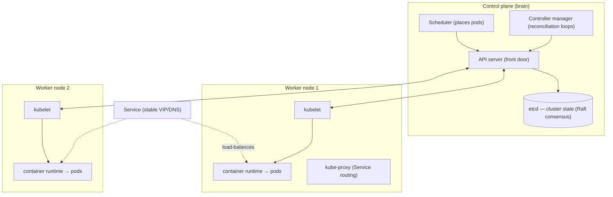

# Lesson 13.3 — Orchestration with Kubernetes: Pods, Deployments, Services, Controllers, Scheduling

> Part 13: Cloud Native · Difficulty: 🔴
>
> **Prerequisites:** [8.3.3 Raft], [8.3.8 Coordination Services (etcd)], [11.2 Redundancy/Failover], [12.6 Discovery/Gateway/BFF], [13.1 Cloud-Native Model], [13.2 Containers].
> **Unlocks:** [13.4 K8s Networking/Config/Stateful], [13.5 Autoscaling], [13.6 Cloud-Native Patterns], [13.7 Deployment Strategies].

---

## 1. Learning Objectives

After this lesson you will be able to:

- Explain what a **container orchestrator** does and why running containers at scale needs one.
- Describe Kubernetes' **declarative, reconciliation-based** model — you declare **desired state**, controllers continuously drive **actual → desired**.
- Define the core objects: **Pod**, **ReplicaSet/Deployment**, **Service**, **controllers**, and how the **scheduler** places pods.
- Describe the **control plane** (API server, etcd, scheduler, controller manager) and **node** components (kubelet, container runtime, kube-proxy).
- Connect Kubernetes to earlier ideas: it's a **distributed system** (Parts 8–11) built on **consensus** (etcd/Raft — 8.3.3/8.3.8) that delivers cloud-native **self-healing + scaling** (13.1) for **containers** (13.2).

---

## 2. Motivation — You can't hand-manage a fleet of containers

Containers (13.2) give you the perfect cloud-native artifact, but running **one container** by hand is trivial while running **thousands across hundreds of hosts** is not. Someone — or something — has to answer relentless operational questions: *Which host should this container run on (given its CPU/memory needs and what's already there)? What happens when a container crashes — who restarts it? When a whole host dies, who reschedules its containers elsewhere? How do we run five identical copies and keep exactly five alive? How do callers find these containers when they move hosts and change IPs (12.6)? How do we roll out a new version without downtime, and roll back if it's bad? How do we scale from 5 to 50 copies for a traffic spike and back down?*

Doing this manually is impossible at scale and error-prone at any scale. A **container orchestrator** automates all of it, and **Kubernetes** has become the de-facto standard. Its defining idea is **declarative reconciliation**: you don't tell Kubernetes *how* to do things step by step — you **declare the desired state** ("I want 5 replicas of this image, exposed on this port"), and Kubernetes' **controllers continuously observe actual state and take action to make it match** — restarting crashed containers, rescheduling off dead nodes, adding/removing replicas — **forever, automatically**. This is exactly the cloud-native **self-healing + elastic** behavior (13.1) that makes "cattle not pets" real. This lesson develops Kubernetes' architecture and core objects as the platform that runs cloud-native workloads.

---

## 3. Theory — From first principles

### 3.1 What an orchestrator does + the declarative model

`[CS]` A **container orchestrator** automates deploying, scaling, networking, and healing of containers across a cluster of machines `[CS]`. Kubernetes' core paradigm is **declarative + reconciliation** `[CS]`:
- **Declarative:** you submit **desired state** (usually YAML manifests) describing *what* you want (e.g., "5 replicas of `app:1.4`") — **not** imperative step-by-step commands.
- **Reconciliation loop (the heart of K8s):** for each object, a **controller** runs a control loop: **observe** actual state → **compare** to desired → **act** to close the gap → repeat, forever. If a pod dies, the observed count drops below desired → the controller creates a replacement. If you change desired from 5→7, controllers add 2.
- `[BP]` This makes the system **self-healing** and **level-triggered** (it continuously converges to desired state, not reacting to one-off events) — the robustness foundation. It's a **control system**, like a thermostat: set the target, it continuously works to maintain it.

### 3.2 Pods — the unit of scheduling

`[CS]` A **Pod** is the **smallest deployable unit** in Kubernetes — **one or more containers that share** a network namespace (same IP/port space — they reach each other on `localhost`), storage volumes, and lifecycle `[CS]`:
- Usually **one main container per pod** (12-factor one-concern — 13.1); additional containers are **helpers** (sidecars — 13.6, e.g., a logging agent or service-mesh proxy — 12.7).
- Pods are **ephemeral and disposable** (cattle — 13.1): they're created, die, and are **replaced** (with a **new IP** each time) — you **never** rely on a specific pod surviving. This is why you need **Services** for stable addressing (§3.4) and **controllers** to maintain pods (§3.3).
- The pod is what the **scheduler places** on a node (§3.6) and what **cgroups/namespaces** (13.2) bound.

### 3.3 Controllers: ReplicaSet, Deployment, and friends

`[CS]` **Controllers** are the reconciliation loops that manage higher-level objects `[CS]`:
- **ReplicaSet:** ensures **N identical pod replicas** are running — if one dies, it creates a replacement; if there are too many, it deletes extras (self-healing + fixed scale).
- **Deployment (the workhorse):** manages ReplicaSets to provide **declarative updates + rollouts** — you update the image/config, and the Deployment performs a **rolling update** (create new pods, drain old ones gradually — 13.7), with **rollback** to a previous ReplicaSet if needed. This is how you deploy/upgrade stateless services safely.
- **StatefulSet:** for **stateful** workloads needing stable identity/storage/ordering (13.4).
- **DaemonSet:** runs **one pod per node** (e.g., a log/metrics agent).
- **Job / CronJob:** run-to-completion / scheduled tasks (12-factor admin processes — 13.1).
- `[BP]` **Pattern:** you almost never create bare pods — you declare a **Deployment** (or StatefulSet/DaemonSet/Job), and its controller manages the pods for you, healing and scaling automatically.

### 3.4 Services — stable addressing + load balancing

`[CS]` Because pods are ephemeral with changing IPs, a **Service** provides a **stable virtual IP + DNS name** that **load-balances across a dynamic set of pods** (selected by **labels**) `[CS]`:
- This is **server-side service discovery** (12.6) built into the platform: callers hit the **Service** (stable), which routes to a **healthy pod** — the pod set changes constantly underneath, transparently.
- **Service types:**
  - **ClusterIP** (default) — internal-only virtual IP (east-west service-to-service — 12.6).
  - **NodePort** — exposes on a port of every node.
  - **LoadBalancer** — provisions an external cloud load balancer (north-south — 12.6).
  - **Headless** — no virtual IP; returns pod IPs directly (for stateful/direct discovery — 13.4).
- **Ingress** (13.4) handles L7 HTTP routing into the cluster (the gateway role — 12.6).
- `[BP]` **Labels & selectors** are the glue: Services (and controllers) select pods by **labels** (key/value tags), not by identity — a loosely-coupled, dynamic membership mechanism.

### 3.5 Control plane vs nodes — the architecture

`[CS]` A Kubernetes cluster has a **control plane** (the brain) and **worker nodes** (where pods run) `[CS]`:
- **Control plane:**
  - **API server** — the **front door**; all interactions (users, controllers, kubelets) go through its declarative REST API; validates and persists desired state. The single hub.
  - **etcd** — the **consistent, distributed key-value store** (built on **Raft** — 8.3.3/8.3.8) that holds **all cluster state** (the source of truth). Its consistency/availability is critical — a strongly-consistent, consensus-backed datastore (10.6/8.3.4).
  - **Scheduler** — assigns newly-created pods to nodes (§3.6).
  - **Controller manager** — runs the built-in controllers (ReplicaSet, Deployment, etc. — §3.3) — the reconciliation loops.
- **Worker node:**
  - **kubelet** — the node agent; ensures the pods assigned to its node are running/healthy (talks to the API server).
  - **container runtime** — containerd/CRI-O via the CRI (13.2) — actually runs containers.
  - **kube-proxy** — programs node networking so **Service** virtual IPs route to pods (§3.4).
- `[BP]` Everything flows through the **API server → etcd**; controllers and kubelets **watch** the API server and reconcile. K8s is itself a **distributed system** (Parts 8–11) — its correctness rests on **etcd's consensus** (8.3.3).

### 3.6 The scheduler — placing pods

`[CS]` The **scheduler** decides **which node** each new pod runs on, in two phases `[CS]`:
- **Filtering (feasibility):** eliminate nodes that **can't** run the pod — insufficient CPU/memory (per the pod's **resource requests** — cgroups, 13.2), unmatched **node selectors/affinity**, **taints** not tolerated, etc.
- **Scoring (optimization):** rank the feasible nodes by preference — spread for availability, bin-pack for utilization, honor **affinity/anti-affinity** (co-locate or separate pods) and **topology spread** (across zones — 13.8/11.2) — and pick the best.
- **Key inputs** `[BP]`: **resource requests** (guaranteed, used for scheduling) vs **limits** (cap, cgroup-enforced — 13.2); **affinity/anti-affinity**; **taints & tolerations** (reserve nodes); **topology spread constraints** (spread across failure domains — 11.2/13.8).
- `[BP]` Good scheduling balances **utilization** (don't waste capacity) against **availability/resilience** (spread replicas across nodes/zones so one failure doesn't take all — 11.2). Set **requests** accurately or scheduling and autoscaling (13.5) misbehave.

### 3.7 Health checks — how self-healing works

`[BP]` Kubernetes heals using **probes** the app exposes (13.1 §3.3) `[BP]`:
- **Liveness probe:** "is the container alive?" — if it fails, kubelet **restarts** the container (recovers from deadlock/hang).
- **Readiness probe:** "is it ready to serve traffic?" — if it fails, the pod is **removed from Service endpoints** (no traffic) but **not** restarted (e.g., still warming up or a dependency is down). Critical for zero-downtime rollouts (13.7) and load management (11.4).
- **Startup probe:** for slow-starting apps — gates liveness until started.
- `[BP]` Probes are how the reconciliation model (§3.1) knows actual health → they make **self-healing** and **safe rollouts** work. Misconfigured probes are a top source of outages (restart loops, or routing to unready pods).

### 3.8 Why Kubernetes embodies cloud-native

`[BP]` Tying to 13.1/13.2:
- **Runs cattle** (13.1): pods are disposable; controllers replace them; you never nurse a pod.
- **Self-healing** (11.2): reconciliation + probes restart/reschedule automatically.
- **Elastic** (13.5): change replica count (or autoscale) → controllers converge.
- **Declarative + immutable** (13.1/13.7): desired state in version-controlled manifests; deploy new immutable images (13.2).
- **Service discovery + LB built in** (12.6): Services abstract ephemeral pods.
- `[BP]` Kubernetes is the **operating system for cloud-native workloads** — but it's **complex** (a distributed system to run); it's powerful **when your scale/needs justify it** (the same "you must be this tall" caution as microservices/mesh — 12.1/12.7).

---

## 4. Visual Intuition

### Declarative reconciliation loop

### Cluster architecture

---

## 5. Real-World Analogy

Think of Kubernetes as an **automated shipping-port operator** managing thousands of standardized containers (13.2) across many docks.

- **Declarative reconciliation = the standing orders.** You don't micromanage every crane. You give the port a **standing order**: "keep exactly **five** loaded container-ships of type X at berth, ready to sail." The port's **control system continuously checks**: if a ship departs or sinks (a pod dies), it **automatically brings in another** to restore five; if you change the order to seven, it **brings in two more**. It never stops enforcing the order — that's the **reconciliation loop** (self-healing). You describe the *destination*, not the *route*.
- **Pods = the containers actually placed on ships.** The smallest thing the port handles is a container (pod) — sometimes a main container travels with a **small attached utility pod** (a refrigeration unit or tracker — a sidecar). Individual containers are **disposable**; if one is damaged, it's **replaced**, not repaired.
- **The scheduler = the berth planner.** When a new container arrives, a **planner decides which dock** to put it on — first ruling out docks **without enough space or the right equipment** (filtering by resource requests/affinity/taints), then **choosing the best** among the rest (spread across docks for safety, or pack tightly for efficiency — scoring).
- **Deployments = the fleet-upgrade manager.** To roll out a **newer ship design**, you don't scuttle all five at once — the manager **brings in new-design ships and retires old ones gradually** (rolling update), and if the new design leaks, it **reverts to the old design** (rollback).
- **Services = the harbor's public phone number.** Ships come and go and change berths constantly (pods get new IPs), so customers never call a specific ship — they call **one stable harbor number** (the Service's virtual IP/DNS) that **routes to whichever ship is currently ready** (load-balancing to healthy pods).
- **The control plane = harbor headquarters.** The **master logbook** (etcd) records the true state of everything (kept consistent by a council that must agree — Raft consensus); the **front desk** (API server) is the only way to issue or read orders; **dock agents** (kubelets) on each pier make sure their assigned ships are actually there and healthy (probes) — and report back to HQ.

---

## 6. Industry Example

- **Kubernetes (CNCF)** `[CONV]`: the de-facto container orchestrator across clouds and on-prem; managed offerings (EKS/GKE/AKS) run the control plane for you (§3.5). *(Representative.)*
- **etcd + Raft as cluster state** `[CONV]`: K8s stores all state in etcd, a Raft-based consistent KV store (§3.5, 8.3.3/8.3.8). *(Representative.)*
- **Declarative GitOps** `[CONV]`: teams store manifests in Git and let controllers reconcile the cluster to match (declarative model — §3.1, 13.7). *(Representative.)*
- **The reconciliation/controller pattern** `[CONV]`: extended by **custom resources + operators** to manage databases/apps declaratively (§3.1). *(Representative.)*
- **Probe misconfiguration outages** `[OPINION]`: restart loops from bad liveness probes, or traffic to unready pods from missing readiness probes — a common incident class (§3.7). *(Representative.)*

---

## 7. Implementation Details — running workloads on K8s

- **Declare Deployments** (not bare pods) for stateless services (§3.3); set **replicas**, image (pinned — 13.2), and rollout strategy (13.7).
- **Expose via Services** (§3.4): ClusterIP for internal, LoadBalancer/Ingress for external (13.4/12.6); select pods by **labels**.
- **Set resource requests + limits** (§3.6, cgroups — 13.2): requests for scheduling, limits to cap — accurate values are essential for scheduling + autoscaling (13.5).
- **Configure probes** (§3.7): liveness (restart on hang), readiness (gate traffic), startup (slow starters) — get these right for self-healing + zero-downtime.
- **Externalize config/secrets** via ConfigMaps/Secrets (13.4, 12-factor — 13.1).
- **Spread for resilience** (§3.6): anti-affinity + topology spread across nodes/zones (11.2/13.8) so one failure ≠ total loss.
- **Use the right controller**: Deployment (stateless), StatefulSet (stateful — 13.4), DaemonSet (per-node agents), Job/CronJob (batch/admin).
- **Treat manifests as code** (GitOps — 13.7): version-controlled desired state; let reconciliation apply it.

---

## 8. Advantages

- **Self-healing** — automatic restart/reschedule via reconciliation + probes (§3.1/3.7, 11.2).
- **Declarative + reproducible** — desired state in manifests; converges automatically (§3.1, 13.7).
- **Scaling** — change replicas or autoscale (13.5); controllers converge (§3.3).
- **Rollouts/rollbacks** — safe rolling updates + easy revert (Deployment — §3.3, 13.7).
- **Built-in discovery + LB** — Services abstract ephemeral pods (§3.4, 12.6).
- **Portable + standard** — runs on any cloud/on-prem; huge ecosystem (§3.8).
- **Efficient scheduling** — bin-pack + spread across a fleet (§3.6).

---

## 9. Disadvantages / costs

- **Complexity** — K8s is a complex distributed system to learn, run, secure, and debug (§3.5/3.8) — significant operational investment.
- **etcd is critical + delicate** — cluster state's consistency/availability is a hard dependency (§3.5, 8.3.8).
- **Easy to misconfigure** — probes, resources, networking, RBAC → outages/security holes (§3.7, Part 15).
- **Overkill for small systems** — the machinery isn't justified below a certain scale/need (§3.8, 13.1).
- **Stateful workloads are harder** — need StatefulSets + persistent storage care (13.4).
- **Cost + resource overhead** — control plane + system components consume resources.

---

## 10. When NOT to use Kubernetes

- **Small/simple deployments** — a few containers on a couple of hosts, or a managed PaaS/serverless, may be far simpler (§3.8, 13.1).
- **Low operational maturity** — without the skills to run/secure it, K8s is a liability (§3.8, "you must be this tall").
- **Single-tenant tiny apps** — the overhead outweighs the benefit.
- **When a managed platform suffices** — managed container/serverless services can hide K8s complexity (or avoid it) for many workloads.
- **Heavily stateful/specialized systems** — sometimes better as managed services than self-run on K8s (13.4, 13.1 factor 4).

---

## 11. Common Mistakes

1. **Creating bare pods** instead of Deployments → no self-healing/rollout (§3.3).
2. **No/wrong resource requests** → bad scheduling, evictions, broken autoscaling (§3.6, 13.5).
3. **Misconfigured probes** → restart loops (bad liveness) or traffic to unready pods (missing readiness) (§3.7).
4. **Relying on a pod's identity/IP** → breaks when pods are replaced; use Services (§3.2/3.4).
5. **No pod anti-affinity/spread** → all replicas on one node/zone → single failure = total outage (§3.6, 11.2).
6. **Treating pods as pets** — SSHing in and mutating instead of redeploying images (§3.2, 13.1/13.2).
7. **Ignoring etcd health/backup** → losing cluster state (§3.5, 11.8).
8. **Adopting K8s prematurely** — complexity without the scale to justify it (§3.8).

---

## 12. Interview Questions

**🟢 Easy**
- What does a container orchestrator do? What is a Pod?
- What is the difference between a Deployment and a Service?

**🟡 Medium**
- Explain Kubernetes' declarative reconciliation model. Why does it make the system self-healing?
- How do liveness and readiness probes differ, and why does each matter?

**🔴 Hard**
- Walk through what happens from `kubectl apply` of a Deployment to pods running traffic (API server → etcd → scheduler → kubelet → runtime → Service/kube-proxy).
- How does the scheduler place a pod (filtering + scoring), and how do requests/limits, affinity, taints, and topology spread influence it — balancing utilization vs resilience?

**⚫ Staff+**
- Kubernetes stores all state in etcd (Raft). Explain why cluster correctness depends on consensus, what happens during a control-plane/etcd partition, and how this ties to CAP (10.7).
- Design how you'd run a set of microservices (Part 12) on Kubernetes for resilience: Deployments, Services/Ingress, probes, resource requests, anti-affinity/topology spread, and how self-healing + rolling updates + autoscaling (13.5) work together — and when K8s is the wrong choice.

---

## 13. Production Pitfalls

- **Liveness restart loop:** a too-aggressive liveness probe restarted healthy-but-slow pods repeatedly, causing an outage (§3.7).
- **Traffic to unready pods:** missing readiness probe sent requests to pods still warming up → errors during rollout (§3.7, 13.7).
- **All replicas on one node:** no anti-affinity → a single node failure took down the whole service (§3.6, 11.2).
- **etcd degradation:** slow/unhealthy etcd made the whole control plane sluggish/unavailable (§3.5, 8.3.8).
- **Resource starvation/eviction:** missing requests led to overcommit → pods OOM-killed/evicted under pressure (§3.6, 13.2).
- **Scheduling stuck (Pending):** requests exceeded any node's capacity and no autoscaler → pods stuck Pending (§3.6, 13.5).
- **RBAC/networking misconfig:** over-broad permissions or open pod networking → security exposure (Part 15).

---

## 14. Optimization Techniques

- **Accurate resource requests/limits** → efficient bin-packing + reliable autoscaling (§3.6, 13.5).
- **Anti-affinity + topology spread** across nodes/zones → resilience without wasting capacity (§3.6, 11.2/13.8).
- **Well-tuned probes** → fast healing without flapping; correct rollout gating (§3.7, 13.7).
- **Right controller for the workload** (Deployment/StatefulSet/DaemonSet/Job) (§3.3).
- **Cluster + horizontal autoscaling** together (13.5) — pods scale to load, nodes scale to pods.
- **Managed control plane** to offload etcd/control-plane operations (§3.5).
- **GitOps declarative management** for reproducibility + auditability + easy rollback (§3.1, 13.7).

---

## 15. Summary

Running one container is trivial; running **thousands across hundreds of hosts** requires a **container orchestrator**, and **Kubernetes** is the de-facto standard. Its defining idea is **declarative reconciliation**: you submit **desired state** (manifests — "5 replicas of `app:1.4` exposed on this port"), and **controllers run continuous control loops** that **observe actual state, compare to desired, and act to close the gap — forever** — making the system **self-healing and level-triggered** (like a thermostat), which is exactly the cloud-native "cattle not pets" behavior (13.1). The core objects: a **Pod** is the smallest unit — one-or-more containers sharing network/storage/lifecycle (usually one main + sidecar helpers — 13.6), **ephemeral and disposable** with a new IP each time it's replaced; **controllers** manage pods — a **ReplicaSet** keeps N replicas alive, a **Deployment** (the workhorse) provides declarative **rolling updates + rollback**, plus **StatefulSet** (stateful — 13.4), **DaemonSet** (per-node), **Job/CronJob** (batch/admin) — so you declare a Deployment, never bare pods; and a **Service** gives a **stable virtual IP/DNS** that **load-balances across a label-selected, ever-changing set of healthy pods** — built-in **server-side service discovery** (12.6), with types ClusterIP (internal), NodePort, LoadBalancer (external), and Headless. Architecturally, the **control plane** is the brain — the **API server** (front door for all interactions), **etcd** (the consistent, **Raft-backed** — 8.3.3/8.3.8 — store of all cluster state, the source of truth), the **scheduler** (places pods), and the **controller manager** (runs the reconciliation loops) — while each **worker node** runs a **kubelet** (ensures its pods are healthy), a **container runtime** (containerd/CRI-O via CRI — 13.2), and **kube-proxy** (programs Service routing). The **scheduler** places each pod by **filtering** (feasibility: resource **requests**, node selectors/affinity, taints) then **scoring** (spread vs bin-pack, affinity/anti-affinity, topology spread across zones — 11.2/13.8), balancing **utilization** against **resilience**. **Self-healing** works via **probes** the app exposes: **liveness** (restart on hang), **readiness** (gate traffic without restart), **startup** (slow starters) — misconfigured probes are a top outage source. Kubernetes is the **operating system for cloud-native workloads** — running disposable cattle, self-healing via reconciliation + probes, scaling elastically (13.5), deploying declaratively with immutable images (13.7), and abstracting ephemeral pods behind Services — but it is itself a **complex distributed system** (its correctness resting on **etcd's consensus** — Parts 8–11) that is **powerful when your scale justifies it and a liability when it doesn't** (the same "you must be this tall" caution as microservices and service mesh).

---

## 16. Revision Notes (flashcard-ready)

- **Q:** K8s core paradigm? **A:** Declarative desired state + reconciliation loops (observe→compare→act, forever) → self-healing.
- **Q:** Pod? **A:** Smallest unit — 1+ containers sharing network/storage/lifecycle; ephemeral, disposable, new IP on replacement.
- **Q:** ReplicaSet vs Deployment? **A:** ReplicaSet keeps N replicas alive; Deployment manages ReplicaSets for rolling updates + rollback.
- **Q:** Service? **A:** Stable virtual IP/DNS load-balancing across label-selected healthy pods (built-in server-side discovery).
- **Q:** Control-plane components? **A:** API server (front door), etcd (Raft-consistent state store), scheduler (placement), controller manager (reconciliation loops).
- **Q:** Node components? **A:** kubelet (pod health), container runtime (CRI), kube-proxy (Service routing).
- **Q:** Scheduler phases? **A:** Filtering (feasibility: requests/affinity/taints) → scoring (spread vs bin-pack, topology spread).
- **Q:** Liveness vs readiness probe? **A:** Liveness fails → restart container; readiness fails → remove from Service endpoints (no traffic), no restart.
- **Q:** Requests vs limits? **A:** Requests = guaranteed, used for scheduling; limits = cgroup-enforced cap.
- **Q:** Why is etcd critical? **A:** It holds all cluster state via Raft consensus — the source of truth; its health = cluster health.

---

## 17. Further Reading + Knowledge-Graph Links

**Foundations (in-platform):**
- **[13.1 Cloud-Native Model]** & **[13.2 Containers]** — what K8s runs and why.
- **[8.3.3 Raft]** & **[8.3.8 Coordination Services (etcd)]** — the consensus under etcd.
- **[11.2 Redundancy/Failover]** — self-healing, spread across failure domains.
- **[12.6 Discovery/Gateway/BFF]** — Services as built-in discovery.

**Unlocks / next:**
- **[13.4 K8s Networking/Config/Stateful]** — Ingress, ConfigMaps/Secrets, StatefulSets, storage.
- **[13.5 Autoscaling]** — HPA/VPA/cluster autoscaler.
- **[13.6 Cloud-Native Patterns]** — sidecar/ambassador/adapter/init (multi-container pods).
- **[13.7 Deployment Strategies]** — rolling/blue-green/canary via Deployments.

**External (canonical):**
- Kubernetes documentation (concepts: pods, controllers, services, scheduling). *(Representative.)*
- Burns et al., *Kubernetes Up & Running*. *(Representative.)*
- Hightower et al., *Kubernetes: The Hard Way* (architecture). *(Representative.)*

> **Knowledge-graph:** `13.2 containers` + `8.3.3 Raft (etcd)` → **`13.3 Kubernetes`** (declarative reconciliation, pods/Deployments/Services, scheduler) → `13.4 networking/stateful` / `13.5 autoscaling` / `13.7 deployments`.
