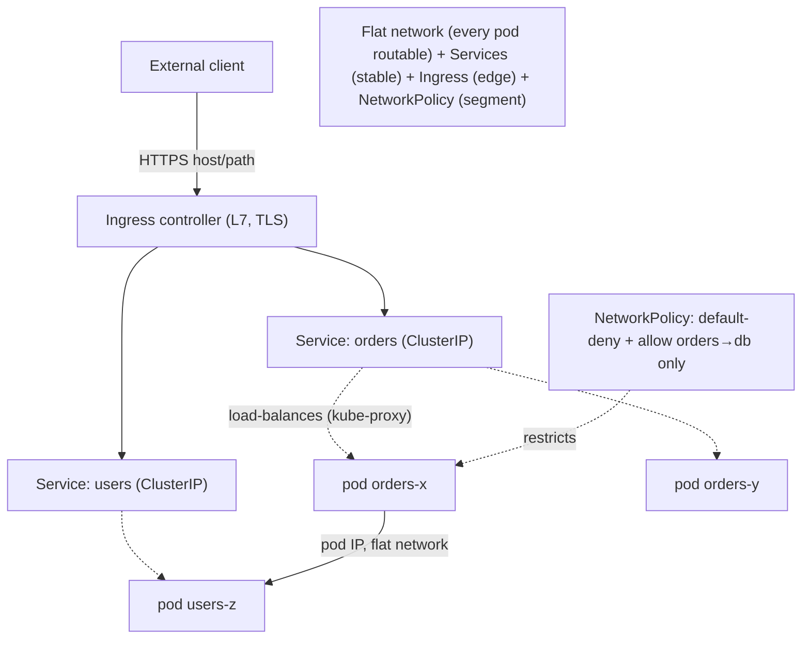
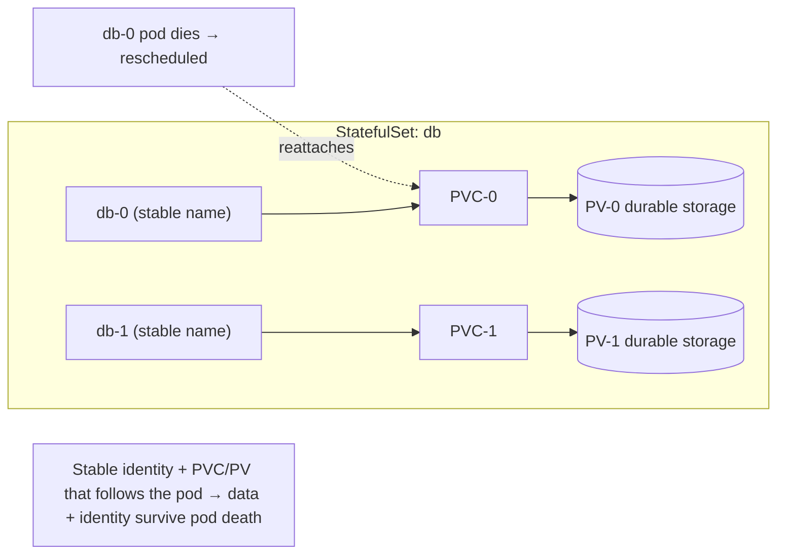

# Lesson 13.4 — Kubernetes Networking, Ingress, Config/Secrets, Stateful Workloads

> Part 13: Cloud Native · Difficulty: 🔴
>
> **Prerequisites:** [3.3.2 Reverse Proxies/API Gateways/Ingress], [4.1.3 Block/File/Object Storage], [7.2 Externalized State], [13.1 Cloud-Native/12-Factor], [13.3 Kubernetes].
> **Unlocks:** [13.5 Autoscaling], [13.7 Deployment Strategies], [13.8 Multi-Region], [Part 15 Security].

---

## 1. Learning Objectives

After this lesson you will be able to:

- Explain the **Kubernetes networking model** (flat, every pod gets a routable IP; every pod can reach every pod) and how **Services + kube-proxy + DNS** provide stable addressing.
- Describe **Ingress** as L7 HTTP(S) routing into the cluster — the API-gateway role (12.6) at the cluster edge — and **NetworkPolicy** for segmentation.
- Externalize configuration with **ConfigMaps** and secrets with **Secrets** (12-factor config — 13.1), and understand Secrets' real security limits.
- Explain why **stateful workloads are hard** on K8s and how **StatefulSets + PersistentVolumes/PVCs/StorageClasses** provide stable identity + durable storage.
- Decide **when to run state on Kubernetes vs use a managed service** (13.1 factor 4).

---

## 2. Motivation — The parts that make services reachable, configurable, and stateful

Kubernetes (13.3) schedules and heals pods, but three practical realities still need answers before real applications work. First, **networking**: pods are ephemeral, land on arbitrary nodes, and get fresh IPs constantly — so *how* do pods talk to each other, how does external traffic get in, and how do you stop everything from talking to everything (security)? Second, **configuration**: 12-factor apps (13.1) demand config and secrets **injected at runtime**, not baked into images (13.2) — so K8s needs first-class ways to supply environment-specific settings and sensitive credentials to pods. Third, and hardest, **state**: everything so far assumed **stateless** pods (13.1) that can be freely killed and replaced — but databases, queues, and other **stateful** systems need **stable identity**, **durable storage that survives pod death**, and often **ordered, careful lifecycle** — none of which the disposable-pod model gives by default.

These three concerns — networking (how pods are reached and segmented), config/secrets (how pods are parameterized), and stateful workloads (how durable, identity-bearing systems run) — are what turn a bare orchestrator into a platform that runs real applications. This lesson covers the Kubernetes networking model and Ingress, ConfigMaps/Secrets, and StatefulSets with persistent storage — and the recurring judgment call: **run state on Kubernetes, or offload it to a managed service?**

---

## 3. Theory — From first principles

### 3.1 The Kubernetes networking model

`[CS]` Kubernetes mandates a **flat networking model** with strict rules `[CS]`:
- **Every pod gets its own unique, cluster-routable IP address** (not shared with the node).
- **Every pod can reach every other pod directly** (across nodes) **without NAT** — a single flat network.
- **Containers within a pod share the pod's network namespace** (reach each other on `localhost` — 13.3).
- This model is implemented by a **CNI (Container Network Interface) plugin** (e.g., Calico, Cilium, flannel — representative) that wires up pod networking; K8s defines the *contract*, plugins implement it.
- `[BP]` The flat model **simplifies the application's view** (any pod can talk to any pod by IP) but means **everything is reachable by default** → you need **NetworkPolicy** (§3.4) to segment/secure it (zero-trust — Part 15).

### 3.2 Services, kube-proxy, and DNS (recap + mechanics)

`[CS]` Because pod IPs are ephemeral, **Services** (13.3) provide stable addressing `[CS]`:
- A **Service** has a stable **ClusterIP** (virtual IP) + a **DNS name** (`my-svc.namespace.svc.cluster.local`) resolved by **cluster DNS (CoreDNS)** → callers use the name, not pod IPs.
- **kube-proxy** (or a CNI's dataplane, e.g., eBPF) programs each node so traffic to the Service VIP is **load-balanced to a healthy backing pod** (endpoints updated as pods come/go and pass readiness — 13.3).
- `[BP]` So **service discovery + load balancing are built in** (12.6, server-side): DNS name → stable VIP → healthy pod, all reconciled automatically.

### 3.3 Ingress — L7 routing into the cluster

`[CS]` A **Service** of type LoadBalancer exposes **one** service externally (and provisions a cloud LB each) — expensive and L4. **Ingress** provides **L7 HTTP(S) routing** for **many** services behind **one** entry point `[CS]`:
- **Ingress** = rules for routing external HTTP(S) traffic to internal Services by **host/path** (e.g., `api.example.com/orders` → order-service), plus **TLS termination**.
- An **Ingress Controller** (e.g., NGINX, Traefik, cloud/Envoy-based — representative) actually implements the rules (a reverse proxy — 3.3.2) running in the cluster.
- `[BP]` **Ingress = the API-gateway role at the cluster edge** (12.6, 3.3.2): single entry, host/path routing, TLS, often auth/rate-limiting. (The newer **Gateway API** `[EMERGING]` is a more expressive successor to Ingress.) *(Representative.)*
- This is the **north-south** edge (12.6); Services/mesh handle **east-west** (12.7).

### 3.4 NetworkPolicy — segmentation

`[BP]` Since the flat model makes **everything reachable by default** (§3.1), **NetworkPolicy** restricts pod-to-pod traffic `[BP]`:
- Declarative rules specifying which pods (by label) may **ingress/egress** to which others, on which ports → **micro-segmentation** (e.g., only the API pods may reach the database pods).
- Default-open becomes **default-deny + explicit allow** (zero-trust — Part 15) — essential for security in a shared cluster.
- Enforced by the CNI plugin (not all support it). `[BP]` Combine with **mTLS via a service mesh** (12.7) for identity-based authz on top of network-level segmentation.

### 3.5 ConfigMaps and Secrets — externalized config (12-factor)

`[CS]` K8s externalizes configuration (13.1 factor 3) via two objects `[CS]`:
- **ConfigMap** — non-sensitive config (settings, URLs, feature flags) as key/value data, **injected into pods** as **environment variables** or **mounted files**. Change config without rebuilding the image (13.2).
- **Secret** — sensitive data (passwords, tokens, keys), similarly injected. Semantically like a ConfigMap but intended for secrets.
- `[BP]` **Secrets' real security limits (important):** by default, Secrets are only **base64-encoded, not encrypted** in etcd unless you enable **encryption-at-rest**; anyone with etcd/API access can read them; they're **not** a full secrets-management solution. **Best practice** (Part 15): enable **etcd encryption at rest**, tight **RBAC**, and integrate an **external secrets manager** (Vault / cloud KMS-backed secret stores) rather than relying on raw K8s Secrets. Never commit Secrets to Git in plaintext.
- `[BP]` This realizes "**one immutable image + externalized config**" (13.1 §3.5): the same image runs in any environment, parameterized by ConfigMaps/Secrets.

### 3.6 Why stateful workloads are hard

`[CS]` Everything cloud-native assumed **stateless, disposable** pods (13.1) — but stateful systems (databases, message brokers) need the opposite `[CS]`:
- **Stable identity:** a database replica isn't interchangeable — it has a role (leader/follower — Part 10), a stable name/address others depend on. A disposable pod with a random name/IP breaks this.
- **Durable, attached storage:** its data **must survive pod death/reschedule** — but a pod's filesystem is ephemeral (13.2). Data must live on **persistent storage** that reattaches to the replacement.
- **Ordered, careful lifecycle:** clustered stateful systems often need **ordered** startup/scaling/shutdown (e.g., bootstrap the leader first) and careful handling, not the free-for-all of stateless pods.
- `[BP]` This tension is why running state on K8s is genuinely harder than stateless services — the platform's core assumptions are inverted.

### 3.7 StatefulSets + persistent storage

`[CS]` Kubernetes addresses stateful needs with **StatefulSets** and the **persistent-storage** subsystem `[CS]`:
- **StatefulSet** (vs Deployment — 13.3): gives pods **stable, ordinal identities** (`db-0`, `db-1`, … — persistent names/DNS), **ordered** deployment/scaling/rolling-update, and **each pod its own persistent volume** that **follows it** across reschedules. For clustered stateful apps.
- **Persistent storage abstractions:**
  - **PersistentVolume (PV):** a piece of **durable storage** in the cluster (backed by cloud block storage, NFS, etc. — 4.1.3), independent of any pod's lifecycle.
  - **PersistentVolumeClaim (PVC):** a pod's **request** for storage (size/access mode); binds to a PV → decouples the pod from the specific storage backend.
  - **StorageClass:** enables **dynamic provisioning** — a PVC triggers automatic creation of a PV from a class (e.g., "fast-ssd") → self-service durable storage.
  - **Access modes:** ReadWriteOnce (one node), ReadOnlyMany, ReadWriteMany — the storage backend's capability (block vs file — 4.1.3) constrains this.
- `[BP]` So a StatefulSet pod (`db-0`) gets a **stable name** + a **bound PVC/PV** that **reattaches** when the pod is rescheduled → identity + durable data survive pod death. This is how you run databases/brokers on K8s.

### 3.8 Run state on K8s or use a managed service?

`[BP]`/`[OPINION]` The recurring judgment call `[OPINION]`:
- **Managed service (often preferred — 13.1 factor 4):** consume a **managed database/queue/object-store** (as an attached backing service — 13.1) → the provider handles replication, backups, failover, upgrades, and the hard stateful operations. **Default for most teams** — running a production-grade stateful system yourself is a large, specialized effort.
- **Run state on K8s (StatefulSets):** justified when you need **portability/on-prem**, a system without a good managed option, cost control at scale, or you have the **operational expertise** (often via a well-tested **operator** — a custom controller that automates the stateful system's lifecycle — 13.3 §3.1).
- `[BP]` **Rule of thumb:** run **stateless** services on K8s freely; be **cautious** running stateful systems yourself — prefer managed services unless you have a strong reason and the expertise. Getting stateful wrong (data loss, split-brain — 11.2/8.3.6) is far costlier than getting stateless wrong.

---

## 4. Visual Intuition

### Networking: pod-to-pod, Service, Ingress

### Stateful: StatefulSet + PVC/PV

---

## 5. Real-World Analogy

Think of Kubernetes as a giant **serviced office complex**, and these features as how tenants are connected, configured, and given permanent storage.

- **The flat network (§3.1):** the complex is wired so **every office can phone every other office directly** by internal extension — no operator, no barriers. Simple and fast, but it means **anyone can call anyone**, so you post **calling rules** (NetworkPolicy): "the Accounting floor may only be reached by the Finance team." Without those rules, the whole building is wide open.
- **Services + DNS (§3.2):** tenants move offices constantly (pods reschedule, IPs change), so nobody memorizes a specific office number. Instead there's a **stable directory name** — "call *Sales*" — and the **switchboard** (kube-proxy + DNS) connects you to **whichever Sales desk is currently staffed and ready** (a healthy pod).
- **Ingress (§3.3):** visitors from **outside** don't wander the halls — they enter through **one main reception** that reads the visitor's request ("I'm here for Orders, at api.example.com/orders") and **routes them to the right department**, checking their credentials and handling the **security badge/encryption** (TLS termination) at the door. One reception fronts many departments (contrast: a private side-entrance/elevator per department is the costly per-service LoadBalancer).
- **ConfigMaps & Secrets (§3.5):** each office is furnished from the **same standard blueprint** (immutable image), but on move-in day the tenant is handed an **envelope of settings** (ConfigMap — which printer, which timezone) and a **sealed envelope of keys/passwords** (Secret). Crucially, the "sealed" envelope is really just in a **locked-but-not-armored drawer** (base64, not encryption by default) — so serious tenants install a **proper safe** (external secrets manager / etcd encryption) and restrict who has the master key (RBAC).
- **Stateful workloads (§3.6/3.7):** most tenants are **hot-deskers** — any desk works, and if one desk breaks they just take another (stateless pods). But the **records department** can't hot-desk: it needs **the same named office every day** (stable identity `db-0`) and a **permanent locked filing room whose contents survive even if the staff change** (PersistentVolume that reattaches). The complex provides **assigned offices + permanent storage rooms** (StatefulSet + PVC/PV) for these tenants.
- **Managed vs self-run (§3.8):** running your own records department with all its permanence and backup needs is a big commitment — so most tenants **outsource records to a specialist archive company** (managed database service) and only keep it in-house when they have a strong reason and their own expert archivists (an operator).

---

## 6. Industry Example

- **CNI plugins (Calico/Cilium/flannel)** `[CONV]`: implement the flat pod network + (Calico/Cilium) NetworkPolicy; Cilium uses eBPF for dataplane/policy (§3.1/3.4). *(Representative.)*
- **Ingress controllers (NGINX/Traefik) + Gateway API** `[CONV]`: L7 routing/TLS at the cluster edge; Gateway API as the more expressive successor (§3.3). *(Representative.)*
- **External secrets (Vault, cloud KMS-backed stores) + etcd encryption** `[CONV]`: teams avoid relying on raw base64 Secrets (§3.5, Part 15). *(Representative.)*
- **Operators for stateful systems** `[CONV]`: database/broker operators (e.g., for PostgreSQL, Kafka) automate StatefulSet lifecycle (§3.7/3.8). *(Representative.)*
- **Managed data services preferred** `[OPINION]`: many teams run stateless workloads on K8s but use managed databases/queues to avoid operating state (§3.8, 13.1). *(Representative.)*

---

## 7. Implementation Details

- **Rely on the flat model + Services/DNS** (§3.1/3.2): address services by DNS name; let kube-proxy/CNI load-balance to healthy pods.
- **Use Ingress (or Gateway API) for external HTTP(S)** (§3.3): host/path routing + TLS at one edge instead of a LoadBalancer per service.
- **Apply NetworkPolicy: default-deny + explicit allow** (§3.4) for segmentation; layer **mesh mTLS** (12.7) for identity-based authz (Part 15).
- **Externalize config via ConfigMaps, secrets via Secrets** (§3.5); **enable etcd encryption at rest + tight RBAC + external secrets manager** — don't trust raw base64 Secrets; never commit plaintext secrets.
- **Use StatefulSets + PVC/PV/StorageClass** for stateful workloads needing identity + durable storage (§3.7); pick access modes per backend (4.1.3).
- **Prefer managed services for state** (§3.8, 13.1 factor 4) unless portability/cost/expertise justify self-hosting (then use a mature operator).
- **Spread stateful replicas across zones** (13.8/11.2) and ensure storage durability + backups (11.8) — data loss is unforgiving.

---

## 8. Advantages

- **Simple app networking** — flat model: any pod reaches any pod by IP; stable Services/DNS hide pod churn (§3.1/3.2).
- **Edge routing built in** — Ingress: many services behind one L7 entry with TLS (§3.3, 12.6).
- **Segmentation** — NetworkPolicy enables zero-trust micro-segmentation (§3.4, Part 15).
- **12-factor config** — ConfigMaps/Secrets inject config into one immutable image (§3.5, 13.1).
- **Stateful support** — StatefulSets + PV/PVC give identity + durable storage when needed (§3.7).
- **Storage self-service** — dynamic provisioning via StorageClass (§3.7).

---

## 9. Disadvantages / costs

- **Networking complexity** — CNI choice, policy, DNS, kube-proxy internals are non-trivial to run/debug (§3.1/3.2).
- **Secrets are weak by default** — base64, not encrypted; needs extra work to be secure (§3.5, Part 15).
- **Stateful is genuinely hard** — identity + durable storage + ordered lifecycle fight the disposable model; data-loss/split-brain risk (§3.6, 11.2).
- **Storage constraints** — access modes (RWO vs RWX) limited by backend; cross-zone storage is tricky (§3.7, 13.8).
- **Ingress/edge is another component** to configure and secure (SPOF risk — 12.6).
- **Managed-service coupling** — offloading state creates provider lock-in (cost tradeoff — 1.2.3).

---

## 10. When NOT to / cautions

- **Don't self-run stateful systems on K8s** without strong reason + expertise + a mature operator — prefer managed services (§3.8).
- **Don't rely on raw Secrets for real secrets** — enable encryption + external manager (§3.5, Part 15).
- **Don't leave the network default-open** in a multi-tenant/shared cluster — apply NetworkPolicy (§3.4).
- **Don't expose each service via its own LoadBalancer** when Ingress consolidates them (§3.3).
- **Don't assume RWX storage** — many block backends are ReadWriteOnce (§3.7).
- **Don't put critical data on ephemeral pod storage** — use PV/PVC + backups (§3.6/3.7, 11.8).

---

## 11. Common Mistakes

1. **Storing state on the pod filesystem** — lost on reschedule; must use PV/PVC (§3.6/3.7).
2. **Trusting raw K8s Secrets** — base64 ≠ encryption; leaks via etcd/RBAC gaps (§3.5).
3. **No NetworkPolicy** — flat network wide open; any compromised pod reaches everything (§3.4, Part 15).
4. **LoadBalancer per service** — cost/complexity where Ingress suffices (§3.3).
5. **Using a Deployment for a stateful app** — no stable identity/storage/order → data corruption (§3.6/3.7).
6. **Committing secrets to Git** in plaintext manifests (§3.5).
7. **Wrong storage access mode** — assuming RWX on an RWO backend → scheduling/mount failures (§3.7).
8. **Self-hosting a database naively** — no operator/backups/anti-affinity → data loss/split-brain (§3.8, 11.2/11.8).

---

## 12. Interview Questions

**🟢 Easy**
- What is the Kubernetes networking model (pod IPs, pod-to-pod reachability)?
- What is Ingress, and how does it differ from a Service of type LoadBalancer?

**🟡 Medium**
- How do ConfigMaps and Secrets externalize configuration, and what are Secrets' security limitations?
- Why are stateful workloads harder on Kubernetes than stateless ones?

**🔴 Hard**
- Explain StatefulSets vs Deployments: stable identity, ordered lifecycle, and per-pod persistent storage (PVC/PV/StorageClass). How does data survive pod rescheduling?
- How does traffic flow from an external client to a pod (Ingress → Service → kube-proxy/DNS → pod), and how does NetworkPolicy restrict pod-to-pod traffic?

**⚫ Staff+**
- Design the networking + security posture for a multi-tenant cluster: flat network, NetworkPolicy (default-deny), Ingress/Gateway with TLS, mesh mTLS, and secrets management (etcd encryption + external manager). Justify each layer.
- A team wants to run their primary PostgreSQL on Kubernetes. Advise them: StatefulSet + PV/PVC + operator + anti-affinity + backups vs a managed database — the risks (data loss, split-brain, upgrades) and when self-hosting is justified.

---

## 13. Production Pitfalls

- **Data loss on reschedule:** stateful data on the ephemeral pod filesystem (or a mis-bound PVC) vanished when the pod moved (§3.6/3.7).
- **Secret leak:** base64 Secrets readable via over-broad RBAC / unencrypted etcd → credential compromise (§3.5, Part 15).
- **Lateral movement:** no NetworkPolicy → a compromised front-end pod reached the database directly (§3.4).
- **Split-brain in self-hosted DB:** naive StatefulSet without proper fencing/quorum → two leaders, data corruption (§3.8, 8.3.6/11.2).
- **Ingress misconfig / SPOF:** the ingress controller became a bottleneck or was misconfigured, breaking external access (§3.3, 12.6).
- **Storage access-mode mismatch:** pod couldn't mount an RWO volume on a second node → stuck rollout (§3.7).
- **Cross-zone storage failure:** a PV tied to one zone couldn't reattach when the pod rescheduled to another zone (§3.7, 13.8).

---

## 14. Optimization Techniques

- **Ingress/Gateway consolidation + TLS** at one edge instead of many LoadBalancers → cost + manageability (§3.3).
- **NetworkPolicy default-deny + mesh mTLS** for defense-in-depth segmentation (§3.4, 12.7/Part 15).
- **External secrets manager + etcd encryption** for real secret security (§3.5).
- **Managed services for state** to offload the hardest operations (§3.8, 13.1).
- **StatefulSet anti-affinity + zone spread + backups** when self-hosting state (§3.7, 11.2/11.8/13.8).
- **Dynamic provisioning (StorageClass)** for self-service, right-tiered storage (§3.7).
- **eBPF-based CNI (Cilium)** for efficient dataplane + rich policy/observability (§3.1). `[EMERGING]`

---

## 15. Summary

Beyond scheduling/healing (13.3), real applications need **networking, configuration, and state** — the parts this lesson covers. Kubernetes mandates a **flat networking model**: **every pod gets a unique, cluster-routable IP**, **every pod can reach every other pod without NAT**, and containers in a pod share `localhost` — implemented by a **CNI plugin**. Because pod IPs are ephemeral, **Services** give a stable **ClusterIP + DNS name** (resolved by CoreDNS) that **kube-proxy/CNI load-balances to healthy pods** — built-in server-side discovery (12.6). External HTTP(S) traffic enters via **Ingress** (an **Ingress Controller** reverse-proxy — 3.3.2), which does **L7 host/path routing + TLS termination** for **many services behind one edge** — the **API-gateway role at the cluster edge** (12.6; the **Gateway API** is its more expressive successor). Since the flat model makes **everything reachable by default**, **NetworkPolicy** enforces **default-deny + explicit-allow micro-segmentation** (zero-trust — Part 15), ideally layered with **mesh mTLS** (12.7). Configuration follows **12-factor** (13.1): **ConfigMaps** inject non-sensitive config and **Secrets** inject sensitive data (as env vars or mounted files) into the **one immutable image** — but **Secrets are only base64-encoded, not encrypted, by default**, so real security requires **etcd encryption at rest + tight RBAC + an external secrets manager** (Vault/cloud KMS), never plaintext-in-Git. **State is the hard part**: cloud-native assumes **stateless, disposable** pods, but databases/brokers need the opposite — **stable identity**, **durable storage that survives pod death**, and **ordered lifecycle** — so **StatefulSets** give pods **stable ordinal identities** (`db-0`, `db-1`), **ordered** deploy/scale, and **each its own persistent volume that follows it**, backed by the storage subsystem: **PersistentVolumes** (durable storage — 4.1.3), **PersistentVolumeClaims** (a pod's request that binds to a PV), and **StorageClasses** (dynamic provisioning) — with **access modes** (RWO/ROX/RWX) constrained by the backend. Finally, the recurring judgment call: **run state on K8s (StatefulSets + operators) or use a managed service?** — the pragmatic default is **run stateless services on K8s freely but prefer managed services for state** (13.1 factor 4), self-hosting only with a strong reason, operational expertise, and a mature operator, because getting stateful wrong (data loss, split-brain — 11.2/8.3.6) is far costlier than getting stateless wrong.

---

## 16. Revision Notes (flashcard-ready)

- **Q:** K8s networking model? **A:** Flat — every pod gets a routable IP; every pod reaches every pod without NAT; containers in a pod share localhost. Implemented by a CNI.
- **Q:** How is stable addressing provided? **A:** Service (ClusterIP + DNS via CoreDNS) + kube-proxy load-balancing to healthy pods.
- **Q:** Ingress? **A:** L7 host/path HTTP(S) routing + TLS for many services behind one edge (API-gateway role); run by an Ingress Controller.
- **Q:** NetworkPolicy? **A:** Label-based rules to restrict pod-to-pod traffic; turn default-open into default-deny + allow (zero-trust).
- **Q:** ConfigMap vs Secret? **A:** ConfigMap = non-sensitive config; Secret = sensitive data — both injected as env/files into the immutable image.
- **Q:** Secrets' security limit? **A:** Base64-encoded, NOT encrypted by default → need etcd encryption + RBAC + external secrets manager.
- **Q:** Why is stateful hard? **A:** Needs stable identity + durable storage surviving pod death + ordered lifecycle — opposite of disposable pods.
- **Q:** StatefulSet vs Deployment? **A:** StatefulSet = stable ordinal names, ordered lifecycle, per-pod persistent volume that follows it.
- **Q:** PV vs PVC vs StorageClass? **A:** PV = durable storage; PVC = pod's request that binds to a PV; StorageClass = dynamic provisioning.
- **Q:** Run state on K8s or managed? **A:** Prefer managed services for state (factor 4); self-host only with strong reason + expertise + operator.

---

## 17. Further Reading + Knowledge-Graph Links

**Foundations (in-platform):**
- **[13.3 Kubernetes]** — pods/Services/controllers this builds on.
- **[3.3.2 Reverse Proxies/API Gateways/Ingress]** — Ingress's lineage.
- **[4.1.3 Block/File/Object Storage]** — what PVs are backed by; access modes.
- **[7.2 Externalized State]** — why stateless is the default and state is externalized.

**Unlocks / next:**
- **[13.5 Autoscaling]** — scaling the workloads across this network.
- **[13.7 Deployment Strategies]** — rollouts using Services/readiness.
- **[13.8 Multi-Region]** — zone/region spread of stateful storage + traffic.
- **[Part 15 Security]** — NetworkPolicy, secrets, zero-trust.

**External (canonical):**
- Kubernetes docs (services-networking, ingress, configmaps/secrets, storage, StatefulSets). *(Representative.)*
- CNI / Cilium / Calico documentation. *(Representative.)*

> **Knowledge-graph:** `13.3 Kubernetes` → **`13.4 networking/config/stateful`** (flat net + Services/Ingress/NetworkPolicy + ConfigMaps/Secrets + StatefulSets/PV) → `13.5 autoscaling` / `13.8 multi-region` / `Part 15 security`.
