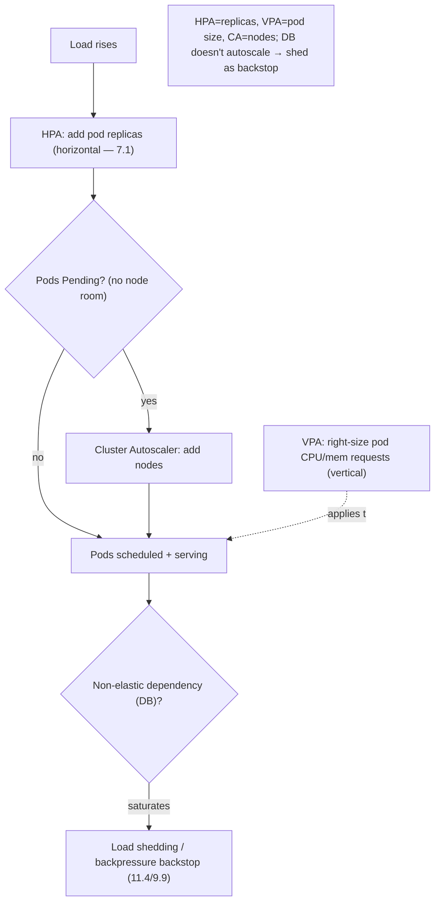
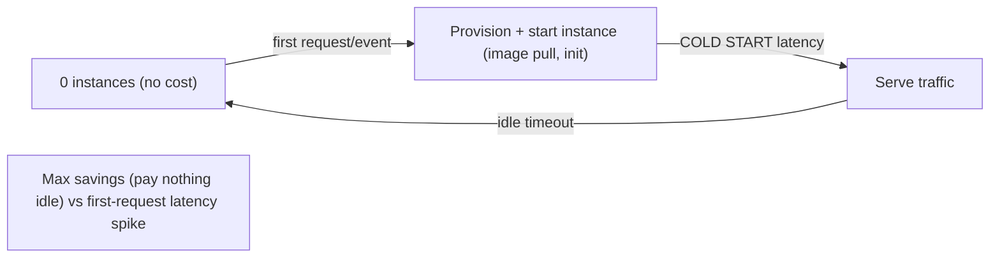

# Lesson 13.5 — Autoscaling: HPA, VPA, Cluster Autoscaler, Scale-to-Zero

> Part 13: Cloud Native · Difficulty: 🟡🔴
>
> **Prerequisites:** [7.1 Vertical vs Horizontal Scaling], [7.7 Capacity Planning & Load Testing], [11.4 Load Shedding], [13.1 Cloud-Native Model], [13.3 Kubernetes].
> **Unlocks:** [13.7 Deployment Strategies], [13.8 Multi-Region], [Part 14 SRE], [Part 17 Performance].

---

## 1. Learning Objectives

After this lesson you will be able to:

- Explain **elasticity** — automatically matching capacity to demand — and why it's a headline benefit of cloud-native (13.1).
- Distinguish the three Kubernetes autoscalers: **Horizontal Pod Autoscaler (HPA)**, **Vertical Pod Autoscaler (VPA)**, and **Cluster Autoscaler (CA)** — what each scales and how they compose.
- Describe **scale-to-zero** and its role in **serverless/event-driven** workloads, plus the **cold-start** tradeoff.
- Choose scaling **metrics** (CPU, custom, external — e.g., queue depth) and set targets that balance responsiveness, stability, and cost.
- Connect autoscaling to capacity limits: it scales the **elastic** tier but **not non-elastic dependencies** (databases — 7.6), so pair it with **load shedding** (11.4) as a backstop.

---

## 2. Motivation — Pay for what you need, when you need it

Traditional capacity planning (7.7) forces a painful bet: **provision for peak** and waste money most of the time, or **provision for average** and fall over during spikes. Cloud-native's elasticity dissolves this bet: **autoscaling** automatically **adds capacity when demand rises and removes it when demand falls**, so you pay roughly for what you use while still handling spikes. This is one of the cloud's defining value propositions (13.1) — and it's only possible because cloud-native apps are **stateless, disposable cattle** (13.1/7.2) that the platform can freely create and destroy.

But "autoscaling" is not one thing. In Kubernetes there are **three distinct autoscalers** operating at different levels: the **HPA** adds/removes **pod replicas** (horizontal scaling — 7.1), the **VPA** adjusts a pod's **CPU/memory requests** (vertical scaling — 7.1), and the **Cluster Autoscaler** adds/removes **nodes** so there's room for the pods. They **compose** — HPA creates more pods, CA adds nodes to fit them — but can also **conflict** (HPA and VPA both touching the same workload). Beyond these, **scale-to-zero** takes elasticity to its limit — running **zero** instances when idle and spinning up on demand — the foundation of serverless, at the cost of **cold starts**. And autoscaling has a crucial limit that ties back to scalability fundamentals: it scales the **elastic** compute tier beautifully, but it **cannot scale a non-elastic dependency** like a primary database (7.6) — scale the app tier into a database that can't keep up and you just move the bottleneck (and can make it worse). This lesson develops the autoscalers, scale-to-zero, metric selection, and these critical limits.

---

## 3. Theory — From first principles

### 3.1 Elasticity and why it needs stateless cattle

`[CS]` **Elasticity** = automatically adjusting capacity to match current demand (scale **out** on load, **in** when idle) `[CS]`:
- Contrast **scalability** (the *ability* to grow — 7.1) with **elasticity** (doing it **automatically and bidirectionally** in response to demand).
- **Prerequisite:** the workload must be **stateless + disposable** (13.1/7.2) — the platform must be able to **add and, crucially, remove** instances at will without losing state or dropping work (graceful shutdown — 13.1 §3.3). Elasticity is a **payoff of cloud-native design**, not free.
- **Benefit:** cost efficiency (pay ~for use) + spike handling **without** peak-provisioning waste (7.7).

### 3.2 Horizontal Pod Autoscaler (HPA)

`[CS]` **HPA** automatically adjusts the **number of pod replicas** in a Deployment/ReplicaSet based on observed metrics `[CS]`:
- **Mechanism:** it watches a **metric** (e.g., average CPU utilization) against a **target**; if actual > target, it **adds replicas**; if actual < target, it **removes** them — a control loop converging to the target (reconciliation — 13.3).
- Rough intuition: `desiredReplicas ≈ ceil(currentReplicas × currentMetric / targetMetric)`.
- **Horizontal scaling** (7.1) — the cloud-native default: add identical stateless pods. The Service (13.3/13.4) load-balances across the new set automatically.
- `[BP]` **Metrics** (§3.6): CPU (basic), **custom metrics** (requests/sec, concurrency), or **external metrics** (queue depth — scale consumers by backlog — 9.9). Choosing the right metric is the crux.
- **Stabilization:** HPA uses **cooldown/stabilization windows** to avoid **thrashing** (rapid scale up/down oscillation) — smoothing scale-in especially.

### 3.3 Vertical Pod Autoscaler (VPA)

`[CS]` **VPA** automatically adjusts a pod's **CPU/memory requests/limits** (its **size**) based on observed usage — **vertical scaling** (7.1) `[CS]`:
- **Use:** right-sizing workloads whose per-pod resource needs are hard to predict, or that **can't scale horizontally** well (some stateful/singleton workloads).
- **Limitation:** changing a pod's resources typically requires **recreating the pod** (disruptive); and it's bounded by node size (7.1's vertical ceiling).
- `[BP]` **HPA vs VPA conflict:** don't run HPA and VPA on the **same metric** for the same workload (they fight). Common pattern: **VPA for right-sizing requests** + **HPA for replica count on a different signal**, or use one deliberately. VPA is often used in **recommendation mode** (suggest requests) rather than auto-applying.

### 3.4 Cluster Autoscaler (CA)

`[CS]` **HPA/VPA scale pods, but pods need nodes to run on.** The **Cluster Autoscaler** adjusts the **number of nodes** in the cluster `[CS]`:
- **Scale up:** if pods are **Pending** because no node has room (13.3 scheduling), CA **adds nodes** (provisions VMs) so they can be scheduled.
- **Scale down:** if nodes are **underutilized** and their pods can be moved elsewhere, CA **drains and removes** nodes to save cost.
- `[BP]` **CA composes with HPA:** HPA adds pods → some go Pending → CA adds nodes → pods schedule. On scale-in: HPA removes pods → nodes empty → CA removes nodes. **Node provisioning is slower** than pod scheduling (VM boot + join — minutes), so there's a lag; **overprovisioning / headroom pods** (pause pods reserving capacity) can hide it.
- **Newer approaches** `[EMERGING]`: node autoprovisioners (e.g., Karpenter-style) that pick right-sized nodes just-in-time. *(Representative.)*

### 3.5 Scale-to-zero and serverless

`[CS]` **Scale-to-zero** = run **zero** instances when there's **no demand**, and **spin up on the first request/event** `[CS]`:
- Takes elasticity to its limit → **pay nothing when idle** (ideal for spiky/intermittent workloads, dev environments, event-driven functions).
- The foundation of **serverless / FaaS** and event-driven autoscaling (e.g., KEDA-style scaling on queue events, Knative-style request-driven scale-to-zero — representative).
- **The cost — cold start** `[BP]`: when scaling from zero, the **first request waits** for an instance to be provisioned/started (image pull + startup — 13.2/13.1) → **latency spike**. Trade-offs: keep a **minimum of 1** (no cold start, small always-on cost) vs true zero (max savings, cold-start latency). Mitigate with **fast startup** (small images, lazy init — 13.1/13.2), **pre-warming**, or **provisioned concurrency**.
- `[BP]` **When it fits:** intermittent/bursty/event-driven workloads where cold-start latency is acceptable and idle-cost savings are significant. **When it doesn't:** latency-critical always-on services.

### 3.6 Choosing metrics and targets

`[BP]` The **metric** is the most important autoscaling decision `[BP]`:
- **CPU utilization:** simple default, but a poor proxy for many workloads (I/O-bound, latency-sensitive) — CPU may be low while the service is overloaded.
- **Custom metrics:** app-level signals like **requests/sec**, **concurrency/in-flight requests**, or **p95 latency** — usually far better proxies for "load."
- **External metrics:** signals outside the pods — **queue/topic lag** (scale consumers to drain backlog — 9.9), or business events (KEDA-style). Excellent for async/worker workloads.
- **Target-setting:** set the target below the **utilization knee** (7.7 — `1/(1−ρ)` blows up near saturation) so scaling triggers **before** latency collapses; leave **headroom** for the scale-up lag (§3.4). Too aggressive → thrashing/cost; too lax → overload before scaling.
- `[BP]` **Little's Law** (7.7) underpins it: concurrency = arrival rate × latency; scaling on **concurrency** directly targets what matters.

### 3.7 The critical limit: autoscaling doesn't scale non-elastic dependencies

`[CS]`/`[BP]` The dangerous misconception `[BP]`:
- Autoscaling scales the **elastic, stateless tier** (app pods) — but a request usually depends on a **non-elastic backend** (a primary **database** — 7.6, a downstream service with fixed capacity, a rate-limited API).
- **Scaling the app tier into a fixed-capacity database makes things worse**: more pods → more connections + queries → the database saturates → **everything slows/fails**, and the extra pods amplify the load (a self-inflicted overload — related to metastable failure — 11.3).
- `[BP]` **So:** identify the **binding constraint** (7.6 — usually the database/a stateful dependency) before autoscaling; **autoscaling ≠ infinite scaling**. Pair it with:
  - **Scaling the data tier appropriately** (replicas/sharding — 7.5, connection pooling — 5.4.2) or using elastic managed data services.
  - **Load shedding + backpressure** (11.4/9.9) as a **backstop** — when you *can't* scale further (or fast enough), **shed load** rather than collapse.
  - **Connection limits** so a pod surge doesn't exhaust database connections (5.4.2).
- `[BP]` **Autoscaling is elasticity for the elastic tier; the non-elastic tier still needs capacity planning (7.7) and protection (11.4).**

---

## 4. Visual Intuition

### The three autoscalers compose

### Scale-to-zero + cold start

---

## 5. Real-World Analogy

Think of staffing a **coffee shop** whose customer traffic swings wildly through the day.

- **Elasticity (§3.1):** a rigid shop hires a **fixed** number of baristas — too many at 3pm (wasted wages), too few at the 8am rush (huge queues). An **elastic** shop **calls in more baristas as the line grows and sends them home when it's quiet** — paying roughly for the work actually needed. This only works because baristas are **interchangeable** (stateless cattle) — any barista can take any order.
- **HPA = calling in more baristas (§3.2):** when the queue (a load metric) gets long, you **add identical baristas**; when it's short, you **send some home**. You watch a **signal** — ideally the **actual line length / orders-per-minute** (a good custom metric), not just "are the baristas sweating" (CPU, a poor proxy) — and you avoid **yo-yoing** staff in and out every minute (stabilization).
- **VPA = giving one barista a bigger station (§3.3):** instead of more people, you **upgrade a single barista's equipment** (a faster machine, more counter space) — vertical scaling. Useful when you can't just add people (a specialist role), but there's a ceiling (a station can only get so big), and swapping equipment means **briefly closing that station** (recreating the pod).
- **Cluster Autoscaler = renting more shop floor (§3.4):** you can only fit so many baristas in the current space. When new baristas have **nowhere to stand** (pods Pending), you **rent an adjacent unit** (add a node); when a unit is empty, you **give it back** (remove a node). Renting space takes **longer** than calling a barista (VM boot lag), so a smart manager keeps **a little extra floor ready** (headroom).
- **Scale-to-zero (§3.5):** a **pop-up stall** that's **completely closed and costs nothing** overnight, and only **opens when the first customer shows up** — but that first customer **waits while you unlock, power on, and heat the machine** (cold start). Great for a rarely-visited stall; terrible for a busy downtown shop where nobody will wait.
- **The non-elastic bottleneck (§3.7 — the key lesson):** you can hire **fifty baristas**, but if there's **one espresso machine** (the database), adding baristas past a point just creates **fifty people crowding one machine** — orders get *slower*, not faster. Beyond the machine's capacity you must either **buy more machines** (scale the data tier) or **stop letting people join the line** (load shedding) — hiring more baristas can't fix a single-machine bottleneck.

---

## 6. Industry Example

- **Kubernetes HPA/VPA/Cluster Autoscaler** `[CONV]`: the three standard autoscalers; HPA on CPU/custom/external metrics, CA provisioning nodes (§3.2–3.4). *(Representative.)*
- **KEDA (event-driven autoscaling)** `[CONV]`: scales workloads (including to zero) on external event sources like queue depth (§3.5/3.6, 9.9). *(Representative.)*
- **Knative / serverless scale-to-zero** `[CONV]`: request-driven scaling to zero with cold-start tradeoffs; provisioned concurrency to mitigate (§3.5). *(Representative.)*
- **Karpenter-style node autoprovisioning** `[EMERGING]`: just-in-time right-sized nodes as a CA alternative (§3.4). *(Representative.)*
- **Autoscale-into-DB outages** `[OPINION]`: incidents where scaling the app tier exhausted database connections/capacity, worsening the outage (§3.7, 5.4.2/11.3). *(Representative.)*

---

## 7. Implementation Details — configuring autoscaling

- **Ensure statelessness + graceful shutdown + fast startup** (13.1) — prerequisites for safe scale-in and responsive scale-out (§3.1/3.5).
- **HPA on a good metric** (§3.6): prefer **concurrency/RPS/latency or queue lag** over raw CPU; set targets below the utilization knee (7.7) with headroom; tune stabilization to avoid thrashing.
- **Set accurate resource requests** (13.3) — HPA % and scheduling/CA depend on them; consider **VPA in recommendation mode** to right-size (§3.3).
- **Avoid HPA+VPA conflicts** on the same signal (§3.3).
- **Enable Cluster Autoscaler** (or a node autoprovisioner) with headroom/overprovisioning to hide node-boot lag (§3.4).
- **Scale-to-zero only where cold starts are acceptable** (§3.5); otherwise keep a warm minimum; mitigate cold starts (small images, pre-warm, provisioned concurrency).
- **Protect non-elastic dependencies** (§3.7): scale/pool the data tier (7.5/5.4.2), cap connections, and add **load shedding + backpressure** (11.4/9.9) as a backstop.
- **Set min/max bounds** on all autoscalers (floor for availability, ceiling for cost + to protect downstreams).

---

## 8. Advantages

- **Cost efficiency** — pay ~for use; no peak-provisioning waste (§3.1, 7.7).
- **Spike handling** — absorb load surges automatically (§3.2).
- **Right-sizing** — VPA tunes resources; CA tunes node count (§3.3/3.4).
- **Scale-to-zero savings** — nothing paid when idle (serverless — §3.5).
- **Self-managing** — reconciliation-based; less manual capacity toil (§3.1/3.2, 13.3).
- **Composability** — HPA + CA together scale pods and the nodes to hold them (§3.4).

---

## 9. Disadvantages / costs

- **Doesn't scale non-elastic dependencies** — can worsen a DB bottleneck (§3.7) — the biggest trap.
- **Lag** — node provisioning (CA) is minutes; cold starts add first-request latency (§3.4/3.5).
- **Thrashing** — bad metrics/targets → oscillation, instability, cost (§3.2/3.6).
- **Metric selection is hard** — CPU is a poor proxy for many workloads (§3.6).
- **HPA/VPA conflicts** — fighting over the same workload (§3.3).
- **Complexity** — three autoscalers + metrics + bounds to configure and reason about (§3.2–3.6).
- **Requires strict statelessness** — scale-in loses anything held locally (§3.1, 13.1).

---

## 10. When NOT to / cautions

- **Don't autoscale into a non-elastic bottleneck** without scaling/protecting it — you'll amplify the overload (§3.7).
- **Don't scale-to-zero latency-critical services** — cold starts hurt (§3.5).
- **Don't autoscale on CPU** when it's a poor proxy for your load — pick a better metric (§3.6).
- **Don't run HPA + VPA on the same signal** (§3.3).
- **Don't rely on autoscaling instead of capacity planning** — it's not infinite; the data tier still needs planning (§3.7, 7.7).
- **Don't autoscale stateful/non-disposable workloads horizontally** without care (§3.1, 13.4).

---

## 11. Common Mistakes

1. **Scaling the app tier into a fixed database** → worse overload (connection exhaustion) (§3.7, 5.4.2).
2. **Autoscaling on CPU** for an I/O/latency-bound service → scales too late or wrong (§3.6).
3. **No headroom for scale-up lag** → spike overwhelms before nodes/pods arrive (§3.4/3.6).
4. **Thrashing** from too-tight targets/no stabilization (§3.2/3.6).
5. **HPA + VPA conflict** on the same metric (§3.3).
6. **Scale-to-zero on a latency-sensitive path** → cold-start user pain (§3.5).
7. **No max bound** → runaway cost or downstream overload during a traffic anomaly/attack (§3.7).
8. **Treating autoscaling as infinite** → skipping capacity planning + load shedding (§3.7, 7.7/11.4).

---

## 12. Interview Questions

**🟢 Easy**
- What is elasticity, and how does it differ from scalability?
- What does the Horizontal Pod Autoscaler do?

**🟡 Medium**
- Compare HPA, VPA, and Cluster Autoscaler — what does each scale, and how do they compose?
- What is scale-to-zero, and what is the cold-start tradeoff?

**🔴 Hard**
- Why is CPU often a poor autoscaling metric? What metrics are better, and how do you set targets (relate to the utilization knee and Little's Law — 7.7)?
- Why can autoscaling the app tier make a database bottleneck worse, and what do you do about it?

**⚫ Staff+**
- Design the autoscaling strategy for a service with spiky traffic and a shared primary database: HPA metric + target + bounds, CA + headroom, protecting the DB (replicas/pooling/connection caps), and load shedding as a backstop — with the failure modes you're guarding against.
- Design event-driven scale-to-zero for a bursty async worker fleet: scaling on queue lag (KEDA-style), cold-start mitigation, and how you avoid overwhelming downstream systems when it scales up.

---

## 13. Production Pitfalls

- **Autoscale-into-DB collapse:** HPA added pods → connection pool/DB saturated → latency spiked → more pods added → worse (metastable) (§3.7, 11.3).
- **Spike outran scaling:** node-boot lag (CA) + slow pod startup meant capacity arrived after the spike already caused errors (§3.4/3.5) — needed headroom + fast startup.
- **Thrashing:** aggressive targets caused constant scale up/down, destabilizing the service and inflating cost (§3.2/3.6).
- **Cold-start latency SLO breach:** scale-to-zero on a user-facing path caused first-request timeouts (§3.5).
- **CPU-metric blind spot:** an I/O-bound service was overloaded (queues growing) while CPU stayed low → HPA never scaled (§3.6).
- **Runaway cost from no ceiling:** a traffic anomaly/attack scaled the fleet enormously with no max (§3.7).

---

## 14. Optimization Techniques

- **Scale on the right metric** (concurrency/RPS/latency/queue-lag, not CPU) targeting below the knee (§3.6, 7.7).
- **Headroom / overprovisioning (pause pods)** to hide node-boot lag (§3.4).
- **Fast startup + small images** to shrink scale-out and cold-start time (§3.5, 13.2).
- **Warm minimum vs true zero** per workload's latency sensitivity (§3.5).
- **Right-size with VPA (recommendation)** so HPA % and packing are accurate (§3.3).
- **Protect non-elastic tiers**: DB replicas/sharding/pooling (7.5/5.4.2) + load shedding/backpressure backstop (11.4/9.9) (§3.7).
- **Min/max bounds** for availability floor + cost/downstream-protection ceiling (§3.6/3.7).
- **Event-driven autoscaling (KEDA)** for async workers scaling on backlog (§3.6, 9.9).

---

## 15. Summary

**Elasticity** — automatically matching capacity to demand (scale **out** on load, **in** when idle) — dissolves the peak-vs-average capacity bet (7.7) and is a headline cloud-native benefit (13.1), made possible only because workloads are **stateless, disposable cattle** (13.1/7.2) the platform can freely create **and remove** (with graceful shutdown). In Kubernetes it's **three distinct autoscalers**: the **Horizontal Pod Autoscaler (HPA)** adjusts **pod replica count** on a metric vs target (horizontal scaling — 7.1, the cloud-native default; Service load-balances the new set); the **Vertical Pod Autoscaler (VPA)** adjusts a pod's **CPU/memory requests** (vertical scaling, bounded by node size, disruptive since it recreates pods, often used in recommendation mode); and the **Cluster Autoscaler (CA)** adjusts **node count** — adding nodes when pods are **Pending** for lack of room and removing underutilized nodes. They **compose** (HPA adds pods → CA adds nodes to fit them) but HPA and VPA **conflict** on the same signal, and CA's node provisioning is **minutes-slow**, so keep **headroom**. **Scale-to-zero** pushes elasticity to its limit — **zero instances when idle, spin up on first request/event** (the basis of serverless/event-driven scaling) — paying nothing when idle but incurring a **cold start** (first-request latency for provisioning/startup), so it suits **intermittent/bursty** workloads where cold starts are acceptable, mitigated by fast startup, warm minimums, or provisioned concurrency. The **metric** is the most important choice: **CPU is a poor proxy** for many workloads — prefer **concurrency/RPS/latency** or **external signals like queue lag** (9.9), set targets **below the utilization knee** (`1/(1−ρ)` — 7.7) with headroom for scale-up lag, and tune stabilization to avoid **thrashing**. The **critical limit**: autoscaling scales the **elastic app tier** but **not non-elastic dependencies** — scale the app tier into a **fixed-capacity database** (7.6) and you exhaust its connections/capacity and **amplify the overload** (a metastable failure — 11.3). So identify the **binding constraint** first, scale/pool/shard the data tier (7.5/5.4.2), and always pair autoscaling with **load shedding + backpressure** (11.4/9.9) as a backstop, plus **min/max bounds** (availability floor, cost/downstream ceiling): **autoscaling is elasticity for the elastic tier — the non-elastic tier still needs capacity planning and protection.**

---

## 16. Revision Notes (flashcard-ready)

- **Q:** Elasticity vs scalability? **A:** Scalability = ability to grow; elasticity = doing it automatically and bidirectionally with demand (needs stateless cattle).
- **Q:** HPA? **A:** Adjusts pod replica count based on a metric vs target (horizontal scaling); Service LBs the new set.
- **Q:** VPA? **A:** Adjusts a pod's CPU/memory requests (vertical); bounded by node size; recreates pods; often recommendation-mode.
- **Q:** Cluster Autoscaler? **A:** Adds nodes when pods are Pending; removes underutilized nodes.
- **Q:** How do HPA + CA compose? **A:** HPA adds pods → some Pending → CA adds nodes → pods schedule (with node-boot lag → keep headroom).
- **Q:** HPA + VPA together? **A:** Don't run both on the same signal — they conflict.
- **Q:** Scale-to-zero + cost? **A:** Zero instances when idle (pay nothing), spin up on demand; cost = cold-start first-request latency.
- **Q:** Best autoscaling metrics? **A:** Concurrency/RPS/latency or queue lag — not raw CPU (poor proxy); target below the knee with headroom.
- **Q:** Autoscaling's critical limit? **A:** Doesn't scale non-elastic dependencies (DB) — scaling the app tier into a fixed DB worsens overload.
- **Q:** Pair autoscaling with? **A:** Data-tier scaling/pooling + load shedding/backpressure backstop + min/max bounds.

---

## 17. Further Reading + Knowledge-Graph Links

**Foundations (in-platform):**
- **[7.1 Vertical vs Horizontal Scaling]** — the scaling axes HPA/VPA embody.
- **[7.7 Capacity Planning & Load Testing]** — utilization knee, Little's Law, headroom.
- **[7.6 Multi-Tier Scaling & DB Bottleneck]** — the non-elastic constraint.
- **[11.4 Load Shedding]** & **[9.9 Backpressure/DLQ]** — the backstop when you can't scale.
- **[13.1 Cloud-Native]** / **[13.3 Kubernetes]** — statelessness + reconciliation that enable autoscaling.

**Unlocks / next:**
- **[13.7 Deployment Strategies]** — scaling interacts with rollouts.
- **[13.8 Multi-Region]** — scaling across zones/regions.
- **[Part 14 SRE]** — capacity, error budgets, demand forecasting.
- **[Part 17 Performance]** — concurrency, tail latency.

**External (canonical):**
- Kubernetes docs (HPA, VPA, Cluster Autoscaler). *(Representative.)*
- KEDA / Knative / Karpenter documentation. *(Representative.)*

> **Knowledge-graph:** `7.1 scaling` + `7.7 capacity` + `13.1/13.3 cattle+reconciliation` → **`13.5 autoscaling`** (HPA/VPA/CA + scale-to-zero) — limited by `7.6 non-elastic DB`, backstopped by `11.4 shedding`.
