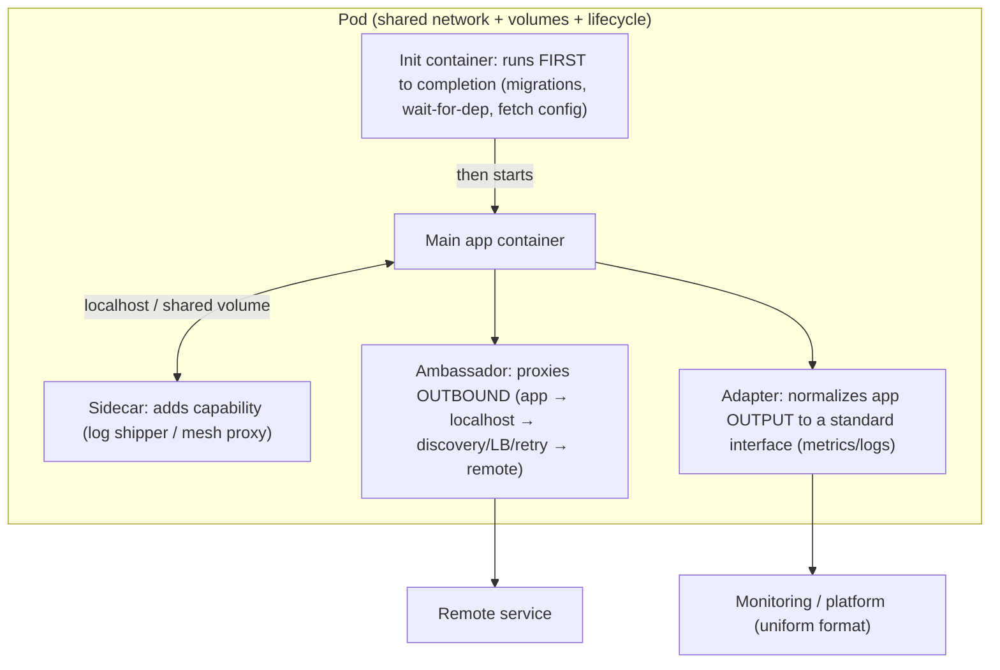
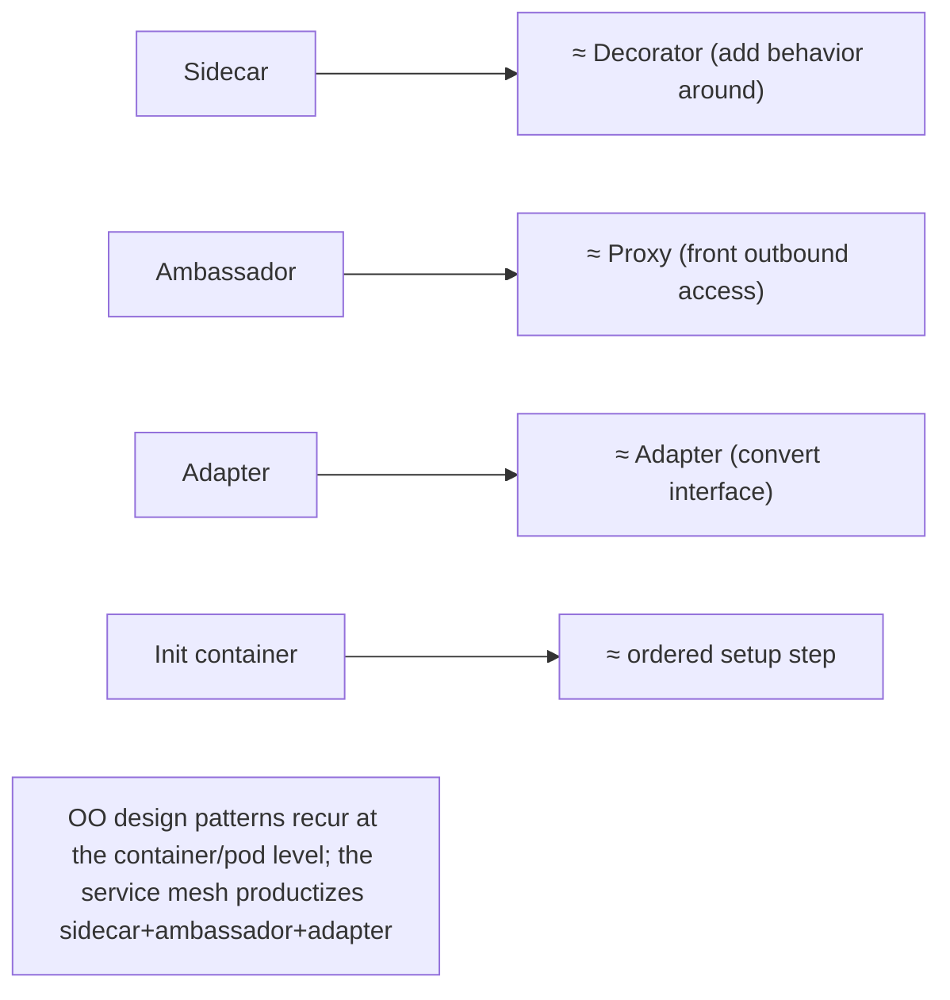

# Lesson 13.6 — Cloud-Native Patterns: Sidecar, Ambassador, Adapter, Init

> Part 13: Cloud Native · Difficulty: 🟡🔴
>
> **Prerequisites:** [2.4.2 Design Patterns for Systems], [12.7 Service Mesh], [13.2 Containers], [13.3 Kubernetes (Pods)].
> **Unlocks:** [13.7 Deployment Strategies], [Part 15 Security], [Part 16 Observability].

---

## 1. Learning Objectives

After this lesson you will be able to:

- Explain the **multi-container pod** as the enabler for composing behavior around a main container **without modifying it**.
- Apply the four canonical **single-node (pod-level) patterns**: **sidecar**, **ambassador**, **adapter**, and **init container** — what each does and when to use it.
- See these as the **decorator/proxy/adapter patterns** (2.4.2) applied at the **container level** — and how the **service mesh** (12.7) is the sidecar pattern productized.
- Distinguish these **structural composition** patterns from distributed/multi-node patterns.
- Weigh the costs (extra containers = resources, complexity, coupling of lifecycle) and know when a **library** is simpler.

---

## 2. Motivation — Compose behavior without touching the app

Cloud-native services accumulate cross-cutting operational needs — logging, metrics, TLS, service discovery, config sync, protocol translation, connecting to external services (12.7). You could bake all of this **into the application code** (a library — 12.7), but that couples infrastructure to business logic, must be reimplemented per language (polyglot — 12.1), and forces a rebuild/redeploy to change. The alternative that defines cloud-native architecture is **composition at the container level**: because a Kubernetes **pod** can contain **multiple containers that share the pod's network and storage** (13.3), you can run a **helper container alongside** the main app that adds a capability **transparently, without modifying the app** — and it works for **any language** and can be **reused** across services.

This is the same idea as the classic **decorator/proxy/adapter** design patterns (2.4.2) — but applied to **whole containers** instead of objects. Google's "Design Patterns for Container-Based Distributed Systems" (Burns & Oppenheimer) formalized the **single-node patterns**: **sidecar** (add a capability), **ambassador** (proxy outbound connections), **adapter** (normalize the app's output to a standard interface), and the lifecycle **init container** (run setup before the main app). The **service mesh** (12.7) is literally the sidecar pattern productized at scale. This lesson develops these four patterns as the vocabulary of cloud-native structural composition — powerful, but not free (each helper container costs resources and adds complexity, so a library is sometimes simpler).

---

## 3. Theory — From first principles

### 3.1 The multi-container pod — the enabler

`[CS]` A **pod** (13.3) can hold **multiple containers** that **share the pod's network namespace (localhost + ports), storage volumes, and lifecycle** `[CS]`:
- Containers in a pod are **co-located** (same node), **co-scheduled**, and **share resources** — they can communicate over `localhost` and via shared volumes.
- This lets you **attach helper containers** to a main app container that **augment it without modifying its code or image** — the container-level equivalent of the decorator pattern (2.4.2).
- `[BP]` **Key properties:** the helper is **language-agnostic** (works with any main-app language — the polyglot win, like the mesh — 12.7), **reusable** (the same helper image attaches to many services), and **independently updatable** (change the helper without touching the app). These properties are why cloud-native favors composition-by-container.

### 3.2 Sidecar — add a capability

`[CS]` The **sidecar** pattern: a helper container runs **alongside** the main container to **add functionality** (like a motorcycle's sidecar) `[CS]`:
- **Examples:** a **logging agent** that ships the app's logs (Part 16); a **service-mesh proxy** (12.7 — the canonical sidecar) doing mTLS/resilience/telemetry; a **config-sync** container that watches for config changes and updates a shared volume; a **metrics exporter**.
- **Mechanism:** the sidecar shares the pod (network/volumes), so it can observe/augment the main container (read its log files via a shared volume, proxy its traffic, refresh its config).
- `[BP]` **Value:** factor a cross-cutting concern **out of every app** into a **reusable, language-agnostic** container. This is the most important and general of the patterns (the other three are specializations of "a helper container beside the main one").

### 3.3 Ambassador — proxy outbound connections

`[CS]` The **ambassador** pattern: a sidecar that **proxies the main container's *outbound* connections** to the outside world, so the app talks to a **simple local endpoint** and the ambassador handles the complexity `[CS]`:
- The app connects to `localhost:port` (a simple, fixed local address); the **ambassador** handles the real-world complexity of reaching the remote service: **service discovery** (12.6), **load balancing** (3.3.1), **retries/circuit breaking** (11.3), **sharding/routing**, or **TLS**.
- **Example:** an app talks to `localhost:6379` for Redis; the ambassador routes to the correct shard / handles failover — the app stays oblivious to the topology.
- `[BP]` **Value:** the app is **simplified** (talks to localhost) and **decoupled** from the outside topology; the connection complexity lives in a reusable ambassador. (A mesh's sidecar does this for *all* outbound traffic — the ambassador is the focused, per-dependency version.)

### 3.4 Adapter — normalize the app's interface

`[CS]` The **adapter** pattern: a sidecar that **transforms the main container's output/interface into a standardized one** the outside world expects `[CS]`:
- Where the ambassador manages **outbound** connections, the adapter **normalizes what the app exposes** to a consistent external interface — the container-level **Adapter pattern** (2.4.2).
- **Example (the classic):** a **monitoring adapter** that reads the app's **custom/heterogeneous metrics format** and exposes it in the **standard format** the monitoring system scrapes (Part 16) — so every app, regardless of its native format, presents a uniform metrics interface. Or an adapter that reformats/aggregates logs into a standard schema.
- `[BP]` **Value:** heterogeneous apps present a **uniform interface** to the platform (metrics/logs/health), without changing each app — enabling consistent observability/operations across a polyglot fleet.

### 3.5 Init container — run setup before the app

`[CS]` An **init container** runs **to completion *before*** the main container(s) start — for **setup/prerequisite** tasks `[CS]`:
- Init containers run **sequentially**, each must **succeed** before the next (and before the app) starts — a **lifecycle** (not runtime-sidecar) pattern.
- **Examples:** **wait for a dependency** to be ready (a database/service), **run database migrations** or schema setup, **fetch config/secrets/assets** into a shared volume, **set permissions**, **register** with a service.
- `[BP]` **Value:** cleanly separates **one-time setup** from the running app — the app image stays focused on running, and setup logic (possibly needing different tools/privileges) lives in a separate init container that **doesn't linger** at runtime (unlike a sidecar). (The 12-factor "admin/one-off process" — 13.1 — often maps here or to a Job.)

### 3.6 These are design patterns at the container level

`[BP]` The unifying insight (2.4.2):
- **Sidecar ≈ Decorator** — add behavior around the component without changing it.
- **Ambassador ≈ Proxy** — stand in front of outbound access, handling the messy details.
- **Adapter ≈ Adapter** — convert one interface into the expected one.
- **Init container ≈ setup/template-method step** — ordered prerequisite before the main behavior.
- `[BP]` So the classic OO design patterns (2.4.2) reappear at the **container/pod** granularity — a nice illustration that architecture patterns recur at every scale (LLD→HLD — 2.4.5). And the **service mesh (12.7)** is the **sidecar+ambassador+adapter productized**: every pod gets a sidecar that proxies traffic (ambassador), adds mTLS/resilience (decorator/sidecar), and emits uniform telemetry (adapter).

### 3.7 Costs and when a library is simpler

`[BP]` Composition-by-container is powerful but not free `[BP]`:
- **Resource overhead:** each helper container consumes CPU/memory — multiplied across the fleet (like mesh sidecars — 12.7 §3.5).
- **Complexity:** more containers per pod → more to configure, monitor, and debug ("is it the app or the sidecar?").
- **Lifecycle coupling:** sidecars share the pod's lifecycle — sidecar crashes/ordering (startup/shutdown sequencing) can affect the app (K8s added native sidecar lifecycle support to address ordering). `[EMERGING]`
- **When a library is simpler** `[BP]`: for a **single-language** service or a lightweight concern, an in-process **library** (no extra container, no extra hop) may be simpler than a sidecar — the same library-vs-mesh tradeoff (12.7 §3.6). Use the pattern when the **language-agnostic, reusable, independently-updatable** benefits justify the overhead.
- `[BP]` **Rule:** reach for sidecar/ambassador/adapter when you want to **factor a cross-cutting concern out of many (polyglot) services reusably**; use a library for single-language, simple cases; use init containers for **one-time setup** regardless.

---

## 4. Visual Intuition

### The four patterns in a pod

### Mapping to design patterns (2.4.2)

---

## 5. Real-World Analogy

Think of a **star performer (the main app)** supported by a small crew who each attach to them without changing how the performer works.

- **The multi-container pod (§3.1):** the performer and crew travel together in **one tour bus** (the pod) — sharing the same schedule and space (network/volumes/lifecycle). The crew can help the performer precisely because they're right there beside them.
- **Sidecar = the personal assistant (§3.2):** an assistant rides along and **handles everything the performer shouldn't be bothered with** — carrying equipment, taking notes, recording the show (logging). The performer just performs; the assistant adds capabilities **without the performer changing a thing**. Hire the same *type* of assistant for many different performers (reusable, language-agnostic).
- **Ambassador = the agent handling outside calls (§3.3):** when the performer needs to reach the **outside world** (book a venue, deal with promoters), they don't navigate the chaos themselves — they tell their **agent** ("book me a show tonight"), and the agent handles finding the venue, negotiating, and rerouting if it falls through (discovery, load balancing, retries). The performer just makes a simple request to someone standing right next to them.
- **Adapter = the translator/press liaison (§3.4):** the performer speaks in their own idiosyncratic style, but the **press liaison converts it into the standard format** every journalist expects — so all performers, however quirky, present a **uniform interface** to the outside press (standardized metrics/logs).
- **Init container = the stage crew who set up before the show (§3.5):** before the performer walks on, a **setup crew** builds the stage, tests the sound, and confirms the venue is ready (run migrations, wait for dependencies, fetch config). They **finish and leave the stage** before the performance starts — they don't hang around during the show (unlike the assistant/sidecar).
- **The cost (§3.7):** every crew member is another salary and another person to coordinate on the bus. For a **big polyglot tour** with many performers, a standardized crew is worth it. For a **solo acoustic gig**, the performer might just carry their own guitar (a library) rather than hire a crew.

---

## 6. Industry Example

- **Service mesh sidecars (Envoy)** `[CONV]`: the canonical productized sidecar+ambassador+adapter — proxying traffic, adding mTLS/resilience, emitting uniform telemetry (§3.2/3.6, 12.7). *(Representative.)*
- **Logging/metrics sidecars & adapters** `[CONV]`: log-shipper sidecars and metrics-format adapters exposing a uniform interface to the observability stack (§3.2/3.4, Part 16). *(Representative.)*
- **Ambassador for data-store access** `[CONV]`: local proxy handling sharding/failover so apps connect to localhost (§3.3). *(Representative.)*
- **Init containers for migrations/wait-for-dependency** `[CONV]`: common pattern to run DB migrations or block until a dependency is ready before the app starts (§3.5). *(Representative.)*
- **Google's container design-patterns paper** `[CONV]`: Burns & Oppenheimer formalized single-node (sidecar/ambassador/adapter) and multi-node patterns (§3.6). *(Representative.)*

---

## 7. Implementation Details — applying the patterns

- **Use a sidecar** to factor a cross-cutting concern (logging/metrics/proxy/config-sync) out of a polyglot fleet reusably (§3.2); share via the pod's network/volumes.
- **Use an ambassador** to simplify + decouple the app's **outbound** access (localhost → discovery/LB/retry/TLS to remotes) (§3.3).
- **Use an adapter** to normalize the app's **exposed** interface (metrics/logs/health) to a platform standard (§3.4, Part 16).
- **Use init containers** for **one-time setup** that must complete before the app: migrations, wait-for-dependency, fetch config/secrets/assets, set permissions (§3.5).
- **Mind lifecycle/ordering** (§3.7): use K8s native sidecar support for correct startup/shutdown ordering; ensure sidecars start before / shut down after the app as appropriate (graceful drain — 13.1).
- **Budget resources** (§3.7): set requests/limits for helper containers (13.2/13.3); watch aggregate overhead across the fleet.
- **Prefer a library** for single-language, simple concerns where the sidecar overhead/hop isn't justified (§3.7, 12.7).
- **Reuse helper images** across services to maximize the payoff (§3.1).

---

## 8. Advantages

- **Language-agnostic + reusable** — one helper works for any app, across the fleet (§3.1) — the polyglot win.
- **Separation of concerns** — cross-cutting infra factored out of business code (§3.2, 12.7).
- **Independently updatable** — change the helper without touching/redeploying the app (§3.1).
- **App simplification** — ambassador hides outbound complexity; adapter standardizes output (§3.3/3.4).
- **Clean lifecycle setup** — init containers isolate one-time setup from runtime (§3.5).
- **Composable + standard** — well-known patterns the platform/ecosystem supports (§3.6).

---

## 9. Disadvantages / costs

- **Resource overhead** — each helper container costs CPU/memory × fleet (§3.7, 12.7).
- **Complexity** — more containers per pod to configure/monitor/debug (§3.7).
- **Lifecycle/ordering coupling** — sidecar startup/shutdown ordering can affect the app (§3.7).
- **Debugging harder** — "app or sidecar?" ambiguity (§3.7, 12.7).
- **Overkill for simple/single-language cases** — a library may be simpler (§3.7).
- **Latency (ambassador/proxy)** — an extra hop for proxied traffic (§3.3, 12.7).

---

## 10. When NOT to use these patterns

- **Single-language, lightweight concern** — a library is simpler (no extra container/hop) (§3.7).
- **Latency-critical outbound path** — an ambassador/proxy hop may be unacceptable (§3.3).
- **When the overhead isn't justified** — small deployments don't need a sidecar per pod (§3.7).
- **Business logic** — these patterns are for **infrastructure/cross-cutting** concerns, not business logic (which belongs in the app).
- **Runtime concerns via init containers** — init containers are for **setup that completes**, not ongoing work (use a sidecar for that) (§3.5).

---

## 11. Common Mistakes

1. **Putting business logic in a sidecar** — sidecars are for infra/cross-cutting concerns (§3.2/3.10).
2. **Sidecar for a single-language trivial concern** — a library would be simpler (§3.7).
3. **Ignoring startup/shutdown ordering** — app starts before its sidecar is ready, or sidecar dies mid-drain (§3.7).
4. **No resource limits on helpers** — aggregate overhead surprises + noisy neighbor (§3.7, 13.2).
5. **Using a sidecar for one-time setup** (should be an init container) — a lingering idle container (§3.5).
6. **Init container for ongoing work** (should be a sidecar) — it would block the app from starting (§3.5).
7. **Too many sidecars per pod** — resource/complexity bloat (§3.7).
8. **Reinventing the mesh** with hand-rolled sidecars when a mesh (12.7) would do it uniformly (§3.6).

---

## 12. Interview Questions

**🟢 Easy**
- What is a multi-container pod, and why does it enable these patterns?
- What is the sidecar pattern? Give an example.

**🟡 Medium**
- Compare sidecar, ambassador, and adapter — what does each do?
- What is an init container, and how does it differ from a sidecar?

**🔴 Hard**
- Map the four patterns to classic OO design patterns (decorator/proxy/adapter). How is a service mesh (12.7) these patterns productized?
- When would you use a sidecar vs an in-process library? What are the tradeoffs (resources, latency, lifecycle, polyglot)?

**⚫ Staff+**
- Design the pod composition for a polyglot microservice needing logging, metrics, mTLS, sharded-DB access, DB migrations on deploy, and wait-for-dependency startup. Which pattern for each concern, and how do lifecycle/ordering and resource budgets factor in?
- Argue when you'd adopt a full service mesh (uniform sidecars) vs hand-rolled per-pod sidecars vs libraries, considering fleet size, polyglot, and operational overhead.

---

## 13. Production Pitfalls

- **Startup race:** the app started and made calls before its mesh/ambassador sidecar was ready → connection failures at boot (§3.7).
- **Shutdown race:** the sidecar (network proxy) terminated before the app finished draining → dropped in-flight requests during scale-in/deploy (§3.7, 13.1).
- **Resource blowout:** many sidecars across a large fleet consumed unexpected aggregate CPU/memory (§3.7, 12.7).
- **Init container blocking:** a wait-for-dependency init container hung because the dependency never came up → pods stuck initializing (§3.5).
- **Debugging confusion:** an incident was hard to diagnose because it was unclear whether the app or a sidecar was failing (§3.7).
- **Sidecar as SPOF:** a buggy logging sidecar crash-looped the whole pod due to shared lifecycle (§3.7).

---

## 14. Optimization Techniques

- **Use a mesh** (12.7) to standardize sidecar concerns (mTLS/resilience/observability) instead of bespoke sidecars (§3.6).
- **Reuse helper images** across services for consistency + cache efficiency (§3.1, 13.2).
- **Right-size helper resources** and keep them lightweight (§3.7).
- **Correct lifecycle ordering** (native sidecar support) for clean startup/drain (§3.7, 13.1).
- **Prefer libraries** for single-language, latency-critical, or trivial concerns (§3.7).
- **Init containers for setup** to keep the app image focused and runtime lean (§3.5).
- **Adapter for uniform observability** so the platform ingests one format from a polyglot fleet (§3.4, Part 16).

---

## 15. Summary

Cloud-native architecture composes behavior **at the container level**: a Kubernetes **pod** can hold **multiple containers sharing its network (localhost/ports), storage, and lifecycle** (13.3), so you can attach a **helper container beside the main app** that augments it **without modifying its code or image** — **language-agnostic**, **reusable** across services, and **independently updatable** (the polyglot win, same as the mesh — 12.7). Four canonical single-node patterns (Google's container design-patterns lineage): the **sidecar** adds a capability alongside the main container (log shipper, config-sync, **the service-mesh proxy** — the canonical one); the **ambassador** proxies the app's **outbound** connections so the app talks to a simple `localhost` endpoint while the ambassador handles **discovery/load-balancing/retries/TLS/sharding** (decoupling the app from external topology); the **adapter** normalizes what the app **exposes** into a **standard interface** the platform expects (e.g., converting a custom metrics format to the standard one so a polyglot fleet presents uniform observability); and the **init container** runs **to completion before** the main app for **one-time setup** (migrations, wait-for-dependency, fetch config/secrets) — a lifecycle pattern that finishes and leaves, unlike a runtime sidecar. These are the **classic OO design patterns at container granularity** — sidecar≈decorator, ambassador≈proxy, adapter≈adapter, init≈ordered setup step (a nice recurrence of patterns across scales — 2.4.2/2.4.5) — and the **service mesh (12.7) is sidecar+ambassador+adapter productized** across the whole fleet. They're powerful but **not free**: each helper container costs **resources** (× the fleet), adds **complexity** (more to configure/debug — "app or sidecar?"), and couples **lifecycle/ordering** (sidecar startup/shutdown sequencing can affect the app — hence native sidecar lifecycle support). So reach for these patterns when you want to **factor a cross-cutting concern out of many polyglot services reusably**; prefer an in-process **library** for single-language, latency-critical, or trivial concerns (the same library-vs-mesh tradeoff — 12.7); and use **init containers for one-time setup** regardless. They belong to **infrastructure/cross-cutting** concerns — never business logic, which stays in the app.

---

## 16. Revision Notes (flashcard-ready)

- **Q:** What enables these patterns? **A:** Multi-container pods — containers share the pod's network/storage/lifecycle, so a helper can augment the app without modifying it.
- **Q:** Sidecar? **A:** Helper container beside the main one adding a capability (log shipper, mesh proxy, config-sync) — language-agnostic + reusable.
- **Q:** Ambassador? **A:** Sidecar proxying the app's OUTBOUND connections (app → localhost → discovery/LB/retry/TLS → remote) — decouples app from topology.
- **Q:** Adapter? **A:** Sidecar normalizing the app's EXPOSED interface (metrics/logs) to a platform standard for uniform observability.
- **Q:** Init container? **A:** Runs to completion BEFORE the app (migrations, wait-for-dep, fetch config); a lifecycle pattern, doesn't linger.
- **Q:** Sidecar vs init container? **A:** Sidecar runs alongside at runtime; init runs first, once, to completion, then exits.
- **Q:** Map to OO patterns? **A:** Sidecar≈Decorator, Ambassador≈Proxy, Adapter≈Adapter, Init≈ordered setup step.
- **Q:** Relation to service mesh? **A:** The mesh (12.7) is sidecar+ambassador+adapter productized across the fleet.
- **Q:** Costs? **A:** Resource overhead × fleet, complexity, lifecycle/ordering coupling, debugging ambiguity.
- **Q:** Sidecar vs library? **A:** Sidecar for polyglot/reusable cross-cutting concerns; library for single-language/latency-critical/trivial cases.

---

## 17. Further Reading + Knowledge-Graph Links

**Foundations (in-platform):**
- **[2.4.2 Design Patterns for Systems]** — decorator/proxy/adapter these mirror.
- **[13.2 Containers]** & **[13.3 Kubernetes (Pods)]** — the multi-container pod enabler.
- **[12.7 Service Mesh]** — the sidecar pattern productized.

**Unlocks / next:**
- **[13.7 Deployment Strategies]** — lifecycle/rollout interactions.
- **[Part 15 Security]** — mTLS/secrets sidecars.
- **[Part 16 Observability]** — logging/metrics sidecars + adapters.

**External (canonical):**
- Burns & Oppenheimer, "Design Patterns for Container-Based Distributed Systems." *(Representative.)*
- Kubernetes docs (init containers, sidecar containers, multi-container pods). *(Representative.)*
- Davis, *Cloud Native Patterns*.

> **Knowledge-graph:** `2.4.2 OO patterns` + `13.3 pods` → **`13.6 cloud-native patterns`** (sidecar/ambassador/adapter/init) → productized as `12.7 service mesh`; feeds `Part 16 observability`.
