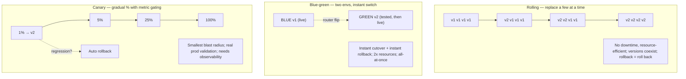
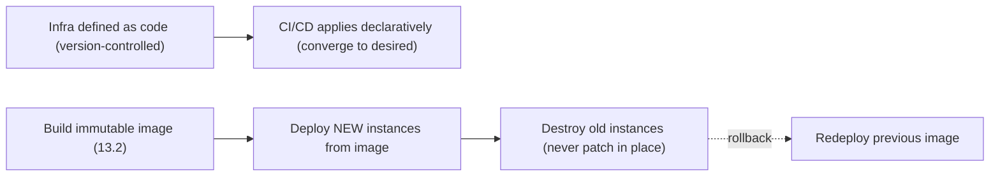

# Lesson 13.7 — Infrastructure as Code, Immutable Infrastructure, Deployment Strategies (Blue-Green, Canary, Rolling)

> Part 13: Cloud Native · Difficulty: 🟡🔴
>
> **Prerequisites:** [11.2 Redundancy/Failover], [12.8 Testing (canary/testing in prod)], [13.1 Cloud-Native/12-Factor], [13.2 Containers], [13.3 Kubernetes].
> **Unlocks:** [13.8 Multi-Region], [Part 14 SRE (progressive delivery)], [Part 16 Observability].

---

## 1. Learning Objectives

After this lesson you will be able to:

- Explain **Infrastructure as Code (IaC)** — declaratively defining infrastructure in version-controlled code — and its declarative vs imperative models.
- Explain **immutable infrastructure** — never modify running servers; replace them with new ones from images — and why it eliminates configuration drift.
- Describe and choose among the core **deployment strategies**: **rolling**, **blue-green**, and **canary** — and their rollback and risk profiles.
- Connect deployment strategies to **zero-downtime** goals (readiness probes — 13.3), **testing in production** (12.8), and **progressive delivery** (Part 14).
- Weigh cost/complexity/risk tradeoffs and pick a strategy per situation.

---

## 2. Motivation — Change safely and reproducibly

Cloud-native systems change **constantly** — new versions, config changes, scaling, infrastructure updates — and the whole promise (13.1) is **frequent, low-risk, high-impact change**. Two disciplines make that possible, and a family of deployment strategies makes the actual releases safe.

First, **how do you define and manage the infrastructure itself**? Clicking around a cloud console ("ClickOps") to create servers, networks, and load balancers is unreproducible, undocumented, error-prone, and impossible to review or roll back. **Infrastructure as Code (IaC)** fixes this: define infrastructure in **version-controlled code**, apply it automatically, and get the same reproducibility, review, and history you have for application code.

Second, **how do you manage the servers over time**? The traditional approach — SSH in and patch/update running servers (**mutable infrastructure**) — leads to **configuration drift**: each server accumulates a unique, undocumented history of manual changes until no two are alike (the pets problem — 13.1), making failures unreproducible and updates terrifying. **Immutable infrastructure** fixes this: **never modify a running server** — to change anything, build a **new image** (13.2) and **replace** the server entirely (cattle — 13.1).

Third, **how do you roll out a new version without downtime or unacceptable risk**? Replacing all instances at once causes downtime and a huge blast radius if the new version is bad. The **deployment strategies** — **rolling**, **blue-green**, and **canary** — trade off downtime, cost, risk, and rollback speed to release safely. This lesson develops IaC, immutable infrastructure, and the deployment strategies as the discipline of safe, reproducible change.

---

## 3. Theory — From first principles

### 3.1 Infrastructure as Code (IaC)

`[CS]` **IaC** = defining and managing infrastructure (servers, networks, load balancers, DNS, K8s resources, policies) through **machine-readable, version-controlled code/config** rather than manual console clicks `[CS]`:
- **Benefits** `[BP]`: **reproducibility** (recreate an identical environment anywhere), **version control** (history, diffs, review, blame), **peer review** (PRs for infra changes), **automation** (apply via CI/CD), **documentation** (the code *is* the spec), and **disaster recovery** (rebuild from code — 11.8).
- **Declarative vs imperative:**
  - **Declarative** (preferred — e.g., Terraform, CloudFormation, K8s manifests): describe the **desired end state**; the tool computes and applies the diff to reach it (like K8s reconciliation — 13.3). Idempotent, converges.
  - **Imperative** (scripts): specify **step-by-step commands**; you manage the ordering/state. More error-prone; not idempotent by default.
- **State:** declarative tools track **state** (what exists) to compute diffs — managing this state (locking, remote storage) is an operational concern.
- `[BP]` **Anti-pattern:** **ClickOps** — manual console changes — creates untracked, unreproducible **drift** (§3.2) between reality and code. IaC + no manual changes = the discipline.

### 3.2 Immutable infrastructure

`[CS]` **Immutable infrastructure**: once deployed, a server/instance is **never modified in place** — to change anything (code, config, patches), you **build a new image and replace** the instance entirely `[CS]`:
- Contrast **mutable infrastructure**: SSH in and update running servers → each accumulates unique manual changes → **configuration drift** (no two servers alike; "works on that server"; unreproducible failures) — the **pets** problem (13.1).
- **Immutable** means: build a versioned **image** (container image — 13.2, or a VM image), deploy instances from it, and to update, **build a new image → deploy new instances → destroy old ones** (never patch in place).
- **Benefits** `[BP]`: **no drift** (every instance identical, from a known image), **reproducibility** (the image is the artifact — 13.1), **easy rollback** (redeploy the previous image), **reliability** (known-good state), **simpler reasoning** (no hidden manual history). This *is* the cattle-not-pets model (13.1) applied to infrastructure.
- `[BP]` Containers (13.2) make immutability natural (images are immutable by construction); combined with IaC (§3.1), you get **fully reproducible, drift-free** systems.

### 3.3 The deployment problem

`[CS]` Given immutable instances, how do you **replace the old version with the new** safely? Naive **"stop all old, start all new"** causes `[CS]`:
- **Downtime** (a gap with no serving instances).
- **Huge blast radius** if the new version is broken (everyone hits it at once).
- **Slow/hard rollback** (must redeploy old everywhere).
The deployment strategies (§3.4–3.6) solve these with different tradeoffs, all relying on **health checks / readiness** (13.3) to only send traffic to healthy new instances.

### 3.4 Rolling deployment

`[CS]` **Rolling update** (K8s Deployment default — 13.3): gradually replace old instances with new ones, **a few at a time** `[CS]`:
- Bring up **some** new instances, wait for **readiness** (13.3), route traffic to them, then **remove some old** ones — repeat until fully replaced. Controlled by `maxSurge` (how many extra during rollout) and `maxUnavailable` (how many can be down).
- **Pros:** **no downtime**, **no extra full environment** (resource-efficient — only a small surge), simple, built-in.
- **Cons:** **old and new run simultaneously** during the rollout (must be **compatible** — API/schema — 12.3/5.4.3); **rollback is another rolling update** (not instant); harder to precisely control exposure; a bad version still reaches a growing share as it rolls.
- `[BP]` The **sensible default** for stateless services; requires **backward/forward-compatible** changes (12.3/5.4.3) since versions coexist.

### 3.5 Blue-green deployment

`[CS]` **Blue-green**: run **two complete environments** — **blue** (current/live) and **green** (new version) — and **switch all traffic** from blue to green at once (via the load balancer/router) `[CS]`:
- Deploy the new version to the **idle** environment (green), **test it** fully (even in prod, no user traffic), then **flip the router** blue→green instantly. Keep blue around for **instant rollback** (flip back).
- **Pros:** **instant cutover + instant rollback** (just switch the router), **test green before exposing users**, **no version-mixing** during normal operation (clean).
- **Cons:** **doubles resources** during the deploy (two full environments — costly), the **cutover is all-at-once** (all users hit new at the flip — so test green well), and **stateful/DB migrations** are tricky (both point at the same DB, or you need careful data handling — 5.4.3).
- `[BP]` Great when you need **instant rollback** and can afford double resources; the DB is the hard part (the two environments usually share it — needs compatible schema).

### 3.6 Canary deployment

`[CS]` **Canary** (named after "canary in a coal mine"): release the new version to a **small subset of traffic/users first**, **observe**, then **gradually increase** if healthy (or **roll back** if not) `[CS]`:
- Route, say, **1% → 5% → 25% → 100%** of traffic to the new version over time, **watching metrics** (error rate, latency — golden signals — Part 14/16) at each step; **automatically roll back** on regression.
- **Pros:** **smallest blast radius** (only the canary % is exposed to a bad version), **real production validation** (real traffic/data — testing in production, 12.8), **gradual + data-driven**, safe.
- **Cons:** **more complex** (traffic splitting, metric analysis, automation), **slower** rollout, versions **coexist** (compatibility needed — 12.3), needs **good observability** (Part 16) to judge health.
- `[BP]` The **gold standard for risk reduction** — often automated via a **service mesh** (12.7 — weighted traffic) or deployment tooling, with **automated rollback** on metric regression. It's the concrete form of **progressive delivery** (Part 14) and **testing in production** (12.8).

### 3.7 Choosing + supporting techniques

`[BP]` Choosing a strategy and the techniques that support them all:
- **Rolling** — default for most stateless services; efficient, no downtime; needs compatible versions.
- **Blue-green** — when you need **instant rollback** / clean cutover and can afford double cost; watch the DB.
- **Canary** — when **risk reduction** matters most and you have observability + automation; the safest for high-stakes changes.
- **Feature flags (complementary)** `[BP]`: **decouple deploy from release** — ship code dark, then **turn features on gradually** (per user/%), and **kill instantly** without a redeploy. Combine with any strategy for finer control and instant "rollback" of a feature (not the whole deploy).
- **All strategies require:**
  - **Readiness probes** (13.3) so traffic only hits healthy new instances → **zero downtime**.
  - **Backward/forward-compatible changes** (12.3/5.4.3) because versions coexist during rollout — especially **expand/contract** for DB schema (5.4.3).
  - **Observability** (Part 16) to judge health and trigger rollback.
  - **Automated rollback** on failure (fast MTTR — 11.1).
- `[BP]` These deployment strategies are **testing in production done safely** (12.8) and the mechanics of **progressive delivery** (Part 14).

---

## 4. Visual Intuition

### The three strategies

### IaC + immutable pipeline

---

## 5. Real-World Analogy

Think of managing a fleet of **rental cars** and rolling out a **new car model** to customers.

- **IaC vs ClickOps (§3.1):** a sloppy manager **walks the lot and tweaks each car by hand**, remembering nothing (ClickOps) — soon no two cars are set up alike and no one can reproduce a configuration. A disciplined manager keeps a **written master specification** in a binder under version control (IaC): every car is built to spec, changes are proposed as **edits to the binder** (reviewed, dated), and you can **rebuild the entire fleet from the binder** after a disaster.
- **Immutable vs mutable (§3.2):** the sloppy manager **repairs and modifies cars in place** over years (mutable) → each car drifts into a unique, mysterious state (pets). The disciplined manager **never modifies a car** — to change anything, they **build a brand-new car to the new spec and scrap the old one** (immutable/cattle). Every car on the road is identical and reproducible, and "rolling back" just means **bringing back the previous model**.
- **Rolling deployment (§3.4):** to introduce the new model, they **swap out a few old cars for new ones at a time**, checking each new car works (readiness) before retiring more old ones — customers always have cars available (no downtime), and only a handful of new/old mix at once. But if the new model is bad, it's **already spreading**, and reverting means another slow swap.
- **Blue-green (§3.5):** they keep **two entire identical fleets** — the **blue** fleet serving customers and a **green** fleet with the new model, fully **test-driven on a closed track**. At go-time they **redirect all customers to the green fleet at once** (flip the sign), keeping blue parked for an **instant switch-back** if green misbehaves. Costly (two fleets) and everyone changes at once — so test green thoroughly.
- **Canary (§3.6):** they give the **new model to just a few trusted customers first** (1%), **watch closely** for complaints/breakdowns (metrics), then hand it to **more and more** if all's well — or **quietly recall it** from the few if there's a problem, before most customers ever saw it. Safest, but slower and needs good monitoring.
- **Feature flags (§3.7):** the new cars ship with a **new feature switched off**; the manager can **enable it for a few drivers via remote toggle** and **switch it off instantly** if it's trouble — without recalling or rebuilding any car (decoupling shipping the car from enabling the feature).

---

## 6. Industry Example

- **Terraform / CloudFormation / Pulumi (IaC)** `[CONV]`: declarative, version-controlled infrastructure with state + plan/apply diffs (§3.1). *(Representative.)*
- **Immutable images + golden AMIs / container images** `[CONV]`: build once, deploy, replace — never patch in place (§3.2, 13.2). *(Representative.)*
- **Kubernetes rolling updates (Deployment)** `[CONV]`: default zero-downtime rollout with maxSurge/maxUnavailable + readiness gating (§3.4, 13.3). *(Representative.)*
- **Canary + progressive delivery tools (Argo Rollouts / Flagger + service mesh)** `[CONV]`: automated weighted canaries with metric analysis + auto-rollback (§3.6, 12.7/Part 14). *(Representative.)*
- **Feature-flag platforms** `[CONV]`: decouple deploy from release; gradual rollout + instant kill (§3.7). *(Representative.)*

---

## 7. Implementation Details

- **Define all infra as code** (§3.1): declarative (Terraform/K8s manifests), version-controlled, applied via CI/CD (GitOps); **no manual console changes** (avoid drift).
- **Immutable everything** (§3.2): build versioned images (13.2), deploy new + destroy old; never patch running instances; keep previous images for rollback.
- **Default to rolling** (§3.4) for stateless services with maxSurge/maxUnavailable; ensure **compatible** versions (12.3/5.4.3).
- **Use blue-green** (§3.5) when instant rollback/clean cutover is needed and you can afford 2x; handle the shared DB carefully (compatible schema — 5.4.3).
- **Use canary** (§3.6) for high-risk changes: weighted traffic (mesh — 12.7) + **metric-gated** promotion + **automated rollback**; requires observability (Part 16).
- **Layer feature flags** (§3.7) to decouple deploy from release and enable instant feature kill.
- **Zero-downtime prerequisites**: correct **readiness probes** (13.3), **graceful shutdown/drain** (13.1), and **backward/forward-compatible + expand/contract** DB migrations (5.4.3).
- **Automate rollback** on health regression (fast MTTR — 11.1).

---

## 8. Advantages

- **IaC:** reproducible, reviewable, versioned, automatable, DR-ready infrastructure (§3.1, 11.8).
- **Immutable:** no drift, reproducible, easy rollback, reliable, simple to reason about (§3.2).
- **Rolling:** zero downtime, resource-efficient, built-in default (§3.4).
- **Blue-green:** instant cutover + instant rollback, pre-cutover testing (§3.5).
- **Canary:** smallest blast radius, real prod validation, data-driven + gradual (§3.6).
- **Feature flags:** decouple deploy/release, instant feature kill, targeted rollout (§3.7).

---

## 9. Disadvantages / costs

- **IaC:** learning curve, state management, drift if manual changes sneak in (§3.1).
- **Immutable:** requires image-based workflow + fast provisioning; stateful data needs care (§3.2, 13.4).
- **Rolling:** version coexistence (compatibility burden), non-instant rollback, coarse exposure control (§3.4).
- **Blue-green:** 2x resource cost, all-at-once cutover risk, DB migration complexity (§3.5).
- **Canary:** complex (traffic splitting + metric analysis + automation), slower, needs strong observability (§3.6).
- **All:** require compatible changes + readiness + observability + automated rollback to be safe (§3.7).

---

## 10. When NOT to use each

- **Don't do ClickOps** for anything you need reproducible/reviewable — use IaC (§3.1).
- **Don't patch running instances** in an immutable model — rebuild + replace (§3.2).
- **Rolling:** avoid when you can't make versions compatible or need instant rollback (§3.4).
- **Blue-green:** avoid when you can't afford double resources or the all-at-once cutover risk is too high for a huge change (prefer canary) (§3.5).
- **Canary:** overkill for low-risk changes or when you lack the observability/automation to judge health (§3.6).
- **Don't deploy incompatible schema changes** with any coexistence strategy — use expand/contract (5.4.3).

---

## 11. Common Mistakes

1. **ClickOps drift** — manual console changes diverging from IaC → unreproducible, surprising (§3.1).
2. **Mutable/patched servers** — drift, "works on that box," terrifying updates (§3.2).
3. **Incompatible changes during rollout** — coexisting versions break because the change wasn't backward/forward-compatible (§3.4/3.7, 12.3/5.4.3).
4. **Missing readiness probes** — traffic hits not-ready new instances during rollout → errors (§3.7, 13.3).
5. **Blue-green DB mishandling** — schema change breaks blue or green (both share the DB) (§3.5, 5.4.3).
6. **Canary without automated rollback / good metrics** — a bad canary lingers or isn't caught (§3.6).
7. **No graceful shutdown** — old instances drop in-flight requests when killed (§3.7, 13.1).
8. **Big-bang "stop all, start all"** — downtime + huge blast radius (§3.3).

---

## 12. Interview Questions

**🟢 Easy**
- What is Infrastructure as Code, and why is it better than manual console changes?
- What is immutable infrastructure, and what problem (drift) does it solve?

**🟡 Medium**
- Compare rolling, blue-green, and canary deployments on downtime, cost, blast radius, and rollback speed.
- Why must changes be backward/forward-compatible during a rolling or canary deployment?

**🔴 Hard**
- How does canary deployment reduce risk, and what does it require (traffic splitting, metrics, automated rollback, observability)? How does it relate to testing in production (12.8)?
- How do you do zero-downtime deployment with a database schema change (expand/contract — 5.4.3) across coexisting versions?

**⚫ Staff+**
- Design a safe deployment pipeline for a high-traffic microservice: IaC + immutable images + which deployment strategy + feature flags + readiness/graceful-shutdown + schema-migration handling + automated metric-gated rollback. Justify the strategy choice.
- A blue-green deploy caused an outage because a schema migration broke the still-live blue environment. Diagnose and redesign the release to handle DB changes safely across environments/versions.

---

## 13. Production Pitfalls

- **Drift-induced incident:** a manual console change wasn't in IaC → the next `apply` reverted it or behaved unexpectedly (§3.1).
- **Rollout breaks on version coexistence:** a non-compatible API/schema change broke requests hitting the mixed old/new fleet (§3.4, 12.3/5.4.3).
- **Traffic to unready pods:** missing/incorrect readiness probe sent traffic to new instances mid-startup → errors (§3.7, 13.3).
- **Blue-green DB break:** an incompatible migration applied for green broke the live blue environment sharing the DB (§3.5, 5.4.3).
- **Undetected bad canary:** weak metrics/no auto-rollback let a subtly-broken canary slowly harm users (§3.6, Part 16).
- **Dropped requests on cutover/scale-in:** no graceful drain when old instances were killed (§3.7, 13.1).
- **Slow rollback:** rolling rollback took as long as the rollout while users suffered (§3.4) — a case for blue-green/canary.

---

## 14. Optimization Techniques

- **Declarative IaC + GitOps** for reproducibility, review, and fast DR rebuild (§3.1, 11.8).
- **Immutable images + fast provisioning** for drift-free, instantly-rollback-able deploys (§3.2, 13.2).
- **Canary with automated metric-gated promotion/rollback** (via mesh — 12.7) for lowest-risk high-stakes changes (§3.6).
- **Feature flags** to decouple deploy/release and enable instant, targeted rollout/kill (§3.7).
- **Expand/contract schema migrations** for zero-downtime DB changes across versions (5.4.3).
- **Readiness probes + graceful shutdown** for true zero-downtime rollouts (§3.7, 13.1/13.3).
- **Blue-green for instant rollback** where the 2x cost is acceptable (§3.5).

---

## 15. Summary

Cloud-native's promise of **frequent, low-risk change** (13.1) rests on three disciplines. **Infrastructure as Code (IaC)** defines infrastructure in **version-controlled, machine-readable code** rather than manual console clicks — yielding **reproducibility, review, history, automation, documentation, and DR** (11.8) — and is best done **declaratively** (describe desired state; the tool converges — like K8s reconciliation — 13.3) rather than imperatively; the anti-pattern is **ClickOps**, whose manual changes cause untracked **drift**. **Immutable infrastructure** means **never modifying a running server** — to change anything, **build a new image (13.2) and replace** the instance — eliminating the **configuration drift** of mutable (SSH-and-patch) servers where each becomes a unique **pet**; immutability gives **no drift, reproducibility, easy rollback (redeploy the prior image), and reliability** — the cattle-not-pets model (13.1) for infrastructure, natural with containers. Given immutable instances, **deployment strategies** replace old with new **safely** (naive "stop all, start all" = downtime + huge blast radius): **rolling** (replace a few at a time — zero downtime, resource-efficient, the default, but versions **coexist** so changes must be **compatible** and rollback is another slow roll); **blue-green** (two full environments, **instant router flip** blue→green with **instant rollback** and pre-cutover testing — but **2x cost**, all-at-once cutover, and tricky shared-DB migrations); and **canary** (release to a **small % first**, **watch metrics**, **gradually increase or auto-roll-back** — the **smallest blast radius** and real production validation, the gold standard for risk reduction, but complex and observability-dependent). **Feature flags** complement all of them by **decoupling deploy from release** (ship dark, enable gradually, kill instantly). Every strategy requires the same foundations to be safe: **readiness probes** (13.3) for zero downtime, **backward/forward-compatible + expand/contract** changes (12.3/5.4.3) because versions coexist, **observability** (Part 16) to judge health, and **automated rollback** for fast MTTR (11.1). Together, IaC + immutability + these strategies are **testing in production done safely** (12.8) and the mechanics of **progressive delivery** (Part 14) — reproducible, drift-free, low-risk change.

---

## 16. Revision Notes (flashcard-ready)

- **Q:** IaC? **A:** Infrastructure defined in version-controlled code; reproducible, reviewable, automatable; declarative (desired state) preferred over imperative.
- **Q:** ClickOps problem? **A:** Manual console changes → untracked drift, unreproducible, unreviewable.
- **Q:** Immutable infrastructure? **A:** Never modify a running server; rebuild a new image and replace it → no drift, reproducible, easy rollback (cattle).
- **Q:** Rolling deployment? **A:** Replace a few instances at a time; zero downtime, efficient; versions coexist (need compatibility); rollback = another roll.
- **Q:** Blue-green? **A:** Two full envs; flip router blue→green instantly (instant rollback + pre-test); 2x cost, all-at-once, DB-tricky.
- **Q:** Canary? **A:** Release to small % first, watch metrics, gradually increase or auto-roll-back; smallest blast radius; needs observability.
- **Q:** Feature flags? **A:** Decouple deploy from release — ship dark, enable gradually, kill instantly, no redeploy.
- **Q:** Why must changes be compatible during rollout? **A:** Old + new versions coexist → backward/forward-compatible + expand/contract schema (12.3/5.4.3).
- **Q:** Zero-downtime prerequisites? **A:** Readiness probes + graceful shutdown + compatible changes + observability + automated rollback.
- **Q:** Which strategy for lowest risk? **A:** Canary (metric-gated, auto-rollback) — smallest blast radius; blue-green for instant rollback.

---

## 17. Further Reading + Knowledge-Graph Links

**Foundations (in-platform):**
- **[13.1 Cloud-Native/12-Factor]** — build/release/run, immutable artifact, cattle.
- **[13.2 Containers]** — the immutable image.
- **[13.3 Kubernetes]** — rolling updates, readiness probes, reconciliation.
- **[5.4.3 Schema Migrations Without Downtime]** — expand/contract across versions.
- **[12.8 Testing]** — canary as testing in production.

**Unlocks / next:**
- **[13.8 Multi-Region]** — deploying across regions/zones.
- **[Part 14 SRE]** — progressive delivery, release engineering, error budgets.
- **[Part 16 Observability]** — metrics that gate canaries + trigger rollback.

**External (canonical):**
- Terraform / Kubernetes / Argo Rollouts / Flagger documentation. *(Representative.)*
- Humble & Farley, *Continuous Delivery*. *(Representative.)*
- Morris, *Infrastructure as Code*. *(Representative.)*

> **Knowledge-graph:** `13.2 immutable images` + `13.1 build/release/run` → **`13.7 IaC + immutable infra + deployment strategies`** (rolling/blue-green/canary + flags) → `Part 14 progressive delivery`, gated by `Part 16 observability`.
